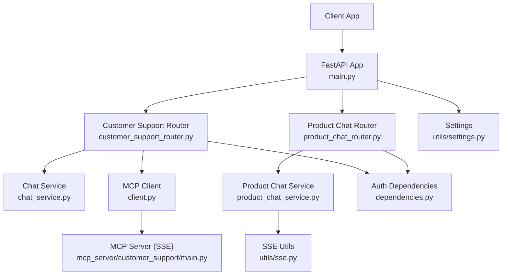
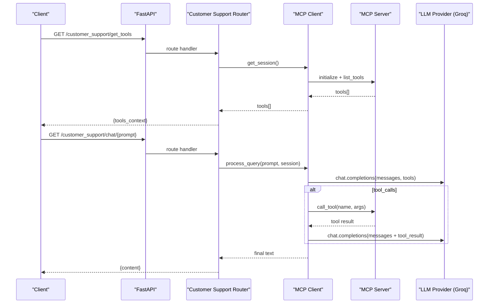
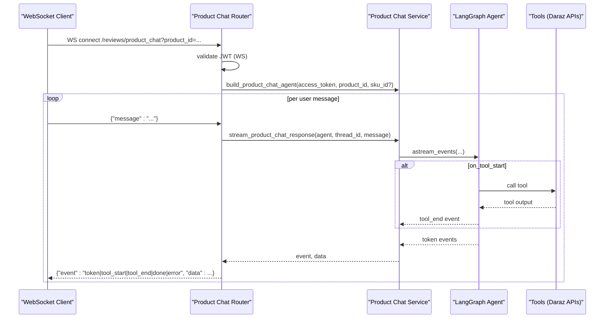
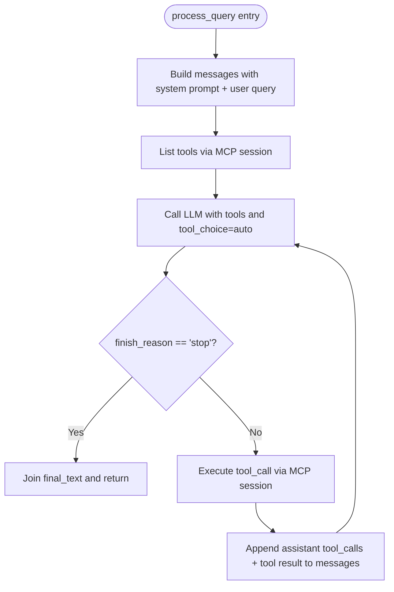
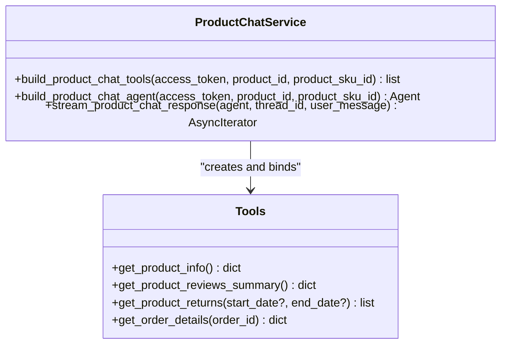
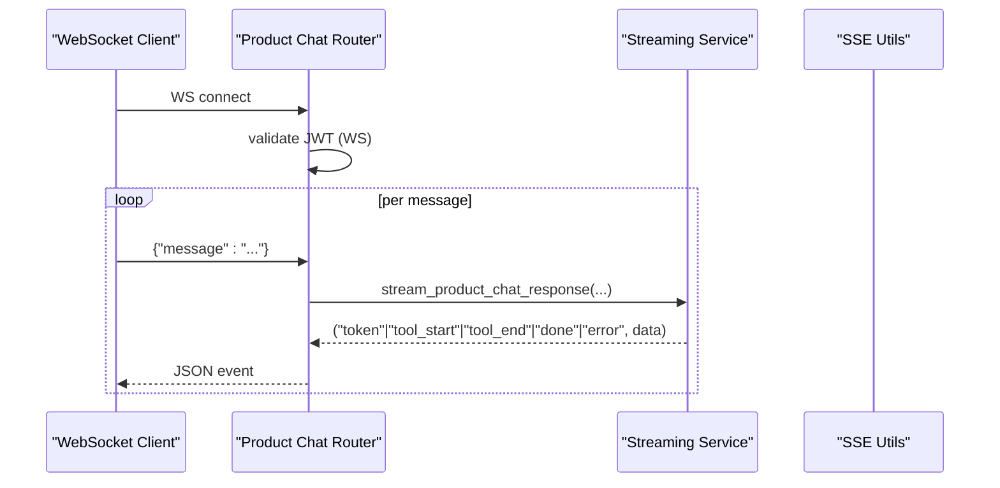
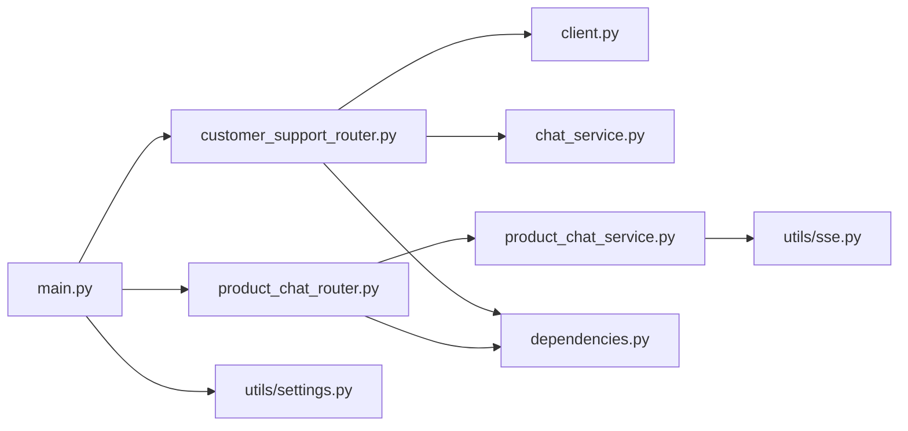

# AI Customer Support

<cite>
**Referenced Files in This Document**
- [main.py](file://neurocom_backend/main.py)
- [customer_support_router.py](file://neurocom_backend/routers/customer_support_router.py)
- [product_chat_router.py](file://neurocom_backend/routers/product_chat_router.py)
- [chat_service.py](file://neurocom_backend/services/chat_service.py)
- [product_chat_service.py](file://neurocom_backend/services/product_chat_service.py)
- [client.py](file://neurocom_backend/mcp_server/client.py)
- [mcp_server main.py](file://neurocom_backend/mcp_server/customer_support/main.py)
- [sse.py](file://neurocom_backend/utils/sse.py)
- [dependencies.py](file://neurocom_backend/dependencies.py)
- [settings.py](file://neurocom_backend/utils/settings.py)
- [README.md](file://README.md)
</cite>

## Table of Contents
1. Introduction
2. Project Structure
3. Core Components
4. Architecture Overview
5. Detailed Component Analysis
6. Dependency Analysis
7. Performance Considerations
8. Troubleshooting Guide
9. Conclusion
10. Appendices

## Introduction
This document explains the AI-powered customer support system in the Tijarah AI Backend. It covers two complementary chat experiences:
- A general customer support flow that uses LangChain-style tool-calling with an MCP (Model Context Protocol) server to execute business tools and generate context-aware responses.
- A product-focused conversational agent for a single Daraz product, built with LangGraph, streaming events over WebSockets, and scoped tools to ensure safe, accurate answers about reviews, catalog details, and returns.

The system integrates LLM providers via OpenAI-compatible clients (Groq and OpenRouter), manages conversations with per-session memory, and exposes real-time communication through WebSockets and SSE.

## Project Structure
At a high level:
- FastAPI application mounts routes and an embedded MCP SSE server under /mcp.
- Routers expose HTTP endpoints and WebSocket endpoints for chat.
- Services implement LLM calls, agent orchestration, and streaming event pipelines.
- The MCP server defines tools and resources exposed to the LLM via MCP.
- Utilities provide SSE helpers and shared settings.

**Diagram sources**
- [main.py:30-37](file://neurocom_backend/main.py#L30-L37)
- [customer_support_router.py:31-61](file://neurocom_backend/routers/customer_support_router.py#L31-L61)
- [product_chat_router.py:24-70](file://neurocom_backend/routers/product_chat_router.py#L24-L70)
- [chat_service.py:1-30](file://neurocom_backend/services/chat_service.py#L1-L30)
- [product_chat_service.py:1-32](file://neurocom_backend/services/product_chat_service.py#L1-L32)
- [client.py:17-50](file://neurocom_backend/mcp_server/client.py#L17-L50)
- [mcp_server main.py:16-62](file://neurocom_backend/mcp_server/customer_support/main.py#L16-L62)
- [sse.py:18-33](file://neurocom_backend/utils/sse.py#L18-L33)
- [dependencies.py:34-64](file://neurocom_backend/dependencies.py#L34-L64)
- [settings.py:11-29](file://neurocom_backend/utils/settings.py#L11-L29)

**Section sources**
- [main.py:16-37](file://neurocom_backend/main.py#L16-L37)
- [README.md:1-6](file://README.md#L1-L6)

## Core Components
- FastAPI Application: Mounts CORS, health endpoints, and includes routers; mounts the MCP SSE app under /mcp.
- Customer Support Router: Exposes endpoints to list tools and process queries via the MCP client.
- Product Chat Router: WebSocket endpoint for per-product chat with streaming events and merchant auth.
- Chat Service: Simple OpenAI-compatible call for quick responses using OpenRouter.
- Product Chat Service: LangGraph-based agent with scoped tools, system prompt, and streaming event pipeline.
- MCP Client: Connects to the MCP server via SSE, lists tools, and orchestrates tool-calling with an LLM provider (Groq).
- MCP Server: Defines tools/resources and serves them via SSE.
- SSE Utils: Helpers to format and stream SSE frames safely.
- Dependencies: JWT-based authentication for HTTP and WebSocket contexts.
- Settings: Centralized environment-driven configuration.

**Section sources**
- [main.py:30-89](file://neurocom_backend/main.py#L30-L89)
- [customer_support_router.py:31-61](file://neurocom_backend/routers/customer_support_router.py#L31-L61)
- [product_chat_router.py:24-70](file://neurocom_backend/routers/product_chat_router.py#L24-L70)
- [chat_service.py:1-30](file://neurocom_backend/services/chat_service.py#L1-L30)
- [product_chat_service.py:157-250](file://neurocom_backend/services/product_chat_service.py#L157-L250)
- [client.py:17-179](file://neurocom_backend/mcp_server/client.py#L17-L179)
- [mcp_server main.py:16-62](file://neurocom_backend/mcp_server/customer_support/main.py#L16-L62)
- [sse.py:18-33](file://neurocom_backend/utils/sse.py#L18-L33)
- [dependencies.py:34-64](file://neurocom_backend/dependencies.py#L34-L64)
- [settings.py:11-29](file://neurocom_backend/utils/settings.py#L11-L29)

## Architecture Overview
The system supports two primary flows:

1) General Customer Support via MCP
- The router requests tools from the MCP server and passes them to the LLM.
- The LLM may request tool execution; the client executes tools via MCP and feeds results back to the LLM for final response generation.

2) Product-Focused Agent via LangGraph
- A per-connection agent is created with tools scoped to one product.
- Streaming events are sent over WebSocket as tokens, tool start/end markers, and completion signals.

**Diagram sources**
- [customer_support_router.py:43-61](file://neurocom_backend/routers/customer_support_router.py#L43-L61)
- [client.py:45-174](file://neurocom_backend/mcp_server/client.py#L45-L174)
- [mcp_server main.py:16-62](file://neurocom_backend/mcp_server/customer_support/main.py#L16-L62)

**Diagram sources**
- [product_chat_router.py:27-70](file://neurocom_backend/routers/product_chat_router.py#L27-L70)
- [product_chat_service.py:214-250](file://neurocom_backend/services/product_chat_service.py#L214-L250)

## Detailed Component Analysis

### MCP-Based Customer Support Flow
- Tool discovery and usage:
  - The router obtains a session from the MCP client and lists available tools.
  - The client constructs function definitions from MCP tool schemas and passes them to the LLM.
- Tool execution loop:
  - If the LLM responds with tool_calls, the client executes each tool via the MCP session and appends tool results to the conversation history before requesting a final answer.
- LLM provider:
  - Uses an OpenAI-compatible client configured for Groq by default.

**Diagram sources**
- [client.py:64-174](file://neurocom_backend/mcp_server/client.py#L64-L174)

**Section sources**
- [customer_support_router.py:43-61](file://neurocom_backend/routers/customer_support_router.py#L43-L61)
- [client.py:17-179](file://neurocom_backend/mcp_server/client.py#L17-L179)

### Product-Focused Agent (LangGraph + WebSockets)
- Scoping and safety:
  - Tools are closures bound to a specific product and access token, preventing the agent from accessing unrelated data.
- System prompt:
  - Directs the agent to focus on one product’s reviews, catalog details, and orders (especially returns), and to cite concrete numbers from tools.
- Streaming:
  - The service yields typed events (token, tool_start, tool_end, done, error) over WebSocket for real-time UX.
- Memory:
  - Each connection gets a unique thread_id for in-process memory checkpointing.

**Diagram sources**
- [product_chat_service.py:157-223](file://neurocom_backend/services/product_chat_service.py#L157-L223)

**Section sources**
- [product_chat_service.py:1-32](file://neurocom_backend/services/product_chat_service.py#L1-L32)
- [product_chat_service.py:157-250](file://neurocom_backend/services/product_chat_service.py#L157-L250)
- [product_chat_router.py:27-70](file://neurocom_backend/routers/product_chat_router.py#L27-L70)

### Real-Time Communication (WebSockets and SSE)
- WebSockets:
  - Product chat uses a dedicated router without router-level auth dependencies; per-route WebSocket-safe JWT validation is applied.
  - Events streamed include token deltas, tool lifecycle events, completion, and errors.
- SSE:
  - The MCP server exposes an SSE transport for bidirectional JSON-RPC over SSE.
  - Shared SSE utilities format events and handle mid-stream exceptions gracefully.

**Diagram sources**
- [product_chat_router.py:27-70](file://neurocom_backend/routers/product_chat_router.py#L27-L70)
- [product_chat_service.py:225-250](file://neurocom_backend/services/product_chat_service.py#L225-L250)
- [sse.py:18-33](file://neurocom_backend/utils/sse.py#L18-L33)

**Section sources**
- [product_chat_router.py:1-70](file://neurocom_backend/routers/product_chat_router.py#L1-L70)
- [sse.py:1-33](file://neurocom_backend/utils/sse.py#L1-L33)
- [dependencies.py:46-64](file://neurocom_backend/dependencies.py#L46-L64)

### LLM Providers Integration
- Groq:
  - Default provider for the MCP client, configured via an OpenAI-compatible base URL and API key.
- OpenRouter:
  - Used by the simple chat service for quick responses.
- Model selection:
  - MCP client uses a DeepSeek model via Groq; product chat service uses a GPT model via LangChain OpenAI integration.

**Section sources**
- [client.py:23-32](file://neurocom_backend/mcp_server/client.py#L23-L32)
- [chat_service.py:7-10](file://neurocom_backend/services/chat_service.py#L7-L10)
- [product_chat_service.py:216-222](file://neurocom_backend/services/product_chat_service.py#L216-L222)

### Conversation Management
- MCP-based flow:
  - Maintains a growing messages array across tool calls within a single request.
- Product chat flow:
  - Per-connection thread_id enables multi-turn context using in-process memory checkpointing.

**Section sources**
- [client.py:67-174](file://neurocom_backend/mcp_server/client.py#L67-L174)
- [product_chat_service.py:214-235](file://neurocom_backend/services/product_chat_service.py#L214-L235)

### Custom Tool Development
- MCP tools:
  - Define functions decorated to expose tools and resources to the LLM via MCP.
  - Example tools include arithmetic operations and order cancellation backed by database sessions.
- Product chat tools:
  - Built as closures bound to a product and access token, returning trimmed summaries to reduce token usage.

**Section sources**
- [mcp_server main.py:18-33](file://neurocom_backend/mcp_server/customer_support/main.py#L18-L33)
- [product_chat_service.py:157-198](file://neurocom_backend/services/product_chat_service.py#L157-L198)

### Prompt Engineering and Flow Customization
- MCP system prompt:
  - Instructs the LLM to interpret tool role outputs and synthesize answers accordingly.
- Product chat system prompt:
  - Constrains scope to one product, guides tool usage order (returns then order details), and emphasizes citing concrete numbers.

**Section sources**
- [client.py:67-78](file://neurocom_backend/mcp_server/client.py#L67-L78)
- [product_chat_service.py:201-211](file://neurocom_backend/services/product_chat_service.py#L201-L211)

## Dependency Analysis
Key runtime dependencies and relationships:
- FastAPI app mounts routers and the MCP SSE app.
- Routers depend on services and dependencies for auth.
- Services depend on LLM SDKs and external APIs (e.g., Daraz).
- MCP client depends on MCP protocol libraries and an OpenAI-compatible client.
- SSE utilities provide reusable streaming helpers.

**Diagram sources**
- [main.py:30-89](file://neurocom_backend/main.py#L30-L89)
- [customer_support_router.py:31-61](file://neurocom_backend/routers/customer_support_router.py#L31-L61)
- [product_chat_router.py:24-70](file://neurocom_backend/routers/product_chat_router.py#L24-L70)
- [chat_service.py:1-30](file://neurocom_backend/services/chat_service.py#L1-L30)
- [product_chat_service.py:157-250](file://neurocom_backend/services/product_chat_service.py#L157-L250)
- [client.py:17-179](file://neurocom_backend/mcp_server/client.py#L17-L179)
- [sse.py:18-33](file://neurocom_backend/utils/sse.py#L18-L33)
- [dependencies.py:34-64](file://neurocom_backend/dependencies.py#L34-L64)
- [settings.py:11-29](file://neurocom_backend/utils/settings.py#L11-L29)

**Section sources**
- [main.py:30-89](file://neurocom_backend/main.py#L30-L89)
- [dependencies.py:34-64](file://neurocom_backend/dependencies.py#L34-L64)

## Performance Considerations
- Token efficiency:
  - Product chat tools return trimmed summaries to minimize token consumption per turn.
- Streaming:
  - Use token streaming for immediate feedback; avoid waiting for full turns to render responses.
- Session memory:
  - In-process memory checkpointing is suitable for single-worker deployments; consider persistent checkpointer for multi-worker setups.
- LLM provider tuning:
  - Adjust temperature and reasoning effort based on use case; keep tool_choice auto for dynamic tool usage.
- SSE robustness:
  - Wrap streaming generators to emit error events instead of crashing connections.

[No sources needed since this section provides general guidance]

## Troubleshooting Guide
Common issues and resolutions:
- Authentication failures:
  - Ensure Authorization header contains a valid Bearer token for WebSocket connections; verify JWT decoding and merchant account type.
- MCP connectivity:
  - Confirm SSE URLs are reachable and initialized; check tool listing and tool execution logs.
- Tool errors:
  - Inspect tool_start/tool_end events to identify failing tools; validate input schemas and downstream API responses.
- Streaming interruptions:
  - Handle error events emitted by the streaming pipeline; reconnect clients on fatal errors.

**Section sources**
- [dependencies.py:46-64](file://neurocom_backend/dependencies.py#L46-L64)
- [client.py:52-62](file://neurocom_backend/mcp_server/client.py#L52-L62)
- [product_chat_service.py:225-250](file://neurocom_backend/services/product_chat_service.py#L225-L250)
- [sse.py:22-33](file://neurocom_backend/utils/sse.py#L22-L33)

## Conclusion
The Tijarah AI Backend provides a flexible, secure, and performant AI customer support system. It combines MCP-based tool execution with a specialized LangGraph agent for product-specific conversations, enabling real-time interactions via WebSockets and SSE. With clear scoping, streaming, and robust error handling, it offers a strong foundation for training, customization, and scaling.

[No sources needed since this section summarizes without analyzing specific files]

## Appendices

### Running the Server
- Start the backend using the documented command or Makefile target.

**Section sources**
- [README.md:3-5](file://README.md#L3-L5)

### Configuration Keys
- Environment variables include secrets, JWT settings, Redis, marketplace integrations, and storage buckets.

**Section sources**
- [settings.py:11-29](file://neurocom_backend/utils/settings.py#L11-L29)