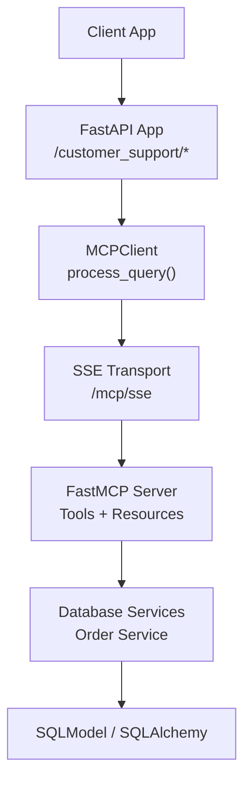
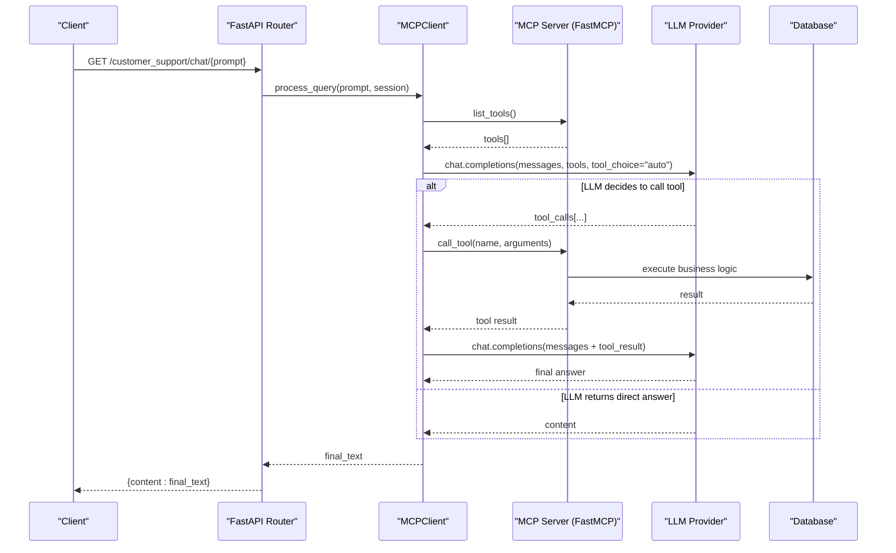
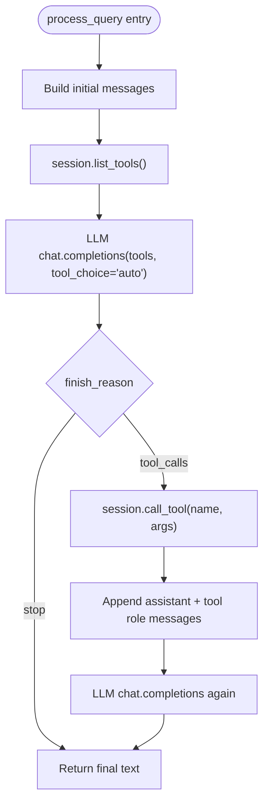
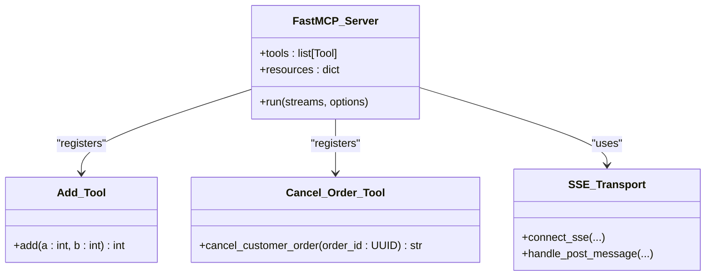
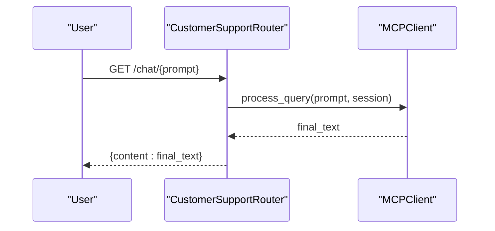
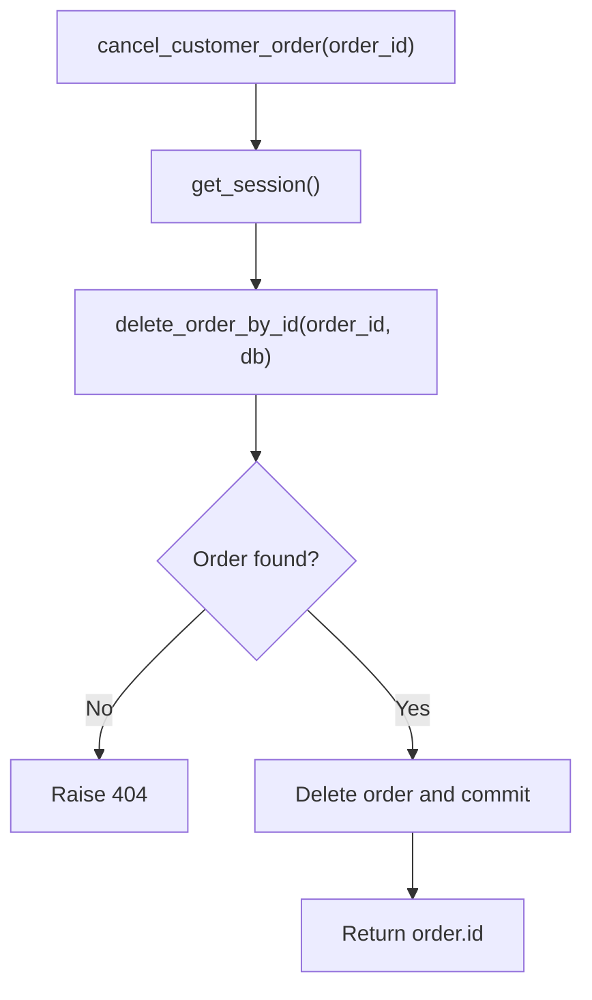

# AI Tools & Execution Engine

<cite>
**Referenced Files in This Document**
- [main.py](file://neurocom_backend/main.py)
- [client.py](file://neurocom_backend/mcp_server/client.py)
- [customer_support_router.py](file://neurocom_backend/routers/customer_support_router.py)
- [mcp_customer_support_main.py](file://neurocom_backend/mcp_server/customer_support/main.py)
- [order_service.py](file://neurocom_backend/services/order_service.py)
- [order_model.py](file://neurocom_backend/database/models/order.py)
- [database_connection.py](file://neurocom_backend/database/connection.py)
</cite>

## Table of Contents
1. [Introduction](#introduction)
2. [Project Structure](#project-structure)
3. [Core Components](#core-components)
4. [Architecture Overview](#architecture-overview)
5. [Detailed Component Analysis](#detailed-component-analysis)
6. [Dependency Analysis](#dependency-analysis)
7. [Performance Considerations](#performance-considerations)
8. [Troubleshooting Guide](#troubleshooting-guide)
9. [Conclusion](#conclusion)
10. [Appendices](#appendices)

## Introduction
This document explains the AI tools and execution engine that powers customer support operations via the Model Context Protocol (MCP). It covers how tools are registered, discovered through MCP, executed within a chat context using an LLM with tool calling, and how results are formatted and returned to clients. It also provides guidelines for developing custom tools, parameter validation, security considerations, performance monitoring, common usage patterns, and troubleshooting steps.

## Project Structure
The system is composed of:
- A FastAPI application that mounts an MCP SSE server and exposes HTTP endpoints for tool discovery and chat.
- An MCP client that connects to the MCP server over Server-Sent Events (SSE), discovers available tools, and orchestrates LLM tool-calling loops.
- Tool implementations exposed by the MCP server that perform business actions (e.g., order cancellation).
- Database services and models used by tools to persist or modify data.

**Diagram sources**
- [main.py:29-37](file://neurocom_backend/main.py#L29-L37)
- [customer_support_router.py:31-60](file://neurocom_backend/routers/customer_support_router.py#L31-L60)
- [client.py:45-62](file://neurocom_backend/mcp_server/client.py#L45-L62)
- [mcp_customer_support_main.py:16-61](file://neurocom_backend/mcp_server/customer_support/main.py#L16-L61)
- [order_service.py:29-46](file://neurocom_backend/services/order_service.py#L29-L46)
- [database_connection.py:9-27](file://neurocom_backend/database/connection.py#L9-L27)

**Section sources**
- [main.py:29-37](file://neurocom_backend/main.py#L29-L37)
- [customer_support_router.py:31-60](file://neurocom_backend/routers/customer_support_router.py#L31-L60)

## Core Components
- MCP Client: Establishes an SSE session to the MCP server, lists tools, and runs the LLM tool-calling loop to execute tools and return final answers.
- MCP Server: Declares tools and resources via decorators and serves them over SSE.
- Customer Support Router: Exposes HTTP endpoints to list tools and run chat queries that trigger tool execution.
- Order Service and Models: Provide database access for tools to read/update/delete orders.

Key responsibilities:
- Tool registration via MCP decorators on the server side.
- Tool discovery via MCP’s list_tools on the client side.
- LLM orchestration with tool_choice="auto" to decide when to call tools.
- Result formatting into a unified text response.

**Section sources**
- [client.py:17-62](file://neurocom_backend/mcp_server/client.py#L17-L62)
- [mcp_customer_support_main.py:16-33](file://neurocom_backend/mcp_server/customer_support/main.py#L16-L33)
- [customer_support_router.py:31-60](file://neurocom_backend/routers/customer_support_router.py#L31-L60)
- [order_service.py:29-46](file://neurocom_backend/services/order_service.py#L29-L46)
- [order_model.py:11-39](file://neurocom_backend/database/models/order.py#L11-L39)

## Architecture Overview
The end-to-end flow integrates FastAPI, MCP, and an LLM provider to enable conversational tool use.

**Diagram sources**
- [customer_support_router.py:53-60](file://neurocom_backend/routers/customer_support_router.py#L53-L60)
- [client.py:64-174](file://neurocom_backend/mcp_server/client.py#L64-L174)
- [mcp_customer_support_main.py:18-28](file://neurocom_backend/mcp_server/customer_support/main.py#L18-L28)
- [order_service.py:29-35](file://neurocom_backend/services/order_service.py#L29-L35)

## Detailed Component Analysis

### MCP Client: Tool Discovery and Orchestration
- Session management: Creates an SSE-based MCP session and initializes it.
- Tool discovery: Retrieves the list of tools from the MCP server.
- LLM integration: Sends messages and available tools to the LLM; handles tool calls by invoking the MCP server and feeding results back to the LLM until a final answer is produced.
- Result formatting: Aggregates intermediate logs and final text into a single string response.

**Diagram sources**
- [client.py:64-174](file://neurocom_backend/mcp_server/client.py#L64-L174)

**Section sources**
- [client.py:45-62](file://neurocom_backend/mcp_server/client.py#L45-L62)
- [client.py:64-174](file://neurocom_backend/mcp_server/client.py#L64-L174)

### MCP Server: Tool Registration and SSE Exposure
- Tool registration: Uses MCP decorators to expose functions as tools with typed parameters and descriptions.
- Resource exposure: Demonstrates exposing a resource via MCP.
- SSE transport: Mounts routes for SSE connection and message handling.

**Diagram sources**
- [mcp_customer_support_main.py:16-33](file://neurocom_backend/mcp_server/customer_support/main.py#L16-L33)
- [mcp_customer_support_main.py:35-61](file://neurocom_backend/mcp_server/customer_support/main.py#L35-L61)

**Section sources**
- [mcp_customer_support_main.py:16-33](file://neurocom_backend/mcp_server/customer_support/main.py#L16-L33)
- [mcp_customer_support_main.py:35-61](file://neurocom_backend/mcp_server/customer_support/main.py#L35-L61)

### Customer Support Router: Endpoints for Tool Usage
- GET /customer_support/get_tools: Returns the list of available tools from the MCP server.
- GET /customer_support/chat/{prompt}: Executes a chat query that may invoke tools and returns the final answer.

**Diagram sources**
- [customer_support_router.py:43-60](file://neurocom_backend/routers/customer_support_router.py#L43-L60)

**Section sources**
- [customer_support_router.py:31-60](file://neurocom_backend/routers/customer_support_router.py#L31-L60)

### Order Tool: Business Logic and Data Access
- cancel_customer_order: Validates and deletes an order via the order service, returning the deleted order ID.
- Order model defines status enum and relationships.

**Diagram sources**
- [mcp_customer_support_main.py:23-28](file://neurocom_backend/mcp_server/customer_support/main.py#L23-L28)
- [order_service.py:29-35](file://neurocom_backend/services/order_service.py#L29-L35)
- [order_model.py:11-39](file://neurocom_backend/database/models/order.py#L11-L39)

**Section sources**
- [mcp_customer_support_main.py:23-28](file://neurocom_backend/mcp_server/customer_support/main.py#L23-L28)
- [order_service.py:29-35](file://neurocom_backend/services/order_service.py#L29-L35)
- [order_model.py:11-39](file://neurocom_backend/database/models/order.py#L11-L39)

## Dependency Analysis
- FastAPI app mounts the MCP SSE app under /mcp and includes routers under /customer_support.
- The router depends on MCPClient to interact with the MCP server.
- MCPClient depends on MCP SSE transport and an LLM provider.
- MCP server tools depend on database services and models.

**Diagram sources**
- [main.py:29-37](file://neurocom_backend/main.py#L29-L37)
- [customer_support_router.py:31-60](file://neurocom_backend/routers/customer_support_router.py#L31-L60)
- [client.py:45-62](file://neurocom_backend/mcp_server/client.py#L45-L62)
- [mcp_customer_support_main.py:16-61](file://neurocom_backend/mcp_server/customer_support/main.py#L16-L61)
- [order_service.py:29-46](file://neurocom_backend/services/order_service.py#L29-L46)
- [order_model.py:11-39](file://neurocom_backend/database/models/order.py#L11-L39)

**Section sources**
- [main.py:29-37](file://neurocom_backend/main.py#L29-L37)
- [customer_support_router.py:31-60](file://neurocom_backend/routers/customer_support_router.py#L31-L60)

## Performance Considerations
- Connection reuse: Reuse MCP sessions where possible to reduce overhead of establishing SSE connections per request.
- LLM call minimization: Cache tool schemas and avoid redundant tool listing if the set of tools is stable.
- Streaming responses: Consider streaming LLM outputs and tool results to improve perceived latency.
- Database pooling: Ensure appropriate pool sizes and timeouts for high concurrency.
- Error retries: Implement retry logic for transient network or LLM provider errors.
- Observability: Add structured logging and metrics around tool calls, durations, and error rates.

## Troubleshooting Guide
Common issues and resolutions:
- Tool discovery fails:
  - Verify MCP SSE endpoint is reachable and initialized.
  - Check server-side tool registration and ensure no startup exceptions.
- Tool execution errors:
  - Validate tool parameters (types, required fields).
  - Inspect database connectivity and transaction commits.
  - Handle 404s for missing entities gracefully.
- LLM tool choice not triggered:
  - Confirm tools are correctly passed to the LLM with names, descriptions, and input schemas.
  - Review system prompt guidance for tool usage.
- Response formatting:
  - Ensure tool results are converted to strings before appending to messages.
  - Aggregate final text consistently.

Operational checks:
- Health endpoint confirms MCP SSE server is running.
- Logs around tool calls and LLM interactions help diagnose failures.

**Section sources**
- [main.py:43-45](file://neurocom_backend/main.py#L43-L45)
- [customer_support_router.py:43-60](file://neurocom_backend/routers/customer_support_router.py#L43-L60)
- [client.py:52-62](file://neurocom_backend/mcp_server/client.py#L52-L62)
- [client.py:121-174](file://neurocom_backend/mcp_server/client.py#L121-L174)
- [order_service.py:29-35](file://neurocom_backend/services/order_service.py#L29-L35)

## Conclusion
The AI tools and execution engine integrates MCP with an LLM to enable conversational tool use for customer support. Tools are declared on the MCP server, discovered by the client, and executed within a controlled LLM-driven loop. The design supports extensibility for new tools, robust error handling, and clear result formatting. Following the guidelines here will help you develop secure, maintainable, and performant tools.

## Appendices

### Guidelines for Developing Custom Tools
- Register tools using MCP decorators with descriptive names and docstrings.
- Define typed parameters to enable automatic schema generation for the LLM.
- Keep each tool focused on a single responsibility.
- Validate inputs at the tool boundary and raise meaningful errors.
- Use database sessions safely and handle transactions explicitly.
- Avoid leaking sensitive information in tool outputs; sanitize results.
- Log important events without capturing secrets or PII.

**Section sources**
- [mcp_customer_support_main.py:18-28](file://neurocom_backend/mcp_server/customer_support/main.py#L18-L28)
- [order_service.py:29-35](file://neurocom_backend/services/order_service.py#L29-L35)

### Tool Parameter Validation
- Leverage Python type hints for automatic schema inference by MCP.
- Add explicit validation inside tools for complex constraints.
- Return consistent error formats for invalid inputs.

**Section sources**
- [mcp_customer_support_main.py:18-28](file://neurocom_backend/mcp_server/customer_support/main.py#L18-L28)

### Security Considerations for Tool Execution
- Restrict tool access to authenticated users via FastAPI dependencies.
- Sanitize tool outputs to prevent data leakage.
- Use environment variables for secrets and never hardcode credentials.
- Apply least privilege to database accounts used by tools.
- Rate-limit endpoints and monitor for abuse.

**Section sources**
- [main.py:78-89](file://neurocom_backend/main.py#L78-L89)
- [customer_support_router.py:31-60](file://neurocom_backend/routers/customer_support_router.py#L31-L60)

### Performance Monitoring
- Instrument tool execution time and success/failure rates.
- Track LLM token usage and costs.
- Monitor database query performance and connection pool utilization.
- Set up alerts for elevated error rates or latency spikes.

### Common Tool Usage Patterns
- Query-first then act: Ask the LLM to retrieve information first, then call a write tool based on findings.
- Multi-step workflows: Chain multiple tools in a single conversation turn by letting the LLM decide subsequent calls.
- Read-only helpers: Provide lookup tools to enrich LLM responses without modifying state.

### Example Endpoints
- Discover tools: GET /customer_support/get_tools
- Run chat with potential tool use: GET /customer_support/chat/{prompt}

**Section sources**
- [customer_support_router.py:43-60](file://neurocom_backend/routers/customer_support_router.py#L43-L60)