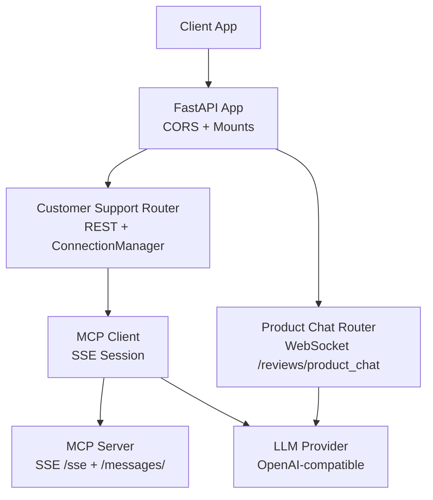
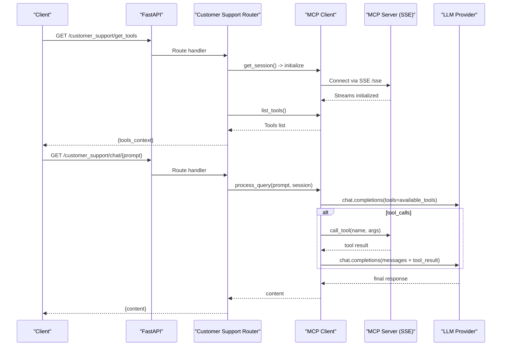
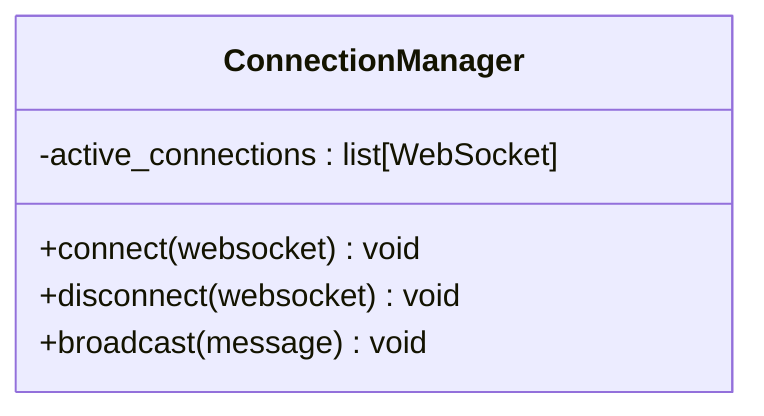
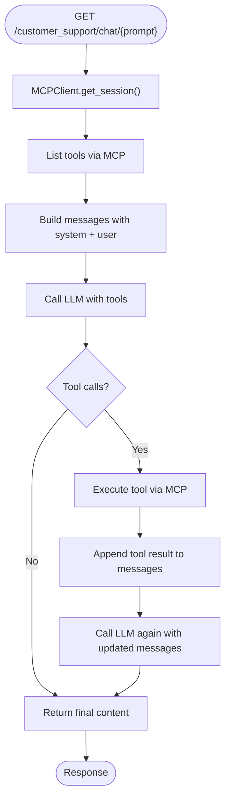
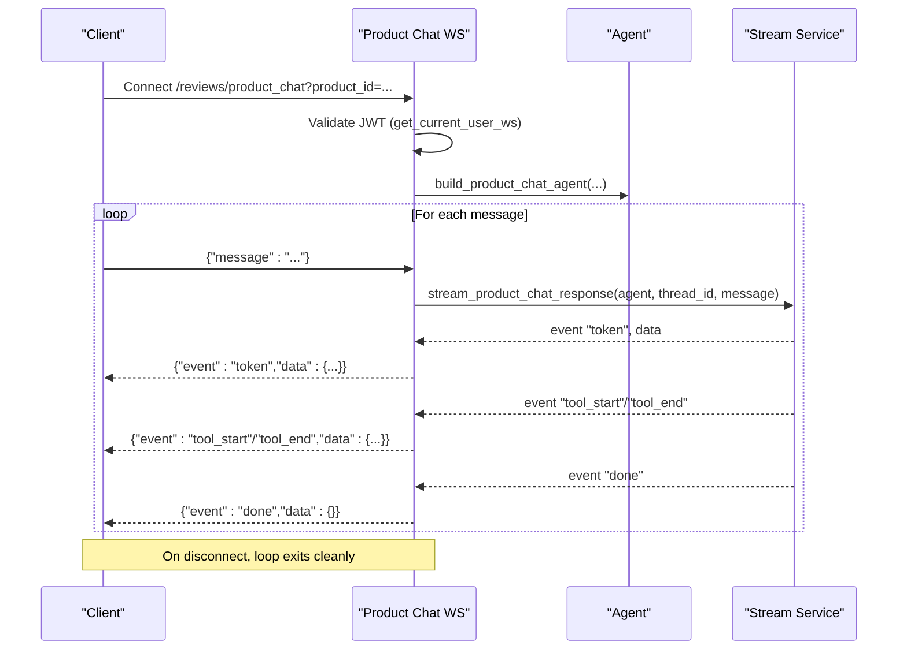
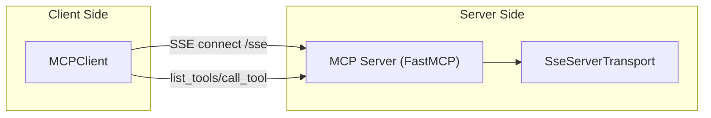
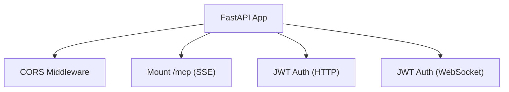

# Chat Interface & WebSocket Communication

<cite>
**Referenced Files in This Document**
- [main.py](file://neurocom_backend/main.py)
- [customer_support_router.py](file://neurocom_backend/routers/customer_support_router.py)
- [product_chat_router.py](file://neurocom_backend/routers/product_chat_router.py)
- [chat_service.py](file://neurocom_backend/services/chat_service.py)
- [client.py](file://neurocom_backend/mcp_server/client.py)
- [customer_support_mcp_main.py](file://neurocom_backend/mcp_server/customer_support/main.py)
- [dependencies.py](file://neurocom_backend/dependencies.py)
- [settings.py](file://neurocom_backend/utils/settings.py)
</cite>

## Table of Contents
1. [Introduction](#introduction)
2. [Project Structure](#project-structure)
3. [Core Components](#core-components)
4. [Architecture Overview](#architecture-overview)
5. [Detailed Component Analysis](#detailed-component-analysis)
6. [Dependency Analysis](#dependency-analysis)
7. [Performance Considerations](#performance-considerations)
8. [Troubleshooting Guide](#troubleshooting-guide)
9. [Conclusion](#conclusion)
10. [Appendices](#appendices)

## Introduction
This document explains the AI chat interface and real-time communication system implemented in the backend. It covers:
- WebSocket connection management, active connection tracking, and broadcast functionality
- Real-time message handling for product-focused chat sessions
- REST API endpoints for chat interactions and tool discovery
- MCP (Model Context Protocol) integration via Server-Sent Events (SSE)
- Error handling strategies and client integration guidance
- Scaling considerations and fallback mechanisms for high-concurrency environments

## Project Structure
The chat and real-time features are organized across routers, services, and an MCP server layer:
- FastAPI application entrypoint mounts routers and CORS middleware
- Customer support router exposes REST endpoints and a ConnectionManager for WebSocket broadcasting
- Product chat router implements a per-connection streaming WebSocket endpoint with authentication
- MCP client connects to an SSE-based MCP server to discover tools and process queries
- MCP server exposes tools and resources over SSE

**Diagram sources**
- [main.py:30-37](file://neurocom_backend/main.py#L30-L37)
- [customer_support_router.py:15-36](file://neurocom_backend/routers/customer_support_router.py#L15-L36)
- [product_chat_router.py:27-69](file://neurocom_backend/routers/product_chat_router.py#L27-L69)
- [client.py:45-50](file://neurocom_backend/mcp_server/client.py#L45-L50)
- [customer_support_mcp_main.py:37-61](file://neurocom_backend/mcp_server/customer_support/main.py#L37-L61)

**Section sources**
- [main.py:30-37](file://neurocom_backend/main.py#L30-L37)
- [customer_support_router.py:15-36](file://neurocom_backend/routers/customer_support_router.py#L15-L36)
- [product_chat_router.py:27-69](file://neurocom_backend/routers/product_chat_router.py#L27-L69)
- [client.py:45-50](file://neurocom_backend/mcp_server/client.py#L45-L50)
- [customer_support_mcp_main.py:37-61](file://neurocom_backend/mcp_server/customer_support/main.py#L37-L61)

## Core Components
- ConnectionManager: Tracks active WebSocket connections and broadcasts messages to all connected clients.
- Customer Support Router: Provides REST endpoints for tool discovery and chat query processing; also defines ConnectionManager for future or internal use.
- Product Chat Router: Implements a secure, authenticated WebSocket endpoint that streams agent responses token-by-token and tool events to the client.
- MCP Client: Manages SSE sessions to an MCP server, lists available tools, and processes user queries by orchestrating tool calls and LLM responses.
- MCP Server: Exposes tools and resources over SSE, enabling dynamic tool invocation from the client side.

Key responsibilities:
- Connection lifecycle: accept, track, disconnect, and broadcast
- Real-time streaming: yield structured events (tokens, tool start/end, done, error)
- Tool orchestration: list tools, call tools, integrate results into LLM context
- Authentication: JWT-based auth for both HTTP and WebSocket contexts

**Section sources**
- [customer_support_router.py:15-36](file://neurocom_backend/routers/customer_support_router.py#L15-L36)
- [product_chat_router.py:27-69](file://neurocom_backend/routers/product_chat_router.py#L27-L69)
- [client.py:45-174](file://neurocom_backend/mcp_server/client.py#L45-L174)
- [customer_support_mcp_main.py:16-61](file://neurocom_backend/mcp_server/customer_support/main.py#L16-L61)
- [dependencies.py:34-69](file://neurocom_backend/dependencies.py#L34-L69)

## Architecture Overview
The system combines REST and WebSocket interfaces with an MCP-driven tooling layer:
- REST endpoints under /customer_support expose tool discovery and chat query processing
- A dedicated WebSocket endpoint under /reviews/product_chat provides real-time, multi-turn chat with streaming events
- The MCP client establishes an SSE session to the MCP server to enumerate tools and execute them on demand
- LLM providers are invoked through OpenAI-compatible APIs for text generation and tool-calling

**Diagram sources**
- [customer_support_router.py:43-60](file://neurocom_backend/routers/customer_support_router.py#L43-L60)
- [client.py:45-174](file://neurocom_backend/mcp_server/client.py#L45-L174)
- [customer_support_mcp_main.py:37-61](file://neurocom_backend/mcp_server/customer_support/main.py#L37-L61)

## Detailed Component Analysis

### ConnectionManager: Active Connections and Broadcast
- Purpose: Maintain a list of active WebSocket connections and send messages to all of them.
- Methods:
  - connect: Accepts a WebSocket and adds it to the active list
  - disconnect: Removes a WebSocket from the active list
  - broadcast: Iterates over active connections and sends a text message to each
- Notes:
  - No deduplication or error isolation per connection is implemented; a failing send will not be retried
  - Suitable for simple in-process scenarios; consider Redis-backed pub/sub for horizontal scaling

**Diagram sources**
- [customer_support_router.py:15-30](file://neurocom_backend/routers/customer_support_router.py#L15-L30)

**Section sources**
- [customer_support_router.py:15-30](file://neurocom_backend/routers/customer_support_router.py#L15-L30)

### REST Endpoints: Tool Discovery and Chat Query
- GET /customer_support/get_tools
  - Uses MCP client to establish an SSE session and list available tools
  - Returns a JSON payload with tools context
- GET /customer_support/chat/{prompt}
  - Processes a user prompt using the MCP client
  - Orchestrates tool calls and LLM responses, returning aggregated content

**Diagram sources**
- [customer_support_router.py:53-60](file://neurocom_backend/routers/customer_support_router.py#L53-L60)
- [client.py:64-174](file://neurocom_backend/mcp_server/client.py#L64-L174)

**Section sources**
- [customer_support_router.py:43-60](file://neurocom_backend/routers/customer_support_router.py#L43-L60)
- [client.py:64-174](file://neurocom_backend/mcp_server/client.py#L64-L174)

### WebSocket Endpoint: Product Chat Streaming
- Endpoint: WebSocket /reviews/product_chat
- Authentication:
  - Uses a WebSocket-safe dependency to validate JWT tokens
  - Also supports optional access token dependency for external integrations
- Behavior:
  - Accepts JSON payloads with a "message" field
  - Streams events back to the client:
    - token: incremental text chunks
    - tool_start/tool_end: tool execution boundaries
    - done: completion signal
    - error: error details if exceptions occur
- Lifecycle:
  - One agent instance per connection with a unique thread_id for memory scoping
  - Graceful handling of disconnections and malformed messages

**Diagram sources**
- [product_chat_router.py:27-69](file://neurocom_backend/routers/product_chat_router.py#L27-L69)
- [dependencies.py:46-69](file://neurocom_backend/dependencies.py#L46-L69)

**Section sources**
- [product_chat_router.py:27-69](file://neurocom_backend/routers/product_chat_router.py#L27-L69)
- [dependencies.py:46-69](file://neurocom_backend/dependencies.py#L46-L69)

### MCP Integration: SSE Sessions and Tool Orchestration
- MCP Client:
  - Establishes an SSE session to the MCP server at /sse
  - Initializes the session and yields it for request handlers
  - Lists tools and executes them via call_tool when requested by the LLM
  - Aggregates final text responses from multiple LLM calls
- MCP Server:
  - Exposes tools and resources
  - Handles bidirectional communication over SSE routes /sse and /messages/

**Diagram sources**
- [client.py:45-50](file://neurocom_backend/mcp_server/client.py#L45-L50)
- [customer_support_mcp_main.py:35-61](file://neurocom_backend/mcp_server/customer_support/main.py#L35-L61)

**Section sources**
- [client.py:45-174](file://neurocom_backend/mcp_server/client.py#L45-L174)
- [customer_support_mcp_main.py:16-61](file://neurocom_backend/mcp_server/customer_support/main.py#L16-L61)

### Error Handling Strategies
- REST endpoints:
  - Wrap operations in try/except and return HTTP 500 with error details
- WebSocket endpoint:
  - Validates incoming JSON and required fields
  - Emits structured error events instead of crashing the connection
  - Catches WebSocketDisconnect and RuntimeErrors to gracefully close loops
- MCP client:
  - Logs errors during tool listing and returns None to prevent crashes
  - Aggregates tool call results and handles exceptions by yielding error events in streaming

**Section sources**
- [customer_support_router.py:43-60](file://neurocom_backend/routers/customer_support_router.py#L43-L60)
- [product_chat_router.py:51-69](file://neurocom_backend/routers/product_chat_router.py#L51-L69)
- [client.py:52-62](file://neurocom_backend/mcp_server/client.py#L52-L62)

## Dependency Analysis
- FastAPI app:
  - Adds CORS middleware with configured allowed origins
  - Mounts MCP SSE app under /mcp
  - Includes routers with optional global dependencies for authentication
- Authentication:
  - HTTP: OAuth2PasswordBearer-based JWT validation
  - WebSocket: Custom dependency reads Authorization header directly to avoid HTTP-only constraints
- Settings:
  - Centralized environment configuration for CORS origins and other runtime constants

**Diagram sources**
- [main.py:30-37](file://neurocom_backend/main.py#L30-L37)
- [dependencies.py:34-69](file://neurocom_backend/dependencies.py#L34-L69)
- [settings.py:11-11](file://neurocom_backend/utils/settings.py#L11-L11)

**Section sources**
- [main.py:30-37](file://neurocom_backend/main.py#L30-L37)
- [dependencies.py:34-69](file://neurocom_backend/dependencies.py#L34-L69)
- [settings.py:11-11](file://neurocom_backend/utils/settings.py#L11-L11)

## Performance Considerations
- ConnectionManager scalability:
  - In-memory list of connections does not scale across processes; use Redis pub/sub or a shared store for horizontal scaling
- Streaming efficiency:
  - Use token-level streaming for responsive UI updates
  - Batch tool events where appropriate to reduce overhead
- LLM provider limits:
  - Implement retries with exponential backoff for transient failures
  - Cache tool listings to avoid repeated enumeration
- Resource cleanup:
  - Ensure SSE sessions and agent threads are closed on disconnect
  - Avoid holding large message histories in memory; rely on agent memory scoping per thread_id

[No sources needed since this section provides general guidance]

## Troubleshooting Guide
- Common issues:
  - WebSocket handshake fails due to missing or invalid Authorization header
    - Verify Bearer token format and ensure it matches merchant role requirements
  - Malformed WebSocket messages
    - Ensure payloads include a valid "message" field and are proper JSON
  - Tool listing or execution errors
    - Check MCP server availability and SSE connectivity
    - Review logs for tool call arguments and results
- Debugging steps:
  - Inspect CORS settings to ensure client origins are allowed
  - Confirm MCP SSE endpoints are reachable and responding
  - Validate environment variables for LLM providers and secrets

**Section sources**
- [dependencies.py:46-69](file://neurocom_backend/dependencies.py#L46-L69)
- [product_chat_router.py:51-69](file://neurocom_backend/routers/product_chat_router.py#L51-L69)
- [customer_support_mcp_main.py:37-61](file://neurocom_backend/mcp_server/customer_support/main.py#L37-L61)

## Conclusion
The backend provides a robust chat interface combining REST and WebSocket capabilities with dynamic tool orchestration via MCP. The ConnectionManager offers basic broadcast functionality suitable for single-process deployments, while the product chat WebSocket delivers real-time, token-streamed interactions with clear event semantics. For production-scale deployments, adopt distributed connection management, resilient retry logic, and centralized configuration to ensure reliability and performance.

[No sources needed since this section summarizes without analyzing specific files]

## Appendices

### Client Integration Examples
- REST:
  - GET /customer_support/get_tools: Retrieve available tools for dynamic UI rendering
  - GET /customer_support/chat/{prompt}: Process a user query and receive aggregated content
- WebSocket:
  - Connect to /reviews/product_chat?product_id={id}&product_sku_id={sku}
  - Send JSON: {"message": "Your question here"}
  - Handle events:
    - token: append content to UI
    - tool_start/tool_end: show tool usage status
    - done: finalize turn
    - error: display error details

[No sources needed since this section provides general guidance]

### Scaling WebSocket Connections
- Replace in-memory ConnectionManager with Redis-backed channels for cross-process broadcast
- Use a reverse proxy (e.g., Nginx) with sticky sessions or WebSocket-aware load balancing
- Monitor connection counts and implement graceful degradation under load
- Consider sharding by tenant or product scope to limit fan-out size

[No sources needed since this section provides general guidance]

### Fallback Mechanisms
- If MCP server is unavailable:
  - Fall back to direct LLM calls without tools
  - Return informative error events to clients
- If LLM provider is rate-limited:
  - Queue requests and retry with backoff
  - Provide partial responses or placeholders until complete

[No sources needed since this section provides general guidance]