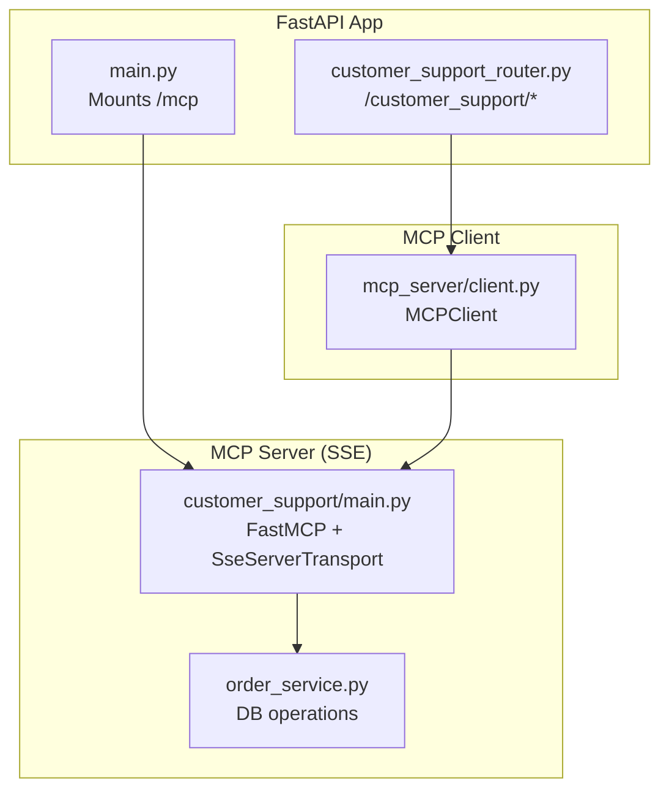
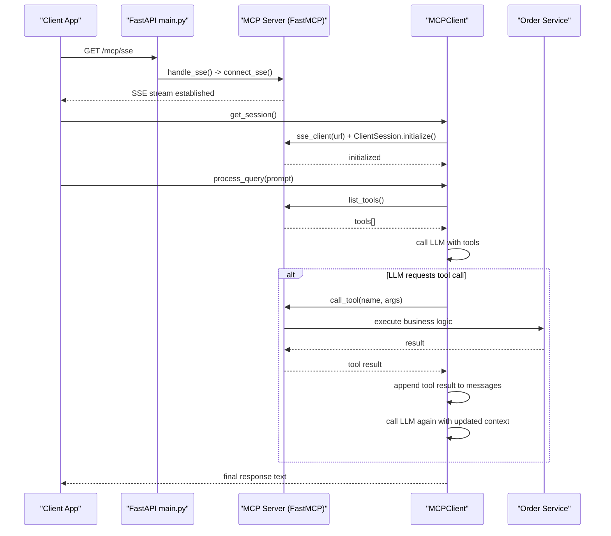
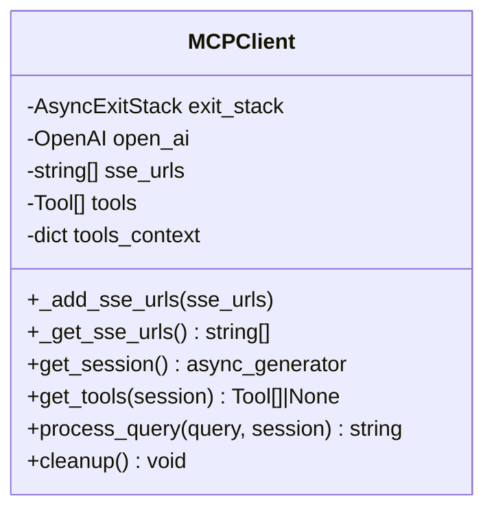
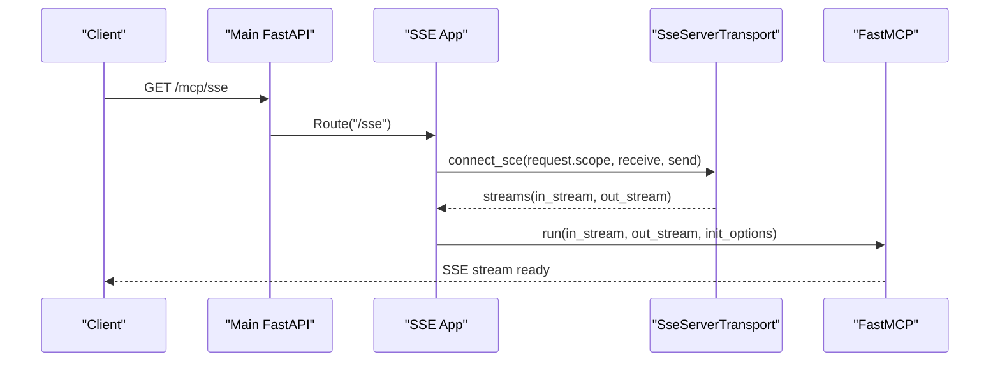
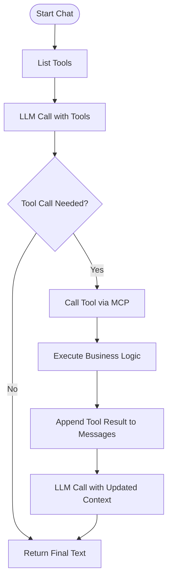
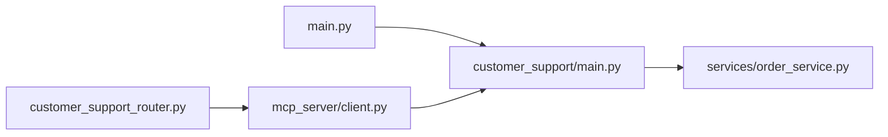

# MCP (Model Context Protocol) Integration

<cite>
**Referenced Files in This Document**
- [client.py](file://neurocom_backend/mcp_server/client.py)
- [main.py](file://neurocom_backend/mcp_server/customer_support/main.py)
- [helper.py](file://neurocom_backend/mcp_server/customer_support/helper.py)
- [main.py](file://neurocom_backend/main.py)
- [customer_support_router.py](file://neurocom_backend/routers/customer_support_router.py)
- [order_service.py](file://neurocom_backend/services/order_service.py)
</cite>

## Table of Contents
1. Introduction
2. Project Structure
3. Core Components
4. Architecture Overview
5. Detailed Component Analysis
6. Dependency Analysis
7. Performance Considerations
8. Troubleshooting Guide
9. Conclusion
10. Appendices

## Introduction
This document explains the Model Context Protocol (MCP) integration implemented in the project. It covers:
- The MCP client implementation and session management
- Tool discovery and execution workflows
- SSE-based streaming configuration, URL management, and connection handling
- MCP server setup, tool registration, and protocol-specific configurations
- Custom tool development examples, error handling patterns, and guidelines for extending the ecosystem

## Project Structure
The MCP integration spans a small set of focused modules:
- MCP Server (SSE): A FastMCP server exposing tools via SSE endpoints mounted under /mcp
- MCP Client: An async client that connects to the SSE endpoint, discovers tools, and orchestrates LLM calls with tool use
- API Router: Exposes HTTP endpoints to list tools and chat using the MCP client
- Services: Business logic used by tools (e.g., order cancellation)

**Diagram sources**
- [main.py:29-37](file://neurocom_backend/main.py#L29-L37)
- [customer_support/main.py:16-62](file://neurocom_backend/mcp_server/customer_support/main.py#L16-L62)
- [customer_support_router.py:31-60](file://neurocom_backend/routers/customer_support_router.py#L31-L60)
- [client.py:17-50](file://neurocom_backend/mcp_server/client.py#L17-L50)
- [order_service.py:29-35](file://neurocom_backend/services/order_service.py#L29-L35)

**Section sources**
- [main.py:29-37](file://neurocom_backend/main.py#L29-L37)
- [customer_support/main.py:16-62](file://neurocom_backend/mcp_server/customer_support/main.py#L16-L62)
- [customer_support_router.py:31-60](file://neurocom_backend/routers/customer_support_router.py#L31-L60)
- [client.py:17-50](file://neurocom_backend/mcp_server/client.py#L17-L50)
- [order_service.py:29-35](file://neurocom_backend/services/order_service.py#L29-L35)

## Core Components
- MCPClient: Manages SSE connections, tool discovery, and orchestrates LLM tool-calling flows.
- MCP Server (FastMCP): Registers tools and resources; exposes SSE endpoints for bidirectional communication.
- API Router: Provides HTTP endpoints to interact with the MCP client (list tools, chat).
- Order Service: Implements business logic invoked by tools (e.g., canceling orders).

Key responsibilities:
- Session lifecycle: Create, initialize, and close sessions over SSE streams
- Tool discovery: List available tools from the MCP server
- Tool execution: Call tools via the MCP session and feed results back to the LLM
- Streaming transport: Use SSE for request/response streaming between client and server

**Section sources**
- [client.py:17-179](file://neurocom_backend/mcp_server/client.py#L17-L179)
- [customer_support/main.py:16-62](file://neurocom_backend/mcp_server/customer_support/main.py#L16-L62)
- [customer_support_router.py:31-60](file://neurocom_backend/routers/customer_support_router.py#L31-L60)
- [order_service.py:29-35](file://neurocom_backend/services/order_service.py#L29-L35)

## Architecture Overview
The system uses SSE to stream JSON-RPC messages between the MCP client and server. The FastAPI app mounts the MCP SSE app at /mcp. Clients connect to /mcp/sse to establish an SSE stream and post messages to /mcp/messages/.

**Diagram sources**
- [main.py:29-37](file://neurocom_backend/main.py#L29-L37)
- [customer_support/main.py:35-62](file://neurocom_backend/mcp_server/customer_support/main.py#L35-L62)
- [client.py:45-174](file://neurocom_backend/mcp_server/client.py#L45-L174)
- [order_service.py:29-35](file://neurocom_backend/services/order_service.py#L29-L35)

## Detailed Component Analysis

### MCPClient Implementation
Responsibilities:
- Maintain SSE URLs and provide methods to add/retrieve them
- Establish SSE sessions and initialize MCP sessions
- Discover tools via list_tools
- Orchestrate LLM calls with tool definitions and handle tool_calls responses
- Manage cleanup of resources

Highlights:
- Uses an async generator to yield a properly scoped ClientSession per request
- Converts MCP tools into function schemas compatible with the OpenAI-style API
- Handles tool_call flow: executes tool via session.call_tool, injects results back into messages, and re-invokes LLM

Error handling:
- Tool listing errors are caught and logged; returns None on failure
- Exceptions in routers are converted to HTTP 500 responses

Resource cleanup:
- AsyncExitStack is maintained for potential future resource management

**Section sources**
- [client.py:17-179](file://neurocom_backend/mcp_server/client.py#L17-L179)

#### Class Diagram

**Diagram sources**
- [client.py:17-179](file://neurocom_backend/mcp_server/client.py#L17-L179)

### SSE Configuration, URL Management, and Connection Handling
Server-side:
- FastMCP instance created with a name
- Tools registered via decorators
- SseServerTransport configured with a message path
- Starlette app exposes:
  - GET /sse to start SSE stream
  - POST /messages/ to receive JSON-RPC messages

Client-side:
- MCPClient stores SSE URLs and creates an SSE client connection
- Initializes a ClientSession and yields it for use within request scope

Routing and mounting:
- The MCP SSE app is mounted under /mcp in the main FastAPI app
- Customer support router configures the MCP client with the SSE URL

**Section sources**
- [customer_support/main.py:16-62](file://neurocom_backend/mcp_server/customer_support/main.py#L16-L62)
- [main.py:29-37](file://neurocom_backend/main.py#L29-L37)
- [customer_support_router.py:31-36](file://neurocom_backend/routers/customer_support_router.py#L31-L36)
- [client.py:39-50](file://neurocom_backend/mcp_server/client.py#L39-L50)

#### Sequence Diagram: SSE Lifecycle

**Diagram sources**
- [main.py:29-37](file://neurocom_backend/main.py#L29-L37)
- [customer_support/main.py:35-62](file://neurocom_backend/mcp_server/customer_support/main.py#L35-L62)

### Tool Discovery Mechanisms
- The client retrieves the list of tools by calling session.list_tools()
- Tools are transformed into function schemas (name, description, parameters) for the LLM
- Errors during discovery are handled gracefully and surfaced to callers

**Section sources**
- [client.py:52-62](file://neurocom_backend/mcp_server/client.py#L52-L62)
- [customer_support_router.py:43-50](file://neurocom_backend/routers/customer_support_router.py#L43-L50)

### Tool Execution Workflows
- When the LLM decides to call a tool, the client executes session.call_tool with the tool name and arguments
- The MCP server resolves the tool and invokes the corresponding function
- Results are serialized and appended to the conversation context for the LLM to produce a final answer

**Diagram sources**
- [client.py:64-174](file://neurocom_backend/mcp_server/client.py#L64-L174)
- [customer_support/main.py:18-28](file://neurocom_backend/mcp_server/customer_support/main.py#L18-L28)
- [order_service.py:29-35](file://neurocom_backend/services/order_service.py#L29-L35)

### MCP Server Setup and Tool Registration
- FastMCP instance is created with a descriptive name
- Tools are registered using decorators; each tool can perform database operations or other business logic
- Resources can be exposed via @mcp.resource
- Transport and routes are configured to serve SSE and message endpoints

**Section sources**
- [customer_support/main.py:16-62](file://neurocom_backend/mcp_server/customer_support/main.py#L16-L62)

### Custom Tool Development Guidelines
To add a new tool:
- Define a function decorated with @mcp.tool()
- Add type hints and docstrings for parameters and behavior
- Implement business logic, typically delegating to services
- Ensure proper error handling and return types

Example pattern:
- Register a tool that performs a database operation
- Use dependency injection or session managers to access the database
- Return structured data suitable for serialization

**Section sources**
- [customer_support/main.py:18-28](file://neurocom_backend/mcp_server/customer_support/main.py#L18-L28)
- [order_service.py:29-35](file://neurocom_backend/services/order_service.py#L29-L35)

### Error Handling Patterns
- Client-side tool listing errors are caught and logged; returns None
- Routers wrap MCP client calls in try/except and raise HTTPException(500) on failures
- Service layer raises HTTPException for not found cases (e.g., order not found)

Best practices:
- Always handle exceptions around network and I/O operations
- Provide meaningful error messages and status codes
- Log errors for debugging while avoiding sensitive data exposure

**Section sources**
- [client.py:52-62](file://neurocom_backend/mcp_server/client.py#L52-L62)
- [customer_support_router.py:43-60](file://neurocom_backend/routers/customer_support_router.py#L43-L60)
- [order_service.py:29-35](file://neurocom_backend/services/order_service.py#L29-L35)

## Dependency Analysis
The MCP integration has clear boundaries:
- FastAPI app mounts the MCP SSE app
- The customer support router depends on the MCP client
- The MCP client depends on the MCP server via SSE
- Tools depend on services for business logic

**Diagram sources**
- [main.py:29-37](file://neurocom_backend/main.py#L29-L37)
- [customer_support_router.py:31-60](file://neurocom_backend/routers/customer_support_router.py#L31-L60)
- [client.py:17-50](file://neurocom_backend/mcp_server/client.py#L17-L50)
- [customer_support/main.py:16-62](file://neurocom_backend/mcp_server/customer_support/main.py#L16-L62)
- [order_service.py:29-35](file://neurocom_backend/services/order_service.py#L29-L35)

**Section sources**
- [main.py:29-37](file://neurocom_backend/main.py#L29-L37)
- [customer_support_router.py:31-60](file://neurocom_backend/routers/customer_support_router.py#L31-L60)
- [client.py:17-50](file://neurocom_backend/mcp_server/client.py#L17-L50)
- [customer_support/main.py:16-62](file://neurocom_backend/mcp_server/customer_support/main.py#L16-L62)
- [order_service.py:29-35](file://neurocom_backend/services/order_service.py#L29-L35)

## Performance Considerations
- SSE streaming reduces latency for interactive tool-assisted conversations
- Reusing tool schemas avoids repeated introspection overhead per request
- Keep tool functions lightweight; delegate heavy work to services
- Consider connection pooling and timeouts for external APIs if tools call them
- Monitor memory usage when accumulating conversation history in tool-call loops

[No sources needed since this section provides general guidance]

## Troubleshooting Guide
Common issues and resolutions:
- SSE connection fails:
  - Verify the SSE URL is correct and reachable
  - Ensure the MCP SSE app is mounted under /mcp
  - Check CORS settings if connecting from a browser
- Tool discovery returns empty:
  - Confirm tools are registered with @mcp.tool()
  - Validate that the MCP server is running and accessible
- Tool execution errors:
  - Inspect service-layer exceptions (e.g., 404 for missing entities)
  - Ensure required dependencies (database sessions, credentials) are configured
- LLM tool calls not triggered:
  - Verify tool schemas are correctly formatted and passed to the LLM
  - Check model capabilities and tool_choice settings

Operational checks:
- Health endpoint indicates MCP SSE server status
- Logs in SSE handler and client methods help diagnose failures

**Section sources**
- [main.py:43-45](file://neurocom_backend/main.py#L43-L45)
- [customer_support/main.py:37-54](file://neurocom_backend/mcp_server/customer_support/main.py#L37-L54)
- [customer_support_router.py:43-60](file://neurocom_backend/routers/customer_support_router.py#L43-L60)
- [client.py:52-62](file://neurocom_backend/mcp_server/client.py#L52-L62)

## Conclusion
The MCP integration leverages SSE to enable dynamic tool discovery and execution driven by an LLM. The design cleanly separates concerns:
- The MCP server exposes tools and resources
- The MCP client manages sessions and orchestrates tool use
- The API router provides convenient endpoints for clients
Extending the ecosystem involves registering new tools and optionally adding new transports or clients. Proper error handling and performance considerations ensure robust operation.

[No sources needed since this section summarizes without analyzing specific files]

## Appendices

### API Endpoints Summary
- GET /mcp/sse: Establishes SSE stream for MCP communication
- POST /mcp/messages/: Receives JSON-RPC messages for the MCP session
- GET /customer_support/get_tools: Lists available MCP tools via the client
- GET /customer_support/chat/{prompt}: Executes a chat query using MCP tools

**Section sources**
- [customer_support/main.py:56-62](file://neurocom_backend/mcp_server/customer_support/main.py#L56-L62)
- [customer_support_router.py:43-60](file://neurocom_backend/routers/customer_support_router.py#L43-L60)

### Extending the MCP Ecosystem
Guidelines:
- Add new tools with @mcp.tool(), ensuring clear parameter types and docstrings
- Encapsulate complex logic in services for reuse and testability
- Introduce additional transports (e.g., streamable HTTP) if needed
- Update client configuration to discover and use new tools automatically
- Follow consistent error handling patterns across tools and services

**Section sources**
- [customer_support/main.py:18-28](file://neurocom_backend/mcp_server/customer_support/main.py#L18-L28)
- [client.py:52-62](file://neurocom_backend/mcp_server/client.py#L52-L62)