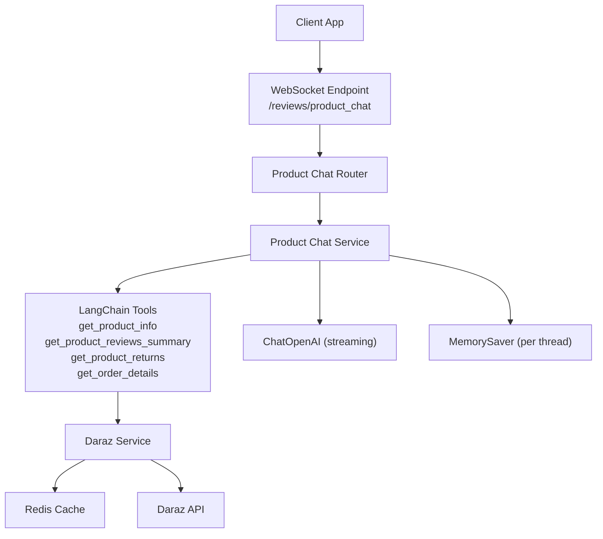
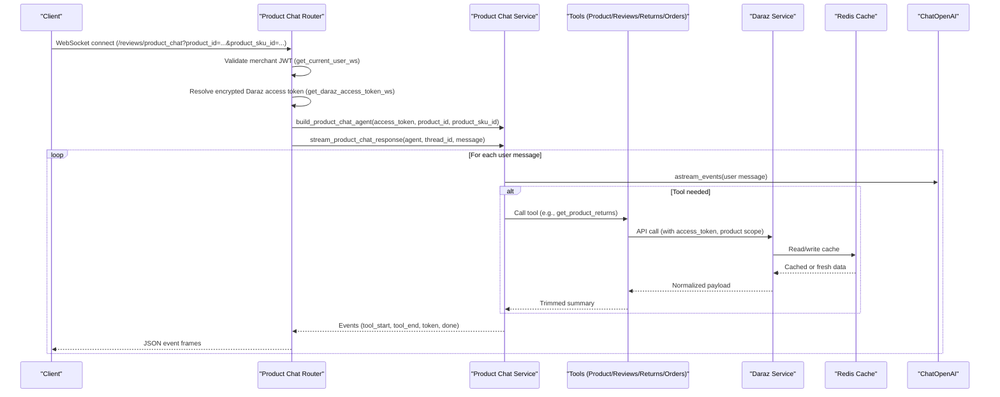
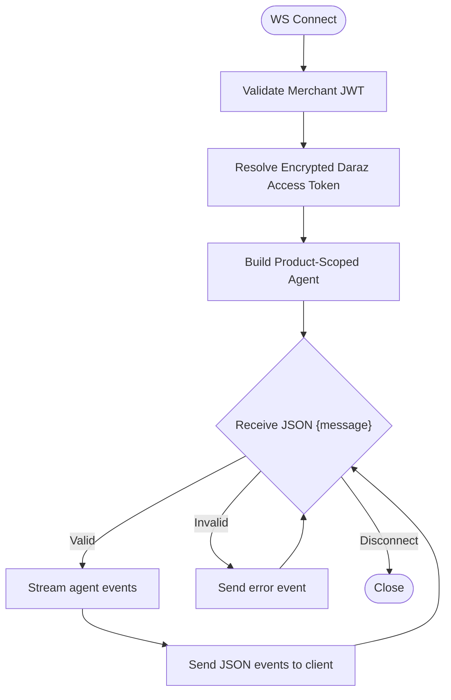
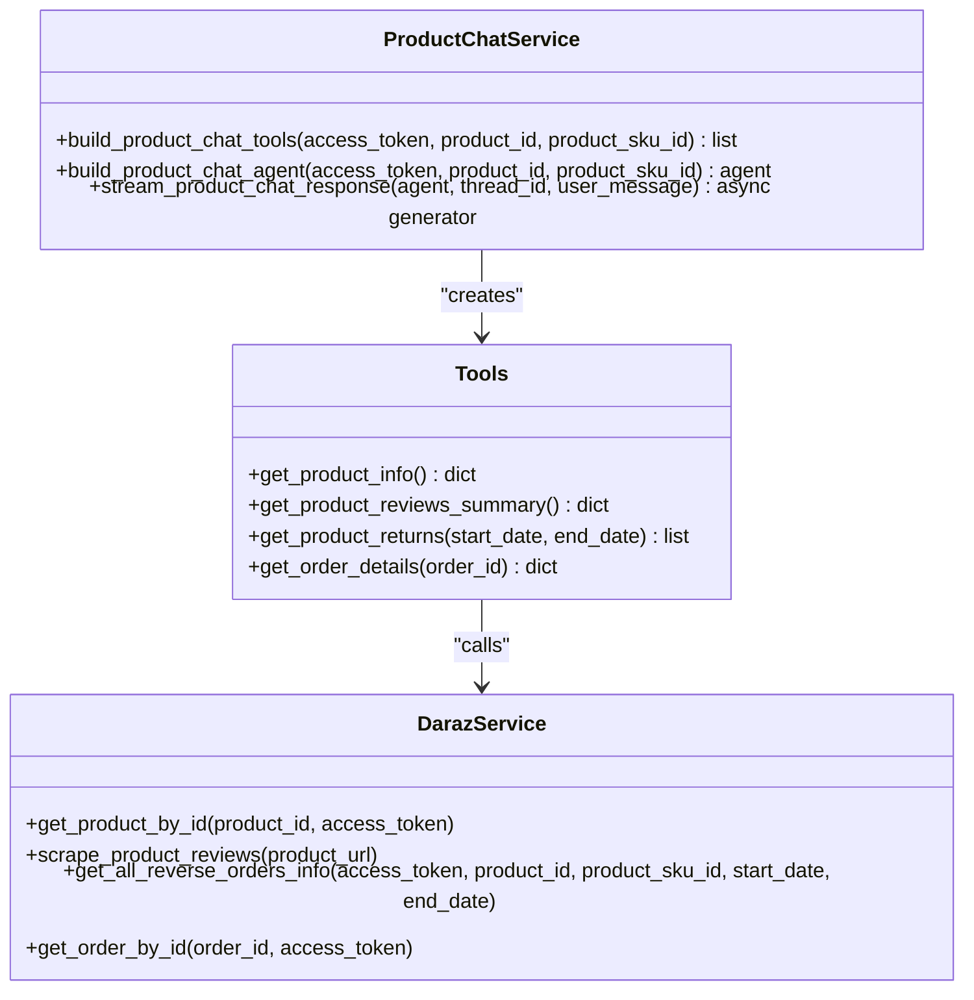
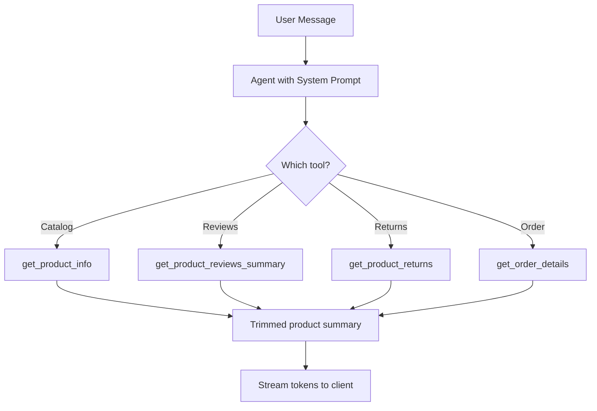
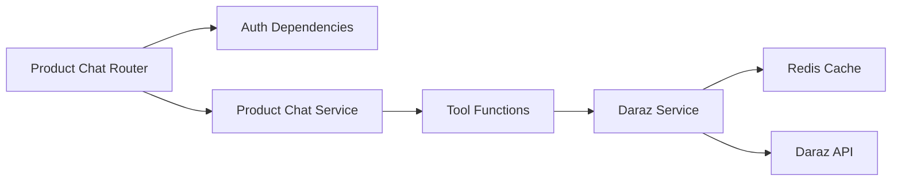

# Product-Specific Chat System

<cite>
**Referenced Files in This Document**
- [main.py](file://neurocom_backend/main.py)
- [product_chat_router.py](file://neurocom_backend/routers/product_chat_router.py)
- [product_chat_service.py](file://neurocom_backend/services/product_chat_service.py)
- [daraz_service.py](file://neurocom_backend/services/daraz_service.py)
- [daraz_model.py](file://neurocom_backend/models/daraz_model.py)
- [dependencies.py](file://neurocom_backend/dependencies.py)
- [redis_cache.py](file://neurocom_backend/utils/redis_cache.py)
</cite>

## Table of Contents
1. Introduction
2. Project Structure
3. Core Components
4. Architecture Overview
5. Detailed Component Analysis
6. Dependency Analysis
7. Performance Considerations
8. Troubleshooting Guide
9. Conclusion

## Introduction
This document explains the product-specific chat system that lets a merchant ask questions about a single Daraz product across reviews, catalog details, and orders (especially returns). The chat is scoped per product via WebSocket endpoints and uses a LangGraph agent with tools bound to the merchant’s access token and product identifiers. Responses are streamed token-by-token over WebSocket, and conversation state is maintained per connection using an in-process memory saver.

Key capabilities:
- Contextualize AI prompts to one product at a time
- Inject product attributes into tool outputs for concise, relevant answers
- Stream real-time responses over WebSocket
- Manage multi-turn conversations within a session
- Handle multiple concurrent products by creating separate agents per connection

## Project Structure
The product chat feature spans routing, service, data models, and caching layers:
- Routing: WebSocket endpoint under /reviews/product_chat
- Service: Agent construction, tool definitions, streaming response pipeline
- Data integration: Daraz API calls for product info, reviews, returns, and order details
- Models: Pydantic schemas for Daraz payloads
- Auth: Merchant JWT validation and encrypted Daraz access token resolution
- Caching: Redis-backed cache-aside with background refresh for upstream calls

**Diagram sources**
- [product_chat_router.py:27-68](file://neurocom_backend/routers/product_chat_router.py#L27-L68)
- [product_chat_service.py:157-223](file://neurocom_backend/services/product_chat_service.py#L157-L223)
- [daraz_service.py:102-252](file://neurocom_backend/services/daraz_service.py#L102-L252)
- [redis_cache.py:152-204](file://neurocom_backend/utils/redis_cache.py#L152-L204)

**Section sources**
- [main.py:78-89](file://neurocom_backend/main.py#L78-L89)
- [product_chat_router.py:27-68](file://neurocom_backend/routers/product_chat_router.py#L27-L68)

## Core Components
- WebSocket router: Accepts connections, validates merchant identity and Daraz access token, builds a product-scoped agent, and streams events back to the client.
- Service layer: Defines tools that fetch product info, reviews, returns, and order details; constructs the agent with a system prompt that enforces single-product context; streams agent events as token/tool events.
- Data models: Pydantic models define shapes for Daraz product, reviews, reverse orders, and orders used by tools and services.
- Authentication: Merchant JWT via WebSocket header; encrypted Daraz access token resolved from database per merchant.
- Caching: Redis-backed cache-aside with background stale-while-revalidate for expensive upstream calls.

**Section sources**
- [product_chat_router.py:27-68](file://neurocom_backend/routers/product_chat_router.py#L27-L68)
- [product_chat_service.py:157-223](file://neurocom_backend/services/product_chat_service.py#L157-L223)
- [daraz_model.py:190-218](file://neurocom_backend/models/daraz_model.py#L190-L218)
- [dependencies.py:46-64](file://neurocom_backend/dependencies.py#L46-L64)
- [redis_cache.py:152-204](file://neurocom_backend/utils/redis_cache.py#L152-L204)

## Architecture Overview
The chat flow is designed around a per-connection agent bound to a specific product and merchant. Each WebSocket connection creates a unique thread_id for conversation memory. The agent uses tools to call Daraz APIs, which are cached where appropriate. Responses stream token-by-token to the client.

**Diagram sources**
- [product_chat_router.py:27-68](file://neurocom_backend/routers/product_chat_router.py#L27-L68)
- [product_chat_service.py:214-250](file://neurocom_backend/services/product_chat_service.py#L214-L250)
- [daraz_service.py:102-252](file://neurocom_backend/services/daraz_service.py#L102-L252)
- [redis_cache.py:152-204](file://neurocom_backend/utils/redis_cache.py#L152-L204)

## Detailed Component Analysis

### WebSocket Router: /reviews/product_chat
- Purpose: Expose a WebSocket endpoint for a single product chat session.
- Authentication:
  - Merchant JWT validated via WebSocket dependency.
  - Encrypted Daraz access token read from WebSocket header and decrypted after verifying merchant association.
- Session management:
  - Builds a product-scoped agent once per connection.
  - Uses a unique thread_id for conversation memory per connection.
- Message handling:
  - Expects JSON with a "message" field.
  - Streams events back to the client: tool_start, tool_end, token, done, error.

**Diagram sources**
- [product_chat_router.py:27-68](file://neurocom_backend/routers/product_chat_router.py#L27-L68)
- [dependencies.py:46-64](file://neurocom_backend/dependencies.py#L46-L64)
- [daraz_router.py:66-78](file://neurocom_backend/routers/daraz_router.py#L66-L78)

**Section sources**
- [product_chat_router.py:27-68](file://neurocom_backend/routers/product_chat_router.py#L27-L68)
- [dependencies.py:46-64](file://neurocom_backend/dependencies.py#L46-L64)
- [daraz_router.py:24-78](file://neurocom_backend/routers/daraz_router.py#L24-L78)

### Service Layer: Product Chat Agent and Tools
- Tools:
  - get_product_info: Returns trimmed product summary (title, brand, status, price range, stock, description).
  - get_product_reviews_summary: Scrapes full review history from storefront URL and returns average rating and recent reviews.
  - get_product_returns: Retrieves return/refund records for the product, optionally filtered by date range; includes reasons, refund amounts, dispute flags, and trade_order_id.
  - get_order_details: Fetches order details by trade_order_id including customer names, addresses, items, and statuses.
- Agent construction:
  - Uses ChatOpenAI with streaming enabled.
  - System prompt enforces single-product context and instructs the model to use tools rather than asking for IDs.
  - MemorySaver provides per-thread conversation memory.
- Streaming:
  - Yields events: tool_start, tool_end, token, done, error.
  - Errors are captured and emitted as final error events without crashing the connection.

**Diagram sources**
- [product_chat_service.py:157-223](file://neurocom_backend/services/product_chat_service.py#L157-L223)
- [daraz_service.py:102-252](file://neurocom_backend/services/daraz_service.py#L102-L252)

**Section sources**
- [product_chat_service.py:55-199](file://neurocom_backend/services/product_chat_service.py#L55-L199)
- [product_chat_service.py:201-250](file://neurocom_backend/services/product_chat_service.py#L201-L250)

### Data Integration: Product Information Injection and Response Customization
- Product injection:
  - Tools receive product_id and optional product_sku_id bound at creation time, ensuring all queries stay within the product scope.
  - Tool outputs are trimmed to essential fields to reduce tokens and improve performance.
- Response customization:
  - Reviews scraping aggregates average rating and limits recent reviews to keep summaries concise.
  - Return records include normalized dates, refund amounts, and dispute flags.
  - Order details include customer names and shipping/billing addresses when requested.

**Diagram sources**
- [product_chat_service.py:157-199](file://neurocom_backend/services/product_chat_service.py#L157-L199)
- [product_chat_service.py:201-223](file://neurocom_backend/services/product_chat_service.py#L201-L223)

**Section sources**
- [product_chat_service.py:55-199](file://neurocom_backend/services/product_chat_service.py#L55-L199)

### Conversation State Management
- Per-connection thread_id ensures isolated conversation memory.
- MemorySaver stores state in process memory; it does not persist across restarts or share across workers.
- Multi-turn context allows follow-up questions like “what about the second one?” within the same session.

**Section sources**
- [product_chat_router.py:46-47](file://neurocom_backend/routers/product_chat_router.py#L46-L47)
- [product_chat_service.py:25-31](file://neurocom_backend/services/product_chat_service.py#L25-L31)
- [product_chat_service.py:225-250](file://neurocom_backend/services/product_chat_service.py#L225-L250)

### Multi-Product Conversation Handling
- Each WebSocket connection is tied to a single product via product_id and optional product_sku_id.
- To handle multiple products concurrently, clients open separate WebSocket connections, each with its own agent and thread_id.
- This design prevents cross-product data leakage and keeps tool scopes tight.

**Section sources**
- [product_chat_router.py:27-44](file://neurocom_backend/routers/product_chat_router.py#L27-L44)
- [product_chat_service.py:157-199](file://neurocom_backend/services/product_chat_service.py#L157-L199)

### Examples of Product-Specific Query Processing
- Example flows:
  - “Show me the current price range and stock for this product.” -> get_product_info -> trimmed summary.
  - “What do customers say about this product?” -> get_product_reviews_summary -> average rating and recent reviews.
  - “List returns in the last 30 days.” -> get_product_returns with date range -> normalized return lines.
  - “Who ordered item X and what was shipped?” -> get_product_returns -> trade_order_id -> get_order_details -> customer and items.

[No sources needed since this section summarizes usage patterns]

### Context Switching Between Products
- Switching products requires opening a new WebSocket connection with a different product_id (and optional product_sku_id).
- Existing sessions remain bound to their original product until disconnect.

**Section sources**
- [product_chat_router.py:27-44](file://neurocom_backend/routers/product_chat_router.py#L27-L44)

## Dependency Analysis
- Router depends on:
  - Merchant authentication via WebSocket dependency.
  - Encrypted Daraz access token resolution via router helper.
  - Service functions to build agent and stream responses.
- Service depends on:
  - Daraz service for API calls (product info, reviews, returns, orders).
  - Pydantic models for validation and transformation.
  - LangChain/LangGraph for agent orchestration and streaming.
- Caching:
  - Redis cache-aside with background refresh reduces latency and load on upstream APIs.

**Diagram sources**
- [product_chat_router.py:27-68](file://neurocom_backend/routers/product_chat_router.py#L27-L68)
- [product_chat_service.py:157-223](file://neurocom_backend/services/product_chat_service.py#L157-L223)
- [daraz_service.py:102-252](file://neurocom_backend/services/daraz_service.py#L102-L252)
- [redis_cache.py:152-204](file://neurocom_backend/utils/redis_cache.py#L152-L204)

**Section sources**
- [dependencies.py:46-64](file://neurocom_backend/dependencies.py#L46-L64)
- [daraz_router.py:24-78](file://neurocom_backend/routers/daraz_router.py#L24-L78)
- [redis_cache.py:152-204](file://neurocom_backend/utils/redis_cache.py#L152-L204)

## Performance Considerations
- Tool output trimming: Reduces token usage per turn by returning only necessary fields.
- Streaming: Token-by-token delivery improves perceived responsiveness and avoids long waits.
- Caching:
  - Redis-backed cache-aside with background stale-while-revalidate minimizes upstream calls.
  - Hash-based change detection avoids unnecessary transforms.
- Concurrency:
  - Each WebSocket connection has its own agent and thread_id; no shared state across connections.
- Recommendations:
  - For high-volume scenarios, consider replacing in-process MemorySaver with a persistent checkpointer (e.g., Postgres/Redis) to support multiple workers behind a load balancer.
  - Tune cache TTL and background refresh settings based on product update frequency.
  - Monitor tool call rates and adjust date ranges for returns to balance freshness and cost.

[No sources needed since this section provides general guidance]

## Troubleshooting Guide
- Authentication errors:
  - Missing or invalid merchant JWT leads to WebSocket policy violation.
  - Invalid or missing encrypted Daraz access token results in policy violation or bad request.
- Message format errors:
  - Non-JSON or missing "message" field triggers error events.
- Tool failures:
  - Exceptions in tools are caught and returned as error events; ensure upstream APIs are reachable and tokens valid.
- Connection drops:
  - WebSocketDisconnect handled gracefully; no crash on disconnect.

**Section sources**
- [product_chat_router.py:51-62](file://neurocom_backend/routers/product_chat_router.py#L51-L62)
- [dependencies.py:46-64](file://neurocom_backend/dependencies.py#L46-L64)
- [daraz_router.py:66-78](file://neurocom_backend/routers/daraz_router.py#L66-L78)
- [product_chat_service.py:225-250](file://neurocom_backend/services/product_chat_service.py#L225-L250)

## Conclusion
The product-specific chat system provides a secure, efficient, and scalable way to answer merchant questions about a single product. It combines WebSocket streaming, a scoped LangGraph agent, trimmed tool outputs, and Redis-backed caching to deliver fast, accurate responses. By isolating sessions per product and leveraging robust authentication and error handling, it supports high-volume usage while maintaining clarity and safety.

[No sources needed since this section summarizes without analyzing specific files]