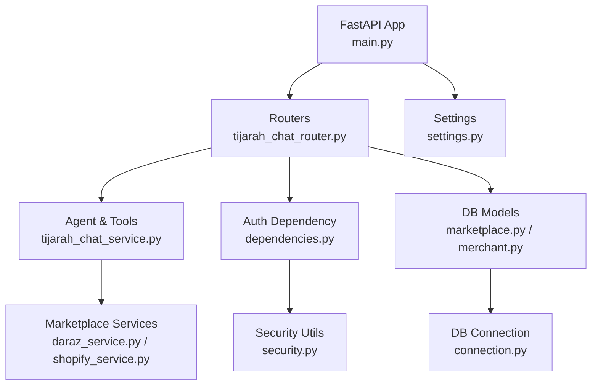
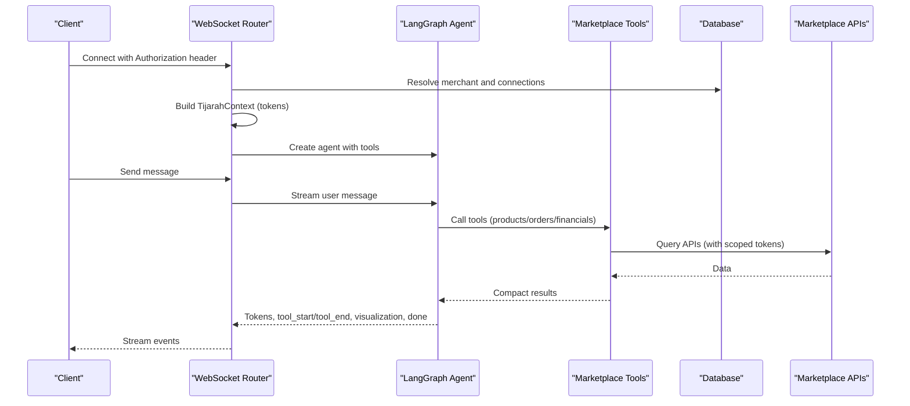
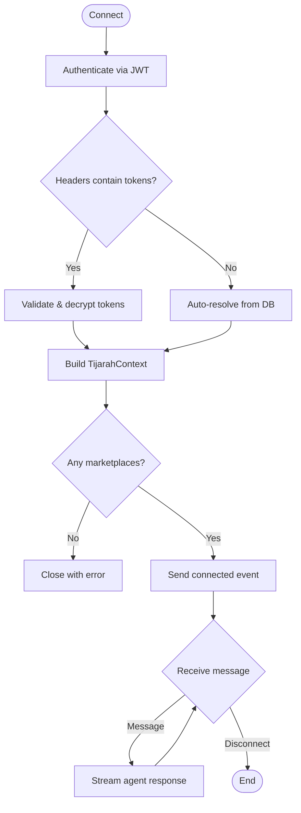
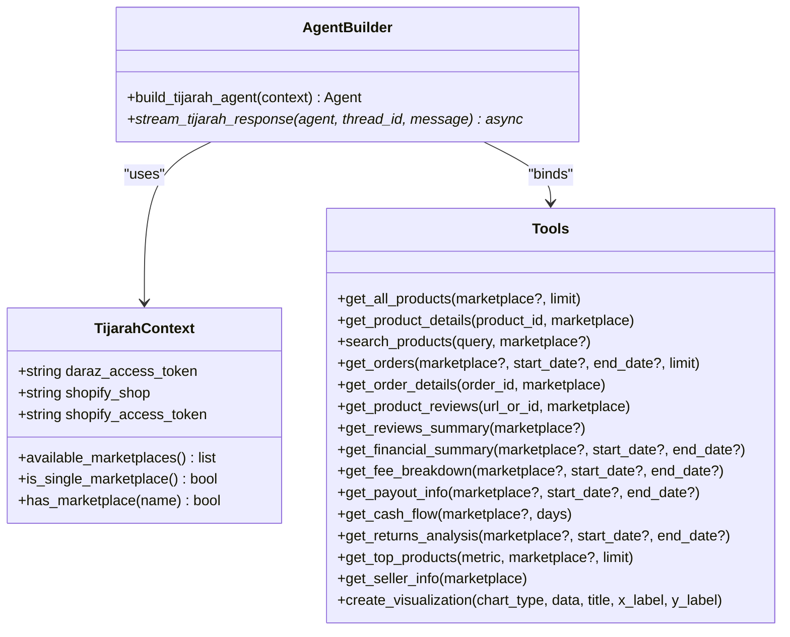
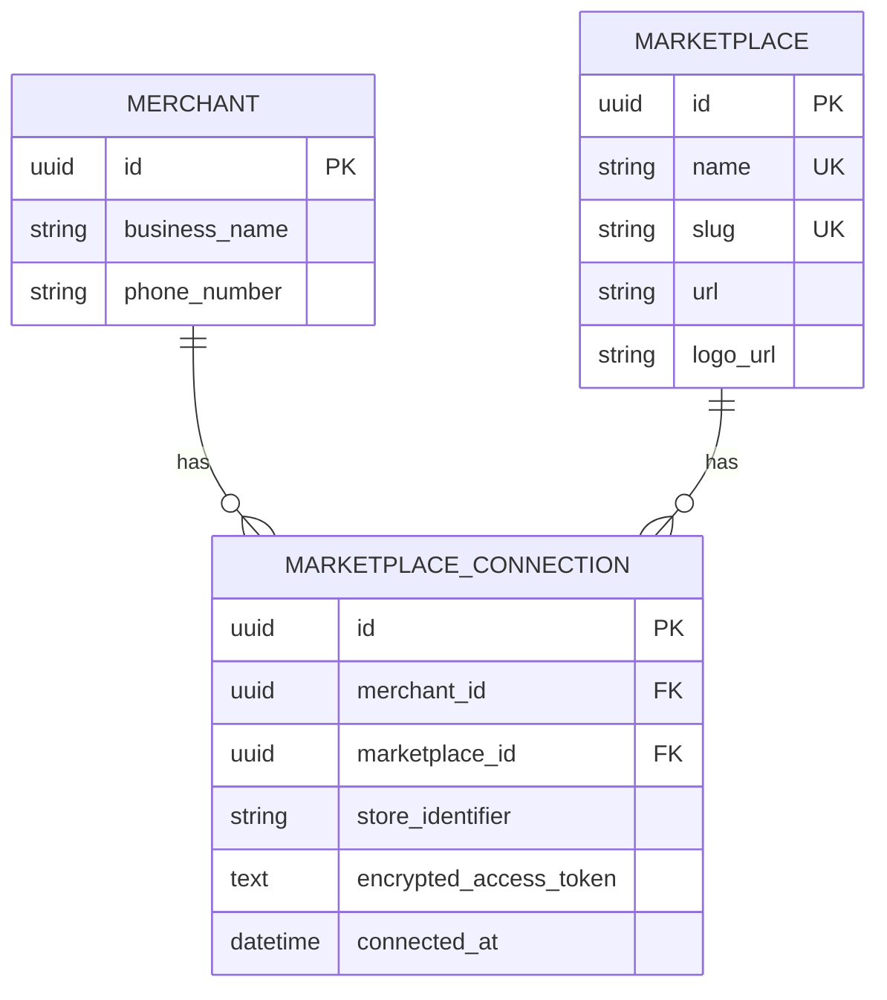
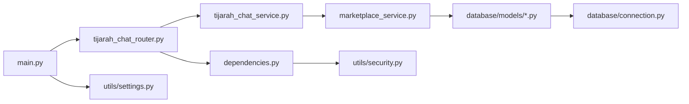

# Tijarah Chat Multi-Marketplace Agent

<cite>
**Referenced Files in This Document**
- [main.py](file://neurocom_backend/main.py)
- [tijarah_chat_router.py](file://neurocom_backend/routers/tijarah_chat_router.py)
- [tijarah_chat_service.py](file://neurocom_backend/services/tijarah_chat_service.py)
- [marketplace_service.py](file://neurocom_backend/services/marketplace_service.py)
- [marketplace.py](file://neurocom_backend/database/models/marketplace.py)
- [merchant.py](file://neurocom_backend/database/models/merchant.py)
- [dependencies.py](file://neurocom_backend/dependencies.py)
- [security.py](file://neurocom_backend/utils/security.py)
- [settings.py](file://neurocom_backend/utils/settings.py)
- [connection.py](file://neurocom_backend/database/connection.py)
- [pyproject.toml](file://pyproject.toml)
- [README.md](file://README.md)
</cite>

## Table of Contents
1. [Introduction](#introduction)
2. [Project Structure](#project-structure)
3. [Core Components](#core-components)
4. [Architecture Overview](#architecture-overview)
5. [Detailed Component Analysis](#detailed-component-analysis)
6. [Dependency Analysis](#dependency-analysis)
7. [Performance Considerations](#performance-considerations)
8. [Troubleshooting Guide](#troubleshooting-guide)
9. [Conclusion](#conclusion)
10. [Appendices](#appendices)

## Introduction
Tijarah Chat is a multi-marketplace conversational agent that lets merchants ask questions about products, orders, reviews, financials, and operations across connected stores (Daraz and Shopify). It exposes a WebSocket endpoint for real-time streaming responses, resolves marketplace credentials per session, and uses a LangGraph tool-calling agent to query marketplaces and render visualizations.

The backend is built with FastAPI, SQLModel for data modeling, and integrates with external services via dedicated service modules. Authentication is handled via JWT tokens, with a WebSocket-aware dependency for secure connections.

**Section sources**
- [README.md:1-6](file://README.md#L1-L6)
- [main.py:1-92](file://neurocom_backend/main.py#L1-L92)

## Project Structure
At a high level:
- Entry point initializes the FastAPI app, applies CORS, mounts SSE, and includes routers.
- Routers define HTTP/WebSocket endpoints; the Tijarah Chat router handles the multi-marketplace chat flow.
- Services implement business logic, including marketplace integrations and the AI agent orchestration.
- Database models define entities like Merchant and MarketplaceConnection.
- Utilities provide security helpers and settings.

**Diagram sources**
- [main.py:1-92](file://neurocom_backend/main.py#L1-L92)
- [tijarah_chat_router.py:1-227](file://neurocom_backend/routers/tijarah_chat_router.py#L1-L227)
- [tijarah_chat_service.py:1-993](file://neurocom_backend/services/tijarah_chat_service.py#L1-L993)
- [marketplace.py:1-105](file://neurocom_backend/database/models/marketplace.py#L1-L105)
- [merchant.py:1-30](file://neurocom_backend/database/models/merchant.py#L1-L30)
- [dependencies.py:1-79](file://neurocom_backend/dependencies.py#L1-L79)
- [security.py:1-44](file://neurocom_backend/utils/security.py#L1-L44)
- [connection.py:1-27](file://neurocom_backend/database/connection.py#L1-L27)
- [settings.py:1-29](file://neurocom_backend/utils/settings.py#L1-L29)

**Section sources**
- [main.py:1-92](file://neurocom_backend/main.py#L1-L92)
- [pyproject.toml:1-41](file://pyproject.toml#L1-L41)

## Core Components
- WebSocket Router: Authenticates users over WebSocket, resolves marketplace credentials (explicit headers or auto-resolved from DB), builds an agent, and streams events back to the client.
- Agent Service: Defines tools for catalog, orders, reviews, financials, returns, seller info, and visualization. Uses LangGraph to call tools and stream tokenized responses.
- Marketplace Integration: Connects Daraz and Shopify stores, encrypting and storing access tokens securely, and exposing utilities to identify marketplace types.
- Security & Auth: JWT-based authentication with WebSocket support; encrypted storage of marketplace tokens using Fernet.
- Data Layer: SQLModel models for Merchant and MarketplaceConnection; migrations run at startup.

Key responsibilities:
- Session scoping: Each WebSocket connection binds to a specific set of marketplaces based on provided headers or DB records.
- Tool outputs: Compact summaries to keep conversation context affordable.
- Streaming: Real-time token, tool lifecycle, visualization, and completion events.

**Section sources**
- [tijarah_chat_router.py:1-227](file://neurocom_backend/routers/tijarah_chat_router.py#L1-L227)
- [tijarah_chat_service.py:1-993](file://neurocom_backend/services/tijarah_chat_service.py#L1-L993)
- [marketplace_service.py:1-302](file://neurocom_backend/services/marketplace_service.py#L1-L302)
- [security.py:1-44](file://neurocom_backend/utils/security.py#L1-L44)
- [marketplace.py:1-105](file://neurocom_backend/database/models/marketplace.py#L1-L105)
- [merchant.py:1-30](file://neurocom_backend/database/models/merchant.py#L1-L30)
- [connection.py:1-27](file://neurocom_backend/database/connection.py#L1-L27)

## Architecture Overview
The system follows a layered architecture:
- Presentation: FastAPI routes and WebSocket handlers.
- Orchestration: LangGraph agent with tools bound to merchant-specific credentials.
- Integration: Marketplaces (Daraz, Shopify) via service modules.
- Persistence: SQLModel models and database migrations.
- Security: JWT auth and encrypted token storage.

**Diagram sources**
- [tijarah_chat_router.py:133-227](file://neurocom_backend/routers/tijarah_chat_router.py#L133-L227)
- [tijarah_chat_service.py:928-993](file://neurocom_backend/services/tijarah_chat_service.py#L928-L993)
- [marketplace_service.py:236-302](file://neurocom_backend/services/marketplace_service.py#L236-L302)
- [connection.py:15-27](file://neurocom_backend/database/connection.py#L15-L27)

## Detailed Component Analysis

### WebSocket Router: /tijarah/ask_tijarah
Responsibilities:
- Accept WebSocket connections and authenticate via JWT.
- Resolve marketplace credentials either from explicit headers or by scanning the merchant’s connected stores.
- Build the agent and stream events back to the client.

Flow highlights:
- If headers include encrypted tokens, validate them against the merchant’s connections and decrypt.
- Otherwise, auto-resolve all connected marketplaces and decrypt stored tokens.
- Send a welcome event listing available marketplaces.
- Loop to receive messages and stream agent responses.

Error handling:
- Invalid JSON or missing message fields return error events.
- No marketplace connections result in a close with reason.

**Diagram sources**
- [tijarah_chat_router.py:133-227](file://neurocom_backend/routers/tijarah_chat_router.py#L133-L227)

**Section sources**
- [tijarah_chat_router.py:1-227](file://neurocom_backend/routers/tijarah_chat_router.py#L1-L227)

### Agent & Tools: tijarah_chat_service
Responsibilities:
- Define ~16 tools covering catalog, orders, reviews, financials, returns, seller info, and visualization.
- Bind tools to a per-session context containing resolved marketplace credentials.
- Build a LangGraph agent with a tailored system prompt and memory saver.
- Stream events: token deltas, tool lifecycle, visualization specs, completion, and errors.

Key design patterns:
- Context scoping: Tools accept optional marketplace parameter; if omitted, query all connected marketplaces and tag results.
- Compact outputs: Summarize API payloads to reduce token usage in conversation history.
- Visualization: Generate Plotly chart specs for frontend rendering.

Streaming pipeline:
- Yields events for each streamed chunk, tool start/end, visualization output, and final done/error.

**Diagram sources**
- [tijarah_chat_service.py:71-93](file://neurocom_backend/services/tijarah_chat_service.py#L71-L93)
- [tijarah_chat_service.py:177-881](file://neurocom_backend/services/tijarah_chat_service.py#L177-L881)
- [tijarah_chat_service.py:928-993](file://neurocom_backend/services/tijarah_chat_service.py#L928-L993)

**Section sources**
- [tijarah_chat_service.py:1-993](file://neurocom_backend/services/tijarah_chat_service.py#L1-L993)

### Marketplace Connections & Credentials
Responsibilities:
- Manage marketplace definitions and merchant connections.
- Encrypt and store access tokens securely.
- Provide utilities to identify marketplace types and resolve credentials.

Data model highlights:
- Marketplace: name, slug, url, logo_url.
- MarketplaceConnection: links merchant to marketplace with encrypted token and store identifier.

Credential resolution:
- For Daraz: validate encrypted token belongs to merchant and decrypt.
- For Shopify: decode shop domain and access token from encrypted credentials.

**Diagram sources**
- [marketplace.py:17-41](file://neurocom_backend/database/models/marketplace.py#L17-L41)
- [merchant.py:11-15](file://neurocom_backend/database/models/merchant.py#L11-L15)

**Section sources**
- [marketplace_service.py:1-302](file://neurocom_backend/services/marketplace_service.py#L1-L302)
- [marketplace.py:1-105](file://neurocom_backend/database/models/marketplace.py#L1-L105)
- [merchant.py:1-30](file://neurocom_backend/database/models/merchant.py#L1-L30)

### Authentication & Security
Responsibilities:
- JWT-based authentication for HTTP and WebSocket.
- Encrypted storage of marketplace tokens using Fernet derived from SECRET_KEY.
- Centralized settings for JWT algorithm, token expiry, and other environment variables.

Key points:
- get_current_user_ws reads Authorization header directly to support WebSocket handshake.
- Secrets loaded early to ensure consistent configuration across imports.

**Section sources**
- [dependencies.py:1-79](file://neurocom_backend/dependencies.py#L1-L79)
- [security.py:1-44](file://neurocom_backend/utils/security.py#L1-L44)
- [settings.py:1-29](file://neurocom_backend/utils/settings.py#L1-L29)

## Dependency Analysis
High-level dependencies:
- main.py wires routers, middleware, and lifespan.
- tijarah_chat_router depends on dependencies, marketplace_service, and tijarah_chat_service.
- tijarah_chat_service depends on marketplace services and LangChain/LangGraph components.
- marketplace_service depends on database models and security utilities.
- connection.py provides engine and session management.

**Diagram sources**
- [main.py:1-92](file://neurocom_backend/main.py#L1-L92)
- [tijarah_chat_router.py:1-227](file://neurocom_backend/routers/tijarah_chat_router.py#L1-L227)
- [tijarah_chat_service.py:1-993](file://neurocom_backend/services/tijarah_chat_service.py#L1-L993)
- [marketplace_service.py:1-302](file://neurocom_backend/services/marketplace_service.py#L1-L302)
- [marketplace.py:1-105](file://neurocom_backend/database/models/marketplace.py#L1-L105)
- [merchant.py:1-30](file://neurocom_backend/database/models/merchant.py#L1-L30)
- [connection.py:1-27](file://neurocom_backend/database/connection.py#L1-L27)
- [settings.py:1-29](file://neurocom_backend/utils/settings.py#L1-L29)
- [dependencies.py:1-79](file://neurocom_backend/dependencies.py#L1-L79)
- [security.py:1-44](file://neurocom_backend/utils/security.py#L1-L44)

**Section sources**
- [main.py:1-92](file://neurocom_backend/main.py#L1-L92)
- [pyproject.toml:1-41](file://pyproject.toml#L1-L41)

## Performance Considerations
- Compact tool outputs: Minimize payload sizes to reduce token usage and improve conversation affordability.
- Streaming: Use token streaming for responsive UI updates and better perceived performance.
- Per-connection memory: MemorySaver is per WebSocket connection; avoid sharing state across workers.
- Marketplace queries: Limit results where possible (e.g., limits on product/order lists) to reduce latency.
- Encryption overhead: Decrypt only when needed; cache decrypted values within the session scope.

[No sources needed since this section provides general guidance]

## Troubleshooting Guide
Common issues and resolutions:
- No marketplace connections: The router closes the WebSocket with an error if no connected marketplaces are found. Ensure at least one marketplace is connected for the merchant.
- Invalid encrypted tokens: If provided headers do not match merchant connections or cannot be decrypted, a WebSocketException is raised. Verify tokens belong to the authenticated merchant.
- Missing message field: Clients must send valid JSON with a "message" field; otherwise, an error event is returned.
- Authentication failures: Ensure the WebSocket handshake includes a valid Authorization header with a bearer token.

Operational checks:
- Health endpoint: Use /health to verify server status.
- Logs: Inspect warnings for decryption failures during auto-resolution.

**Section sources**
- [tijarah_chat_router.py:176-184](file://neurocom_backend/routers/tijarah_chat_router.py#L176-L184)
- [tijarah_chat_router.py:200-227](file://neurocom_backend/routers/tijarah_chat_router.py#L200-L227)
- [main.py:44-46](file://neurocom_backend/main.py#L44-L46)

## Conclusion
Tijarah Chat provides a robust, multi-marketplace conversational interface for merchants, enabling unified insights across Daraz and Shopify through a secure, streaming WebSocket experience. Its modular design separates concerns between routing, agent orchestration, marketplace integration, and persistence, while maintaining strong security practices for credential management.

[No sources needed since this section summarizes without analyzing specific files]

## Appendices

### Running the Server
- Start the server using the documented command or Makefile target.

**Section sources**
- [README.md:3-5](file://README.md#L3-L5)

### Environment Configuration
- Key settings include JWT parameters, Redis configuration, marketplace API keys, and Supabase storage options.

**Section sources**
- [settings.py:11-29](file://neurocom_backend/utils/settings.py#L11-L29)