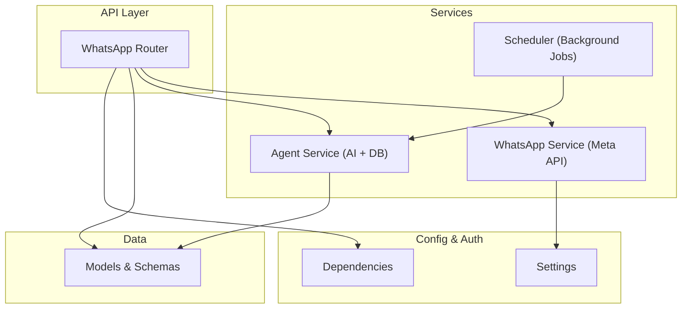
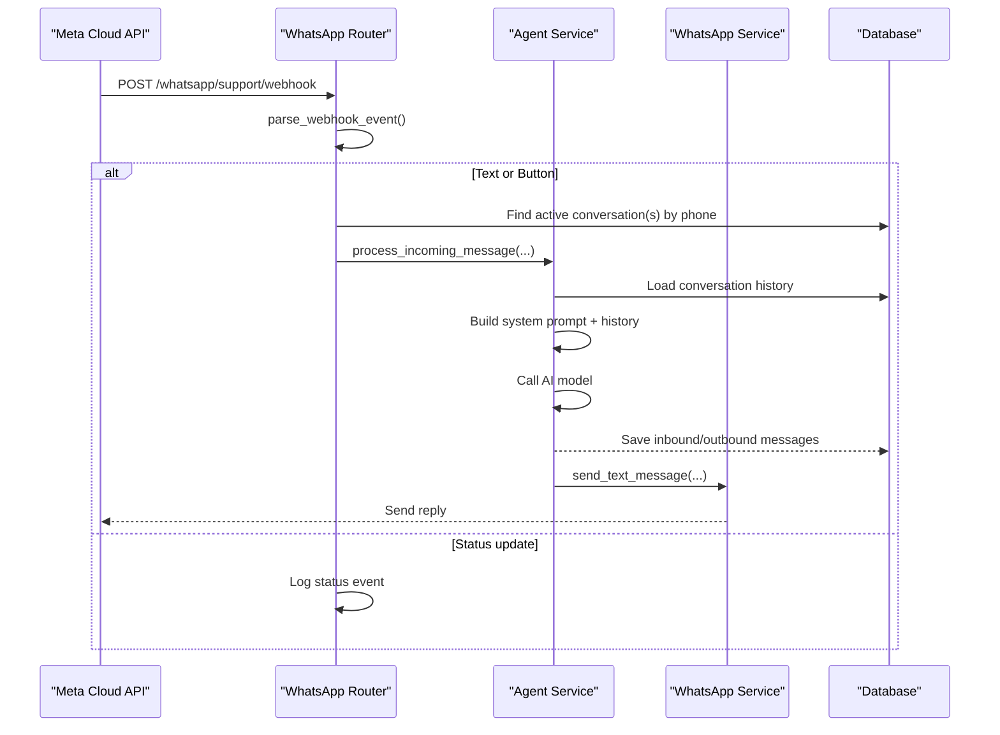
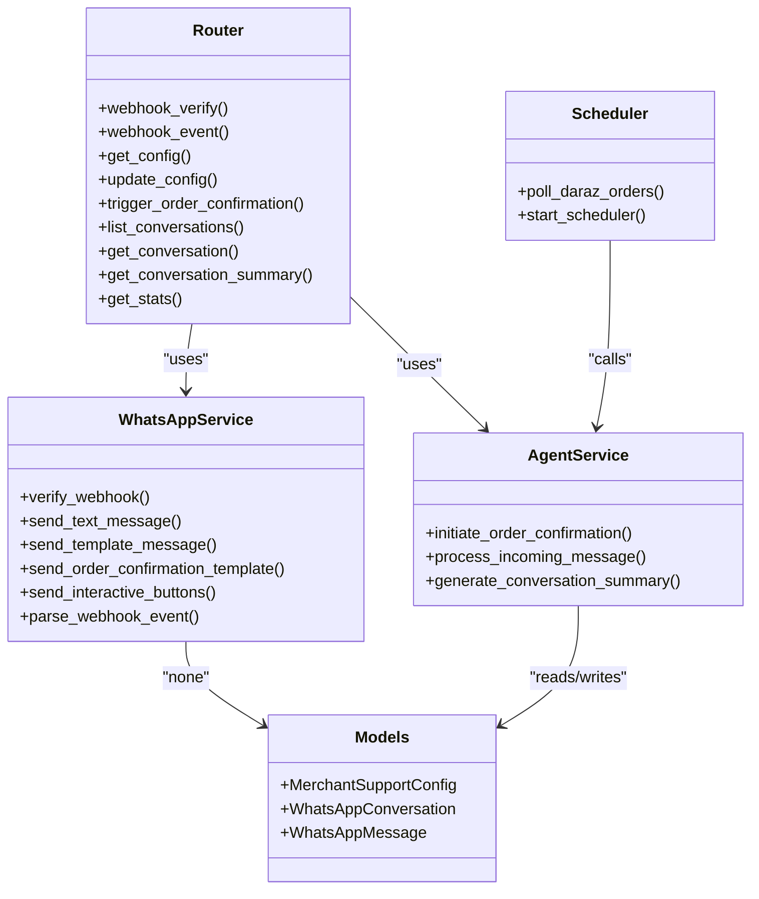

# WhatsApp Business Integration

<cite>
**Referenced Files in This Document**
- [whatsapp_support_router.py](file://neurocom_backend/routers/whatsapp_support_router.py)
- [whatsapp_service.py](file://neurocom_backend/services/whatsapp_service.py)
- [whatsapp_agent_service.py](file://neurocom_backend/services/whatsapp_agent_service.py)
- [whatsapp_support.py](file://neurocom_backend/database/models/whatsapp_support.py)
- [whatsapp_scheduler.py](file://neurocom_backend/services/whatsapp_scheduler.py)
- [settings.py](file://neurocom_backend/utils/settings.py)
- [dependencies.py](file://neurocom_backend/dependencies.py)
</cite>

## Table of Contents
1. [Introduction](#introduction)
2. [Project Structure](#project-structure)
3. [Core Components](#core-components)
4. [Architecture Overview](#architecture-overview)
5. [Detailed Component Analysis](#detailed-component-analysis)
6. [Dependency Analysis](#dependency-analysis)
7. [Performance Considerations](#performance-considerations)
8. [Troubleshooting Guide](#troubleshooting-guide)
9. [Conclusion](#conclusion)

## Introduction
This document explains the WhatsApp Business integration for automated order confirmation and customer support via Meta’s WhatsApp Cloud API. It covers how incoming messages are received, how AI-driven responses are generated, how conversations are persisted, and how background jobs poll marketplace orders to trigger confirmations.

## Project Structure
The integration is organized into:
- Router layer exposing FastAPI endpoints for webhooks and merchant operations
- Services for WhatsApp API communication and AI agent orchestration
- Database models for conversations, messages, and merchant settings
- A scheduler that periodically polls marketplace orders and initiates confirmations
- Shared configuration and authentication dependencies

**Diagram sources**
- [whatsapp_support_router.py:46-121](file://neurocom_backend/routers/whatsapp_support_router.py#L46-L121)
- [whatsapp_service.py:28-51](file://neurocom_backend/services/whatsapp_service.py#L28-L51)
- [whatsapp_agent_service.py:156-238](file://neurocom_backend/services/whatsapp_agent_service.py#L156-L238)
- [whatsapp_scheduler.py:42-66](file://neurocom_backend/services/whatsapp_scheduler.py#L42-L66)
- [whatsapp_support.py:42-117](file://neurocom_backend/database/models/whatsapp_support.py#L42-L117)
- [settings.py:30-36](file://neurocom_backend/utils/settings.py#L30-L36)
- [dependencies.py:34-43](file://neurocom_backend/dependencies.py#L34-L43)

**Section sources**
- [whatsapp_support_router.py:1-121](file://neurocom_backend/routers/whatsapp_support_router.py#L1-L121)
- [whatsapp_service.py:1-51](file://neurocom_backend/services/whatsapp_service.py#L1-L51)
- [whatsapp_agent_service.py:1-45](file://neurocom_backend/services/whatsapp_agent_service.py#L1-L45)
- [whatsapp_scheduler.py:1-38](file://neurocom_backend/services/whatsapp_scheduler.py#L1-L38)
- [whatsapp_support.py:1-40](file://neurocom_backend/database/models/whatsapp_support.py#L1-L40)
- [settings.py:1-36](file://neurocom_backend/utils/settings.py#L1-L36)
- [dependencies.py:1-43](file://neurocom_backend/dependencies.py#L1-L43)

## Core Components
- Webhook router: verifies webhook subscription and receives incoming events; dispatches message processing as background tasks
- WhatsApp service: low-level HTTP client for Meta’s Cloud API, including template and interactive message sending, and webhook parsing
- Agent service: orchestrates AI-powered conversation handling, status transitions, and summary generation
- Data models: defines conversations, messages, merchant config, and enums for lifecycle states
- Scheduler: periodic polling of marketplace orders to initiate WhatsApp confirmations

**Section sources**
- [whatsapp_support_router.py:49-141](file://neurocom_backend/routers/whatsapp_support_router.py#L49-L141)
- [whatsapp_service.py:54-209](file://neurocom_backend/services/whatsapp_service.py#L54-L209)
- [whatsapp_agent_service.py:156-333](file://neurocom_backend/services/whatsapp_agent_service.py#L156-L333)
- [whatsapp_support.py:42-117](file://neurocom_backend/database/models/whatsapp_support.py#L42-L117)
- [whatsapp_scheduler.py:42-151](file://neurocom_backend/services/whatsapp_scheduler.py#L42-L151)

## Architecture Overview
End-to-end flow from Meta webhook to AI response and database updates:

**Diagram sources**
- [whatsapp_support_router.py:68-121](file://neurocom_backend/routers/whatsapp_support_router.py#L68-L121)
- [whatsapp_service.py:213-293](file://neurocom_backend/services/whatsapp_service.py#L213-L293)
- [whatsapp_agent_service.py:241-333](file://neurocom_backend/services/whatsapp_agent_service.py#L241-L333)

## Detailed Component Analysis

### Webhook Router
Responsibilities:
- Verify webhook subscription with Meta using a verify token
- Receive incoming messages and status updates
- Parse payloads and dispatch background processing per conversation
- Provide authenticated endpoints for merchants to manage configuration, trigger order confirmations, list conversations, generate summaries, and view stats

Key behaviors:
- Background task execution ensures fast responses to Meta
- Conversation lookup uses active status and customer phone
- Merchant-scoped queries protect data isolation

**Section sources**
- [whatsapp_support_router.py:49-141](file://neurocom_backend/routers/whatsapp_support_router.py#L49-L141)
- [whatsapp_support_router.py:146-310](file://neurocom_backend/routers/whatsapp_support_router.py#L146-L310)

### WhatsApp Service (Meta API Client)
Responsibilities:
- Construct headers and URLs using environment-based credentials
- Send text, template, and interactive button messages
- Verify webhook subscriptions
- Parse webhook payloads into normalized events

Error handling:
- Raises on non-2xx responses
- Logs exceptions during payload parsing

**Section sources**
- [whatsapp_service.py:28-51](file://neurocom_backend/services/whatsapp_service.py#L28-L51)
- [whatsapp_service.py:54-67](file://neurocom_backend/services/whatsapp_service.py#L54-L67)
- [whatsapp_service.py:71-209](file://neurocom_backend/services/whatsapp_service.py#L71-L209)
- [whatsapp_service.py:213-293](file://neurocom_backend/services/whatsapp_service.py#L213-L293)

### Agent Service (AI Orchestration)
Responsibilities:
- Initiate order confirmation flows by creating conversations and sending templates
- Process incoming messages: detect quick replies, build context, call AI, persist messages, apply actions, and send replies
- Generate conversation summaries for merchants

AI integration:
- Uses an OpenAI-compatible client configured via environment variables
- Enforces JSON output for structured actions
- Fallbacks on safe default responses when AI fails

State transitions:
- Updates confirmation status based on actions (confirm, cancel, modify, escalate)
- Closes conversations on final outcomes

**Section sources**
- [whatsapp_agent_service.py:47-137](file://neurocom_backend/services/whatsapp_agent_service.py#L47-L137)
- [whatsapp_agent_service.py:156-238](file://neurocom_backend/services/whatsapp_agent_service.py#L156-L238)
- [whatsapp_agent_service.py:241-333](file://neurocom_backend/services/whatsapp_agent_service.py#L241-L333)
- [whatsapp_agent_service.py:336-398](file://neurocom_backend/services/whatsapp_agent_service.py#L336-L398)
- [whatsapp_agent_service.py:400-457](file://neurocom_backend/services/whatsapp_agent_service.py#L400-L457)

### Data Models and Schemas
Defines:
- Merchant support configuration (phone number, auto-confirm, instructions)
- Conversations (per merchant/customer/order) with lifecycle statuses
- Messages (user, assistant, system) with metadata
- Pydantic schemas for request/response validation

Enums:
- ConfirmationStatus: pending, sent, confirmed, cancelled, modified, no_response, escalated
- ConversationStatus: active, closed, escalated
- MessageRole: assistant, user, system

**Section sources**
- [whatsapp_support.py:15-38](file://neurocom_backend/database/models/whatsapp_support.py#L15-L38)
- [whatsapp_support.py:42-117](file://neurocom_backend/database/models/whatsapp_support.py#L42-L117)
- [whatsapp_support.py:119-182](file://neurocom_backend/database/models/whatsapp_support.py#L119-L182)

### Scheduler (Background Jobs)
Responsibilities:
- Periodically poll marketplace orders for new entries
- For each eligible merchant with WhatsApp enabled and auto-confirm on, initiate order confirmation via WhatsApp
- Track processed order IDs to avoid duplicates

Integration points:
- Decrypts marketplace access tokens
- Extracts and normalizes customer phone numbers
- Delegates to agent service to start confirmations

**Section sources**
- [whatsapp_scheduler.py:37-66](file://neurocom_backend/services/whatsapp_scheduler.py#L37-L66)
- [whatsapp_scheduler.py:69-151](file://neurocom_backend/services/whatsapp_scheduler.py#L69-L151)
- [whatsapp_scheduler.py:154-177](file://neurocom_backend/services/whatsapp_scheduler.py#L154-L177)
- [whatsapp_scheduler.py:179-200](file://neurocom_backend/services/whatsapp_scheduler.py#L179-L200)

### Configuration and Authentication
- Settings module centralizes environment variables for WhatsApp tokens, account IDs, and API version
- Dependencies provide authenticated merchant resolution for protected endpoints

**Section sources**
- [settings.py:30-36](file://neurocom_backend/utils/settings.py#L30-L36)
- [dependencies.py:34-43](file://neurocom_backend/dependencies.py#L34-L43)

## Dependency Analysis
High-level relationships between components:

**Diagram sources**
- [whatsapp_support_router.py:46-310](file://neurocom_backend/routers/whatsapp_support_router.py#L46-L310)
- [whatsapp_service.py:28-209](file://neurocom_backend/services/whatsapp_service.py#L28-L209)
- [whatsapp_agent_service.py:156-457](file://neurocom_backend/services/whatsapp_agent_service.py#L156-L457)
- [whatsapp_support.py:42-117](file://neurocom_backend/database/models/whatsapp_support.py#L42-L117)
- [whatsapp_scheduler.py:42-200](file://neurocom_backend/services/whatsapp_scheduler.py#L42-L200)

**Section sources**
- [whatsapp_support_router.py:46-310](file://neurocom_backend/routers/whatsapp_support_router.py#L46-L310)
- [whatsapp_service.py:28-209](file://neurocom_backend/services/whatsapp_service.py#L28-L209)
- [whatsapp_agent_service.py:156-457](file://neurocom_backend/services/whatsapp_agent_service.py#L156-L457)
- [whatsapp_support.py:42-117](file://neurocom_backend/database/models/whatsapp_support.py#L42-L117)
- [whatsapp_scheduler.py:42-200](file://neurocom_backend/services/whatsapp_scheduler.py#L42-L200)

## Performance Considerations
- Webhook handler returns quickly by offloading message processing to background tasks
- AI calls use constrained parameters (temperature, max_tokens) to reduce latency and cost
- Deduplication of processed orders prevents redundant confirmations
- Database queries are scoped by merchant and active status to minimize load
- Environment-driven configuration avoids runtime overhead

[No sources needed since this section provides general guidance]

## Troubleshooting Guide
Common issues and where to investigate:
- Webhook verification failures: check verify token configuration and route mapping
- Invalid webhook payloads: ensure correct JSON structure and field names
- No active conversation found: verify customer phone normalization and conversation state
- AI call errors: inspect logs for network or model errors; fallback behavior returns safe messages
- Template sending failures: validate access token, phone number ID, and template approval
- Scheduler not triggering confirmations: verify merchant settings, marketplace connection, and token decryption

Relevant code paths:
- Webhook verification and event parsing
- Background message processing and AI invocation
- Order confirmation initiation and status updates
- Scheduler loop and error logging

**Section sources**
- [whatsapp_support_router.py:51-121](file://neurocom_backend/routers/whatsapp_support_router.py#L51-L121)
- [whatsapp_service.py:54-67](file://neurocom_backend/services/whatsapp_service.py#L54-L67)
- [whatsapp_service.py:213-293](file://neurocom_backend/services/whatsapp_service.py#L213-L293)
- [whatsapp_agent_service.py:119-137](file://neurocom_backend/services/whatsapp_agent_service.py#L119-L137)
- [whatsapp_agent_service.py:241-333](file://neurocom_backend/services/whatsapp_agent_service.py#L241-L333)
- [whatsapp_scheduler.py:42-151](file://neurocom_backend/services/whatsapp_scheduler.py#L42-L151)

## Conclusion
The WhatsApp Business integration provides a robust, scalable pipeline for automated order confirmations and AI-assisted customer support. It combines reliable webhook handling, resilient messaging to Meta’s Cloud API, persistent conversation tracking, and scheduled marketplace polling. The modular design allows easy extension for additional message types, multi-marketplace support, and enhanced analytics.

[No sources needed since this section summarizes without analyzing specific files]