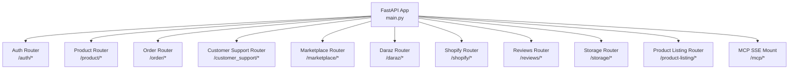
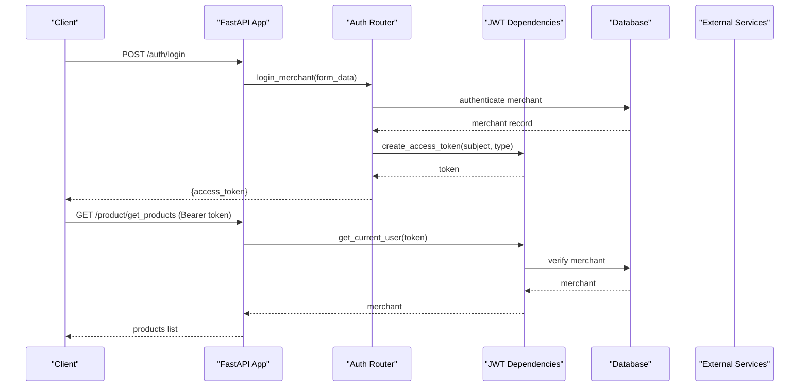
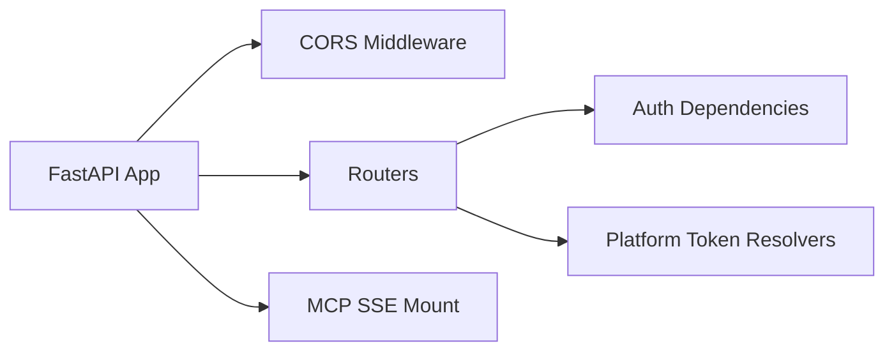

# API Reference

<cite>
**Referenced Files in This Document**
- [main.py](file://neurocom_backend/main.py)
- [dependencies.py](file://neurocom_backend/dependencies.py)
- [auth_router.py](file://neurocom_backend/routers/auth_router.py)
- [product_router.py](file://neurocom_backend/routers/product_router.py)
- [order_router.py](file://neurocom_backend/routers/order_router.py)
- [customer_support_router.py](file://neurocom_backend/routers/customer_support_router.py)
- [marketplace_router.py](file://neurocom_backend/routers/marketplace_router.py)
- [daraz_router.py](file://neurocom_backend/routers/daraz_router.py)
- [shopify_router.py](file://neurocom_backend/routers/shopify_router.py)
- [reviews_router.py](file://neurocom_backend/routers/reviews_router.py)
- [storage_router.py](file://neurocom_backend/routers/storage_router.py)
- [product_listing_router.py](file://neurocom_backend/routers/product_listing_router.py)
- [sse.py](file://neurocom_backend/utils/sse.py)
</cite>

## Table of Contents
1. Introduction
2. Project Structure
3. Core Components
4. Architecture Overview
5. Detailed Component Analysis
6. Dependency Analysis
7. Performance Considerations
8. Troubleshooting Guide
9. Conclusion
10. Appendices

## Introduction
This document provides a comprehensive API reference for the Tijarah AI Backend. It covers all REST endpoints, authentication and authorization, streaming via Server-Sent Events (SSE), and WebSocket support. It also includes request/response schemas, status codes, error handling, rate limiting notes, security considerations, and client integration patterns.

## Project Structure
The application is built with FastAPI. The main entrypoint mounts routers and middleware, sets up CORS, and mounts an SSE-based MCP endpoint. Authentication is enforced at router level using JWT-based dependencies.

**Diagram sources**
- [main.py:16-37](file://neurocom_backend/main.py#L16-L37)
- [main.py:78-89](file://neurocom_backend/main.py#L78-L89)

**Section sources**
- [main.py:16-37](file://neurocom_backend/main.py#L16-L37)
- [main.py:78-89](file://neurocom_backend/main.py#L78-L89)

## Core Components
- Authentication and Authorization:
  - JWT-based access tokens issued on login.
  - Merchant-scoped access; role-based guards available.
  - WebSocket auth helper reads Authorization header from handshake.
- Routers:
  - Feature-specific routers under /auth, /product, /order, /customer_support, /marketplace, /daraz, /shopify, /reviews, /storage, /product-listing.
- Streaming:
  - SSE streams for long-running analytics and insights.
- External Integrations:
  - Daraz and Shopify marketplace integrations with OAuth flows and encrypted token handling.

**Section sources**
- [dependencies.py:17-79](file://neurocom_backend/dependencies.py#L17-L79)
- [auth_router.py:15-43](file://neurocom_backend/routers/auth_router.py#L15-L43)
- [daraz_router.py:24-79](file://neurocom_backend/routers/daraz_router.py#L24-L79)
- [shopify_router.py:44-62](file://neurocom_backend/routers/shopify_router.py#L44-L62)
- [reviews_router.py:17-42](file://neurocom_backend/routers/reviews_router.py#L17-L42)
- [daraz_router.py:298-312](file://neurocom_backend/routers/daraz_router.py#L298-L312)

## Architecture Overview
The backend exposes REST APIs grouped by domain. Most endpoints require JWT authentication. Some endpoints additionally require platform-specific credentials (e.g., Daraz or Shopify access tokens). Streaming endpoints return SSE for real-time updates.

**Diagram sources**
- [auth_router.py:24-42](file://neurocom_backend/routers/auth_router.py#L24-L42)
- [dependencies.py:34-43](file://neurocom_backend/dependencies.py#L34-L43)
- [product_router.py:30-33](file://neurocom_backend/routers/product_router.py#L30-L33)

## Detailed Component Analysis

### Authentication and Authorization
- Endpoints:
  - POST /auth/signup
    - Request: JSON body representing a new merchant.
    - Response: Created merchant object.
    - Notes: No auth required.
  - POST /auth/login
    - Request: Form-encoded username and password (OAuth2PasswordRequestForm).
    - Response: Token object containing access_token.
    - Status Codes: 200 on success; 401 if credentials are invalid.
  - GET /auth/me
    - Request: Bearer token in Authorization header.
    - Response: Current merchant profile.
    - Status Codes: 200 on success; 401 if token is invalid or missing.

- Security:
  - JWT access tokens created on successful login.
  - get_current_user dependency validates token and resolves merchant.
  - Role-based guard available for admin-only routes.

**Section sources**
- [auth_router.py:18-42](file://neurocom_backend/routers/auth_router.py#L18-L42)
- [dependencies.py:34-43](file://neurocom_backend/dependencies.py#L34-L43)

### Product Management
- Endpoints:
  - POST /product/create_product
    - Request: Product model payload.
    - Response: Confirmation with new product details.
  - PUT /product/update_product
    - Request: Updated product model payload.
    - Response: Updated product details.
  - GET /product/get_product/{product_id}
    - Path Param: product_id (UUID).
    - Response: Product details.
  - GET /product/get_products
    - Response: List of products.
  - DELETE /product/delete_product/{product_id}
    - Path Param: product_id (UUID).
    - Response: Deleted product confirmation.

- Notes:
  - These endpoints do not enforce JWT in their definitions; consider adding authentication if needed.

**Section sources**
- [product_router.py:15-38](file://neurocom_backend/routers/product_router.py#L15-L38)

### Order Management
- Endpoints:
  - POST /order/create_order
    - Request: Order model payload.
    - Response: New order details.
  - PUT /order/update_order
    - Request: Updated order model payload.
    - Response: Updated order details.
  - GET /order/get_customer_orders?customer_id={uuid}
    - Query Param: customer_id (UUID).
    - Response: Orders for the given customer.
  - GET /order/get_order/{order_id}
    - Path Param: order_id (UUID).
    - Response: Order details.
  - DELETE /order/delete_order/{order_id}
    - Path Param: order_id (UUID).
    - Response: Deleted order confirmation.

- Notes:
  - These endpoints do not enforce JWT in their definitions; consider adding authentication if needed.

**Section sources**
- [order_router.py:16-39](file://neurocom_backend/routers/order_router.py#L16-L39)

### Customer Support
- Endpoints:
  - GET /customer_support/get_tools
    - Response: Available tools context from MCP client session.
  - GET /customer_support/chat/{prompt}
    - Path Param: prompt (string).
    - Response: Chat response content.

- Notes:
  - Uses MCP client session dependency to interact with external tools.

**Section sources**
- [customer_support_router.py:43-60](file://neurocom_backend/routers/customer_support_router.py#L43-L60)

### Marketplace Management
- Endpoints:
  - POST /marketplace/
    - Admin only. Creates a supported marketplace configuration.
  - GET /marketplace/
    - Lists marketplaces for the authenticated merchant.
  - GET /marketplace/connections
    - Lists marketplace connections for the authenticated merchant.
  - DELETE /marketplace/connections/{connection_id}
    - Disconnects a marketplace connection for the authenticated merchant.
  - GET /marketplace/{marketplace_id}
    - Retrieves a specific marketplace configuration.
  - PUT /marketplace/{marketplace_id}
    - Admin only. Updates a marketplace configuration.
  - DELETE /marketplace/{marketplace_id}
    - Admin only. Deletes a marketplace configuration.
  - POST /marketplace/{marketplace_id}/connect
    - Connects a marketplace for the authenticated merchant.
  - POST /marketplace/publish-to-connected-stores
    - Publishes a connected product to stores for the authenticated merchant.

- Authentication:
  - Most endpoints require JWT (get_current_user).
  - Admin-only endpoints use require_admin.

**Section sources**
- [marketplace_router.py:36-118](file://neurocom_backend/routers/marketplace_router.py#L36-L118)
- [dependencies.py:67-79](file://neurocom_backend/dependencies.py#L67-L79)

### Daraz Integration
- Authentication:
  - Requires X-Daraz-Access-Token header containing an encrypted token tied to the authenticated merchant’s active Daraz connection.
  - Access token resolution validates merchant ownership and decrypts the token.

- Endpoints:
  - GET /daraz/get_auth_code
    - Redirects to Daraz OAuth authorize URL.
  - GET /daraz/get_access_token?code={code}
    - Exchanges code for access token.
  - GET /daraz/get_all_products
    - Lists products for the authenticated merchant’s Daraz store.
  - GET /daraz/get_product_by_id?product_id={int}
    - Retrieves a product by ID.
  - GET /daraz/get_all_product_reviews
    - Retrieves all product reviews.
  - GET /daraz/get_product_reviews?item_id={str}
    - Retrieves reviews for a specific item.
  - GET /daraz/scrape_product_reviews?product_url={url}
    - Scrapes reviews from a product page.
  - GET /daraz/get_all_categories
    - Lists categories.
  - GET /daraz/get_category_by_id?category_id={int}
    - Retrieves category by ID.
  - GET /daraz/get_category_children?categoty_id={int}
    - Retrieves child categories.
  - GET /daraz/get_category_attributes?primary_category_id={str}&language_code={en_US}
    - Returns category attributes; returns 422 with diagnostic on failure.
  - POST /daraz/migrate_image
    - Migrates a single image; validates storage path belongs to merchant.
  - POST /daraz/migrate_images
    - Batch migrate images.
  - GET /daraz/migrate_images/result?batch_id={str}
    - Checks migration result.
  - POST /daraz/create_new_product
    - Creates a new product; returns 422 with diagnostics on failure.
  - GET /daraz/get_all_orders?include_canceled={bool}
    - Lists orders.
  - GET /daraz/get_all_orders_full?include_canceled={bool}&start_date={date}&end_date={date}
    - Full order listing with date filters.
  - GET /daraz/get_orders_with_items?product_sku_id={str}&start_date={date}&end_date={date}
    - Orders including items.
  - GET /daraz/get_order_by_id?order_id={str}
    - Retrieves order by ID.
  - GET /daraz/trace_order?order_id={str}
    - Traces order status.
  - GET /daraz/get_order_logistics_details?order_id={str}
    - Logistics details for an order.
  - GET /daraz/get_all_reverse_orders_info?product_id={int}&product_sku_id={str}&start_date={date}&end_date={date}
    - Reverse order info.
  - GET /daraz/get_reverse_order_history?reverse_order_line_id={int}
    - Reverse order history.
  - GET /daraz/returns_insights?product_id={int}&product_sku_id={str}&start_date={date}&end_date={date}&stream={bool}
    - Returns insights; supports SSE streaming when stream=true.
  - GET /daraz/dashboard_insights?start_date={date}&end_date={date}&top_n={int}
    - Dashboard insights.
  - GET /daraz/get_payout
    - Payout statement.
  - GET /daraz/conversations/sessions
    - Conversations sessions.

- Error Handling:
  - 401 Missing or invalid token.
  - 403 Connection not active for merchant.
  - 400 Invalid encrypted token.
  - 422 Validation or platform rejection with diagnostics.
  - 502 Platform returned invalid response.

**Section sources**
- [daraz_router.py:24-79](file://neurocom_backend/routers/daraz_router.py#L24-L79)
- [daraz_router.py:91-329](file://neurocom_backend/routers/daraz_router.py#L91-L329)

### Shopify Integration
- Authentication:
  - Requires X-Shopify-Access-Token header containing encrypted credentials that include shop domain and access token.

- Endpoints:
  - GET /shopify/get_auth_code?shop={domain}
    - Redirects to Shopify OAuth authorize URL.
  - GET /shopify/get_access_token?code={code}&shop={domain}
    - Exchanges code for access token.
  - GET /shopify/get_all_products
    - Lists products.
  - GET /shopify/get_product_by_id?product_id={str}
    - Retrieves product by ID.
  - POST /shopify/create_new_product
    - Creates a new product.
  - GET /shopify/get_all_orders
    - Lists orders.
  - GET /shopify/get_all_categories
    - Lists categories.
  - GET /shopify/get_subcategories/{category_id}
    - Subcategories for a category.
  - GET /shopify/get_all_collections
    - Lists collections.

- Error Handling:
  - 400 Invalid encrypted credentials or missing shop.
  - 401 Missing token.

**Section sources**
- [shopify_router.py:44-62](file://neurocom_backend/routers/shopify_router.py#L44-L62)
- [shopify_router.py:69-142](file://neurocom_backend/routers/shopify_router.py#L69-L142)

### Reviews Analysis
- Endpoints:
  - POST /reviews/analyze-reviews
    - Request: AnalysisRequest with product_url and optional stream flag.
    - Behavior:
      - Scrapes product reviews from the provided URL.
      - If stream=true, returns SSE stream of analysis events.
      - Otherwise returns final analysis result.
    - Status Codes:
      - 200 Success.
      - 400 Bad request (no reviews found or no usable content).
      - 500 Internal server error (AI analysis failed).

- Streaming:
  - SSE stream uses sse_stream utility to emit incremental analysis results.

**Section sources**
- [reviews_router.py:17-42](file://neurocom_backend/routers/reviews_router.py#L17-L42)
- [sse.py:1-200](file://neurocom_backend/utils/sse.py#L1-L200)

### Storage
- Endpoints:
  - POST /storage/product-images
    - Multipart form: file (image), marketplace (daraz|shopify).
    - Validates allowed types and size; verifies image signature.
    - Requires JWT and an active marketplace connection.
    - Response: Upload metadata including public URL.
  - POST /storage/product-images/cleanup
    - Request: List of paths to delete.
    - Response: Deleted paths.

- Error Handling:
  - 400 Empty file or invalid image content.
  - 413 File too large.
  - 415 Unsupported media type.
  - 409 No active marketplace connection.

**Section sources**
- [storage_router.py:32-65](file://neurocom_backend/routers/storage_router.py#L32-L65)

### Product Listing Generation
- Endpoints:
  - POST /product-listing/generate
    - Request: GenerateListingRequest combining image and category attributes.
    - Response: Generated listing aligned with platform creation requirements.
    - Error: 502 on generation failure.

**Section sources**
- [product_listing_router.py:18-24](file://neurocom_backend/routers/product_listing_router.py#L18-L24)

## Dependency Analysis
- Authentication flow:
  - JWT tokens validated via get_current_user.
  - Platform-specific tokens resolved per router (Daraz, Shopify).
- Middleware:
  - CORS configured with allowed origins.
- Mounts:
  - MCP SSE app mounted at /mcp.

**Diagram sources**
- [main.py:30-37](file://neurocom_backend/main.py#L30-L37)
- [dependencies.py:34-43](file://neurocom_backend/dependencies.py#L34-L43)
- [daraz_router.py:24-79](file://neurocom_backend/routers/daraz_router.py#L24-L79)
- [shopify_router.py:44-62](file://neurocom_backend/routers/shopify_router.py#L44-L62)

**Section sources**
- [main.py:30-37](file://neurocom_backend/main.py#L30-L37)
- [dependencies.py:34-43](file://neurocom_backend/dependencies.py#L34-L43)

## Performance Considerations
- Streaming:
  - Use SSE for long-running tasks (reviews analysis, returns insights) to reduce latency and improve UX.
- Database:
  - Ensure proper indexing on frequently queried fields (e.g., merchant_id, product_id).
- External APIs:
  - Implement retries and timeouts for calls to Daraz and Shopify services.
- File Uploads:
  - Enforce strict size limits and validate content signatures to prevent abuse.

[No sources needed since this section provides general guidance]

## Troubleshooting Guide
- Authentication Errors:
  - 401 Unauthorized: Missing or invalid JWT; ensure Authorization header contains valid Bearer token.
  - 403 Forbidden: Insufficient roles or inactive marketplace connection; verify user roles and active connections.
- Platform Token Errors:
  - 400 Bad Request: Invalid encrypted token; check encryption/decryption settings.
  - 403 Forbidden: Token does not belong to authenticated merchant; ensure correct token association.
- Validation Errors:
  - 422 Unprocessable Entity: Platform rejected request (e.g., category attributes); inspect detail payload for diagnostics.
  - 415 Unsupported Media Type: Incorrect file type for uploads; use JPEG, PNG, or WebP.
  - 413 Payload Too Large: Image exceeds size limit; reduce file size.
- Streaming:
  - SSE requires text/event-stream; ensure client handles event parsing correctly.

**Section sources**
- [dependencies.py:34-43](file://neurocom_backend/dependencies.py#L34-L43)
- [daraz_router.py:24-79](file://neurocom_backend/routers/daraz_router.py#L24-L79)
- [shopify_router.py:44-62](file://neurocom_backend/routers/shopify_router.py#L44-L62)
- [storage_router.py:46-65](file://neurocom_backend/routers/storage_router.py#L46-L65)
- [reviews_router.py:17-42](file://neurocom_backend/routers/reviews_router.py#L17-L42)

## Conclusion
The Tijarah AI Backend provides a robust set of REST APIs for product, order, marketplace, and analytics operations, with strong authentication and streaming capabilities. Use JWT for secure access, platform-specific headers for marketplace integrations, and SSE for real-time updates. Follow the error handling guidelines and performance recommendations for reliable integrations.

[No sources needed since this section summarizes without analyzing specific files]

## Appendices

### Authentication and Authorization Details
- JWT:
  - Issued on /auth/login; included in Authorization header as Bearer token.
- Roles:
  - Admin-only endpoints protected by require_admin.
- WebSocket:
  - get_current_user_ws reads Authorization header from handshake for WS auth.

**Section sources**
- [auth_router.py:24-42](file://neurocom_backend/routers/auth_router.py#L24-L42)
- [dependencies.py:46-64](file://neurocom_backend/dependencies.py#L46-L64)

### Streaming and SSE
- Reviews Analysis:
  - POST /reviews/analyze-reviews with stream=true returns SSE events.
- Returns Insights:
  - GET /daraz/returns_insights with stream=true returns SSE events.
- Utility:
  - sse_stream wraps async generators into SSE format.

**Section sources**
- [reviews_router.py:30-34](file://neurocom_backend/routers/reviews_router.py#L30-L34)
- [daraz_router.py:298-312](file://neurocom_backend/routers/daraz_router.py#L298-L312)
- [sse.py:1-200](file://neurocom_backend/utils/sse.py#L1-L200)

### Client Implementation Examples
- Login and use JWT:
  - POST /auth/login with form data to obtain access_token.
  - Include Authorization: Bearer <token> in subsequent requests.
- Daraz Integration:
  - Obtain encrypted access token and pass X-Daraz-Access-Token header.
  - Use /daraz/get_category_attributes to fetch attributes before creating products.
- Shopify Integration:
  - Obtain encrypted credentials and pass X-Shopify-Access-Token header.
  - Use /shopify/get_all_products to list inventory.
- Reviews Analysis:
  - POST /reviews/analyze-reviews with stream=true for real-time analysis events.

[No sources needed since this section provides general guidance]