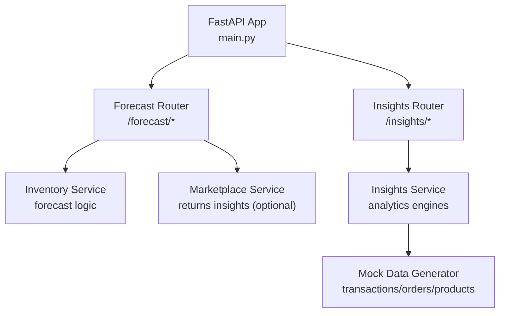
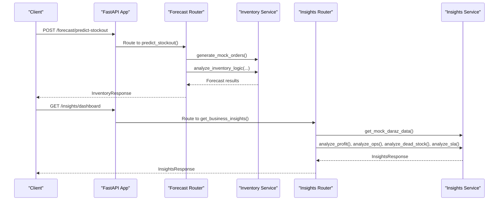
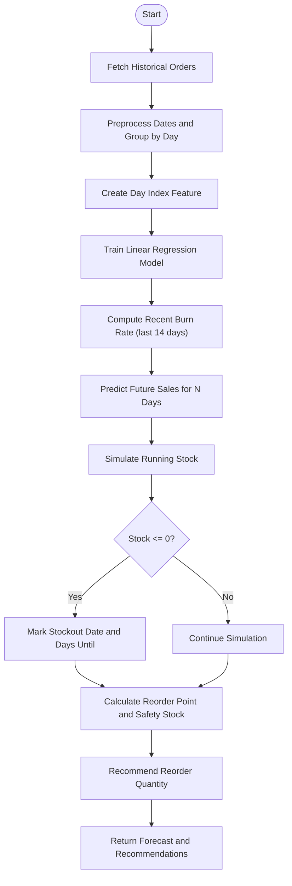
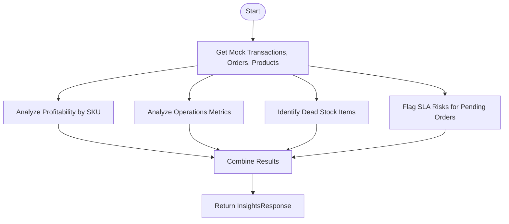
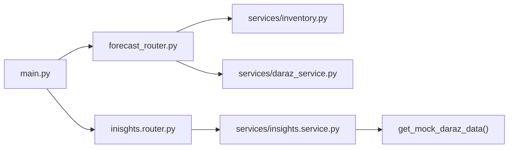

# Analytics & Forecasting API

<cite>
**Referenced Files in This Document**
- [main.py](file://neurocom_backend/main.py)
- [forecast_router.py](file://neurocom_backend/routers/forecast_router.py)
- [inisghts.router.py](file://neurocom_backend/routers/inisghts.router.py)
- [inventory_analysis_model.py](file://neurocom_backend/models/inventory_analysis_model.py)
- [inventory.py](file://neurocom_backend/services/inventory.py)
- [insights.service.py](file://neurocom_backend/services/insights.service.py)
- [daraz_service.py](file://neurocom_backend/services/daraz_service.py)
</cite>

## Table of Contents
1. Introduction
2. Project Structure
3. Core Components
4. Architecture Overview
5. Detailed Component Analysis
6. Dependency Analysis
7. Performance Considerations
8. Troubleshooting Guide
9. Conclusion

## Introduction
This document provides comprehensive API documentation for analytics and forecasting endpoints, including sales predictions, inventory analysis, performance metrics, return rate analysis, data aggregation endpoints, forecasting algorithms, report generation, and data visualization endpoints. It covers:
- Inventory forecasting and stockout prediction
- Business insights dashboard (profitability, operations, dead stock, SLA risks)
- Return rate analysis with reason breakdowns and trends
- Data aggregation from marketplace services
- Example queries and response schemas

## Project Structure
The analytics and forecasting features are implemented across routers, services, models, and marketplace integrations:
- Routers expose REST endpoints under /forecast and /insights
- Services implement data aggregation, analytics logic, and forecasting algorithms
- Models define request/response contracts
- Marketplace service provides return analytics and dashboards

**Diagram sources**
- [main.py:29-89](file://neurocom_backend/main.py#L29-L89)
- [forecast_router.py:15-49](file://neurocom_backend/routers/forecast_router.py#L15-L49)
- [inisghts.router.py:15-31](file://neurocom_backend/routers/inisghts.router.py#L15-L31)
- [inventory.py:38-119](file://neurocom_backend/services/inventory.py#L38-L119)
- [insights.service.py:45-183](file://neurocom_backend/services/insights.service.py#L45-L183)

**Section sources**
- [main.py:29-89](file://neurocom_backend/main.py#L29-L89)

## Core Components
- Forecasting endpoint: Predict stockout and generate daily forecasts using trend modeling
- Insights dashboard: Aggregates profitability, operational metrics, dead stock, and SLA risks
- Return analysis: Provides overall return rates, reason breakdowns, monthly trends, and recommendations
- Data models: Typed request/response schemas for validation and documentation

Key responsibilities:
- forecast_router.py: Exposes POST /forecast/predict-stockout
- inisghts.router.py: Exposes GET /insights/dashboard
- inventory.py: Implements mock order generation and linear regression-based forecasting
- insights.service.py: Implements profit, operations, dead stock, and SLA analysis
- daraz_service.py: Implements return insights and dashboard aggregation

**Section sources**
- [forecast_router.py:15-49](file://neurocom_backend/routers/forecast_router.py#L15-L49)
- [inisghts.router.py:15-31](file://neurocom_backend/routers/inisghts.router.py#L15-L31)
- [inventory.py:9-119](file://neurocom_backend/services/inventory.py#L9-L119)
- [insights.service.py:10-183](file://neurocom_backend/services/insights.service.py#L10-L183)
- [daraz_service.py:1398-1462](file://neurocom_backend/services/daraz_service.py#L1398-L1462)

## Architecture Overview
The system exposes two primary analytics domains:
- Forecasting: Predict future inventory levels and stockout dates based on historical demand patterns
- Insights: Provide business-level analytics across profitability, operations, dead stock, and SLA risks

**Diagram sources**
- [forecast_router.py:21-49](file://neurocom_backend/routers/forecast_router.py#L21-L49)
- [inventory.py:9-119](file://neurocom_backend/services/inventory.py#L9-L119)
- [inisghts.router.py:17-31](file://neurocom_backend/routers/inisghts.router.py#L17-L31)
- [insights.service.py:45-183](file://neurocom_backend/services/insights.service.py#L45-L183)

## Detailed Component Analysis

### Forecasting Endpoint: Predict Stockout
Endpoint: POST /forecast/predict-stockout
- Purpose: Analyze historical orders and predict future inventory levels, stockout date, and reorder recommendations
- Request schema: InventoryRequest
  - sku: string
  - current_stock: integer > 0
  - lead_time_days: integer (default 7)
  - safety_stock_days: integer (default 3)
  - forecast_days: integer (default 30)
- Response schema: InventoryResponse
  - sku: string
  - analysis_date: string (YYYY-MM-DD)
  - stockout_predicted: boolean
  - stockout_date: optional string (YYYY-MM-DD)
  - days_until_stockout: optional integer
  - recommended_reorder_qty: integer
  - burn_rate_daily: float
  - forecast_data: list of DailyForecast
    - date: string (YYYY-MM-DD)
    - predicted_sales: float
    - projected_stock: float
  - message: string

Processing flow:
- Generate or fetch historical orders (mocked)
- Compute daily sales and feature engineering (day index)
- Train a linear regression model to capture trend
- Predict future daily sales for N days
- Simulate running stock to detect stockout date
- Calculate burn rate and recommend reorder quantity based on lead time and safety stock

Example query:
- POST /forecast/predict-stockout
- Body: { "sku": "SKU-101", "current_stock": 120, "lead_time_days": 7, "safety_stock_days": 3, "forecast_days": 30 }

Expected response fields:
- stockout_predicted: true/false
- stockout_date: "YYYY-MM-DD" if predicted
- days_until_stockout: integer if predicted
- recommended_reorder_qty: integer
- burn_rate_daily: float
- forecast_data: array of daily predictions
- message: human-readable status

Notes:
- The algorithm uses linear regression for trend; production may replace with Prophet or ARIMA for seasonality handling
- Mock data simulates base demand, weekend spikes, and occasional flash sale outliers

**Section sources**
- [forecast_router.py:21-49](file://neurocom_backend/routers/forecast_router.py#L21-L49)
- [inventory_analysis_model.py:4-25](file://neurocom_backend/models/inventory_analysis_model.py#L4-L25)
- [inventory.py:9-119](file://neurocom_backend/services/inventory.py#L9-L119)

#### Forecasting Algorithm Flowchart

**Diagram sources**
- [inventory.py:38-119](file://neurocom_backend/services/inventory.py#L38-L119)

### Insights Dashboard: Business Metrics
Endpoint: GET /insights/dashboard
- Purpose: Aggregate profitability, operations, dead stock, and SLA risk metrics into a single dashboard response
- Response schema: InsightsResponse
  - profitability: list of ProfitMetric
    - sku: string
    - revenue: float
    - total_costs: float
    - net_profit: float
    - margin_percent: float
    - status: "Profitable" | "Loss Making" | "Low Margin"
  - operations: OperationalMetric
    - total_orders: integer
    - return_rate: float (percentage)
    - cancellation_rate: float (percentage)
    - top_return_reasons: list of {reason: string, count: integer}
  - dead_stock: list of DeadStockItem
    - sku: string
    - product_name: string
    - days_since_last_sale: integer
    - current_stock: integer
    - estimated_frozen_cash: float
  - sla_risks: list of SLAAlert
    - order_id: string
    - hours_since_order: float
    - status: "Safe" | "Warning" | "Breach"
    - items: list of strings

Processing flow:
- Generate mock transaction, order, and product datasets
- Compute profitability per SKU (revenue vs costs, margins)
- Compute operational metrics (orders, returns, cancellations, reasons)
- Identify dead stock items (not sold recently)
- Flag SLA risks for pending orders exceeding thresholds

Example query:
- GET /insights/dashboard

Expected response fields:
- profitability: sorted by net_profit ascending
- operations: aggregated metrics
- dead_stock: items flagged as dead
- sla_risks: alerts sorted by hours since order descending

**Section sources**
- [inisghts.router.py:17-31](file://neurocom_backend/routers/inisghts.router.py#L17-L31)
- [insights.service.py:10-44](file://neurocom_backend/services/insights.service.py#L10-L44)
- [insights.service.py:45-183](file://neurocom_backend/services/insights.service.py#L45-L183)

#### Insights Processing Logic

**Diagram sources**
- [insights.service.py:45-183](file://neurocom_backend/services/insights.service.py#L45-L183)

### Return Rate Analysis and Reporting
Endpoints and capabilities:
- Returns insights streaming and non-streaming entry points provide:
  - Overall return rate
  - Reason breakdown with percentages and likely causes
  - Monthly trends
  - Dispute and refund request rates
  - Recommendations based on thresholds

Data aggregation:
- Aggregates returns by reason and month
- Computes ratios against units sold and returns
- Generates actionable recommendations when thresholds are exceeded

Example usage:
- Use the streaming endpoint to process large datasets incrementally
- Use the non-streaming endpoint to retrieve final aggregated results

Note:
- Thresholds and recommendations are embedded in the service logic

**Section sources**
- [daraz_service.py:1398-1462](file://neurocom_backend/services/daraz_service.py#L1398-L1462)

## Dependency Analysis
Component relationships:
- main.py includes routers for authentication, marketplace, forecasting, reviews, storage, and chat
- forecast_router depends on inventory service for data generation and analysis
- insights_router depends on insights service for analytics engines
- insights service generates mock data and computes metrics
- daraz service provides return analytics and dashboards

**Diagram sources**
- [main.py:80-89](file://neurocom_backend/main.py#L80-L89)
- [forecast_router.py:15-49](file://neurocom_backend/routers/forecast_router.py#L15-L49)
- [inisghts.router.py:15-31](file://neurocom_backend/routers/inisghts.router.py#L15-L31)
- [inventory.py:9-119](file://neurocom_backend/services/inventory.py#L9-L119)
- [insights.service.py:45-183](file://neurocom_backend/services/insights.service.py#L45-L183)
- [daraz_service.py:1398-1462](file://neurocom_backend/services/daraz_service.py#L1398-L1462)

**Section sources**
- [main.py:80-89](file://neurocom_backend/main.py#L80-L89)

## Performance Considerations
- Forecasting uses linear regression on daily aggregates; consider replacing with seasonal models (Prophet, ARIMA) for better accuracy
- Mock data generation is lightweight but not representative of real marketplace volumes; replace with actual API calls in production
- Insights dashboard aggregates over mock datasets; ensure efficient grouping and filtering when scaling to real data
- Return analysis streams large datasets incrementally; use streaming endpoints to avoid memory pressure
- Cache frequently accessed metrics where appropriate to reduce computation overhead

[No sources needed since this section provides general guidance]

## Troubleshooting Guide
Common issues and resolutions:
- Authentication errors: Ensure required headers and tokens are provided for protected routes
- Invalid token decryption: Verify encrypted access tokens are correctly formatted and decrypted
- Empty datasets: If mock data yields no results, check filters and date ranges
- High return rates: Review reason breakdown and recommendations; adjust product quality or listing descriptions
- SLA breaches: Investigate pending orders older than thresholds; prioritize fulfillment

Error handling:
- HTTP exceptions raised for invalid inputs or external API failures
- WebSocket policy violations handled for unauthorized connections

**Section sources**
- [daraz_router.py:24-78](file://neurocom_backend/routers/daraz_router.py#L24-L78)
- [forecast_router.py:48-49](file://neurocom_backend/routers/forecast_router.py#L48-L49)

## Conclusion
The Analytics & Forecasting API provides robust endpoints for inventory forecasting, business insights, and return analysis. It combines simple yet effective algorithms with structured responses suitable for dashboards and reporting tools. For production readiness, integrate real marketplace data, enhance forecasting models with seasonality, and optimize performance through caching and streaming.

[No sources needed since this section summarizes without analyzing specific files]