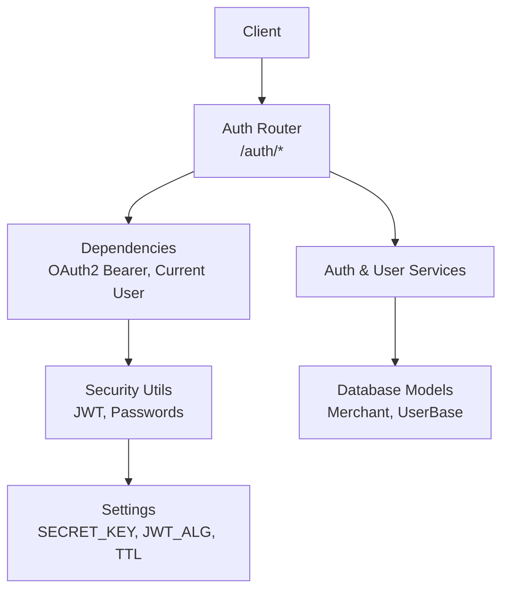
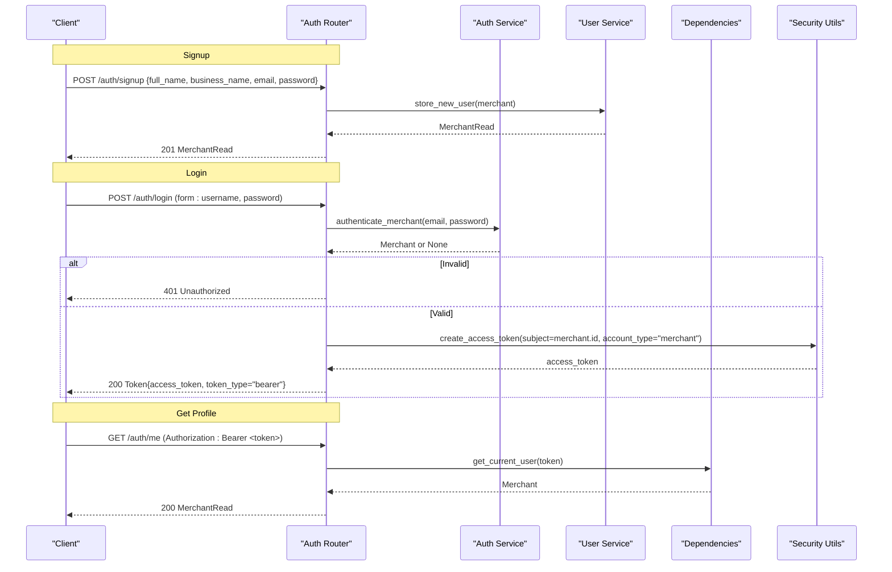
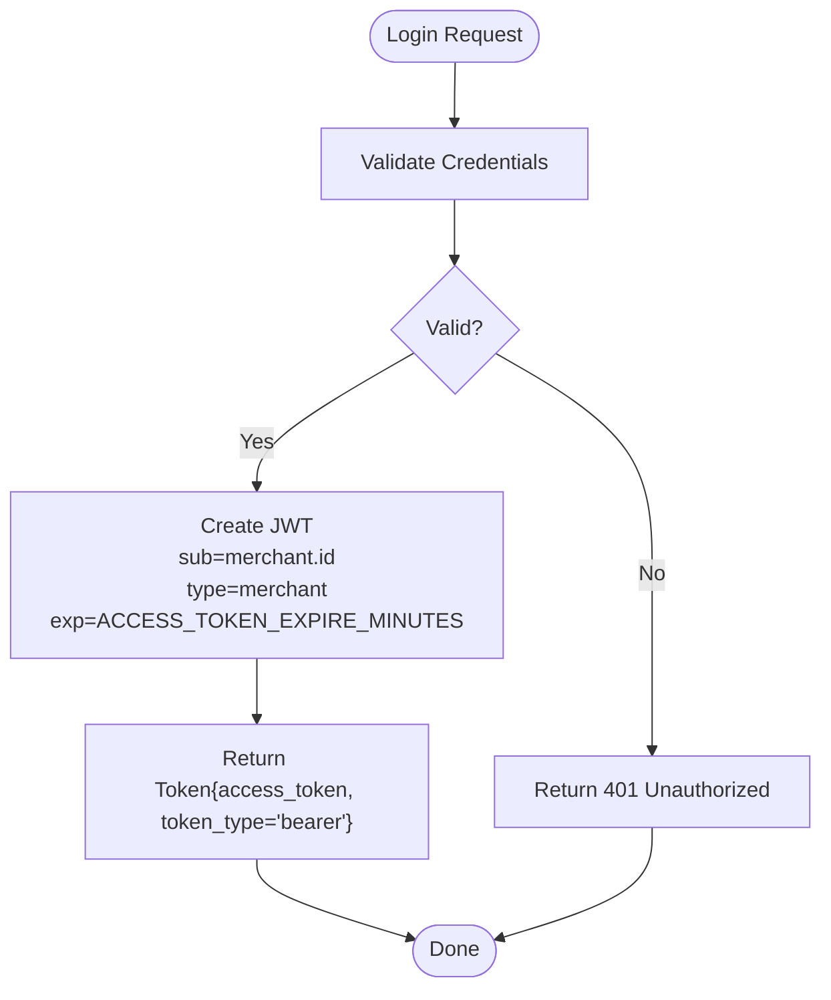
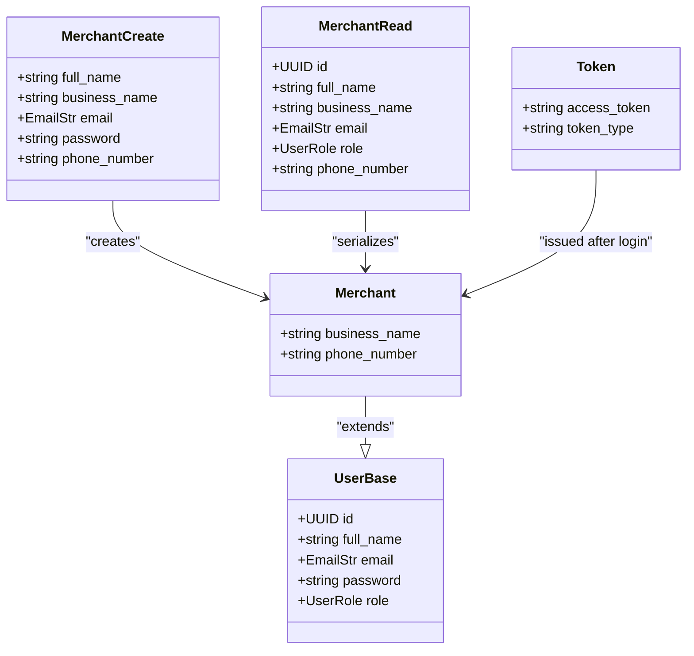
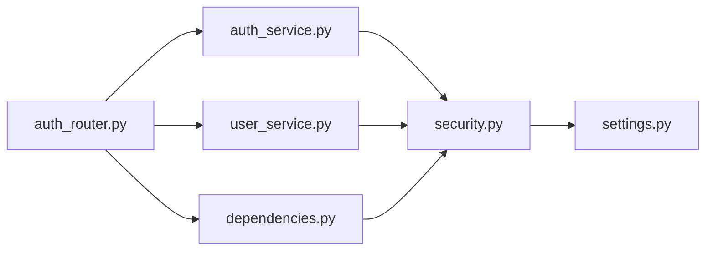

# Authentication API

<cite>
**Referenced Files in This Document**
- [auth_router.py](file://neurocom_backend/routers/auth_router.py)
- [auth_service.py](file://neurocom_backend/services/auth_service.py)
- [user_service.py](file://neurocom_backend/services/user_service.py)
- [security.py](file://neurocom_backend/utils/security.py)
- [settings.py](file://neurocom_backend/utils/settings.py)
- [dependencies.py](file://neurocom_backend/dependencies.py)
- [merchant.py](file://neurocom_backend/database/models/merchant.py)
- [user.py](file://neurocom_backend/database/models/user.py)
- [main.py](file://neurocom_backend/main.py)
</cite>

## Table of Contents
1. [Introduction](#introduction)
2. [Project Structure](#project-structure)
3. [Core Components](#core-components)
4. [Architecture Overview](#architecture-overview)
5. [Detailed Component Analysis](#detailed-component-analysis)
6. [Dependency Analysis](#dependency-analysis)
7. [Performance Considerations](#performance-considerations)
8. [Troubleshooting Guide](#troubleshooting-guide)
9. [Conclusion](#conclusion)
10. [Appendices](#appendices)

## Introduction
This document provides detailed API documentation for the authentication endpoints that support merchant signup, login, and retrieving the current user profile. It covers HTTP methods, URL patterns, request/response schemas, JWT token handling, OAuth2 password flow integration, example requests and responses, error handling, and security considerations including token expiration and refresh mechanisms.

## Project Structure
The authentication feature is implemented across routers, services, utilities, and database models:
- Router defines endpoints under /auth with FastAPI.
- Services handle business logic for user creation and authentication.
- Utilities provide secure password hashing and JWT operations.
- Settings configure JWT algorithm and token lifetime.
- Dependencies implement OAuth2 Bearer token extraction and validation.
- Models define merchant data structures and base user schema.

**Diagram sources**
- [auth_router.py:15-42](file://neurocom_backend/routers/auth_router.py#L15-L42)
- [auth_service.py:6-10](file://neurocom_backend/services/auth_service.py#L6-L10)
- [user_service.py:8-24](file://neurocom_backend/services/user_service.py#L8-L24)
- [security.py:16-28](file://neurocom_backend/utils/security.py#L16-L28)
- [settings.py:13-15](file://neurocom_backend/utils/settings.py#L13-L15)
- [dependencies.py:14-43](file://neurocom_backend/dependencies.py#L14-L43)
- [merchant.py:11-29](file://neurocom_backend/database/models/merchant.py#L11-L29)
- [user.py:14-20](file://neurocom_backend/database/models/user.py#L14-L20)

**Section sources**
- [auth_router.py:15-42](file://neurocom_backend/routers/auth_router.py#L15-L42)
- [main.py:80-80](file://neurocom_backend/main.py#L80-L80)

## Core Components
- Merchant model and schemas:
  - Base user fields (id, full_name, email, password, role).
  - Merchant-specific fields (business_name, phone_number).
  - Create and Read schemas for input validation and response serialization.
- Token schema:
  - Returns access_token and token_type ("bearer").
- Security utilities:
  - Password hashing and verification using bcrypt via passlib.
  - JWT creation and decoding with configurable algorithm and expiration.
- Dependencies:
  - OAuth2PasswordBearer configured to use /auth/login as token endpoint.
  - get_current_user dependency extracts Bearer token, decodes JWT, validates account type "merchant", and loads merchant from DB.
- Services:
  - store_new_user creates a merchant, hashes password, checks uniqueness by email.
  - authenticate_merchant verifies credentials against stored hash.

**Section sources**
- [merchant.py:11-29](file://neurocom_backend/database/models/merchant.py#L11-L29)
- [user.py:14-20](file://neurocom_backend/database/models/user.py#L14-L20)
- [auth.py:3-5](file://neurocom_backend/schemas/auth.py#L3-L5)
- [security.py:16-28](file://neurocom_backend/utils/security.py#L16-L28)
- [dependencies.py:14-43](file://neurocom_backend/dependencies.py#L14-L43)
- [user_service.py:8-24](file://neurocom_backend/services/user_service.py#L8-L24)
- [auth_service.py:6-10](file://neurocom_backend/services/auth_service.py#L6-L10)

## Architecture Overview
The authentication flow uses FastAPI’s OAuth2 password flow:
- Clients send username/password to /auth/login.
- Server authenticates via service layer and issues a JWT access token.
- Protected endpoints require a Bearer token validated by dependencies.
- The /auth/me endpoint returns the authenticated merchant profile.

**Diagram sources**
- [auth_router.py:18-42](file://neurocom_backend/routers/auth_router.py#L18-L42)
- [auth_service.py:6-10](file://neurocom_backend/services/auth_service.py#L6-L10)
- [user_service.py:8-24](file://neurocom_backend/services/user_service.py#L8-L24)
- [security.py:22-28](file://neurocom_backend/utils/security.py#L22-L28)
- [dependencies.py:14-43](file://neurocom_backend/dependencies.py#L14-L43)

## Detailed Component Analysis

### Endpoint: POST /auth/signup
- Purpose: Create a new merchant account.
- Request body schema:
  - full_name: string, min length 3, max length 50.
  - business_name: string, min length 2, max length 100.
  - email: valid email format.
  - password: string, min length 4.
  - phone_number: optional string, min length 6 if provided.
- Response schema:
  - id: UUID.
  - full_name: string.
  - business_name: string.
  - email: string.
  - role: enum ("admin" or "user").
  - phone_number: optional string.
- Behavior:
  - Checks for existing email; raises 400 if duplicate.
  - Hashes password before storing.
  - Persists merchant with default role "user".
- Example request:
  - Method: POST
  - URL: /auth/signup
  - Content-Type: application/json
  - Body: {"full_name": "Jane Doe", "business_name": "Acme Store", "email": "jane@example.com", "password": "securepass123", "phone_number": "1234567890"}
- Example response:
  - Status: 201 Created
  - Body: {"id": "uuid-here", "full_name": "Jane Doe", "business_name": "Acme Store", "email": "jane@example.com", "role": "user", "phone_number": "1234567890"}
- Errors:
  - 400 Bad Request: Merchant already exists (duplicate email).

**Section sources**
- [auth_router.py:18-21](file://neurocom_backend/routers/auth_router.py#L18-L21)
- [user_service.py:8-24](file://neurocom_backend/services/user_service.py#L8-L24)
- [merchant.py:16-29](file://neurocom_backend/database/models/merchant.py#L16-L29)

### Endpoint: POST /auth/login
- Purpose: Authenticate a merchant and return an access token using OAuth2 password flow.
- Request:
  - Form-encoded fields: username (email), password.
- Response schema:
  - access_token: string (JWT).
  - token_type: string ("bearer").
- Behavior:
  - Validates credentials via service layer.
  - On success, creates JWT with subject=merchant.id, type="merchant", and expiration based on settings.
  - On failure, returns 401 Unauthorized with WWW-Authenticate header set to "Bearer".
- Example request:
  - Method: POST
  - URL: /auth/login
  - Content-Type: application/x-www-form-urlencoded
  - Body: username=jane@example.com&password=securepass123
- Example response:
  - Status: 200 OK
  - Body: {"access_token": "eyJhbGciOiJIUzI1NiIsInR5cCI6IkpXVCJ9...", "token_type": "bearer"}
- Errors:
  - 401 Unauthorized: Incorrect email or password.

**Section sources**
- [auth_router.py:24-37](file://neurocom_backend/routers/auth_router.py#L24-L37)
- [auth_service.py:6-10](file://neurocom_backend/services/auth_service.py#L6-L10)
- [security.py:22-28](file://neurocom_backend/utils/security.py#L22-L28)
- [settings.py:13-15](file://neurocom_backend/utils/settings.py#L13-L15)

### Endpoint: GET /auth/me
- Purpose: Retrieve the authenticated merchant’s profile.
- Authorization: Requires Bearer token obtained from /auth/login.
- Response schema:
  - Same as MerchantRead (id, full_name, business_name, email, role, phone_number).
- Behavior:
  - Extracts and validates JWT via get_current_user dependency.
  - Ensures token type is "merchant" and merchant exists.
- Example request:
  - Method: GET
  - URL: /auth/me
  - Headers: Authorization: Bearer <access_token>
- Example response:
  - Status: 200 OK
  - Body: {"id": "uuid-here", "full_name": "Jane Doe", "business_name": "Acme Store", "email": "jane@example.com", "role": "user", "phone_number": "1234567890"}
- Errors:
  - 401 Unauthorized: Could not validate credentials (invalid/expired token or missing).

**Section sources**
- [auth_router.py:40-42](file://neurocom_backend/routers/auth_router.py#L40-L42)
- [dependencies.py:14-43](file://neurocom_backend/dependencies.py#L14-L43)

### JWT Token Handling and OAuth2 Password Flow
- Token creation:
  - Subject: merchant.id.
  - Type: "merchant".
  - Expiration: ACCESS_TOKEN_EXPIRE_MINUTES from settings.
  - Algorithm: JWT_ALGORITHM from settings (default HS256).
  - Secret: SECRET_KEY from environment.
- Token decoding and validation:
  - Decoded payload must include sub and type="merchant".
  - Merchant entity loaded from DB by ID.
- OAuth2 integration:
  - FastAPI’s OAuth2PasswordRequestForm used for login.
  - OAuth2PasswordBearer configured to use /auth/login as tokenUrl.
  - Protected routes enforce Bearer token via get_current_user dependency.

**Diagram sources**
- [auth_router.py:24-37](file://neurocom_backend/routers/auth_router.py#L24-L37)
- [security.py:22-28](file://neurocom_backend/utils/security.py#L22-L28)
- [settings.py:13-15](file://neurocom_backend/utils/settings.py#L13-L15)

**Section sources**
- [security.py:22-28](file://neurocom_backend/utils/security.py#L22-L28)
- [settings.py:13-15](file://neurocom_backend/utils/settings.py#L13-L15)
- [dependencies.py:14-43](file://neurocom_backend/dependencies.py#L14-L43)

### Data Models and Relationships

**Diagram sources**
- [user.py:14-20](file://neurocom_backend/database/models/user.py#L14-L20)
- [merchant.py:11-29](file://neurocom_backend/database/models/merchant.py#L11-L29)
- [auth.py:3-5](file://neurocom_backend/schemas/auth.py#L3-L5)

**Section sources**
- [user.py:14-20](file://neurocom_backend/database/models/user.py#L14-L20)
- [merchant.py:11-29](file://neurocom_backend/database/models/merchant.py#L11-L29)
- [auth.py:3-5](file://neurocom_backend/schemas/auth.py#L3-L5)

## Dependency Analysis
- Router depends on:
  - Services for user creation and authentication.
  - Dependencies for OAuth2 Bearer token resolution.
  - Security utilities for JWT operations.
- Services depend on:
  - Database models for persistence.
  - Security utilities for password hashing.
- Dependencies depend on:
  - Security utilities for JWT decoding.
  - Database connection for loading merchants.
- Settings influence:
  - JWT algorithm and token expiration.

**Diagram sources**
- [auth_router.py:1-13](file://neurocom_backend/routers/auth_router.py#L1-L13)
- [auth_service.py:1-10](file://neurocom_backend/services/auth_service.py#L1-L10)
- [user_service.py:1-24](file://neurocom_backend/services/user_service.py#L1-L24)
- [dependencies.py:1-43](file://neurocom_backend/dependencies.py#L1-L43)
- [security.py:1-28](file://neurocom_backend/utils/security.py#L1-L28)
- [settings.py:13-15](file://neurocom_backend/utils/settings.py#L13-L15)

**Section sources**
- [auth_router.py:1-13](file://neurocom_backend/routers/auth_router.py#L1-L13)
- [auth_service.py:1-10](file://neurocom_backend/services/auth_service.py#L1-L10)
- [user_service.py:1-24](file://neurocom_backend/services/user_service.py#L1-L24)
- [dependencies.py:1-43](file://neurocom_backend/dependencies.py#L1-L43)
- [security.py:1-28](file://neurocom_backend/utils/security.py#L1-L28)
- [settings.py:13-15](file://neurocom_backend/utils/settings.py#L13-L15)

## Performance Considerations
- Password hashing uses bcrypt; ensure appropriate cost factor for performance vs security balance.
- JWT decoding is lightweight; avoid unnecessary DB calls by caching merchant data if needed.
- Token expiration can be tuned via ACCESS_TOKEN_EXPIRE_MINUTES to balance security and UX.
- Consider rate limiting on /auth/login to prevent brute-force attempts.

[No sources needed since this section provides general guidance]

## Troubleshooting Guide
- Common errors:
  - 401 Unauthorized on login: Check email/password correctness and ensure password is hashed correctly during signup.
  - 401 Unauthorized on protected endpoints: Verify Bearer token presence, validity, and that token type is "merchant".
  - 400 Bad Request on signup: Ensure email uniqueness and field constraints are met.
- Debugging steps:
  - Inspect JWT payload to confirm sub and type fields.
  - Confirm SECRET_KEY and JWT_ALGORITHM match between token creation and decoding.
  - Validate database records exist for merchant IDs referenced in tokens.

**Section sources**
- [auth_router.py:24-42](file://neurocom_backend/routers/auth_router.py#L24-L42)
- [dependencies.py:14-43](file://neurocom_backend/dependencies.py#L14-L43)
- [security.py:22-28](file://neurocom_backend/utils/security.py#L22-L28)

## Conclusion
The authentication system implements a robust OAuth2 password flow with JWT-based authorization. Merchants can sign up, log in to obtain a bearer token, and access protected endpoints like their profile. Security measures include password hashing, token expiration, and strict validation of token claims. For enhanced security and usability, consider implementing token refresh mechanisms and rate limiting.

[No sources needed since this section summarizes without analyzing specific files]

## Appendices

### Configuration
- Environment variables:
  - SECRET_KEY: Required for signing JWTs.
  - JWT_ALGORITHM: Defaults to HS256.
  - ACCESS_TOKEN_EXPIRE_MINUTES: Defaults to 60 minutes.
- CORS:
  - Allowed origins configured for local development.

**Section sources**
- [settings.py:13-15](file://neurocom_backend/utils/settings.py#L13-L15)
- [main.py:30-36](file://neurocom_backend/main.py#L30-L36)