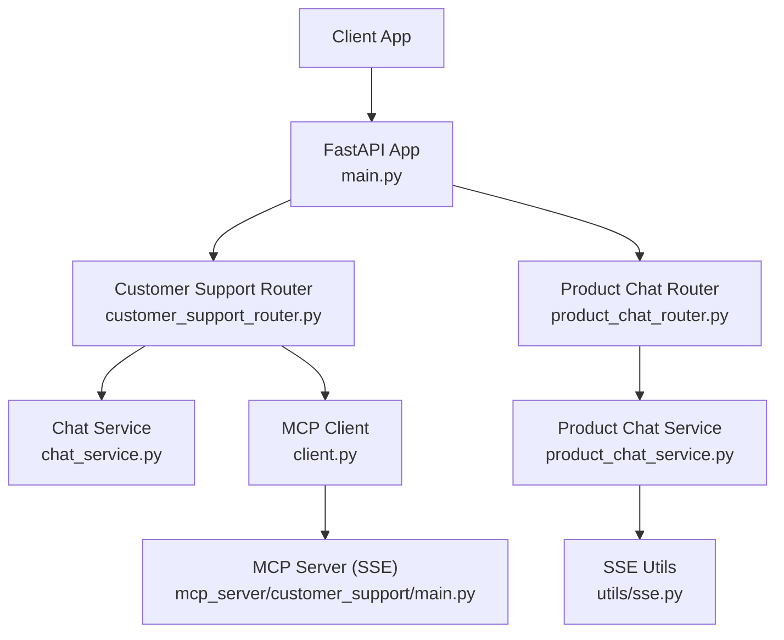
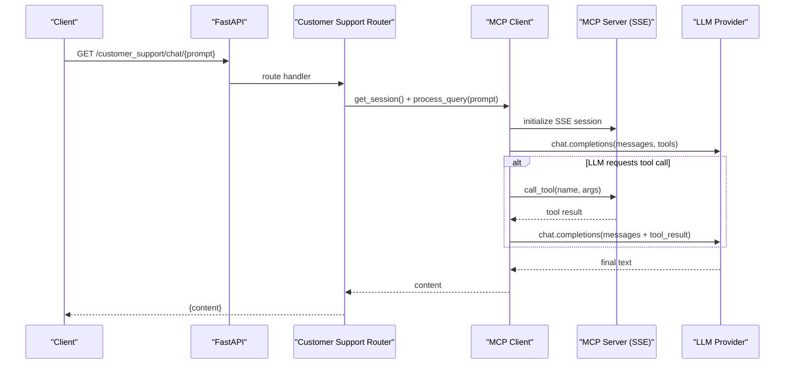
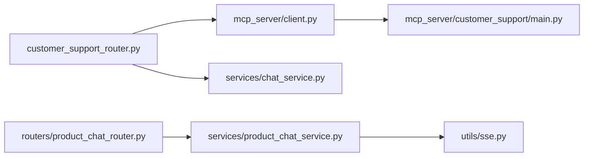

# Customer Support API

<cite>
**Referenced Files in This Document**
- [main.py](file://neurocom_backend/main.py)
- [customer_support_router.py](file://neurocom_backend/routers/customer_support_router.py)
- [product_chat_router.py](file://neurocom_backend/routers/product_chat_router.py)
- [chat_service.py](file://neurocom_backend/services/chat_service.py)
- [product_chat_service.py](file://neurocom_backend/services/product_chat_service.py)
- [client.py](file://neurocom_backend/mcp_server/client.py)
- [mcp_server main.py](file://neurocom_backend/mcp_server/customer_support/main.py)
- [sse.py](file://neurocom_backend/utils/sse.py)
- [dependencies.py](file://neurocom_backend/dependencies.py)
</cite>

## Table of Contents
1. Introduction
2. Project Structure
3. Core Components
4. Architecture Overview
5. Detailed Component Analysis
6. Dependency Analysis
7. Performance Considerations
8. Troubleshooting Guide
9. Conclusion

## Introduction
This document provides detailed API documentation for customer support endpoints that enable chat interfaces, real-time communication via WebSocket and Server-Sent Events (SSE), AI-powered responses, and tool execution through an MCP server integration. It covers message formats, streaming response handling, context management across turns, and how the system integrates with the MCP server to call tools and return results.

The system exposes:
- REST endpoints for listing available tools and sending a single-turn chat query.
- A WebSocket endpoint for product-focused conversational support with token-by-token streaming.
- An SSE-based MCP server for bidirectional tool-driven interactions over HTTP streams.

## Project Structure
The customer support functionality spans routers, services, MCP client/server components, and utilities:
- Routers define HTTP and WebSocket endpoints.
- Services implement AI orchestration and streaming logic.
- The MCP client connects to the MCP server via SSE to discover and execute tools.
- The MCP server exposes tools and resources over SSE.
- Utilities provide SSE formatting helpers.

**Diagram sources**
- [main.py:30-37](file://neurocom_backend/main.py#L30-L37)
- [customer_support_router.py:31-60](file://neurocom_backend/routers/customer_support_router.py#L31-L60)
- [product_chat_router.py:27-69](file://neurocom_backend/routers/product_chat_router.py#L27-L69)
- [chat_service.py:12-29](file://neurocom_backend/services/chat_service.py#L12-L29)
- [product_chat_service.py:214-249](file://neurocom_backend/services/product_chat_service.py#L214-L249)
- [client.py:45-174](file://neurocom_backend/mcp_server/client.py#L45-L174)
- [mcp_server main.py:35-61](file://neurocom_backend/mcp_server/customer_support/main.py#L35-L61)
- [sse.py:18-32](file://neurocom_backend/utils/sse.py#L18-L32)

**Section sources**
- [main.py:30-37](file://neurocom_backend/main.py#L30-L37)
- [customer_support_router.py:31-60](file://neurocom_backend/routers/customer_support_router.py#L31-L60)
- [product_chat_router.py:27-69](file://neurocom_backend/routers/product_chat_router.py#L27-L69)

## Core Components
- Customer Support REST endpoints:
  - GET /customer_support/get_tools: Lists available tools from the MCP server.
  - GET /customer_support/chat/{prompt}: Sends a prompt to the LLM with tool-calling capability via the MCP server.
- Product Chat WebSocket:
  - WebSocket /reviews/product_chat: Real-time, multi-turn chat scoped to a product with streaming tokens and tool events.
- MCP Server (SSE):
  - GET /mcp/sse: Establishes an SSE connection for bidirectional JSON-RPC messaging with the MCP server.
  - POST /mcp/messages/: Receives messages from clients during the SSE session.
- Streaming Utilities:
  - utils/sse.py: Formats event/data pairs into SSE frames.

Authentication:
- REST endpoints under customer_support_router are protected by JWT middleware applied at router inclusion.
- WebSocket endpoint uses a WebSocket-safe dependency to validate merchant JWTs.

**Section sources**
- [customer_support_router.py:39-60](file://neurocom_backend/routers/customer_support_router.py#L39-L60)
- [product_chat_router.py:27-69](file://neurocom_backend/routers/product_chat_router.py#L27-L69)
- [mcp_server main.py:35-61](file://neurocom_backend/mcp_server/customer_support/main.py#L35-L61)
- [dependencies.py:46-64](file://neurocom_backend/dependencies.py#L46-L64)

## Architecture Overview
The system combines REST and real-time channels:
- REST calls trigger LLM inference with optional tool calls via the MCP server. Tool outputs are injected back into the conversation to produce final answers.
- WebSocket chat streams tokens and tool events to the client in real time, maintaining per-session context using a memory checkpointer.
- The MCP server exposes tools and resources over SSE, enabling the client to call tools and receive results within the same stream.

**Diagram sources**
- [customer_support_router.py:53-60](file://neurocom_backend/routers/customer_support_router.py#L53-L60)
- [client.py:45-174](file://neurocom_backend/mcp_server/client.py#L45-L174)
- [mcp_server main.py:35-61](file://neurocom_backend/mcp_server/customer_support/main.py#L35-L61)

## Detailed Component Analysis

### Customer Support REST Endpoints
- GET /customer_support/get_tools
  - Purpose: Retrieve available tools exposed by the MCP server.
  - Authentication: Required (JWT).
  - Response: Object containing tools metadata.
- GET /customer_support/chat/{prompt}
  - Purpose: Send a user prompt to the LLM with tool-calling enabled.
  - Authentication: Required (JWT).
  - Response: Object containing the final assistant content.

Message flow:
- The router obtains an MCP session via SSE and passes the prompt to the MCP client.
- The MCP client lists tools, sends them to the LLM, and handles any tool_calls by invoking the MCP server and feeding results back to the LLM.
- Final text is returned to the client.

Streaming note:
- These endpoints return a single final response; they do not stream tokens. For streaming, use the WebSocket endpoint.

**Section sources**
- [customer_support_router.py:43-60](file://neurocom_backend/routers/customer_support_router.py#L43-L60)
- [client.py:52-174](file://neurocom_backend/mcp_server/client.py#L52-L174)

### Product Chat WebSocket Endpoint
- WebSocket /reviews/product_chat?product_id={id}&product_sku_id={sku}
  - Purpose: Multi-turn, product-scoped chat with streaming tokens and tool events.
  - Authentication: Merchant JWT required via WebSocket headers.
  - Message format (client -> server):
    - {"message": "<user text>"}
  - Message format (server -> client):
    - {"event": "token", "data": {"content": "<delta>"}}
    - {"event": "tool_start", "data": {"name": "<tool>", "input": <args>}}
    - {"event": "tool_end", "data": {"name": "<tool>", "output": <result>}}
    - {"event": "done", "data": {}}
    - {"event": "error", "data": {"detail": "<error>"}}

Context management:
- Each WebSocket connection creates a unique thread_id used by the agent’s MemorySaver to maintain conversation state within the session.
- Tools are bound to the specific product and merchant access token to prevent scope leakage.

Streaming behavior:
- Tokens stream incrementally as the LLM generates text.
- Tool invocations are reported before and after execution so clients can show progress and results.

Error handling:
- Invalid JSON or missing message field returns an error event.
- Mid-stream exceptions yield a final error event instead of crashing the connection.

**Section sources**
- [product_chat_router.py:27-69](file://neurocom_backend/routers/product_chat_router.py#L27-L69)
- [product_chat_service.py:214-249](file://neurocom_backend/services/product_chat_service.py#L214-L249)
- [dependencies.py:46-64](file://neurocom_backend/dependencies.py#L46-L64)

### MCP Server Integration (SSE)
- GET /mcp/sse
  - Purpose: Establish an SSE connection for bidirectional JSON-RPC communication with the MCP server.
- POST /mcp/messages/
  - Purpose: Receive messages from clients during the SSE session.

Tools exposed by the MCP server include:
- add(a: int, b: int) -> int
- cancel_customer_order(order_id: UUID) -> str
- Resource: user://secret

How it works:
- The MCP client initializes an SSE session and lists tools.
- When the LLM decides to call a tool, the client invokes the MCP server with the tool name and arguments.
- The server executes the tool and returns results, which are fed back into the conversation.

**Section sources**
- [mcp_server main.py:18-33](file://neurocom_backend/mcp_server/customer_support/main.py#L18-L33)
- [mcp_server main.py:35-61](file://neurocom_backend/mcp_server/customer_support/main.py#L35-L61)
- [client.py:45-174](file://neurocom_backend/mcp_server/client.py#L45-L174)

### Streaming Utilities
- utils/sse.py provides helpers to format event/data pairs into SSE frames and wrap pipelines to emit error events on exceptions.
- While the product chat WebSocket does not use these helpers directly, the convention of yielding (event, data) pairs is consistent across streaming components.

**Section sources**
- [sse.py:18-32](file://neurocom_backend/utils/sse.py#L18-L32)

## Dependency Analysis
Key dependencies and relationships:
- Routers depend on services and MCP client for business logic and tool execution.
- Product chat service depends on LangChain/LangGraph agents and external APIs (e.g., Daraz) via tools.
- MCP client depends on OpenAI-compatible provider and MCP SSE transport.
- MCP server depends on internal services (e.g., order deletion) and database sessions.

**Diagram sources**
- [customer_support_router.py:31-60](file://neurocom_backend/routers/customer_support_router.py#L31-L60)
- [product_chat_router.py:27-69](file://neurocom_backend/routers/product_chat_router.py#L27-L69)
- [client.py:45-174](file://neurocom_backend/mcp_server/client.py#L45-L174)
- [mcp_server main.py:35-61](file://neurocom_backend/mcp_server/customer_support/main.py#L35-L61)
- [product_chat_service.py:214-249](file://neurocom_backend/services/product_chat_service.py#L214-L249)
- [sse.py:18-32](file://neurocom_backend/utils/sse.py#L18-L32)

**Section sources**
- [main.py:80-89](file://neurocom_backend/main.py#L80-L89)
- [dependencies.py:46-64](file://neurocom_backend/dependencies.py#L46-L64)

## Performance Considerations
- Token streaming reduces perceived latency for users by delivering incremental text.
- Tool outputs are intentionally trimmed to minimize token usage per turn, improving cost and speed.
- Per-connection memory checkpointer keeps context local to the session; consider a shared backend store if running multiple workers behind load balancers.
- SSE-based MCP sessions allow efficient tool invocation without repeated HTTP handshakes.

[No sources needed since this section provides general guidance]

## Troubleshooting Guide
Common issues and resolutions:
- Authentication failures:
  - Ensure JWT is present in Authorization header for REST endpoints.
  - For WebSocket, include Authorization: Bearer <token> in handshake headers.
- Missing or invalid message in WebSocket:
  - Client must send {"message": "..."} per turn; otherwise, an error event is returned.
- Tool execution errors:
  - Errors from tools surface as error events in WebSocket or as HTTP 500 in REST endpoints.
- SSE connection issues:
  - Verify /mcp/sse is reachable and that /mcp/messages/ is mounted correctly.

**Section sources**
- [product_chat_router.py:51-67](file://neurocom_backend/routers/product_chat_router.py#L51-L67)
- [customer_support_router.py:43-60](file://neurocom_backend/routers/customer_support_router.py#L43-L60)
- [mcp_server main.py:37-54](file://neurocom_backend/mcp_server/customer_support/main.py#L37-L54)

## Conclusion
The Customer Support API offers both REST and real-time channels for AI-powered assistance with tool execution via an MCP server. Use REST endpoints for simple queries and tool discovery, and the WebSocket endpoint for interactive, streaming conversations with rich context and tool feedback. The SSE-based MCP server enables robust tool invocation and resource access within the same streaming session.

[No sources needed since this section summarizes without analyzing specific files]