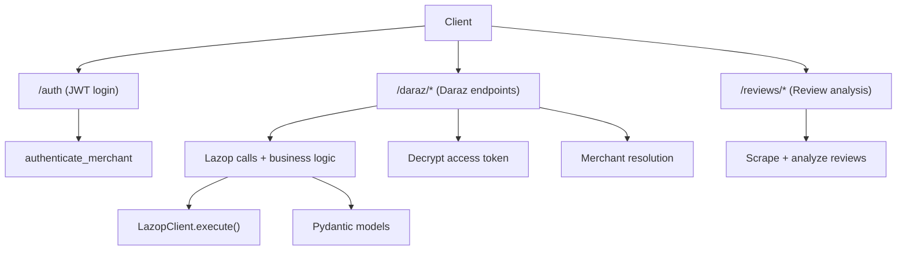
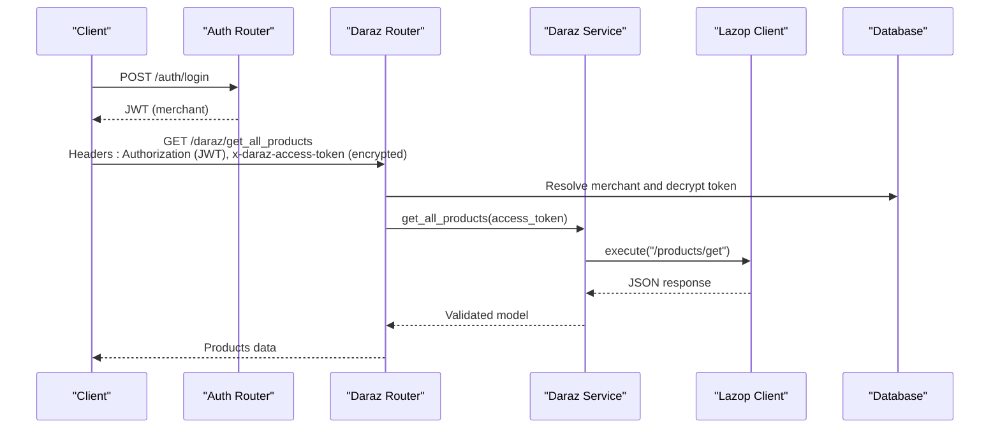
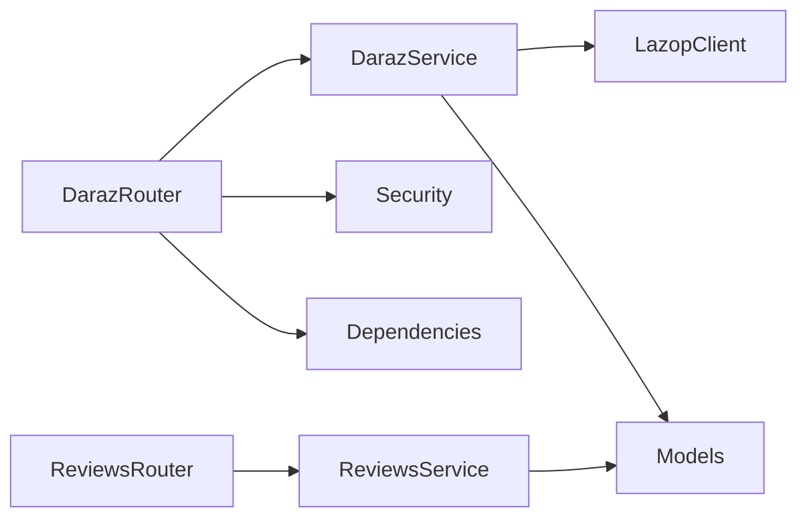

# Daraz Integration API

<cite>
**Referenced Files in This Document**
- [daraz_router.py](file://neurocom_backend/routers/daraz_router.py)
- [daraz_service.py](file://neurocom_backend/services/daraz_service.py)
- [base.py](file://neurocom_backend/python/lazop/base.py)
- [daraz_model.py](file://neurocom_backend/models/daraz_model.py)
- [auth_router.py](file://neurocom_backend/routers/auth_router.py)
- [auth_service.py](file://neurocom_backend/services/auth_service.py)
- [security.py](file://neurocom_backend/utils/security.py)
- [dependencies.py](file://neurocom_backend/dependencies.py)
- [reviews_router.py](file://neurocom_backend/routers/reviews_router.py)
- [reviews_service.py](file://neurocom_backend/services/reviews_service.py)
</cite>

## Table of Contents
1. Introduction
2. Project Structure
3. Core Components
4. Architecture Overview
5. Detailed Component Analysis
6. Dependency Analysis
7. Performance Considerations
8. Troubleshooting Guide
9. Conclusion

## Introduction
This document provides comprehensive API documentation for the Daraz marketplace integration exposed by the backend service. It covers:
- OAuth authentication flow (authorization code exchange and access token management)
- Product management endpoints (create, retrieve, category attributes, image migration)
- Order processing endpoints (orders, tracking, logistics, reverse orders)
- Review scraping and analysis
- Payout statements and conversation sessions
- Request/response schemas, error handling patterns, and rate limiting considerations specific to Daraz API constraints

The integration uses a custom Lazop client to call Daraz APIs, with FastAPI routers exposing secure endpoints that require merchant authentication and a per-request encrypted Daraz access token header.

## Project Structure
Key modules involved in the Daraz integration:
- Routers: HTTP endpoints under /daraz, /auth, /reviews
- Services: Business logic for Daraz API calls, caching, product normalization, review analysis
- Models: Pydantic models defining request/response shapes
- Lazop SDK wrapper: Low-level HTTP signing and execution against Daraz endpoints
- Security: JWT-based merchant auth and encrypted token handling

**Diagram sources**
- [daraz_router.py:82-329](file://neurocom_backend/routers/daraz_router.py#L82-L329)
- [auth_router.py:15-42](file://neurocom_backend/routers/auth_router.py#L15-L42)
- [reviews_router.py:11-42](file://neurocom_backend/routers/reviews_router.py#L11-L42)
- [daraz_service.py:35-800](file://neurocom_backend/services/daraz_service.py#L35-L800)
- [base.py:131-204](file://neurocom_backend/python/lazop/base.py#L131-L204)
- [security.py:22-43](file://neurocom_backend/utils/security.py#L22-L43)
- [dependencies.py:14-79](file://neurocom_backend/dependencies.py#L14-L79)

**Section sources**
- [daraz_router.py:82-329](file://neurocom_backend/routers/daraz_router.py#L82-L329)
- [auth_router.py:15-42](file://neurocom_backend/routers/auth_router.py#L15-L42)
- [reviews_router.py:11-42](file://neurocom_backend/routers/reviews_router.py#L11-L42)
- [daraz_service.py:35-800](file://neurocom_backend/services/daraz_service.py#L35-L800)
- [base.py:131-204](file://neurocom_backend/python/lazop/base.py#L131-L204)
- [security.py:22-43](file://neurocom_backend/utils/security.py#L22-L43)
- [dependencies.py:14-79](file://neurocom_backend/dependencies.py#L14-L79)

## Core Components
- OAuth and Merchant Authentication:
  - POST /auth/login returns a JWT for merchant accounts
  - All Daraz endpoints require a valid merchant JWT plus an encrypted Daraz access token header
- Daraz Access Token Resolution:
  - Header x-daraz-access-token is decrypted and validated against the authenticated merchant’s connection
- Lazop Client:
  - Signs requests using SHA-256 and app_key/app_secret; supports GET/POST and file uploads
- Product Management:
  - Create products with category-aware attribute mapping and size chart enforcement
  - Retrieve all products or by ID
  - Category tree and attributes retrieval
  - Image migration/upload to Daraz CDN
- Orders and Logistics:
  - List orders, list orders with items, get order by ID
  - Trace order and logistics details
  - Reverse orders and history
- Reviews:
  - Scrape full review history from product page URL
  - Analyze reviews via clustering and LLM summarization
- Payouts and Conversations:
  - Get payout statements
  - Retrieve conversation sessions

**Section sources**
- [auth_router.py:18-42](file://neurocom_backend/routers/auth_router.py#L18-L42)
- [auth_service.py:6-10](file://neurocom_backend/services/auth_service.py#L6-L10)
- [security.py:22-43](file://neurocom_backend/utils/security.py#L22-L43)
- [dependencies.py:14-79](file://neurocom_backend/dependencies.py#L14-L79)
- [base.py:131-204](file://neurocom_backend/python/lazop/base.py#L131-L204)
- [daraz_router.py:85-329](file://neurocom_backend/routers/daraz_router.py#L85-L329)
- [daraz_service.py:35-800](file://neurocom_backend/services/daraz_service.py#L35-L800)
- [reviews_router.py:11-42](file://neurocom_backend/routers/reviews_router.py#L11-L42)
- [reviews_service.py:59-304](file://neurocom_backend/services/reviews_service.py#L59-L304)

## Architecture Overview
The system exposes REST endpoints that enforce merchant authentication and per-call Daraz authorization. The Daraz service layer handles API calls through a Lazop client, caches results where appropriate, normalizes payloads, and enforces domain rules (e.g., required size charts).

**Diagram sources**
- [auth_router.py:24-37](file://neurocom_backend/routers/auth_router.py#L24-L37)
- [daraz_router.py:58-109](file://neurocom_backend/routers/daraz_router.py#L58-L109)
- [daraz_service.py:55-100](file://neurocom_backend/services/daraz_service.py#L55-L100)
- [base.py:140-204](file://neurocom_backend/python/lazop/base.py#L140-L204)
- [security.py:31-43](file://neurocom_backend/utils/security.py#L31-L43)
- [dependencies.py:17-43](file://neurocom_backend/dependencies.py#L17-L43)

## Detailed Component Analysis

### OAuth and Merchant Authentication
- POST /auth/signup creates a merchant account
- POST /auth/login authenticates and returns a JWT
- GET /auth/me returns current merchant profile
- All protected routes use Bearer JWT and additional encrypted Daraz access token header

Request examples:
- Login: POST /auth/login with form fields username/password
- Current user: GET /auth/me with Authorization: Bearer <jwt>

Response examples:
- Login: { "access_token": "<jwt>" }
- Current user: Merchant object

Error handling:
- Invalid credentials return 401 with WWW-Authenticate header

Rate limiting:
- No explicit rate limiting at this layer; rely on upstream limits

**Section sources**
- [auth_router.py:18-42](file://neurocom_backend/routers/auth_router.py#L18-L42)
- [auth_service.py:6-10](file://neurocom_backend/services/auth_service.py#L6-L10)
- [security.py:22-28](file://neurocom_backend/utils/security.py#L22-L28)
- [dependencies.py:14-43](file://neurocom_backend/dependencies.py#L14-L43)

### Daraz Access Token Resolution
- Each Daraz endpoint requires header x-daraz-access-token containing an encrypted token tied to the authenticated merchant
- The router resolves and decrypts the token before calling services
- If the token is invalid or not linked to the merchant, appropriate errors are returned

Common errors:
- Missing token: 401
- Invalid encrypted token: 400
- Connection not active for merchant: 403

**Section sources**
- [daraz_router.py:24-78](file://neurocom_backend/routers/daraz_router.py#L24-L78)
- [security.py:31-43](file://neurocom_backend/utils/security.py#L31-L43)

### Product Management Endpoints
Endpoints:
- GET /daraz/get_all_products: Returns all products with cached validation
- GET /daraz/get_product_by_id?product_id=<id>: Returns a single product
- GET /daraz/get_category_attributes?primary_category_id=<id>&language_code=en_US: Returns category-specific attribute definitions
- POST /daraz/create_new_product: Creates a product with normalized attributes and enforced size chart if required
- GET /daraz/get_all_categories: Returns category tree
- GET /daraz/get_category_by_id?category_id=<id>: Returns a specific category
- GET /daraz/get_category_children?categoty_id=<id>: Returns children of a category

Image migration:
- POST /daraz/migrate_image: Migrates or uploads a single image to Daraz CDN
- POST /daraz/migrate_images: Batch migrate images (returns batch info)
- GET /daraz/migrate_images/result?batch_id=<id>: Polls batch result

Request/response schemas:
- Product creation expects a payload with PrimaryCategory, Attributes, Skus, etc.
- Category attributes define which fields are mandatory and their types
- Image migration returns migrated URL and hash code

Error handling:
- Invalid category attributes response: 502
- Product creation failures include daraz_code, daraz_message, daraz_details, request_id
- Image migration failures map to 422 or 502 based on code

Rate limiting:
- Lazop client logs non-zero codes; implement client-side backoff on repeated errors

**Section sources**
- [daraz_router.py:107-248](file://neurocom_backend/routers/daraz_router.py#L107-L248)
- [daraz_service.py:55-100](file://neurocom_backend/services/daraz_service.py#L55-L100)
- [daraz_service.py:254-311](file://neurocom_backend/services/daraz_service.py#L254-L311)
- [daraz_service.py:314-479](file://neurocom_backend/services/daraz_service.py#L314-L479)
- [daraz_service.py:482-800](file://neurocom_backend/services/daraz_service.py#L482-L800)
- [daraz_model.py:20-36](file://neurocom_backend/models/daraz_model.py#L20-L36)
- [daraz_model.py:43-79](file://neurocom_backend/models/daraz_model.py#L43-L79)

#### Product Creation Flow

**Diagram sources**
- [daraz_service.py:754-800](file://neurocom_backend/services/daraz_service.py#L754-L800)
- [daraz_router.py:213-248](file://neurocom_backend/routers/daraz_router.py#L213-L248)

### Order Processing Endpoints
Endpoints:
- GET /daraz/get_all_orders?include_canceled=false: Lists orders
- GET /daraz/get_all_orders_full?include_canceled=false&start_date=<iso>&end_date=<iso>: Full order listing with date filters
- GET /daraz/get_orders_with_items?product_sku_id=&start_date=&end_date=: Orders merged with line items
- GET /daraz/get_order_by_id?order_id=<id>: Single order with items
- GET /daraz/trace_order?order_id=<id>: Tracking information
- GET /daraz/get_order_logistics_details?order_id=<id>: Logistics details
- GET /daraz/get_all_reverse_orders_info?product_id=&product_sku_id=&start_date=&end_date=: Reverse orders overview
- GET /daraz/get_reverse_order_history?reverse_order_line_id=<id>: Reverse order history

Request/response schemas:
- OrdersWithItemsResponse includes orders and count
- OrderWithItems includes address, items, fees, shipping, customer names
- ReverseOrderInfo includes reverse order lines and statuses

Error handling:
- Errors from Daraz are surfaced with request_id and diagnostic details where applicable

Rate limiting:
- Use start_date/end_date filters to reduce payload size and frequency

**Section sources**
- [daraz_router.py:250-296](file://neurocom_backend/routers/daraz_router.py#L250-L296)
- [daraz_model.py:326-405](file://neurocom_backend/models/daraz_model.py#L326-L405)
- [daraz_model.py:225-281](file://neurocom_backend/models/daraz_model.py#L225-L281)

### Review Scraping and Analysis
Endpoints:
- GET /daraz/scrape_product_reviews?product_url=<url>: Scrapes full review history from product page
- POST /reviews/analyze-reviews: Analyzes scraped reviews with clustering and LLM summarization; supports streaming

Request/response schemas:
- ScrapedProductReviewsResponse includes item_id, total_reviews, average_rating, reviews
- Review analysis returns sentiment_score, rating_trend, summary, topics, action_plan, cluster_debug

Error handling:
- Invalid product URL raises 400
- No reviews found raises 400
- AI analysis failure raises 500

Rate limiting:
- Scraping iterates pages up to a cap; avoid excessive concurrent scrapes

**Section sources**
- [daraz_router.py:123-125](file://neurocom_backend/routers/daraz_router.py#L123-L125)
- [reviews_router.py:17-42](file://neurocom_backend/routers/reviews_router.py#L17-L42)
- [daraz_service.py:189-252](file://neurocom_backend/services/daraz_service.py#L189-L252)
- [reviews_service.py:59-304](file://neurocom_backend/services/reviews_service.py#L59-L304)
- [daraz_model.py:291-316](file://neurocom_backend/models/daraz_model.py#L291-L316)

### Payout Statements and Conversation Sessions
Endpoints:
- GET /daraz/get_payout: Retrieves payout statement
- GET /daraz/conversations/sessions: Retrieves conversation sessions

Error handling:
- Errors from Daraz are propagated with request_id and diagnostics

Rate limiting:
- These endpoints are typically low-frequency; no special throttling implemented

**Section sources**
- [daraz_router.py:323-329](file://neurocom_backend/routers/daraz_router.py#L323-L329)

## Dependency Analysis
- Routers depend on services for business logic and on security/dependencies for authentication
- Services depend on Lazop client for API calls and on Pydantic models for validation
- Lazop client handles signing and HTTP transport

**Diagram sources**
- [daraz_router.py:82-329](file://neurocom_backend/routers/daraz_router.py#L82-L329)
- [daraz_service.py:35-800](file://neurocom_backend/services/daraz_service.py#L35-L800)
- [base.py:131-204](file://neurocom_backend/python/lazop/base.py#L131-L204)
- [daraz_model.py:1-460](file://neurocom_backend/models/daraz_model.py#L1-L460)
- [reviews_router.py:11-42](file://neurocom_backend/routers/reviews_router.py#L11-L42)
- [reviews_service.py:59-304](file://neurocom_backend/services/reviews_service.py#L59-L304)

**Section sources**
- [daraz_router.py:82-329](file://neurocom_backend/routers/daraz_router.py#L82-L329)
- [daraz_service.py:35-800](file://neurocom_backend/services/daraz_service.py#L35-L800)
- [base.py:131-204](file://neurocom_backend/python/lazop/base.py#L131-L204)
- [daraz_model.py:1-460](file://neurocom_backend/models/daraz_model.py#L1-L460)
- [reviews_router.py:11-42](file://neurocom_backend/routers/reviews_router.py#L11-L42)
- [reviews_service.py:59-304](file://neurocom_backend/services/reviews_service.py#L59-L304)

## Performance Considerations
- Caching:
  - Product listings and reviews are cached using Redis-backed fingerprinting; volatile envelope keys like request_id and trace_id are stripped to avoid false cache misses
- Concurrency:
  - Reviews fetching uses ThreadPoolExecutor to parallelize per-product review calls
- Payload normalization:
  - HTML descriptions are cleaned to plain text to reduce payload size and improve readability
- Image handling:
  - Images are validated for type and size; unsupported hosts fall back to upload rather than migrate
- Rate limiting:
  - No built-in rate limiter; implement client-side retries with exponential backoff on non-zero codes from Lazop responses
  - Avoid large batch operations during peak hours; use pagination and date filters

[No sources needed since this section provides general guidance]

## Troubleshooting Guide
Common issues and resolutions:
- Missing or invalid Daraz access token:
  - Ensure x-daraz-access-token header is present and corresponds to an active merchant connection
  - Decryption errors return 400; verify encryption key configuration
- Product creation failures:
  - Inspect daraz_code, daraz_message, daraz_details, and request_id in the error response
  - Ensure required fields like title and size chart (if required by category) are provided
- Image migration failures:
  - Unsupported host URLs trigger fallback upload; ensure JPEG/PNG and under 1 MB
  - Migration code 302 triggers upload path automatically
- Order and reverse order queries:
  - Use date filters to limit scope; check request_id for tracing
- Review scraping:
  - Ensure product URL contains a valid item id pattern; otherwise 400 is raised
  - If no reviews are found, adjust filters or confirm product exists

Error patterns:
- 400 Bad Request: Invalid encrypted token or input validation failures
- 401 Unauthorized: Missing or invalid JWT
- 403 Forbidden: Merchant does not have active Daraz connection
- 413 Payload Too Large: Image exceeds 1 MB
- 415 Unsupported Media Type: Non-JPEG/PNG image
- 422 Unprocessable Entity: Validation or Daraz rejection with diagnostic details
- 502 Bad Gateway: Invalid Daraz response structure or network errors

**Section sources**
- [daraz_router.py:24-78](file://neurocom_backend/routers/daraz_router.py#L24-L78)
- [daraz_router.py:139-159](file://neurocom_backend/routers/daraz_router.py#L139-L159)
- [daraz_router.py:173-207](file://neurocom_backend/routers/daraz_router.py#L173-L207)
- [daraz_router.py:213-248](file://neurocom_backend/routers/daraz_router.py#L213-L248)
- [daraz_service.py:341-350](file://neurocom_backend/services/daraz_service.py#L341-L350)
- [daraz_service.py:413-446](file://neurocom_backend/services/daraz_service.py#L413-L446)
- [reviews_router.py:17-42](file://neurocom_backend/routers/reviews_router.py#L17-L42)

## Conclusion
The Daraz integration provides a robust set of endpoints for OAuth-driven merchant authentication, product lifecycle management, order processing, review scraping and analysis, payouts, and conversations. The architecture emphasizes secure token handling, strict validation via Pydantic models, and efficient caching and concurrency strategies. For production deployments, implement client-side rate limiting and monitoring around Daraz API responses to handle throttling gracefully.

[No sources needed since this section summarizes without analyzing specific files]