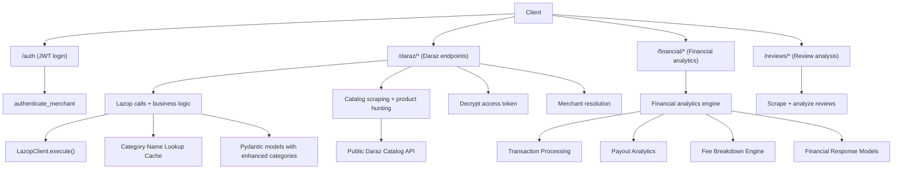
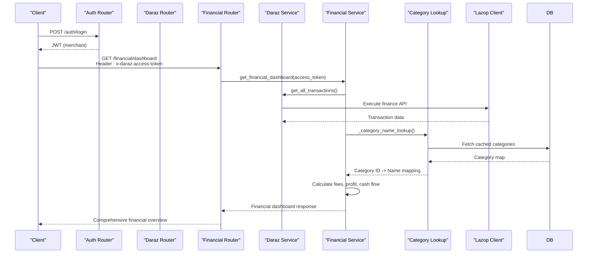
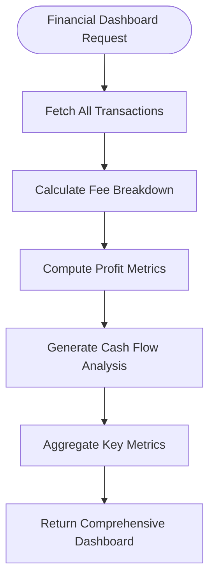
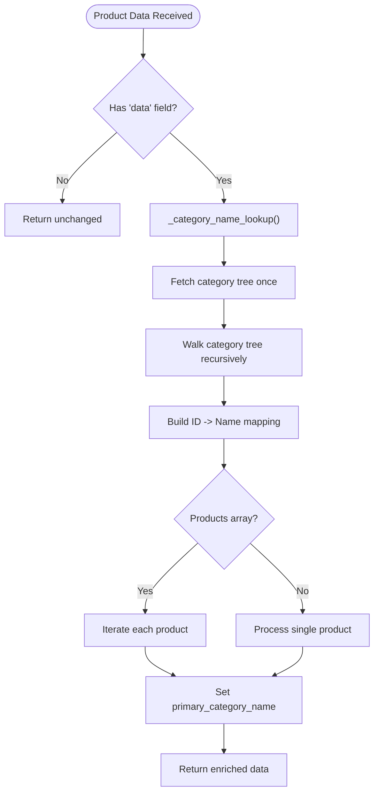
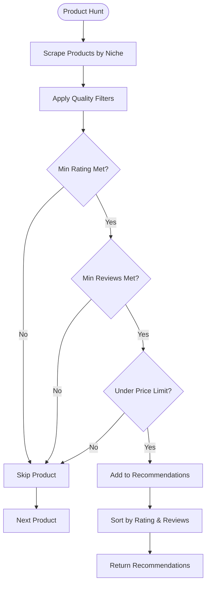
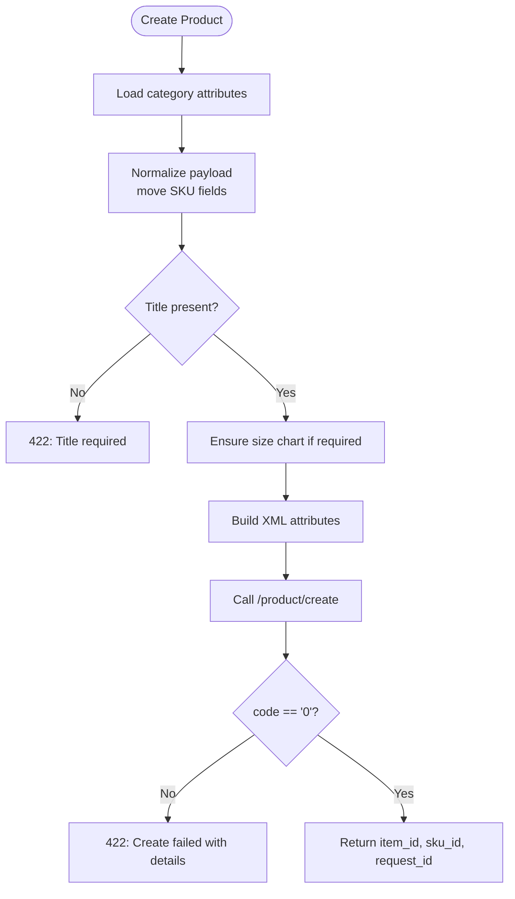
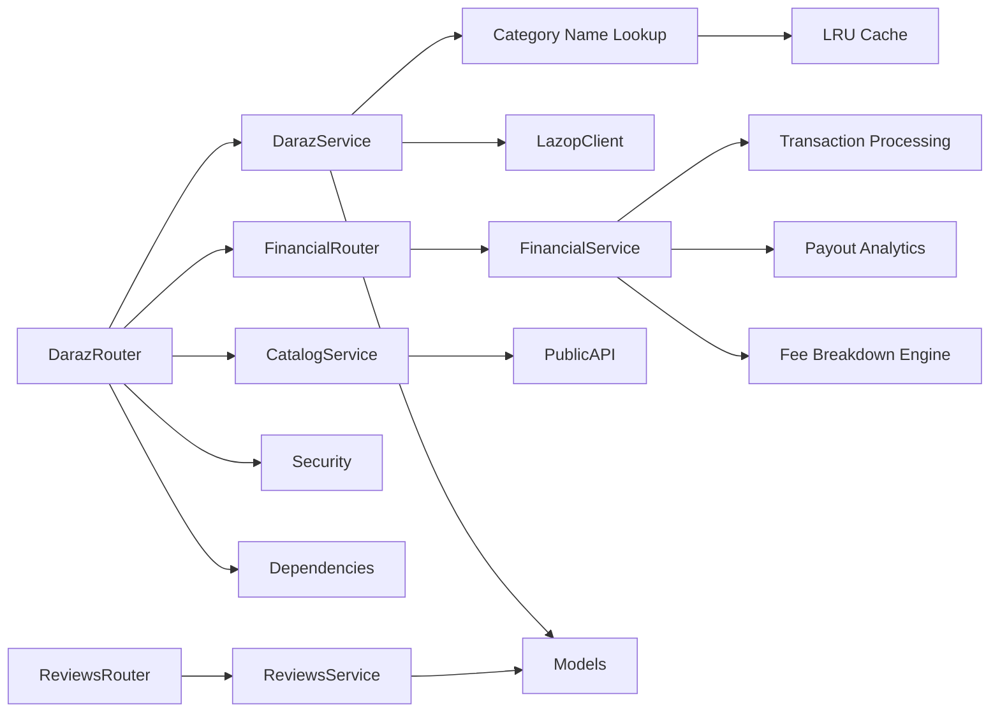

# Daraz Integration API

<cite>
**Referenced Files in This Document**
- [daraz_router.py](file://neurocom_backend/routers/daraz_router.py)
- [daraz_service.py](file://neurocom_backend/services/daraz_service.py)
- [daraz_catalog_service.py](file://neurocom_backend/services/daraz_catalog_service.py)
- [base.py](file://neurocom_backend/python/lazop/base.py)
- [daraz_model.py](file://neurocom_backend/models/daraz_model.py)
- [auth_router.py](file://neurocom_backend/routers/auth_router.py)
- [auth_service.py](file://neurocom_backend/services/auth_service.py)
- [security.py](file://neurocom_backend/utils/security.py)
- [dependencies.py](file://neurocom_backend/dependencies.py)
- [reviews_router.py](file://neurocom_backend/routers/reviews_router.py)
- [reviews_service.py](file://neurocom_backend/services/reviews_service.py)
</cite>

## Update Summary
**Changes Made**
- Added comprehensive financial analytics system with 7 new REST endpoints including financial dashboard, transaction details, payout analytics, fee breakdown, profit analytics, cash flow analysis, and settlement reconciliation
- Enhanced product category system with LRU-cached category name enrichment system providing O(1) performance for category ID-to-name resolution
- Updated core components section to include financial analytics capabilities
- Added detailed financial analytics endpoints documentation with request/response schemas
- Enhanced category information system documentation with performance optimization details
- Updated architecture diagrams to reflect new financial analytics flow

## Table of Contents
1. Introduction
2. Project Structure
3. Core Components
4. Architecture Overview
5. Detailed Component Analysis
6. Dependency Analysis
7. Performance Considerations
8. Troubleshooting Guide
9. Conclusion

## Introduction
This document provides comprehensive API documentation for the Daraz marketplace integration exposed by the backend service. It covers:
- OAuth authentication flow (authorization code exchange and access token management)
- Product management endpoints (create, retrieve, category attributes, image migration)
- **NEW**: Comprehensive financial analytics system with dashboard, transactions, payouts, fees, profit analysis, cash flow, and settlement reconciliation
- Catalog search and product hunting endpoints for automated product discovery
- Order processing endpoints (orders, tracking, logistics, reverse orders)
- Review scraping and analysis
- Payout statements and conversation sessions
- Request/response schemas, error handling patterns, and rate limiting considerations specific to Daraz API constraints

The integration uses a custom Lazop client to call Daraz APIs, with FastAPI routers exposing secure endpoints that require merchant authentication and a per-request encrypted Daraz access token header. The new financial analytics system provides comprehensive business insights through multiple specialized endpoints, while enhanced category information systems deliver improved user experience with automatic category name enrichment and optimized performance through LRU caching.

## Project Structure
Key modules involved in the Daraz integration:
- Routers: HTTP endpoints under /daraz, /auth, /reviews, and /financial
- Services: Business logic for Daraz API calls, caching, product normalization, review analysis, **and financial analytics**
- Models: Pydantic models defining request/response shapes with enhanced category information and financial data structures
- Lazop SDK wrapper: Low-level HTTP signing and execution against Daraz endpoints
- Security: JWT-based merchant auth and encrypted token handling

**Diagram sources**
- [daraz_router.py:82-447](file://neurocom_backend/routers/daraz_router.py#L82-L447)
- [auth_router.py:15-42](file://neurocom_backend/routers/auth_router.py#L15-L42)
- [reviews_router.py:11-42](file://neurocom_backend/routers/reviews_router.py#L11-L42)
- [daraz_service.py:35-2188](file://neurocom_backend/services/daraz_service.py#L35-L2188)
- [daraz_catalog_service.py:1-235](file://neurocom_backend/services/daraz_catalog_service.py#L1-L235)
- [base.py:131-204](file://neurocom_backend/python/lazop/base.py#L131-L204)
- [security.py:22-43](file://neurocom_backend/utils/security.py#L22-L43)
- [dependencies.py:14-79](file://neurocom_backend/dependencies.py#L14-L79)

**Section sources**
- [daraz_router.py:82-447](file://neurocom_backend/routers/daraz_router.py#L82-L447)
- [auth_router.py:15-42](file://neurocom_backend/routers/auth_router.py#L15-L42)
- [reviews_router.py:11-42](file://neurocom_backend/routers/reviews_router.py#L11-L42)
- [daraz_service.py:35-2188](file://neurocom_backend/services/daraz_service.py#L35-L2188)
- [daraz_catalog_service.py:1-235](file://neurocom_backend/services/daraz_catalog_service.py#L1-L235)
- [base.py:131-204](file://neurocom_backend/python/lazop/base.py#L131-L204)
- [security.py:22-43](file://neurocom_backend/utils/security.py#L22-L43)
- [dependencies.py:14-79](file://neurocom_backend/dependencies.py#L14-L79)

## Core Components
- OAuth and Merchant Authentication:
  - POST /auth/login returns a JWT for merchant accounts
  - All Daraz endpoints require a valid merchant JWT plus an encrypted Daraz access token header
- **NEW**: Comprehensive Financial Analytics System:
  - GET /financial/dashboard: Comprehensive financial overview with key metrics
  - GET /financial/transactions: Detailed transaction listing with pagination
  - GET /financial/payouts/analytics: Payout analytics broken down by status
  - GET /financial/fees/breakdown: Detailed fee breakdown analysis
  - GET /financial/profit: Profit and loss analytics for given periods
  - GET /financial/cashflow: Daily cash flow analysis showing inflows/outflows
  - GET /financial/settlement/reconcile/{payout_id}: Settlement reconciliation for specific payouts
- **NEW**: Enhanced Category Information System:
  - Primary category names automatically populated in product responses
  - LRU-cached category lookup for optimal performance
  - Seamless integration with existing product retrieval endpoints
- Catalog Search and Product Hunting:
  - POST /catalog/search: Search products by query with pagination and filtering
  - POST /catalog/hunt: Intelligent product discovery based on niches with quality filters
  - No authentication required for public catalog scraping
- Daraz Access Token Resolution:
  - Header x-daraz-access-token is decrypted and validated against the authenticated merchant's connection
- Lazop Client:
  - Signs requests using SHA-256 and app_key/app_secret; supports GET/POST and file uploads
- Product Management:
  - Create products with category-aware attribute mapping and size chart enforcement
  - Retrieve all products or by ID with enhanced category information
  - Category tree and attributes retrieval
  - Image migration/upload to Daraz CDN
- Orders and Logistics:
  - List orders, list orders with items, get order by ID
  - Trace order and logistics details
  - Reverse orders and history
- Reviews:
  - Scrape full review history from product page URL
  - Analyze reviews via clustering and LLM summarization
- Payouts and Conversations:
  - Get payout statements
  - Retrieve conversation sessions

**Section sources**
- [auth_router.py:18-42](file://neurocom_backend/routers/auth_router.py#L18-L42)
- [auth_service.py:6-10](file://neurocom_backend/services/auth_service.py#L6-L10)
- [security.py:22-43](file://neurocom_backend/utils/security.py#L22-L43)
- [dependencies.py:14-79](file://neurocom_backend/dependencies.py#L14-L79)
- [base.py:131-204](file://neurocom_backend/python/lazop/base.py#L131-L204)
- [daraz_router.py:85-447](file://neurocom_backend/routers/daraz_router.py#L85-L447)
- [daraz_service.py:35-2188](file://neurocom_backend/services/daraz_service.py#L35-L2188)
- [daraz_catalog_service.py:109-235](file://neurocom_backend/services/daraz_catalog_service.py#L109-L235)
- [reviews_router.py:11-42](file://neurocom_backend/routers/reviews_router.py#L11-L42)
- [reviews_service.py:59-304](file://neurocom_backend/services/reviews_service.py#L59-L304)

## Architecture Overview
The system exposes REST endpoints that enforce merchant authentication and per-call Daraz authorization. The Daraz service layer handles API calls through a Lazop client, caches results where appropriate, normalizes payloads, and enforces domain rules (e.g., required size charts). **The new financial analytics system provides comprehensive business intelligence through specialized endpoints that aggregate transaction data, calculate fees, analyze profits, and reconcile settlements.**

**Diagram sources**
- [auth_router.py:24-37](file://neurocom_backend/routers/auth_router.py#L24-L37)
- [daraz_router.py:330-397](file://neurocom_backend/routers/daraz_router.py#L330-L397)
- [daraz_service.py:1763-2188](file://neurocom_backend/services/daraz_service.py#L1763-L2188)
- [base.py:140-204](file://neurocom_backend/python/lazop/base.py#L140-L204)
- [security.py:31-43](file://neurocom_backend/utils/security.py#L31-L43)
- [dependencies.py:17-43](file://neurocom_backend/dependencies.py#L17-L43)

## Detailed Component Analysis

### OAuth and Merchant Authentication
- POST /auth/signup creates a merchant account
- POST /auth/login authenticates and returns a JWT
- GET /auth/me returns current merchant profile
- All protected routes use Bearer JWT and additional encrypted Daraz access token header

Request examples:
- Login: POST /auth/login with form fields username/password
- Current user: GET /auth/me with Authorization: Bearer <jwt>

Response examples:
- Login: { "access_token": "<jwt>" }
- Current user: Merchant object

Error handling:
- Invalid credentials return 401 with WWW-Authenticate header

Rate limiting:
- No explicit rate limiting at this layer; rely on upstream limits

**Section sources**
- [auth_router.py:18-42](file://neurocom_backend/routers/auth_router.py#L18-L42)
- [auth_service.py:6-10](file://neurocom_backend/services/auth_service.py#L6-L10)
- [security.py:22-28](file://neurocom_backend/utils/security.py#L22-L28)
- [dependencies.py:14-43](file://neurocom_backend/dependencies.py#L14-L43)

### Daraz Access Token Resolution
- Each Daraz endpoint requires header x-daraz-access-token containing an encrypted token tied to the authenticated merchant
- The router resolves and decrypts the token before calling services
- If the token is invalid or not linked to the merchant, appropriate errors are returned

Common errors:
- Missing token: 401
- Invalid encrypted token: 400
- Connection not active for merchant: 403

**Section sources**
- [daraz_router.py:24-78](file://neurocom_backend/routers/daraz_router.py#L24-L78)
- [security.py:31-43](file://neurocom_backend/utils/security.py#L31-L43)

### **NEW**: Comprehensive Financial Analytics System
**Updated** Added complete financial analytics system with 7 specialized endpoints for comprehensive business intelligence.

Key features:
- **Financial Dashboard**: Aggregated view of revenue, payouts, fees, profit margins, and cash flow trends
- **Transaction Details**: Paginated access to detailed transaction records with date filtering
- **Payout Analytics**: Status-based breakdown of payouts (paid, upcoming, pending, failed)
- **Fee Breakdown**: Detailed categorization of platform fees, commissions, shipping costs, and penalties
- **Profit Analytics**: Net profit calculations with margin analysis and order count tracking
- **Cash Flow Analysis**: Daily inflow/outflow tracking over configurable time periods
- **Settlement Reconciliation**: Verification of payout amounts against constituent orders

Implementation details:
- `get_transaction_details()`: Fetches paginated transaction data from Daraz Finance API
- `get_all_transactions()`: Automatic pagination to retrieve complete transaction history
- `calculate_fee_breakdown()`: Categorizes fees into commission, payment, shipping, refunds, penalties, and promotional discounts
- `get_profit_analytics()`: Calculates net profit by distinguishing between revenue reductions (refunds) and platform costs
- `get_cash_flow_analysis()`: Tracks daily cash movements with inflow/outflow classification
- `reconcile_settlement()`: Verifies payout accuracy by comparing calculated vs. actual amounts

Performance benefits:
- Efficient transaction aggregation with automatic pagination
- Decimal arithmetic for precise financial calculations
- Configurable time ranges for flexible analysis periods
- Optimized fee categorization with keyword matching

**Section sources**
- [daraz_router.py:330-397](file://neurocom_backend/routers/daraz_router.py#L330-L397)
- [daraz_service.py:1763-2188](file://neurocom_backend/services/daraz_service.py#L1763-L2188)
- [daraz_model.py:561-638](file://neurocom_backend/models/daraz_model.py#L561-L638)

#### Financial Analytics Flow

**Diagram sources**
- [daraz_service.py:2153-2188](file://neurocom_backend/services/daraz_service.py#L2153-L2188)
- [daraz_router.py:330-337](file://neurocom_backend/routers/daraz_router.py#L330-L337)

### **NEW**: Enhanced Category Information System
**Updated** Added comprehensive category name enrichment system for improved product information display.

Key features:
- **Primary Category Names**: Products now include `primary_category_name` field alongside the existing `primary_category` ID
- **LRU Caching**: Category lookup uses `@lru_cache(maxsize=1)` for optimal performance
- **Automatic Enrichment**: Category names are automatically populated during product data processing
- **Seamless Integration**: Works transparently with existing product retrieval endpoints

Implementation details:
- `_category_name_lookup()`: Builds a complete category ID to name mapping cache
- `_enrich_primary_category_names()`: Populates category names in product responses
- Applied to both single product and bulk product retrieval endpoints

Performance benefits:
- Single category tree fetch cached for entire application lifecycle
- O(1) lookup time for category name resolution
- Minimal overhead added to existing product operations

**Section sources**
- [daraz_service.py:319-355](file://neurocom_backend/services/daraz_service.py#L319-L355)
- [daraz_model.py:193-202](file://neurocom_backend/models/daraz_model.py#L193-L202)
- [daraz_service.py:85-108](file://neurocom_backend/services/daraz_service.py#L85-L108)

#### Category Enrichment Flow

**Diagram sources**
- [daraz_service.py:319-355](file://neurocom_backend/services/daraz_service.py#L319-L355)
- [daraz_service.py:85-108](file://neurocom_backend/services/daraz_service.py#L85-L108)

### **NEW**: Catalog Search and Product Hunting Endpoints
Endpoints:
- POST /catalog/search: Search products by query with pagination, sorting, and price filtering
- POST /catalog/hunt: Intelligent product discovery based on niches with quality filters

**Updated** Added comprehensive product discovery capabilities without requiring merchant authentication.

Request/response schemas:
- CatalogSearchRequest: { query, page, max_pages, sort_by, price_min, price_max }
- ProductHuntRequest: { niche, max_pages, min_rating, min_reviews, max_price }
- CatalogSearchResponse: { query, page, total_pages, total_products, products, available_filters, subcategories }
- ProductHuntResponse: { niche, total_scraped, total_recommended, subcategories, recommended_products }

Product filtering criteria:
- Minimum rating threshold (ratingScore)
- Minimum review count threshold
- Maximum price limit
- Automatic sorting by rating and review count

Error handling:
- Network errors during scraping raise HTTP exceptions
- Invalid queries return empty results
- Rate limiting handled internally with delays between requests

Rate limiting:
- Built-in 1.5 second delay between requests to avoid overwhelming Daraz servers
- Maximum 50 pages per request to prevent excessive scraping
- Optional session cookies for higher rate limits

**Section sources**
- [daraz_router.py:425-447](file://neurocom_backend/routers/daraz_router.py#L425-L447)
- [daraz_catalog_service.py:109-235](file://neurocom_backend/services/daraz_catalog_service.py#L109-L235)
- [daraz_model.py:466-526](file://neurocom_backend/models/daraz_model.py#L466-L526)

#### Product Hunting Flow

**Diagram sources**
- [daraz_catalog_service.py:187-235](file://neurocom_backend/services/daraz_catalog_service.py#L187-L235)
- [daraz_router.py:437-447](file://neurocom_backend/routers/daraz_router.py#L437-L447)

### Product Management Endpoints
Endpoints:
- GET /daraz/get_all_products: Returns all products with cached validation and **enhanced category information**
- GET /daraz/get_product_by_id?product_id=<id>: Returns a single product **with primary category name**
- GET /daraz/get_category_attributes?primary_category_id=<id>&language_code=en_US: Returns category-specific attribute definitions
- POST /daraz/create_new_product: Creates a product with normalized attributes and enforced size chart if required
- GET /daraz/get_all_categories: Returns category tree
- GET /daraz/get_category_by_id?category_id=<id>: Returns a specific category
- GET /daraz/get_category_children?categoty_id=<id>: Returns children of a category

Image migration:
- POST /daraz/migrate_image: Migrates or uploads a single image to Daraz CDN
- POST /daraz/migrate_images: Batch migrate images (returns batch info)
- GET /daraz/migrate_images/result?batch_id=<id>: Polls batch result

Request/response schemas:
- Product creation expects a payload with PrimaryCategory, Attributes, Skus, etc.
- Category attributes define which fields are mandatory and their types
- Image migration returns migrated URL and hash code
- **Enhanced**: Product responses now include `primary_category_name` field for better UX

Error handling:
- Invalid category attributes response: 502
- Product creation failures include daraz_code, daraz_message, daraz_details, request_id
- Image migration failures map to 422 or 502 based on code

Rate limiting:
- Lazop client logs non-zero codes; implement client-side backoff on repeated errors

**Section sources**
- [daraz_router.py:107-248](file://neurocom_backend/routers/daraz_router.py#L107-L248)
- [daraz_service.py:55-100](file://neurocom_backend/services/daraz_service.py#L55-L100)
- [daraz_service.py:254-311](file://neurocom_backend/services/daraz_service.py#L254-L311)
- [daraz_service.py:314-479](file://neurocom_backend/services/daraz_service.py#L314-L479)
- [daraz_service.py:482-800](file://neurocom_backend/services/daraz_service.py#L482-L800)
- [daraz_model.py:20-36](file://neurocom_backend/models/daraz_model.py#L20-L36)
- [daraz_model.py:43-79](file://neurocom_backend/models/daraz_model.py#L43-L79)

#### Product Creation Flow

**Diagram sources**
- [daraz_service.py:754-800](file://neurocom_backend/services/daraz_service.py#L754-L800)
- [daraz_router.py:213-248](file://neurocom_backend/routers/daraz_router.py#L213-L248)

### Order Processing Endpoints
Endpoints:
- GET /daraz/get_all_orders?include_canceled=false: Lists orders
- GET /daraz/get_all_orders_full?include_canceled=false&start_date=<iso>&end_date=<iso>: Full order listing with date filters
- GET /daraz/get_orders_with_items?product_sku_id=&start_date=&end_date=: Orders merged with line items
- GET /daraz/get_order_by_id?order_id=<id>: Single order with items
- GET /daraz/trace_order?order_id=<id>: Tracking information
- GET /daraz/get_order_logistics_details?order_id=<id>: Logistics details
- GET /daraz/get_all_reverse_orders_info?product_id=&product_sku_id=&start_date=&end_date=: Reverse orders overview
- GET /daraz/get_reverse_order_history?reverse_order_line_id=<id>: Reverse order history

Request/response schemas:
- OrdersWithItemsResponse includes orders and count
- OrderWithItems includes address, items, fees, shipping, customer names
- ReverseOrderInfo includes reverse order lines and statuses

Error handling:
- Errors from Daraz are surfaced with request_id and diagnostic details where applicable

Rate limiting:
- Use start_date/end_date filters to reduce payload size and frequency

**Section sources**
- [daraz_router.py:250-296](file://neurocom_backend/routers/daraz_router.py#L250-L296)
- [daraz_model.py:326-405](file://neurocom_backend/models/daraz_model.py#L326-L405)
- [daraz_model.py:225-281](file://neurocom_backend/models/daraz_model.py#L225-L281)

### Review Scraping and Analysis
Endpoints:
- GET /daraz/scrape_product_reviews?product_url=<url>: Scrapes full review history from product page
- POST /reviews/analyze-reviews: Analyzes scraped reviews with clustering and LLM summarization; supports streaming

Request/response schemas:
- ScrapedProductReviewsResponse includes item_id, total_reviews, average_rating, reviews
- Review analysis returns sentiment_score, rating_trend, summary, topics, action_plan, cluster_debug

Error handling:
- Invalid product URL raises 400
- No reviews found raises 400
- AI analysis failure raises 500

Rate limiting:
- Scraping iterates pages up to a cap; avoid excessive concurrent scrapes

**Section sources**
- [daraz_router.py:123-125](file://neurocom_backend/routers/daraz_router.py#L123-L125)
- [reviews_router.py:17-42](file://neurocom_backend/routers/reviews_router.py#L17-L42)
- [daraz_service.py:189-252](file://neurocom_backend/services/daraz_service.py#L189-L252)
- [reviews_service.py:59-304](file://neurocom_backend/services/reviews_service.py#L59-L304)
- [daraz_model.py:291-316](file://neurocom_backend/models/daraz_model.py#L291-L316)

### Payout Statements and Conversation Sessions
Endpoints:
- GET /daraz/get_payout: Retrieves payout statement
- GET /daraz/conversations/sessions: Retrieves conversation sessions

Error handling:
- Errors from Daraz are propagated with request_id and diagnostics

Rate limiting:
- These endpoints are typically low-frequency; no special throttling implemented

**Section sources**
- [daraz_router.py:323-329](file://neurocom_backend/routers/daraz_router.py#L323-L329)

## Dependency Analysis
- Routers depend on services for business logic and on security/dependencies for authentication
- Services depend on Lazop client for API calls and on Pydantic models for validation
- **NEW**: Financial service depends on transaction processing, payout analysis, and fee calculation engines
- **NEW**: Catalog service depends on public HTTP requests to Daraz catalog endpoints
- **NEW**: Category lookup system provides efficient mapping between category IDs and names
- Lazop client handles signing and HTTP transport

**Diagram sources**
- [daraz_router.py:82-447](file://neurocom_backend/routers/daraz_router.py#L82-L447)
- [daraz_service.py:35-2188](file://neurocom_backend/services/daraz_service.py#L35-L2188)
- [daraz_catalog_service.py:1-235](file://neurocom_backend/services/daraz_catalog_service.py#L1-L235)
- [base.py:131-204](file://neurocom_backend/python/lazop/base.py#L131-L204)
- [daraz_model.py:1-638](file://neurocom_backend/models/daraz_model.py#L1-L638)
- [reviews_router.py:11-42](file://neurocom_backend/routers/reviews_router.py#L11-L42)
- [reviews_service.py:59-304](file://neurocom_backend/services/reviews_service.py#L59-L304)

**Section sources**
- [daraz_router.py:82-447](file://neurocom_backend/routers/daraz_router.py#L82-L447)
- [daraz_service.py:35-2188](file://neurocom_backend/services/daraz_service.py#L35-L2188)
- [daraz_catalog_service.py:1-235](file://neurocom_backend/services/daraz_catalog_service.py#L1-L235)
- [base.py:131-204](file://neurocom_backend/python/lazop/base.py#L131-L204)
- [daraz_model.py:1-638](file://neurocom_backend/models/daraz_model.py#L1-L638)
- [reviews_router.py:11-42](file://neurocom_backend/routers/reviews_router.py#L11-L42)
- [reviews_service.py:59-304](file://neurocom_backend/services/reviews_service.py#L59-L304)

## Performance Considerations
- Caching:
  - Product listings and reviews are cached using Redis-backed fingerprinting; volatile envelope keys like request_id and trace_id are stripped to avoid false cache misses
  - **NEW**: Category name lookup uses LRU caching with `@lru_cache(maxsize=1)` for optimal performance
  - **NEW**: Financial analytics benefit from efficient transaction aggregation with automatic pagination
- Concurrency:
  - Reviews fetching uses ThreadPoolExecutor to parallelize per-product review calls
- Payload normalization:
  - HTML descriptions are cleaned to plain text to reduce payload size and improve readability
- Image handling:
  - Images are validated for type and size; unsupported hosts fall back to upload rather than migrate
- **NEW**: Financial analytics performance:
  - Decimal arithmetic ensures precise financial calculations
  - Automatic pagination prevents memory issues with large transaction sets
  - Configurable time ranges optimize query performance
  - Efficient fee categorization with keyword matching reduces processing overhead
- **NEW**: Catalog scraping performance:
  - Built-in 1.5-second delays between requests to respect Daraz server limits
  - Maximum 50 pages per request to prevent excessive scraping
  - Optional session cookies for improved rate limits
  - Efficient parsing of filter data and subcategories
- **NEW**: Category enrichment performance:
  - Single category tree fetch cached for entire application lifecycle
  - O(1) lookup time for category name resolution
  - Minimal overhead added to existing product operations
- Rate limiting:
  - No built-in rate limiter; implement client-side retries with exponential backoff on non-zero codes from Lazop responses
  - Avoid large batch operations during peak hours; use pagination and date filters

[No sources needed since this section provides general guidance]

## Troubleshooting Guide
Common issues and resolutions:
- Missing or invalid Daraz access token:
  - Ensure x-daraz-access-token header is present and corresponds to an active merchant connection
  - Decryption errors return 400; verify encryption key configuration
- **NEW**: Financial analytics issues:
  - Transaction API failures: Check date range parameters and ensure proper access token permissions
  - Payout reconciliation discrepancies: Verify payout ID format and check Daraz API response structure
  - Fee calculation errors: Ensure transaction data contains expected fee_name fields
  - Cash flow analysis gaps: Verify transaction_date format handling for different date formats
- **NEW**: Category information issues:
  - Missing category names: Verify category tree is accessible and contains expected data
  - Performance issues: Check LRU cache effectiveness and category tree size
  - Inconsistent category names: Ensure language settings match expected locale
- **NEW**: Catalog scraping issues:
  - Network timeouts: Increase timeout settings or retry with different headers
  - Rate limiting: Implement exponential backoff and reduce request frequency
  - Empty results: Verify query terms match Daraz catalog terminology
  - Session cookies: Consider adding cookies for higher rate limits
- Product creation failures:
  - Inspect daraz_code, daraz_message, daraz_details, and request_id in the error response
  - Ensure required fields like title and size chart (if required by category) are provided
- Image migration failures:
  - Unsupported host URLs trigger fallback upload; ensure JPEG/PNG and under 1 MB
  - Migration code 302 triggers upload path automatically
- Order and reverse order queries:
  - Use date filters to limit scope; check request_id for tracing
- Review scraping:
  - Ensure product URL contains a valid item id pattern; otherwise 400 is raised
  - If no reviews are found, adjust filters or confirm product exists

Error patterns:
- 400 Bad Request: Invalid encrypted token or input validation failures
- 401 Unauthorized: Missing or invalid JWT
- 403 Forbidden: Merchant does not have active Daraz connection
- 413 Payload Too Large: Image exceeds 1 MB
- 415 Unsupported Media Type: Non-JPEG/PNG image
- 422 Unprocessable Entity: Validation or Daraz rejection with diagnostic details
- 502 Bad Gateway: Invalid Daraz response structure or network errors

**Section sources**
- [daraz_router.py:24-78](file://neurocom_backend/routers/daraz_router.py#L24-L78)
- [daraz_router.py:139-159](file://neurocom_backend/routers/daraz_router.py#L139-L159)
- [daraz_router.py:173-207](file://neurocom_backend/routers/daraz_router.py#L173-L207)
- [daraz_router.py:213-248](file://neurocom_backend/routers/daraz_router.py#L213-L248)
- [daraz_router.py:330-397](file://neurocom_backend/routers/daraz_router.py#L330-L397)
- [daraz_service.py:341-350](file://neurocom_backend/services/daraz_service.py#L341-L350)
- [daraz_service.py:413-446](file://neurocom_backend/services/daraz_service.py#L413-L446)
- [daraz_service.py:1788-1794](file://neurocom_backend/services/daraz_service.py#L1788-L1794)
- [daraz_service.py:1853-1858](file://neurocom_backend/services/daraz_service.py#L1853-L1858)
- [daraz_catalog_service.py:118-127](file://neurocom_backend/services/daraz_catalog_service.py#L118-L127)
- [reviews_router.py:17-42](file://neurocom_backend/routers/reviews_router.py#L17-L42)

## Conclusion
The Daraz integration provides a robust set of endpoints for OAuth-driven merchant authentication, product lifecycle management, **comprehensive financial analytics with dashboard, transactions, payouts, fees, profit analysis, cash flow, and settlement reconciliation**, intelligent product discovery through catalog search and hunting, order processing, review scraping and analysis, payouts, and conversations. The architecture emphasizes secure token handling, strict validation via Pydantic models, efficient caching and concurrency strategies, **and comprehensive business intelligence capabilities through specialized financial endpoints**. **Enhanced category information systems provide improved user experience with automatic category name enrichment and optimized performance through LRU caching**. For production deployments, implement client-side rate limiting and monitoring around Daraz API responses to handle throttling gracefully.

[No sources needed since this section summarizes without analyzing specific files]