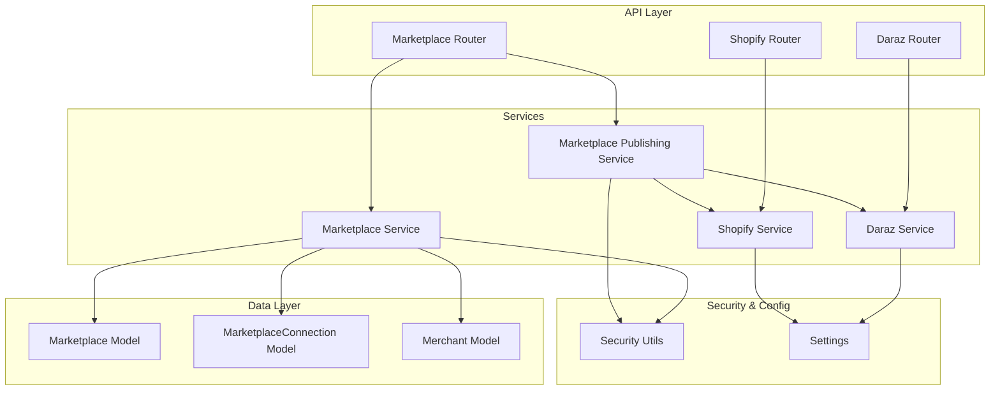
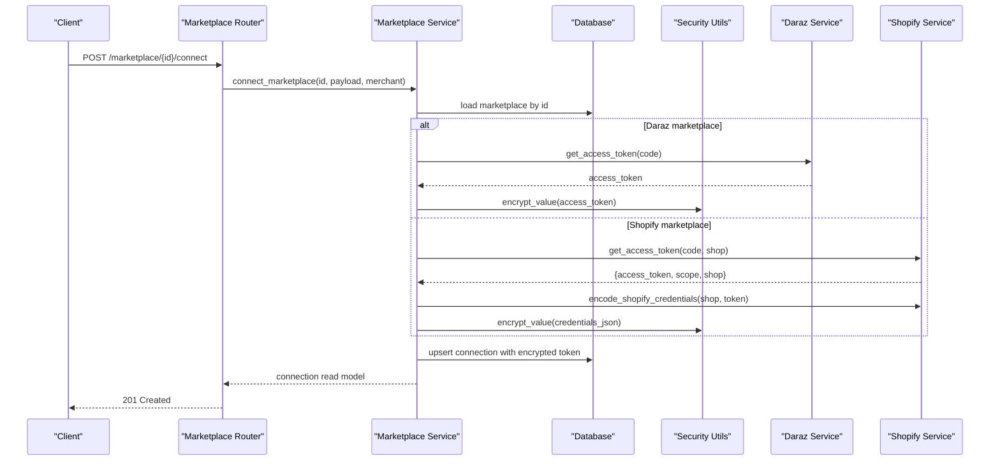
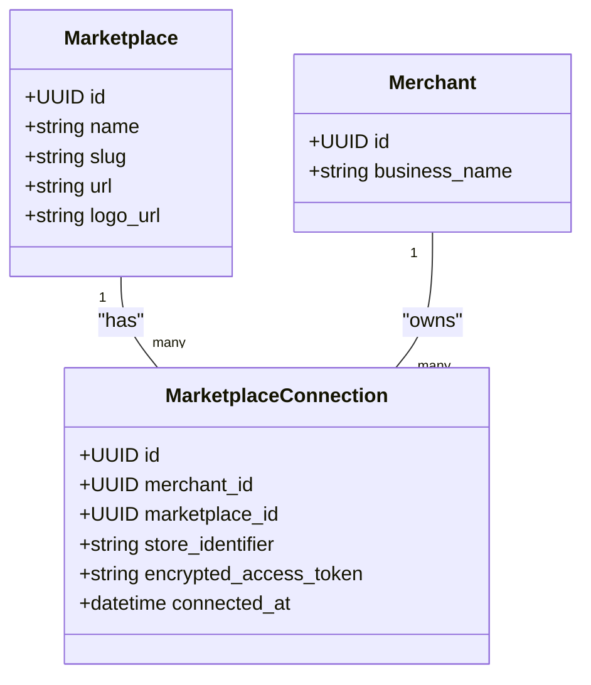
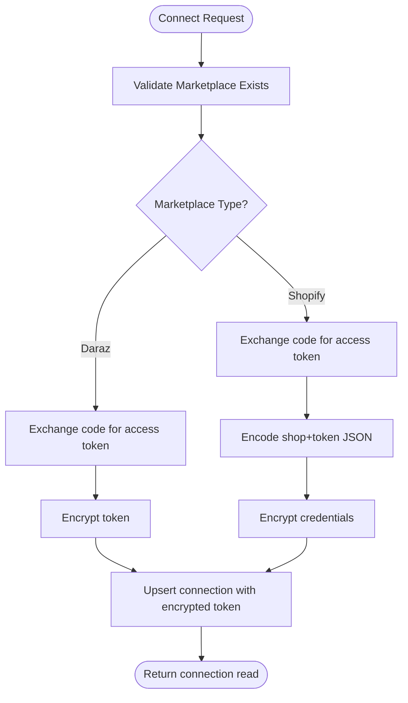
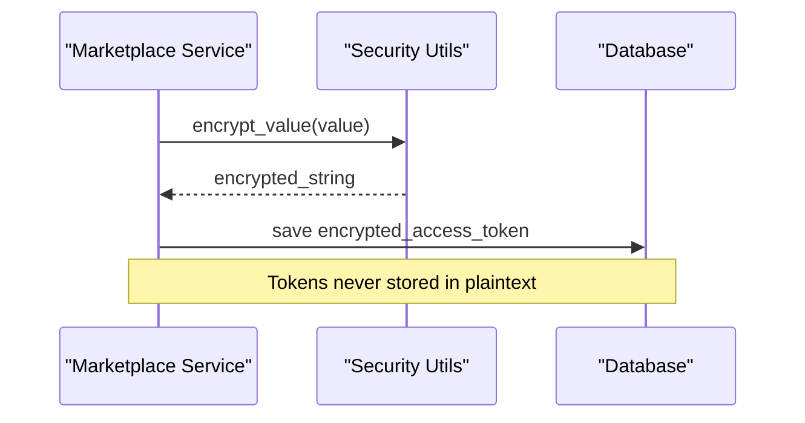
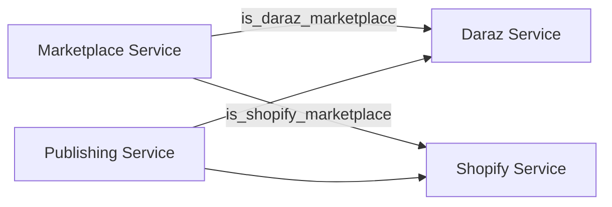
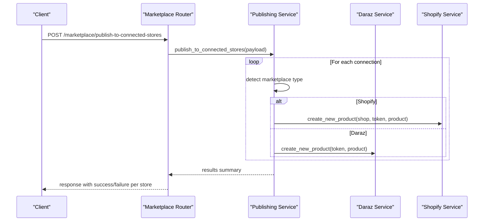
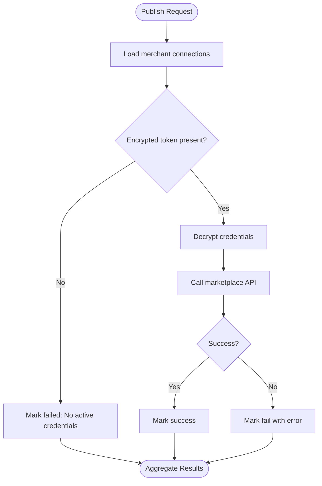
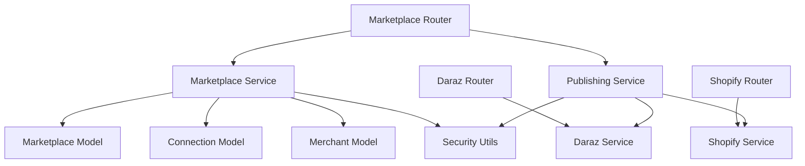

# Marketplace Connection Management

<cite>
**Referenced Files in This Document**
- [marketplace.py](file://neurocom_backend/database/models/marketplace.py)
- [merchant.py](file://neurocom_backend/database/models/merchant.py)
- [marketplace_service.py](file://neurocom_backend/services/marketplace_service.py)
- [marketplace_publishing_service.py](file://neurocom_backend/services/marketplace_publishing_service.py)
- [security.py](file://neurocom_backend/utils/security.py)
- [settings.py](file://neurocom_backend/utils/settings.py)
- [marketplace_router.py](file://neurocom_backend/routers/marketplace_router.py)
- [daraz_service.py](file://neurocom_backend/services/daraz_service.py)
- [shopify_service.py](file://neurocom_backend/services/shopify_service.py)
- [daraz_router.py](file://neurocom_backend/routers/daraz_router.py)
- [shopify_router.py](file://neurocom_backend/routers/shopify_router.py)
</cite>

## Table of Contents
1. Introduction
2. Project Structure
3. Core Components
4. Architecture Overview
5. Detailed Component Analysis
6. Dependency Analysis
7. Performance Considerations
8. Troubleshooting Guide
9. Conclusion
10. Appendices

## Introduction
This document explains the marketplace connection management system that enables merchants to link their marketplace accounts (Daraz and Shopify), securely store credentials, monitor connection status, and publish products across multiple marketplaces through a unified interface. It covers connection lifecycle management, credential encryption, validation mechanisms, and how to add new marketplace integrations with marketplace-specific settings.

## Project Structure
The marketplace connection system is organized into:
- Data models for marketplaces and connections
- Services for connecting, listing, disconnecting, and publishing
- Routers exposing REST endpoints for merchant operations
- Marketplace-specific services for Daraz and Shopify
- Security utilities for encrypting/decrypting credentials
- Settings for environment configuration

**Diagram sources**
- [marketplace_router.py:1-118](file://neurocom_backend/routers/marketplace_router.py#L1-L118)
- [marketplace_service.py:1-302](file://neurocom_backend/services/marketplace_service.py#L1-L302)
- [marketplace_publishing_service.py:1-64](file://neurocom_backend/services/marketplace_publishing_service.py#L1-L64)
- [daraz_service.py:1-800](file://neurocom_backend/services/daraz_service.py#L1-L800)
- [shopify_service.py:1-701](file://neurocom_backend/services/shopify_service.py#L1-L701)
- [marketplace.py:17-41](file://neurocom_backend/database/models/marketplace.py#L17-L41)
- [merchant.py:11-15](file://neurocom_backend/database/models/merchant.py#L11-L15)
- [security.py:31-43](file://neurocom_backend/utils/security.py#L31-L43)
- [settings.py:11-29](file://neurocom_backend/utils/settings.py#L11-L29)

**Section sources**
- [marketplace_router.py:1-118](file://neurocom_backend/routers/marketplace_router.py#L1-L118)
- [marketplace_service.py:1-302](file://neurocom_backend/services/marketplace_service.py#L1-L302)
- [marketplace.py:17-41](file://neurocom_backend/database/models/marketplace.py#L17-L41)
- [merchant.py:11-15](file://neurocom_backend/database/models/merchant.py#L11-L15)
- [security.py:31-43](file://neurocom_backend/utils/security.py#L31-L43)
- [settings.py:11-29](file://neurocom_backend/utils/settings.py#L11-L29)

## Core Components
- Marketplace and MarketplaceConnection models define supported marketplaces and per-merchant links, including encrypted access tokens and store identifiers.
- Marketplace service provides CRUD for marketplaces, connection lifecycle (connect/disconnect), and listing connections with connection status.
- Marketplace publishing service orchestrates product creation across connected stores, decrypting credentials and delegating to marketplace-specific services.
- Daraz and Shopify services implement API interactions, OAuth flows, caching, and data normalization.
- Security utilities provide Fernet-based encryption for sensitive tokens.
- Routers expose REST endpoints for admin and merchant operations.

Key responsibilities:
- Merchant account linking via OAuth or direct token exchange
- Secure storage of credentials using encryption
- Connection status reporting based on stored tokens
- Unified publishing flow abstracting marketplace differences

**Section sources**
- [marketplace.py:17-105](file://neurocom_backend/database/models/marketplace.py#L17-L105)
- [marketplace_service.py:99-302](file://neurocom_backend/services/marketplace_service.py#L99-L302)
- [marketplace_publishing_service.py:14-64](file://neurocom_backend/services/marketplace_publishing_service.py#L14-L64)
- [security.py:31-43](file://neurocom_backend/utils/security.py#L31-L43)

## Architecture Overview
The system uses a layered architecture:
- API layer (routers) handles HTTP requests and authentication
- Service layer implements business logic and orchestration
- Data layer persists marketplace definitions and connections
- Marketplace-specific services encapsulate external API calls
- Security utilities protect sensitive data

**Diagram sources**
- [marketplace_router.py:105-117](file://neurocom_backend/routers/marketplace_router.py#L105-L117)
- [marketplace_service.py:236-280](file://neurocom_backend/services/marketplace_service.py#L236-L280)
- [daraz_service.py:40-46](file://neurocom_backend/services/daraz_service.py#L40-L46)
- [shopify_service.py:87-121](file://neurocom_backend/services/shopify_service.py#L87-L121)
- [security.py:38-43](file://neurocom_backend/utils/security.py#L38-L43)

## Detailed Component Analysis

### Data Models: Marketplace and Connection
- Marketplace defines metadata like name, slug, URL, logo, and relationships to connections.
- MarketplaceConnection ties a merchant to a marketplace with an encrypted access token and a store identifier. A unique constraint prevents duplicate connections per merchant-marketplace-store.
- Pydantic schemas support request/response modeling and include connection read models with marketplace details.

**Diagram sources**
- [marketplace.py:17-41](file://neurocom_backend/database/models/marketplace.py#L17-L41)
- [merchant.py:11-15](file://neurocom_backend/database/models/merchant.py#L11-L15)

**Section sources**
- [marketplace.py:17-105](file://neurocom_backend/database/models/marketplace.py#L17-L105)
- [merchant.py:11-15](file://neurocom_backend/database/models/merchant.py#L11-L15)

### Connection Lifecycle Management
- Connect: Validates marketplace existence, resolves marketplace-specific credentials, encrypts them, and upserts a connection record keyed by merchant, marketplace, and store identifier.
- List: Returns all connections for the authenticated merchant, eager-loading marketplace info.
- Disconnect: Deletes a specific connection after verifying ownership.
- Status: Connections are considered active if they have encrypted tokens; listing includes marketplace-level is_connected flags derived from connection presence.

**Diagram sources**
- [marketplace_service.py:236-280](file://neurocom_backend/services/marketplace_service.py#L236-L280)
- [daraz_service.py:40-46](file://neurocom_backend/services/daraz_service.py#L40-L46)
- [shopify_service.py:87-121](file://neurocom_backend/services/shopify_service.py#L87-L121)
- [security.py:38-43](file://neurocom_backend/utils/security.py#L38-L43)

**Section sources**
- [marketplace_service.py:236-302](file://neurocom_backend/services/marketplace_service.py#L236-L302)

### Credential Storage and Encryption
- Credentials are stored as encrypted strings in the database using Fernet symmetric encryption derived from SECRET_KEY.
- For Shopify, credentials are encoded as JSON containing shop domain and access token before encryption.
- Decryption occurs at runtime when calling marketplace APIs or publishing products.

**Diagram sources**
- [security.py:31-43](file://neurocom_backend/utils/security.py#L31-L43)
- [marketplace_service.py:246-256](file://neurocom_backend/services/marketplace_service.py#L246-L256)
- [shopify_service.py:691-700](file://neurocom_backend/services/shopify_service.py#L691-L700)

**Section sources**
- [security.py:31-43](file://neurocom_backend/utils/security.py#L31-L43)
- [shopify_service.py:691-700](file://neurocom_backend/services/shopify_service.py#L691-L700)
- [marketplace_service.py:246-256](file://neurocom_backend/services/marketplace_service.py#L246-L256)

### Multi-Marketplace Support Architecture
- Marketplace detection uses slug/name heuristics to route logic to Daraz or Shopify handlers.
- Each marketplace has dedicated services implementing OAuth, data fetching, and product creation.
- The publishing service dispatches to the appropriate marketplace implementation based on connection type.

**Diagram sources**
- [marketplace_service.py:36-45](file://neurocom_backend/services/marketplace_service.py#L36-L45)
- [marketplace_publishing_service.py:34-64](file://neurocom_backend/services/marketplace_publishing_service.py#L34-L64)

**Section sources**
- [marketplace_service.py:36-45](file://neurocom_backend/services/marketplace_service.py#L36-L45)
- [marketplace_publishing_service.py:34-64](file://neurocom_backend/services/marketplace_publishing_service.py#L34-L64)

### Unified Interface Pattern
- The marketplace router exposes a single connect endpoint that abstracts marketplace differences.
- The publishing endpoint accepts marketplace-specific payloads and routes them accordingly.
- Consumers interact with a consistent API surface while internal routing handles marketplace specifics.

**Diagram sources**
- [marketplace_router.py:36-42](file://neurocom_backend/routers/marketplace_router.py#L36-L42)
- [marketplace_publishing_service.py:34-64](file://neurocom_backend/services/marketplace_publishing_service.py#L34-L64)
- [shopify_service.py:329-469](file://neurocom_backend/services/shopify_service.py#L329-L469)
- [daraz_service.py:754-800](file://neurocom_backend/services/daraz_service.py#L754-L800)

**Section sources**
- [marketplace_router.py:36-42](file://neurocom_backend/routers/marketplace_router.py#L36-L42)
- [marketplace_publishing_service.py:34-64](file://neurocom_backend/services/marketplace_publishing_service.py#L34-L64)

### Connection Validation Mechanisms
- Connection existence is validated during listing and detail retrieval.
- During publishing, missing or invalid credentials result in failure entries with descriptive errors.
- Marketplace routers validate headers and decrypt tokens before allowing API calls, ensuring only active connections are used.

**Diagram sources**
- [marketplace_publishing_service.py:34-64](file://neurocom_backend/services/marketplace_publishing_service.py#L34-L64)
- [security.py:42-43](file://neurocom_backend/utils/security.py#L42-L43)

**Section sources**
- [marketplace_publishing_service.py:34-64](file://neurocom_backend/services/marketplace_publishing_service.py#L34-L64)

### Automatic Reconnection Handling
- There is no built-in automatic reconnection mechanism in the current codebase.
- Clients should handle expired or invalid tokens by prompting re-authentication and calling the connect endpoint again.
- Error responses indicate missing or invalid credentials, guiding clients to reconnect.

[No sources needed since this section summarizes behavior without analyzing specific files]

### Adding New Marketplace Integrations
To integrate a new marketplace:
1. Define marketplace metadata and ensure slug/name conventions align with detection helpers.
2. Implement marketplace-specific service functions for:
   - OAuth code exchange to access token
   - Encoding/decoding credentials for secure storage
   - Product creation and other required operations
3. Update detection helpers to recognize the new marketplace slug/name.
4. Wire the new service into the publishing flow by adding a branch in the publishing service.
5. Expose any additional endpoints via a dedicated router if needed.

Configuration examples:
- Add environment variables for client IDs/secrets in settings.
- Ensure cache TTLs and scopes are configured appropriately.

**Section sources**
- [marketplace_service.py:36-45](file://neurocom_backend/services/marketplace_service.py#L36-L45)
- [marketplace_publishing_service.py:34-64](file://neurocom_backend/services/marketplace_publishing_service.py#L34-L64)
- [settings.py:11-29](file://neurocom_backend/utils/settings.py#L11-L29)

### Configuring Marketplace-Specific Settings
- Shopify:
  - Configure API key, secret, scopes, and cache TTL.
  - Use normalize_shop to standardize store domains.
  - GraphQL endpoints are versioned via environment variable.
- Daraz:
  - Configure app key and secret for Lazop client initialization.
  - Cache TTL for product and review data can be set via environment variables.

**Section sources**
- [shopify_service.py:21-25](file://neurocom_backend/services/shopify_service.py#L21-L25)
- [shopify_service.py:87-121](file://neurocom_backend/services/shopify_service.py#L87-L121)
- [daraz_service.py:35-46](file://neurocom_backend/services/daraz_service.py#L35-L46)
- [settings.py:11-29](file://neurocom_backend/utils/settings.py#L11-L29)

## Dependency Analysis
- Routers depend on services for business logic and on security utilities for token handling.
- Services depend on data models for persistence and on marketplace-specific implementations for external API calls.
- Marketplace service coordinates between marketplace detection, credential resolution, and database operations.
- Publishing service depends on both marketplace services and security utilities to decrypt and call APIs.

**Diagram sources**
- [marketplace_router.py:1-118](file://neurocom_backend/routers/marketplace_router.py#L1-L118)
- [marketplace_service.py:1-302](file://neurocom_backend/services/marketplace_service.py#L1-L302)
- [marketplace_publishing_service.py:1-64](file://neurocom_backend/services/marketplace_publishing_service.py#L1-L64)
- [daraz_router.py:1-349](file://neurocom_backend/routers/daraz_router.py#L1-L349)
- [shopify_router.py:1-142](file://neurocom_backend/routers/shopify_router.py#L1-L142)

**Section sources**
- [marketplace_router.py:1-118](file://neurocom_backend/routers/marketplace_router.py#L1-L118)
- [marketplace_service.py:1-302](file://neurocom_backend/services/marketplace_service.py#L1-L302)
- [marketplace_publishing_service.py:1-64](file://neurocom_backend/services/marketplace_publishing_service.py#L1-L64)

## Performance Considerations
- Caching: Both Daraz and Shopify services use Redis-backed caching to reduce external API calls. Keys incorporate fingerprints of access tokens and store identifiers to isolate per-merchant data.
- Pagination: Shopify queries paginate through GraphQL cursors to fetch large datasets efficiently.
- Concurrency: Daraz reviews fetching uses thread pools to parallelize review retrieval across products.
- Image migration: Daraz image migration prefers whitelisted URLs to avoid unnecessary downloads; fallbacks to upload when necessary.

Recommendations:
- Monitor cache hit rates and adjust TTLs based on marketplace update frequency.
- Batch operations where possible to minimize API calls.
- Implement retry policies for transient network failures.

[No sources needed since this section provides general guidance]

## Troubleshooting Guide
Common issues and resolutions:
- Missing credentials:
  - Ensure the merchant has connected the marketplace and that encrypted tokens exist.
  - Reconnect via the connect endpoint to refresh tokens.
- Invalid encrypted token:
  - Verify SECRET_KEY configuration and ensure tokens were encrypted with the same key.
  - Reconnect to regenerate encrypted tokens.
- Marketplace not found:
  - Confirm marketplace exists and IDs are correct.
- Unauthorized or forbidden:
  - Ensure the authenticated merchant owns the connection being accessed.
- Publishing failures:
  - Inspect error messages returned by marketplace services; they often include detailed diagnostics.

Operational checks:
- Validate environment variables for API keys and secrets.
- Confirm Redis connectivity for caching.
- Review logs for HTTP exceptions and marketplace error responses.

**Section sources**
- [marketplace_service.py:74-97](file://neurocom_backend/services/marketplace_service.py#L74-L97)
- [marketplace_service.py:292-302](file://neurocom_backend/services/marketplace_service.py#L292-L302)
- [daraz_router.py:24-63](file://neurocom_backend/routers/daraz_router.py#L24-L63)
- [shopify_router.py:44-61](file://neurocom_backend/routers/shopify_router.py#L44-L61)
- [marketplace_publishing_service.py:15-32](file://neurocom_backend/services/marketplace_publishing_service.py#L15-L32)

## Conclusion
The marketplace connection management system provides a robust foundation for linking merchant accounts to Daraz and Shopify, securely storing credentials, monitoring connection status, and publishing products through a unified interface. The modular design allows easy extension to additional marketplaces by following established patterns for credential handling, detection, and publishing. Proper configuration and operational practices ensure reliable performance and maintainability.

[No sources needed since this section summarizes without analyzing specific files]

## Appendices

### API Endpoints Summary
- Marketplace management:
  - Create/update/delete/list supported marketplaces (admin)
  - List/get marketplace details (merchant)
  - Connect/disconnect marketplace (merchant)
  - Publish to connected stores (merchant)
- Daraz-specific:
  - OAuth redirect and token exchange
  - Products, categories, orders, reviews, returns insights
- Shopify-specific:
  - OAuth redirect and token exchange
  - Products, orders, categories, collections

**Section sources**
- [marketplace_router.py:43-117](file://neurocom_backend/routers/marketplace_router.py#L43-L117)
- [daraz_router.py:85-349](file://neurocom_backend/routers/daraz_router.py#L85-L349)
- [shopify_router.py:64-142](file://neurocom_backend/routers/shopify_router.py#L64-L142)