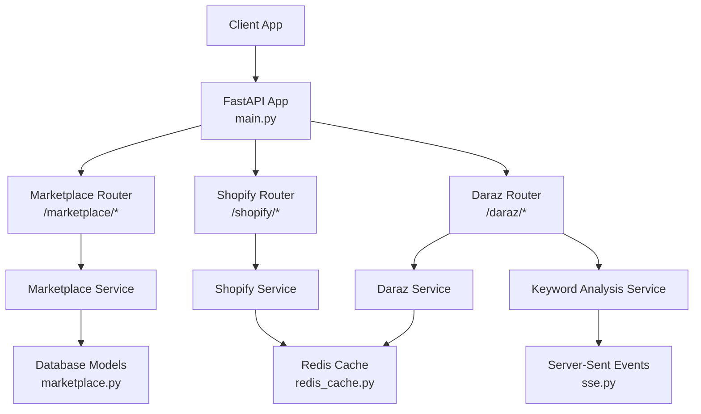
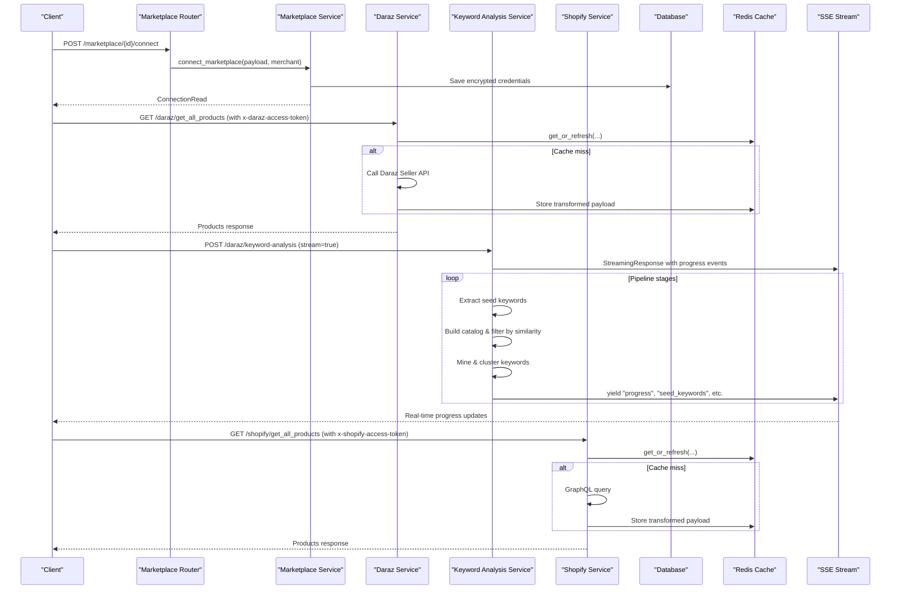
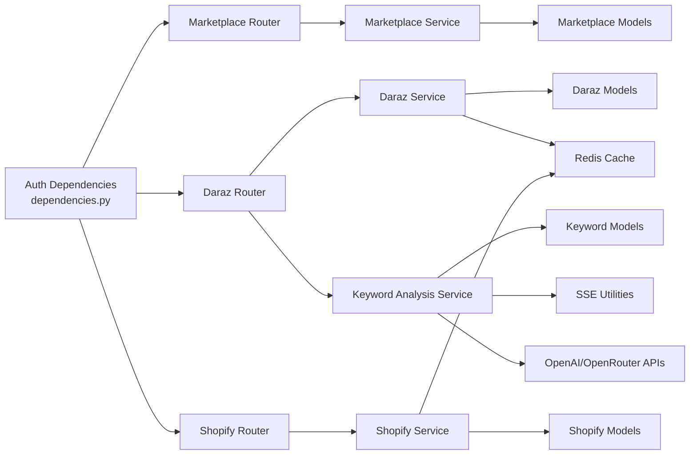

# Marketplace Integration API

<cite>
**Referenced Files in This Document**
- [main.py](file://neurocom_backend/main.py)
- [marketplace_router.py](file://neurocom_backend/routers/marketplace_router.py)
- [daraz_router.py](file://neurocom_backend/routers/daraz_router.py)
- [shopify_router.py](file://neurocom_backend/routers/shopify_router.py)
- [marketplace_service.py](file://neurocom_backend/services/marketplace_service.py)
- [daraz_service.py](file://neurocom_backend/services/daraz_service.py)
- [shopify_service.py](file://neurocom_backend/services/shopify_service.py)
- [keyword_analysis_service.py](file://neurocom_backend/services/keyword_analysis_service.py)
- [keyword_model.py](file://neurocom_backend/models/keyword_model.py)
- [sse.py](file://neurocom_backend/utils/sse.py)
- [marketplace.py](file://neurocom_backend/database/models/marketplace.py)
- [daraz_model.py](file://neurocom_backend/models/daraz_model.py)
- [shopify_model.py](file://neurocom_backend/models/shopify_model.py)
- [dependencies.py](file://neurocom_backend/dependencies.py)
- [redis_cache.py](file://neurocom_backend/utils/redis_cache.py)
</cite>

## Update Summary
**Changes Made**
- Added comprehensive documentation for the new SEO keyword analysis endpoint `/keyword-analysis`
- Documented both synchronous and streaming modes via Server-Sent Events (SSE)
- Added detailed explanation of the keyword analysis pipeline and scoring algorithm
- Updated architecture diagrams to include the new keyword analysis component
- Enhanced error handling section with keyword analysis specific errors

## Table of Contents
1. Introduction
2. Project Structure
3. Core Components
4. Architecture Overview
5. Detailed Component Analysis
6. Dependency Analysis
7. Performance Considerations
8. Troubleshooting Guide
9. Conclusion

## Introduction
This document provides comprehensive API documentation for marketplace integration endpoints supporting Daraz and Shopify. It covers marketplace connection management, product synchronization, order processing, inventory updates, OAuth flows, webhook considerations, rate limiting guidance, and error handling for marketplace API failures. It also includes examples of marketplace-specific data structures and synchronization workflows. **Updated**: The API now includes a powerful SEO keyword analysis endpoint that provides comprehensive keyword discovery and scoring capabilities with both synchronous and streaming modes.

## Project Structure
The application is a FastAPI service that exposes:
- A unified marketplace management layer for listing supported marketplaces and connecting/disconnecting merchant accounts.
- Platform-specific routers for Daraz and Shopify to perform OAuth, fetch products/orders, create products, and manage inventory.
- Services that implement marketplace integrations, caching, and data transformation.
- Pydantic models defining request/response schemas for both marketplaces.
- **New**: Advanced SEO keyword analysis service with hybrid NLP + LLM capabilities and real-time streaming support.

**Diagram sources**
- [main.py:78-89](file://neurocom_backend/main.py#L78-L89)
- [marketplace_router.py:31-118](file://neurocom_backend/routers/marketplace_router.py#L31-L118)
- [daraz_router.py:82-329](file://neurocom_backend/routers/daraz_router.py#L82-L329)
- [shopify_router.py:36-142](file://neurocom_backend/routers/shopify_router.py#L36-L142)
- [marketplace_service.py:236-301](file://neurocom_backend/services/marketplace_service.py#L236-L301)
- [daraz_service.py:92-104](file://neurocom_backend/services/daraz_service.py#L92-L104)
- [shopify_service.py:222-230](file://neurocom_backend/services/shopify_service.py#L222-L230)
- [keyword_analysis_service.py:963-1167](file://neurocom_backend/services/keyword_analysis_service.py#L963-L1167)
- [sse.py:1-33](file://neurocom_backend/utils/sse.py#L1-L33)
- [redis_cache.py:1-22](file://neurocom_backend/utils/redis_cache.py#L1-L22)

**Section sources**
- [main.py:78-89](file://neurocom_backend/main.py#L78-L89)

## Core Components
- Marketplace Management
  - List, create, update, delete supported marketplaces.
  - Connect/disconnect merchant accounts (stores).
  - Publish a product to all connected stores.
- Daraz Integration
  - OAuth flow to obtain access token.
  - Product catalog operations (list, get by ID), category attributes, image migration/upload.
  - Order retrieval, order details, logistics, reverse orders, payouts, conversations.
  - Reviews scraping and insights.
  - **New**: SEO keyword analysis with comprehensive discovery and scoring.
- Shopify Integration
  - OAuth flow to obtain access token.
  - GraphQL-based product, order, category, collection queries.
  - Create product with media, set price/inventory, enable tracking, activate inventory, publish to Online Store.

Authentication:
- All marketplace routes require an authenticated merchant via JWT bearer token.
- Platform-specific calls use per-connection encrypted tokens or credentials stored in the database.

**Section sources**
- [marketplace_router.py:31-118](file://neurocom_backend/routers/marketplace_router.py#L31-L118)
- [daraz_router.py:82-329](file://neurocom_backend/routers/daraz_router.py#L82-L329)
- [shopify_router.py:36-142](file://neurocom_backend/routers/shopify_router.py#L36-L142)
- [marketplace_service.py:236-301](file://neurocom_backend/services/marketplace_service.py#L236-L301)
- [dependencies.py:14-43](file://neurocom_backend/dependencies.py#L14-L43)

## Architecture Overview
The system uses a layered architecture:
- Routers define HTTP endpoints and enforce authentication.
- Services encapsulate business logic and marketplace API interactions.
- Models define Pydantic schemas for validation and serialization.
- Caching reduces external API load using Redis-backed cache-aside with background refresh.
- **New**: Streaming support via Server-Sent Events for long-running keyword analysis processes.

**Diagram sources**
- [marketplace_router.py:105-118](file://neurocom_backend/routers/marketplace_router.py#L105-L118)
- [marketplace_service.py:236-301](file://neurocom_backend/services/marketplace_service.py#L236-L301)
- [daraz_router.py:107-110](file://neurocom_backend/routers/daraz_router.py#L107-L110)
- [daraz_service.py:92-104](file://neurocom_backend/services/daraz_service.py#L92-L104)
- [shopify_router.py:92-97](file://neurocom_backend/routers/shopify_router.py#L92-L97)
- [shopify_service.py:222-230](file://neurocom_backend/services/shopify_service.py#L222-L230)
- [keyword_analysis_service.py:963-1167](file://neurocom_backend/services/keyword_analysis_service.py#L963-L1167)
- [sse.py:1-33](file://neurocom_backend/utils/sse.py#L1-L33)
- [redis_cache.py:1-22](file://neurocom_backend/utils/redis_cache.py#L1-L22)

## Detailed Component Analysis

### Marketplace Connection Management
Endpoints:
- POST /marketplace/ — Create supported marketplace (admin only)
- GET /marketplace/ — List supported marketplaces (connected status included)
- GET /marketplace/{id} — Get marketplace details
- PUT /marketplace/{id} — Update marketplace metadata (admin only)
- DELETE /marketplace/{id} — Delete marketplace (admin only)
- GET /marketplace/connections — List merchant's connected stores
- DELETE /marketplace/connections/{connection_id} — Disconnect store
- POST /marketplace/{marketplace_id}/connect — Connect a store (OAuth code or direct token)
- POST /marketplace/publish-to-connected-stores — Publish a product to all connected stores

Key behaviors:
- For Daraz connections, either an OAuth code or direct access token can be provided; the service exchanges the code if needed and stores an encrypted token.
- For Shopify connections, either an OAuth code or direct access token can be provided; credentials are encoded and encrypted before storage.
- Connections are unique per merchant, marketplace, and store identifier.

Error handling:
- Missing or invalid tokens return 401/400.
- Duplicate names/slugs return 400.
- Not found returns 404.

**Section sources**
- [marketplace_router.py:36-118](file://neurocom_backend/routers/marketplace_router.py#L36-L118)
- [marketplace_service.py:99-175](file://neurocom_backend/services/marketplace_service.py#L99-L175)
- [marketplace_service.py:178-234](file://neurocom_backend/services/marketplace_service.py#L178-L234)
- [marketplace_service.py:236-301](file://neurocom_backend/services/marketplace_service.py#L236-L301)
- [marketplace.py:17-105](file://neurocom_backend/database/models/marketplace.py#L17-L105)

#### OAuth Flow Endpoints
- Daraz
  - GET /daraz/get_auth_code — Redirects to Daraz authorization URL.
  - GET /daraz/get_access_token?code=... — Exchanges code for access token.
- Shopify
  - GET /shopify/get_auth_code?shop=... — Redirects to Shopify authorization URL.
  - GET /shopify/get_access_token?code=...&shop=... — Exchanges code for access token.

Notes:
- After obtaining tokens, clients should call /marketplace/{id}/connect to persist the connection.
- Subsequent calls to platform endpoints require passing the encrypted token via headers:
  - Daraz: header x-daraz-access-token
  - Shopify: header x-shopify-access-token

**Section sources**
- [daraz_router.py:91-105](file://neurocom_backend/routers/daraz_router.py#L91-L105)
- [shopify_router.py:69-89](file://neurocom_backend/routers/shopify_router.py#L69-89)
- [marketplace_service.py:178-234](file://neurocom_backend/services/marketplace_service.py#L178-L234)

### Product Synchronization

#### Daraz Product Operations
- GET /daraz/get_all_products — Fetch all products (cached).
- GET /daraz/get_product_by_id?product_id=... — Fetch single product.
- POST /daraz/create_new_product — Create product with images and SKUs; validates category attributes and ensures required fields like size chart when necessary.
- GET /daraz/get_category_attributes?primary_category_id=... — Retrieve category attribute definitions.
- Image migration/upload helpers:
  - POST /daraz/migrate_image — Migrate or upload image to Daraz CDN.
  - POST /daraz/migrate_images — Batch migrate images.
  - GET /daraz/migrate_images/result?batch_id=... — Check batch result.

Data models:
- DarazProductCreate, DarazGetAllProductsResponse, DarazGetProductResponse, CategoryAttribute definitions, SKU structures.

Error handling:
- Invalid category attributes or missing required fields return 422 with diagnostic details.
- Image migration failures map to appropriate HTTP codes (e.g., 413 for too large, 415 for unsupported format, 502 for upstream errors).

**Section sources**
- [daraz_router.py:107-248](file://neurocom_backend/routers/daraz_router.py#L107-L248)
- [daraz_service.py:92-104](file://neurocom_backend/services/daraz_service.py#L92-L104)
- [daraz_service.py:254-265](file://neurocom_backend/services/daraz_service.py#L254-L265)
- [daraz_service.py:391-446](file://neurocom_backend/services/daraz_service.py#L391-L446)
- [daraz_service.py:754-800](file://neurocom_backend/services/daraz_service.py#L754-L800)
- [daraz_model.py:20-36](file://neurocom_backend/models/daraz_model.py#L20-L36)
- [daraz_model.py:130-217](file://neurocom_backend/models/daraz_model.py#L130-L217)

#### Shopify Product Operations
- GET /shopify/get_all_products — Fetch all products (GraphQL, cached).
- GET /shopify/get_product_by_id?product_id=... — Fetch single product.
- POST /shopify/create_new_product — Create product with media, set price, enable inventory tracking, activate inventory at location, and publish to Online Store.
- GET /shopify/get_all_categories — Fetch taxonomy categories.
- GET /shopify/get_subcategories/{category_id} — Fetch subcategories.
- GET /shopify/get_all_collections — Fetch collections.

Data models:
- ShopifyProduct, ShopifyProductCreate, ShopifyOrder, ShopifyCollection, ShopifyTaxonomyCategory.

Error handling:
- GraphQL userErrors are surfaced as 400 responses with detailed messages.
- Network errors from Shopify return 502 with response text.

**Section sources**
- [shopify_router.py:92-142](file://neurocom_backend/routers/shopify_router.py#L92-L142)
- [shopify_service.py:222-230](file://neurocom_backend/services/shopify_service.py#L222-L230)
- [shopify_service.py:329-469](file://neurocom_backend/services/shopify_service.py#L329-L469)
- [shopify_service.py:578-688](file://neurocom_backend/services/shopify_service.py#L578-L688)
- [shopify_model.py:22-47](file://neurocom_backend/models/shopify_model.py#L22-L47)
- [shopify_model.py:96-133](file://neurocom_backend/models/shopify_model.py#L96-L133)

### SEO Keyword Analysis

#### New Endpoint: POST /daraz/keyword-analysis
**Updated** Added comprehensive SEO keyword analysis endpoint with both synchronous and streaming modes.

**Request Schema:**
- `item_id`: Integer - Daraz item_id of the merchant's own product
- `max_iterations`: Integer (default: 4, range: 1-8) - Number of iterative expansion rounds
- `max_catalog_size`: Integer (default: 500, range: 50-2000) - Cap on total catalog products before filtering
- `stream`: Boolean (default: false) - If true, stream progress events via SSE

**Response Schema:**
- `user_product`: Object - Merchant's product info (title, description, price, etc.)
- `seed_keywords`: Array - Initial keywords extracted via LLM + NLP
- `total_catalog_size`: Integer - Total products scraped across all keyword searches
- `total_relevant_products`: Integer - Products that passed embedding similarity filter
- `winning_keywords`: Array - Keywords sorted by winning_score descending
- `repeat_products`: Array - Products appearing in 3+ keyword result sets
- `iterations_run`: Integer - Number of expansion iterations performed

**Streaming Mode (SSE):**
When `stream: true`, the endpoint returns Server-Sent Events with real-time progress updates:
- `progress`: Stage information with descriptive messages
- `product_fetched`: User product information
- `seed_keywords`: Extracted seed keywords with sources
- `catalog_built`: Catalog statistics and competition data
- `similarity_filter_done`: Filtering results with relevant products
- `keywords_mined`: Candidate keywords discovered
- `keywords_clustered`: Keyword clusters by semantic similarity
- `graph_built`: Product-keyword graph communities
- `clusters_scored`: Scored keyword clusters
- `expansion_done`: Iterative expansion results
- `result`: Final complete analysis result

**Pipeline Process:**
1. **Seed Keyword Extraction**: Hybrid approach using LLM semantic understanding and NLP statistical analysis
2. **Catalog Building**: Search Daraz public catalog using seed keywords
3. **Adaptive Filtering**: Filter products by semantic relevance using percentile-based thresholds
4. **Keyword Mining**: Extract candidate keywords via TF-IDF and LLM long-tail generation
5. **Keyword Clustering**: Group semantically similar keywords to discover buyer intents
6. **Graph Analysis**: Build product-keyword bipartite graph with community detection
7. **Scoring Algorithm**: Calculate winning scores based on relevance vs competition
8. **Iterative Expansion**: Expand catalog with top-scoring new keyword clusters
9. **Repeat Product Tracking**: Identify strong competitors appearing across multiple searches

**Error Handling:**
- Missing product title/description returns 400 with validation error
- API failures during keyword analysis return 500 with detailed error messages
- Network timeouts or service unavailability handled gracefully with appropriate error responses

**Section sources**
- [daraz_router.py:480-517](file://neurocom_backend/routers/daraz_router.py#L480-L517)
- [keyword_analysis_service.py:963-1167](file://neurocom_backend/services/keyword_analysis_service.py#L963-L1167)
- [keyword_model.py:19-79](file://neurocom_backend/models/keyword_model.py#L19-L79)
- [sse.py:1-33](file://neurocom_backend/utils/sse.py#L1-L33)

### Order Processing

#### Daraz Orders
- GET /daraz/get_all_orders?include_canceled=false — List orders.
- GET /daraz/get_all_orders_full?include_canceled=false&start_date=...&end_date=... — Full order list with filters.
- GET /daraz/get_orders_with_items?product_sku_id=...&start_date=...&end_date=... — Orders merged with line items.
- GET /daraz/get_order_by_id?order_id=... — Single order with items.
- GET /daraz/trace_order?order_id=... — Trace order status.
- GET /daraz/get_order_logistics_details?order_id=... — Logistics details.
- GET /daraz/get_all_reverse_orders_info?product_id=...&product_sku_id=...&start_date=...&end_date=... — Reverse orders info.
- GET /daraz/get_reverse_order_history?reverse_order_line_id=... — Reverse order history.
- GET /daraz/returns_insights?product_id=...&product_sku_id=...&start_date=...&end_date=...&stream=false — Returns insights (supports SSE streaming).
- GET /daraz/dashboard_insights?start_date=...&end_date=...&top_n=10 — Dashboard insights.
- GET /daraz/get_payout — Payout statement.
- GET /daraz/conversations/sessions — Conversations sessions.

Data models:
- OrdersWithItemsResponse, OrderWithItems, ReverseOrderInfo, ReturnsInsightsResponse, ReturnsDashboardResponse.

**Section sources**
- [daraz_router.py:250-329](file://neurocom_backend/routers/daraz_router.py#L250-L329)
- [daraz_model.py:326-460](file://neurocom_backend/models/daraz_model.py#L326-L460)

#### Shopify Orders
- GET /shopify/get_all_orders — Fetch all orders (GraphQL, cursor pagination, cached).

Data models:
- ShopifyGetAllOrdersResponse, ShopifyOrder, ShopifyOrderLineItem.

**Section sources**
- [shopify_router.py:115-119](file://neurocom_backend/routers/shopify_router.py#L115-L119)
- [shopify_service.py:472-575](file://neurocom_backend/services/shopify_service.py#L472-L575)
- [shopify_model.py:96-115](file://neurocom_backend/models/shopify_model.py#L96-L115)

### Inventory Updates
- Shopify
  - Creating a product enables inventory tracking and activates inventory at the first location.
  - Inventory quantity is set via GraphQL mutation during product creation.
- Daraz
  - SKU-level inventory fields are part of product creation payloads; ensure correct mapping of operational fields to SKU rows.

**Section sources**
- [shopify_service.py:329-469](file://neurocom_backend/services/shopify_service.py#L329-L469)
- [daraz_service.py:482-524](file://neurocom_backend/services/daraz_service.py#L482-L524)

### Webhook Handlers
- No explicit webhook endpoints are defined in this repository.
- Recommended approach:
  - Implement server-side handlers for Shopify webhooks (orders, products, inventory) and Daraz webhooks (orders, returns) to keep local state synchronized.
  - Validate webhook signatures and handle idempotency.
  - Use internal queues to process events asynchronously.

[No sources needed since this section doesn't analyze specific source files]

### Rate Limiting Considerations
- Caching:
  - Both Daraz and Shopify product/order endpoints use Redis-backed cache-aside with background stale-while-revalidate to reduce external API calls.
- **New**: Keyword analysis endpoints are resource-intensive and may benefit from request throttling.
- Best practices:
  - Respect marketplace rate limits by batching requests where possible.
  - Use exponential backoff on transient errors.
  - Monitor cache hit ratios and adjust TTLs based on traffic patterns.
  - Consider implementing rate limiting for keyword analysis requests due to their computational intensity.

**Section sources**
- [redis_cache.py:1-22](file://neurocom_backend/utils/redis_cache.py#L1-L22)
- [daraz_service.py:92-104](file://neurocom_backend/services/daraz_service.py#L92-L104)
- [shopify_service.py:222-230](file://neurocom_backend/services/shopify_service.py#L222-L230)

### Error Handling for Marketplace API Failures
- Daraz
  - Invalid category attributes or product creation issues return 422 with diagnostic details including daraz_code, daraz_message, and daraz_details.
  - Image migration failures return 413/415/502 depending on cause.
  - General upstream errors return 502 with message.
  - **New**: Keyword analysis failures return 400 for validation errors and 500 for processing errors with detailed context.
- Shopify
  - GraphQL userErrors returned as 400 with structured error details.
  - Network failures return 502 with response text.

**Section sources**
- [daraz_router.py:139-159](file://neurocom_backend/routers/daraz_router.py#L139-L159)
- [daraz_router.py:213-248](file://neurocom_backend/routers/daraz_router.py#L213-L248)
- [daraz_router.py:480-517](file://neurocom_backend/routers/daraz_router.py#L480-L517)
- [daraz_service.py:391-446](file://neurocom_backend/services/daraz_service.py#L391-L446)
- [shopify_service.py:41-68](file://neurocom_backend/services/shopify_service.py#L41-L68)
- [shopify_service.py:329-469](file://neurocom_backend/services/shopify_service.py#L329-L469)

## Dependency Analysis
- Authentication dependency enforces merchant JWT tokens across routers.
- Platform routers depend on services for marketplace API calls.
- Services depend on models for schema validation and on Redis cache for performance.
- Database models define marketplace entities and relationships.
- **New**: Keyword analysis service depends on OpenAI/OpenRouter APIs for embeddings and LLM processing.

**Diagram sources**
- [dependencies.py:14-43](file://neurocom_backend/dependencies.py#L14-L43)
- [marketplace_router.py:31-118](file://neurocom_backend/routers/marketplace_router.py#L31-L118)
- [daraz_router.py:82-329](file://neurocom_backend/routers/daraz_router.py#L82-L329)
- [shopify_router.py:36-142](file://neurocom_backend/routers/shopify_router.py#L36-L142)
- [marketplace_service.py:236-301](file://neurocom_backend/services/marketplace_service.py#L236-L301)
- [daraz_service.py:92-104](file://neurocom_backend/services/daraz_service.py#L92-L104)
- [shopify_service.py:222-230](file://neurocom_backend/services/shopify_service.py#L222-L230)
- [keyword_analysis_service.py:1-1167](file://neurocom_backend/services/keyword_analysis_service.py#L1-L1167)
- [keyword_model.py:1-79](file://neurocom_backend/models/keyword_model.py#L1-L79)
- [sse.py:1-33](file://neurocom_backend/utils/sse.py#L1-L33)
- [marketplace.py:17-105](file://neurocom_backend/database/models/marketplace.py#L17-L105)
- [daraz_model.py:20-460](file://neurocom_backend/models/daraz_model.py#L20-L460)
- [shopify_model.py:22-133](file://neurocom_backend/models/shopify_model.py#L22-L133)
- [redis_cache.py:1-22](file://neurocom_backend/utils/redis_cache.py#L1-L22)

**Section sources**
- [dependencies.py:14-43](file://neurocom_backend/dependencies.py#L14-L43)

## Performance Considerations
- Use Redis-backed caching for product and order reads to minimize external API calls.
- Prefer batch operations where available (e.g., Daraz image migration batch).
- Stream large datasets via Server-Sent Events when supported (e.g., returns insights, keyword analysis).
- Avoid unnecessary transformations by leveraging cache-hit paths.
- **New**: Keyword analysis is computationally intensive and benefits from:
  - Streaming responses for better user experience during long processing times
  - Adaptive threshold filtering to reduce unnecessary API calls
  - Efficient embedding calculations with batch processing
  - Intelligent catalog size limits to prevent excessive resource usage

[No sources needed since this section provides general guidance]

## Troubleshooting Guide
Common issues and resolutions:
- Missing or invalid access tokens:
  - Ensure x-daraz-access-token or x-shopify-access-token headers are present and valid.
  - Verify connection exists and belongs to the authenticated merchant.
- OAuth code exchange failures:
  - Check environment configuration for app keys/secrets.
  - Validate redirect URIs match configured callback URLs.
- Category attribute validation errors:
  - Review primary category and required attributes; ensure size chart is provided when required.
- Image upload/migration failures:
  - Confirm image format (JPEG/PNG) and size limits (1 MB).
  - For unsupported hosts, use direct upload instead of migration.
- Shopify GraphQL errors:
  - Inspect userErrors in responses to identify field-level issues.
- **New**: Keyword analysis issues:
  - Ensure product has valid title and description for analysis
  - Check API rate limits for OpenAI/OpenRouter services
  - Monitor streaming connection stability for SSE responses
  - Validate input parameters (max_iterations, max_catalog_size) within acceptable ranges

**Section sources**
- [daraz_router.py:24-79](file://neurocom_backend/routers/daraz_router.py#L24-L79)
- [shopify_router.py:44-62](file://neurocom_backend/routers/shopify_router.py#L44-L62)
- [daraz_service.py:391-446](file://neurocom_backend/services/daraz_service.py#L391-L446)
- [shopify_service.py:41-68](file://neurocom_backend/services/shopify_service.py#L41-L68)
- [keyword_analysis_service.py:963-1167](file://neurocom_backend/services/keyword_analysis_service.py#L963-L1167)

## Conclusion
This API provides robust marketplace integration capabilities for Daraz and Shopify, covering connection management, product synchronization, order processing, and inventory updates. **Updated**: The addition of the comprehensive SEO keyword analysis endpoint significantly enhances the platform's value proposition by providing merchants with advanced keyword discovery, competitive analysis, and strategic insights through both synchronous and streaming interfaces. The system leverages secure credential storage, caching for performance, comprehensive error handling, and real-time streaming capabilities to ensure reliable operations while maintaining high availability under varying marketplace constraints.