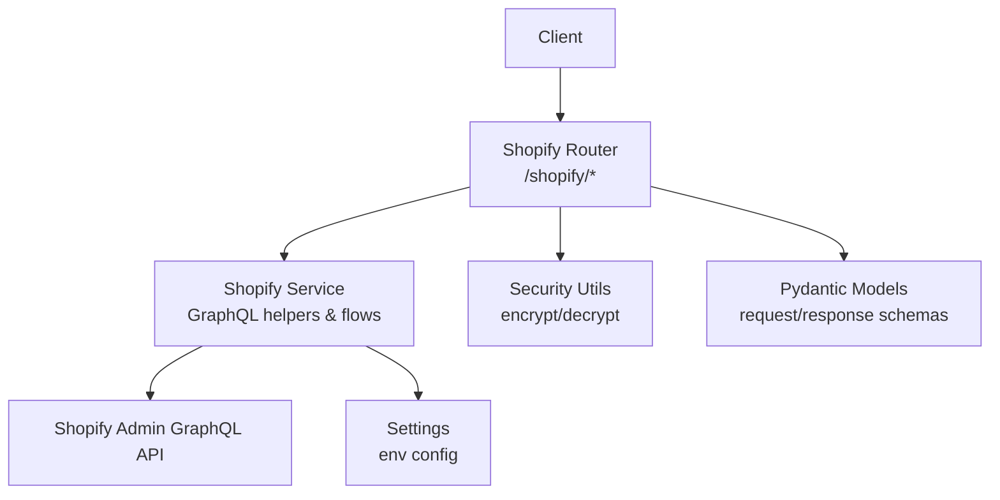
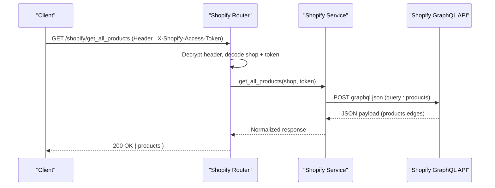
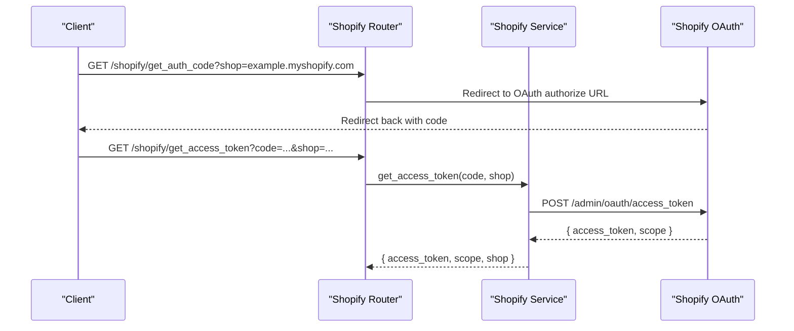
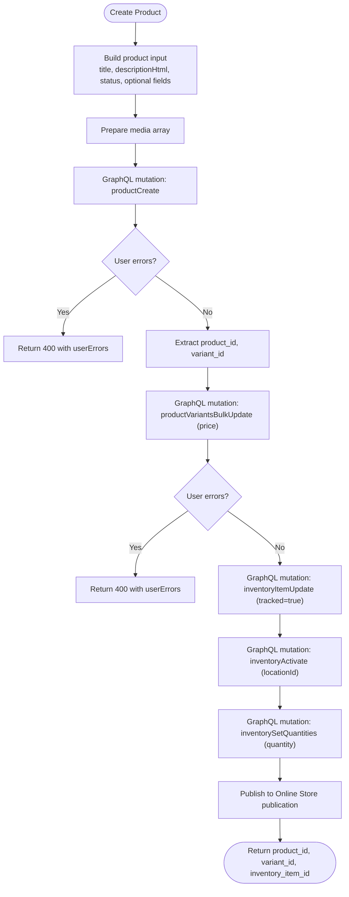
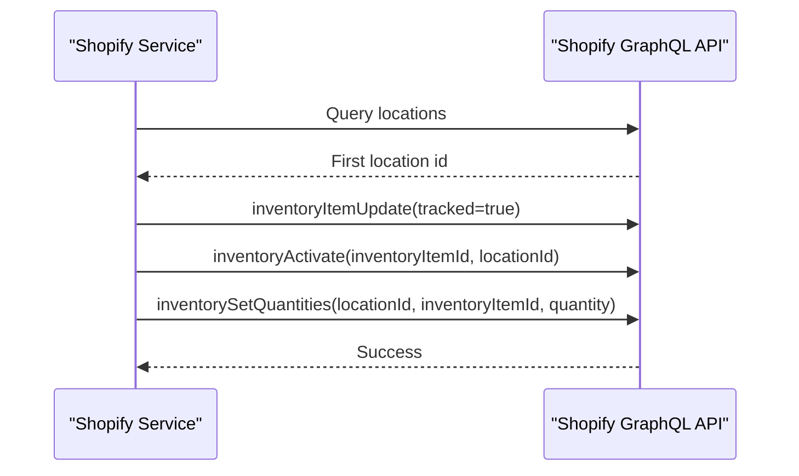
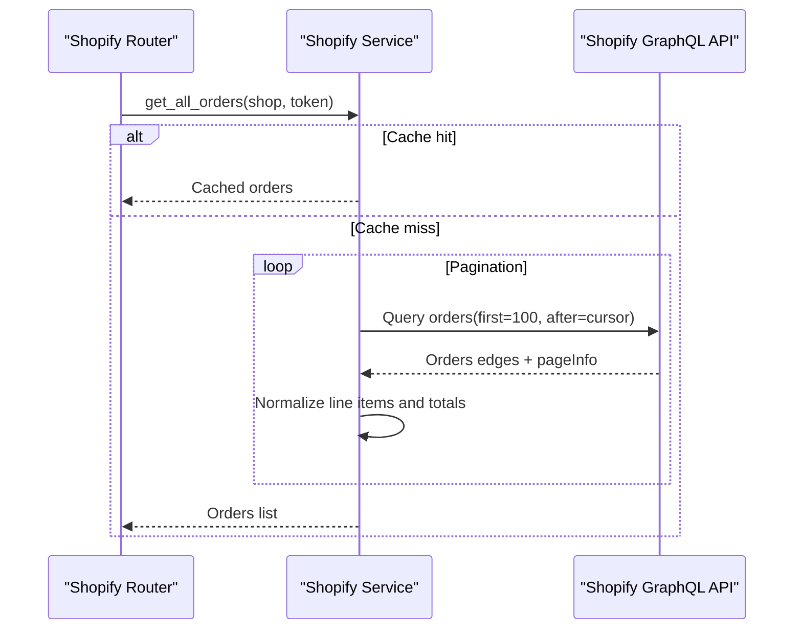
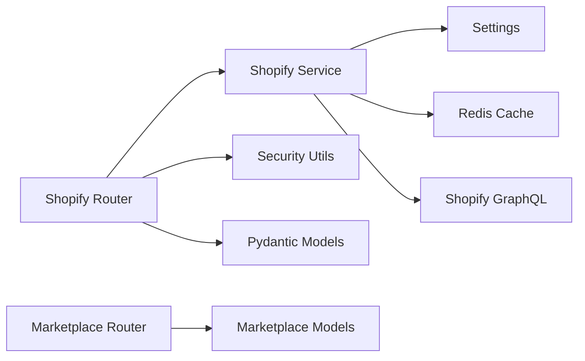

# Shopify Integration API

<cite>
**Referenced Files in This Document**
- [main.py](file://neurocom_backend/main.py)
- [shopify_router.py](file://neurocom_backend/routers/shopify_router.py)
- [shopify_service.py](file://neurocom_backend/services/shopify_service.py)
- [shopify_model.py](file://neurocom_backend/models/shopify_model.py)
- [security.py](file://neurocom_backend/utils/security.py)
- [settings.py](file://neurocom_backend/utils/settings.py)
- [marketplace_router.py](file://neurocom_backend/routers/marketplace_router.py)
- [marketplace.py](file://neurocom_backend/database/models/marketplace.py)
</cite>

## Table of Contents
1. [Introduction](#introduction)
2. [Project Structure](#project-structure)
3. [Core Components](#core-components)
4. [Architecture Overview](#architecture-overview)
5. [Detailed Component Analysis](#detailed-component-analysis)
6. [Dependency Analysis](#dependency-analysis)
7. [Performance Considerations](#performance-considerations)
8. [Troubleshooting Guide](#troubleshooting-guide)
9. [Conclusion](#conclusion)
10. [Appendices](#appendices)

## Introduction
This document provides detailed API documentation for the Shopify marketplace integration endpoints exposed by the backend. It covers store connection setup, product synchronization workflows, inventory management, and order processing capabilities using GraphQL APIs to Shopify. It also documents data transformation between local models and Shopify’s structures, error handling strategies for Shopify API limitations, and common integration scenarios with troubleshooting guidance.

## Project Structure
The Shopify integration is implemented as a FastAPI router that delegates to a service layer which communicates with Shopify via GraphQL. Models define request/response schemas used across the API. Security utilities encrypt/decrypt credentials passed through headers, and settings provide environment-driven configuration.

**Diagram sources**
- [shopify_router.py:36-142](file://neurocom_backend/routers/shopify_router.py#L36-L142)
- [shopify_service.py:37-68](file://neurocom_backend/services/shopify_service.py#L37-L68)
- [security.py:31-43](file://neurocom_backend/utils/security.py#L31-L43)
- [settings.py:21-25](file://neurocom_backend/utils/settings.py#L21-L25)
- [shopify_model.py:1-133](file://neurocom_backend/models/shopify_model.py#L1-L133)

**Section sources**
- [main.py:78-89](file://neurocom_backend/main.py#L78-L89)
- [shopify_router.py:36-142](file://neurocom_backend/routers/shopify_router.py#L36-L142)

## Core Components
- Store Connection Setup
  - OAuth authorization code flow to obtain an access token for a specific shop.
  - Encrypted credential storage and retrieval via header-based authentication.
- Product Synchronization
  - Fetch all products or a single product by ID.
  - Create new products with media, variants, categories, and collections.
  - Publish products to the Online Store sales channel.
- Inventory Management
  - Enable inventory tracking, activate inventory at a location, and set quantities.
- Order Processing
  - Retrieve all orders with pagination and transform line items and pricing.
- Categories and Collections
  - List taxonomy categories and subcategories; list product collections.

**Section sources**
- [shopify_router.py:69-142](file://neurocom_backend/routers/shopify_router.py#L69-L142)
- [shopify_service.py:87-121](file://neurocom_backend/services/shopify_service.py#L87-L121)
- [shopify_service.py:168-230](file://neurocom_backend/services/shopify_service.py#L168-L230)
- [shopify_service.py:233-263](file://neurocom_backend/services/shopify_service.py#L233-L263)
- [shopify_service.py:329-469](file://neurocom_backend/services/shopify_service.py#L329-L469)
- [shopify_service.py:472-575](file://neurocom_backend/services/shopify_service.py#L472-L575)
- [shopify_service.py:578-688](file://neurocom_backend/services/shopify_service.py#L578-L688)

## Architecture Overview
The integration uses a layered architecture:
- Router Layer: Exposes REST endpoints under /shopify, validates inputs, and enforces authentication via encrypted access tokens in headers.
- Service Layer: Implements business logic, including GraphQL queries/mutations, caching, and data normalization.
- Data Models: Pydantic models enforce schema validation for requests and responses.
- Security: Encrypts/decrypts credentials and manages JWT-based user sessions elsewhere in the app.
- Configuration: Environment variables control API keys, scopes, cache TTL, and other runtime behavior.

**Diagram sources**
- [shopify_router.py:92-96](file://neurocom_backend/routers/shopify_router.py#L92-L96)
- [shopify_service.py:41-68](file://neurocom_backend/services/shopify_service.py#L41-L68)
- [shopify_service.py:168-230](file://neurocom_backend/services/shopify_service.py#L168-L230)

## Detailed Component Analysis

### Store Connection and Authentication
- Authorization Code Flow
  - Redirect to Shopify OAuth authorize endpoint with configured client_id, scope, and redirect_uri.
  - Exchange authorization code for access_token via /admin/oauth/access_token.
- Header-Based Access
  - Endpoints require an encrypted access token in the X-Shopify-Access-Token header.
  - The router decrypts the header value and decodes it into shop domain and access token.
- Scopes
  - Default scopes include read/write products, read/write inventory, read/write publications, and read orders.

**Diagram sources**
- [shopify_router.py:69-89](file://neurocom_backend/routers/shopify_router.py#L69-L89)
- [shopify_service.py:87-121](file://neurocom_backend/services/shopify_service.py#L87-L121)

**Section sources**
- [shopify_router.py:44-61](file://neurocom_backend/routers/shopify_router.py#L44-L61)
- [shopify_router.py:69-89](file://neurocom_backend/routers/shopify_router.py#L69-L89)
- [shopify_service.py:21-34](file://neurocom_backend/services/shopify_service.py#L21-L34)
- [security.py:31-43](file://neurocom_backend/utils/security.py#L31-L43)
- [settings.py:21-25](file://neurocom_backend/utils/settings.py#L21-L25)

### Product Synchronization
- Get All Products
  - Paginates over products using cursor-based pagination and flattens images and variants into a normalized structure.
  - Uses Redis-backed caching keyed by fingerprinted access token and shop domain.
- Get Product By ID
  - Retrieves a single product by its GraphQL ID and normalizes fields.
- Create New Product
  - Creates product with optional vendor, tags, collections, category, and media.
  - Sets variant price, enables inventory tracking, activates inventory at a location, sets initial quantity, and publishes to Online Store.

**Diagram sources**
- [shopify_service.py:329-469](file://neurocom_backend/services/shopify_service.py#L329-L469)

**Section sources**
- [shopify_router.py:92-112](file://neurocom_backend/routers/shopify_router.py#L92-L112)
- [shopify_service.py:168-230](file://neurocom_backend/services/shopify_service.py#L168-L230)
- [shopify_service.py:233-263](file://neurocom_backend/services/shopify_service.py#L233-L263)
- [shopify_service.py:329-469](file://neurocom_backend/services/shopify_service.py#L329-L469)
- [shopify_model.py:117-133](file://neurocom_backend/models/shopify_model.py#L117-L133)

### Inventory Management
- Location Discovery
  - Queries locations and selects the first available location ID for inventory operations.
- Tracking and Activation
  - Enables inventory tracking on the inventory item and activates it at the chosen location.
- Quantity Setting
  - Sets inventory quantities using a correction reason and ignores compare quantity to force the provided amount.

**Diagram sources**
- [shopify_service.py:265-280](file://neurocom_backend/services/shopify_service.py#L265-L280)
- [shopify_service.py:402-459](file://neurocom_backend/services/shopify_service.py#L402-L459)

**Section sources**
- [shopify_service.py:265-280](file://neurocom_backend/services/shopify_service.py#L265-L280)
- [shopify_service.py:402-459](file://neurocom_backend/services/shopify_service.py#L402-L459)

### Order Processing
- Retrieve All Orders
  - Paginates orders sorted by creation date in reverse, extracting line items and money details.
  - Normalizes total price and currency from nested money objects.
  - Uses cached results based on access token fingerprint and shop domain.

**Diagram sources**
- [shopify_router.py:115-119](file://neurocom_backend/routers/shopify_router.py#L115-L119)
- [shopify_service.py:472-575](file://neurocom_backend/services/shopify_service.py#L472-L575)

**Section sources**
- [shopify_router.py:115-119](file://neurocom_backend/routers/shopify_router.py#L115-L119)
- [shopify_service.py:472-575](file://neurocom_backend/services/shopify_service.py#L472-L575)

### Categories and Collections
- Taxonomy Categories
  - Lists top-level categories with pagination and supports fetching subcategories by parent ID.
- Collections
  - Lists product collections with optional image source.

**Section sources**
- [shopify_router.py:122-141](file://neurocom_backend/routers/shopify_router.py#L122-L141)
- [shopify_service.py:578-688](file://neurocom_backend/services/shopify_service.py#L578-L688)

### Data Transformation and Models
- Product Model
  - Includes identifiers, metadata, images, variants, and optional storefront URL derived from onlineStoreUrl or handle.
- Order Model
  - Captures order identifiers, timestamps, statuses, customer info, line items, and monetary totals.
- Category and Collection Models
  - Represent taxonomy categories and collection metadata.

**Section sources**
- [shopify_model.py:5-69](file://neurocom_backend/models/shopify_model.py#L5-L69)
- [shopify_model.py:71-115](file://neurocom_backend/models/shopify_model.py#L71-L115)
- [shopify_service.py:134-165](file://neurocom_backend/services/shopify_service.py#L134-L165)

## Dependency Analysis
- Router depends on:
  - Services for business logic and Shopify communication.
  - Security utilities to decrypt credentials from headers.
  - Pydantic models for request/response validation.
- Service depends on:
  - Settings for environment variables (API keys, scopes, cache TTL).
  - Redis caching utilities for performance.
  - Requests library to call Shopify GraphQL endpoints.
- Marketplace integration:
  - Marketplace router exposes endpoints to connect/disconnect marketplaces and publish to connected stores.
  - MarketplaceConnection model stores encrypted access tokens per merchant and store identifier.

**Diagram sources**
- [shopify_router.py:11-32](file://neurocom_backend/routers/shopify_router.py#L11-L32)
- [shopify_service.py:1-25](file://neurocom_backend/services/shopify_service.py#L1-L25)
- [marketplace_router.py:1-30](file://neurocom_backend/routers/marketplace_router.py#L1-L30)
- [marketplace.py:17-41](file://neurocom_backend/database/models/marketplace.py#L17-L41)

**Section sources**
- [shopify_router.py:11-32](file://neurocom_backend/routers/shopify_router.py#L11-L32)
- [shopify_service.py:1-25](file://neurocom_backend/services/shopify_service.py#L1-L25)
- [marketplace_router.py:1-30](file://neurocom_backend/routers/marketplace_router.py#L1-L30)
- [marketplace.py:17-41](file://neurocom_backend/database/models/marketplace.py#L17-L41)

## Performance Considerations
- Caching
  - Product and order lists are cached using Redis with TTL configured via environment variable. Cache keys incorporate a fingerprint of the access token and normalized shop domain to ensure isolation per merchant/store.
- Pagination
  - All bulk reads use cursor-based pagination to minimize payload sizes and reduce rate limit pressure.
- Request Batching
  - Product creation batches variant updates and inventory activation to reduce round trips.
- Timeouts
  - GraphQL requests use explicit timeouts to avoid hanging connections.

[No sources needed since this section provides general guidance]

## Troubleshooting Guide
Common issues and resolutions:
- Missing or invalid encrypted credentials
  - Symptom: 400 Bad Request with “Invalid encrypted Shopify credentials”.
  - Cause: Malformed or tampered header value; decryption fails.
  - Resolution: Ensure the X-Shopify-Access-Token header contains a properly encrypted JSON payload with shop and access_token.
- Unauthorized access
  - Symptom: 401 Unauthorized when header is missing.
  - Resolution: Provide the encrypted access token header.
- OAuth exchange failures
  - Symptom: 400 Bad Request during access token exchange.
  - Cause: Invalid client credentials or expired authorization code.
  - Resolution: Verify SHOPIFY_API_KEY and SHOPIFY_API_SECRET and re-initiate the OAuth flow.
- GraphQL errors
  - Symptom: 400 Bad Request with shopify_errors or userErrors.
  - Cause: Validation errors in mutations or queries.
  - Resolution: Inspect the returned userErrors to correct input fields.
- No locations found
  - Symptom: 400 Bad Request “No Shopify locations found for this store”.
  - Cause: Store has no configured locations.
  - Resolution: Configure at least one location in Shopify admin before creating products with inventory.
- Online Store publication not found
  - Symptom: 404 Not Found “Online Store publication not found”.
  - Cause: Missing or misconfigured Online Store sales channel.
  - Resolution: Ensure the Online Store publication exists and is enabled for the shop.

**Section sources**
- [shopify_router.py:44-61](file://neurocom_backend/routers/shopify_router.py#L44-L61)
- [shopify_service.py:56-68](file://neurocom_backend/services/shopify_service.py#L56-L68)
- [shopify_service.py:87-121](file://neurocom_backend/services/shopify_service.py#L87-L121)
- [shopify_service.py:265-280](file://neurocom_backend/services/shopify_service.py#L265-L280)
- [shopify_service.py:283-305](file://neurocom_backend/services/shopify_service.py#L283-L305)

## Conclusion
The Shopify integration provides a robust, secure, and efficient interface for connecting stores, synchronizing products, managing inventory, and retrieving orders via GraphQL. It leverages caching and pagination to handle large datasets while enforcing strict schema validation and error handling. For real-time event processing, consider extending the service layer with webhook handlers that consume Shopify webhooks and update local state accordingly.

[No sources needed since this section summarizes without analyzing specific files]

## Appendices

### API Endpoints Summary
- Store Connection
  - GET /shopify/get_auth_code?shop={domain}
  - GET /shopify/get_access_token?code={code}&shop={domain}
- Products
  - GET /shopify/get_all_products
  - GET /shopify/get_product_by_id?product_id={id}
  - POST /shopify/create_new_product
- Orders
  - GET /shopify/get_all_orders
- Categories and Collections
  - GET /shopify/get_all_categories
  - GET /shopify/get_subcategories/{category_id}
  - GET /shopify/get_all_collections

Authentication:
- Include header: X-Shopify-Access-Token: <encrypted_json>{"shop":"example.myshopify.com","access_token":"token"}>

Environment Variables:
- SHOPIFY_API_KEY, SHOPIFY_API_SECRET, SHOPIFY_SCOPES, SHOPIFY_CACHE_TTL_SECONDS, SECRET_KEY

**Section sources**
- [shopify_router.py:69-142](file://neurocom_backend/routers/shopify_router.py#L69-L142)
- [settings.py:21-25](file://neurocom_backend/utils/settings.py#L21-L25)
- [security.py:31-43](file://neurocom_backend/utils/security.py#L31-L43)