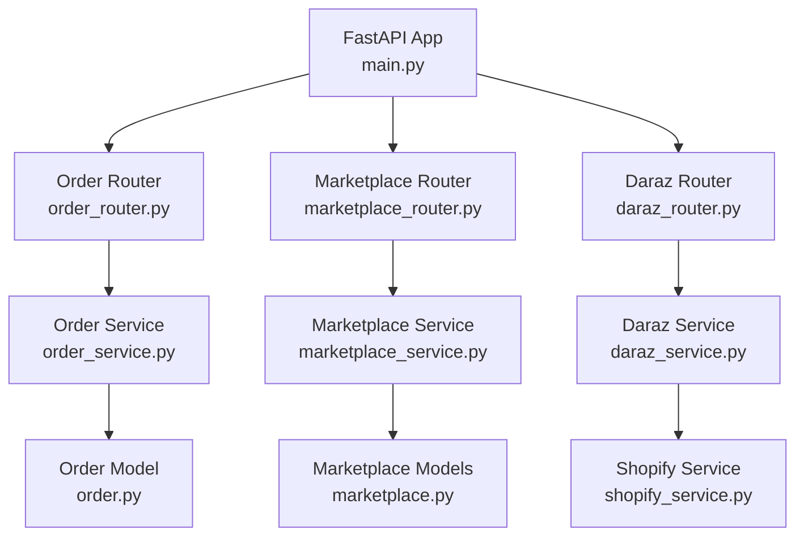
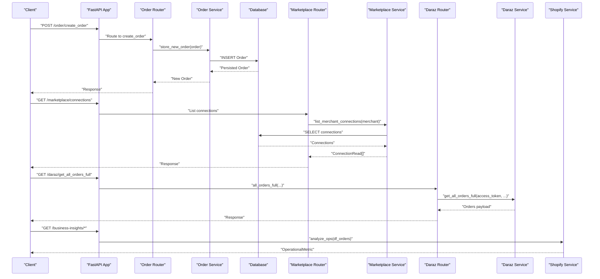
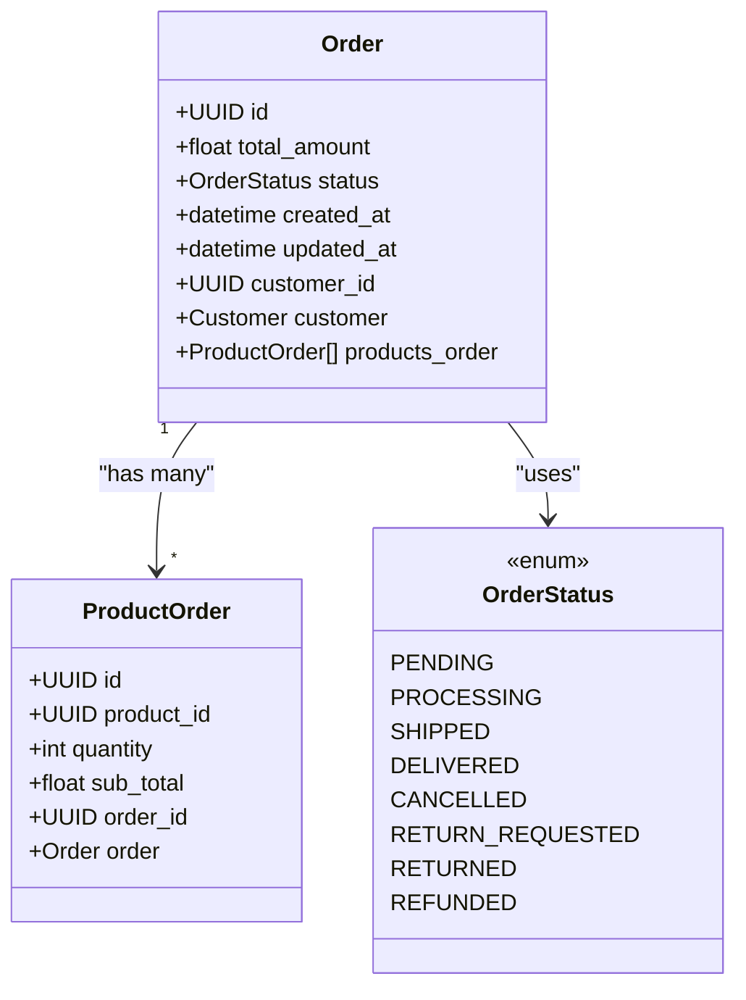
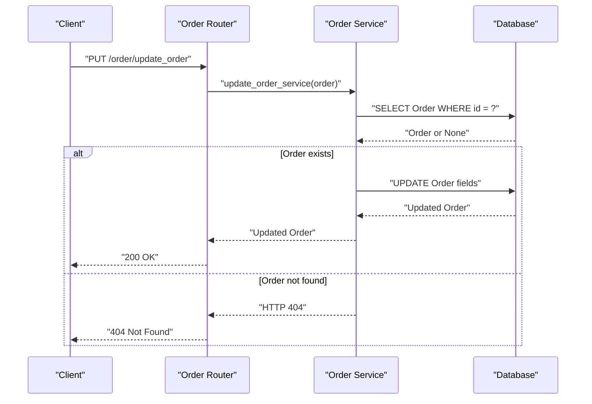
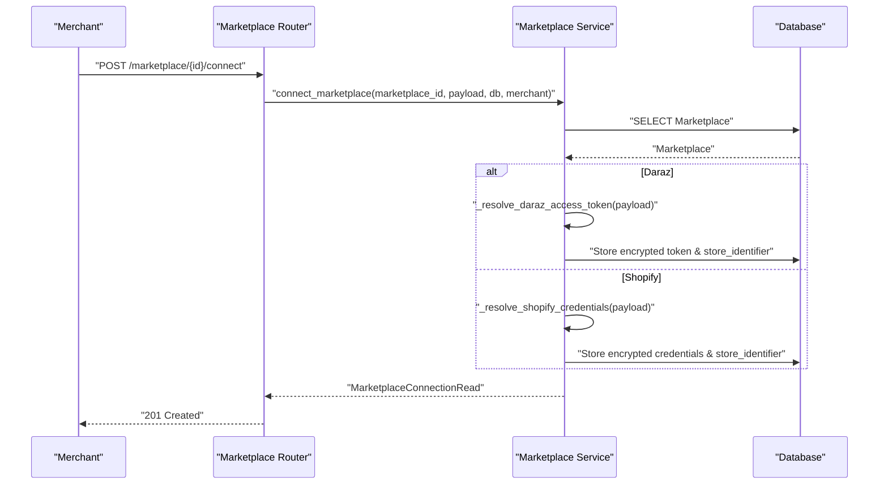
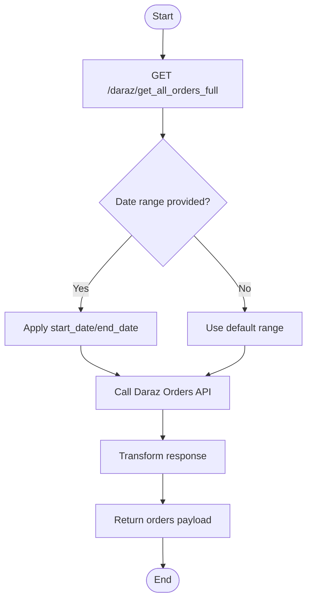
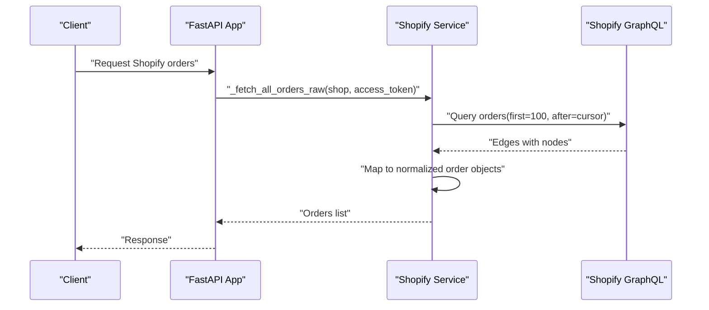
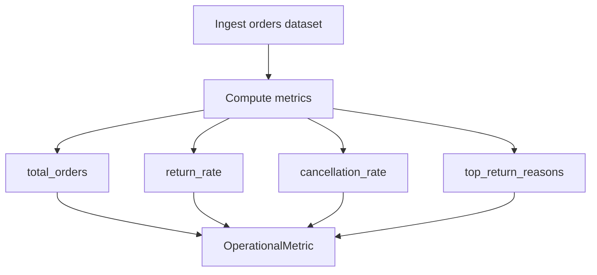
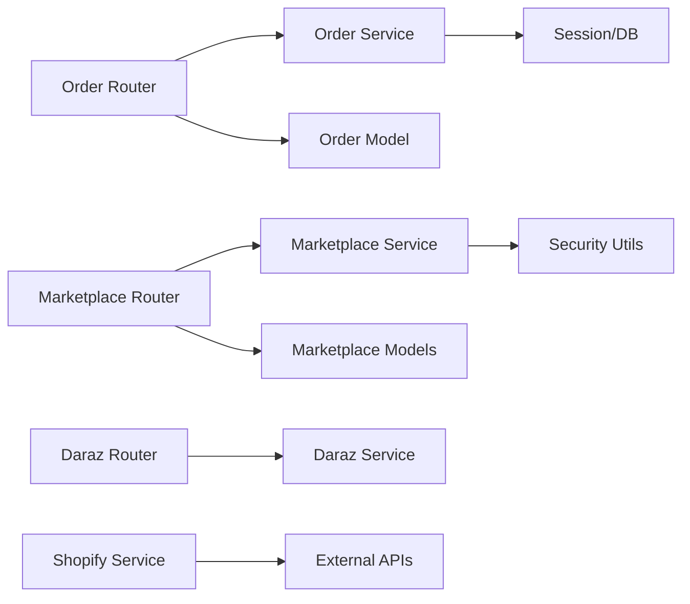

# Order Processing API

<cite>
**Referenced Files in This Document**
- [main.py](file://neurocom_backend/main.py)
- [order_router.py](file://neurocom_backend/routers/order_router.py)
- [order_service.py](file://neurocom_backend/services/order_service.py)
- [order.py](file://neurocom_backend/database/models/order.py)
- [marketplace_router.py](file://neurocom_backend/routers/marketplace_router.py)
- [marketplace_service.py](file://neurocom_backend/services/marketplace_service.py)
- [marketplace.py](file://neurocom_backend/database/models/marketplace.py)
- [daraz_router.py](file://neurocom_backend/routers/daraz_router.py)
- [daraz_service.py](file://neurocom_backend/services/daraz_service.py)
- [shopify_service.py](file://neurocom_backend/services/shopify_service.py)
- [insights.service.py](file://neurocom_backend/services/insights.service.py)
</cite>

## Table of Contents
1. Introduction
2. Project Structure
3. Core Components
4. Architecture Overview
5. Detailed Component Analysis
6. Dependency Analysis
7. Performance Considerations
8. Troubleshooting Guide
9. Conclusion

## Introduction
This document provides comprehensive API documentation for order processing endpoints, including order synchronization with marketplaces (Daraz and Shopify), order status management, return processing workflows, and order analytics. It covers data models, status transitions, webhook-like integrations via marketplace connectors, error handling patterns, and examples of end-to-end order lifecycle and return flows.

## Project Structure
The order processing system is organized into:
- Routers: HTTP endpoints for orders and marketplace integrations
- Services: Business logic for order operations, marketplace connections, and external integrations
- Database Models: SQLModel definitions for orders, product-line items, marketplaces, and merchant connections
- Main Application: FastAPI app configuration and router inclusion

**Diagram sources**
- [main.py:1-90](file://neurocom_backend/main.py#L1-L90)
- [order_router.py:1-39](file://neurocom_backend/routers/order_router.py#L1-L39)
- [marketplace_router.py:1-118](file://neurocom_backend/routers/marketplace_router.py#L1-L118)
- [daraz_router.py:1-349](file://neurocom_backend/routers/daraz_router.py#L1-L349)
- [order_service.py:1-46](file://neurocom_backend/services/order_service.py#L1-L46)
- [marketplace_service.py:1-302](file://neurocom_backend/services/marketplace_service.py#L1-L302)
- [daraz_service.py:1-800](file://neurocom_backend/services/daraz_service.py#L1-L800)
- [shopify_service.py:472-552](file://neurocom_backend/services/shopify_service.py#L472-L552)
- [order.py:1-39](file://neurocom_backend/database/models/order.py#L1-L39)
- [marketplace.py:1-105](file://neurocom_backend/database/models/marketplace.py#L1-L105)

**Section sources**
- [main.py:1-90](file://neurocom_backend/main.py#L1-L90)

## Core Components
- Order CRUD endpoints: create, update, get by ID, list by customer, delete
- Marketplace connection management: connect/disconnect supported marketplaces (Daraz, Shopify)
- Daraz integration: order retrieval, returns insights, reverse orders, logistics details
- Shopify integration: order fetching via GraphQL
- Analytics: operational metrics including return rates and cancellation rates

Key responsibilities:
- Routers expose REST endpoints and enforce authentication where required
- Services implement business logic and orchestrate database and external API calls
- Models define persistent entities and request/response schemas

**Section sources**
- [order_router.py:1-39](file://neurocom_backend/routers/order_router.py#L1-L39)
- [order_service.py:1-46](file://neurocom_backend/services/order_service.py#L1-L46)
- [order.py:1-39](file://neurocom_backend/database/models/order.py#L1-L39)
- [marketplace_router.py:1-118](file://neurocom_backend/routers/marketplace_router.py#L1-L118)
- [marketplace_service.py:1-302](file://neurocom_backend/services/marketplace_service.py#L1-L302)
- [marketplace.py:1-105](file://neurocom_backend/database/models/marketplace.py#L1-L105)
- [daraz_router.py:1-349](file://neurocom_backend/routers/daraz_router.py#L1-L349)
- [daraz_service.py:1-800](file://neurocom_backend/services/daraz_service.py#L1-L800)
- [shopify_service.py:472-552](file://neurocom_backend/services/shopify_service.py#L472-L552)
- [insights.service.py:1-183](file://neurocom_backend/services/insights.service.py#L1-L183)

## Architecture Overview
The system integrates internal order management with marketplace platforms:
- Internal orders are persisted via SQLModel and exposed through the order router
- Marketplaces are connected using encrypted tokens and store identifiers
- Daraz and Shopify services fetch orders and related data to support synchronization and analytics
- Insights service computes operational metrics from order datasets

**Diagram sources**
- [order_router.py:16-24](file://neurocom_backend/routers/order_router.py#L16-L24)
- [order_service.py:9-26](file://neurocom_backend/services/order_service.py#L9-L26)
- [marketplace_router.py:60-65](file://neurocom_backend/routers/marketplace_router.py#L60-L65)
- [marketplace_service.py:283-289](file://neurocom_backend/services/marketplace_service.py#L283-L289)
- [daraz_router.py:254-261](file://neurocom_backend/routers/daraz_router.py#L254-L261)
- [daraz_service.py:1348-1372](file://neurocom_backend/services/daraz_service.py#L1348-L1372)
- [shopify_service.py:472-552](file://neurocom_backend/services/shopify_service.py#L472-L552)
- [insights.service.py:124-137](file://neurocom_backend/services/insights.service.py#L124-L137)

## Detailed Component Analysis

### Order Data Model and Status Transitions
- Order entity includes id, total_amount, status, timestamps, customer_id, and a relationship to ProductOrder line items
- OrderStatus enum defines lifecycle states: pending, processing, shipped, delivered, cancelled, return_requested, returned, refunded
- ProductOrder links products to orders with quantity and sub_total

**Diagram sources**
- [order.py:11-39](file://neurocom_backend/database/models/order.py#L11-L39)

**Section sources**
- [order.py:11-39](file://neurocom_backend/database/models/order.py#L11-L39)

### Order Endpoints (CRUD)
- POST /order/create_order: creates a new order record
- PUT /order/update_order: updates total_amount, status, and products_order; sets updated_at
- GET /order/get_customer_orders?customer_id={uuid}: lists orders for a customer
- GET /order/get_order/{order_id}: retrieves a single order
- DELETE /order/delete_order/{order_id}: deletes an order

Error handling:
- 404 Not Found when order does not exist during update, delete, or get by ID

**Diagram sources**
- [order_router.py:21-24](file://neurocom_backend/routers/order_router.py#L21-L24)
- [order_service.py:16-26](file://neurocom_backend/services/order_service.py#L16-L26)

**Section sources**
- [order_router.py:16-39](file://neurocom_backend/routers/order_router.py#L16-L39)
- [order_service.py:9-46](file://neurocom_backend/services/order_service.py#L9-L46)

### Marketplace Connections and Synchronization
- Connect marketplace endpoints manage encrypted access tokens and store identifiers for Daraz and Shopify
- Listing connections shows active integrations per merchant
- Publishing endpoint supports pushing products to connected stores

**Diagram sources**
- [marketplace_router.py:105-117](file://neurocom_backend/routers/marketplace_router.py#L105-L117)
- [marketplace_service.py:236-280](file://neurocom_backend/services/marketplace_service.py#L236-L280)
- [marketplace.py:26-40](file://neurocom_backend/database/models/marketplace.py#L26-L40)

**Section sources**
- [marketplace_router.py:36-117](file://neurocom_backend/routers/marketplace_router.py#L36-L117)
- [marketplace_service.py:99-161](file://neurocom_backend/services/marketplace_service.py#L99-L161)
- [marketplace_service.py:178-280](file://neurocom_backend/services/marketplace_service.py#L178-L280)
- [marketplace.py:17-40](file://neurocom_backend/database/models/marketplace.py#L17-L40)

### Daraz Order Retrieval and Returns Insights
- Retrieve all orders or full order details with date filters
- Fetch orders with items for analytics
- Trace order and logistics details
- Reverse orders info and history for returns
- Returns insights with streaming support

**Diagram sources**
- [daraz_router.py:254-261](file://neurocom_backend/routers/daraz_router.py#L254-L261)
- [daraz_service.py:1348-1372](file://neurocom_backend/services/daraz_service.py#L1348-L1372)

**Section sources**
- [daraz_router.py:250-329](file://neurocom_backend/routers/daraz_router.py#L250-L329)
- [daraz_service.py:1348-1430](file://neurocom_backend/services/daraz_service.py#L1348-L1430)

### Shopify Order Fetching
- Uses GraphQL to paginate orders and extract key fields including totals, line items, and statuses

**Diagram sources**
- [shopify_service.py:472-552](file://neurocom_backend/services/shopify_service.py#L472-L552)

**Section sources**
- [shopify_service.py:472-552](file://neurocom_backend/services/shopify_service.py#L472-L552)

### Order Analytics and Operational Metrics
- Insights service computes profitability, operational metrics, dead stock, and SLA alerts
- Operational metric includes total orders, return rate, cancellation rate, and top return reasons

**Diagram sources**
- [insights.service.py:124-137](file://neurocom_backend/services/insights.service.py#L124-L137)

**Section sources**
- [insights.service.py:10-44](file://neurocom_backend/services/insights.service.py#L10-L44)
- [insights.service.py:124-137](file://neurocom_backend/services/insights.service.py#L124-L137)

## Dependency Analysis
- Routers depend on services for business logic and on database sessions for persistence
- Services depend on models for schema validation and relationships
- Marketplace service depends on security utilities for encryption and platform-specific helpers
- Daraz and Shopify services integrate with external APIs and may use caching

**Diagram sources**
- [order_router.py:1-39](file://neurocom_backend/routers/order_router.py#L1-L39)
- [order_service.py:1-46](file://neurocom_backend/services/order_service.py#L1-L46)
- [order.py:1-39](file://neurocom_backend/database/models/order.py#L1-L39)
- [marketplace_router.py:1-118](file://neurocom_backend/routers/marketplace_router.py#L1-L118)
- [marketplace_service.py:1-302](file://neurocom_backend/services/marketplace_service.py#L1-L302)
- [marketplace.py:1-105](file://neurocom_backend/database/models/marketplace.py#L1-L105)
- [daraz_router.py:1-349](file://neurocom_backend/routers/daraz_router.py#L1-L349)
- [daraz_service.py:1-800](file://neurocom_backend/services/daraz_service.py#L1-L800)
- [shopify_service.py:472-552](file://neurocom_backend/services/shopify_service.py#L472-L552)

**Section sources**
- [order_router.py:1-39](file://neurocom_backend/routers/order_router.py#L1-L39)
- [marketplace_router.py:1-118](file://neurocom_backend/routers/marketplace_router.py#L1-L118)
- [daraz_router.py:1-349](file://neurocom_backend/routers/daraz_router.py#L1-L349)

## Performance Considerations
- Use pagination for large datasets (e.g., Shopify orders)
- Cache expensive external API responses where appropriate (e.g., Daraz products/reviews)
- Stream long-running analytics (e.g., returns insights) to improve responsiveness
- Minimize database round-trips by batching updates and leveraging indexes on frequently queried fields (e.g., order.id, customer_id)

[No sources needed since this section provides general guidance]

## Troubleshooting Guide
Common errors and handling:
- Order not found: 404 raised when updating, deleting, or retrieving non-existent orders
- Invalid encrypted token: 400 Bad Request for malformed or invalid encrypted access tokens
- Unauthorized/Forbidden: 401/403 when missing or invalid marketplace access tokens
- External API failures: 502 Bad Gateway when marketplace APIs return invalid responses or network errors
- Validation errors: 422 Unprocessable Entity for invalid payloads or missing required fields

Recommendations:
- Validate inputs at router boundaries
- Log detailed diagnostics for external API responses
- Implement retries with backoff for transient failures
- Provide clear error messages to clients

**Section sources**
- [order_service.py:16-42](file://neurocom_backend/services/order_service.py#L16-L42)
- [daraz_router.py:24-63](file://neurocom_backend/routers/daraz_router.py#L24-L63)
- [marketplace_service.py:74-97](file://neurocom_backend/services/marketplace_service.py#L74-L97)
- [daraz_service.py:254-265](file://neurocom_backend/services/daraz_service.py#L254-L265)

## Conclusion
The order processing API provides robust endpoints for managing orders, synchronizing with marketplaces, handling returns, and generating analytics. The architecture separates concerns across routers, services, and models, enabling maintainable and scalable functionality. Integrations with Daraz and Shopify allow comprehensive order lifecycle management and insights-driven decision-making.

[No sources needed since this section summarizes without analyzing specific files]