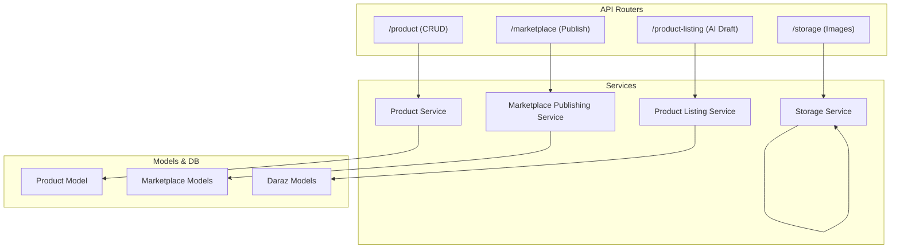
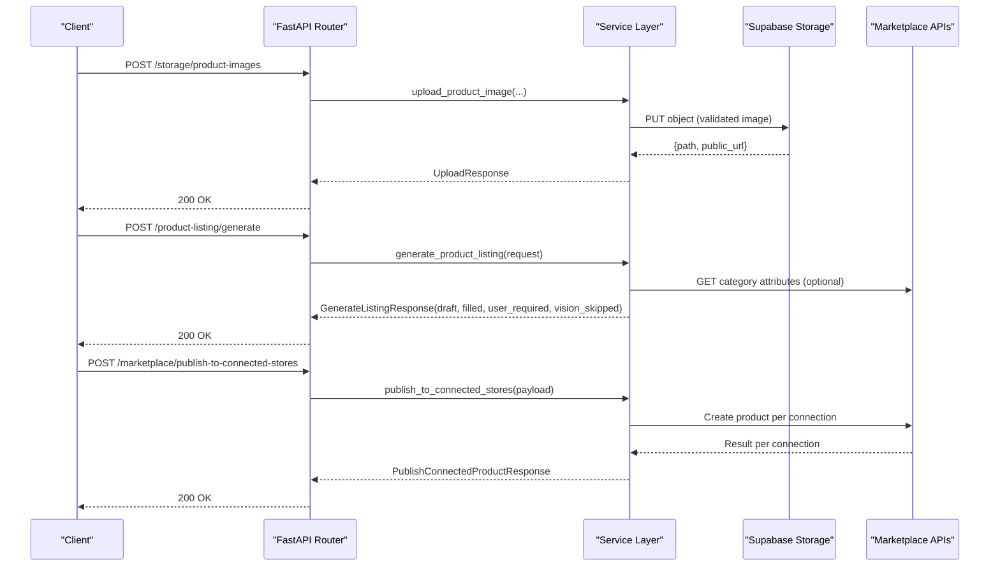
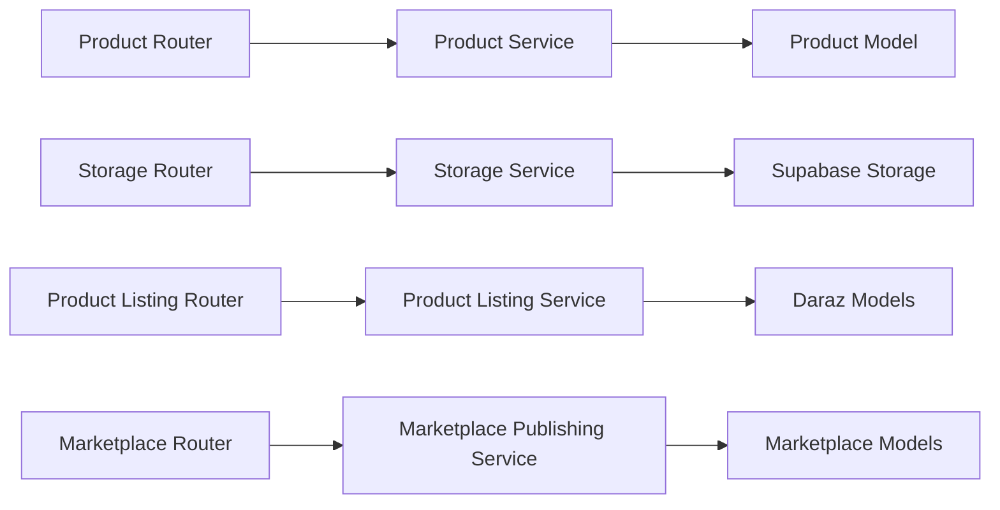

# Product Management API

<cite>
**Referenced Files in This Document**
- [product_router.py](file://neurocom_backend/routers/product_router.py)
- [product_service.py](file://neurocom_backend/services/product_service.py)
- [product.py](file://neurocom_backend/database/models/product.py)
- [storage_router.py](file://neurocom_backend/routers/storage_router.py)
- [storage_service.py](file://neurocom_backend/services/storage_service.py)
- [product_listing_model.py](file://neurocom_backend/models/product_listing_model.py)
- [product_listing_service.py](file://neurocom_backend/services/product_listing_service.py)
- [marketplace_router.py](file://neurocom_backend/routers/marketplace_router.py)
- [marketplace_publishing_service.py](file://neurocom_backend/services/marketplace_publishing_service.py)
- [marketplace.py](file://neurocom_backend/database/models/marketplace.py)
- [daraz_router.py](file://neurocom_backend/routers/daraz_router.py)
- [daraz_model.py](file://neurocom_backend/models/daraz_model.py)
</cite>

## Table of Contents
1. [Introduction](#introduction)
2. [Project Structure](#project-structure)
3. [Core Components](#core-components)
4. [Architecture Overview](#architecture-overview)
5. [Detailed Component Analysis](#detailed-component-analysis)
6. [Dependency Analysis](#dependency-analysis)
7. [Performance Considerations](#performance-considerations)
8. [Troubleshooting Guide](#troubleshooting-guide)
9. [Conclusion](#conclusion)
10. [Appendices](#appendices)

## Introduction
This document provides detailed API documentation for product management endpoints, including CRUD operations for products, image uploads, AI-assisted listing generation, and marketplace publishing workflows. It covers request/response schemas, file upload formats, category handling via Daraz attributes, and status tracking for listings.

## Project Structure
The product management functionality is implemented across routers (HTTP endpoints), services (business logic), models (data structures), and storage utilities:
- Product CRUD endpoints are exposed under /product.
- Image uploads and cleanup are handled under /storage.
- AI-driven listing generation from images and category attributes is available under /product-listing.
- Marketplace publishing to connected stores (Daraz, Shopify) is provided under /marketplace.

**Diagram sources**
- [product_router.py:1-38](file://neurocom_backend/routers/product_router.py#L1-L38)
- [storage_router.py:1-65](file://neurocom_backend/routers/storage_router.py#L1-L65)
- [product_listing_router.py:1-24](file://neurocom_backend/routers/product_listing_router.py#L1-L24)
- [marketplace_router.py:1-118](file://neurocom_backend/routers/marketplace_router.py#L1-L118)
- [product_service.py:1-47](file://neurocom_backend/services/product_service.py#L1-L47)
- [storage_service.py:1-142](file://neurocom_backend/services/storage_service.py#L1-L142)
- [product_listing_service.py:1-332](file://neurocom_backend/services/product_listing_service.py#L1-L332)
- [marketplace_publishing_service.py:1-64](file://neurocom_backend/services/marketplace_publishing_service.py#L1-L64)
- [product.py:1-21](file://neurocom_backend/database/models/product.py#L1-L21)
- [marketplace.py:1-105](file://neurocom_backend/database/models/marketplace.py#L1-L105)
- [daraz_model.py:1-460](file://neurocom_backend/models/daraz_model.py#L1-L460)

**Section sources**
- [product_router.py:1-38](file://neurocom_backend/routers/product_router.py#L1-L38)
- [storage_router.py:1-65](file://neurocom_backend/routers/storage_router.py#L1-L65)
- [product_listing_router.py:1-24](file://neurocom_backend/routers/product_listing_router.py#L1-L24)
- [marketplace_router.py:1-118](file://neurocom_backend/routers/marketplace_router.py#L1-L118)

## Core Components
- Product CRUD: Create, update, read, list, delete products stored in the database model.
- Image Uploads: Validate and store images to Supabase Storage with type and size checks; support cleanup.
- AI Listing Generation: Generate a draft listing from product images and category attributes using structured vision output.
- Marketplace Publishing: Publish products to connected stores (Daraz, Shopify) with per-connection success/failure reporting.

Key data models:
- Product: id, title, price, description, image, category.
- Listing Draft: Title, PrimaryCategory, Images, Attributes, Skus.
- Category Attribute: name, label, input_type, attribute_type, is_mandatory, options.

**Section sources**
- [product.py:13-21](file://neurocom_backend/database/models/product.py#L13-L21)
- [product_listing_model.py:12-56](file://neurocom_backend/models/product_listing_model.py#L12-L56)
- [daraz_model.py:55-79](file://neurocom_backend/models/daraz_model.py#L55-L79)

## Architecture Overview
The system exposes REST endpoints that delegate to services which interact with databases and external integrations:
- Product endpoints call product service functions to persist or retrieve product records.
- Storage endpoints validate uploaded files and use storage service to upload/clean images in Supabase.
- Product listing endpoint orchestrates attribute partitioning, optional LLM vision fill, and returns a structured draft aligned with marketplace create-product payloads.
- Marketplace publishing endpoint iterates merchant’s connected stores and publishes using platform-specific services.

**Diagram sources**
- [storage_router.py:46-65](file://neurocom_backend/routers/storage_router.py#L46-L65)
- [storage_service.py:46-75](file://neurocom_backend/services/storage_service.py#L46-L75)
- [product_listing_router.py:18-24](file://neurocom_backend/routers/product_listing_router.py#L18-L24)
- [product_listing_service.py:208-332](file://neurocom_backend/services/product_listing_service.py#L208-L332)
- [marketplace_router.py:36-43](file://neurocom_backend/routers/marketplace_router.py#L36-L43)
- [marketplace_publishing_service.py:34-64](file://neurocom_backend/services/marketplace_publishing_service.py#L34-L64)

## Detailed Component Analysis

### Product CRUD Endpoints
- Base path: /product
- Endpoints:
  - POST /product/create_product
  - PUT /product/update_product
  - GET /product/get_product/{product_id}
  - GET /product/get_products
  - DELETE /product/delete_product/{product_id}

Request/Response Schemas:
- Product (request body):
  - Fields: title (string, min length 3), price (float), description (string), image (string), category (string).
  - Example usage: Create a new product by sending a JSON object with these fields.
- Responses:
  - Create/Update/Delete/Get return wrapped objects containing the persisted product(s).

Error Handling:
- Update/Delete/Get raise 404 when product not found.

Notes:
- The current implementation persists a single image URL field; multiple images can be managed via storage endpoints and referenced by URLs.

**Section sources**
- [product_router.py:15-38](file://neurocom_backend/routers/product_router.py#L15-L38)
- [product_service.py:9-47](file://neurocom_backend/services/product_service.py#L9-L47)
- [product.py:13-21](file://neurocom_backend/database/models/product.py#L13-L21)

### Image Upload and Cleanup
- Base path: /storage
- Endpoints:
  - POST /storage/product-images
  - POST /storage/product-images/cleanup

Upload Request:
- Form fields:
  - file: binary image file
  - marketplace: literal string "daraz" or "shopify"
- Validation:
  - Allowed types: JPEG, PNG, WebP
  - Max size: 5 MB
  - Content signature verification ensures valid image content
  - Requires active marketplace connection for the authenticated merchant

Upload Response:
- Fields: path (string), public_url (HTTPS), content_type (string), size (integer)

Cleanup Request:
- Body: paths (list of strings) — must belong to the authenticated merchant

Cleanup Response:
- deleted (list of strings) — confirmed paths removed

Error Handling:
- 409 if no active marketplace connection
- 415 unsupported image type
- 400 empty or invalid image content
- 413 file exceeds limit
- 502 storage connectivity failures

**Section sources**
- [storage_router.py:17-65](file://neurocom_backend/routers/storage_router.py#L17-L65)
- [storage_service.py:15-75](file://neurocom_backend/services/storage_service.py#L15-L75)
- [storage_service.py:128-142](file://neurocom_backend/services/storage_service.py#L128-L142)

### AI-Assisted Product Listing Generation
- Base path: /product-listing
- Endpoint:
  - POST /product-listing/generate

Request Schema:
- primary_category_id (integer)
- image_urls (list of HTTP URLs, minimum 1)
- attributes (list of CategoryAttribute definitions)
- title_hint (optional string)
- brand_hint (optional string)

Processing Logic:
- Partition attributes into:
  - User-owned fields (e.g., SellerSku, price, quantity, package dimensions)
  - Auto-filled mandatory enums (single-option values)
  - Vision candidates (LLM may infer values from images)
- Run structured vision to propose title and candidate attribute values with confidence scores
- Post-validate option matches against allowed values
- Build a draft aligned with marketplace create-product payload shape

Response Schema:
- draft:
  - Title (string)
  - PrimaryCategory (integer)
  - Images (list of strings)
  - Attributes (map of attribute names to values)
  - Skus (list of SKU drafts with sale props and images)
- filled (list of FilledAttribute entries indicating source and confidence)
- user_required (list of attribute names requiring seller input)
- vision_skipped (list of attributes not inferred)

Usage Notes:
- Use this endpoint to pre-fill listing forms before publishing to marketplaces.
- Combine with category attributes retrieval to ensure correct field sets.

**Section sources**
- [product_listing_router.py:18-24](file://neurocom_backend/routers/product_listing_router.py#L18-L24)
- [product_listing_model.py:12-56](file://neurocom_backend/models/product_listing_model.py#L12-L56)
- [product_listing_service.py:108-332](file://neurocom_backend/services/product_listing_service.py#L108-L332)

### Marketplace Publishing Workflow
- Base path: /marketplace
- Endpoint:
  - POST /marketplace/publish-to-connected-stores

Request Schema:
- shopify (optional object validated against Shopify product schema)
- daraz (optional dict validated against Daraz product create schema)

Behavior:
- Iterates over all marketplace connections for the authenticated merchant
- For each connection:
  - If Shopify: decode credentials and call Shopify create product
  - If Daraz: decrypt access token and call Daraz create product
  - Capture success/failure and error messages per connection

Response Schema:
- results (list of ConnectedStorePublishResult):
  - connection_id, marketplace_id, marketplace slug, store_identifier
  - success (boolean), result (platform response), error (message on failure)
- succeeded (integer count)
- failed (integer count)

Status Tracking:
- Per-connection success indicates whether the marketplace accepted the product creation
- Errors include missing credentials, platform validation failures, or unexpected exceptions

**Section sources**
- [marketplace_router.py:36-43](file://neurocom_backend/routers/marketplace_router.py#L36-L43)
- [marketplace_publishing_service.py:34-64](file://neurocom_backend/services/marketplace_publishing_service.py#L34-L64)
- [marketplace.py:86-105](file://neurocom_backend/database/models/marketplace.py#L86-L105)

### Category Handling and Attributes
- Category attributes define required fields, input types, and allowed options for a given primary category.
- Retrieve attributes via Daraz endpoints and pass them to the listing generation endpoint to constrain inference.
- Attributes include:
  - name, label, input_type, attribute_type (product vs SKU level)
  - is_mandatory flag
  - options list for enumerated fields

Integration Points:
- Listing generation uses attributes to auto-fill mandatory single-option enums and to guide vision inference.
- Published products must conform to attribute constraints enforced by marketplace APIs.

**Section sources**
- [daraz_router.py:139-159](file://neurocom_backend/routers/daraz_router.py#L139-L159)
- [daraz_model.py:55-79](file://neurocom_backend/models/daraz_model.py#L55-L79)
- [product_listing_service.py:108-146](file://neurocom_backend/services/product_listing_service.py#L108-L146)

## Dependency Analysis
- Routers depend on services for business logic and on models for request/response validation.
- Services depend on database sessions and external integrations (Supabase, Daraz, Shopify).
- Listing generation depends on category attributes and structured vision to produce marketplace-aligned drafts.
- Publishing depends on merchant connections and encrypted credentials to authenticate with platforms.

**Diagram sources**
- [product_router.py:1-38](file://neurocom_backend/routers/product_router.py#L1-L38)
- [storage_router.py:1-65](file://neurocom_backend/routers/storage_router.py#L1-L65)
- [product_listing_router.py:1-24](file://neurocom_backend/routers/product_listing_router.py#L1-L24)
- [marketplace_router.py:1-118](file://neurocom_backend/routers/marketplace_router.py#L1-L118)
- [product_service.py:1-47](file://neurocom_backend/services/product_service.py#L1-L47)
- [storage_service.py:1-142](file://neurocom_backend/services/storage_service.py#L1-L142)
- [product_listing_service.py:1-332](file://neurocom_backend/services/product_listing_service.py#L1-L332)
- [marketplace_publishing_service.py:1-64](file://neurocom_backend/services/marketplace_publishing_service.py#L1-L64)
- [product.py:1-21](file://neurocom_backend/database/models/product.py#L1-L21)
- [marketplace.py:1-105](file://neurocom_backend/database/models/marketplace.py#L1-L105)
- [daraz_model.py:1-460](file://neurocom_backend/models/daraz_model.py#L1-L460)

**Section sources**
- [product_service.py:1-47](file://neurocom_backend/services/product_service.py#L1-L47)
- [storage_service.py:1-142](file://neurocom_backend/services/storage_service.py#L1-L142)
- [product_listing_service.py:1-332](file://neurocom_backend/services/product_listing_service.py#L1-L332)
- [marketplace_publishing_service.py:1-64](file://neurocom_backend/services/marketplace_publishing_service.py#L1-L64)

## Performance Considerations
- Image uploads enforce strict size limits and content-type checks to reduce processing overhead.
- Listing generation partitions attributes to minimize LLM calls and token usage; only necessary fields are sent to vision.
- Structured outputs and post-validation reduce retries and malformed payloads to marketplaces.
- Storage service uses retry adapters for resilient network calls to Supabase.

[No sources needed since this section provides general guidance]

## Troubleshooting Guide
Common errors and resolutions:
- Missing marketplace connection: Ensure an active connection exists for the requested marketplace slug before uploading images.
- Unsupported image type: Only JPEG, PNG, and WebP are accepted; verify client-side encoding.
- File too large: Limit uploads to 5 MB; compress images if necessary.
- Invalid image content: Content signature checks reject non-image payloads; ensure proper MIME types and headers.
- Storage connectivity issues: 502 responses indicate Supabase unreachable; check environment configuration and network.
- Listing generation failures: 502 indicates upstream issues; verify category attributes and image URLs are valid.
- Publishing failures: Check per-connection results for errors; ensure credentials are active and platform payloads conform to schemas.

**Section sources**
- [storage_router.py:32-65](file://neurocom_backend/routers/storage_router.py#L32-L65)
- [storage_service.py:32-75](file://neurocom_backend/services/storage_service.py#L32-L75)
- [product_listing_router.py:18-24](file://neurocom_backend/routers/product_listing_router.py#L18-L24)
- [marketplace_publishing_service.py:15-64](file://neurocom_backend/services/marketplace_publishing_service.py#L15-L64)

## Conclusion
The Product Management API provides comprehensive capabilities for managing products, handling images, generating AI-assisted listings, and publishing to connected marketplaces. By leveraging structured schemas, robust validation, and per-connection publishing results, it supports efficient workflows from product creation to marketplace publication.

[No sources needed since this section summarizes without analyzing specific files]

## Appendices

### API Endpoints Summary
- Product CRUD:
  - POST /product/create_product
  - PUT /product/update_product
  - GET /product/get_product/{product_id}
  - GET /product/get_products
  - DELETE /product/delete_product/{product_id}
- Image Management:
  - POST /storage/product-images
  - POST /storage/product-images/cleanup
- Listing Generation:
  - POST /product-listing/generate
- Marketplace Publishing:
  - POST /marketplace/publish-to-connected-stores

### Data Models Reference
- Product: id, title, price, description, image, category
- Listing Draft: Title, PrimaryCategory, Images, Attributes, Skus
- Category Attribute: id, name, label, input_type, attribute_type, is_mandatory, options
- Marketplace Connection: id, merchant_id, marketplace_id, store_identifier, encrypted_access_token, connected_at

**Section sources**
- [product.py:13-21](file://neurocom_backend/database/models/product.py#L13-L21)
- [product_listing_model.py:12-56](file://neurocom_backend/models/product_listing_model.py#L12-L56)
- [daraz_model.py:55-79](file://neurocom_backend/models/daraz_model.py#L55-L79)
- [marketplace.py:26-41](file://neurocom_backend/database/models/marketplace.py#L26-L41)