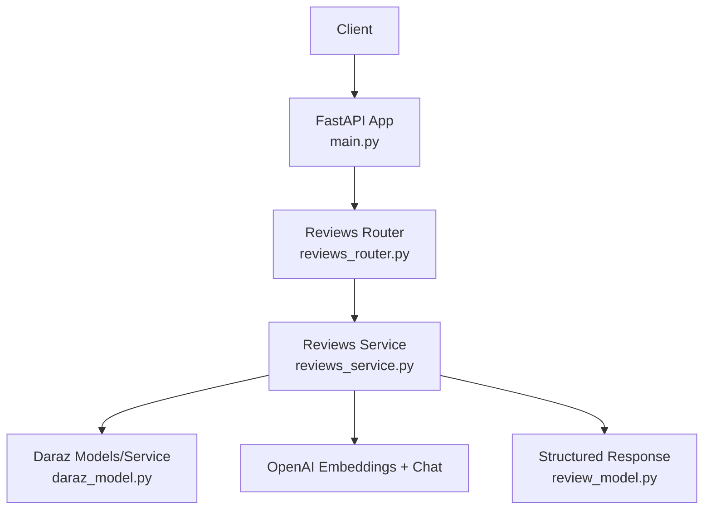
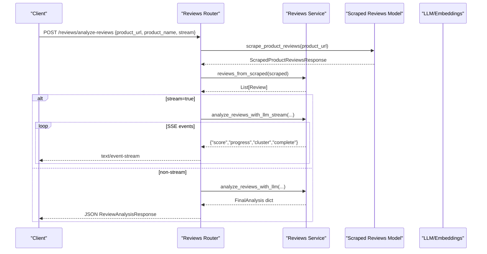
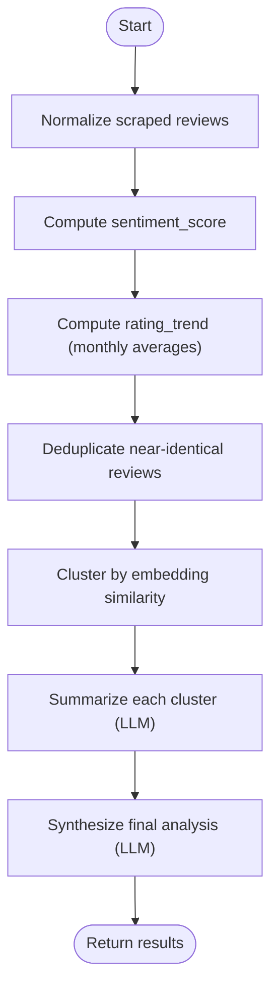
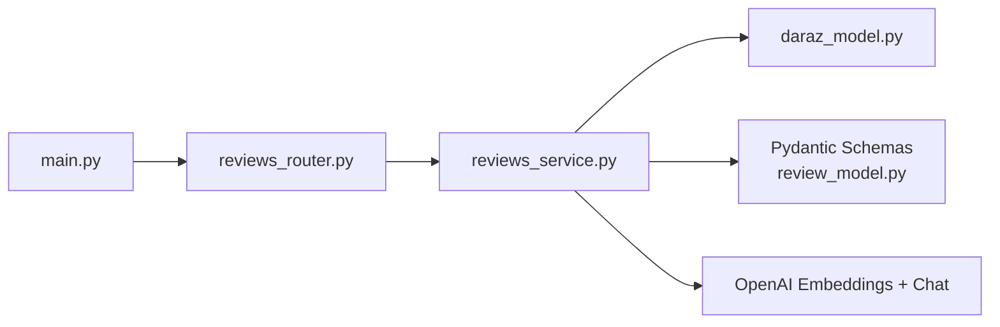

# Reviews & Ratings API

<cite>
**Referenced Files in This Document**
- [main.py](file://neurocom_backend/main.py)
- [reviews_router.py](file://neurocom_backend/routers/reviews_router.py)
- [reviews_service.py](file://neurocom_backend/services/reviews_service.py)
- [review_model.py](file://neurocom_backend/models/review_model.py)
- [daraz_model.py](file://neurocom_backend/models/daraz_model.py)
</cite>

## Table of Contents
1. [Introduction](#introduction)
2. [Project Structure](#project-structure)
3. [Core Components](#core-components)
4. [Architecture Overview](#architecture-overview)
5. [Detailed Component Analysis](#detailed-component-analysis)
6. [Dependency Analysis](#dependency-analysis)
7. [Performance Considerations](#performance-considerations)
8. [Troubleshooting Guide](#troubleshooting-guide)
9. [Conclusion](#conclusion)

## Introduction
This document provides comprehensive API documentation for the Reviews and Ratings subsystem. It covers:
- Review aggregation from marketplace sources
- Rating calculations and sentiment scoring
- Moderation workflows (as surfaced by platform review data)
- Display formatting and analytics outputs
- End-to-end examples for submission, computation, and management workflows

The system scrapes product reviews, normalizes them into a consistent internal model, computes deterministic metrics (sentiment score, rating trends), clusters topics via embeddings, and synthesizes actionable insights with structured LLM outputs.

## Project Structure
The Reviews & Ratings feature is implemented as a FastAPI router backed by a service layer that orchestrates scraping, normalization, clustering, and analysis. The main application mounts routers and applies authentication at include time.

**Diagram sources**
- [main.py:78-89](file://neurocom_backend/main.py#L78-L89)
- [reviews_router.py:11-42](file://neurocom_backend/routers/reviews_router.py#L11-L42)
- [reviews_service.py:19-303](file://neurocom_backend/services/reviews_service.py#L19-L303)
- [daraz_model.py:291-316](file://neurocom_backend/models/daraz_model.py#L291-L316)
- [review_model.py:4-25](file://neurocom_backend/models/review_model.py#L4-L25)

**Section sources**
- [main.py:78-89](file://neurocom_backend/main.py#L78-L89)
- [reviews_router.py:11-42](file://neurocom_backend/routers/reviews_router.py#L11-L42)

## Core Components
- Reviews Router: Exposes endpoints to analyze product reviews, supporting both synchronous and streaming responses.
- Reviews Service: Implements the full pipeline:
  - Scrape and normalize reviews
  - Compute sentiment score and monthly rating trends
  - Deduplicate near-duplicate reviews using embeddings
  - Cluster reviews by topic using KMeans on embeddings
  - Summarize each cluster with an LLM
  - Synthesize final analysis with action items
- Data Models:
  - Request/response schemas for analysis
  - Scraped review structures from marketplace APIs

Key responsibilities:
- Deterministic math for ratings and trends
- Scalable clustering for large review sets
- Structured LLM outputs for auditability
- Streaming events for progressive UI updates

**Section sources**
- [reviews_router.py:11-42](file://neurocom_backend/routers/reviews_router.py#L11-L42)
- [reviews_service.py:38-303](file://neurocom_backend/services/reviews_service.py#L38-L303)
- [review_model.py:4-25](file://neurocom_backend/models/review_model.py#L4-L25)
- [daraz_model.py:291-316](file://neurocom_backend/models/daraz_model.py#L291-L316)

## Architecture Overview
The end-to-end flow starts with a client request to analyze reviews for a product URL. The router validates input, scrapes reviews, converts them to an internal representation, and runs the analysis pipeline. Results are returned either as a single response or via Server-Sent Events (SSE).

**Diagram sources**
- [reviews_router.py:17-42](file://neurocom_backend/routers/reviews_router.py#L17-L42)
- [reviews_service.py:236-303](file://neurocom_backend/services/reviews_service.py#L236-L303)
- [daraz_model.py:291-316](file://neurocom_backend/models/daraz_model.py#L291-L316)

## Detailed Component Analysis

### API Endpoints
- POST /reviews/analyze-reviews
  - Purpose: Analyze product reviews from a given URL and return aggregated insights.
  - Request body fields:
    - product_url: string — URL of the product page to scrape reviews from
    - product_name: string — Human-readable name used in synthesis
    - stream: boolean — If true, returns SSE events; otherwise returns a single JSON response
  - Success response schema:
    - sentiment_score: integer (0–100)
    - rating_trend: object mapping month keys to average ratings
    - summary: string — executive summary
    - topics: array of strings — high-level topic labels
    - action_plan: array of objects with issue, severity, affected_review_count, recommendation
    - cluster_debug: object mapping cluster label to size and label
  - Error conditions:
    - 400 if no reviews found or no usable content
    - 500 if AI analysis fails

Example usage patterns:
- Non-streaming: Call with stream=false to receive a complete JSON response after processing.
- Streaming: Call with stream=true to receive progressive events:
  - score: initial sentiment_score and rating_trend
  - progress: deduplication and clustering stages
  - cluster: per-cluster summaries as they complete
  - complete: final analysis payload

Authentication:
- The router is included under require_auth in the app, so requests must be authenticated.

**Section sources**
- [reviews_router.py:11-42](file://neurocom_backend/routers/reviews_router.py#L11-L42)
- [main.py:78-89](file://neurocom_backend/main.py#L78-L89)
- [review_model.py:4-25](file://neurocom_backend/models/review_model.py#L4-L25)

### Data Structures
- Internal Review model:
  - id: string
  - text: string
  - rating: integer (1–5)
  - date: string (ISO format)
- Scraped review models:
  - review_id, buyer_name, rating, content, review_date, bought_date, like_count, images
  - Aggregated response includes item_id, total_reviews, average_rating, and list of reviews
- Analysis request/response:
  - AnalysisRequest: product_url, product_name, stream
  - ReviewAnalysisResponse: sentiment_score, rating_trend, summary, topics, action_plan, cluster_debug

Normalization:
- reviews_from_scraped filters out reviews without text and maps dates to ISO format.

**Section sources**
- [reviews_service.py:38-73](file://neurocom_backend/services/reviews_service.py#L38-L73)
- [daraz_model.py:291-316](file://neurocom_backend/models/daraz_model.py#L291-L316)
- [review_model.py:4-25](file://neurocom_backend/models/review_model.py#L4-L25)

### Rating Calculations and Analytics
- Sentiment score:
  - Computed deterministically from star ratings: normalized average mapped to 0–100 scale
- Rating trend:
  - Monthly bucketing of average ratings to detect emerging issues over time
- Topic clustering:
  - Embedding-based similarity grouping using KMeans with silhouette optimization
  - Each cluster summarized by an LLM into topic_label, sentiment, key_points, representative quote ids
- Action plan:
  - LLM-synthesized recommendations prioritized by cluster size and sentiment

**Diagram sources**
- [reviews_service.py:105-229](file://neurocom_backend/services/reviews_service.py#L105-L229)
- [reviews_service.py:236-303](file://neurocom_backend/services/reviews_service.py#L236-L303)

**Section sources**
- [reviews_service.py:105-229](file://neurocom_backend/services/reviews_service.py#L105-L229)
- [reviews_service.py:236-303](file://neurocom_backend/services/reviews_service.py#L236-L303)

### Moderation Workflows
- Platform moderation signals:
  - Scraped review models include fields such as reviewStatus, imageQCStatus, qcScore, isQced, rejected, rejectionReason, reportStatus, reportDate, reportTimes, which reflect moderation and quality control states from the marketplace.
- System behavior:
  - The current analysis pipeline focuses on content and ratings; moderation flags are available in the raw scraped data but not explicitly filtered in the normalization step. Consumers can use these fields to implement downstream moderation policies or display warnings.

Display formatting:
- Content is cleaned where applicable; HTML descriptions are converted to plain text in other parts of the codebase. For reviews, the pipeline uses raw text content when present.

**Section sources**
- [daraz_model.py:291-316](file://neurocom_backend/models/daraz_model.py#L291-L316)
- [reviews_service.py:59-73](file://neurocom_backend/services/reviews_service.py#L59-L73)

### Example Workflows

#### Review Submission and Analysis (Non-streaming)
- Steps:
  - Send POST /reviews/analyze-reviews with product_url, product_name, stream=false
  - System scrapes reviews, normalizes, computes metrics, clusters topics, and returns a final JSON response
- Expected outcome:
  - A complete analysis including sentiment_score, rating_trend, summary, topics, action_plan, and cluster_debug

#### Review Analysis (Streaming)
- Steps:
  - Send POST /reviews/analyze-reviews with stream=true
  - Receive SSE events:
    - score: early metrics
    - progress: stage updates
    - cluster: per-topic summaries
    - complete: final analysis
- Expected outcome:
  - Progressive rendering of insights as each stage completes

#### Moderation and Display
- Use moderation fields from scraped reviews to:
  - Hide or flag reviews marked as rejected or failed QC
  - Surface reviewer trust signals (e.g., verified purchase indicators)
- Format display:
  - Present sentiment_score and rating_trend as dashboards
  - Show topics and action_plan as prioritized improvement areas

**Section sources**
- [reviews_router.py:17-42](file://neurocom_backend/routers/reviews_router.py#L17-L42)
- [reviews_service.py:236-303](file://neurocom_backend/services/reviews_service.py#L236-L303)
- [daraz_model.py:291-316](file://neurocom_backend/models/daraz_model.py#L291-L316)

## Dependency Analysis
The Reviews subsystem depends on:
- FastAPI routing and middleware for request handling and CORS
- Authentication dependency applied at router inclusion
- External services:
  - Marketplace review endpoints (via Daraz models/service)
  - OpenAI embeddings and chat models for clustering and synthesis

**Diagram sources**
- [reviews_router.py:1-42](file://neurocom_backend/routers/reviews_router.py#L1-L42)
- [reviews_service.py:19-303](file://neurocom_backend/services/reviews_service.py#L19-L303)
- [daraz_model.py:291-316](file://neurocom_backend/models/daraz_model.py#L291-L316)
- [review_model.py:4-25](file://neurocom_backend/models/review_model.py#L4-L25)
- [main.py:78-89](file://neurocom_backend/main.py#L78-L89)

**Section sources**
- [main.py:78-89](file://neurocom_backend/main.py#L78-L89)
- [reviews_router.py:1-42](file://neurocom_backend/routers/reviews_router.py#L1-L42)
- [reviews_service.py:19-303](file://neurocom_backend/services/reviews_service.py#L19-L303)

## Performance Considerations
- Deterministic computations:
  - Sentiment score and rating trend are computed without LLM calls, ensuring low latency and accuracy.
- Deduplication:
  - Embedding-based deduplication reduces redundant content before clustering, improving efficiency.
- Clustering scalability:
  - KMeans with silhouette selection handles large review sets; fallback to single cluster for small inputs avoids errors.
- Bounded LLM usage:
  - Per-cluster summarization caps sample sizes to keep token costs and latency predictable.
- Streaming:
  - SSE enables progressive UI updates and better perceived performance for long-running analyses.

[No sources needed since this section provides general guidance]

## Troubleshooting Guide
Common issues and resolutions:
- No reviews found:
  - Ensure the product_url is valid and accessible; verify marketplace availability.
  - Check that the scraper returns at least one review with content.
- No usable review content:
  - Some reviews may lack text; ensure content presence before analysis.
- AI analysis failure:
  - Verify external LLM connectivity and credentials; retry or reduce scope.
- Date parsing issues:
  - Unparseable dates are skipped in trend calculation; ensure upstream date formats are supported.

Error responses:
- 400 Bad Request: Invalid input or no data available
- 500 Internal Server Error: Analysis pipeline failure

**Section sources**
- [reviews_router.py:17-42](file://neurocom_backend/routers/reviews_router.py#L17-L42)
- [reviews_service.py:59-73](file://neurocom_backend/services/reviews_service.py#L59-L73)
- [reviews_service.py:113-127](file://neurocom_backend/services/reviews_service.py#L113-L127)

## Conclusion
The Reviews & Ratings API provides a robust, scalable pipeline for aggregating marketplace reviews, computing reliable metrics, identifying topics, and generating actionable insights. It supports both synchronous and streaming interfaces, integrates moderation signals from platforms, and delivers structured outputs suitable for dashboards and operational workflows.

[No sources needed since this section summarizes without analyzing specific files]