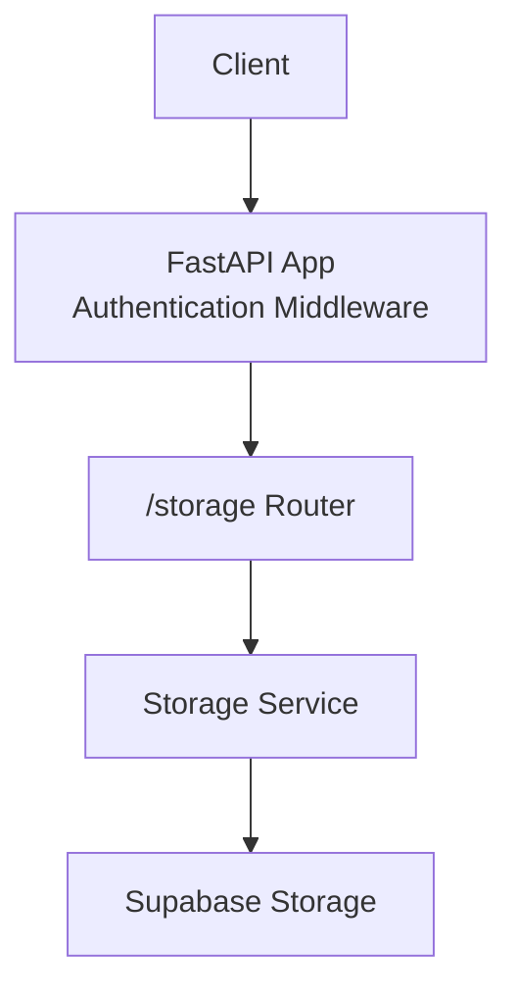
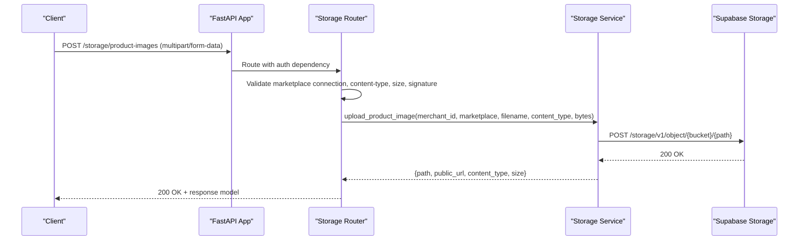
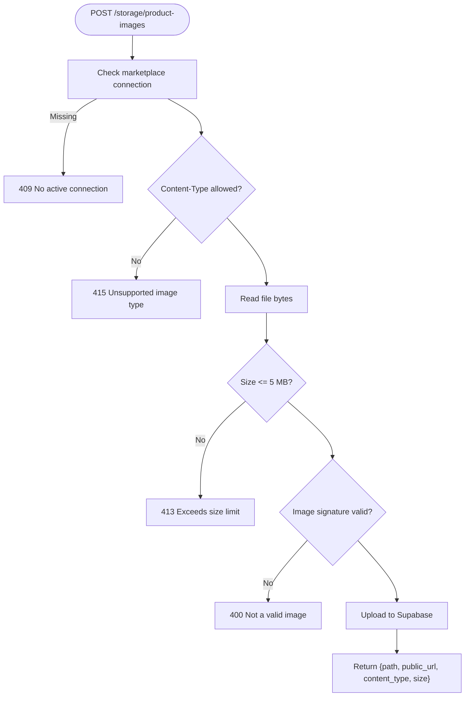
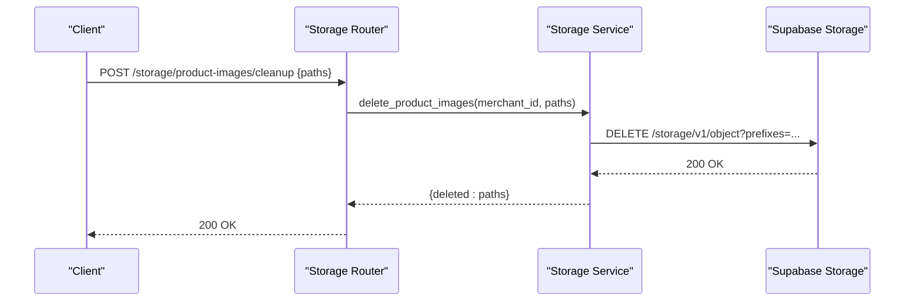
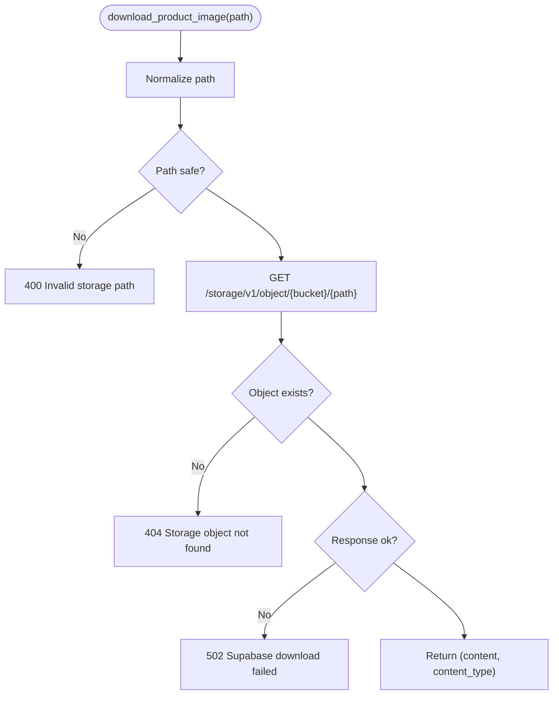
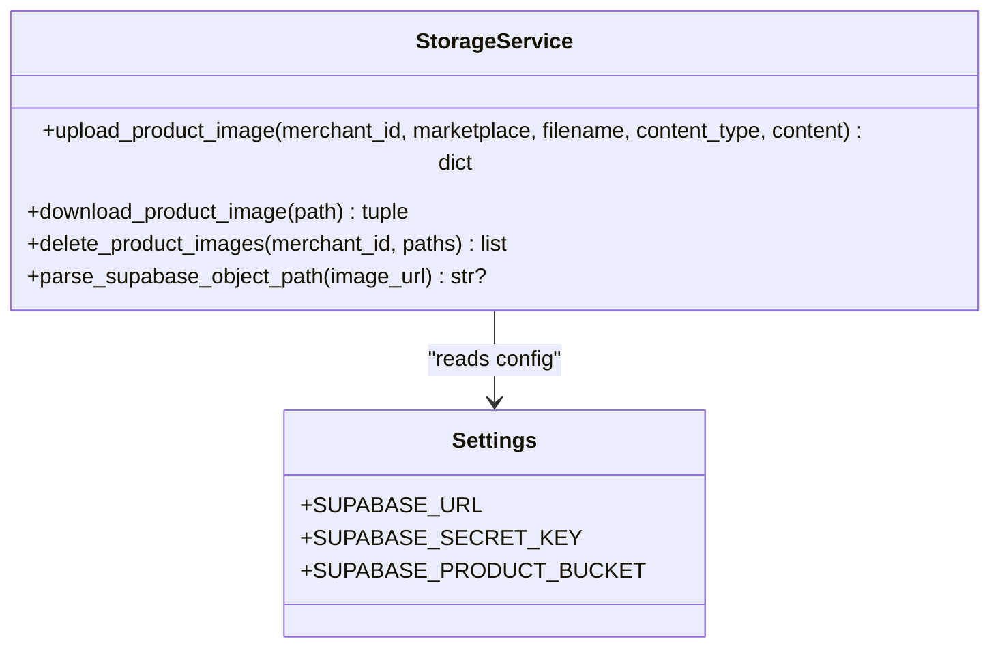
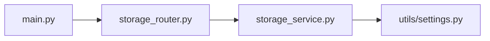

# Storage Management API

<cite>
**Referenced Files in This Document**
- [main.py](file://neurocom_backend/main.py)
- [storage_router.py](file://neurocom_backend/routers/storage_router.py)
- [storage_service.py](file://neurocom_backend/services/storage_service.py)
- [settings.py](file://neurocom_backend/utils/settings.py)
</cite>

## Table of Contents
1. [Introduction](#introduction)
2. [Project Structure](#project-structure)
3. [Core Components](#core-components)
4. [Architecture Overview](#architecture-overview)
5. [Detailed Component Analysis](#detailed-component-analysis)
6. [Dependency Analysis](#dependency-analysis)
7. [Performance Considerations](#performance-considerations)
8. [Troubleshooting Guide](#troubleshooting-guide)
9. [Conclusion](#conclusion)

## Introduction
This document provides detailed API documentation for storage management endpoints focused on marketplace product image handling, including upload, download, cleanup, and Supabase integration. It explains supported formats, size limits, validation rules, and storage policies. It also outlines how images are stored under merchant-scoped paths and how to integrate with external marketplaces (e.g., Daraz) using the provided services.

## Project Structure
The storage feature is implemented as a FastAPI router that validates incoming files and delegates storage operations to a service layer which communicates with Supabase Storage via HTTP. The application mounts authentication middleware so all storage endpoints require an authenticated merchant context.

**Diagram sources**
- [main.py:78-87](file://neurocom_backend/main.py#L78-L87)
- [storage_router.py:13-64](file://neurocom_backend/routers/storage_router.py#L13-L64)
- [storage_service.py:32-74](file://neurocom_backend/services/storage_service.py#L32-L74)

**Section sources**
- [main.py:78-87](file://neurocom_backend/main.py#L78-L87)
- [storage_router.py:13-64](file://neurocom_backend/routers/storage_router.py#L13-L64)

## Core Components
- Storage Router: Defines endpoints for uploading and cleaning up marketplace product images. Validates content type, file size, and image signatures. Requires an active marketplace connection for the current merchant.
- Storage Service: Implements Supabase Storage operations (upload, download, delete), path generation, filename sanitization, and URL parsing. Enforces configuration checks and safe path handling.
- Settings: Provides environment-based configuration for Supabase URL, secret key, and bucket name.

Key behaviors:
- Supported image types: JPEG, PNG, WebP.
- Maximum image size: 5 MB.
- Merchant-scoped storage paths: {merchant_id}/{marketplace}/{timestamp}-{uuid}-{filename}.
- Public URLs constructed for client access; private downloads use service role credentials.

**Section sources**
- [storage_router.py:17-64](file://neurocom_backend/routers/storage_router.py#L17-L64)
- [storage_service.py:15-74](file://neurocom_backend/services/storage_service.py#L15-L74)
- [settings.py:26-28](file://neurocom_backend/utils/settings.py#L26-L28)

## Architecture Overview
The storage flow integrates authentication, request validation, and cloud storage operations:

**Diagram sources**
- [storage_router.py:46-59](file://neurocom_backend/routers/storage_router.py#L46-L59)
- [storage_service.py:46-74](file://neurocom_backend/services/storage_service.py#L46-L74)

## Detailed Component Analysis

### Upload Marketplace Product Image
Endpoint: POST /storage/product-images
- Purpose: Upload a product image for a specific marketplace (daraz or shopify).
- Authentication: Required (via app-level dependencies).
- Request:
  - Form fields:
    - file: multipart file (image)
    - marketplace: literal string "daraz" or "shopify"
- Validation:
  - Content-Type must be one of: image/jpeg, image/png, image/webp.
  - File size must not exceed 5 MB.
  - Image signature check ensures actual binary format matches declared content type.
  - Active marketplace connection required for the authenticated merchant.
- Response:
  - path: server-side object path under bucket
  - public_url: HTTPS public URL for the uploaded object
  - content_type: normalized MIME type
  - size: byte length of uploaded content
- Error Handling:
  - Unsupported image type: 415
  - Empty file: 400
  - Exceeds size limit: 413
  - Invalid image signature: 400
  - No active marketplace connection: 409
  - Supabase connectivity issues: 502

**Diagram sources**
- [storage_router.py:32-59](file://neurocom_backend/routers/storage_router.py#L32-L59)
- [storage_service.py:46-74](file://neurocom_backend/services/storage_service.py#L46-L74)

**Section sources**
- [storage_router.py:46-59](file://neurocom_backend/routers/storage_router.py#L46-L59)
- [storage_service.py:46-74](file://neurocom_backend/services/storage_service.py#L46-L74)

### Cleanup Marketplace Product Images
Endpoint: POST /storage/product-images/cleanup
- Purpose: Delete multiple objects from Supabase Storage by their paths.
- Authentication: Required.
- Request body:
  - paths: list of absolute object paths within the bucket
- Validation:
  - Paths must belong to the authenticated merchant directory.
  - Path traversal attempts are rejected.
- Response:
  - deleted: list of successfully deleted paths
- Error Handling:
  - Missing or invalid paths: 400
  - Unauthorized path ownership: 403
  - Supabase connectivity issues: 502

**Diagram sources**
- [storage_router.py:62-64](file://neurocom_backend/routers/storage_router.py#L62-L64)
- [storage_service.py:128-141](file://neurocom_backend/services/storage_service.py#L128-L141)

**Section sources**
- [storage_router.py:62-64](file://neurocom_backend/routers/storage_router.py#L62-L64)
- [storage_service.py:128-141](file://neurocom_backend/services/storage_service.py#L128-L141)

### Download Product Image (Service Function)
Function: download_product_image(path)
- Purpose: Retrieve an object from Supabase Storage using the service role key. Useful for private buckets where public URLs may return 404.
- Input:
  - path: object path inside the bucket (no leading slash)
- Output:
  - tuple of (bytes, content_type)
- Validation:
  - Rejects empty or path-traversal paths.
  - Returns 404 if object not found.
  - Ensures downloaded content is non-empty.
- Error Handling:
  - Connectivity errors: 502
  - Not found: 404
  - Invalid path: 400

**Diagram sources**
- [storage_service.py:77-102](file://neurocom_backend/services/storage_service.py#L77-L102)

**Section sources**
- [storage_service.py:77-102](file://neurocom_backend/services/storage_service.py#L77-L102)

### Supabase Integration Details
- Configuration:
  - SUPABASE_URL, SUPABASE_SECRET_KEY, SUPABASE_PRODUCT_BUCKET are read from environment variables.
  - If missing, endpoints return 503 indicating misconfiguration.
- Upload:
  - Uses POST /storage/v1/object/{bucket}/{path} with service role headers.
  - Generates unique, timestamped paths scoped by merchant and marketplace.
  - Constructs public URL for client access.
- Download:
  - Uses GET /storage/v1/object/{bucket}/{path} with service role headers.
- Delete:
  - Uses DELETE /storage/v1/object with JSON body containing prefixes to remove multiple objects at once.

**Diagram sources**
- [storage_service.py:32-74](file://neurocom_backend/services/storage_service.py#L32-L74)
- [settings.py:26-28](file://neurocom_backend/utils/settings.py#L26-L28)

**Section sources**
- [storage_service.py:32-74](file://neurocom_backend/services/storage_service.py#L32-L74)
- [settings.py:26-28](file://neurocom_backend/utils/settings.py#L26-L28)

## Dependency Analysis
- Router depends on:
  - Database session to verify marketplace connections.
  - Current user dependency to enforce merchant context.
  - Storage service functions for cloud operations.
- Service depends on:
  - Environment settings for Supabase configuration.
  - HTTP client with retry policy for robustness.
- Application mounts routers with authentication dependency, ensuring all storage endpoints are protected.

**Diagram sources**
- [main.py:78-87](file://neurocom_backend/main.py#L78-L87)
- [storage_router.py:13-64](file://neurocom_backend/routers/storage_router.py#L13-L64)
- [storage_service.py:13-29](file://neurocom_backend/services/storage_service.py#L13-L29)
- [settings.py:26-28](file://neurocom_backend/utils/settings.py#L26-L28)

**Section sources**
- [main.py:78-87](file://neurocom_backend/main.py#L78-L87)
- [storage_router.py:13-64](file://neurocom_backend/routers/storage_router.py#L13-L64)
- [storage_service.py:13-29](file://neurocom_backend/services/storage_service.py#L13-L29)
- [settings.py:26-28](file://neurocom_backend/utils/settings.py#L26-L28)

## Performance Considerations
- Connection pooling and retries:
  - HTTP session configured with retry policy for POST and DELETE requests to improve resilience against transient failures.
- Timeouts:
  - Upload/download operations set reasonable connect/read timeouts to avoid hanging connections.
- Path scoping:
  - Merchant-scoped paths reduce contention and simplify cleanup.
- No in-memory image processing:
  - Images are stored as-is; no resizing or compression is performed by this module. If optimization is needed, implement it before upload or via external CDN/processing pipeline.

[No sources needed since this section provides general guidance]

## Troubleshooting Guide
Common errors and resolutions:
- 415 Unsupported image type:
  - Ensure the file’s content type is one of JPEG, PNG, or WebP.
- 413 Image file exceeds the 5 MB limit:
  - Reduce image size before upload.
- 400 File content is not a valid image:
  - Binary signature does not match declared content type; re-export or re-save the image.
- 409 No active marketplace connection:
  - Verify the merchant has an active connection token for the specified marketplace.
- 503 Supabase Storage is not configured:
  - Set SUPABASE_URL and SUPABASE_SECRET_KEY environment variables.
- 502 Could not reach Supabase Storage:
  - Check network connectivity and Supabase status; review logs for underlying exceptions.
- 404 Storage object not found:
  - Confirm the object path exists and is accessible.

**Section sources**
- [storage_router.py:46-59](file://neurocom_backend/routers/storage_router.py#L46-L59)
- [storage_service.py:32-74](file://neurocom_backend/services/storage_service.py#L32-L74)
- [storage_service.py:77-102](file://neurocom_backend/services/storage_service.py#L77-L102)
- [storage_service.py:128-141](file://neurocom_backend/services/storage_service.py#L128-L141)

## Conclusion
The storage management API provides secure, validated, and merchant-scoped image uploads to Supabase Storage with support for download and bulk cleanup. It enforces strict validation for content types and sizes, constructs public URLs for client access, and integrates safely with marketplace workflows. For image optimization, consider preprocessing before upload or integrating a CDN-based transformation pipeline.

[No sources needed since this section summarizes without analyzing specific files]