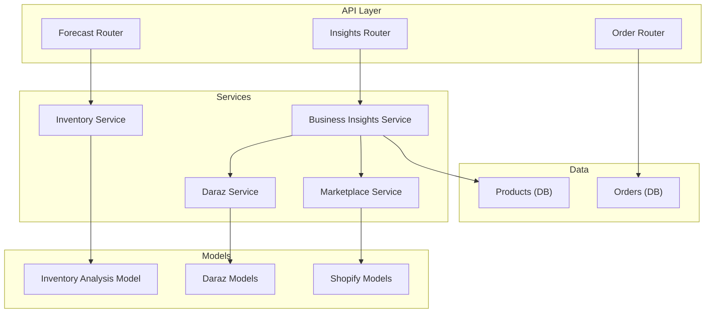
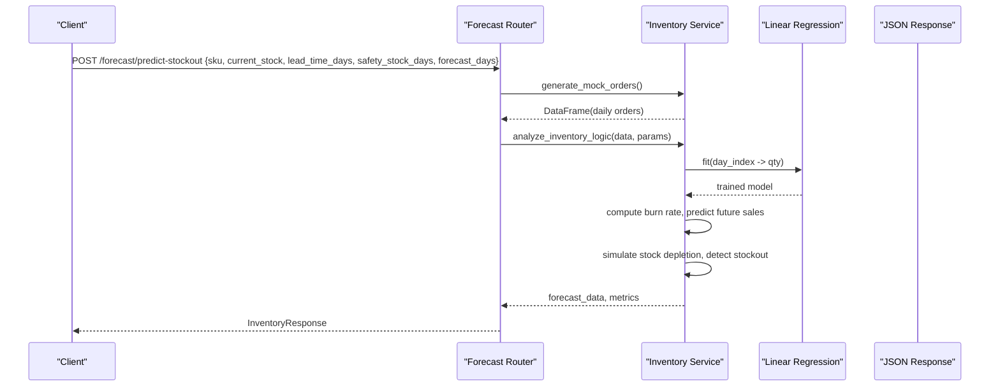
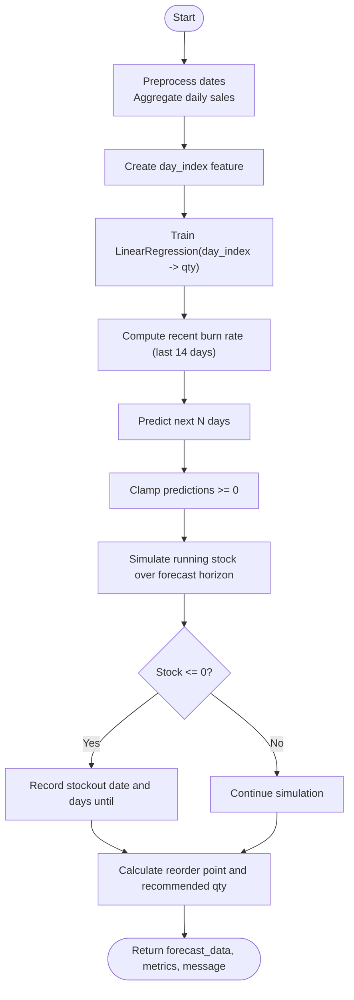
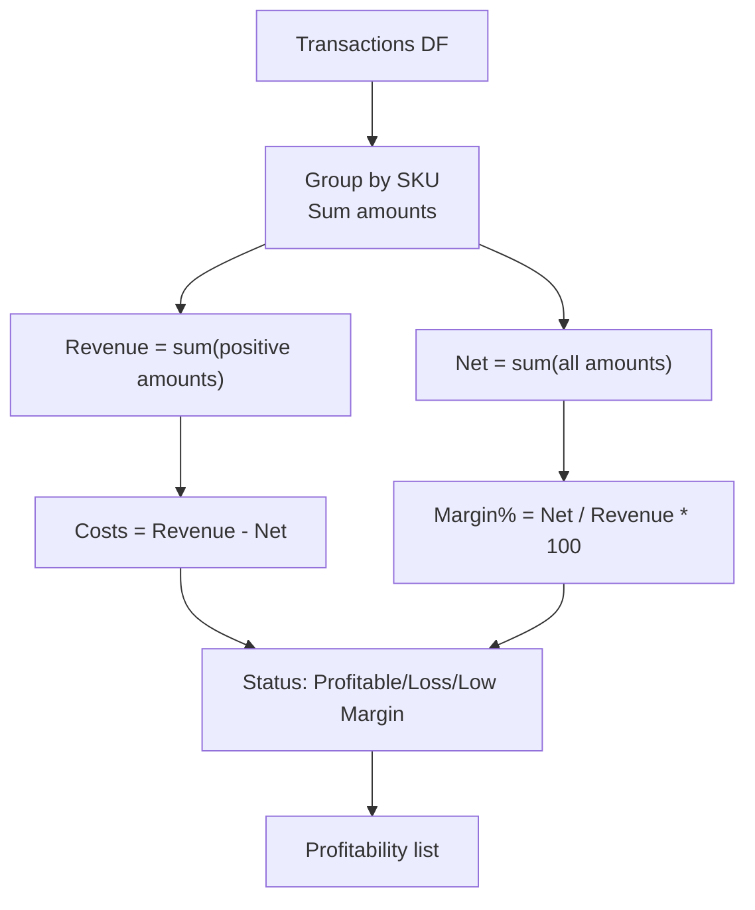
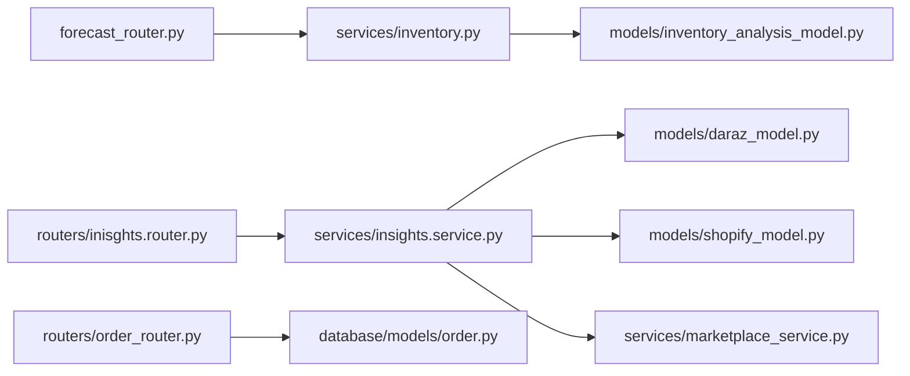

# Analytics & Forecasting

<cite>
**Referenced Files in This Document**
- [forecast_router.py](file://neurocom_backend/routers/forecast_router.py)
- [inventory_analysis_model.py](file://neurocom_backend/models/inventory_analysis_model.py)
- [inventory.py](file://neurocom_backend/services/inventory.py)
- [inisghts.router.py](file://neurocom_backend/routers/inisghts.router.py)
- [insights.service.py](file://neurocom_backend/services/insights.service.py)
- [order_router.py](file://neurocom_backend/routers/order_router.py)
- [order.py](file://neurocom_backend/database/models/order.py)
- [product.py](file://neurocom_backend/database/models/product.py)
- [daraz_model.py](file://neurocom_backend/models/daraz_model.py)
- [shopify_model.py](file://neurocom_backend/models/shopify_model.py)
- [marketplace_service.py](file://neurocom_backend/services/marketplace_service.py)
- [daraz_service.py](file://neurocom_backend/services/daraz_service.py)
</cite>

## Table of Contents
1. Introduction
2. Project Structure
3. Core Components
4. Architecture Overview
5. Detailed Component Analysis
6. Dependency Analysis
7. Performance Considerations
8. Troubleshooting Guide
9. Conclusion
10. Appendices

## Introduction
This document explains the analytics and forecasting capabilities of the Tijarah AI Backend. It covers sales forecasting algorithms, inventory analysis tools, performance metrics calculation, machine learning models for demand prediction, stock level optimization, and trend analysis. It also documents data aggregation processes, report generation, visualization-ready outputs, custom metric definitions, model training workflows, evaluation methodologies, and guidance for interpreting results to support data-driven decisions.

## Project Structure
The analytics and forecasting features are implemented across FastAPI routers, services, Pydantic models, and database schemas:
- Forecasting API endpoints expose inventory predictions and stockout risk.
- Business insights endpoints aggregate profitability, operations, dead stock, and SLA risks.
- Services implement data generation, ML-based forecasting, and analytical logic.
- Models define request/response contracts and marketplace data structures.
- Database models capture orders and products used by internal analytics.

**Diagram sources**
- [forecast_router.py:15-49](file://neurocom_backend/routers/forecast_router.py#L15-L49)
- [inisghts.router.py:15-31](file://neurocom_backend/routers/inisghts.router.py#L15-L31)
- [order_router.py:10-39](file://neurocom_backend/routers/order_router.py#L10-L39)
- [inventory.py:9-120](file://neurocom_backend/services/inventory.py#L9-L120)
- [insights.service.py:8-183](file://neurocom_backend/services/insights.service.py#L8-L183)
- [inventory_analysis_model.py:4-25](file://neurocom_backend/models/inventory_analysis_model.py#L4-L25)
- [daraz_model.py:1-460](file://neurocom_backend/models/daraz_model.py#L1-L460)
- [shopify_model.py:1-133](file://neurocom_backend/models/shopify_model.py#L1-L133)
- [order.py:21-39](file://neurocom_backend/database/models/order.py#L21-L39)
- [product.py:13-21](file://neurocom_backend/database/models/product.py#L13-L21)

**Section sources**
- [forecast_router.py:15-49](file://neurocom_backend/routers/forecast_router.py#L15-L49)
- [inisghts.router.py:15-31](file://neurocom_backend/routers/inisghts.router.py#L15-L31)
- [order_router.py:10-39](file://neurocom_backend/routers/order_router.py#L10-L39)
- [inventory.py:9-120](file://neurocom_backend/services/inventory.py#L9-L120)
- [insights.service.py:8-183](file://neurocom_backend/services/insights.service.py#L8-L183)
- [inventory_analysis_model.py:4-25](file://neurocom_backend/models/inventory_analysis_model.py#L4-L25)
- [daraz_model.py:1-460](file://neurocom_backend/models/daraz_model.py#L1-L460)
- [shopify_model.py:1-133](file://neurocom_backend/models/shopify_model.py#L1-L133)
- [order.py:21-39](file://neurocom_backend/database/models/order.py#L21-L39)
- [product.py:13-21](file://neurocom_backend/database/models/product.py#L13-L21)

## Core Components
- Forecasting endpoint: Predicts stockouts and recommends reorder quantities using a linear regression trend model on daily sales.
- Inventory service: Generates synthetic order history with seasonality and outliers, computes burn rate, trains a simple trend model, simulates future stock levels, and calculates reorder points.
- Business insights endpoint: Aggregates profitability per SKU, operational metrics (returns/cancellations), dead stock identification, and SLA risk alerts.
- Marketplace integrations: Connects to Daraz and Shopify to retrieve orders, returns, and product data for analytics.
- Data models: Define request/response contracts for forecasting and structure marketplace payloads for consistent processing.

Key responsibilities:
- Forecasting: Trend detection, stockout simulation, reorder recommendations.
- Insights: Profitability, operations, dead stock, SLA monitoring.
- Integrations: Secure connection management and token handling for marketplaces.
- Data modeling: Strong typing for inputs/outputs and marketplace responses.

**Section sources**
- [forecast_router.py:21-49](file://neurocom_backend/routers/forecast_router.py#L21-L49)
- [inventory.py:9-120](file://neurocom_backend/services/inventory.py#L9-L120)
- [insights.service.py:45-183](file://neurocom_backend/services/insights.service.py#L45-L183)
- [marketplace_service.py:178-302](file://neurocom_backend/services/marketplace_service.py#L178-L302)
- [inventory_analysis_model.py:4-25](file://neurocom_backend/models/inventory_analysis_model.py#L4-L25)
- [daraz_model.py:326-460](file://neurocom_backend/models/daraz_model.py#L326-L460)
- [shopify_model.py:96-133](file://neurocom_backend/models/shopify_model.py#L96-L133)

## Architecture Overview
The system exposes two primary analytics APIs:
- /forecast/predict-stockout: Accepts SKU, current stock, lead time, safety stock days, and forecast horizon; returns predicted stockout date, recommended reorder quantity, daily forecasts, and burn rate.
- /insights/dashboard: Returns aggregated business insights including profitability, operations, dead stock, and SLA risks.

**Diagram sources**
- [forecast_router.py:21-49](file://neurocom_backend/routers/forecast_router.py#L21-L49)
- [inventory.py:9-120](file://neurocom_backend/services/inventory.py#L9-L120)

**Section sources**
- [forecast_router.py:21-49](file://neurocom_backend/routers/forecast_router.py#L21-L49)
- [inventory.py:38-120](file://neurocom_backend/services/inventory.py#L38-L120)

## Detailed Component Analysis

### Sales Forecasting and Stockout Prediction
- Input contract: SKU, current stock, lead time, safety stock days, forecast horizon.
- Data generation: Synthetic order history with base demand, weekend spikes, and occasional flash sale outliers.
- Feature engineering: Day index as a numeric feature to capture trend.
- Model: Linear regression trained on daily sales vs day index.
- Forecasting: Predicts next N days, clamps negative predictions to zero.
- Stockout simulation: Iteratively subtracts predicted sales from current stock to find first day stock reaches zero or below.
- Recommendations: Reorder point based on recent burn rate, lead time, and safety stock; suggests quantity to cover target horizon plus lead time.

**Diagram sources**
- [inventory.py:38-120](file://neurocom_backend/services/inventory.py#L38-L120)

**Section sources**
- [inventory.py:9-120](file://neurocom_backend/services/inventory.py#L9-L120)
- [inventory_analysis_model.py:4-25](file://neurocom_backend/models/inventory_analysis_model.py#L4-L25)
- [forecast_router.py:21-49](file://neurocom_backend/routers/forecast_router.py#L21-L49)

### Inventory Analysis Tools
- Daily burn rate: Average daily sales over last 14 days to reflect immediate demand.
- Safety stock: Derived from burn rate multiplied by safety stock days.
- Reorder point: Sum of lead-time coverage and safety stock.
- Recommended reorder quantity: Target stock covering forecast horizon plus lead time minus current stock.
- Forecast data: Per-day predicted sales and projected stock levels.

These tools enable proactive replenishment and minimize stockouts while avoiding excess inventory.

**Section sources**
- [inventory.py:56-119](file://neurocom_backend/services/inventory.py#L56-L119)

### Performance Metrics Calculation
- Profitability per SKU:
  - Revenue: Sum of positive transaction amounts.
  - Costs: Difference between revenue and net amount.
  - Net profit: Summed transaction amounts per SKU.
  - Margin percent: Net profit divided by revenue times 100.
  - Status classification: Profitable, Loss Making, Low Margin.
- Operational metrics:
  - Total orders, return rate, cancellation rate.
  - Top return reasons with counts.
- Dead stock:
  - Items not sold within a threshold window (mocked).
  - Estimated frozen cash equals stock times price.
- SLA risks:
  - Pending orders older than thresholds flagged as Warning or Breach.
  - Hours since order computed for each pending item.

**Diagram sources**
- [insights.service.py:93-122](file://neurocom_backend/services/insights.service.py#L93-L122)

**Section sources**
- [insights.service.py:45-183](file://neurocom_backend/services/insights.service.py#L45-L183)

### Machine Learning Models for Demand Prediction
- Current model: Linear regression on daily sales vs day index to estimate trend.
- Limitations: Does not explicitly model seasonality or holidays; comments indicate production should use Prophet or ARIMA for seasonality.
- Training workflow:
  - Aggregate daily sales from historical orders.
  - Create numeric day index feature.
  - Fit linear regression.
  - Predict future days and clamp negatives.
- Evaluation methodology:
  - Use rolling windows or train/test splits to measure MAE/MSE on holdout periods.
  - Compare against baseline (e.g., naive forecast using recent burn rate).
  - Track forecast bias and variance over time.

Recommendations:
- Introduce seasonality features (day-of-week, month, promotions).
- Replace linear regression with Prophet or ARIMA for robust seasonal forecasting.
- Implement cross-validation and backtesting pipelines.

**Section sources**
- [inventory.py:43-65](file://neurocom_backend/services/inventory.py#L43-L65)

### Stock Level Optimization
- Reorder point formula: (recent burn rate × lead time) + safety stock.
- Safety stock: recent burn rate × safety stock days.
- Recommended quantity: Target stock (burn rate × 30 days + reorder point) − current stock.
- Alerts: If stock falls below reorder point, immediate reorder is recommended.

Interpretation:
- High burn rate increases both safety stock and reorder point.
- Longer lead times require higher safety stock and earlier reorders.
- Frequent stockouts suggest underestimating demand variability or insufficient safety stock.

**Section sources**
- [inventory.py:91-119](file://neurocom_backend/services/inventory.py#L91-L119)

### Trend Analysis
- Trend detection via linear regression slope indicates increasing or decreasing demand.
- Seasonal patterns are simulated via weekend spikes and random flash sales.
- For production, incorporate calendar effects and promotional calendars into features.

**Section sources**
- [inventory.py:20-35](file://neurocom_backend/services/inventory.py#L20-L35)
- [inventory.py:43-65](file://neurocom_backend/services/inventory.py#L43-L65)

### Data Aggregation Processes
- Mock data generator creates multi-platform order history (Daraz and Shopify) with realistic patterns.
- Business insights aggregator combines transactions, orders, and product lists to produce dashboard-ready metrics.
- Marketplace service manages connections and tokens for Daraz and Shopify, enabling real data ingestion.

**Section sources**
- [inventory.py:9-36](file://neurocom_backend/services/inventory.py#L9-L36)
- [insights.service.py:45-89](file://neurocom_backend/services/insights.service.py#L45-L89)
- [marketplace_service.py:178-302](file://neurocom_backend/services/marketplace_service.py#L178-L302)

### Report Generation and Visualization
- Forecast response includes daily forecast entries with date, predicted sales, and projected stock—ideal for line charts and stock depletion curves.
- Insights response provides structured lists for profitability, operations, dead stock, and SLA risks—suitable for tables, bar charts, and alert dashboards.
- Return insights include reason breakdowns and monthly trends—useful for funnel and time-series visualizations.

Visualization guidance:
- Plot projected stock over time with thresholds for reorder and stockout.
- Use stacked bars for revenue vs costs per SKU to highlight margin issues.
- Display SLA alerts as heatmaps by hours since order.

**Section sources**
- [inventory_analysis_model.py:11-25](file://neurocom_backend/models/inventory_analysis_model.py#L11-L25)
- [insights.service.py:12-44](file://neurocom_backend/services/insights.service.py#L12-L44)
- [daraz_model.py:413-460](file://neurocom_backend/models/daraz_model.py#L413-L460)

### Custom Metric Definitions
- Burn rate: Recent average daily sales (last 14 days).
- Reorder point: Lead-time coverage plus safety stock.
- Safety stock: Days of buffer derived from burn rate and policy.
- Return rate: Returned orders divided by total orders.
- Cancellation rate: Cancelled orders divided by total orders.
- Frozen cash: Dead stock units multiplied by unit price.
- Dispute rate: Disputed returns divided by total returns.
- Refund request rate: Refund requests divided by total returns.

**Section sources**
- [inventory.py:56-119](file://neurocom_backend/services/inventory.py#L56-L119)
- [insights.service.py:124-183](file://neurocom_backend/services/insights.service.py#L124-L183)
- [daraz_model.py:413-460](file://neurocom_backend/models/daraz_model.py#L413-L460)

### Guidance for Interpreting Results
- Stockout prediction:
  - If stockout_date is present, prioritize replenishment and review supplier lead times.
  - Days_until_stockout helps plan urgency and communication with stakeholders.
- Reorder recommendation:
  - Follow recommended_reorder_qty when current_stock < reorder_point.
  - Adjust safety_stock_days based on demand variability and service level targets.
- Profitability:
  - Focus on “Loss Making” and “Low Margin” SKUs for pricing or cost reduction.
  - Investigate high shipping fees or platform commissions impacting margins.
- Operations:
  - High return rates indicate quality or listing issues; address top return reasons.
  - Cancellation rates may signal fulfillment bottlenecks or capacity constraints.
- Dead stock:
  - Liquidate or discount items with high estimated frozen cash to free working capital.
- SLA risks:
  - Address “Warning” and “Breach” orders promptly to maintain customer satisfaction.

[No sources needed since this section provides general guidance]

## Dependency Analysis
The analytics pipeline depends on:
- Routers exposing endpoints that orchestrate service calls.
- Services implementing data generation, ML modeling, and analytical logic.
- Models defining contracts and marketplace payloads.
- Database models capturing orders and products for internal analytics.

**Diagram sources**
- [forecast_router.py:15-49](file://neurocom_backend/routers/forecast_router.py#L15-L49)
- [inisghts.router.py:15-31](file://neurocom_backend/routers/inisghts.router.py#L15-L31)
- [order_router.py:10-39](file://neurocom_backend/routers/order_router.py#L10-L39)
- [inventory.py:9-120](file://neurocom_backend/services/inventory.py#L9-L120)
- [insights.service.py:8-183](file://neurocom_backend/services/insights.service.py#L8-L183)
- [inventory_analysis_model.py:4-25](file://neurocom_backend/models/inventory_analysis_model.py#L4-L25)
- [daraz_model.py:1-460](file://neurocom_backend/models/daraz_model.py#L1-L460)
- [shopify_model.py:1-133](file://neurocom_backend/models/shopify_model.py#L1-L133)
- [marketplace_service.py:178-302](file://neurocom_backend/services/marketplace_service.py#L178-L302)

**Section sources**
- [forecast_router.py:15-49](file://neurocom_backend/routers/forecast_router.py#L15-L49)
- [inisghts.router.py:15-31](file://neurocom_backend/routers/inisghts.router.py#L15-L31)
- [order_router.py:10-39](file://neurocom_backend/routers/order_router.py#L10-L39)
- [inventory.py:9-120](file://neurocom_backend/services/inventory.py#L9-L120)
- [insights.service.py:8-183](file://neurocom_backend/services/insights.service.py#L8-L183)
- [inventory_analysis_model.py:4-25](file://neurocom_backend/models/inventory_analysis_model.py#L4-L25)
- [daraz_model.py:1-460](file://neurocom_backend/models/daraz_model.py#L1-L460)
- [shopify_model.py:1-133](file://neurocom_backend/models/shopify_model.py#L1-L133)
- [marketplace_service.py:178-302](file://neurocom_backend/services/marketplace_service.py#L178-L302)

## Performance Considerations
- Forecasting latency: Linear regression is fast; however, generating large synthetic datasets can be memory-intensive. Consider streaming or chunking if scaling to many SKUs.
- Seasonality: The current model ignores seasonality; adopting Prophet or ARIMA will increase computation but improve accuracy.
- Batch processing: For multiple SKUs, parallelize analysis jobs to reduce overall runtime.
- Caching: Cache recent burn rates and forecasts to avoid recomputation on frequent requests.
- Data freshness: Ensure timely updates from marketplace APIs to keep insights accurate.

[No sources needed since this section provides general guidance]

## Troubleshooting Guide
Common issues and resolutions:
- Forecast errors:
  - Validate input parameters (current_stock > 0, reasonable lead/safety days).
  - Check data integrity in generated orders; ensure dates are valid and quantities non-negative.
- Stockout mispredictions:
  - Review burn rate window length; adjust to better reflect recent demand changes.
  - Incorporate seasonality features or switch to advanced models.
- Insights inaccuracies:
  - Verify mock data aligns with expected distributions; replace with real marketplace data when available.
  - Ensure marketplace connections are active and tokens are valid.
- SLA alerts false positives:
  - Adjust thresholds for Warning/Breach based on operational capacity.
  - Confirm order timestamps and status transitions are correct.

**Section sources**
- [forecast_router.py:21-49](file://neurocom_backend/routers/forecast_router.py#L21-L49)
- [inventory.py:38-120](file://neurocom_backend/services/inventory.py#L38-L120)
- [insights.service.py:45-183](file://neurocom_backend/services/insights.service.py#L45-L183)
- [marketplace_service.py:178-302](file://neurocom_backend/services/marketplace_service.py#L178-L302)

## Conclusion
The Tijarah AI Backend provides a practical foundation for analytics and forecasting:
- A clear API for inventory predictions and stockout risk.
- Robust business insights aggregating profitability, operations, dead stock, and SLA risks.
- Machine learning-based demand forecasting with room for improvement through seasonality modeling.
- Structured outputs suitable for visualization and decision-making.

Adopting advanced forecasting models, integrating real marketplace data, and implementing evaluation pipelines will enhance accuracy and reliability, enabling more confident, data-driven business decisions.

[No sources needed since this section summarizes without analyzing specific files]

## Appendices

### API Endpoints Summary
- Forecast:
  - POST /forecast/predict-stockout: Returns stockout prediction, recommended reorder quantity, burn rate, and daily forecasts.
- Insights:
  - GET /insights/dashboard: Returns profitability, operations, dead stock, and SLA risks.
- Orders:
  - CRUD endpoints for order management supporting internal analytics.

**Section sources**
- [forecast_router.py:15-49](file://neurocom_backend/routers/forecast_router.py#L15-L49)
- [inisghts.router.py:15-31](file://neurocom_backend/routers/inisghts.router.py#L15-L31)
- [order_router.py:10-39](file://neurocom_backend/routers/order_router.py#L10-L39)

### Data Models Reference
- InventoryRequest/Response: Defines forecasting inputs and outputs.
- InsightsResponse: Aggregated business insights structure.
- Daraz/Shopify models: Standardized marketplace data shapes for integration.

**Section sources**
- [inventory_analysis_model.py:4-25](file://neurocom_backend/models/inventory_analysis_model.py#L4-L25)
- [insights.service.py:12-44](file://neurocom_backend/services/insights.service.py#L12-L44)
- [daraz_model.py:1-460](file://neurocom_backend/models/daraz_model.py#L1-L460)
- [shopify_model.py:1-133](file://neurocom_backend/models/shopify_model.py#L1-L133)