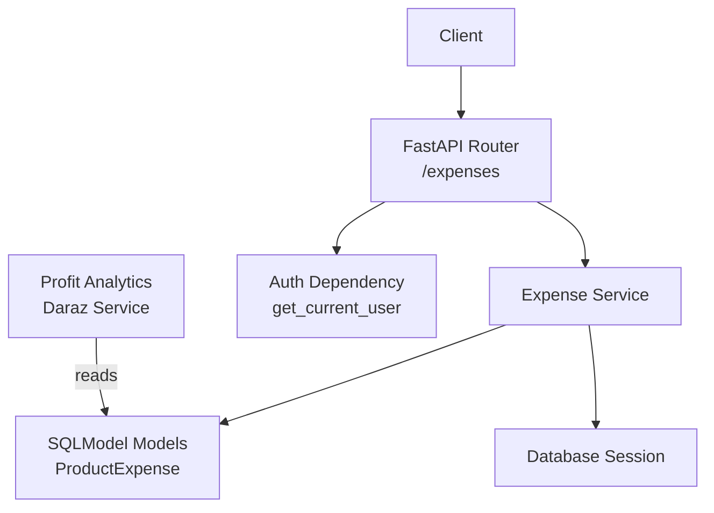
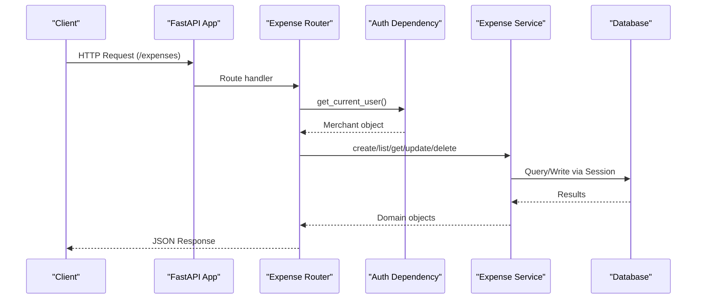
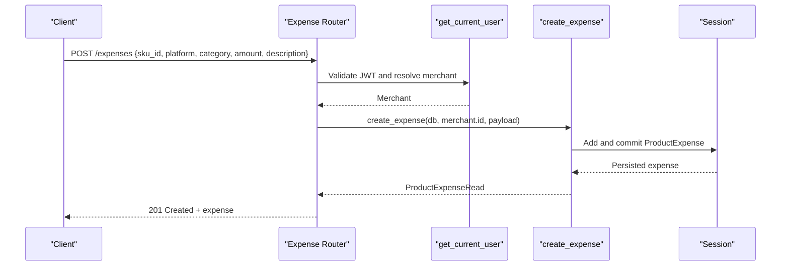
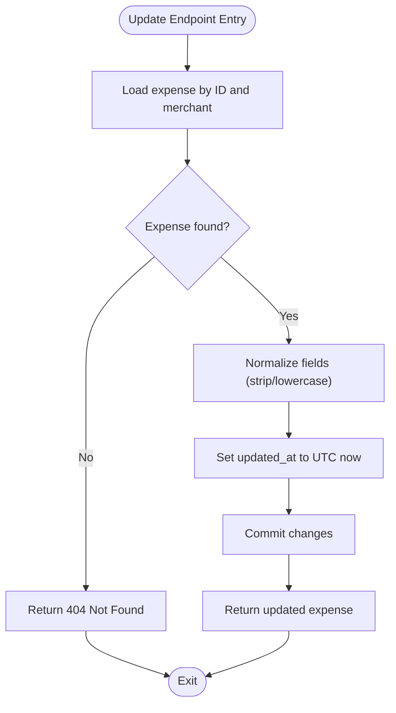
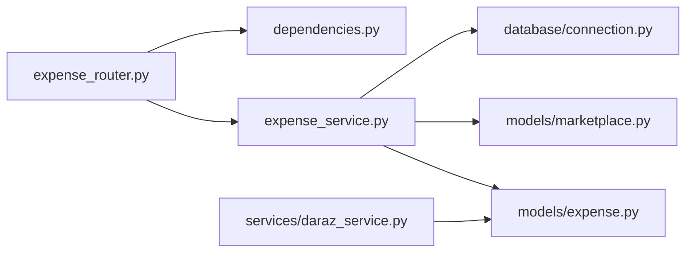

# Expense Management System

<cite>
**Referenced Files in This Document**
- [main.py](file://neurocom_backend/main.py)
- [expense_router.py](file://neurocom_backend/routers/expense_router.py)
- [expense_service.py](file://neurocom_backend/services/expense_service.py)
- [expense.py](file://neurocom_backend/database/models/expense.py)
- [marketplace.py](file://neurocom_backend/database/models/marketplace.py)
- [connection.py](file://neurocom_backend/database/connection.py)
- [dependencies.py](file://neurocom_backend/dependencies.py)
- [daraz_service.py](file://neurocom_backend/services/daraz_service.py)
</cite>

## Table of Contents
1. [Introduction](#introduction)
2. [Project Structure](#project-structure)
3. [Core Components](#core-components)
4. [Architecture Overview](#architecture-overview)
5. [Detailed Component Analysis](#detailed-component-analysis)
6. [Dependency Analysis](#dependency-analysis)
7. [Performance Considerations](#performance-considerations)
8. [Troubleshooting Guide](#troubleshooting-guide)
9. [Conclusion](#conclusion)

## Introduction
This document describes the Expense Management System within the backend application. The system enables merchants to define per-SKU expenses (such as product cost, fuel, packaging) that are later deducted from net revenue when calculating actual net profit for financial analytics. It provides a secure REST API with CRUD operations and integrates with marketplace services to compute profit metrics using merchant-defined expenses.

## Project Structure
The expense feature follows a layered architecture:
- API layer: FastAPI router exposing endpoints under /expenses
- Service layer: Business logic for creating, reading, updating, and deleting expenses
- Data layer: SQLModel models and database session management
- Security: Authentication via JWT ensuring merchant-scoped access
- Integration: Profit analytics service consumes stored expenses to adjust net profit calculations

**Diagram sources**
- [expense_router.py:29-99](file://neurocom_backend/routers/expense_router.py#L29-L99)
- [expense_service.py:19-98](file://neurocom_backend/services/expense_service.py#L19-L98)
- [expense.py:11-60](file://neurocom_backend/database/models/expense.py#L11-L60)
- [connection.py:9-27](file://neurocom_backend/database/connection.py#L9-L27)
- [dependencies.py:17-43](file://neurocom_backend/dependencies.py#L17-L43)
- [daraz_service.py:2100-2147](file://neurocom_backend/services/daraz_service.py#L2100-L2147)

**Section sources**
- [main.py:82-91](file://neurocom_backend/main.py#L82-L91)
- [expense_router.py:29-99](file://neurocom_backend/routers/expense_router.py#L29-L99)

## Core Components
- API Router: Defines endpoints for creating, listing, retrieving, updating, and deleting product expenses. All endpoints require authentication and are scoped to the authenticated merchant.
- Service Layer: Implements business rules for expense CRUD, including input normalization (trimming/lowercasing), filtering by platform or SKU, and timestamps.
- Data Model: SQLModel table for ProductExpense with fields for merchant_id, sku_id, platform, category, amount, description, created_at, updated_at; plus Pydantic schemas for request/response validation.
- Database Connection: Engine configuration and migration helper; provides scoped sessions per request.
- Security: JWT-based authentication ensures only the current merchant can access their expenses.
- Integration: Profit analytics function uses merchant expenses to deduct per-SKU costs from net revenue when computing profit.

**Section sources**
- [expense_router.py:32-99](file://neurocom_backend/routers/expense_router.py#L32-L99)
- [expense_service.py:19-98](file://neurocom_backend/services/expense_service.py#L19-L98)
- [expense.py:11-60](file://neurocom_backend/database/models/expense.py#L11-L60)
- [connection.py:9-27](file://neurocom_backend/database/connection.py#L9-L27)
- [dependencies.py:17-43](file://neurocom_backend/dependencies.py#L17-L43)
- [daraz_service.py:2100-2147](file://neurocom_backend/services/daraz_service.py#L2100-L2147)

## Architecture Overview
The expense system is integrated into the main FastAPI application and secured via middleware and dependencies. Endpoints are mounted under /expenses and protected by authentication. The service layer interacts with the database through SQLModel and performs data normalization and filtering. Profit analytics consume these expenses to refine net profit calculations.

**Diagram sources**
- [main.py:82-91](file://neurocom_backend/main.py#L82-L91)
- [expense_router.py:32-99](file://neurocom_backend/routers/expense_router.py#L32-L99)
- [dependencies.py:17-43](file://neurocom_backend/dependencies.py#L17-L43)
- [expense_service.py:19-98](file://neurocom_backend/services/expense_service.py#L19-L98)
- [connection.py:25-27](file://neurocom_backend/database/connection.py#L25-L27)

## Detailed Component Analysis

### API Layer: Expense Router
Responsibilities:
- Expose REST endpoints for product expenses under /expenses
- Enforce authentication and merchant scoping
- Validate payloads via Pydantic schemas
- Handle 404 errors for missing expenses

Key endpoints:
- POST /expenses: Create a new expense
- GET /expenses: List expenses with optional filters (platform, sku_id)
- GET /expenses/{expense_id}: Retrieve an expense by ID
- PUT /expenses/{expense_id}: Update an existing expense
- DELETE /expenses/{expense_id}: Delete an expense

Error handling:
- Returns 404 Not Found if an expense does not exist for the given ID and merchant

**Section sources**
- [expense_router.py:29-99](file://neurocom_backend/routers/expense_router.py#L29-L99)

### Service Layer: Expense Service
Responsibilities:
- Implement CRUD operations for ProductExpense
- Normalize inputs (strip whitespace, lowercase platform)
- Filter expenses by merchant, platform, and SKU
- Manage timestamps and persistence

Key functions:
- create_expense: Build and persist a new expense
- get_merchant_expenses: Query expenses with optional filters and ordering
- get_expense_by_id: Fetch a single expense scoped to merchant
- update_expense: Apply partial updates with timestamp refresh
- delete_expense: Remove an expense

Data normalization:
- Trims strings and lowercases platform during creation and updates
- Uses UTC timestamps for created_at and updated_at

**Section sources**
- [expense_service.py:19-98](file://neurocom_backend/services/expense_service.py#L19-L98)
- [marketplace.py:13-14](file://neurocom_backend/database/models/marketplace.py#L13-L14)

### Data Model: ProductExpense
Responsibilities:
- Define the database schema for product expenses
- Provide Pydantic schemas for API request/response validation

Schema highlights:
- Primary key id (UUID)
- merchant_id (foreign key to merchant)
- sku_id (indexed)
- platform (e.g., daraz, shopify, both)
- category (e.g., product_cost, fuel, packaging)
- amount (positive float)
- description (optional)
- created_at, updated_at (timestamps)

Validation:
- Create/Update schemas enforce non-empty strings and positive amounts
- Read schema exposes all fields including timestamps

**Section sources**
- [expense.py:11-60](file://neurocom_backend/database/models/expense.py#L11-L60)

### Database Connection and Migration
Responsibilities:
- Configure SQLAlchemy engine and echo settings
- Perform migrations on startup
- Provide scoped database sessions per request

Key behaviors:
- Creates tables based on SQLModel metadata
- Applies PostgreSQL-specific column/constraint adjustments
- Yields a Session per request for transactional safety

**Section sources**
- [connection.py:9-27](file://neurocom_backend/database/connection.py#L9-L27)

### Security: Authentication Dependency
Responsibilities:
- Decode JWT tokens and validate merchant account type
- Resolve merchant from token subject and ensure existence
- Raise appropriate unauthorized exceptions

Key behaviors:
- get_current_user extracts token, decodes payload, validates type == "merchant", fetches merchant
- WebSocket counterpart exists for real-time features

**Section sources**
- [dependencies.py:17-43](file://neurocom_backend/dependencies.py#L17-L43)

### Integration: Profit Analytics Consumption
Responsibilities:
- Use merchant-defined expenses to adjust net profit calculations
- Aggregate per-SKU expenses and apply deductions to revenue items

Key behavior:
- get_profit_analytics accepts merchant_expenses list and builds an expense lookup by SKU
- Deducts per-SKU expenses from order items to compute true net profit

**Section sources**
- [daraz_service.py:2100-2147](file://neurocom_backend/services/daraz_service.py#L2100-L2147)

#### Sequence Diagram: Create Expense Flow

**Diagram sources**
- [expense_router.py:32-39](file://neurocom_backend/routers/expense_router.py#L32-L39)
- [expense_service.py:19-36](file://neurocom_backend/services/expense_service.py#L19-L36)
- [dependencies.py:17-43](file://neurocom_backend/dependencies.py#L17-L43)

#### Flowchart: Update Expense Logic

**Diagram sources**
- [expense_router.py:69-83](file://neurocom_backend/routers/expense_router.py#L69-L83)
- [expense_service.py:69-88](file://neurocom_backend/services/expense_service.py#L69-L88)
- [marketplace.py:13-14](file://neurocom_backend/database/models/marketplace.py#L13-L14)

## Dependency Analysis
The expense module depends on:
- FastAPI routing and middleware for request handling and CORS
- Authentication dependency for merchant scoping
- SQLModel models for schema and ORM mapping
- Database connection for session management
- Marketplace utility for UTC timestamp generation
- Profit analytics service for consuming expenses in financial calculations

**Diagram sources**
- [expense_router.py:13-27](file://neurocom_backend/routers/expense_router.py#L13-L27)
- [expense_service.py:12-16](file://neurocom_backend/services/expense_service.py#L12-L16)
- [expense.py:1-8](file://neurocom_backend/database/models/expense.py#L1-L8)
- [marketplace.py:13-14](file://neurocom_backend/database/models/marketplace.py#L13-L14)
- [connection.py:25-27](file://neurocom_backend/database/connection.py#L25-L27)
- [dependencies.py:17-43](file://neurocom_backend/dependencies.py#L17-L43)
- [daraz_service.py:2100-2147](file://neurocom_backend/services/daraz_service.py#L2100-L2147)

**Section sources**
- [main.py:82-91](file://neurocom_backend/main.py#L82-L91)
- [expense_router.py:13-27](file://neurocom_backend/routers/expense_router.py#L13-L27)
- [expense_service.py:12-16](file://neurocom_backend/services/expense_service.py#L12-L16)

## Performance Considerations
- Indexing: The ProductExpense model indexes merchant_id, sku_id, and id to optimize queries and lookups.
- Filtering: Optional filters for platform and sku_id reduce result sets and improve query performance.
- Ordering: Expenses are ordered by created_at descending for efficient listing.
- Normalization: Input trimming and lowercasing prevent redundant storage and enable consistent filtering.
- Session scope: Per-request sessions ensure proper transaction boundaries and resource cleanup.

[No sources needed since this section provides general guidance]

## Troubleshooting Guide
Common issues and resolutions:
- Unauthorized access: Ensure a valid JWT with account type "merchant" is provided; verify token decoding and merchant existence.
- Not found errors: Confirm the expense exists and belongs to the authenticated merchant before update/delete operations.
- Validation errors: Ensure required fields meet constraints (non-empty strings, positive amounts).
- Database connectivity: Verify DB_CONNECTION_STRING and environment variables; check migration execution on startup.

**Section sources**
- [dependencies.py:17-43](file://neurocom_backend/dependencies.py#L17-L43)
- [expense_router.py:53-83](file://neurocom_backend/routers/expense_router.py#L53-L83)
- [connection.py:9-23](file://neurocom_backend/database/connection.py#L9-L23)

## Conclusion
The Expense Management System provides a robust, secure, and scalable way for merchants to track per-SKU expenses and integrate them into profit analytics. Its layered design separates concerns across routing, service, and data layers, while enforcing merchant scoping and input validation. The system’s integration with marketplace services enables accurate net profit calculations by applying merchant-defined expenses against revenue transactions.

[No sources needed since this section summarizes without analyzing specific files]