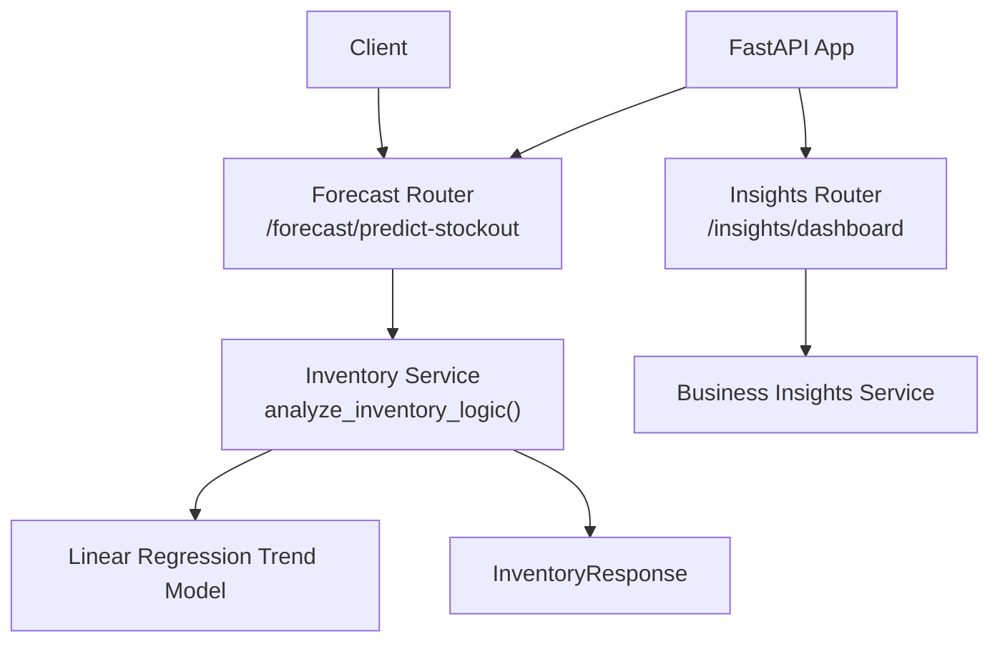
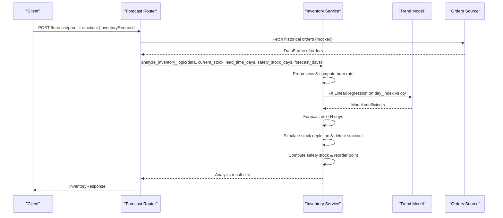
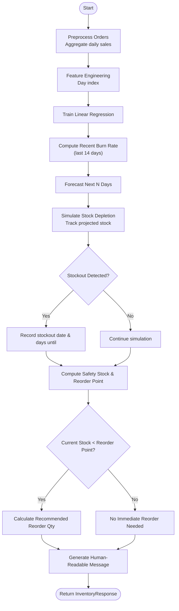
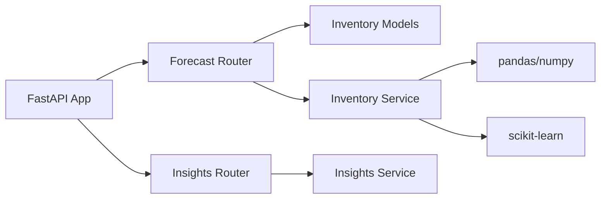

# Inventory Analysis

<cite>
**Referenced Files in This Document**
- [main.py](file://neurocom_backend/main.py)
- [forecast_router.py](file://neurocom_backend/routers/forecast_router.py)
- [inventory_analysis_model.py](file://neurocom_backend/models/inventory_analysis_model.py)
- [inventory.py](file://neurocom_backend/services/inventory.py)
- [insights.service.py](file://neurocom_backend/services/insights.service.py)
- [inisghts.router.py](file://neurocom_backend/routers/inisghts.router.py)
- [order.py](file://neurocom_backend/database/models/order.py)
- [product.py](file://neurocom_backend/database/models/product.py)
</cite>

## Table of Contents
1. [Introduction](#introduction)
2. [Project Structure](#project-structure)
3. [Core Components](#core-components)
4. [Architecture Overview](#architecture-overview)
5. [Detailed Component Analysis](#detailed-component-analysis)
6. [Dependency Analysis](#dependency-analysis)
7. [Performance Considerations](#performance-considerations)
8. [Troubleshooting Guide](#troubleshooting-guide)
9. [Conclusion](#conclusion)
10. [Appendices](#appendices)

## Introduction
This document explains the inventory analysis system that transforms raw order data into actionable stock optimization insights. It covers:
- Inventory health metrics (burn rate, stockout risk, projected stock)
- Stock turnover and reorder point calculations
- Reorder quantity recommendations
- Data processing pipeline from orders to forecasts
- API models (InventoryRequest, InventoryResponse), validation rules, and business logic
- Guidance for interpreting results, setting safety stock levels, and integrating with supply chain workflows

The system currently uses mock order data for demonstration but is designed to integrate with real marketplace APIs (e.g., Daraz, Shopify) and internal databases.

## Project Structure
The inventory analysis feature is exposed via a FastAPI router and implemented through a service layer that performs preprocessing, trend modeling, forecasting, and recommendation logic. Related models define request/response contracts and database schemas are available for future integration.

**Diagram sources**
- [forecast_router.py:21-49](file://neurocom_backend/routers/forecast_router.py#L21-L49)
- [inventory.py:38-119](file://neurocom_backend/services/inventory.py#L38-L119)
- [inisghts.router.py:17-31](file://neurocom_backend/routers/inisghts.router.py#L17-L31)
- [insights.service.py:93-182](file://neurocom_backend/services/insights.service.py#L93-L182)

**Section sources**
- [main.py:78-89](file://neurocom_backend/main.py#L78-L89)
- [forecast_router.py:1-49](file://neurocom_backend/routers/forecast_router.py#L1-L49)
- [inventory.py:1-121](file://neurocom_backend/services/inventory.py#L1-L121)
- [insights.service.py:1-183](file://neurocom_backend/services/insights.service.py#L1-L183)

## Core Components
- InventoryRequest and InventoryResponse models define input validation and output structure for stockout prediction.
- Forecast router exposes an endpoint to trigger analysis.
- Inventory service implements the core logic: preprocessing, burn rate calculation, trend forecasting, stockout simulation, and reorder recommendations.
- Business insights service provides complementary analytics (profitability, operations, dead stock, SLA risks).

Key responsibilities:
- Input validation via Pydantic fields and constraints
- Time-series preprocessing and feature engineering
- Simple linear regression for trend-based forecasting
- Safety stock and reorder point computation
- Actionable messaging and recommendations

**Section sources**
- [inventory_analysis_model.py:4-25](file://neurocom_backend/models/inventory_analysis_model.py#L4-L25)
- [forecast_router.py:21-49](file://neurocom_backend/routers/forecast_router.py#L21-L49)
- [inventory.py:38-119](file://neurocom_backend/services/inventory.py#L38-L119)
- [insights.service.py:12-44](file://neurocom_backend/services/insights.service.py#L12-L44)

## Architecture Overview
The end-to-end flow for inventory analysis:
1. Client calls POST /forecast/predict-stockout with InventoryRequest.
2. Router validates request and fetches historical orders (currently mocked).
3. Service preprocesses orders, computes burn rate, trains a trend model, and forecasts daily sales.
4. Service simulates stock depletion to detect potential stockout dates and calculates recommended reorder quantities.
5. Response includes forecast details, stockout indicators, and messages.

**Diagram sources**
- [forecast_router.py:21-49](file://neurocom_backend/routers/forecast_router.py#L21-L49)
- [inventory.py:38-119](file://neurocom_backend/services/inventory.py#L38-L119)

## Detailed Component Analysis

### Models: InventoryRequest and InventoryResponse
- InventoryRequest
  - sku: string identifier for the product
  - current_stock: positive integer representing physical inventory count
  - lead_time_days: supplier delivery time in days (default 7)
  - safety_stock_days: buffer days to maintain (default 3)
  - forecast_days: horizon for predictions (default 30)
- DailyForecast
  - date: forecast date
  - predicted_sales: expected units sold per day
  - projected_stock: remaining stock after predicted sales
- InventoryResponse
  - sku: product identifier
  - analysis_date: date of analysis
  - stockout_predicted: boolean indicating if stockout is expected within forecast horizon
  - stockout_date: first date when stock reaches zero or below
  - days_until_stockout: number of days until stockout
  - recommended_reorder_qty: suggested order quantity to avoid stockout
  - burn_rate_daily: recent average daily sales used for planning
  - forecast_data: list of daily forecasts
  - message: human-readable summary and action guidance

Validation rules:
- current_stock must be greater than zero
- All numeric fields have sensible defaults and types enforced by Pydantic

**Section sources**
- [inventory_analysis_model.py:4-25](file://neurocom_backend/models/inventory_analysis_model.py#L4-L25)

### Forecast Endpoint: /forecast/predict-stockout
- Purpose: Trigger inventory analysis for a given SKU and parameters
- Behavior:
  - Validates request body against InventoryRequest
  - Retrieves historical orders (currently mocked)
  - Calls inventory service to perform analysis
  - Returns InventoryResponse including forecast and recommendations
- Error handling: Raises HTTP 500 on unexpected exceptions

**Section sources**
- [forecast_router.py:21-49](file://neurocom_backend/routers/forecast_router.py#L21-L49)

### Inventory Service: Data Processing Pipeline
The service implements a clear pipeline from raw orders to insights:

1. Preprocessing
   - Parse order dates and aggregate daily sales across platforms
2. Feature Engineering
   - Create a day index to capture temporal progression
3. Trend Modeling
   - Train a linear regression model on day index vs daily sales
   - Note: For production seasonality, consider Prophet or ARIMA
4. Burn Rate Calculation
   - Use last 14 days of sales to estimate immediate consumption
5. Forecasting
   - Predict daily sales for the requested horizon
   - Ensure non-negative predictions
6. Stockout Simulation
   - Iteratively subtract predicted sales from current stock
   - Record projected stock each day and detect first stockout
7. Recommendations
   - Safety stock = burn rate × safety_stock_days
   - Reorder point = (burn rate × lead_time_days) + safety stock
   - If current stock < reorder point, recommend ordering enough to cover target horizon plus lead time coverage
8. Messaging
   - Provide clear alerts if stockout is predicted and whether immediate reorder is advised

**Diagram sources**
- [inventory.py:38-119](file://neurocom_backend/services/inventory.py#L38-L119)

**Section sources**
- [inventory.py:9-119](file://neurocom_backend/services/inventory.py#L9-L119)

### Business Insights: Complementary Analytics
While not part of the core inventory forecasting, the insights module provides:
- Profitability analysis per SKU
- Operational metrics (returns, cancellations)
- Dead stock identification
- SLA risk alerts for pending orders

These can complement inventory decisions by highlighting underperforming SKUs and operational bottlenecks.

**Section sources**
- [insights.service.py:12-182](file://neurocom_backend/services/insights.service.py#L12-L182)
- [inisghts.router.py:17-31](file://neurocom_backend/routers/inisghts.router.py#L17-L31)

### Database Models: Orders and Products
- Order and ProductOrder models define the schema for orders and line items, enabling future integration with persistent storage.
- These models support relationships with customers and products, facilitating richer analytics once connected.

**Section sources**
- [order.py:11-39](file://neurocom_backend/database/models/order.py#L11-L39)
- [product.py:13-21](file://neurocom_backend/database/models/product.py#L13-L21)

## Dependency Analysis
- Router depends on models and services
- Service depends on pandas, numpy, scikit-learn for data processing and modeling
- Main app mounts routers and configures CORS middleware
- Insights router depends on insights service

**Diagram sources**
- [main.py:78-89](file://neurocom_backend/main.py#L78-L89)
- [forecast_router.py:1-49](file://neurocom_backend/routers/forecast_router.py#L1-L49)
- [inventory.py:1-121](file://neurocom_backend/services/inventory.py#L1-L121)
- [insights.service.py:1-183](file://neurocom_backend/services/insights.service.py#L1-L183)

**Section sources**
- [main.py:78-89](file://neurocom_backend/main.py#L78-L89)
- [forecast_router.py:1-49](file://neurocom_backend/routers/forecast_router.py#L1-L49)
- [inventory.py:1-121](file://neurocom_backend/services/inventory.py#L1-L121)
- [insights.service.py:1-183](file://neurocom_backend/services/insights.service.py#L1-L183)

## Performance Considerations
- The current trend model is simple linear regression; it may not capture seasonality well. Consider advanced time series models (Prophet, ARIMA) for production.
- Burn rate uses a rolling window (last 14 days) to reflect recent demand; adjust window size based on demand volatility.
- Forecast horizon should balance accuracy and computational cost; longer horizons increase uncertainty.
- Mock data generation simulates weekend spikes and occasional flash sales; ensure real data pipelines handle similar patterns.

[No sources needed since this section provides general guidance]

## Troubleshooting Guide
Common issues and resolutions:
- Invalid input: Ensure current_stock > 0 and all required fields are provided; Pydantic will enforce these constraints.
- Unexpected errors: The router raises HTTP 500 on exceptions; check logs for stack traces and validate data shapes passed to the service.
- Poor forecast accuracy: If predictions are inaccurate due to seasonality or outliers, switch to more robust models and add features like day-of-week indicators.
- Missing data: Ensure order dates are valid and aggregated correctly; handle missing platforms or inconsistent timestamps.

**Section sources**
- [forecast_router.py:21-49](file://neurocom_backend/routers/forecast_router.py#L21-L49)
- [inventory.py:38-119](file://neurocom_backend/services/inventory.py#L38-L119)

## Conclusion
The inventory analysis system provides a practical foundation for stock optimization:
- Clear API contracts for requests and responses
- Transparent business logic for burn rate, safety stock, and reorder points
- Actionable forecasts and stockout predictions
- Extensible architecture to integrate real marketplace data and advanced forecasting models

Adopting the recommendations above will improve accuracy and reliability, enabling better supply chain coordination and reduced stockouts.

[No sources needed since this section summarizes without analyzing specific files]

## Appendices

### Interpreting Analysis Results
- Burn rate: Indicates recent consumption; use it to gauge short-term demand trends.
- Stockout predicted: If true, plan immediate replenishment to avoid lost sales.
- Days until stockout: Helps prioritize actions; smaller values require urgent attention.
- Recommended reorder qty: Suggests how many units to order to meet target coverage and lead time.
- Message: Summarizes critical alerts and recommended actions.

### Setting Optimal Safety Stock Levels
- Increase safety_stock_days for high variability or long lead times
- Decrease for stable demand and reliable suppliers
- Monitor service level targets and adjust accordingly

### Integrating with Supply Chain Workflows
- Replace mock order fetching with real API calls to marketplaces or internal systems
- Persist forecasts and recommendations to a database for audit and reporting
- Integrate with procurement systems to auto-generate purchase orders when thresholds are breached
- Use insights dashboard to align inventory decisions with profitability and operational performance

[No sources needed since this section provides general guidance]