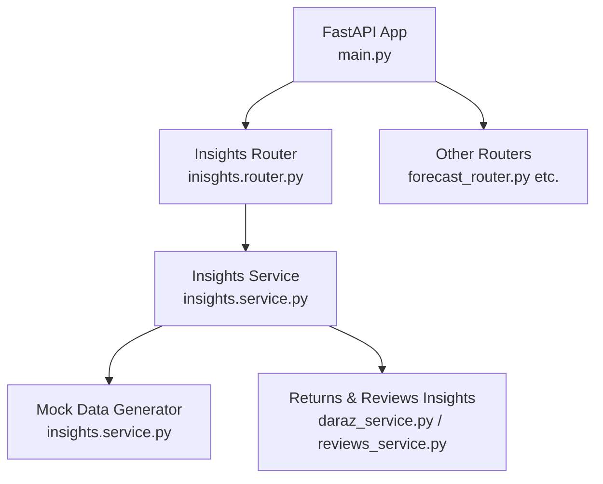
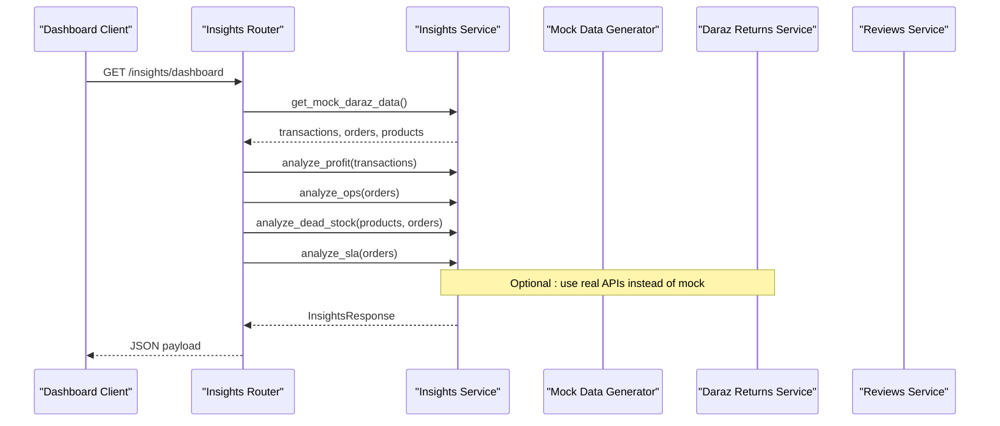
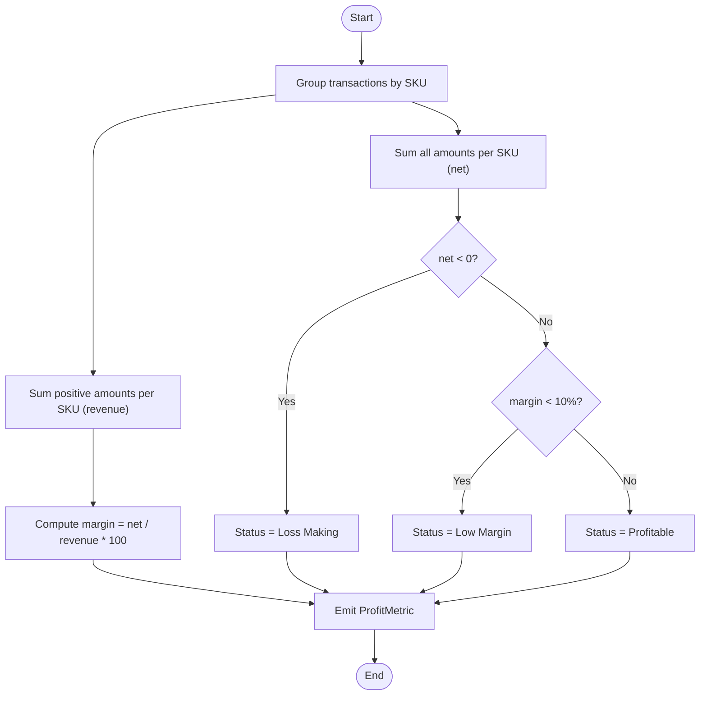
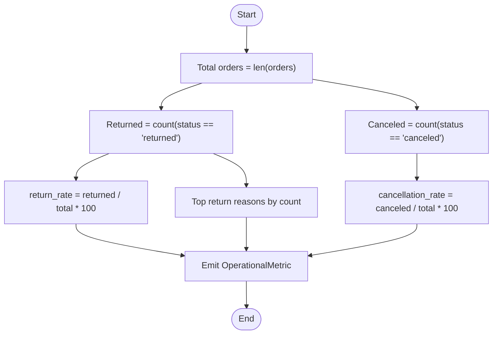
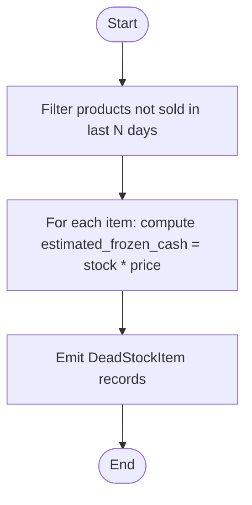
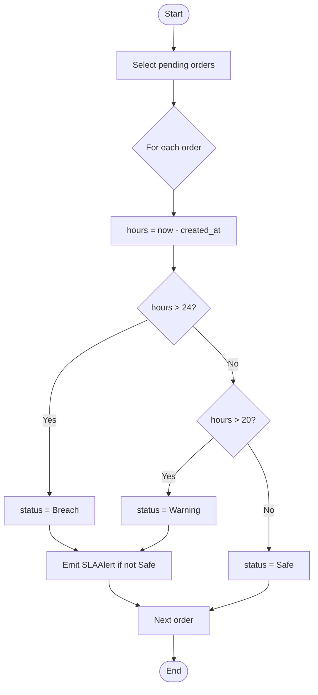
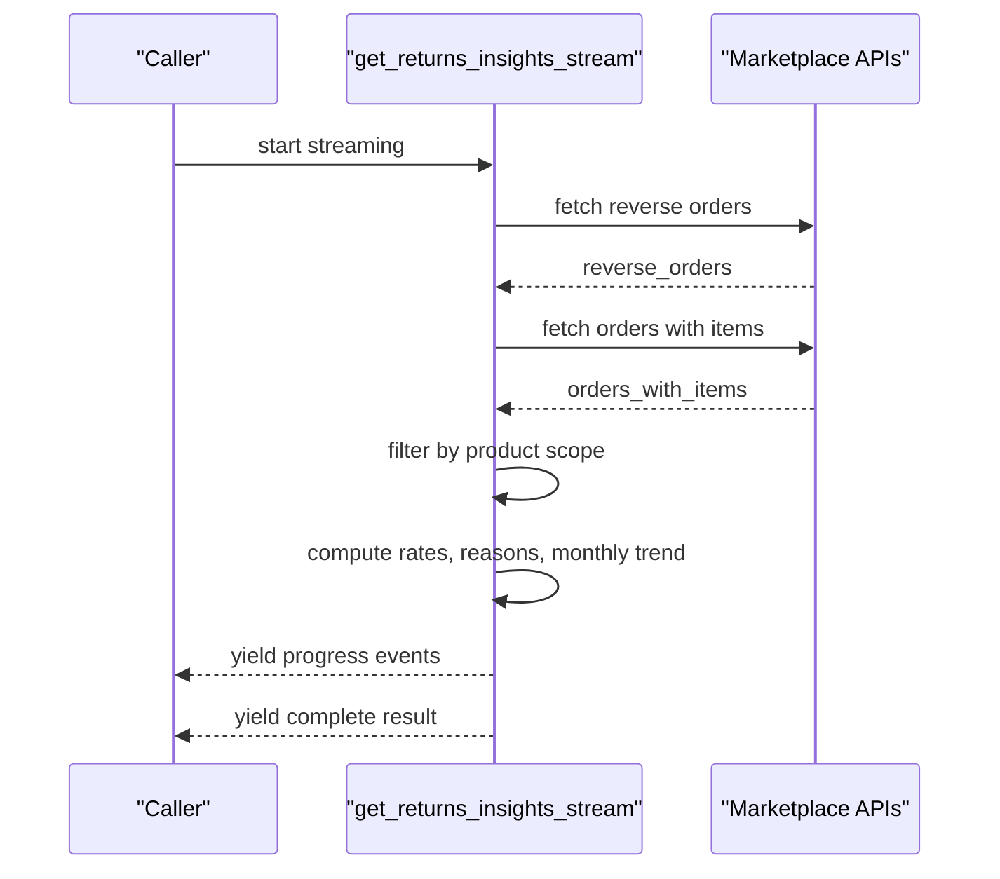
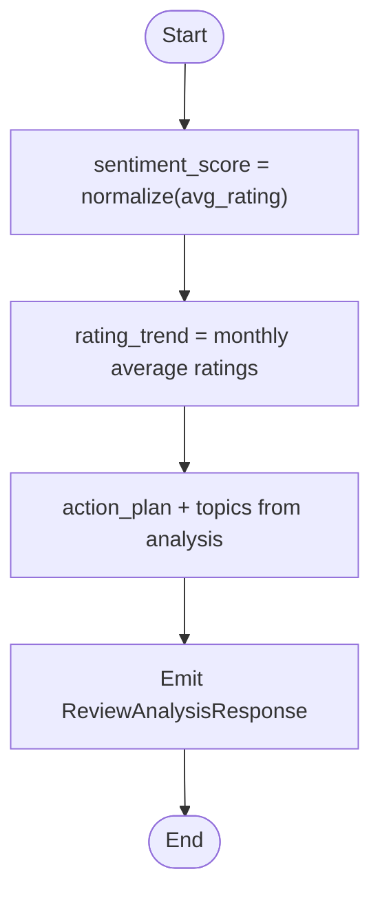
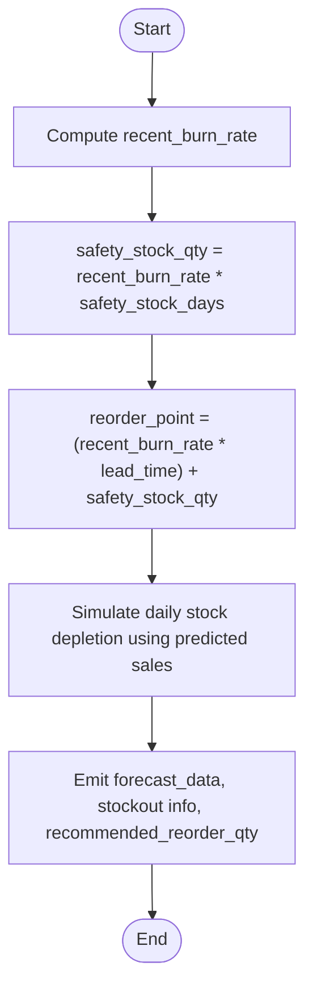
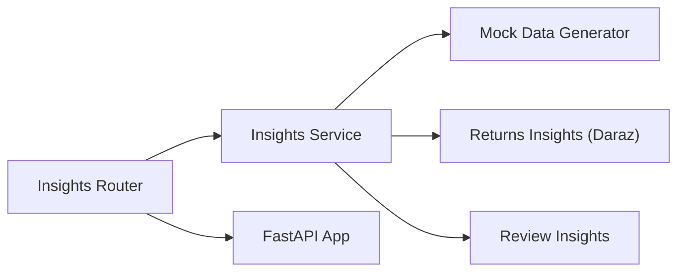

# Performance Insights

<cite>
**Referenced Files in This Document**
- [main.py](file://neurocom_backend/main.py)
- [inisghts.router.py](file://neurocom_backend/routers/inisghts.router.py)
- [insights.service.py](file://neurocom_backend/services/insights.service.py)
- [inventory_analysis_model.py](file://neurocom_backend/models/inventory_analysis_model.py)
- [daraz_service.py](file://neurocom_backend/services/daraz_service.py)
- [reviews_service.py](file://neurocom_backend/services/reviews_service.py)
- [review_model.py](file://neurocom_backend/models/review_model.py)
</cite>

## Table of Contents
1. Introduction
2. Project Structure
3. Core Components
4. Architecture Overview
5. Detailed Component Analysis
6. Dependency Analysis
7. Performance Considerations
8. Troubleshooting Guide
9. Conclusion
10. Appendices

## Introduction
This document explains the performance insights engine that aggregates business metrics, computes KPIs, and generates actionable insights for merchants. It covers profitability analysis, operational metrics, dead stock detection, SLA risk alerts, returns insights with trend analysis, and review sentiment scoring. It also describes how these components integrate into dashboards and reporting flows, including example outputs and configuration points for thresholds and custom metrics.

## Project Structure
The insights functionality is exposed via a FastAPI router and implemented through service functions that operate on dataframes or API responses. The application mounts routers and provides endpoints consumed by dashboards and reporting tools.

**Diagram sources**
- [main.py:29-89](file://neurocom_backend/main.py#L29-L89)
- [inisghts.router.py:15-31](file://neurocom_backend/routers/inisghts.router.py#L15-L31)
- [insights.service.py:1-183](file://neurocom_backend/services/insights.service.py#L1-L183)

**Section sources**
- [main.py:29-89](file://neurocom_backend/main.py#L29-L89)
- [inisghts.router.py:15-31](file://neurocom_backend/routers/inisghts.router.py#L15-L31)

## Core Components
- Profitability analysis: Computes per-SKU revenue, costs, net profit, margin percentage, and status classification.
- Operational metrics: Aggregates total orders, return rate, cancellation rate, and top return reasons.
- Dead stock detection: Identifies items not sold within a threshold window and estimates frozen cash.
- SLA risk alerts: Flags pending orders approaching or breaching delivery SLAs based on elapsed time.
- Returns insights: Streams computation over returns and orders to produce reason breakdowns, monthly trends, dispute/refund rates, and recommendations.
- Review sentiment: Calculates a normalized sentiment score from ratings and builds monthly rating trends.

**Section sources**
- [insights.service.py:12-43](file://neurocom_backend/services/insights.service.py#L12-L43)
- [insights.service.py:93-183](file://neurocom_backend/services/insights.service.py#L93-L183)
- [daraz_service.py:1340-1467](file://neurocom_backend/services/daraz_service.py#L1340-L1467)
- [reviews_service.py:105-126](file://neurocom_backend/services/reviews_service.py#L105-L126)

## Architecture Overview
The dashboard endpoint orchestrates multiple analyses and returns a unified response. Each analysis function encapsulates its own logic and data contracts.

**Diagram sources**
- [inisghts.router.py:17-31](file://neurocom_backend/routers/inisghts.router.py#L17-L31)
- [insights.service.py:47-89](file://neurocom_backend/services/insights.service.py#L47-L89)
- [insights.service.py:93-183](file://neurocom_backend/services/insights.service.py#L93-L183)

## Detailed Component Analysis

### Profitability Engine
- Aggregates transaction amounts by SKU to derive net profit.
- Derives revenue as the sum of positive amounts per SKU.
- Computes margin percentage and classifies status: profitable, loss making, or low margin.
- Outputs a sorted list of SKUs by net profit for prioritization.

**Diagram sources**
- [insights.service.py:93-122](file://neurocom_backend/services/insights.service.py#L93-L122)

**Section sources**
- [insights.service.py:93-122](file://neurocom_backend/services/insights.service.py#L93-L122)

### Operational Metrics Engine
- Counts total orders, returned orders, and canceled orders.
- Computes return and cancellation rates as percentages.
- Aggregates top return reasons by frequency.

**Diagram sources**
- [insights.service.py:124-137](file://neurocom_backend/services/insights.service.py#L124-L137)

**Section sources**
- [insights.service.py:124-137](file://neurocom_backend/services/insights.service.py#L124-L137)

### Dead Stock Detection
- Identifies items not sold within a defined window (mocked here).
- Estimates frozen cash as current stock multiplied by product price.
- Emits a list of dead stock items with key identifiers.

**Diagram sources**
- [insights.service.py:139-157](file://neurocom_backend/services/insights.service.py#L139-L157)

**Section sources**
- [insights.service.py:139-157](file://neurocom_backend/services/insights.service.py#L139-L157)

### SLA Risk Alerts
- Scans pending orders and calculates hours since creation.
- Applies thresholds: warning above a set hour count, breach beyond another.
- Emits alerts sorted by urgency.

**Diagram sources**
- [insights.service.py:159-182](file://neurocom_backend/services/insights.service.py#L159-L182)

**Section sources**
- [insights.service.py:159-182](file://neurocom_backend/services/insights.service.py#L159-L182)

### Returns Insights and Recommendations
- Streams fetching of reverse orders and orders with items.
- Filters by product scope (SKU or product ID).
- Computes overall return rate, dispute rate, refund request rate, reason breakdown, and monthly trends.
- Generates recommendations based on thresholds (e.g., high return rate, top reason, disputes).

**Diagram sources**
- [daraz_service.py:1340-1467](file://neurocom_backend/services/daraz_service.py#L1340-L1467)

**Section sources**
- [daraz_service.py:1340-1467](file://neurocom_backend/services/daraz_service.py#L1340-L1467)

### Review Sentiment and Trends
- Computes a normalized sentiment score from star ratings.
- Builds monthly rating trends to detect emerging issues.
- Produces an action plan and topics derived from clustering and LLM-based summarization.

**Diagram sources**
- [reviews_service.py:105-126](file://neurocom_backend/services/reviews_service.py#L105-L126)
- [reviews_service.py:282-303](file://neurocom_backend/services/reviews_service.py#L282-L303)
- [review_model.py:19-25](file://neurocom_backend/models/review_model.py#L19-L25)

**Section sources**
- [reviews_service.py:105-126](file://neurocom_backend/services/reviews_service.py#L105-L126)
- [reviews_service.py:282-303](file://neurocom_backend/services/reviews_service.py#L282-L303)
- [review_model.py:19-25](file://neurocom_backend/models/review_model.py#L19-L25)

### Inventory Forecasting Integration
- Uses recent burn rate and lead/safety stock parameters to forecast daily sales and projected stock levels.
- Predicts stockout date and recommends reorder quantities.

**Diagram sources**
- [inventory_analysis_model.py:4-25](file://neurocom_backend/models/inventory_analysis_model.py#L4-L25)
- [inventory_analysis_model.py:63-101](file://neurocom_backend/services/inventory.py#L63-L101)

**Section sources**
- [inventory_analysis_model.py:4-25](file://neurocom_backend/models/inventory_analysis_model.py#L4-L25)
- [inventory_analysis_model.py:63-101](file://neurocom_backend/services/inventory.py#L63-L101)

## Dependency Analysis
- Router depends on service functions to compute insights and assemble responses.
- Service functions depend on dataframes or marketplace API responses; currently uses mock data but can be swapped for live integrations.
- Returns insights depend on marketplace order and reverse order APIs.
- Review insights depend on review data and optional LLM-based summarization.

**Diagram sources**
- [inisghts.router.py:15-31](file://neurocom_backend/routers/inisghts.router.py#L15-L31)
- [insights.service.py:47-89](file://neurocom_backend/services/insights.service.py#L47-L89)
- [daraz_service.py:1340-1467](file://neurocom_backend/services/daraz_service.py#L1340-L1467)
- [reviews_service.py:105-126](file://neurocom_backend/services/reviews_service.py#L105-L126)

**Section sources**
- [inisghts.router.py:15-31](file://neurocom_backend/routers/inisghts.router.py#L15-L31)
- [insights.service.py:47-89](file://neurocom_backend/services/insights.service.py#L47-L89)

## Performance Considerations
- Use vectorized operations (pandas groupby, filtering) to minimize loops over large datasets.
- Cache repeated computations (e.g., aggregated metrics) when serving dashboards frequently.
- Stream long-running computations (as done in returns insights) to provide progressive updates.
- Avoid unnecessary object allocations inside hot loops; precompute constants like thresholds.
- Consider pagination or time-windowing for large order histories to reduce memory footprint.

[No sources needed since this section provides general guidance]

## Troubleshooting Guide
- Missing or malformed dates: Ensure timestamps are parsed consistently; handle exceptions gracefully to avoid failing entire requests.
- Zero denominators: Guard against division by zero when computing rates (e.g., total orders equals zero).
- Threshold tuning: Adjust SLA warning/breach thresholds and margin thresholds based on category norms.
- Data consistency: Validate that SKU/product IDs map correctly across orders and returns; mismatches can skew metrics.
- Streaming completion: Confirm that streaming consumers handle both progress and complete events properly.

**Section sources**
- [insights.service.py:124-137](file://neurocom_backend/services/insights.service.py#L124-L137)
- [insights.service.py:159-182](file://neurocom_backend/services/insights.service.py#L159-L182)
- [daraz_service.py:1340-1467](file://neurocom_backend/services/daraz_service.py#L1340-L1467)

## Conclusion
The performance insights engine provides a modular, extensible foundation for merchant analytics. It computes core KPIs (profitability, operations, dead stock, SLA risks), enriches them with returns insights and review sentiment, and exposes results via a clean API for dashboards. Thresholds and logic can be tuned to match business needs, and the design supports swapping mock data for live marketplace integrations.

[No sources needed since this section summarizes without analyzing specific files]

## Appendices

### API Endpoints and Contracts
- Dashboard endpoint:
  - Method: GET
  - Path: /insights/dashboard
  - Response model: InsightsResponse containing profitability, operations, dead_stock, sla_risks

- Business insights router prefix:
  - Prefix: /business-insights (router defined in service file)

**Section sources**
- [inisghts.router.py:15-31](file://neurocom_backend/routers/inisghts.router.py#L15-L31)
- [insights.service.py:8-43](file://neurocom_backend/services/insights.service.py#L8-L43)

### Example Outputs
- Profitability: Per-SKU revenue, costs, net profit, margin percent, status.
- Operations: Total orders, return rate, cancellation rate, top return reasons.
- Dead stock: SKU, product name, days since last sale, current stock, estimated frozen cash.
- SLA risks: Order ID, hours since order, status (Safe/Warning/Breach), items.
- Returns insights: Overall return rate, dispute rate, refund request rate, reason breakdown, monthly trend, recommendations.
- Review insights: Sentiment score, rating trend, summary, topics, action plan.

**Section sources**
- [insights.service.py:12-43](file://neurocom_backend/services/insights.service.py#L12-L43)
- [daraz_service.py:1436-1450](file://neurocom_backend/services/daraz_service.py#L1436-L1450)
- [reviews_service.py:282-303](file://neurocom_backend/services/reviews_service.py#L282-L303)

### Custom Metric Configuration
- SLA thresholds: Warning and breach hours can be adjusted in the SLA alert logic.
- Profit margins: Low-margin threshold can be tuned in profitability classification.
- Dead stock window: Days-since-last-sale threshold can be parameterized.
- Return thresholds: Recommendation triggers (e.g., overall return rate >= 10%) can be configured.

**Section sources**
- [insights.service.py:109-112](file://neurocom_backend/services/insights.service.py#L109-L112)
- [insights.service.py:170-172](file://neurocom_backend/services/insights.service.py#L170-L172)
- [daraz_service.py:1418-1434](file://neurocom_backend/services/daraz_service.py#L1418-L1434)

### Integration with Reporting Dashboards
- Mount routers in the main app to expose endpoints.
- Consume /insights/dashboard for consolidated metrics.
- Use streaming endpoints for long-running analyses to update UI progressively.
- Map response models to frontend charts and tables.

**Section sources**
- [main.py:29-89](file://neurocom_backend/main.py#L29-L89)
- [inisghts.router.py:17-31](file://neurocom_backend/routers/inisghts.router.py#L17-L31)