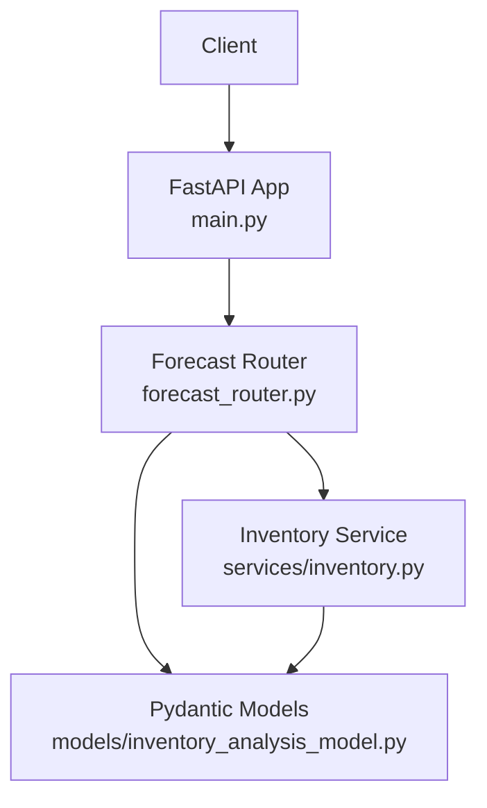
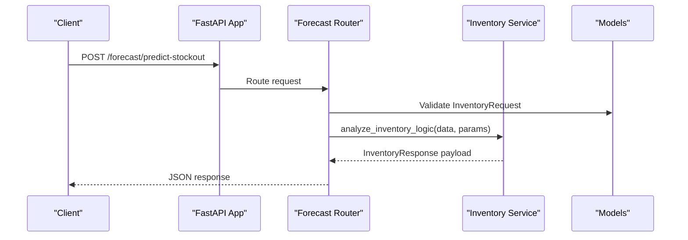
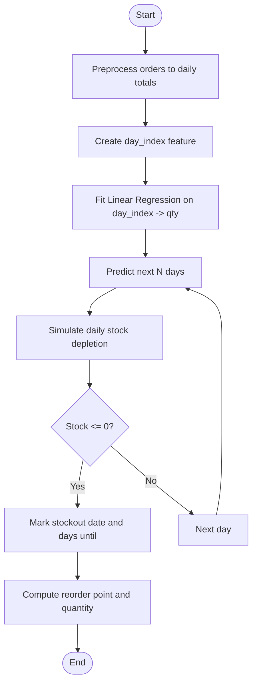
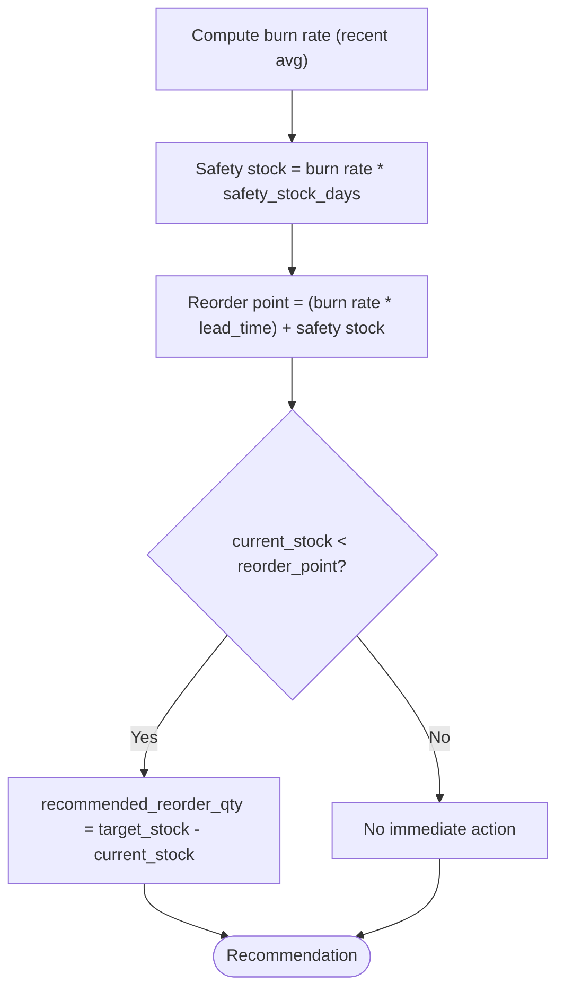
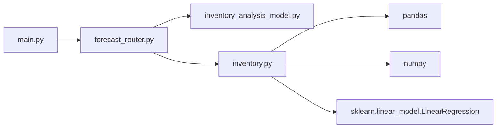

# Sales Forecasting

<cite>
**Referenced Files in This Document**
- [main.py](file://neurocom_backend/main.py)
- [forecast_router.py](file://neurocom_backend/routers/forecast_router.py)
- [inventory_analysis_model.py](file://neurocom_backend/models/inventory_analysis_model.py)
- [inventory.py](file://neurocom_backend/services/inventory.py)
- [README.md](file://README.md)
</cite>

## Table of Contents
1. [Introduction](#introduction)
2. [Project Structure](#project-structure)
3. [Core Components](#core-components)
4. [Architecture Overview](#architecture-overview)
5. [Detailed Component Analysis](#detailed-component-analysis)
6. [Dependency Analysis](#dependency-analysis)
7. [Performance Considerations](#performance-considerations)
8. [Troubleshooting Guide](#troubleshooting-guide)
9. [Conclusion](#conclusion)
10. [Appendices](#appendices)

## Introduction
This document explains the sales forecasting system in the Tijarah AI Backend, focusing on stockout prediction, demand forecasting models, and inventory level optimization techniques. It documents the forecast API endpoints, input parameters (SKU, current stock, lead time, safety stock days), and output predictions. It also details the machine learning approach used for trend analysis, seasonal pattern detection, and future demand estimation, along with example requests/responses and model accuracy considerations.

## Project Structure
The forecasting feature is implemented as a FastAPI router that exposes an endpoint to predict stockouts and generate daily forecasts. The service layer performs data preprocessing, training a simple linear regression model for trend, simulating seasonality via mock data, and computing reorder recommendations. Pydantic models define request/response schemas.

**Diagram sources**
- [main.py:29-89](file://neurocom_backend/main.py#L29-L89)
- [forecast_router.py:15-49](file://neurocom_backend/routers/forecast_router.py#L15-L49)
- [inventory.py:9-120](file://neurocom_backend/services/inventory.py#L9-L120)
- [inventory_analysis_model.py:4-25](file://neurocom_backend/models/inventory_analysis_model.py#L4-L25)

**Section sources**
- [main.py:29-89](file://neurocom_backend/main.py#L29-L89)
- [README.md:1-6](file://README.md#L1-L6)

## Core Components
- Forecast API Router: Exposes endpoints under /forecast and handles request validation and response formatting.
- Inventory Service: Implements data generation (mock orders), preprocessing, ML modeling (linear regression for trend), stockout simulation, and reorder recommendations.
- Pydantic Models: Define structured request and response schemas for type safety and documentation.

Key responsibilities:
- Input validation and routing (router).
- Data ingestion and transformation (service).
- Model training and inference (service).
- Output schema enforcement (models).

**Section sources**
- [forecast_router.py:15-49](file://neurocom_backend/routers/forecast_router.py#L15-L49)
- [inventory.py:9-120](file://neurocom_backend/services/inventory.py#L9-L120)
- [inventory_analysis_model.py:4-25](file://neurocom_backend/models/inventory_analysis_model.py#L4-L25)

## Architecture Overview
The forecasting pipeline processes historical order data to estimate future demand and detect potential stockouts. It uses a linear regression model over a day index to capture trend, while seasonality is represented in the mock data generator. Recommendations are derived from burn rate, lead time, and safety stock policies.

**Diagram sources**
- [main.py:29-89](file://neurocom_backend/main.py#L29-L89)
- [forecast_router.py:15-49](file://neurocom_backend/routers/forecast_router.py#L15-L49)
- [inventory.py:38-120](file://neurocom_backend/services/inventory.py#L38-L120)
- [inventory_analysis_model.py:4-25](file://neurocom_backend/models/inventory_analysis_model.py#L4-L25)

## Detailed Component Analysis

### Forecast API Endpoints
- Base path: /forecast
- Endpoint: POST /forecast/predict-stockout
  - Purpose: Predict stockout risk and generate daily forecasts given SKU, current stock, lead time, safety stock days, and forecast horizon.
  - Request body fields:
    - sku: string identifier for the product
    - current_stock: integer, must be greater than 0
    - lead_time_days: integer, default 7
    - safety_stock_days: integer, default 3
    - forecast_days: integer, default 30
  - Response fields:
    - sku: string
    - analysis_date: string date
    - stockout_predicted: boolean
    - stockout_date: optional string date
    - days_until_stockout: optional integer
    - recommended_reorder_qty: integer
    - burn_rate_daily: float
    - forecast_data: list of daily entries with date, predicted_sales, projected_stock
    - message: human-readable status or recommendation

Example request:
- Method: POST
- URL: /forecast/predict-stockout
- Body:
  - sku: "SKU-12345"
  - current_stock: 120
  - lead_time_days: 7
  - safety_stock_days: 3
  - forecast_days: 30

Example response:
- stockout_predicted: true/false
- stockout_date: "YYYY-MM-DD" or null
- days_until_stockout: integer or null
- recommended_reorder_qty: integer
- burn_rate_daily: float
- forecast_data: array of daily forecasts
- message: text summary

Notes:
- Authentication: The router is included with authentication dependency in the main app; ensure valid credentials when calling.
- CORS: Enabled for configured origins.

**Section sources**
- [forecast_router.py:15-49](file://neurocom_backend/routers/forecast_router.py#L15-L49)
- [inventory_analysis_model.py:4-25](file://neurocom_backend/models/inventory_analysis_model.py#L4-L25)
- [main.py:78-89](file://neurocom_backend/main.py#L78-L89)

### Stockout Prediction Algorithm
The algorithm simulates daily consumption based on predicted sales and tracks running stock to identify the first day stock reaches zero or below.

Processing steps:
- Preprocess historical orders into daily totals.
- Create a day index feature to fit a linear trend model.
- Train linear regression on day_index vs daily qty.
- Generate predictions for the next N days.
- Simulate stock depletion day-by-day starting from current stock.
- Detect the first day where stock becomes non-positive to mark stockout.

**Diagram sources**
- [inventory.py:38-120](file://neurocom_backend/services/inventory.py#L38-L120)

**Section sources**
- [inventory.py:38-120](file://neurocom_backend/services/inventory.py#L38-L120)

### Demand Forecasting Models
- Trend analysis: Linear regression over day_index captures overall upward or downward trends in daily sales.
- Seasonal pattern detection: The mock data generator introduces weekend spikes to simulate weekly seasonality. In production, comments indicate using Prophet or ARIMA to better capture seasonality and holidays.
- Future demand estimation: Predictions are generated by extending the fitted linear model into the future window specified by forecast_days.

Model characteristics:
- Simplicity: Linear regression provides fast, interpretable trend estimates.
- Limitations: Does not explicitly model seasonality or external events; relies on mock data patterns for demonstration.
- Production readiness: Replace with advanced time series models (Prophet, ARIMA) to improve accuracy and robustness.

**Section sources**
- [inventory.py:43-65](file://neurocom_backend/services/inventory.py#L43-L65)

### Inventory Level Optimization Techniques
- Burn rate calculation: Uses recent daily sales average (last 14 days) to reflect immediate demand velocity.
- Safety stock: Computed as burn rate multiplied by safety_stock_days to buffer against variability.
- Reorder point: Derived as (burn rate * lead_time_days) + safety_stock_qty.
- Reorder recommendation: If current stock is below reorder point, recommend ordering enough to cover target horizon (e.g., 30 days) plus lead time coverage.

**Diagram sources**
- [inventory.py:91-103](file://neurocom_backend/services/inventory.py#L91-L103)

**Section sources**
- [inventory.py:56-103](file://neurocom_backend/services/inventory.py#L56-L103)

### Machine Learning Approach Summary
- Current implementation: Linear regression for trend detection; seasonality simulated via mock data.
- Planned improvements: Use Prophet or ARIMA for explicit seasonality and holiday effects; incorporate exogenous variables (promotions, price changes).
- Evaluation strategy: Track metrics such as MAE/MSE on holdout periods; monitor drift and retrain periodically.

[No sources needed since this section summarizes conceptual ML approach without analyzing specific files]

## Dependency Analysis
The forecasting module depends on FastAPI for routing, Pydantic for models, pandas/numpy for data processing, and scikit-learn for linear regression.

**Diagram sources**
- [forecast_router.py:1-49](file://neurocom_backend/routers/forecast_router.py#L1-L49)
- [inventory.py:1-120](file://neurocom_backend/services/inventory.py#L1-L120)
- [main.py:29-89](file://neurocom_backend/main.py#L29-L89)

**Section sources**
- [forecast_router.py:1-49](file://neurocom_backend/routers/forecast_router.py#L1-L49)
- [inventory.py:1-120](file://neurocom_backend/services/inventory.py#L1-L120)
- [main.py:29-89](file://neurocom_backend/main.py#L29-L89)

## Performance Considerations
- Data volume: Mock data generation creates daily records for a configurable lookback window; ensure efficient grouping and aggregation for large datasets.
- Model complexity: Linear regression is lightweight; however, replacing it with more complex models may increase compute cost.
- Forecast horizon: Larger forecast_days increases computation and memory usage for projections.
- Real-time constraints: For high-throughput scenarios, consider caching results and batching requests.

[No sources needed since this section provides general guidance]

## Troubleshooting Guide
Common issues and resolutions:
- Authentication failures: Ensure the client includes valid credentials; the forecast router is mounted with authentication dependencies.
- Invalid inputs: Pydantic enforces current_stock > 0; adjust request payloads accordingly.
- Unexpected stockout predictions: Verify lead_time_days and safety_stock_days settings; check recent burn rate sensitivity.
- Error responses: Exceptions raise HTTP 500 with details; inspect server logs for stack traces.

**Section sources**
- [forecast_router.py:21-49](file://neurocom_backend/routers/forecast_router.py#L21-L49)
- [inventory_analysis_model.py:4-25](file://neurocom_backend/models/inventory_analysis_model.py#L4-L25)

## Conclusion
The Tijarah AI Backend’s forecasting system provides a practical foundation for stockout prediction and inventory optimization. It uses a simple linear regression model for trend analysis and simulates seasonality through mock data. The API exposes clear endpoints and structured responses to support downstream applications. For production-grade accuracy, consider adopting advanced time series models and robust evaluation pipelines.

[No sources needed since this section summarizes without analyzing specific files]

## Appendices

### API Reference
- Base Path: /forecast
- Endpoint: POST /forecast/predict-stockout
  - Request:
    - sku: string
    - current_stock: integer (>0)
    - lead_time_days: integer (default 7)
    - safety_stock_days: integer (default 3)
    - forecast_days: integer (default 30)
  - Response:
    - sku: string
    - analysis_date: string
    - stockout_predicted: boolean
    - stockout_date: string or null
    - days_until_stockout: integer or null
    - recommended_reorder_qty: integer
    - burn_rate_daily: float
    - forecast_data: array of {date, predicted_sales, projected_stock}
    - message: string

**Section sources**
- [forecast_router.py:15-49](file://neurocom_backend/routers/forecast_router.py#L15-L49)
- [inventory_analysis_model.py:4-25](file://neurocom_backend/models/inventory_analysis_model.py#L4-L25)

### Example Requests and Responses
- Example request:
  - POST /forecast/predict-stockout
  - Body:
    - sku: "SKU-12345"
    - current_stock: 120
    - lead_time_days: 7
    - safety_stock_days: 3
    - forecast_days: 30
- Example response:
  - stockout_predicted: true
  - stockout_date: "2025-10-10"
  - days_until_stockout: 12
  - recommended_reorder_qty: 150
  - burn_rate_daily: 10.5
  - forecast_data: [
      {"date": "2025-10-01", "predicted_sales": 10, "projected_stock": 110},
      {"date": "2025-10-02", "predicted_sales": 11, "projected_stock": 99}
    ]
  - message: "CRITICAL: Stockout predicted on 2025-10-10. Recommendation: Place order immediately."

[No sources needed since this section provides illustrative examples]

### Model Accuracy Metrics and Evaluation Methods
- Metrics: Mean Absolute Error (MAE), Root Mean Squared Error (RMSE), Mean Absolute Percentage Error (MAPE) on holdout sets.
- Evaluation:
  - Split historical data into train/validation/test windows.
  - Compute metrics per SKU or aggregated across products.
  - Monitor forecast bias and variance over time.
  - Retrain models periodically to adapt to demand shifts.

[No sources needed since this section provides general guidance]