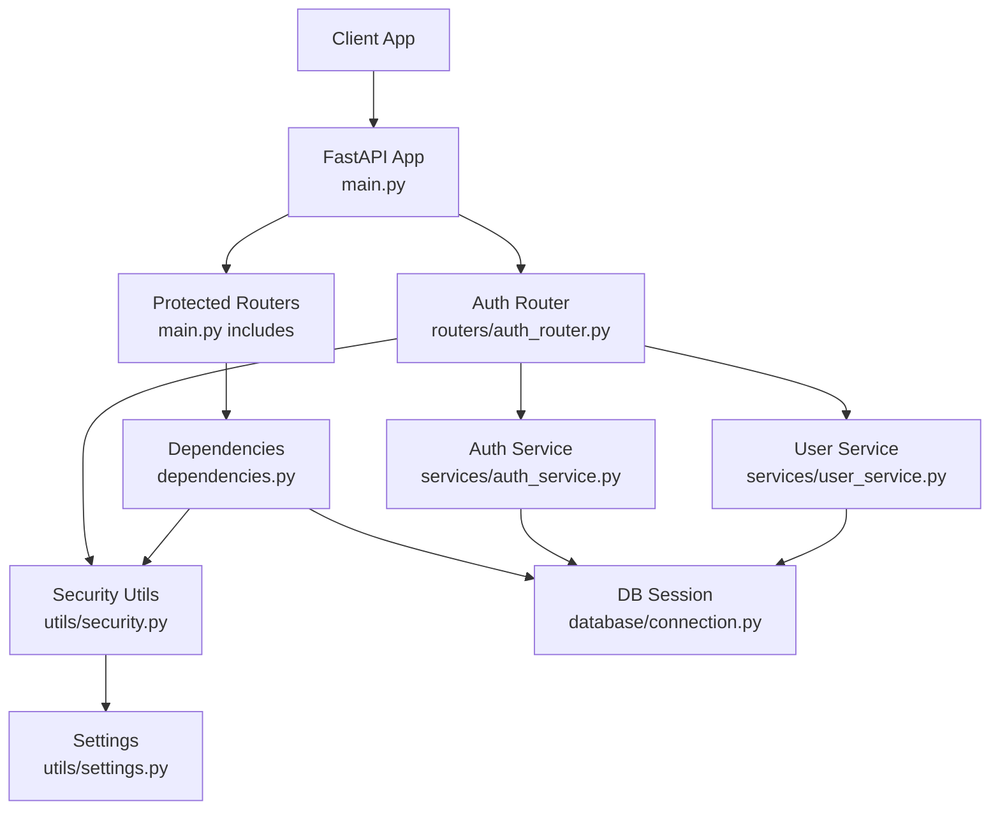
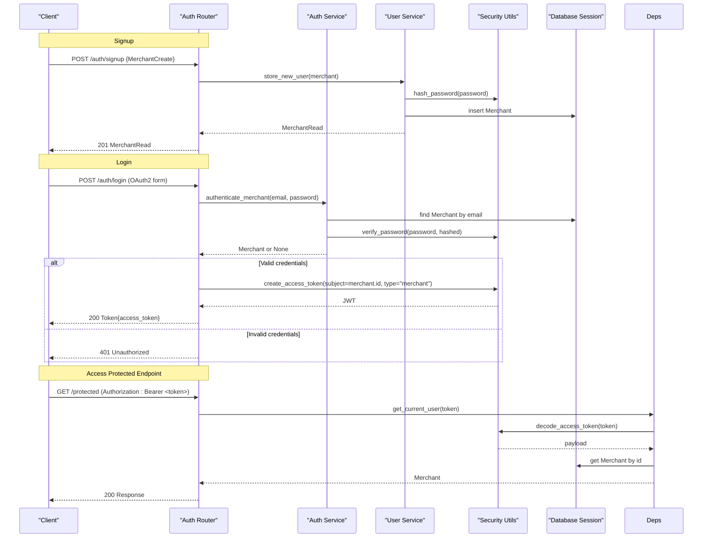
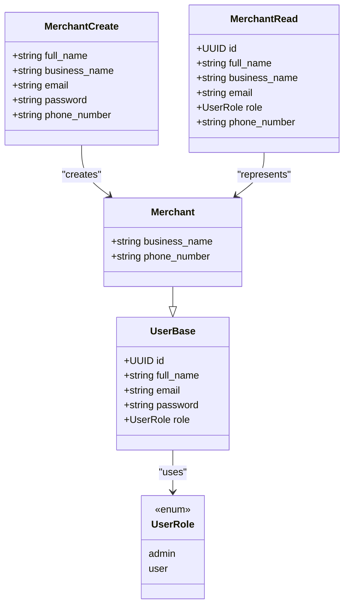
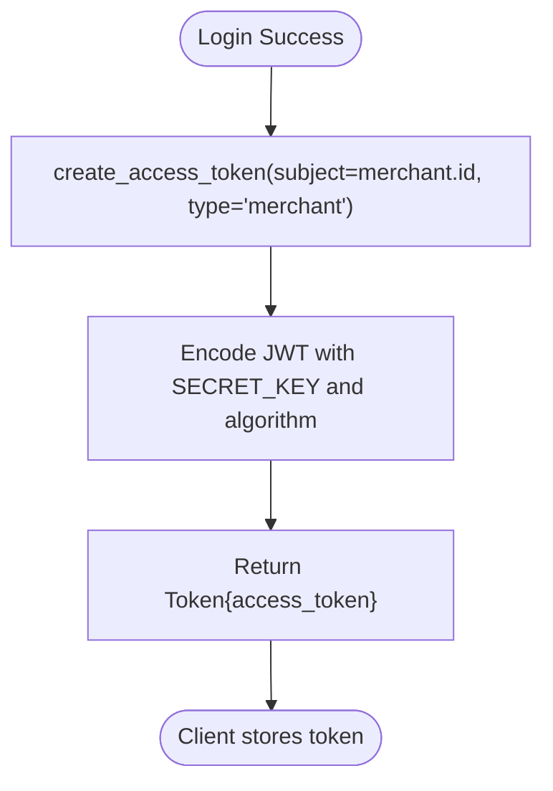
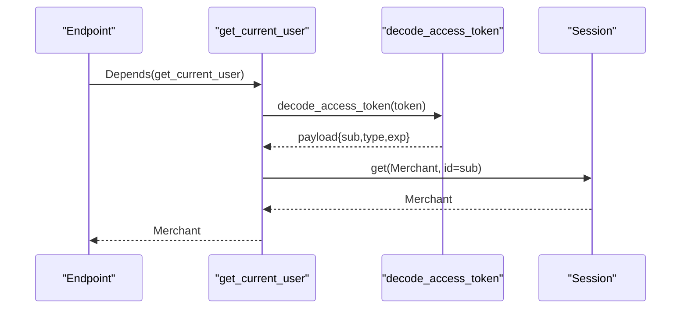
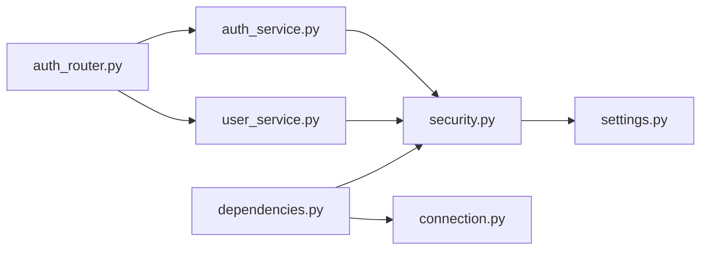

# Authentication System

<cite>
**Referenced Files in This Document**
- [main.py](file://neurocom_backend/main.py)
- [auth_router.py](file://neurocom_backend/routers/auth_router.py)
- [auth_service.py](file://neurocom_backend/services/auth_service.py)
- [user_service.py](file://neurocom_backend/services/user_service.py)
- [security.py](file://neurocom_backend/utils/security.py)
- [settings.py](file://neurocom_backend/utils/settings.py)
- [connection.py](file://neurocom_backend/database/connection.py)
- [merchant.py](file://neurocom_backend/database/models/merchant.py)
- [user.py](file://neurocom_backend/database/models/user.py)
- [auth.py](file://neurocom_backend/schemas/auth.py)
- [dependencies.py](file://neurocom_backend/dependencies.py)
</cite>

## Table of Contents
1. Introduction
2. Project Structure
3. Core Components
4. Architecture Overview
5. Detailed Component Analysis
6. Dependency Analysis
7. Performance Considerations
8. Troubleshooting Guide
9. Conclusion
10. Appendices

## Introduction
This document explains the authentication system for the Tijarah AI Backend. It covers JWT-based merchant authentication, including signup, login, token generation and validation, password hashing with bcrypt, role-based access control, dependency injection patterns for middleware and protected endpoints, security considerations, token refresh strategies, and best practices. It also provides usage patterns and error handling guidance mapped to the codebase.

## Project Structure
The authentication system is implemented across routers, services, models, utilities, and dependencies:
- Routers expose HTTP endpoints for authentication flows.
- Services encapsulate business logic (authentication, user creation).
- Models define database entities and schemas.
- Utilities handle security primitives (password hashing, JWT).
- Dependencies provide FastAPI dependency injection for current user resolution and role checks.
- Settings centralize configuration such as secrets and token expiration.

**Diagram sources**
- [main.py:29-89](file://neurocom_backend/main.py#L29-L89)
- [auth_router.py:15-42](file://neurocom_backend/routers/auth_router.py#L15-L42)
- [auth_service.py:1-11](file://neurocom_backend/services/auth_service.py#L1-L11)
- [user_service.py:1-25](file://neurocom_backend/services/user_service.py#L1-L25)
- [security.py:14-28](file://neurocom_backend/utils/security.py#L14-L28)
- [settings.py:11-15](file://neurocom_backend/utils/settings.py#L11-L15)
- [connection.py:25-27](file://neurocom_backend/database/connection.py#L25-L27)
- [dependencies.py:14-79](file://neurocom_backend/dependencies.py#L14-L79)

**Section sources**
- [main.py:29-89](file://neurocom_backend/main.py#L29-L89)
- [auth_router.py:15-42](file://neurocom_backend/routers/auth_router.py#L15-L42)
- [auth_service.py:1-11](file://neurocom_backend/services/auth_service.py#L1-L11)
- [user_service.py:1-25](file://neurocom_backend/services/user_service.py#L1-L25)
- [security.py:14-28](file://neurocom_backend/utils/security.py#L14-L28)
- [settings.py:11-15](file://neurocom_backend/utils/settings.py#L11-L15)
- [connection.py:25-27](file://neurocom_backend/database/connection.py#L25-L27)
- [dependencies.py:14-79](file://neurocom_backend/dependencies.py#L14-L79)

## Core Components
- Merchant model and schemas: defines merchant identity, roles, and request/response contracts.
- User base model: shared fields for users and merchants, including email uniqueness and role enum.
- Password hashing and verification: bcrypt via passlib.
- JWT token lifecycle: creation, decoding, and validation.
- Authentication router: signup, login, and current user retrieval.
- Dependency injection: current user resolution and role-based guards.
- Database session management: SQLModel sessions for persistence.

Key responsibilities:
- Signup: validate input, check uniqueness, hash password, persist merchant.
- Login: authenticate credentials, issue JWT.
- Protected endpoints: decode token, resolve merchant, enforce roles.

**Section sources**
- [merchant.py:11-29](file://neurocom_backend/database/models/merchant.py#L11-L29)
- [user.py:10-19](file://neurocom_backend/database/models/user.py#L10-L19)
- [security.py:14-28](file://neurocom_backend/utils/security.py#L14-L28)
- [auth_router.py:18-42](file://neurocom_backend/routers/auth_router.py#L18-L42)
- [auth_service.py:6-10](file://neurocom_backend/services/auth_service.py#L6-L10)
- [user_service.py:8-24](file://neurocom_backend/services/user_service.py#L8-L24)
- [dependencies.py:17-79](file://neurocom_backend/dependencies.py#L17-L79)

## Architecture Overview
The authentication flow uses FastAPI’s dependency injection to secure routes and manage sessions. The merchant signs up, logs in to receive a JWT, and then presents the token to access protected endpoints. Role-based access control restricts operations based on the merchant’s role.

**Diagram sources**
- [auth_router.py:18-42](file://neurocom_backend/routers/auth_router.py#L18-L42)
- [auth_service.py:6-10](file://neurocom_backend/services/auth_service.py#L6-L10)
- [user_service.py:8-24](file://neurocom_backend/services/user_service.py#L8-L24)
- [security.py:16-28](file://neurocom_backend/utils/security.py#L16-L28)
- [dependencies.py:17-43](file://neurocom_backend/dependencies.py#L17-L43)
- [connection.py:25-27](file://neurocom_backend/database/connection.py#L25-L27)

## Detailed Component Analysis

### Merchant and User Models
- UserBase defines shared fields: id, full_name, email (unique), password, role.
- UserRole enumerates admin and user.
- Merchant extends UserBase with business_name, phone_number, and relationships.
- MerchantCreate and MerchantRead define request and response contracts.

**Diagram sources**
- [user.py:10-19](file://neurocom_backend/database/models/user.py#L10-L19)
- [merchant.py:11-29](file://neurocom_backend/database/models/merchant.py#L11-L29)

**Section sources**
- [user.py:10-19](file://neurocom_backend/database/models/user.py#L10-L19)
- [merchant.py:11-29](file://neurocom_backend/database/models/merchant.py#L11-L29)

### Password Hashing and Verification
- Uses bcrypt via passlib CryptContext.
- hash_password creates a secure hash for storage.
- verify_password validates plain text against stored hash during login.

Best practices:
- Always hash passwords before storing.
- Use strong algorithms (bcrypt) and avoid custom schemes.
- Ensure SECRET_KEY is securely managed in environment variables.

**Section sources**
- [security.py:14-20](file://neurocom_backend/utils/security.py#L14-L20)
- [user_service.py:12-12](file://neurocom_backend/services/user_service.py#L12-L12)
- [auth_service.py:8-8](file://neurocom_backend/services/auth_service.py#L8-L8)

### JWT Token Generation and Validation
- create_access_token encodes subject (merchant id), account_type ("merchant"), and expiry into a signed JWT using HS256 by default.
- decode_access_token verifies signature and extracts payload.
- Token lifetime controlled by ACCESS_TOKEN_EXPIRE_MINUTES.

Token structure:
- sub: merchant id (string)
- type: "merchant"
- exp: expiration timestamp

Validation in dependencies:
- get_current_user resolves token from Authorization header.
- Ensures payload contains required fields and correct account_type.
- Retrieves merchant from DB to confirm existence.

**Diagram sources**
- [security.py:22-28](file://neurocom_backend/utils/security.py#L22-L28)
- [auth_router.py:29-37](file://neurocom_backend/routers/auth_router.py#L29-L37)

**Section sources**
- [security.py:22-28](file://neurocom_backend/utils/security.py#L22-L28)
- [settings.py:13-15](file://neurocom_backend/utils/settings.py#L13-L15)
- [auth_router.py:29-37](file://neurocom_backend/routers/auth_router.py#L29-L37)
- [dependencies.py:17-43](file://neurocom_backend/dependencies.py#L17-L43)

### Authentication Router Endpoints
- POST /auth/signup: Creates a new merchant with hashed password and returns MerchantRead.
- POST /auth/login: Authenticates merchant and returns JWT if valid; otherwise 401.
- GET /auth/me: Returns current authenticated merchant using dependency injection.

Error handling:
- Duplicate merchant email returns 400.
- Invalid credentials return 401 with WWW-Authenticate header.

Usage pattern:
- Clients send OAuth2PasswordRequestForm for login.
- Clients include Authorization: Bearer <token> for protected endpoints.

**Section sources**
- [auth_router.py:18-42](file://neurocom_backend/routers/auth_router.py#L18-L42)
- [user_service.py:8-24](file://neurocom_backend/services/user_service.py#L8-L24)

### Dependency Injection and Protected Endpoints
- get_current_user: Extracts token, decodes JWT, validates account_type, fetches merchant from DB.
- require_roles: Decorator-like dependency that enforces role constraints.
- require_admin: Predefined role guard for admin-only endpoints.
- Global protection: Many routers are included with dependencies=[Depends(get_current_user)] to enforce authentication at the router level.

WebSocket support:
- get_current_user_ws reads Authorization header directly from WebSocket handshake to authenticate WS connections.

**Diagram sources**
- [dependencies.py:17-43](file://neurocom_backend/dependencies.py#L17-L43)
- [security.py:27-28](file://neurocom_backend/utils/security.py#L27-L28)
- [connection.py:25-27](file://neurocom_backend/database/connection.py#L25-L27)

**Section sources**
- [dependencies.py:17-79](file://neurocom_backend/dependencies.py#L17-L79)
- [main.py:78-89](file://neurocom_backend/main.py#L78-L89)

### Role-Based Access Control
- Roles defined in UserRole: admin, user.
- Default role for new merchants is user.
- require_roles(*roles) ensures only specified roles can access an endpoint.
- require_admin is a convenience guard for admin-only routes.

Implementation notes:
- Combine with get_current_user to ensure both authentication and authorization.
- Enforce roles per endpoint or router-level where appropriate.

**Section sources**
- [user.py:10-19](file://neurocom_backend/database/models/user.py#L10-L19)
- [user_service.py:19-19](file://neurocom_backend/services/user_service.py#L19-L19)
- [dependencies.py:67-79](file://neurocom_backend/dependencies.py#L67-L79)

### Data Flow and Persistence
- Database connection uses SQLModel engine configured via environment variables.
- Sessions are yielded per request to ensure isolation and proper cleanup.
- Migration helper creates tables and applies schema changes.

**Section sources**
- [connection.py:9-27](file://neurocom_backend/database/connection.py#L9-L27)

## Dependency Analysis
Authentication components interact through clear boundaries:
- Routers depend on services for business logic.
- Services depend on security utilities and database sessions.
- Dependencies module centralizes token decoding and user resolution.
- Settings module supplies cryptographic keys and token lifetimes.

**Diagram sources**
- [auth_router.py:1-13](file://neurocom_backend/routers/auth_router.py#L1-L13)
- [auth_service.py:1-10](file://neurocom_backend/services/auth_service.py#L1-L10)
- [user_service.py:1-6](file://neurocom_backend/services/user_service.py#L1-L6)
- [dependencies.py:1-13](file://neurocom_backend/dependencies.py#L1-L13)
- [security.py:1-11](file://neurocom_backend/utils/security.py#L1-L11)
- [settings.py:1-15](file://neurocom_backend/utils/settings.py#L1-L15)
- [connection.py:1-6](file://neurocom_backend/database/connection.py#L1-L6)

**Section sources**
- [auth_router.py:1-13](file://neurocom_backend/routers/auth_router.py#L1-L13)
- [auth_service.py:1-10](file://neurocom_backend/services/auth_service.py#L1-L10)
- [user_service.py:1-6](file://neurocom_backend/services/user_service.py#L1-L6)
- [dependencies.py:1-13](file://neurocom_backend/dependencies.py#L1-L13)
- [security.py:1-11](file://neurocom_backend/utils/security.py#L1-L11)
- [settings.py:1-15](file://neurocom_backend/utils/settings.py#L1-L15)
- [connection.py:1-6](file://neurocom_backend/database/connection.py#L1-L6)

## Performance Considerations
- Token decoding is lightweight but should be cached when possible to reduce repeated DB lookups for the same token.
- Use short-lived access tokens and implement refresh tokens to minimize exposure window.
- Ensure database queries are indexed on email and id for fast lookups (already indexed on email and id).
- Avoid unnecessary object conversions; reuse decoded payloads where safe.

[No sources needed since this section provides general guidance]

## Troubleshooting Guide
Common issues and resolutions:
- 401 Unauthorized on login:
  - Verify email exists and password matches stored hash.
  - Check that SECRET_KEY and JWT_ALGORITHM are correctly set.
- 401 on protected endpoints:
  - Ensure Authorization header is present and formatted as "Bearer <token>".
  - Confirm token has not expired and contains type="merchant".
- 400 Bad Request on signup:
  - Email already registered; use unique emails.
- WebSocket authentication failures:
  - Include Authorization header in handshake; ensure it starts with "bearer ".

Operational checks:
- Validate environment variables: SECRET_KEY, JWT_ALGORITHM, ACCESS_TOKEN_EXPIRE_MINUTES.
- Confirm database migrations ran successfully and tables exist.

**Section sources**
- [auth_router.py:29-37](file://neurocom_backend/routers/auth_router.py#L29-L37)
- [dependencies.py:38-43](file://neurocom_backend/dependencies.py#L38-L43)
- [dependencies.py:56-64](file://neurocom_backend/dependencies.py#L56-L64)
- [settings.py:13-15](file://neurocom_backend/utils/settings.py#L13-L15)
- [connection.py:15-23](file://neurocom_backend/database/connection.py#L15-L23)

## Conclusion
The Tijarah AI Backend implements a robust JWT-based authentication system for merchants:
- Secure password hashing with bcrypt.
- Clear separation of concerns via routers, services, and dependencies.
- Role-based access control for fine-grained permissions.
- Configurable token lifetimes and algorithms via environment settings.
To enhance security further, consider implementing refresh tokens, token revocation, rate limiting, and comprehensive audit logging.

[No sources needed since this section summarizes without analyzing specific files]

## Appendices

### API Definitions
- POST /auth/signup
  - Request body: MerchantCreate
  - Response: MerchantRead
  - Errors: 400 if email exists
- POST /auth/login
  - Request: OAuth2PasswordRequestForm
  - Response: Token{access_token, token_type}
  - Errors: 401 if credentials invalid
- GET /auth/me
  - Requires: Authorization: Bearer <token>
  - Response: MerchantRead
  - Errors: 401 if token invalid or merchant not found

**Section sources**
- [auth_router.py:18-42](file://neurocom_backend/routers/auth_router.py#L18-L42)
- [schemas/auth.py:3-5](file://neurocom_backend/schemas/auth.py#L3-L5)

### Security Best Practices
- Store SECRET_KEY securely and rotate periodically.
- Use HTTPS for all endpoints.
- Set reasonable ACCESS_TOKEN_EXPIRE_MINUTES and implement refresh tokens.
- Validate and sanitize inputs rigorously.
- Log authentication events without sensitive data.
- Apply CORS policies appropriately.

[No sources needed since this section provides general guidance]

### Usage Patterns and Error Handling
- Signup:
  - Send MerchantCreate to /auth/signup; handle 400 for duplicates.
- Login:
  - Send OAuth2PasswordRequestForm to /auth/login; handle 401 for invalid credentials.
- Access protected endpoints:
  - Include Authorization: Bearer <token>; handle 401/403 for authz failures.
- Role checks:
  - Use require_roles or require_admin on endpoints to restrict access.

**Section sources**
- [auth_router.py:18-42](file://neurocom_backend/routers/auth_router.py#L18-L42)
- [dependencies.py:67-79](file://neurocom_backend/dependencies.py#L67-L79)