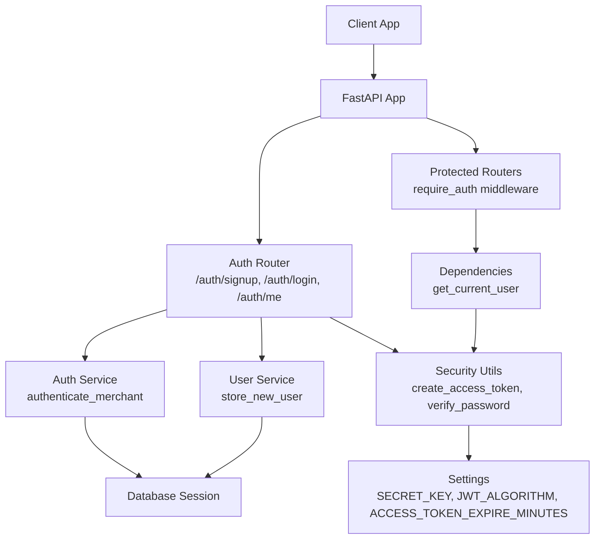
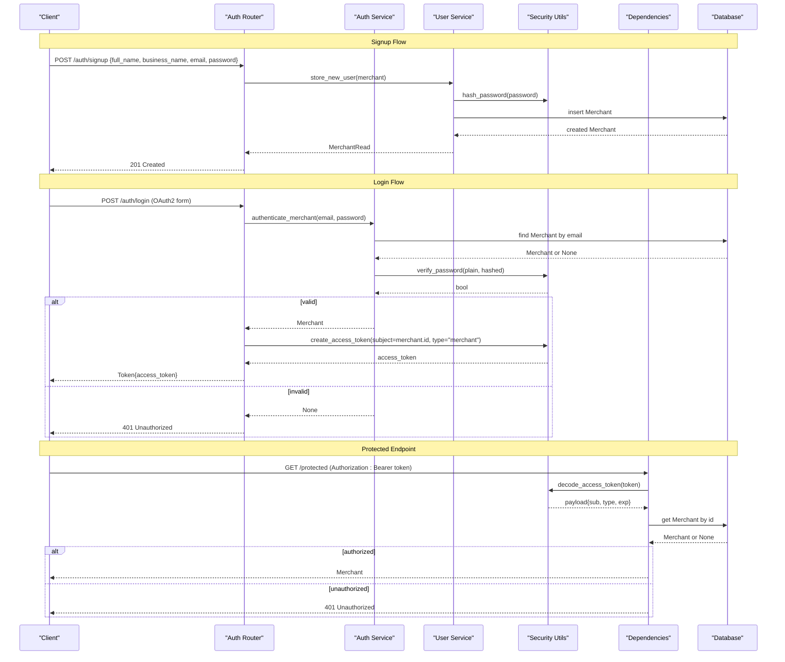
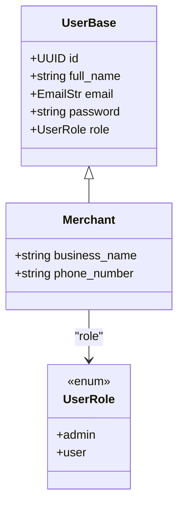
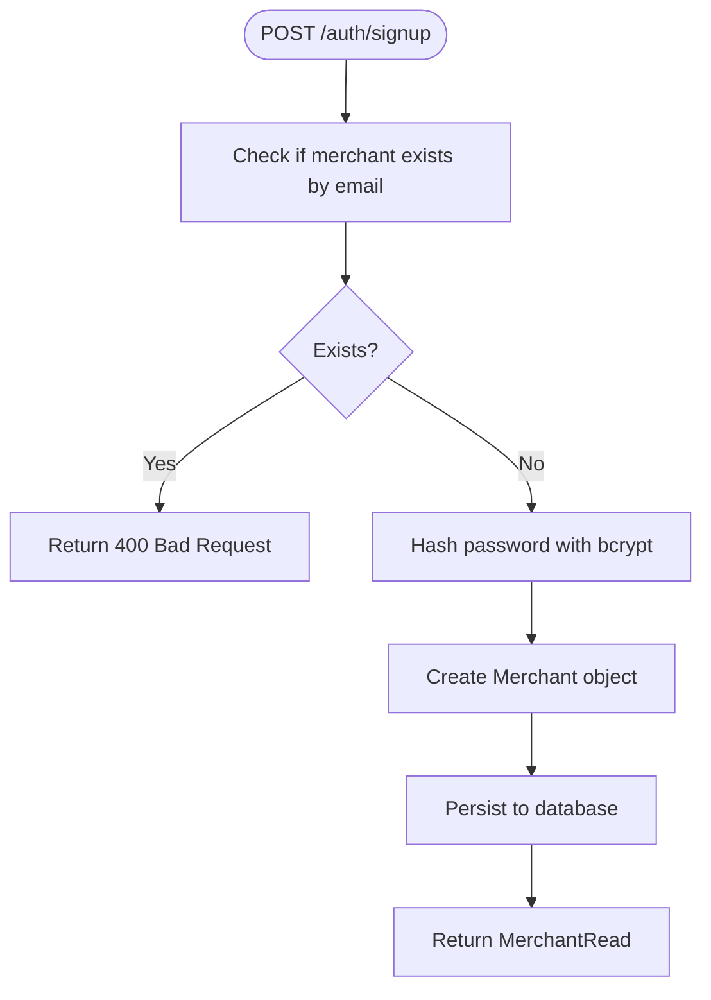
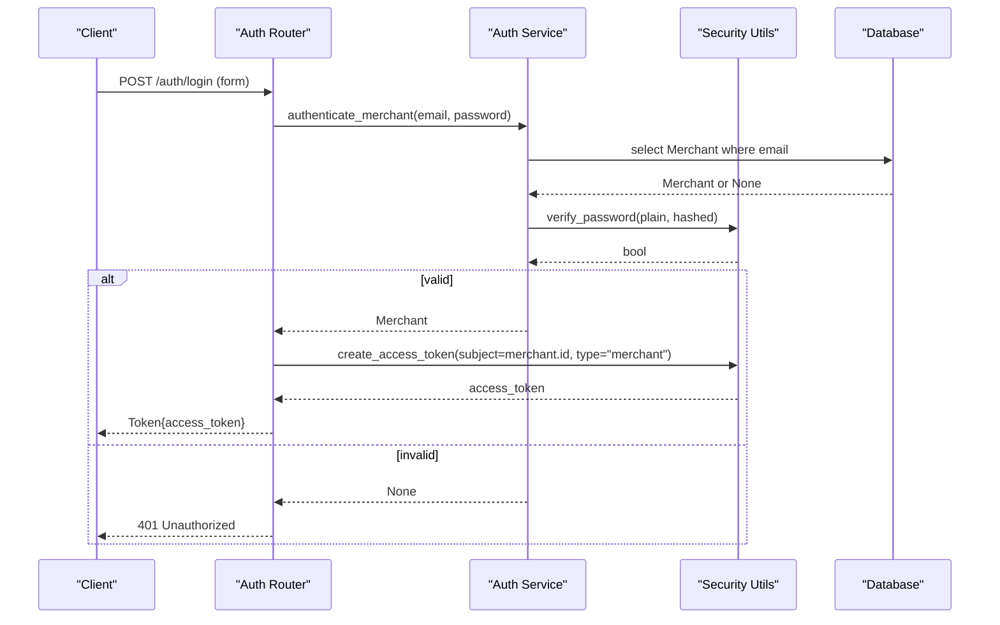
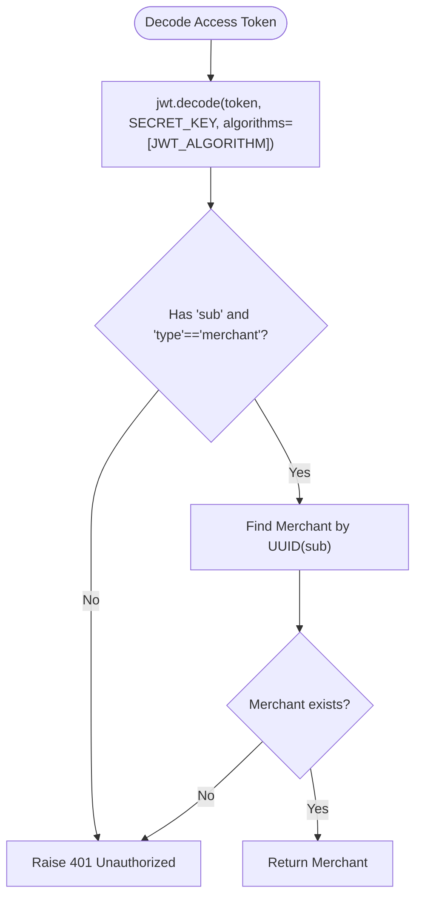
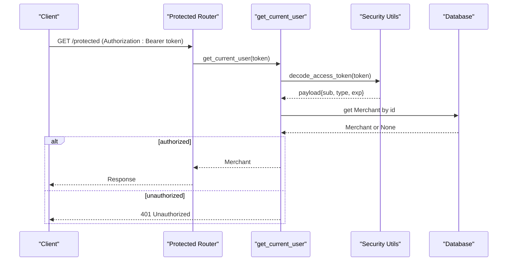
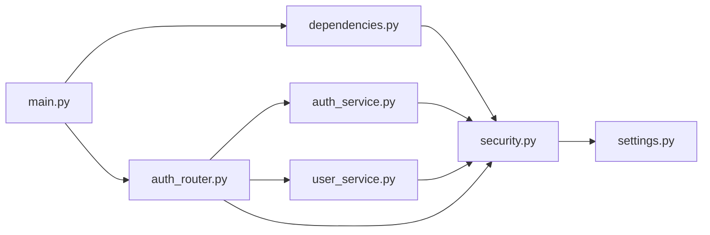

# JWT Authentication Flow

<cite>
**Referenced Files in This Document**
- [main.py](file://neurocom_backend/main.py)
- [auth_router.py](file://neurocom_backend/routers/auth_router.py)
- [auth_service.py](file://neurocom_backend/services/auth_service.py)
- [user_service.py](file://neurocom_backend/services/user_service.py)
- [security.py](file://neurocom_backend/utils/security.py)
- [settings.py](file://neurocom_backend/utils/settings.py)
- [dependencies.py](file://neurocom_backend/dependencies.py)
- [merchant.py](file://neurocom_backend/database/models/merchant.py)
- [user.py](file://neurocom_backend/database/models/user.py)
- [auth.py](file://neurocom_backend/schemas/auth.py)
</cite>

## Table of Contents
1. [Introduction](#introduction)
2. [Project Structure](#project-structure)
3. [Core Components](#core-components)
4. [Architecture Overview](#architecture-overview)
5. [Detailed Component Analysis](#detailed-component-analysis)
6. [Dependency Analysis](#dependency-analysis)
7. [Performance Considerations](#performance-considerations)
8. [Troubleshooting Guide](#troubleshooting-guide)
9. [Conclusion](#conclusion)
10. [Appendices](#appendices)

## Introduction
This document explains the complete JWT authentication lifecycle in the Tijarah AI Backend, covering merchant signup, login, token generation and validation, and how to protect endpoints using FastAPI’s dependency injection. It also documents the use of OAuth2PasswordRequestForm for login, password verification with bcrypt, and JWT creation with subject-based claims. Security considerations such as token expiration, refresh mechanisms, and robust error handling are included, along with practical guidance for client-side integration.

## Project Structure
The authentication system is implemented across routers, services, utilities, models, and dependencies:
- Routers define HTTP endpoints for signup, login, and current user retrieval.
- Services encapsulate business logic for user registration and authentication.
- Utilities provide cryptographic operations (password hashing, JWT encoding/decoding).
- Models define database schemas for users and merchants.
- Dependencies implement protected route guards via FastAPI’s dependency injection.
- Settings centralize configuration for secrets and token lifetimes.

**Diagram sources**
- [main.py:29-89](file://neurocom_backend/main.py#L29-L89)
- [auth_router.py:15-43](file://neurocom_backend/routers/auth_router.py#L15-L43)
- [auth_service.py:6-11](file://neurocom_backend/services/auth_service.py#L6-L11)
- [user_service.py:8-25](file://neurocom_backend/services/user_service.py#L8-L25)
- [security.py:16-28](file://neurocom_backend/utils/security.py#L16-L28)
- [dependencies.py:14-43](file://neurocom_backend/dependencies.py#L14-L43)
- [settings.py:11-15](file://neurocom_backend/utils/settings.py#L11-L15)

**Section sources**
- [main.py:29-89](file://neurocom_backend/main.py#L29-L89)
- [auth_router.py:15-43](file://neurocom_backend/routers/auth_router.py#L15-L43)
- [dependencies.py:14-43](file://neurocom_backend/dependencies.py#L14-L43)
- [security.py:16-28](file://neurocom_backend/utils/security.py#L16-L28)
- [settings.py:11-15](file://neurocom_backend/utils/settings.py#L11-L15)

## Core Components
- Merchant model and schemas define user identity and roles.
- Signup flow creates a new merchant with a hashed password.
- Login flow validates credentials and issues a JWT access token.
- Protected routes enforce authentication via a dependency that decodes and validates tokens.
- Security utilities handle password hashing/verification and JWT encode/decode.
- Settings configure secret keys, algorithm, and token expiry.

Key responsibilities:
- auth_router.py: Exposes /auth endpoints and orchestrates service calls.
- auth_service.py: Authenticates merchants by email and password.
- user_service.py: Stores new merchants with hashed passwords.
- security.py: Implements bcrypt hashing and JWT token management.
- dependencies.py: Provides get_current_user for protecting routes.
- settings.py: Centralizes SECRET_KEY, JWT_ALGORITHM, ACCESS_TOKEN_EXPIRE_MINUTES.

**Section sources**
- [merchant.py:11-29](file://neurocom_backend/database/models/merchant.py#L11-L29)
- [user.py:10-19](file://neurocom_backend/database/models/user.py#L10-L19)
- [auth_router.py:18-42](file://neurocom_backend/routers/auth_router.py#L18-L42)
- [auth_service.py:6-11](file://neurocom_backend/services/auth_service.py#L6-L11)
- [user_service.py:8-25](file://neurocom_backend/services/user_service.py#L8-L25)
- [security.py:16-28](file://neurocom_backend/utils/security.py#L16-L28)
- [dependencies.py:14-43](file://neurocom_backend/dependencies.py#L14-L43)
- [settings.py:11-15](file://neurocom_backend/utils/settings.py#L11-L15)

## Architecture Overview
The authentication architecture follows a layered approach:
- HTTP layer (FastAPI routers) handles requests and responses.
- Service layer performs domain-specific operations (registration, authentication).
- Utility layer provides cryptographic and token functions.
- Dependency layer enforces authorization on protected routes.
- Database layer persists user data via SQLModel sessions.

**Diagram sources**
- [auth_router.py:18-42](file://neurocom_backend/routers/auth_router.py#L18-L42)
- [auth_service.py:6-11](file://neurocom_backend/services/auth_service.py#L6-L11)
- [user_service.py:8-25](file://neurocom_backend/services/user_service.py#L8-L25)
- [security.py:16-28](file://neurocom_backend/utils/security.py#L16-L28)
- [dependencies.py:14-43](file://neurocom_backend/dependencies.py#L14-L43)

## Detailed Component Analysis

### Merchant Model and User Base
- Merchant inherits from UserBase, adding business-specific fields and relationships.
- UserBase defines core identity fields including id, full_name, email, password, and role.
- UserRole enum supports admin and user roles; merchants default to user.

**Diagram sources**
- [user.py:10-19](file://neurocom_backend/database/models/user.py#L10-L19)
- [merchant.py:11-29](file://neurocom_backend/database/models/merchant.py#L11-L29)

**Section sources**
- [user.py:10-19](file://neurocom_backend/database/models/user.py#L10-L19)
- [merchant.py:11-29](file://neurocom_backend/database/models/merchant.py#L11-L29)

### Signup Flow
- Endpoint: POST /auth/signup
- Input: MerchantCreate schema (full_name, business_name, email, password, optional phone_number)
- Process:
  - Check if merchant exists by email.
  - Hash password using bcrypt.
  - Create Merchant with default role=user.
  - Persist to database and return MerchantRead.

**Diagram sources**
- [auth_router.py:18-21](file://neurocom_backend/routers/auth_router.py#L18-L21)
- [user_service.py:8-25](file://neurocom_backend/services/user_service.py#L8-L25)
- [security.py:16-20](file://neurocom_backend/utils/security.py#L16-L20)

**Section sources**
- [auth_router.py:18-21](file://neurocom_backend/routers/auth_router.py#L18-L21)
- [user_service.py:8-25](file://neurocom_backend/services/user_service.py#L8-L25)

### Login Flow
- Endpoint: POST /auth/login
- Input: OAuth2PasswordRequestForm (username/email and password)
- Process:
  - Retrieve merchant by email.
  - Verify password using bcrypt.
  - On success, generate JWT access token with subject=merchant.id and type="merchant".
  - Return Token{access_token}.

**Diagram sources**
- [auth_router.py:24-37](file://neurocom_backend/routers/auth_router.py#L24-L37)
- [auth_service.py:6-11](file://neurocom_backend/services/auth_service.py#L6-L11)
- [security.py:19-25](file://neurocom_backend/utils/security.py#L19-L25)

**Section sources**
- [auth_router.py:24-37](file://neurocom_backend/routers/auth_router.py#L24-L37)
- [auth_service.py:6-11](file://neurocom_backend/services/auth_service.py#L6-L11)
- [security.py:19-25](file://neurocom_backend/utils/security.py#L19-L25)

### Token Generation and Validation
- Token creation:
  - Subject: merchant.id
  - Type: account_type="merchant"
  - Expiration: configured via ACCESS_TOKEN_EXPIRE_MINUTES
  - Algorithm: configured via JWT_ALGORITHM
  - Secret: SECRET_KEY
- Token decoding and validation:
  - Decode token using SECRET_KEY and JWT_ALGORITHM
  - Validate presence of sub and type=="merchant"
  - Resolve merchant by id from database
  - Raise 401 Unauthorized if invalid or not found

**Diagram sources**
- [security.py:22-28](file://neurocom_backend/utils/security.py#L22-L28)
- [dependencies.py:17-43](file://neurocom_backend/dependencies.py#L17-L43)
- [settings.py:13-15](file://neurocom_backend/utils/settings.py#L13-L15)

**Section sources**
- [security.py:22-28](file://neurocom_backend/utils/security.py#L22-L28)
- [dependencies.py:17-43](file://neurocom_backend/dependencies.py#L17-L43)
- [settings.py:13-15](file://neurocom_backend/utils/settings.py#L13-L15)

### Protected Endpoints Using Dependency Injection
- Global protection:
  - require_auth = [Depends(get_current_user)] applied to multiple routers in main.py
- Per-endpoint protection:
  - Use Depends(get_current_user) in endpoint signatures to inject the authenticated Merchant
- Current user retrieval:
  - GET /auth/me returns the authenticated Merchant

**Diagram sources**
- [main.py:78-89](file://neurocom_backend/main.py#L78-L89)
- [dependencies.py:34-43](file://neurocom_backend/dependencies.py#L34-L43)
- [security.py:22-28](file://neurocom_backend/utils/security.py#L22-L28)

**Section sources**
- [main.py:78-89](file://neurocom_backend/main.py#L78-L89)
- [dependencies.py:34-43](file://neurocom_backend/dependencies.py#L34-L43)

### WebSocket Authentication
- A WebSocket-aware dependency reads the Authorization header directly during handshake.
- Validates token similarly to HTTP flows and raises WebSocketException on failure.

**Section sources**
- [dependencies.py:46-64](file://neurocom_backend/dependencies.py#L46-L64)

## Dependency Analysis
- Routers depend on services for business logic.
- Services depend on security utilities for hashing and JWT operations.
- Dependencies module depends on security utilities and database session provider.
- Settings module centralizes environment-derived constants used by security and other modules.

**Diagram sources**
- [auth_router.py:1-14](file://neurocom_backend/routers/auth_router.py#L1-L14)
- [auth_service.py:1-11](file://neurocom_backend/services/auth_service.py#L1-L11)
- [user_service.py:1-25](file://neurocom_backend/services/user_service.py#L1-L25)
- [dependencies.py:1-43](file://neurocom_backend/dependencies.py#L1-L43)
- [security.py:1-28](file://neurocom_backend/utils/security.py#L1-L28)
- [settings.py:1-15](file://neurocom_backend/utils/settings.py#L1-L15)
- [main.py:29-89](file://neurocom_backend/main.py#L29-L89)

**Section sources**
- [auth_router.py:1-14](file://neurocom_backend/routers/auth_router.py#L1-L14)
- [auth_service.py:1-11](file://neurocom_backend/services/auth_service.py#L1-L11)
- [user_service.py:1-25](file://neurocom_backend/services/user_service.py#L1-L25)
- [dependencies.py:1-43](file://neurocom_backend/dependencies.py#L1-L43)
- [security.py:1-28](file://neurocom_backend/utils/security.py#L1-L28)
- [settings.py:1-15](file://neurocom_backend/utils/settings.py#L1-L15)
- [main.py:29-89](file://neurocom_backend/main.py#L29-L89)

## Performance Considerations
- Password hashing uses bcrypt via passlib; ensure appropriate work factor for performance vs security balance.
- JWT decoding is lightweight; avoid unnecessary database lookups by caching merchant resolution if needed.
- Token expiry is configurable; shorter lifetimes improve security but increase client re-auth frequency.
- Database queries should be indexed on email and id for fast lookups.

[No sources needed since this section provides general guidance]

## Troubleshooting Guide
Common errors and strategies:
- Incorrect email or password:
  - Login returns 401 Unauthorized with WWW-Authenticate: Bearer header.
  - Ensure correct credentials and check password hashing consistency.
- Invalid or expired token:
  - Decoding fails or claims missing; returns 401 Unauthorized.
  - Verify SECRET_KEY and JWT_ALGORITHM match between server and client.
  - Check ACCESS_TOKEN_EXPIRE_MINUTES and ensure clients refresh before expiry.
- Merchant not found after token decode:
  - Database inconsistency or deleted user; handle gracefully and prompt re-login.
- WebSocket authentication failures:
  - Missing or malformed Authorization header; ensure proper Bearer token format.

**Section sources**
- [auth_router.py:24-37](file://neurocom_backend/routers/auth_router.py#L24-L37)
- [dependencies.py:34-43](file://neurocom_backend/dependencies.py#L34-L43)
- [dependencies.py:46-64](file://neurocom_backend/dependencies.py#L46-L64)

## Conclusion
The Tijarah AI Backend implements a secure, modular JWT authentication flow:
- Merchants sign up with hashed passwords and receive persisted identities.
- Login validates credentials and issues short-lived JWT access tokens with subject-based claims.
- Protected endpoints enforce authentication via dependency injection, ensuring only valid merchants can access resources.
- Configuration-driven token settings allow flexible security tuning.
For production, consider implementing refresh tokens, token revocation, and rate limiting to enhance resilience.

[No sources needed since this section summarizes without analyzing specific files]

## Appendices

### Client-Side Integration Examples
- Signup:
  - Send POST /auth/signup with JSON body containing full_name, business_name, email, password.
  - Handle 201 Created response with merchant details.
- Login:
  - Send POST /auth/login with OAuth2 form fields (username/email and password).
  - Store returned access_token securely.
- Accessing protected endpoints:
  - Include Authorization: Bearer <token> header in subsequent requests.
  - Handle 401 Unauthorized by prompting re-login or refreshing token.

[No sources needed since this section provides general guidance]

### Security Best Practices
- Token expiration:
  - Configure ACCESS_TOKEN_EXPIRE_MINUTES appropriately for your threat model.
- Refresh mechanisms:
  - Implement a separate refresh token flow to obtain new access tokens without re-authentication.
- Error handling:
  - Always return standardized error responses with appropriate status codes and headers.
  - Avoid leaking sensitive information in error messages.
- Secrets management:
  - Store SECRET_KEY and JWT_ALGORITHM in environment variables (.env) and never hardcode them.

[No sources needed since this section provides general guidance]