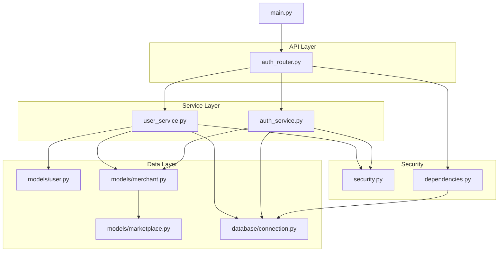
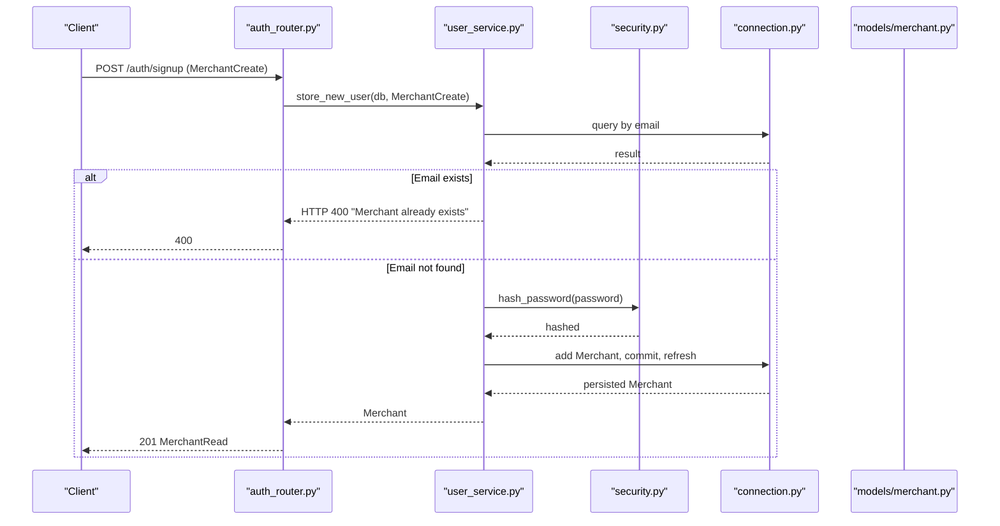
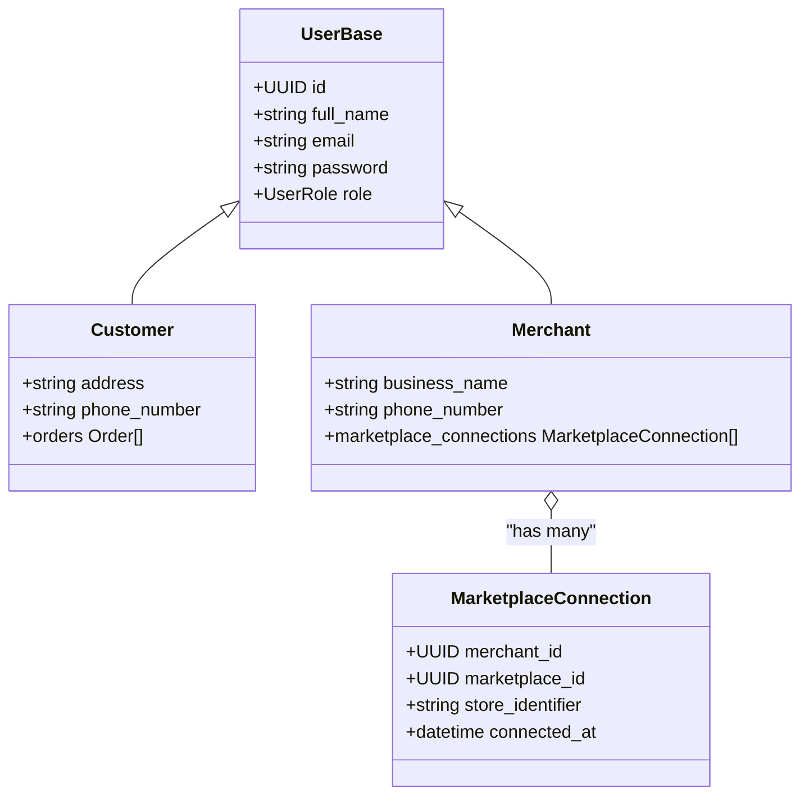
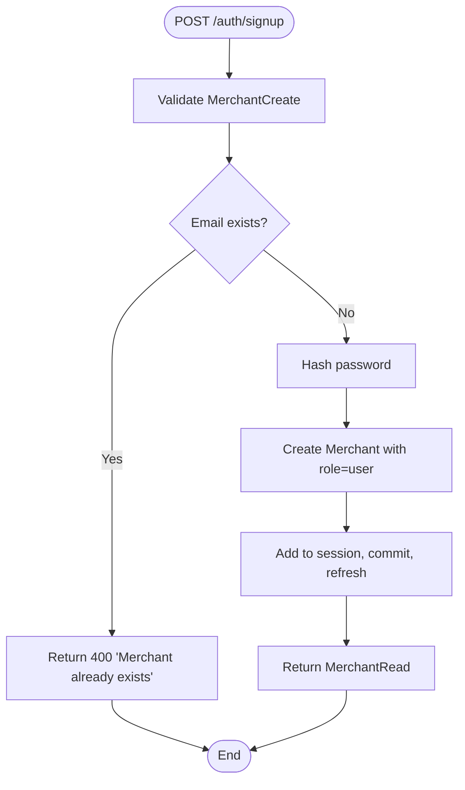
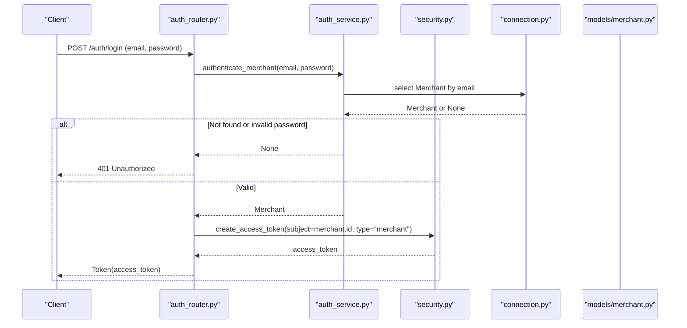
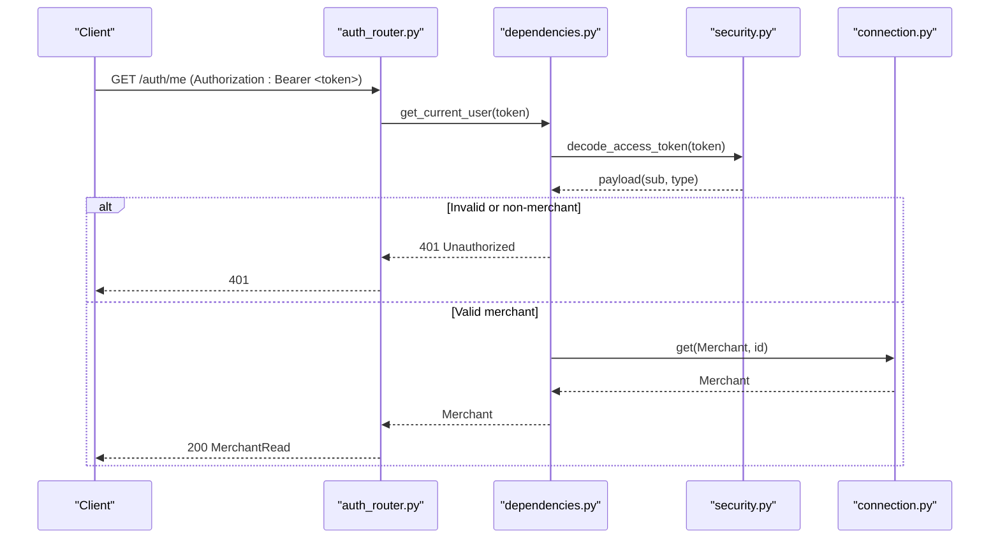
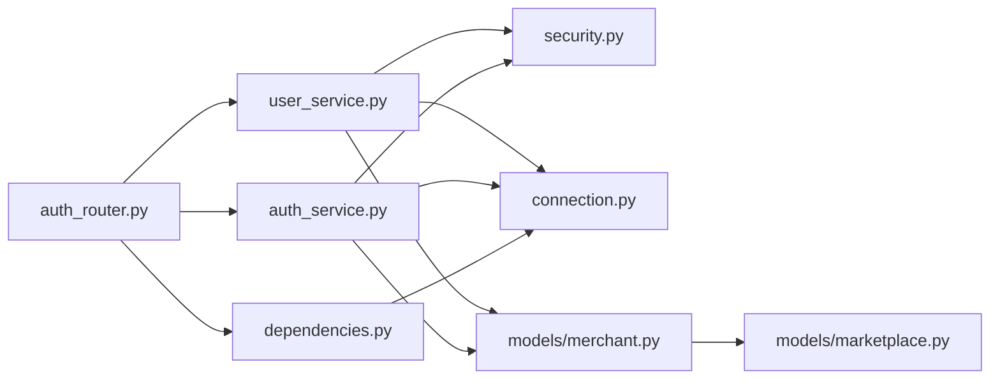

# Merchant and User Management

<cite>
**Referenced Files in This Document**
- [user.py](file://neurocom_backend/database/models/user.py)
- [merchant.py](file://neurocom_backend/database/models/merchant.py)
- [marketplace.py](file://neurocom_backend/database/models/marketplace.py)
- [connection.py](file://neurocom_backend/database/connection.py)
- [auth_router.py](file://neurocom_backend/routers/auth_router.py)
- [auth_service.py](file://neurocom_backend/services/auth_service.py)
- [user_service.py](file://neurocom_backend/services/user_service.py)
- [security.py](file://neurocom_backend/utils/security.py)
- [dependencies.py](file://neurocom_backend/dependencies.py)
- [main.py](file://neurocom_backend/main.py)
</cite>

## Table of Contents
1. Introduction
2. Project Structure
3. Core Components
4. Architecture Overview
5. Detailed Component Analysis
6. Dependency Analysis
7. Performance Considerations
8. Troubleshooting Guide
9. Conclusion
10. Appendices

## Introduction
This document explains the merchant and user management systems implemented in the backend. It covers database models for merchants and users, their relationships, validation rules, and the end-to-end workflows for registration, authentication, and profile access. It also documents service layer methods for creating merchants, securing passwords, and issuing access tokens, along with guidance for extending user functionality and adding custom attributes.

## Project Structure
The merchant and user features are organized across:
- Database models defining entities and relationships
- Routers exposing HTTP endpoints for signup, login, and current user retrieval
- Services handling business logic such as account creation and authentication
- Security utilities for password hashing and JWT token operations
- Dependencies providing authenticated user resolution
- Application bootstrap that mounts routers and performs migrations

**Diagram sources**
- [main.py:78-89](file://neurocom_backend/main.py#L78-L89)
- [auth_router.py:15-43](file://neurocom_backend/routers/auth_router.py#L15-L43)
- [user_service.py:1-25](file://neurocom_backend/services/user_service.py#L1-L25)
- [auth_service.py:1-11](file://neurocom_backend/services/auth_service.py#L1-L11)
- [security.py:14-28](file://neurocom_backend/utils/security.py#L14-L28)
- [dependencies.py:14-43](file://neurocom_backend/dependencies.py#L14-L43)
- [user.py:10-42](file://neurocom_backend/database/models/user.py#L10-L42)
- [merchant.py:11-30](file://neurocom_backend/database/models/merchant.py#L11-L30)
- [marketplace.py:26-41](file://neurocom_backend/database/models/marketplace.py#L26-L41)
- [connection.py:9-27](file://neurocom_backend/database/connection.py#L9-L27)

**Section sources**
- [main.py:14-89](file://neurocom_backend/main.py#L14-L89)
- [auth_router.py:15-43](file://neurocom_backend/routers/auth_router.py#L15-L43)
- [user_service.py:1-25](file://neurocom_backend/services/user_service.py#L1-L25)
- [auth_service.py:1-11](file://neurocom_backend/services/auth_service.py#L1-L11)
- [security.py:14-28](file://neurocom_backend/utils/security.py#L14-L28)
- [dependencies.py:14-43](file://neurocom_backend/dependencies.py#L14-L43)
- [user.py:10-42](file://neurocom_backend/database/models/user.py#L10-L42)
- [merchant.py:11-30](file://neurocom_backend/database/models/merchant.py#L11-L30)
- [marketplace.py:26-41](file://neurocom_backend/database/models/marketplace.py#L26-L41)
- [connection.py:9-27](file://neurocom_backend/database/connection.py#L9-L27)

## Core Components
- Merchant model extends a shared base user model to represent business accounts with additional business-specific fields and relationships.
- Customer model represents individual shoppers with optional contact details and order relationships.
- Authentication and authorization rely on password hashing and JWT-based access tokens.
- Service layer encapsulates account creation and authentication flows.
- Router exposes endpoints for signup, login, and retrieving the current authenticated merchant.

Key responsibilities:
- Data modeling and constraints (unique emails, field lengths, roles)
- Secure password storage and verification
- Token issuance and validation
- Session-scoped database interactions

**Section sources**
- [user.py:10-42](file://neurocom_backend/database/models/user.py#L10-L42)
- [merchant.py:11-30](file://neurocom_backend/database/models/merchant.py#L11-L30)
- [auth_router.py:18-43](file://neurocom_backend/routers/auth_router.py#L18-L43)
- [user_service.py:8-24](file://neurocom_backend/services/user_service.py#L8-L24)
- [auth_service.py:6-10](file://neurocom_backend/services/auth_service.py#L6-L10)
- [security.py:14-28](file://neurocom_backend/utils/security.py#L14-L28)
- [dependencies.py:17-43](file://neurocom_backend/dependencies.py#L17-L43)

## Architecture Overview
The system follows a layered architecture:
- API layer (FastAPI routers) receives requests and delegates to services.
- Service layer enforces business rules, interacts with security utilities, and persists data via SQLModel sessions.
- Data layer defines SQLModel tables and relationships; migrations ensure schema consistency.
- Security utilities handle password hashing and JWT operations.
- Dependencies provide reusable authentication middleware for protected routes.

**Diagram sources**
- [auth_router.py:18-21](file://neurocom_backend/routers/auth_router.py#L18-L21)
- [user_service.py:8-24](file://neurocom_backend/services/user_service.py#L8-L24)
- [security.py:16-17](file://neurocom_backend/utils/security.py#L16-L17)
- [connection.py:25-27](file://neurocom_backend/database/connection.py#L25-L27)
- [merchant.py:11-30](file://neurocom_backend/database/models/merchant.py#L11-L30)

**Section sources**
- [auth_router.py:18-21](file://neurocom_backend/routers/auth_router.py#L18-L21)
- [user_service.py:8-24](file://neurocom_backend/services/user_service.py#L8-L24)
- [security.py:16-17](file://neurocom_backend/utils/security.py#L16-L17)
- [connection.py:25-27](file://neurocom_backend/database/connection.py#L25-L27)
- [merchant.py:11-30](file://neurocom_backend/database/models/merchant.py#L11-L30)

## Detailed Component Analysis

### Database Models: UserBase, Customer, Merchant
- UserBase defines shared identity fields including id, full_name, email, password, and role. Email is unique and indexed; password has minimum length; role defaults to user.
- Customer extends UserBase with address and phone_number, and relates to orders.
- Merchant extends UserBase with business_name, phone_number, and marketplace connections.

Relationships:
- Merchant connects to MarketplaceConnection, which links merchants to marketplaces with a unique constraint on merchant_id, marketplace_id, and store_identifier.

Validation and integrity:
- Field-level constraints enforce min/max lengths and uniqueness at the model level.
- Unique constraints on email and marketplace connection keys prevent duplicates.

**Diagram sources**
- [user.py:10-42](file://neurocom_backend/database/models/user.py#L10-L42)
- [merchant.py:11-30](file://neurocom_backend/database/models/merchant.py#L11-L30)
- [marketplace.py:26-41](file://neurocom_backend/database/models/marketplace.py#L26-L41)

**Section sources**
- [user.py:10-42](file://neurocom_backend/database/models/user.py#L10-L42)
- [merchant.py:11-30](file://neurocom_backend/database/models/merchant.py#L11-L30)
- [marketplace.py:26-41](file://neurocom_backend/database/models/marketplace.py#L26-L41)

### Registration Workflow: Creating Merchants
- Endpoint: POST /auth/signup accepts a MerchantCreate payload.
- Service method: store_new_user checks for existing email, hashes password, creates a Merchant with default role, persists it, and returns the created record.
- Validation: Pydantic validates input fields; service adds duplicate check; database constraints enforce uniqueness.

**Diagram sources**
- [auth_router.py:18-21](file://neurocom_backend/routers/auth_router.py#L18-L21)
- [user_service.py:8-24](file://neurocom_backend/services/user_service.py#L8-L24)
- [security.py:16-17](file://neurocom_backend/utils/security.py#L16-L17)

**Section sources**
- [auth_router.py:18-21](file://neurocom_backend/routers/auth_router.py#L18-L21)
- [user_service.py:8-24](file://neurocom_backend/services/user_service.py#L8-L24)
- [security.py:16-17](file://neurocom_backend/utils/security.py#L16-L17)

### Login Workflow: Authenticating Merchants
- Endpoint: POST /auth/login accepts OAuth2 form credentials.
- Service method: authenticate_merchant queries by email and verifies password using secure comparison.
- On success, an access token is issued with subject set to merchant id and type set to merchant.

**Diagram sources**
- [auth_router.py:24-37](file://neurocom_backend/routers/auth_router.py#L24-L37)
- [auth_service.py:6-10](file://neurocom_backend/services/auth_service.py#L6-L10)
- [security.py:22-25](file://neurocom_backend/utils/security.py#L22-L25)
- [connection.py:25-27](file://neurocom_backend/database/connection.py#L25-L27)
- [merchant.py:11-30](file://neurocom_backend/database/models/merchant.py#L11-L30)

**Section sources**
- [auth_router.py:24-37](file://neurocom_backend/routers/auth_router.py#L24-L37)
- [auth_service.py:6-10](file://neurocom_backend/services/auth_service.py#L6-L10)
- [security.py:22-25](file://neurocom_backend/utils/security.py#L22-L25)
- [connection.py:25-27](file://neurocom_backend/database/connection.py#L25-L27)
- [merchant.py:11-30](file://neurocom_backend/database/models/merchant.py#L11-L30)

### Current User Retrieval
- Endpoint: GET /auth/me requires a valid Bearer token.
- Dependency: get_current_user decodes the token, validates type is merchant, resolves the merchant from the database, and returns it.

**Diagram sources**
- [auth_router.py:40-43](file://neurocom_backend/routers/auth_router.py#L40-L43)
- [dependencies.py:17-43](file://neurocom_backend/dependencies.py#L17-L43)
- [security.py:22-28](file://neurocom_backend/utils/security.py#L22-L28)
- [connection.py:25-27](file://neurocom_backend/database/connection.py#L25-L27)

**Section sources**
- [auth_router.py:40-43](file://neurocom_backend/routers/auth_router.py#L40-L43)
- [dependencies.py:17-43](file://neurocom_backend/dependencies.py#L17-L43)
- [security.py:22-28](file://neurocom_backend/utils/security.py#L22-L28)
- [connection.py:25-27](file://neurocom_backend/database/connection.py#L25-L27)

### Password Security and Token Operations
- Password hashing uses bcrypt via a CryptContext; verification compares plaintext against stored hashes.
- Access tokens are JWTs containing subject (merchant id), type ("merchant"), and expiration; decoding validates tokens for protected routes.

**Section sources**
- [security.py:14-28](file://neurocom_backend/utils/security.py#L14-L28)

### Role-Based Access Control
- The require_roles dependency can restrict endpoints to specific roles; currently used to define admin-only dependencies.
- Merchant accounts are created with role=user by default.

**Section sources**
- [dependencies.py:67-79](file://neurocom_backend/dependencies.py#L67-L79)
- [user_service.py:19](file://neurocom_backend/services/user_service.py#L19)

## Dependency Analysis
- Routers depend on services for business logic and on dependencies for authentication.
- Services depend on security utilities and database sessions.
- Models define relationships; marketplace connections link merchants to platforms with unique constraints.
- Application bootstraps routers and runs migrations to ensure schema readiness.

**Diagram sources**
- [auth_router.py:15-43](file://neurocom_backend/routers/auth_router.py#L15-L43)
- [user_service.py:1-25](file://neurocom_backend/services/user_service.py#L1-L25)
- [auth_service.py:1-11](file://neurocom_backend/services/auth_service.py#L1-L11)
- [security.py:14-28](file://neurocom_backend/utils/security.py#L14-L28)
- [dependencies.py:14-43](file://neurocom_backend/dependencies.py#L14-L43)
- [connection.py:9-27](file://neurocom_backend/database/connection.py#L9-L27)
- [merchant.py:11-30](file://neurocom_backend/database/models/merchant.py#L11-L30)
- [marketplace.py:26-41](file://neurocom_backend/database/models/marketplace.py#L26-L41)

**Section sources**
- [auth_router.py:15-43](file://neurocom_backend/routers/auth_router.py#L15-L43)
- [user_service.py:1-25](file://neurocom_backend/services/user_service.py#L1-L25)
- [auth_service.py:1-11](file://neurocom_backend/services/auth_service.py#L1-L11)
- [security.py:14-28](file://neurocom_backend/utils/security.py#L14-L28)
- [dependencies.py:14-43](file://neurocom_backend/dependencies.py#L14-L43)
- [connection.py:9-27](file://neurocom_backend/database/connection.py#L9-L27)
- [merchant.py:11-30](file://neurocom_backend/database/models/merchant.py#L11-L30)
- [marketplace.py:26-41](file://neurocom_backend/database/models/marketplace.py#L26-L41)

## Performance Considerations
- Use indexes on frequently queried fields like email to speed up lookups during signup and login.
- Keep session scope minimal; commit once per transaction to reduce overhead.
- Avoid N+1 queries when loading related data (e.g., marketplace connections); consider eager loading if needed.
- Ensure password hashing cost is balanced for security and latency.

[No sources needed since this section provides general guidance]

## Troubleshooting Guide
Common issues and resolutions:
- Duplicate email during signup: Occurs when a merchant with the same email already exists. Resolve by updating the request to use a unique email or checking existence before submission.
- Incorrect credentials during login: Happens when email is not found or password does not match. Verify credentials and ensure the account was created successfully.
- Unauthorized access to protected routes: Indicates missing or invalid Bearer token, or token type mismatch. Ensure the token is obtained from /auth/login and includes type "merchant".
- Schema migration errors: If unique constraints change, run migrations to align the database schema.

Operational notes:
- Migrations are executed at application startup to ensure tables exist and constraints are applied.

**Section sources**
- [user_service.py:9-11](file://neurocom_backend/services/user_service.py#L9-L11)
- [auth_service.py:6-10](file://neurocom_backend/services/auth_service.py#L6-L10)
- [dependencies.py:17-43](file://neurocom_backend/dependencies.py#L17-L43)
- [connection.py:15-23](file://neurocom_backend/database/connection.py#L15-L23)

## Conclusion
The system provides a robust foundation for merchant and user management with clear separation of concerns across models, services, routers, and security utilities. Registration enforces validation and secure password storage, while login issues JWTs for protected access. Relationships enable merchants to connect to multiple marketplaces under strict uniqueness constraints. Extending functionality can be achieved by adding new fields to models, updating schemas, and implementing corresponding service and router logic.

[No sources needed since this section summarizes without analyzing specific files]

## Appendices

### API Endpoints Summary
- POST /auth/signup: Creates a new merchant account. Returns MerchantRead or 400 if email exists.
- POST /auth/login: Authenticates a merchant and returns a JWT token.
- GET /auth/me: Retrieves the current authenticated merchant.

**Section sources**
- [auth_router.py:18-43](file://neurocom_backend/routers/auth_router.py#L18-L43)

### Extending User Functionality
To add custom user attributes:
- Add new fields to the appropriate model (Customer or Merchant) with validation constraints.
- Update corresponding Pydantic schemas (e.g., CustomerCreate/MerchantCreate) to include new fields.
- Adjust service methods to persist new fields during creation or updates.
- If required, update database migrations to reflect schema changes.
- For read responses, extend response models to expose new fields.

Guidance:
- Maintain uniqueness where appropriate (e.g., email).
- Enforce sensible min/max lengths and formats.
- Consider indexing fields used in frequent queries.

**Section sources**
- [user.py:14-42](file://neurocom_backend/database/models/user.py#L14-L42)
- [merchant.py:11-30](file://neurocom_backend/database/models/merchant.py#L11-L30)
- [user_service.py:8-24](file://neurocom_backend/services/user_service.py#L8-L24)
- [connection.py:15-23](file://neurocom_backend/database/connection.py#L15-L23)