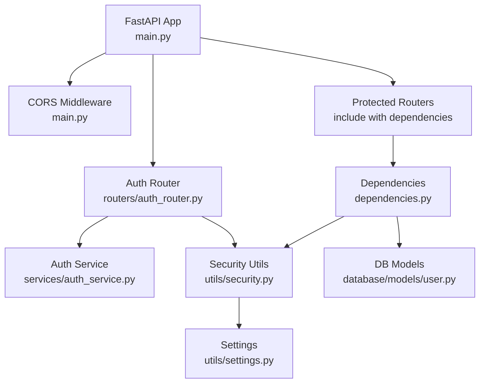
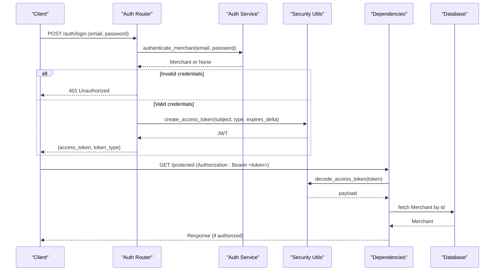
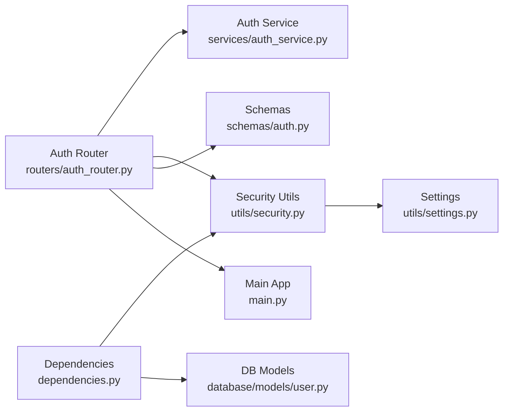

# Security Utilities and Middleware

<cite>
**Referenced Files in This Document**
- [security.py](file://neurocom_backend/utils/security.py)
- [dependencies.py](file://neurocom_backend/dependencies.py)
- [auth_router.py](file://neurocom_backend/routers/auth_router.py)
- [settings.py](file://neurocom_backend/utils/settings.py)
- [auth.py](file://neurocom_backend/schemas/auth.py)
- [auth_service.py](file://neurocom_backend/services/auth_service.py)
- [main.py](file://neurocom_backend/main.py)
- [user.py](file://neurocom_backend/database/models/user.py)
</cite>

## Table of Contents
1. [Introduction](#introduction)
2. [Project Structure](#project-structure)
3. [Core Components](#core-components)
4. [Architecture Overview](#architecture-overview)
5. [Detailed Component Analysis](#detailed-component-analysis)
6. [Dependency Analysis](#dependency-analysis)
7. [Performance Considerations](#performance-considerations)
8. [Troubleshooting Guide](#troubleshooting-guide)
9. [Conclusion](#conclusion)
10. [Appendices](#appendices)

## Introduction
This document explains the security utilities and middleware that protect API endpoints, manage authentication, and enforce authorization. It covers JWT token creation and validation, extracting authenticated users via dependency injection, role-based access control, and how to extend or customize these mechanisms. It also includes best practices for token lifecycle management and common vulnerability prevention strategies.

## Project Structure
Security-related functionality is implemented across a small set of focused modules:
- Token generation and password hashing live in the security utilities.
- Dependency injection functions extract and validate tokens from requests.
- The auth router exposes login/signup and protected user info endpoints.
- Application-level CORS middleware secures cross-origin requests.
- Role-based access control is provided as a reusable dependency.

**Diagram sources**
- [main.py:30-36](file://neurocom_backend/main.py#L30-L36)
- [auth_router.py:15-42](file://neurocom_backend/routers/auth_router.py#L15-L42)
- [auth_service.py:6-10](file://neurocom_backend/services/auth_service.py#L6-L10)
- [security.py:16-28](file://neurocom_backend/utils/security.py#L16-L28)
- [settings.py:13-15](file://neurocom_backend/utils/settings.py#L13-L15)
- [dependencies.py:17-43](file://neurocom_backend/dependencies.py#L17-L43)
- [user.py:10-12](file://neurocom_backend/database/models/user.py#L10-L12)

**Section sources**
- [main.py:30-36](file://neurocom_backend/main.py#L30-L36)
- [auth_router.py:15-42](file://neurocom_backend/routers/auth_router.py#L15-L42)
- [dependencies.py:17-43](file://neurocom_backend/dependencies.py#L17-L43)
- [security.py:16-28](file://neurocom_backend/utils/security.py#L16-L28)
- [settings.py:13-15](file://neurocom_backend/utils/settings.py#L13-L15)
- [user.py:10-12](file://neurocom_backend/database/models/user.py#L10-L12)

## Core Components
- create_access_token: Generates a signed JWT with subject, account type, and expiration.
- decode_access_token: Decodes and validates a JWT using configured algorithm and secret.
- get_current_user: FastAPI dependency that extracts the bearer token, decodes it, verifies claims, and returns the authenticated merchant entity.
- require_roles: Factory that enforces role-based access on top of get_current_user.
- WebSocket auth: get_current_user_ws provides equivalent protection for WebSocket connections.
- Password hashing and verification: Secure password handling using bcrypt via passlib.
- CORS middleware: Configured at application startup to restrict allowed origins.

**Section sources**
- [security.py:16-28](file://neurocom_backend/utils/security.py#L16-L28)
- [dependencies.py:17-79](file://neurocom_backend/dependencies.py#L17-L79)
- [auth_router.py:24-42](file://neurocom_backend/routers/auth_router.py#L24-L42)
- [main.py:30-36](file://neurocom_backend/main.py#L30-L36)

## Architecture Overview
The authentication flow uses OAuth2 Password Flow conventions:
- Clients authenticate via /auth/login, receiving a JWT.
- Protected endpoints require a Bearer token in the Authorization header.
- Dependencies decode and validate the token, then resolve the current user from the database.
- Role checks can be applied per endpoint or globally via router dependencies.

**Diagram sources**
- [auth_router.py:24-42](file://neurocom_backend/routers/auth_router.py#L24-L42)
- [auth_service.py:6-10](file://neurocom_backend/services/auth_service.py#L6-L10)
- [security.py:22-28](file://neurocom_backend/utils/security.py#L22-L28)
- [dependencies.py:17-43](file://neurocom_backend/dependencies.py#L17-L43)

## Detailed Component Analysis

### JWT Token Generation and Claims
- create_access_token constructs a JWT payload containing:
  - sub: unique identifier of the subject (e.g., merchant UUID)
  - type: account type (e.g., "merchant")
  - exp: expiration timestamp derived from configuration or custom delta
- Tokens are signed using the configured algorithm and secret key loaded from environment settings.
- Expiration defaults to a configurable number of minutes.

Best practices:
- Keep SECRET_KEY secure and rotate periodically.
- Use short-lived access tokens; implement refresh flows if needed.
- Validate algorithms strictly and never accept arbitrary values from clients.

**Section sources**
- [security.py:22-28](file://neurocom_backend/utils/security.py#L22-L28)
- [settings.py:13-15](file://neurocom_backend/utils/settings.py#L13-L15)

### Token Validation and User Resolution
- decode_access_token verifies signature and expiration using the configured algorithm and secret.
- get_current_user:
  - Extracts the bearer token from the request via OAuth2PasswordBearer.
  - Decodes the token and validates required claims (subject and account type).
  - Resolves the corresponding Merchant entity from the database.
  - Raises 401 Unauthorized for invalid or missing credentials.
- get_current_user_ws:
  - Reads Authorization header directly from WebSocket handshake.
  - Uses the same validation logic and raises appropriate WebSocket policy violation on failure.

Error handling:
- Invalid tokens, missing claims, or unknown subjects result in 401 responses.
- Missing or malformed Authorization headers trigger appropriate exceptions.

**Section sources**
- [dependencies.py:17-64](file://neurocom_backend/dependencies.py#L17-L64)
- [security.py:27-28](file://neurocom_backend/utils/security.py#L27-L28)

### Role-Based Access Control
- require_roles(*roles) creates a dependency that:
  - Depends on get_current_user to ensure an authenticated user.
  - Checks the user’s role against the allowed roles.
  - Raises 403 Forbidden if the user lacks permission.
- Predefined helper: require_admin = require_roles(UserRole.admin).

Usage patterns:
- Apply per-endpoint: Depends(require_roles(UserRole.admin))
- Apply per-router: include_router(..., dependencies=[Depends(require_roles(UserRole.admin))])

**Section sources**
- [dependencies.py:67-79](file://neurocom_backend/dependencies.py#L67-L79)
- [user.py:10-12](file://neurocom_backend/database/models/user.py#L10-L12)

### Authentication Endpoints
- POST /auth/signup: Creates a new merchant account.
- POST /auth/login: Authenticates credentials and returns a JWT.
- GET /auth/me: Returns current authenticated merchant details (protected).

Flow highlights:
- Login calls authenticate_merchant to verify credentials.
- On success, create_access_token generates a JWT with merchant ID and type.
- Protected routes use get_current_user to enforce authentication.

**Section sources**
- [auth_router.py:18-42](file://neurocom_backend/routers/auth_router.py#L18-L42)
- [auth_service.py:6-10](file://neurocom_backend/services/auth_service.py#L6-L10)
- [schemas/auth.py:3-5](file://neurocom_backend/schemas/auth.py#L3-L5)

### Application-Level Security Middleware
- CORS middleware is added at application startup to restrict allowed origins and methods.
- This helps prevent cross-origin attacks while enabling legitimate frontend access.

Configuration:
- Allowed origins are read from settings.
- Credentials are allowed when necessary for browser-based flows.

**Section sources**
- [main.py:30-36](file://neurocom_backend/main.py#L30-L36)
- [settings.py:11](file://neurocom_backend/utils/settings.py#L11)

### Password Hashing and Verification
- Passwords are hashed using bcrypt via passlib CryptContext.
- verify_password compares plain text input against stored hashes securely.

**Section sources**
- [security.py:14-20](file://neurocom_backend/utils/security.py#L14-L20)

## Dependency Analysis
The following diagram shows how components depend on each other during authentication and authorization:

**Diagram sources**
- [auth_router.py:1-42](file://neurocom_backend/routers/auth_router.py#L1-L42)
- [auth_service.py:1-10](file://neurocom_backend/services/auth_service.py#L1-L10)
- [security.py:1-28](file://neurocom_backend/utils/security.py#L1-L28)
- [dependencies.py:1-43](file://neurocom_backend/dependencies.py#L1-L43)
- [settings.py:11-15](file://neurocom_backend/utils/settings.py#L11-L15)
- [user.py:10-12](file://neurocom_backend/database/models/user.py#L10-L12)
- [main.py:30-36](file://neurocom_backend/main.py#L30-L36)

**Section sources**
- [auth_router.py:1-42](file://neurocom_backend/routers/auth_router.py#L1-L42)
- [dependencies.py:1-43](file://neurocom_backend/dependencies.py#L1-L43)
- [security.py:1-28](file://neurocom_backend/utils/security.py#L1-L28)
- [settings.py:11-15](file://neurocom_backend/utils/settings.py#L11-L15)
- [user.py:10-12](file://neurocom_backend/database/models/user.py#L10-L12)
- [main.py:30-36](file://neurocom_backend/main.py#L30-L36)

## Performance Considerations
- Token decoding is lightweight but should not be called excessively without caching where appropriate.
- Database lookups for user resolution occur per request; ensure indexes exist on identifiers used for lookups.
- Avoid long-lived tokens; prefer short expiration to reduce risk and improve revocation effectiveness.
- Consider rate limiting on authentication endpoints to mitigate brute-force attempts.

[No sources needed since this section provides general guidance]

## Troubleshooting Guide
Common issues and resolutions:
- 401 Unauthorized:
  - Missing or malformed Authorization header.
  - Expired or invalid token.
  - Incorrect account type claim in token.
  - Merchant not found in database.
- 403 Forbidden:
  - Insufficient roles for the requested operation.
- CORS errors:
  - Ensure client origin is included in ALLOWED_ORIGINS.
  - Verify allow_credentials and headers are correctly configured.

Debugging tips:
- Log token payload fields (without secrets) to verify claims.
- Check environment variables for SECRET_KEY and JWT_ALGORITHM.
- Confirm database connectivity and that the referenced merchant exists.

**Section sources**
- [dependencies.py:17-64](file://neurocom_backend/dependencies.py#L17-L64)
- [main.py:30-36](file://neurocom_backend/main.py#L30-L36)
- [settings.py:13-15](file://neurocom_backend/utils/settings.py#L13-L15)

## Conclusion
The security layer combines JWT-based authentication, robust token validation, and role-based authorization through reusable FastAPI dependencies. By leveraging create_access_token, get_current_user, and require_roles, you can protect endpoints consistently and scale authorization policies. Follow best practices for token lifecycle, environment configuration, and CORS to maintain a secure and maintainable system.

[No sources needed since this section summarizes without analyzing specific files]

## Appendices

### Implementing Protected Routes
- Add Depends(get_current_user) to any endpoint to require authentication.
- For admin-only routes, add Depends(require_roles(UserRole.admin)).
- Example pattern:
  - Endpoint function parameters include Annotated[Merchant, Depends(get_current_user)] or Annotated[Merchant, Depends(require_roles(UserRole.admin))].

**Section sources**
- [dependencies.py:34-79](file://neurocom_backend/dependencies.py#L34-L79)
- [user.py:10-12](file://neurocom_backend/database/models/user.py#L10-L12)

### Handling Unauthorized Access
- Return 401 Unauthorized for invalid or missing credentials.
- Include WWW-Authenticate: Bearer header to indicate expected scheme.
- For WebSockets, raise WebSocketException with policy violation code.

**Section sources**
- [dependencies.py:38-64](file://neurocom_backend/dependencies.py#L38-L64)

### Integrating Custom Security Policies
- Extend require_roles to support additional role hierarchies or permissions.
- Create custom dependencies that combine role checks with resource ownership validation.
- Integrate external identity providers by adapting decode_access_token behavior or adding middleware before dependency resolution.

[No sources needed since this section provides general guidance]

### Token Refresh Strategies
- Issue short-lived access tokens and longer-lived refresh tokens.
- Store refresh tokens securely (e.g., HTTP-only cookies or secure storage).
- Implement a dedicated refresh endpoint that validates the refresh token and issues a new access token.
- Revoke refresh tokens upon logout or suspicious activity.

[No sources needed since this section provides general guidance]

### Preventing Common Vulnerabilities
- Enforce HTTPS in production to protect tokens in transit.
- Validate and sanitize all inputs to prevent injection attacks.
- Limit token scopes and lifetimes to minimize exposure.
- Rotate secrets regularly and store them securely in environment variables or secret managers.
- Monitor and log failed authentication attempts to detect abuse.

[No sources needed since this section provides general guidance]