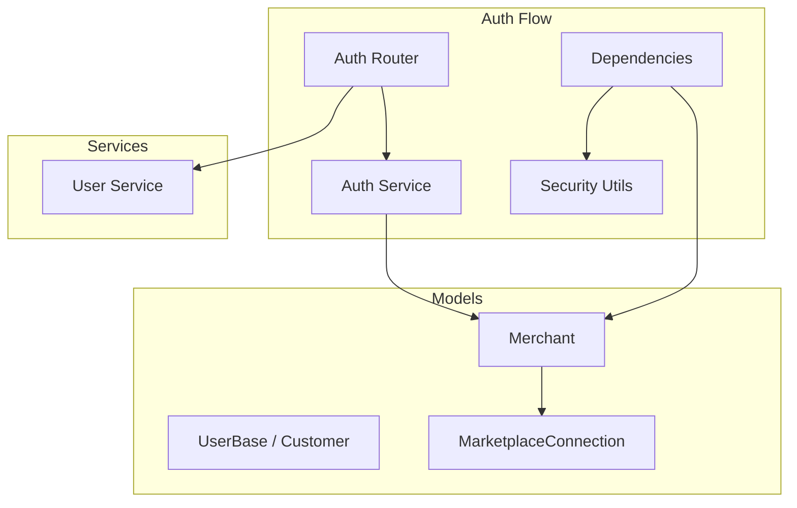
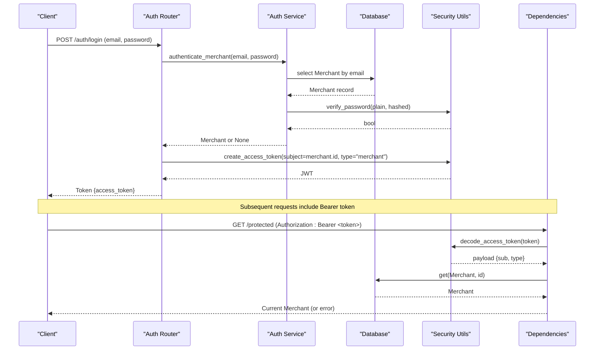
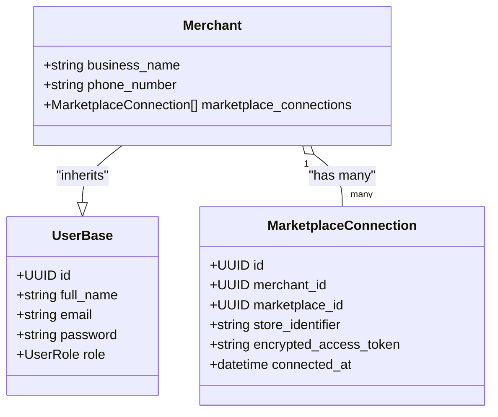
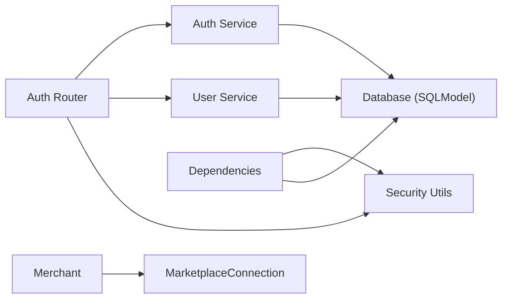
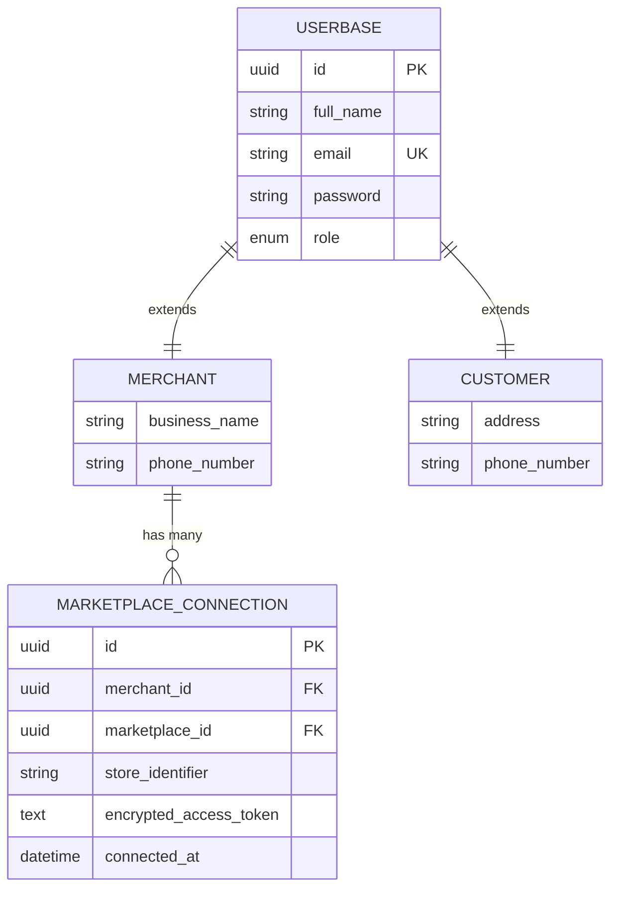

# Core Entities

<cite>
**Referenced Files in This Document**
- [merchant.py](file://neurocom_backend/database/models/merchant.py)
- [user.py](file://neurocom_backend/database/models/user.py)
- [marketplace.py](file://neurocom_backend/database/models/marketplace.py)
- [auth_router.py](file://neurocom_backend/routers/auth_router.py)
- [auth_service.py](file://neurocom_backend/services/auth_service.py)
- [dependencies.py](file://neurocom_backend/dependencies.py)
- [security.py](file://neurocom_backend/utils/security.py)
- [user_service.py](file://neurocom_backend/services/user_service.py)
- [create_admin.py](file://neurocom_backend/scripts/create_admin.py)
</cite>

## Table of Contents
1. Introduction
2. Project Structure
3. Core Components
4. Architecture Overview
5. Detailed Component Analysis
6. Dependency Analysis
7. Performance Considerations
8. Troubleshooting Guide
9. Conclusion
10. Appendices

## Introduction
This document describes the core entity models for the Tijarah AI Backend database schema, focusing on Merchant and User entities. It explains field definitions, data types, constraints, relationships, authentication integration, role-based access control (RBAC), and security considerations. It also includes entity relationship diagrams and examples of common queries and operations.

## Project Structure
The core entities are defined under the database models package and integrated with FastAPI routers, services, and utilities:
- Models define SQLModel tables and Pydantic schemas for request/response validation.
- Routers expose HTTP endpoints for authentication and user management.
- Services encapsulate business logic such as user creation and merchant authentication.
- Utilities provide password hashing, JWT token handling, and encryption helpers.
- Dependencies implement current-user resolution and role checks.

**Diagram sources**
- [merchant.py:11-14](file://neurocom_backend/database/models/merchant.py#L11-L14)
- [user.py:14-25](file://neurocom_backend/database/models/user.py#L14-L25)
- [marketplace.py:26-40](file://neurocom_backend/database/models/marketplace.py#L26-L40)
- [auth_router.py:18-42](file://neurocom_backend/routers/auth_router.py#L18-L42)
- [auth_service.py:6-10](file://neurocom_backend/services/auth_service.py#L6-L10)
- [dependencies.py:17-43](file://neurocom_backend/dependencies.py#L17-L43)
- [security.py:16-28](file://neurocom_backend/utils/security.py#L16-L28)
- [user_service.py:8-24](file://neurocom_backend/services/user_service.py#L8-L24)

**Section sources**
- [merchant.py:11-14](file://neurocom_backend/database/models/merchant.py#L11-L14)
- [user.py:14-25](file://neurocom_backend/database/models/user.py#L14-L25)
- [marketplace.py:26-40](file://neurocom_backend/database/models/marketplace.py#L26-L40)
- [auth_router.py:18-42](file://neurocom_backend/routers/auth_router.py#L18-L42)
- [auth_service.py:6-10](file://neurocom_backend/services/auth_service.py#L6-L10)
- [dependencies.py:17-43](file://neurocom_backend/dependencies.py#L17-L43)
- [security.py:16-28](file://neurocom_backend/utils/security.py#L16-L28)
- [user_service.py:8-24](file://neurocom_backend/services/user_service.py#L8-L24)

## Core Components
- Merchant: A specialized user type representing a merchant account with business details and marketplace connections.
- UserBase and Customer: Base user model shared by customers; merchants inherit from the same base to unify identity fields.
- MarketplaceConnection: Links a merchant to a specific marketplace store with encrypted credentials.

Key responsibilities:
- Identity and authentication: email, hashed password, role.
- Business context: business name, phone number.
- Relationships: one-to-many connections to marketplaces via MarketplaceConnection.

**Section sources**
- [merchant.py:11-29](file://neurocom_backend/database/models/merchant.py#L11-L29)
- [user.py:14-25](file://neurocom_backend/database/models/user.py#L14-L25)
- [marketplace.py:26-40](file://neurocom_backend/database/models/marketplace.py#L26-L40)

## Architecture Overview
Authentication and authorization flow:
- Clients authenticate via POST /auth/login using OAuth2 form credentials.
- The auth service verifies credentials against the Merchant table and returns a JWT.
- Protected endpoints use get_current_user to decode the JWT and resolve the Merchant instance.
- Role checks are enforced via require_roles or require_admin dependencies.

**Diagram sources**
- [auth_router.py:24-42](file://neurocom_backend/routers/auth_router.py#L24-L42)
- [auth_service.py:6-10](file://neurocom_backend/services/auth_service.py#L6-L10)
- [security.py:16-28](file://neurocom_backend/utils/security.py#L16-L28)
- [dependencies.py:17-43](file://neurocom_backend/dependencies.py#L17-L43)

## Detailed Component Analysis

### Merchant Entity
- Inherits identity fields from UserBase (id, full_name, email, password, role).
- Adds business-specific fields: business_name, phone_number.
- Relationship: one-to-many with MarketplaceConnection via back_populates.

Field definitions and constraints:
- id: UUID primary key, auto-generated, indexed.
- full_name: string, required, length 3–50.
- email: string, required, unique, indexed, validated as email.
- password: string, required, minimum length 4.
- role: enum UserRole, default user.
- business_name: string, required, min_length 2, max_length 100.
- phone_number: optional string, min_length 6.
- marketplace_connections: list of MarketplaceConnection linked by merchant_id.

Common operations:
- Create merchant: POST /auth/signup creates a new Merchant with hashed password and default role user.
- Login merchant: POST /auth/login authenticates and issues JWT.
- Read current user: GET /auth/me returns authenticated Merchant.

Example queries and operations:
- Find merchant by email: SELECT * FROM merchant WHERE email = ?
- Create merchant: INSERT INTO merchant (full_name, business_name, email, password, role, phone_number) VALUES (...)
- Authenticate merchant: SELECT * FROM merchant WHERE email = ? AND verify_password(...)
- Fetch merchant with connections: SELECT m.*, mc.* FROM merchant m LEFT JOIN marketplace_connection mc ON mc.merchant_id = m.id

**Section sources**
- [merchant.py:11-29](file://neurocom_backend/database/models/merchant.py#L11-L29)
- [user_service.py:8-24](file://neurocom_backend/services/user_service.py#L8-L24)
- [auth_router.py:18-42](file://neurocom_backend/routers/auth_router.py#L18-L42)
- [auth_service.py:6-10](file://neurocom_backend/services/auth_service.py#L6-L10)

#### Merchant Class Diagram

**Diagram sources**
- [user.py:14-19](file://neurocom_backend/database/models/user.py#L14-L19)
- [merchant.py:11-14](file://neurocom_backend/database/models/merchant.py#L11-L14)
- [marketplace.py:26-40](file://neurocom_backend/database/models/marketplace.py#L26-L40)

### UserBase and Customer Entities
- UserBase defines shared identity fields used across user types.
- Customer extends UserBase with address and phone_number, and relates to orders.

Field definitions and constraints:
- id: UUID primary key, auto-generated, indexed.
- full_name: string, required, length 3–50.
- email: string, required, unique, indexed, validated as email.
- password: string, required, minimum length 4.
- role: enum UserRole, default user.
- Customer adds:
  - address: optional string, min_length 3.
  - phone_number: optional string, min_length 6.
  - orders: relationship to Order (not detailed here).

Common operations:
- Create customer: similar pattern to merchant creation with hashed password.
- Query customers: SELECT * FROM customer WHERE email = ?

Example queries and operations:
- Create customer: INSERT INTO customer (full_name, email, password, role, address, phone_number) VALUES (...)
- Update customer profile: UPDATE customer SET ... WHERE id = ?
- List customer orders: SELECT * FROM order WHERE customer_id = ?

**Section sources**
- [user.py:14-25](file://neurocom_backend/database/models/user.py#L14-L25)

### MarketplaceConnection Entity
- Represents a merchant’s connection to a marketplace store.
- Enforces uniqueness per merchant, marketplace, and store_identifier.

Field definitions and constraints:
- id: UUID primary key, auto-generated, indexed.
- merchant_id: UUID foreign key to merchant.id, required, indexed.
- marketplace_id: UUID foreign key to marketplace.id, required, indexed.
- store_identifier: string, required, max_length 255, default "default".
- encrypted_access_token: text, optional, stores encrypted tokens.
- connected_at: datetime, defaults to UTC now.
- Unique constraint: (merchant_id, marketplace_id, store_identifier).

Relationships:
- Belongs to Merchant (one-to-many from Merchant).
- Belongs to Marketplace (one-to-many from Marketplace).

Common operations:
- Connect marketplace: INSERT INTO marketplace_connection (merchant_id, marketplace_id, store_identifier, encrypted_access_token, connected_at) VALUES (...)
- Retrieve merchant’s connections: SELECT * FROM marketplace_connection WHERE merchant_id = ?

**Section sources**
- [marketplace.py:26-40](file://neurocom_backend/database/models/marketplace.py#L26-L40)

### Authentication System Integration
- Signup: POST /auth/signup accepts MerchantCreate and persists with hashed password and default role user.
- Login: POST /auth/login validates credentials and issues a JWT with subject=merchant.id and type="merchant".
- Current user: GET /auth/me uses get_current_user dependency to decode JWT and fetch Merchant.

Flow highlights:
- Passwords are hashed using bcrypt before storage.
- JWTs are signed with SECRET_KEY and algorithm configured via settings.
- Access tokens encode account_type to restrict usage to merchant flows.

**Section sources**
- [auth_router.py:18-42](file://neurocom_backend/routers/auth_router.py#L18-L42)
- [auth_service.py:6-10](file://neurocom_backend/services/auth_service.py#L6-L10)
- [security.py:16-28](file://neurocom_backend/utils/security.py#L16-L28)
- [user_service.py:8-24](file://neurocom_backend/services/user_service.py#L8-L24)

### Role-Based Access Control (RBAC)
- Roles: admin, user (enum UserRole).
- Default role for newly created merchants is user.
- Admin accounts can be created or promoted via a dedicated script to avoid public exposure.
- RBAC enforcement:
  - get_current_user resolves the authenticated Merchant from JWT.
  - require_roles(*roles) dependency enforces that the current user has at least one of the specified roles.
  - require_admin is a convenience alias for require_roles(UserRole.admin).

Usage patterns:
- Protect routes with Depends(require_admin) to restrict to admins.
- Use Depends(get_current_user) to access the authenticated Merchant in any protected route.

**Section sources**
- [user.py:10-19](file://neurocom_backend/database/models/user.py#L10-L19)
- [dependencies.py:67-79](file://neurocom_backend/dependencies.py#L67-L79)
- [create_admin.py:20-42](file://neurocom_backend/scripts/create_admin.py#L20-L42)

### Security Considerations
- Password hashing: bcrypt via passlib CryptContext ensures secure storage.
- JWT signing: uses SECRET_KEY and configured algorithm; tokens include subject and account_type.
- Encryption: Fernet symmetric encryption for sensitive values like access tokens stored in the database.
- Input validation: Pydantic models enforce field constraints (length, format).
- Authorization: JWT decoding and role checks prevent unauthorized access.

Best practices:
- Rotate SECRET_KEY periodically and manage securely via environment variables.
- Ensure ACCESS_TOKEN_EXPIRE_MINUTES is set appropriately to limit token lifetime.
- Validate all inputs using Pydantic schemas to prevent injection and malformed data.
- Log authentication failures without exposing sensitive details.

**Section sources**
- [security.py:16-43](file://neurocom_backend/utils/security.py#L16-L43)
- [dependencies.py:17-43](file://neurocom_backend/dependencies.py#L17-L43)
- [auth_router.py:24-42](file://neurocom_backend/routers/auth_router.py#L24-L42)

## Dependency Analysis
Core dependencies between components:
- Auth Router depends on Auth Service and Security Utils for login/signup flows.
- Dependencies module provides get_current_user and role enforcement using Security Utils and Database.
- Models define relationships that drive ORM queries and joins.

**Diagram sources**
- [auth_router.py:18-42](file://neurocom_backend/routers/auth_router.py#L18-L42)
- [auth_service.py:6-10](file://neurocom_backend/services/auth_service.py#L6-L10)
- [user_service.py:8-24](file://neurocom_backend/services/user_service.py#L8-L24)
- [dependencies.py:17-43](file://neurocom_backend/dependencies.py#L17-L43)
- [merchant.py:11-14](file://neurocom_backend/database/models/merchant.py#L11-L14)
- [marketplace.py:26-40](file://neurocom_backend/database/models/marketplace.py#L26-L40)

**Section sources**
- [auth_router.py:18-42](file://neurocom_backend/routers/auth_router.py#L18-L42)
- [auth_service.py:6-10](file://neurocom_backend/services/auth_service.py#L6-L10)
- [user_service.py:8-24](file://neurocom_backend/services/user_service.py#L8-L24)
- [dependencies.py:17-43](file://neurocom_backend/dependencies.py#L17-L43)
- [merchant.py:11-14](file://neurocom_backend/database/models/merchant.py#L11-L14)
- [marketplace.py:26-40](file://neurocom_backend/database/models/marketplace.py#L26-L40)

## Performance Considerations
- Indexing:
  - email fields are indexed for fast lookups during authentication and user resolution.
  - marketplace_connection indexes on merchant_id and marketplace_id optimize join performance.
- Pagination:
  - For listing merchants or connections, apply pagination to reduce payload size and query cost.
- Caching:
  - Consider caching frequently accessed merchant profiles or marketplace listings to reduce DB load.
- Connection pooling:
  - Ensure proper database connection pooling configuration to handle concurrent requests efficiently.
- Token lifecycle:
  - Set reasonable ACCESS_TOKEN_EXPIRE_MINUTES to balance security and usability.

[No sources needed since this section provides general guidance]

## Troubleshooting Guide
Common issues and resolutions:
- Incorrect email or password:
  - Occurs when authenticate_merchant fails verification; ensure correct credentials and that passwords were hashed during signup.
- Unauthorized access:
  - Missing or invalid JWT; verify Authorization header format and token validity.
- Forbidden action:
  - Insufficient role; ensure the current user has required role (e.g., admin) using require_roles or require_admin.
- Duplicate merchant:
  - Email already exists; check uniqueness constraints and handle errors gracefully.

Operational tips:
- Use the create_admin script to bootstrap an admin account safely.
- Validate input payloads using Pydantic schemas to catch errors early.
- Monitor logs for authentication failures and token decoding errors.

**Section sources**
- [auth_router.py:24-42](file://neurocom_backend/routers/auth_router.py#L24-L42)
- [auth_service.py:6-10](file://neurocom_backend/services/auth_service.py#L6-L10)
- [dependencies.py:67-79](file://neurocom_backend/dependencies.py#L67-L79)
- [create_admin.py:20-42](file://neurocom_backend/scripts/create_admin.py#L20-L42)

## Conclusion
The Tijarah AI Backend models center around Merchant and UserBase/Customer, providing a unified identity system with role-based access control. Merchants extend base user fields with business context and connect to marketplaces through encrypted credentials. Authentication integrates JWT-based sessions with robust security measures including password hashing and token encryption. RBAC is enforced via reusable dependencies, ensuring secure and scalable access control across the application.

[No sources needed since this section summarizes without analyzing specific files]

## Appendices

### Entity Relationship Diagram

**Diagram sources**
- [user.py:14-25](file://neurocom_backend/database/models/user.py#L14-L25)
- [merchant.py:11-14](file://neurocom_backend/database/models/merchant.py#L11-L14)
- [marketplace.py:26-40](file://neurocom_backend/database/models/marketplace.py#L26-L40)

### Common Queries and Operations Examples
- Create merchant:
  - Endpoint: POST /auth/signup
  - Payload: MerchantCreate (full_name, business_name, email, password, phone_number)
  - Behavior: Hashes password, sets role=user, persists to database.
- Authenticate merchant:
  - Endpoint: POST /auth/login
  - Payload: OAuth2 form (username=email, password)
  - Behavior: Verifies credentials, issues JWT with subject=merchant.id and type="merchant".
- Get current user:
  - Endpoint: GET /auth/me
  - Header: Authorization: Bearer <token>
  - Behavior: Decodes JWT, resolves Merchant, returns MerchantRead.
- Query merchant by email:
  - SQL: SELECT * FROM merchant WHERE email = ?
- Fetch merchant with marketplace connections:
  - SQL: SELECT m.*, mc.* FROM merchant m LEFT JOIN marketplace_connection mc ON mc.merchant_id = m.id
- Create marketplace connection:
  - SQL: INSERT INTO marketplace_connection (merchant_id, marketplace_id, store_identifier, encrypted_access_token, connected_at) VALUES (...)
- Promote existing merchant to admin:
  - Script: python -m neurocom_backend.scripts.create_admin --email ... --password ... --full-name ... --business-name ...

**Section sources**
- [auth_router.py:18-42](file://neurocom_backend/routers/auth_router.py#L18-L42)
- [auth_service.py:6-10](file://neurocom_backend/services/auth_service.py#L6-L10)
- [user_service.py:8-24](file://neurocom_backend/services/user_service.py#L8-L24)
- [create_admin.py:20-42](file://neurocom_backend/scripts/create_admin.py#L20-L42)