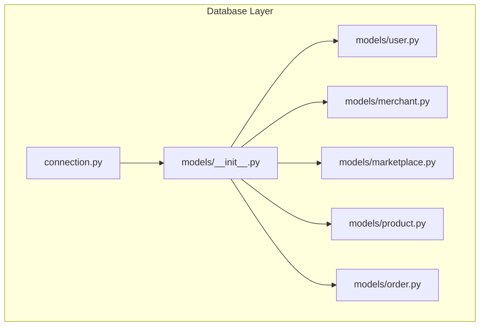
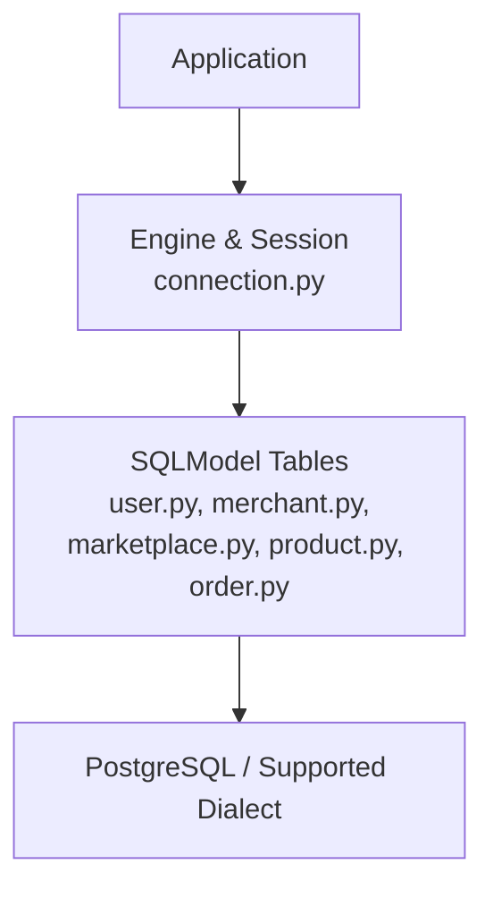
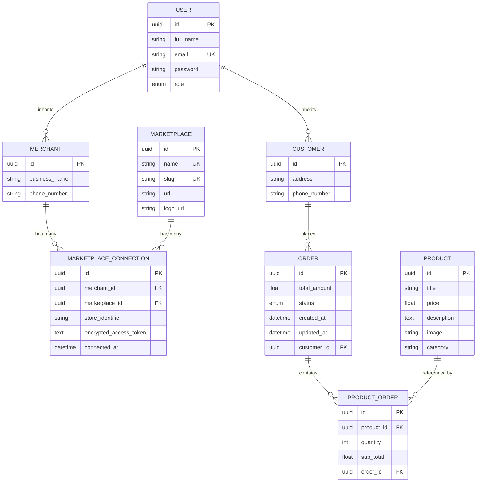
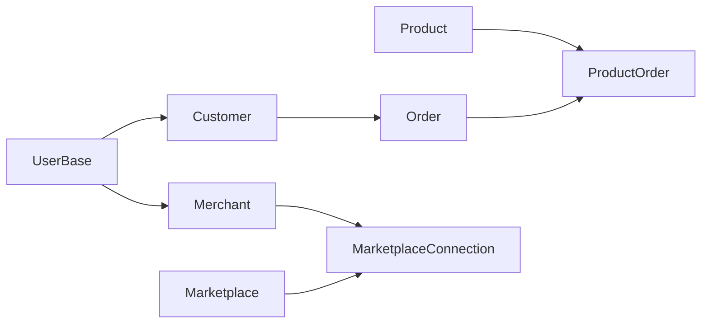

# Database Schema

<cite>
**Referenced Files in This Document**
- [connection.py](file://neurocom_backend/database/connection.py)
- [__init__.py](file://neurocom_backend/database/models/__init__.py)
- [user.py](file://neurocom_backend/database/models/user.py)
- [merchant.py](file://neurocom_backend/database/models/merchant.py)
- [marketplace.py](file://neurocom_backend/database/models/marketplace.py)
- [product.py](file://neurocom_backend/database/models/product.py)
- [order.py](file://neurocom_backend/database/models/order.py)
</cite>

## Table of Contents
1. Introduction
2. Project Structure
3. Core Components
4. Architecture Overview
5. Detailed Component Analysis
6. Dependency Analysis
7. Performance Considerations
8. Troubleshooting Guide
9. Conclusion
10. Appendices

## Introduction
This document provides comprehensive database schema documentation for the Tijarah AI Backend. It details all entity relationships (merchants, users, products, orders, and marketplace connections), field definitions, data types, constraints, and indexes as implemented via SQLModel ORM. It also explains database connection configuration, migration behavior, validation rules, referential integrity policies, and offers guidance on optimization, backup strategies, and maintenance procedures.

## Project Structure
The database layer is organized under the database package:
- Connection and session management are defined in a dedicated module.
- Models are grouped by domain entities (users, merchants, marketplaces, products, orders).
- A seed script exists for development data population (currently commented out).

**Diagram sources**
- [connection.py:1-28](file://neurocom_backend/database/connection.py#L1-L28)
- [__init__.py:1-13](file://neurocom_backend/database/models/__init__.py#L1-L13)

**Section sources**
- [connection.py:1-28](file://neurocom_backend/database/connection.py#L1-L28)
- [__init__.py:1-13](file://neurocom_backend/database/models/__init__.py#L1-L13)

## Core Components
This section summarizes the core models and their responsibilities:
- Users and Customers: Base user identity with role-based access; Customer extends base user with address and phone.
- Merchants: Business accounts that can connect to marketplaces.
- Marketplaces and Connections: Catalog of supported marketplaces and per-merchant connections with tokens and store identifiers.
- Products: Catalog items with pricing and metadata.
- Orders and ProductOrders: Purchase records linking customers to products with quantities and totals.

Key implementation notes:
- All primary keys are UUIDs with auto-generation and indexing.
- Relationships are declared using SQLModel Relationship and back_populates.
- Validation is enforced at the Pydantic schema level for create/update/read models.
- Unique constraints exist for emails, marketplace names/slugs, and merchant-marketplace-store combinations.

**Section sources**
- [user.py:10-42](file://neurocom_backend/database/models/user.py#L10-L42)
- [merchant.py:11-30](file://neurocom_backend/database/models/merchant.py#L11-L30)
- [marketplace.py:17-41](file://neurocom_backend/database/models/marketplace.py#L17-L41)
- [product.py:13-21](file://neurocom_backend/database/models/product.py#L13-L21)
- [order.py:11-39](file://neurocom_backend/database/models/order.py#L11-L39)

## Architecture Overview
The database architecture centers around SQLModel ORM with SQLAlchemy engine configuration. The application creates tables at startup and applies PostgreSQL-specific migrations to ensure referential integrity and unique constraints.

**Diagram sources**
- [connection.py:9-23](file://neurocom_backend/database/connection.py#L9-L23)
- [user.py:14-25](file://neurocom_backend/database/models/user.py#L14-L25)
- [merchant.py:11-15](file://neurocom_backend/database/models/merchant.py#L11-L15)
- [marketplace.py:17-41](file://neurocom_backend/database/models/marketplace.py#L17-L41)
- [product.py:13-21](file://neurocom_backend/database/models/product.py#L13-L21)
- [order.py:21-39](file://neurocom_backend/database/models/order.py#L21-L39)

## Detailed Component Analysis

### Entity-Relationship Diagram

**Diagram sources**
- [user.py:14-25](file://neurocom_backend/database/models/user.py#L14-L25)
- [merchant.py:11-15](file://neurocom_backend/database/models/merchant.py#L11-L15)
- [marketplace.py:17-41](file://neurocom_backend/database/models/marketplace.py#L17-L41)
- [product.py:13-21](file://neurocom_backend/database/models/product.py#L13-L21)
- [order.py:21-39](file://neurocom_backend/database/models/order.py#L21-L39)

### Model: UserBase and Customer
- UserBase defines shared identity fields:
  - id: UUID primary key, auto-generated, indexed.
  - full_name: non-null, length-constrained.
  - email: non-null, unique, indexed, validated as email format.
  - password: non-null, minimum length.
  - role: enum defaulting to user.
- Customer inherits from UserBase and adds optional address and phone_number with min-length validation.
- Relationship: Customer has many Orders.

Validation and constraints:
- Email uniqueness enforced at DB level via unique index.
- Role enumeration restricts values to admin or user.

Indexes:
- Primary key index on id.
- Index on email for lookups.

**Section sources**
- [user.py:10-25](file://neurocom_backend/database/models/user.py#L10-L25)

### Model: Merchant
- Inherits from UserBase, adding business_name and optional phone_number with validation.
- Relationship: Merchant has many MarketplaceConnection entries.

Constraints:
- business_name non-null with length limits.
- phone_number optional but validated when present.

Indexes:
- Inherited from UserBase (id, email).

**Section sources**
- [merchant.py:11-15](file://neurocom_backend/database/models/merchant.py#L11-L15)

### Model: Marketplace and MarketplaceConnection
- Marketplace:
  - Fields: id (UUID, PK, index), name (unique, indexed), slug (unique, indexed), url, logo_url.
  - Relationship: Marketplace has many MarketplaceConnection entries.
- MarketplaceConnection:
  - Fields: id (UUID, PK, index), merchant_id (FK to merchant.id, indexed), marketplace_id (FK to marketplace.id, indexed), store_identifier (default "default", max length), encrypted_access_token (nullable text), connected_at (UTC timestamp).
  - Constraints: UniqueConstraint on (merchant_id, marketplace_id, store_identifier).
  - Relationships: belongs to Marketplace and Merchant.

Validation and constraints:
- Name and slug uniqueness enforced at DB level.
- Store identifier ensures a merchant can connect multiple stores per marketplace uniquely.

Indexes:
- PK indexes on ids.
- Indexes on merchant_id and marketplace_id for efficient joins.
- Unique constraint enforces referential integrity across merchant-marketplace-store triplets.

**Section sources**
- [marketplace.py:17-41](file://neurocom_backend/database/models/marketplace.py#L17-L41)

### Model: Product
- Fields: id (UUID, PK, index), title (non-null, min length), price (float, non-null), description (text), image (string), category (string).
- No direct relationships currently defined in this model.

Validation and constraints:
- Title must meet minimum length.
- Price is required and numeric.

Indexes:
- PK index on id.

**Section sources**
- [product.py:13-21](file://neurocom_backend/database/models/product.py#L13-L21)

### Model: Order and ProductOrder
- Order:
  - Fields: id (UUID, PK, index), total_amount (float, default 0), status (enum with predefined states, indexed), created_at (datetime), updated_at (datetime), customer_id (FK to customer.id, nullable, indexed).
  - Relationships: belongs to Customer; has many ProductOrder entries.
- ProductOrder:
  - Fields: id (UUID, PK, index), product_id (FK to product.id, non-null), quantity (int, default 0), sub_total (float, default 0), order_id (FK to order.id, nullable).
  - Relationships: belongs to Order; references Product.

Validation and constraints:
- Status restricted to predefined enum values.
- Quantity and sub_total defaults provide safe initial state.
- Nullable foreign keys allow flexible lifecycle transitions.

Indexes:
- PK indexes on ids.
- Index on status for filtering orders by state.
- Index on customer_id for customer-order queries.

**Section sources**
- [order.py:11-39](file://neurocom_backend/database/models/order.py#L11-L39)

### Database Connection and Migration Strategy
- Engine creation:
  - Uses environment variable DB_CONNECTION_STRING for the database URL.
  - Pool recycle configured to manage long-lived connections.
  - Optional SQL echo controlled by SQL_ECHO environment variable.
- Migration behavior:
  - On startup, tables are created via metadata.create_all.
  - For PostgreSQL dialect, an additional migration step ensures:
    - A store_identifier column exists with a default value.
    - Legacy unique constraints are dropped if present.
    - A new unique constraint on (merchant_id, marketplace_id, store_identifier) is added.
- Session management:
  - get_session yields a scoped Session for request handling.

Operational notes:
- Ensure DB_CONNECTION_STRING points to a valid PostgreSQL instance for migration logic to apply.
- Echo logging can be enabled for debugging SQL statements during development.

**Section sources**
- [connection.py:9-23](file://neurocom_backend/database/connection.py#L9-L23)
- [connection.py:25-28](file://neurocom_backend/database/connection.py#L25-L28)

### Data Validation Rules and Business Constraints
- Identity and roles:
  - Email uniqueness prevents duplicate accounts.
  - Role enumeration controls access levels.
- Merchant-marketplace connections:
  - Unique triplet (merchant_id, marketplace_id, store_identifier) prevents duplicate connections to the same store.
- Orders:
  - Status enum constrains lifecycle transitions.
  - Total amount defaults to zero until computed.
- Products:
  - Required fields ensure catalog completeness.

Referential integrity policies:
- Foreign keys enforce relationships between orders, customers, products, merchants, and marketplaces.
- Unique constraints protect data consistency for identities and connections.

**Section sources**
- [user.py:14-25](file://neurocom_backend/database/models/user.py#L14-L25)
- [marketplace.py:26-41](file://neurocom_backend/database/models/marketplace.py#L26-L41)
- [order.py:21-39](file://neurocom_backend/database/models/order.py#L21-L39)

## Dependency Analysis
The models form a cohesive dependency graph where higher-level entities depend on foundational ones:
- Orders depend on Customers and Products through ProductOrder.
- Merchants connect to Marketplaces via MarketplaceConnection.
- Users serve as base for both Customers and Merchants.

**Diagram sources**
- [user.py:14-25](file://neurocom_backend/database/models/user.py#L14-L25)
- [merchant.py:11-15](file://neurocom_backend/database/models/merchant.py#L11-L15)
- [marketplace.py:17-41](file://neurocom_backend/database/models/marketplace.py#L17-L41)
- [product.py:13-21](file://neurocom_backend/database/models/product.py#L13-L21)
- [order.py:21-39](file://neurocom_backend/database/models/order.py#L21-L39)

**Section sources**
- [user.py:14-25](file://neurocom_backend/database/models/user.py#L14-L25)
- [merchant.py:11-15](file://neurocom_backend/database/models/merchant.py#L11-L15)
- [marketplace.py:17-41](file://neurocom_backend/database/models/marketplace.py#L17-L41)
- [product.py:13-21](file://neurocom_backend/database/models/product.py#L13-L21)
- [order.py:21-39](file://neurocom_backend/database/models/order.py#L21-L39)

## Performance Considerations
- Indexing strategy:
  - Primary keys are indexed by default.
  - Additional indexes on email, status, customer_id, merchant_id, marketplace_id improve query performance for common filters and joins.
- Query patterns:
  - Filter orders by status and customer_id leveraging indexes.
  - Join marketplace connections efficiently using indexed foreign keys.
- Connection pooling:
  - Pool recycle helps prevent stale connections in long-running processes.
- Large datasets:
  - Consider partitioning orders by date ranges if volume grows significantly.
  - Archive historical orders to maintain performance.

[No sources needed since this section provides general guidance]

## Troubleshooting Guide
Common issues and resolutions:
- Duplicate marketplace connections:
  - Error due to unique constraint on (merchant_id, marketplace_id, store_identifier).
  - Resolution: Ensure store_identifier is unique per merchant-marketplace pair or update existing connection.
- Missing store_identifier column:
  - Migration step adds the column with default value for PostgreSQL.
  - Resolution: Run perform_migration to apply changes.
- Email conflicts:
  - Unique constraint violation on email.
  - Resolution: Use a different email or update existing account.
- Invalid order status:
  - Enum mismatch when setting order status.
  - Resolution: Use one of the predefined statuses.

Operational checks:
- Verify DB_CONNECTION_STRING is correctly set.
- Enable SQL echo to inspect generated SQL during development.

**Section sources**
- [connection.py:15-23](file://neurocom_backend/database/connection.py#L15-L23)
- [marketplace.py:26-41](file://neurocom_backend/database/models/marketplace.py#L26-L41)
- [order.py:11-20](file://neurocom_backend/database/models/order.py#L11-L20)

## Conclusion
The Tijarah AI Backend uses a well-structured SQLModel ORM schema that supports core e-commerce operations: managing merchants and customers, connecting to marketplaces, maintaining a product catalog, and processing orders. Strong validation rules and referential integrity ensure data quality, while strategic indexing supports efficient querying. The migration process adapts schema changes safely, particularly for marketplace connections. Following the recommended optimization, backup, and maintenance practices will help sustain performance and reliability as the system scales.

[No sources needed since this section summarizes without analyzing specific files]

## Appendices

### Field Definitions and Constraints Summary
- Users and Customers:
  - id: UUID PK, auto-generated, indexed.
  - full_name: string, non-null, length-limited.
  - email: string, non-null, unique, indexed, email format.
  - password: string, non-null, minimum length.
  - role: enum (admin, user).
  - address: optional string, minimum length.
  - phone_number: optional string, minimum length.
- Merchants:
  - business_name: string, non-null, length-limited.
  - phone_number: optional string, minimum length.
- Marketplaces:
  - name: string, non-null, unique, length-limited, indexed.
  - slug: string, non-null, unique, length-limited, indexed.
  - url: string, non-null, max length.
  - logo_url: string, non-null, max length.
- MarketplaceConnection:
  - merchant_id: UUID FK to merchant.id, indexed.
  - marketplace_id: UUID FK to marketplace.id, indexed.
  - store_identifier: string, default "default", max length.
  - encrypted_access_token: text, nullable.
  - connected_at: datetime, UTC.
  - UniqueConstraint on (merchant_id, marketplace_id, store_identifier).
- Products:
  - title: string, non-null, minimum length.
  - price: float, non-null.
  - description: text.
  - image: string.
  - category: string.
- Orders:
  - total_amount: float, default 0.
  - status: enum (pending, processing, shipped, delivered, cancelled, return_requested, returned, refunded), indexed.
  - created_at: datetime.
  - updated_at: datetime.
  - customer_id: UUID FK to customer.id, nullable, indexed.
- ProductOrder:
  - product_id: UUID FK to product.id, non-null.
  - quantity: int, default 0.
  - sub_total: float, default 0.
  - order_id: UUID FK to order.id, nullable.

**Section sources**
- [user.py:14-25](file://neurocom_backend/database/models/user.py#L14-L25)
- [merchant.py:11-15](file://neurocom_backend/database/models/merchant.py#L11-L15)
- [marketplace.py:17-41](file://neurocom_backend/database/models/marketplace.py#L17-L41)
- [product.py:13-21](file://neurocom_backend/database/models/product.py#L13-L21)
- [order.py:21-39](file://neurocom_backend/database/models/order.py#L21-L39)

### Sample Queries
- List all orders for a customer:
  - Select orders where customer_id matches the target customer.
- Find marketplace connections for a merchant:
  - Select marketplace_connection rows filtered by merchant_id.
- Get products included in an order:
  - Join product_order with product using product_id and filter by order_id.

[No sources needed since this section provides conceptual examples]

### Backup and Maintenance Procedures
- Backups:
  - Schedule regular logical backups of the database using native tools (e.g., pg_dump for PostgreSQL).
  - Include schema and data snapshots before major migrations.
- Maintenance:
  - Monitor table sizes and indexes; rebuild or reorganize as needed.
  - Review slow queries and adjust indexes accordingly.
  - Rotate logs and enable SQL echo only in development environments.
- Migrations:
  - Always run perform_migration after deploying schema changes.
  - Validate unique constraints and foreign keys post-migration.

[No sources needed since this section provides general guidance]