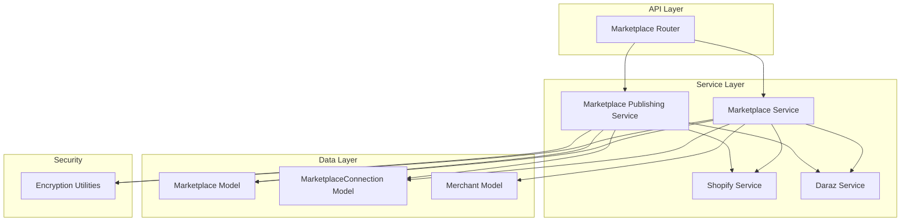
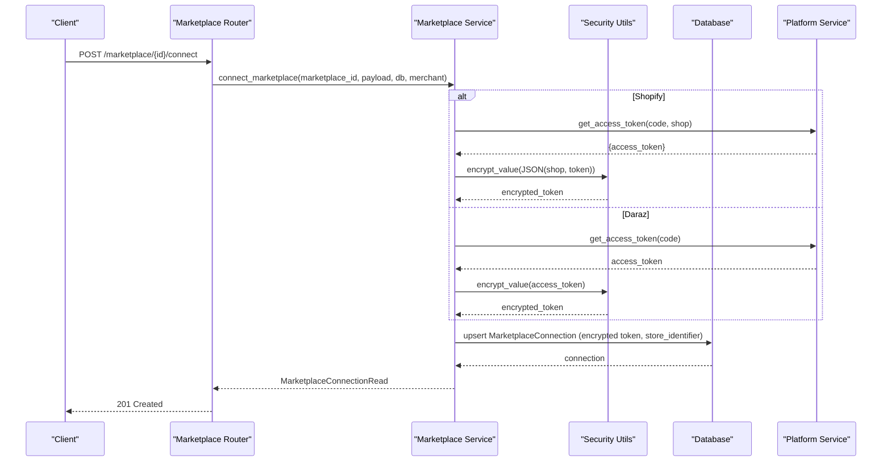
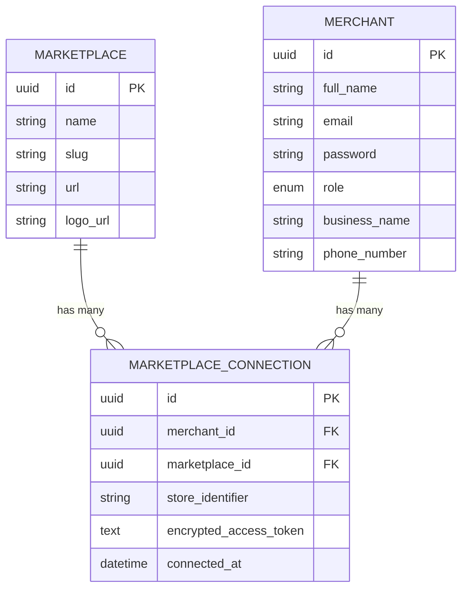
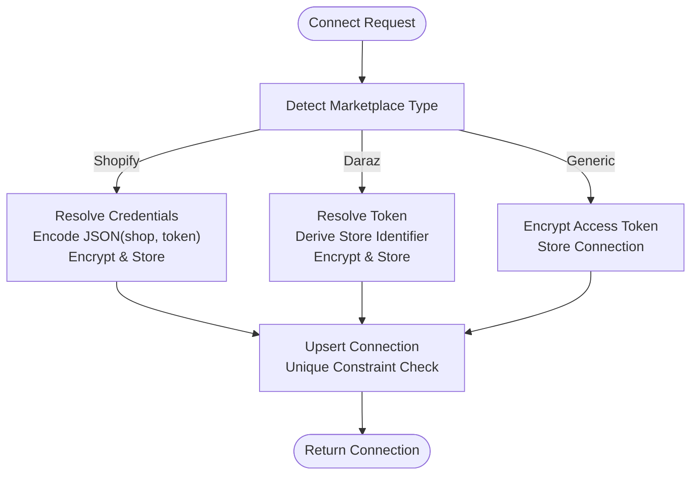
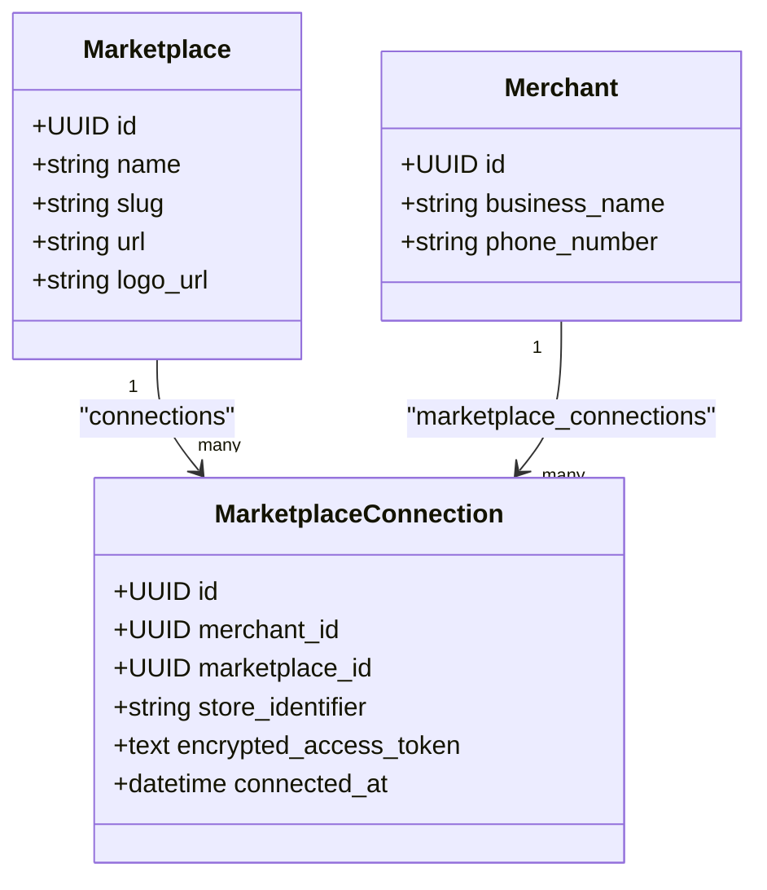
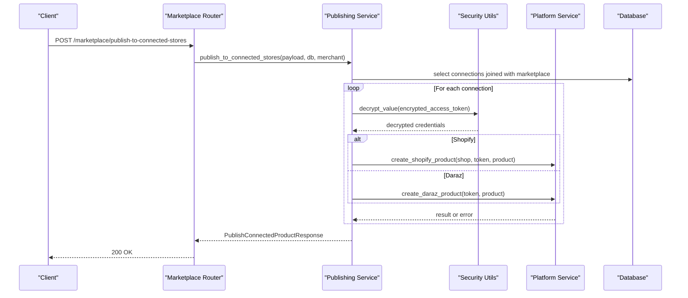
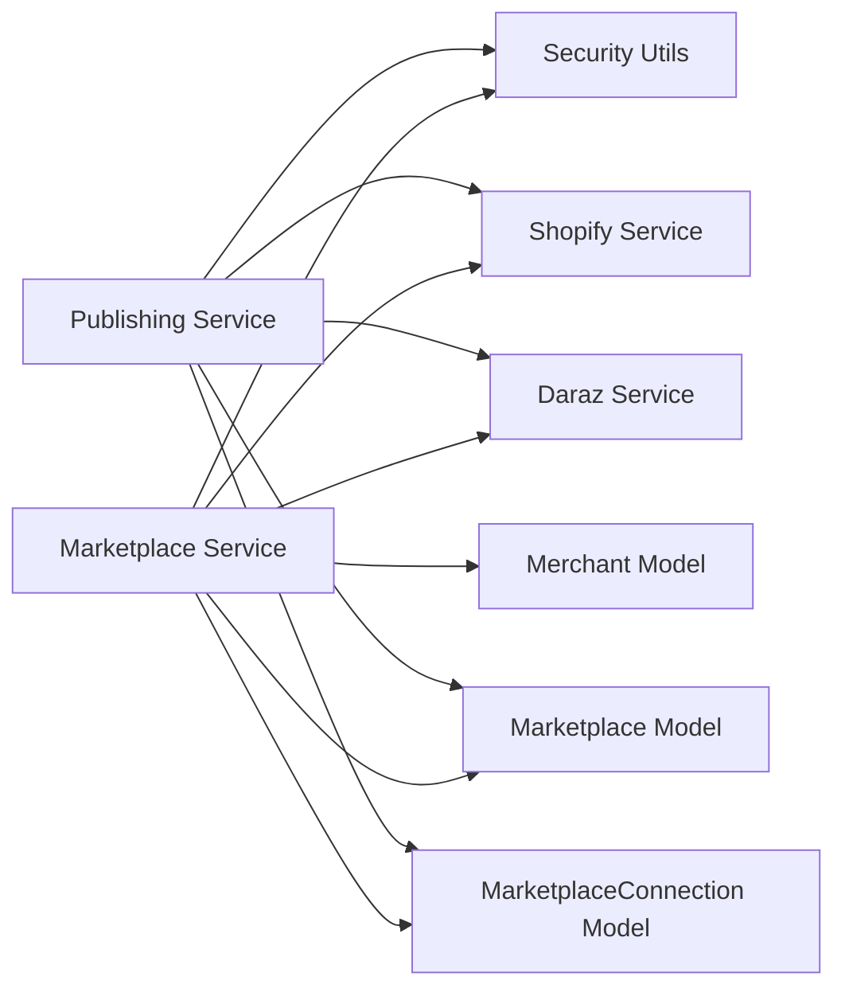

# Marketplace Connections

<cite>
**Referenced Files in This Document**
- [marketplace.py](file://neurocom_backend/database/models/marketplace.py)
- [merchant.py](file://neurocom_backend/database/models/merchant.py)
- [user.py](file://neurocom_backend/database/models/user.py)
- [marketplace_service.py](file://neurocom_backend/services/marketplace_service.py)
- [marketplace_router.py](file://neurocom_backend/routers/marketplace_router.py)
- [security.py](file://neurocom_backend/utils/security.py)
- [shopify_service.py](file://neurocom_backend/services/shopify_service.py)
- [daraz_service.py](file://neurocom_backend/services/daraz_service.py)
- [marketplace_publishing_service.py](file://neurocom_backend/services/marketplace_publishing_service.py)
</cite>

## Table of Contents
1. [Introduction](#introduction)
2. [Project Structure](#project-structure)
3. [Core Components](#core-components)
4. [Architecture Overview](#architecture-overview)
5. [Detailed Component Analysis](#detailed-component-analysis)
6. [Dependency Analysis](#dependency-analysis)
7. [Performance Considerations](#performance-considerations)
8. [Troubleshooting Guide](#troubleshooting-guide)
9. [Conclusion](#conclusion)
10. [Appendices](#appendices)

## Introduction
This document explains the database schema and runtime behavior for connecting merchants to external marketplaces (Daraz and Shopify) in the Tijarah AI Backend. It focuses on:
- Marketplace definitions and supported platforms
- Connection management between merchants and marketplaces
- OAuth token storage and encryption
- Store identifiers and multi-store support
- Connection lifecycle, including connect, update, disconnect, and publish flows
- Security considerations for sensitive credentials

## Project Structure
The marketplace connection feature spans models, services, routers, and utilities:
- Models define the persistent schema for Marketplaces and their Connections to Merchants
- Services implement business logic for connecting, listing, updating, and publishing to connected stores
- Routers expose HTTP endpoints for clients to manage connections
- Utilities handle secure encryption/decryption of tokens
- Platform-specific services integrate with Daraz and Shopify APIs

**Diagram sources**
- [marketplace_router.py:31-118](file://neurocom_backend/routers/marketplace_router.py#L31-L118)
- [marketplace_service.py:98-302](file://neurocom_backend/services/marketplace_service.py#L98-L302)
- [marketplace_publishing_service.py:34-64](file://neurocom_backend/services/marketplace_publishing_service.py#L34-L64)
- [security.py:31-44](file://neurocom_backend/utils/security.py#L31-L44)

**Section sources**
- [marketplace_router.py:31-118](file://neurocom_backend/routers/marketplace_router.py#L31-L118)
- [marketplace_service.py:98-302](file://neurocom_backend/services/marketplace_service.py#L98-L302)
- [marketplace_publishing_service.py:34-64](file://neurocom_backend/services/marketplace_publishing_service.py#L34-L64)
- [security.py:31-44](file://neurocom_backend/utils/security.py#L31-L44)

## Core Components
- Marketplace: Represents a supported platform definition (e.g., Daraz, Shopify) with metadata like name, slug, URL, and logo.
- MarketplaceConnection: Links a Merchant to a specific Marketplace instance, storing an encrypted access token and a store identifier to support multiple stores per merchant.
- Merchant: The business entity that owns connections; extends the base User model.
- Pydantic schemas: Define request/response contracts for creating/updating marketplaces and connecting/disconnecting stores.

Key relationships:
- One-to-many: Marketplace has many MarketplaceConnections
- Many-to-one: MarketplaceConnection belongs to one Marketplace and one Merchant
- Unique constraint: Ensures a merchant cannot have duplicate connections to the same marketplace/store combination

**Section sources**
- [marketplace.py:17-41](file://neurocom_backend/database/models/marketplace.py#L17-L41)
- [merchant.py:11-15](file://neurocom_backend/database/models/merchant.py#L11-L15)
- [user.py:14-20](file://neurocom_backend/database/models/user.py#L14-L20)

## Architecture Overview
The system exposes REST endpoints to manage marketplace definitions and connections. When a merchant connects to a marketplace:
- For Shopify: The service exchanges an OAuth code for an access token, encodes shop domain and token into a JSON payload, encrypts it, and stores it in the connection record.
- For Daraz: The service exchanges an OAuth code for an access token, derives a deterministic store identifier from the token, encrypts the token, and stores it.

When publishing products:
- The service decrypts stored credentials, resolves the correct platform handler, and calls platform-specific creation functions.

**Diagram sources**
- [marketplace_router.py:105-118](file://neurocom_backend/routers/marketplace_router.py#L105-L118)
- [marketplace_service.py:178-280](file://neurocom_backend/services/marketplace_service.py#L178-L280)
- [security.py:38-44](file://neurocom_backend/utils/security.py#L38-L44)
- [shopify_service.py:87-121](file://neurocom_backend/services/shopify_service.py#L87-L121)
- [daraz_service.py:40-46](file://neurocom_backend/services/daraz_service.py#L40-L46)

## Detailed Component Analysis

### Database Schema and Relationships
- Marketplace:
  - Fields: id, name, slug, url, logo_url
  - Indexes: id, name, slug
  - Relationship: connections to MarketplaceConnection
- MarketplaceConnection:
  - Fields: id, merchant_id, marketplace_id, store_identifier, encrypted_access_token, connected_at
  - UniqueConstraint: (merchant_id, marketplace_id, store_identifier)
  - Relationships: belongs to Marketplace and Merchant
- Merchant:
  - Extends UserBase with business_name and phone_number
  - Relationship: marketplace_connections back_populates to MarketplaceConnection

**Diagram sources**
- [marketplace.py:17-41](file://neurocom_backend/database/models/marketplace.py#L17-L41)
- [merchant.py:11-15](file://neurocom_backend/database/models/merchant.py#L11-L15)
- [user.py:14-20](file://neurocom_backend/database/models/user.py#L14-L20)

**Section sources**
- [marketplace.py:17-41](file://neurocom_backend/database/models/marketplace.py#L17-L41)
- [merchant.py:11-15](file://neurocom_backend/database/models/merchant.py#L11-L15)
- [user.py:14-20](file://neurocom_backend/database/models/user.py#L14-L20)

### Connection Lifecycle
- Create Marketplace: Admin creates a supported marketplace entry with name, slug, URL, and logo.
- List Marketplaces: Clients list all supported marketplaces and see whether each is already connected by the current merchant.
- Connect Marketplace:
  - Shopify: Requires either an OAuth code or an access token plus shop domain. The service normalizes the shop domain, exchanges code if provided, encodes credentials, encrypts them, and stores the connection.
  - Daraz: Requires either an OAuth code or an access token. The service exchanges code if provided, derives a deterministic store identifier from the token, encrypts the token, and stores the connection.
- Update Marketplace: Admin updates marketplace metadata; slug is regenerated if needed.
- Disconnect Marketplace: A merchant can remove a connection by connection ID.
- Publish to Connected Stores: Decrypts stored credentials and publishes product data to each connected store based on marketplace type.

**Diagram sources**
- [marketplace_service.py:178-280](file://neurocom_backend/services/marketplace_service.py#L178-L280)

**Section sources**
- [marketplace_service.py:98-302](file://neurocom_backend/services/marketplace_service.py#L98-L302)
- [marketplace_router.py:43-118](file://neurocom_backend/routers/marketplace_router.py#L43-L118)

### Token Encryption and Multi-Store Support
- Encryption: All access tokens are encrypted before storage using Fernet symmetric encryption derived from the application secret key. Decryption occurs only when publishing to a connected store.
- Multi-Store:
  - Shopify: store_identifier is the normalized shop domain, enabling multiple shops per merchant.
  - Daraz: store_identifier is derived deterministically from the access token, ensuring uniqueness per token while still allowing multiple distinct connections.
- Uniqueness: The unique constraint on (merchant_id, marketplace_id, store_identifier) prevents duplicate connections to the same store.

**Diagram sources**
- [marketplace.py:17-41](file://neurocom_backend/database/models/marketplace.py#L17-L41)
- [merchant.py:11-15](file://neurocom_backend/database/models/merchant.py#L11-L15)

**Section sources**
- [security.py:31-44](file://neurocom_backend/utils/security.py#L31-L44)
- [marketplace_service.py:236-280](file://neurocom_backend/services/marketplace_service.py#L236-L280)
- [shopify_service.py:691-700](file://neurocom_backend/services/shopify_service.py#L691-L700)

### Publishing Flow
- The publishing service iterates over all connections for the authenticated merchant.
- For each connection:
  - If no encrypted token exists, mark result as failed with a clear error.
  - Decrypt the token and route to the appropriate platform service based on marketplace slug/name.
  - Call platform-specific product creation functions and capture success/failure details.
- Returns aggregated results with counts of succeeded and failed publications.

**Diagram sources**
- [marketplace_router.py:36-43](file://neurocom_backend/routers/marketplace_router.py#L36-L43)
- [marketplace_publishing_service.py:34-64](file://neurocom_backend/services/marketplace_publishing_service.py#L34-L64)
- [security.py:38-44](file://neurocom_backend/utils/security.py#L38-L44)
- [shopify_service.py:329-469](file://neurocom_backend/services/shopify_service.py#L329-L469)
- [daraz_service.py:754-800](file://neurocom_backend/services/daraz_service.py#L754-L800)

**Section sources**
- [marketplace_publishing_service.py:34-64](file://neurocom_backend/services/marketplace_publishing_service.py#L34-L64)

### API Endpoints Summary
- POST /marketplace/: Creates a supported marketplace (admin-only).
- GET /marketplace/: Lists all supported marketplaces with connection status for the current merchant.
- GET /marketplace/{marketplace_id}: Gets details for a marketplace with connection status.
- PUT /marketplace/{marketplace_id}: Updates marketplace metadata (admin-only).
- DELETE /marketplace/{marketplace_id}: Deletes a marketplace and its connections (admin-only).
- POST /marketplace/{marketplace_id}/connect: Connects a merchant’s store to a marketplace.
- GET /marketplace/connections: Lists all connections for the current merchant.
- DELETE /marketplace/connections/{connection_id}: Disconnects a specific store.
- POST /marketplace/publish-to-connected-stores: Publishes a product to all connected stores.

**Section sources**
- [marketplace_router.py:36-118](file://neurocom_backend/routers/marketplace_router.py#L36-L118)

## Dependency Analysis
- Marketplace Service depends on:
  - Security utilities for encryption/decryption
  - Platform services for OAuth token exchange and product operations
  - Database models for persistence
- Publishing Service depends on:
  - Decryption utilities
  - Platform services for actual product creation
  - Database models to fetch connections and marketplace metadata
- Platform Services depend on:
  - External APIs (Shopify GraphQL, Daraz Lazop)
  - Caching utilities for performance

**Diagram sources**
- [marketplace_service.py:8-26](file://neurocom_backend/services/marketplace_service.py#L8-L26)
- [marketplace_publishing_service.py:1-12](file://neurocom_backend/services/marketplace_publishing_service.py#L1-L12)

**Section sources**
- [marketplace_service.py:8-26](file://neurocom_backend/services/marketplace_service.py#L8-L26)
- [marketplace_publishing_service.py:1-12](file://neurocom_backend/services/marketplace_publishing_service.py#L1-L12)

## Performance Considerations
- Caching: Platform services use Redis-based caching to reduce external API calls for products, orders, and categories.
- Pagination: Both Shopify and Daraz integrations handle paginated responses efficiently.
- Concurrency: Daraz review fetching uses concurrent execution to improve throughput.
- Token handling: Encrypt/decrypt operations are lightweight but should be avoided in hot paths unless necessary (e.g., during publishing).

[No sources needed since this section provides general guidance]

## Troubleshooting Guide
Common issues and resolutions:
- Missing credentials: Ensure the connection has an encrypted_access_token; otherwise, publishing will fail with a clear error.
- Invalid token decryption: If decryption fails, verify the application secret key configuration and ensure the stored token was encrypted with the same key.
- Duplicate connections: The unique constraint prevents duplicate connections to the same store; attempt to update existing connections instead.
- Platform errors: Platform-specific errors are captured and returned in publishing results; inspect the error field for details.

**Section sources**
- [marketplace_publishing_service.py:34-64](file://neurocom_backend/services/marketplace_publishing_service.py#L34-L64)
- [security.py:31-44](file://neurocom_backend/utils/security.py#L31-L44)

## Conclusion
The Marketplace and MarketplaceConnection models provide a robust foundation for connecting merchants to external platforms like Daraz and Shopify. The system securely stores OAuth tokens, supports multi-store scenarios through store identifiers, and offers a streamlined publishing workflow. Proper security practices, including encryption and validation, protect sensitive credentials while enabling scalable integrations.

[No sources needed since this section summarizes without analyzing specific files]

## Appendices

### Examples of Connecting Marketplaces
- Connect Shopify:
  - Provide an OAuth code and shop domain, or an access token directly.
  - The service normalizes the shop domain, exchanges the code if needed, encodes credentials, encrypts them, and stores the connection.
- Connect Daraz:
  - Provide an OAuth code or an access token.
  - The service exchanges the code if needed, derives a deterministic store identifier from the token, encrypts the token, and stores the connection.

**Section sources**
- [marketplace_service.py:178-280](file://neurocom_backend/services/marketplace_service.py#L178-L280)
- [shopify_service.py:87-121](file://neurocom_backend/services/shopify_service.py#L87-L121)
- [daraz_service.py:40-46](file://neurocom_backend/services/daraz_service.py#L40-L46)

### Managing Connections
- List connections: Retrieve all connections for the authenticated merchant.
- Disconnect: Remove a specific connection by connection ID.
- Update marketplace metadata: Admins can update names, slugs, URLs, and logos.

**Section sources**
- [marketplace_router.py:52-118](file://neurocom_backend/routers/marketplace_router.py#L52-L118)
- [marketplace_service.py:117-176](file://neurocom_backend/services/marketplace_service.py#L117-L176)

### Querying Marketplace Data
- List marketplaces: Get all supported marketplaces with connection status for the current merchant.
- Get marketplace details: Fetch details for a specific marketplace with connection status.

**Section sources**
- [marketplace_router.py:43-84](file://neurocom_backend/routers/marketplace_router.py#L43-L84)
- [marketplace_service.py:117-138](file://neurocom_backend/services/marketplace_service.py#L117-L138)

### Security Considerations
- Use strong secrets: Ensure SECRET_KEY is configured and rotated periodically.
- Encrypt all tokens: Never store plaintext access tokens; always use encryption utilities.
- Validate inputs: Enforce required fields and formats to prevent injection or malformed requests.
- Limit exposure: Only decrypt tokens when necessary (e.g., during publishing), and avoid logging sensitive data.

**Section sources**
- [security.py:31-44](file://neurocom_backend/utils/security.py#L31-L44)
- [marketplace_service.py:236-280](file://neurocom_backend/services/marketplace_service.py#L236-L280)