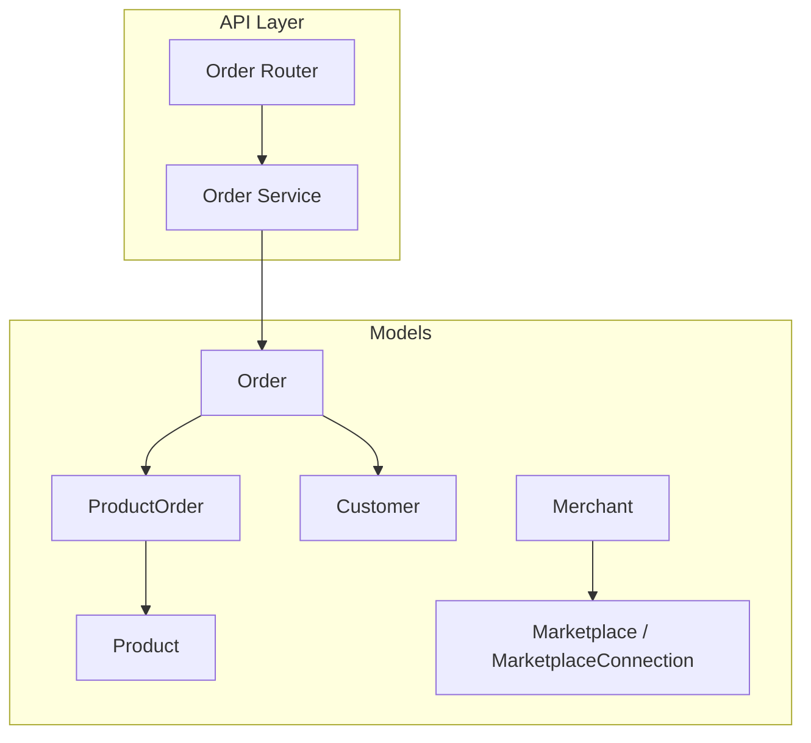
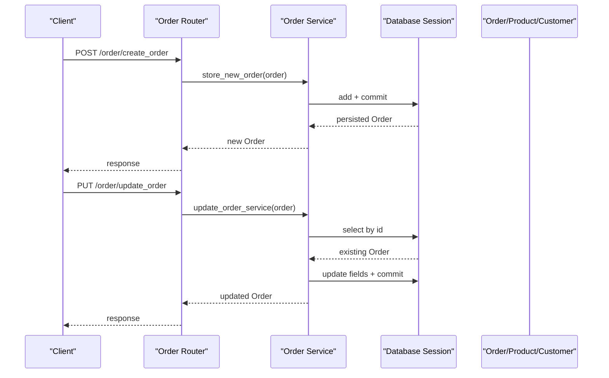
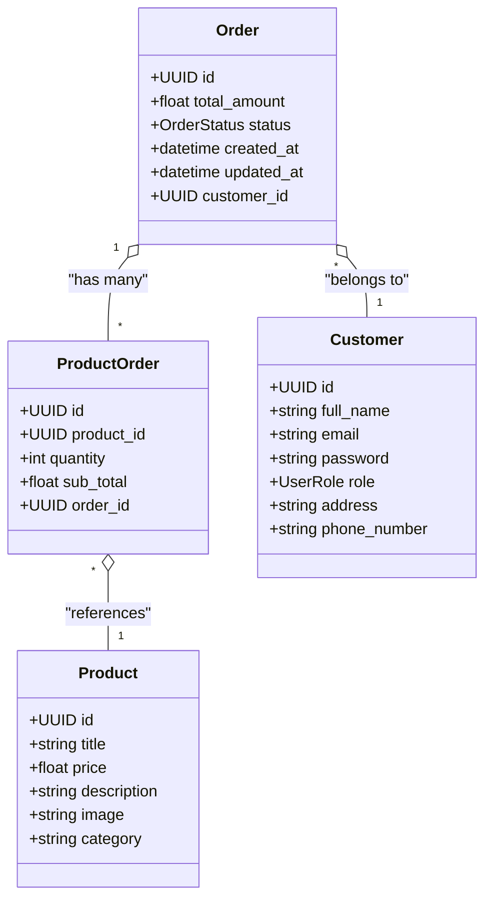
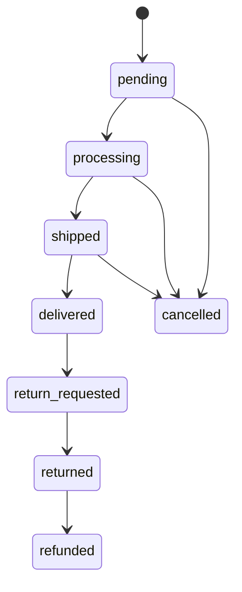
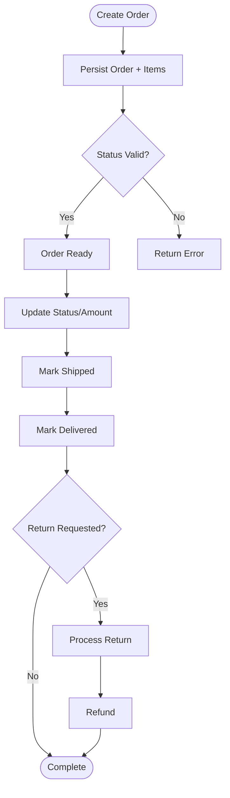
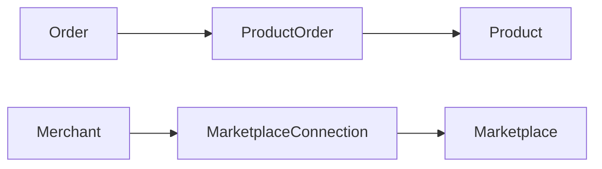
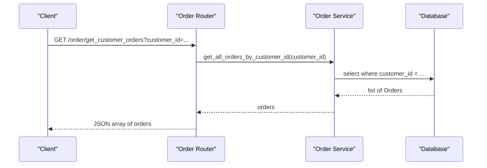
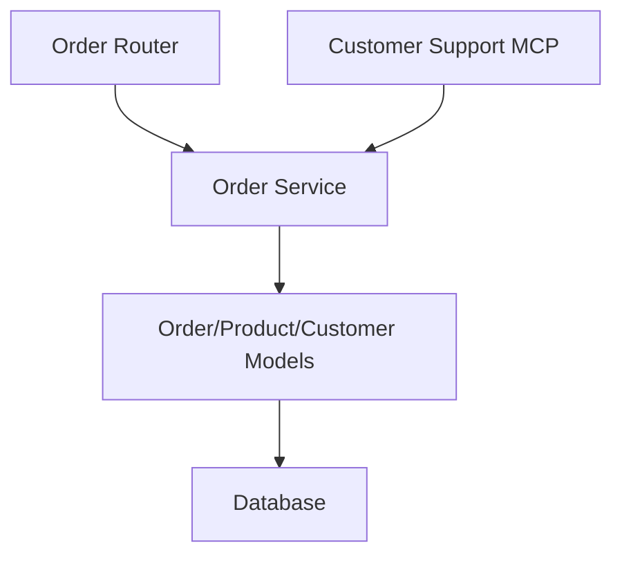

# Order Models

<cite>
**Referenced Files in This Document**
- [order.py](file://neurocom_backend/database/models/order.py)
- [product.py](file://neurocom_backend/database/models/product.py)
- [user.py](file://neurocom_backend/database/models/user.py)
- [merchant.py](file://neurocom_backend/database/models/merchant.py)
- [marketplace.py](file://neurocom_backend/database/models/marketplace.py)
- [order_router.py](file://neurocom_backend/routers/order_router.py)
- [order_service.py](file://neurocom_backend/services/order_service.py)
- [customer_support_main.py](file://neurocom_backend/mcp_server/customer_support/main.py)
</cite>

## Table of Contents
1. [Introduction](#introduction)
2. [Project Structure](#project-structure)
3. [Core Components](#core-components)
4. [Architecture Overview](#architecture-overview)
5. [Detailed Component Analysis](#detailed-component-analysis)
6. [Dependency Analysis](#dependency-analysis)
7. [Performance Considerations](#performance-considerations)
8. [Troubleshooting Guide](#troubleshooting-guide)
9. [Conclusion](#conclusion)
10. [Appendices](#appendices)

## Introduction
This document explains the Order model and related order entities in the Tijarah AI Backend database schema. It covers order fields, relationships to customers and products, status lifecycle, fulfillment processes, returns and refunds, API usage for creating and updating orders, reporting queries, data retention considerations, and audit trail guidance based on the current codebase.

## Project Structure
The order system is implemented using SQLModel (SQLAlchemy-based ORM) with FastAPI routers and services:
- Data models are defined under database/models.
- HTTP endpoints are exposed via routers.
- Business logic resides in services.
- A customer support MCP tool demonstrates order deletion.

**Diagram sources**
- [order.py:21-39](file://neurocom_backend/database/models/order.py#L21-L39)
- [product.py:13-21](file://neurocom_backend/database/models/product.py#L13-L21)
- [user.py:21-26](file://neurocom_backend/database/models/user.py#L21-L26)
- [merchant.py:11-15](file://neurocom_backend/database/models/merchant.py#L11-L15)
- [marketplace.py:17-40](file://neurocom_backend/database/models/marketplace.py#L17-L40)
- [order_router.py:16-39](file://neurocom_backend/routers/order_router.py#L16-L39)
- [order_service.py:9-46](file://neurocom_backend/services/order_service.py#L9-L46)

**Section sources**
- [order.py:21-39](file://neurocom_backend/database/models/order.py#L21-L39)
- [order_router.py:16-39](file://neurocom_backend/routers/order_router.py#L16-L39)
- [order_service.py:9-46](file://neurocom_backend/services/order_service.py#L9-L46)

## Core Components
- Order: Represents a purchase event with total amount, status, timestamps, and links to a Customer and multiple ProductOrder line items.
- ProductOrder: Line item linking an Order to a Product with quantity and subtotal.
- Customer: End user who places orders; has address and phone number.
- Product: Catalog item with title, price, description, image, and category.
- Merchant and Marketplace: Entities that connect merchants to marketplaces; not directly linked to orders in the current schema but relevant for multi-marketplace operations.

Key fields and relationships:
- Order.id: UUID primary key.
- Order.total_amount: float representing order value.
- Order.status: Enum-driven lifecycle state.
- Order.created_at / updated_at: Timestamps for creation and last update.
- Order.customer_id: FK to Customer.
- Order.products_order: One-to-many relationship to ProductOrder.
- ProductOrder.product_id: FK to Product.
- ProductOrder.quantity: Number of units.
- ProductOrder.sub_total: Per-line-item subtotal.

**Section sources**
- [order.py:11-39](file://neurocom_backend/database/models/order.py#L11-L39)
- [product.py:13-21](file://neurocom_backend/database/models/product.py#L13-L21)
- [user.py:21-26](file://neurocom_backend/database/models/user.py#L21-L26)

## Architecture Overview
The order workflow spans HTTP endpoints, service layer, and database models:
- Clients call order endpoints to create, update, retrieve, or delete orders.
- The router delegates to the order service.
- The service performs persistence via SQLModel sessions.
- Orders relate to Customers and Products through relationships.

**Diagram sources**
- [order_router.py:16-39](file://neurocom_backend/routers/order_router.py#L16-L39)
- [order_service.py:9-46](file://neurocom_backend/services/order_service.py#L9-L46)
- [order.py:21-39](file://neurocom_backend/database/models/order.py#L21-L39)

## Detailed Component Analysis

### Order and ProductOrder Models
- OrderStatus enum defines lifecycle states: pending, processing, shipped, delivered, cancelled, return_requested, returned, refunded.
- Order tracks totals and timestamps; links to Customer and ProductOrder items.
- ProductOrder captures per-item quantity and subtotal; links back to Order and to Product.

**Diagram sources**
- [order.py:11-39](file://neurocom_backend/database/models/order.py#L11-L39)
- [product.py:13-21](file://neurocom_backend/database/models/product.py#L13-L21)
- [user.py:21-26](file://neurocom_backend/database/models/user.py#L21-L26)

**Section sources**
- [order.py:11-39](file://neurocom_backend/database/models/order.py#L11-L39)
- [product.py:13-21](file://neurocom_backend/database/models/product.py#L13-L21)
- [user.py:21-26](file://neurocom_backend/database/models/user.py#L21-L26)

### Order Lifecycle States and Transitions
Current supported states:
- pending
- processing
- shipped
- delivered
- cancelled
- return_requested
- returned
- refunded

Typical transitions:
- Create order: pending
- Validate and prepare: processing
- Dispatch: shipped
- Complete: delivered
- Cancel early: cancelled
- Return flow: return_requested -> returned -> refunded

**Diagram sources**
- [order.py:11-19](file://neurocom_backend/database/models/order.py#L11-L19)

**Section sources**
- [order.py:11-19](file://neurocom_backend/database/models/order.py#L11-L19)

### Fulfillment Processes
- Creation: Orders are created via the create endpoint, which persists the order and its line items.
- Updates: Status and totals can be updated via the update endpoint.
- Deletion: Orders can be deleted via the delete endpoint or through the customer support MCP tool.

**Diagram sources**
- [order_router.py:16-39](file://neurocom_backend/routers/order_router.py#L16-L39)
- [order_service.py:9-46](file://neurocom_backend/services/order_service.py#L9-L46)
- [order.py:11-39](file://neurocom_backend/database/models/order.py#L11-L39)

**Section sources**
- [order_router.py:16-39](file://neurocom_backend/routers/order_router.py#L16-L39)
- [order_service.py:9-46](file://neurocom_backend/services/order_service.py#L9-L46)

### Returns and Refunds Handling
- States support a return flow: return_requested -> returned -> refunded.
- The current implementation provides state transitions via updates; business rules for when these transitions are allowed should be enforced at the service layer.
- No dedicated return/refund entity exists yet; future enhancements may include separate tables for returns and refunds to capture reasons, amounts, and timestamps.

**Section sources**
- [order.py:11-19](file://neurocom_backend/database/models/order.py#L11-L19)
- [order_service.py:16-26](file://neurocom_backend/services/order_service.py#L16-L26)

### Relationships with Products, Merchants, and Marketplaces
- Products: Orders reference products via ProductOrder.line items.
- Merchants and Marketplaces: Currently not directly linked to orders. They represent merchant accounts and marketplace connections used for publishing and integrations. Future designs may link orders to merchants/marketplaces for multi-tenant or multi-channel reporting.

**Diagram sources**
- [order.py:21-39](file://neurocom_backend/database/models/order.py#L21-L39)
- [product.py:13-21](file://neurocom_backend/database/models/product.py#L13-L21)
- [merchant.py:11-15](file://neurocom_backend/database/models/merchant.py#L11-L15)
- [marketplace.py:17-40](file://neurocom_backend/database/models/marketplace.py#L17-L40)

**Section sources**
- [order.py:21-39](file://neurocom_backend/database/models/order.py#L21-L39)
- [product.py:13-21](file://neurocom_backend/database/models/product.py#L13-L21)
- [merchant.py:11-15](file://neurocom_backend/database/models/merchant.py#L11-L15)
- [marketplace.py:17-40](file://neurocom_backend/database/models/marketplace.py#L17-L40)

### API Usage Examples
- Create order: POST /order/create_order with an Order payload including customer_id, total_amount, status, and products_order list.
- Update order: PUT /order/update_order with an Order payload containing id, total_amount, status, and products_order.
- Get orders by customer: GET /order/get_customer_orders?customer_id={uuid}.
- Get order by id: GET /order/get_order/{order_id}.
- Delete order: DELETE /order/delete_order/{order_id}.
- Customer support tool: cancel_customer_order(order_id) uses the same delete service function.

**Diagram sources**
- [order_router.py:26-34](file://neurocom_backend/routers/order_router.py#L26-L34)
- [order_service.py:44-46](file://neurocom_backend/services/order_service.py#L44-L46)

**Section sources**
- [order_router.py:16-39](file://neurocom_backend/routers/order_router.py#L16-L39)
- [order_service.py:9-46](file://neurocom_backend/services/order_service.py#L9-L46)
- [customer_support_main.py:23-28](file://neurocom_backend/mcp_server/customer_support/main.py#L23-L28)

### Reporting Queries
Common reporting patterns you can implement using the existing models:
- Total revenue by status: Sum total_amount grouped by status.
- Orders per customer: Count orders grouped by customer_id.
- Top-selling products: Join Order -> ProductOrder -> Product and sum quantities.
- Recent orders: Filter by created_at within a date range.
- Return rate: Count orders with status return_requested or returned divided by total orders in period.

These queries can be built using SQLModel select statements with groupby and joins across Order, ProductOrder, and Product.

[No sources needed since this section provides general query guidance]

### Data Retention Policies
- The current schema does not define explicit retention policies or soft-delete flags.
- Orders can be hard-deleted via the delete endpoint or MCP tool.
- Recommended approach:
  - Introduce a soft-delete flag (e.g., is_deleted) to preserve historical records.
  - Define retention periods per compliance needs (e.g., keep financial records for X years).
  - Implement archival jobs to move old orders to cold storage.

[No sources needed since this section provides general policy guidance]

### Audit Trails
- The Order model includes updated_at, which helps track last modifications.
- For comprehensive auditing:
  - Add an audit log table capturing field-level changes, actor identity, and timestamps.
  - Use database triggers or application hooks to record changes before commits.
  - Ensure immutable logs for compliance and dispute resolution.

[No sources needed since this section provides general audit guidance]

## Dependency Analysis
The order subsystem depends on:
- Database models for Order, ProductOrder, Customer, Product.
- Router for exposing HTTP endpoints.
- Service for business logic and persistence.
- Optional MCP tool for customer support operations.

**Diagram sources**
- [order_router.py:16-39](file://neurocom_backend/routers/order_router.py#L16-L39)
- [order_service.py:9-46](file://neurocom_backend/services/order_service.py#L9-L46)
- [order.py:21-39](file://neurocom_backend/database/models/order.py#L21-L39)
- [customer_support_main.py:23-28](file://neurocom_backend/mcp_server/customer_support/main.py#L23-L28)

**Section sources**
- [order_router.py:16-39](file://neurocom_backend/routers/order_router.py#L16-L39)
- [order_service.py:9-46](file://neurocom_backend/services/order_service.py#L9-L46)
- [order.py:21-39](file://neurocom_backend/database/models/order.py#L21-L39)
- [customer_support_main.py:23-28](file://neurocom_backend/mcp_server/customer_support/main.py#L23-L28)

## Performance Considerations
- Indexes: Order.status and Order.customer_id are indexed to improve lookup performance for filtering and joins.
- Query efficiency: Use selective filters (e.g., customer_id, status, date ranges) to reduce result sets.
- Pagination: Implement pagination for listing orders to avoid large payloads.
- Eager loading: When retrieving orders with items, consider eager loading ProductOrder and Product to minimize N+1 queries.

**Section sources**
- [order.py:21-39](file://neurocom_backend/database/models/order.py#L21-L39)

## Troubleshooting Guide
Common issues and resolutions:
- Order not found: Update and delete operations raise a 404 if the order does not exist. Verify the order_id and ensure it exists before updates.
- Invalid status transitions: Enforce valid transitions in the service layer to prevent inconsistent states.
- Missing customer or product references: Ensure customer_id and product_id are valid before creating orders.
- Concurrency: If multiple updates occur simultaneously, consider optimistic locking or transaction isolation levels to avoid race conditions.

**Section sources**
- [order_service.py:16-35](file://neurocom_backend/services/order_service.py#L16-L35)

## Conclusion
The Order model provides a solid foundation for managing purchases, with clear relationships to customers and products, and a comprehensive set of lifecycle states supporting fulfillment, returns, and refunds. The current API supports basic CRUD operations, while future enhancements can introduce merchant/marketplace linkage, robust return/refund workflows, data retention policies, and detailed audit trails.

[No sources needed since this section summarizes without analyzing specific files]

## Appendices

### API Endpoints Summary
- POST /order/create_order: Create a new order.
- PUT /order/update_order: Update order details and status.
- GET /order/get_customer_orders?customer_id={uuid}: Retrieve all orders for a customer.
- GET /order/get_order/{order_id}: Retrieve a single order by ID.
- DELETE /order/delete_order/{order_id}: Delete an order by ID.

**Section sources**
- [order_router.py:16-39](file://neurocom_backend/routers/order_router.py#L16-L39)

### Example Reporting Queries
- Revenue by status: Group orders by status and sum total_amount.
- Top products: Join Order -> ProductOrder -> Product and aggregate quantities.
- Recent activity: Filter orders by created_at within a time window.

[No sources needed since this section provides general query guidance]