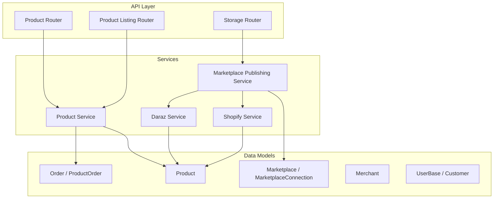
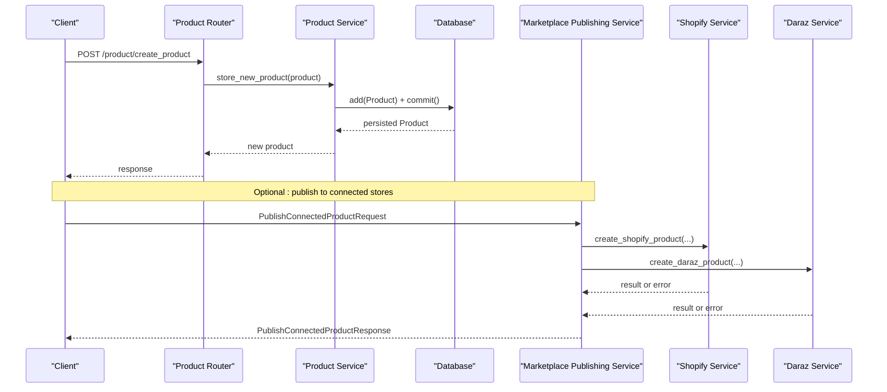
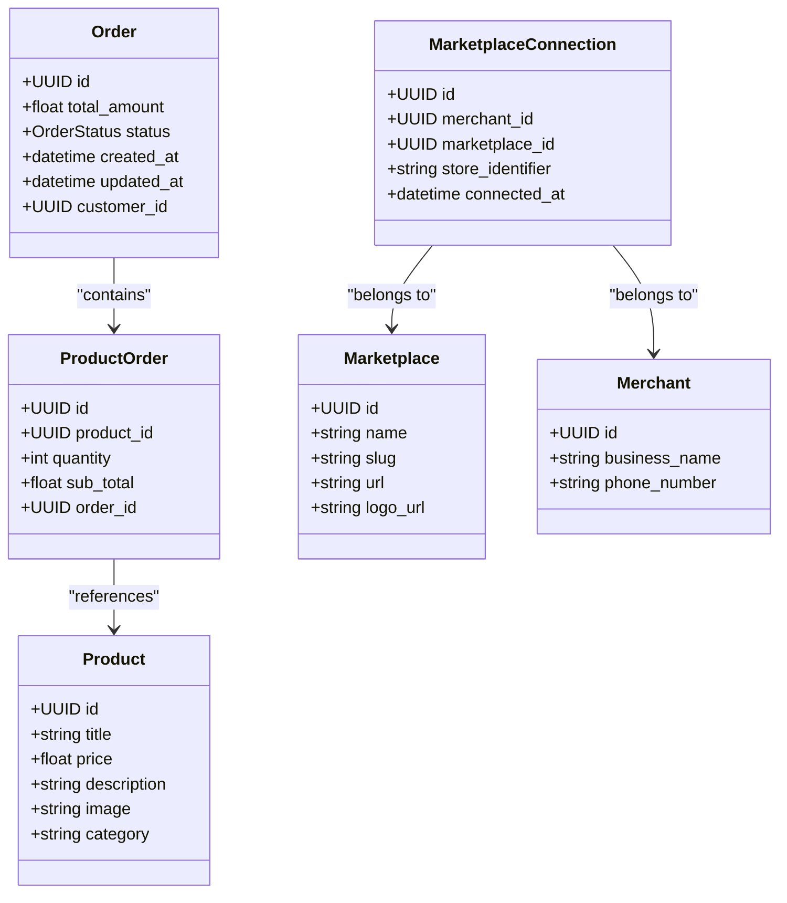
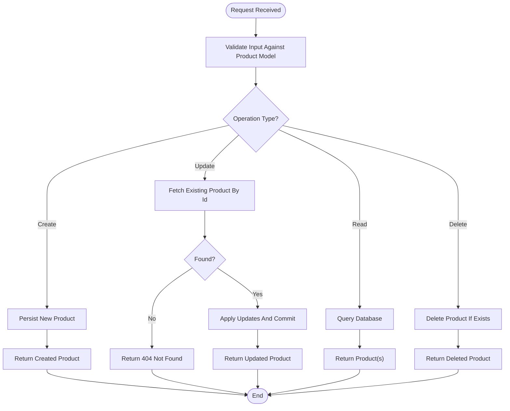
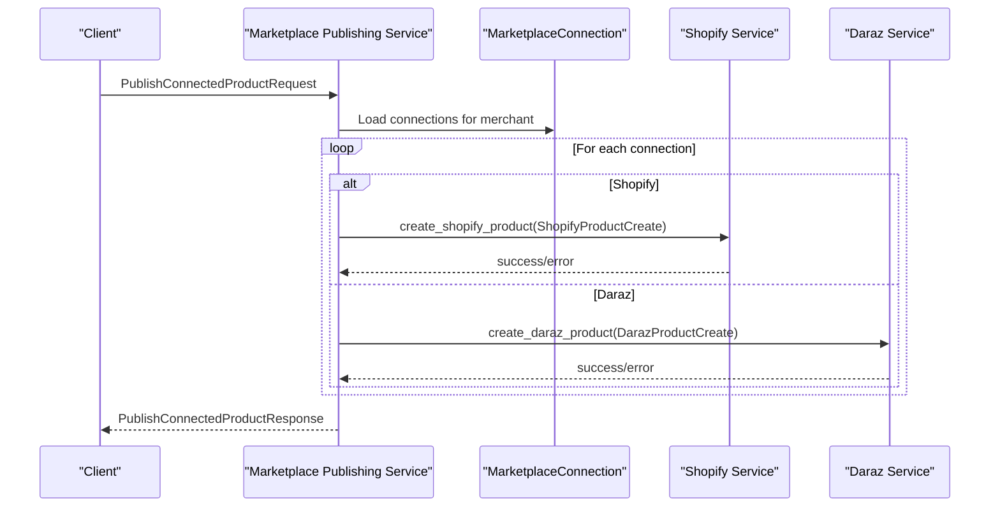
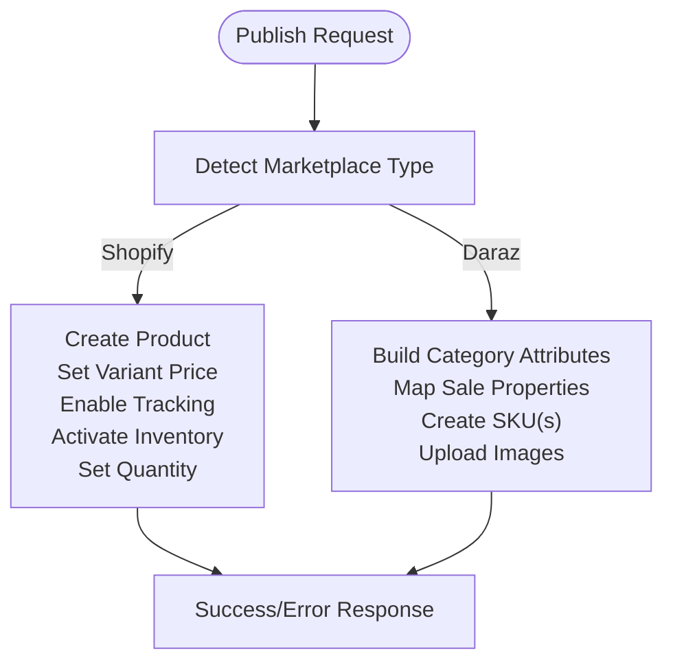
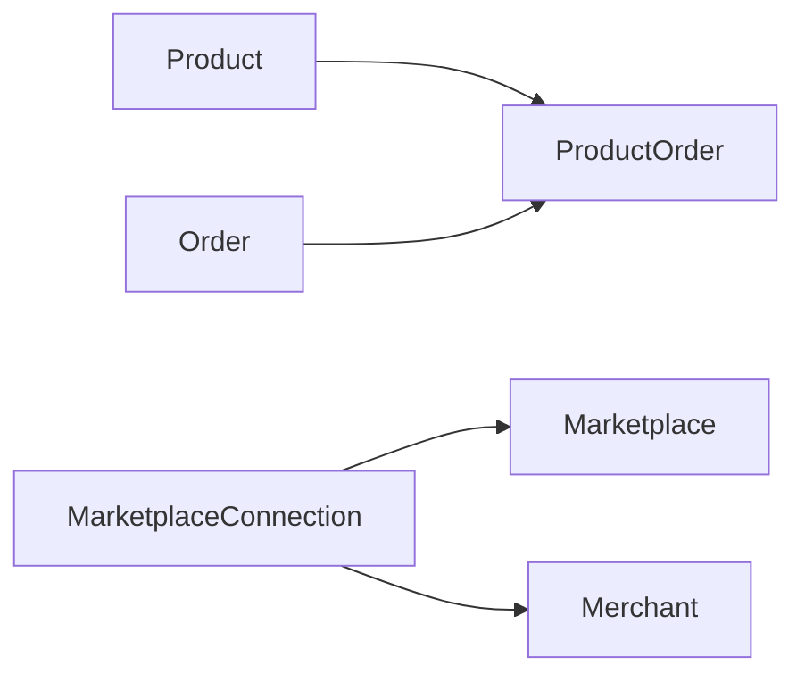

# Product Models

<cite>
**Referenced Files in This Document**
- [product.py](file://neurocom_backend/database/models/product.py)
- [order.py](file://neurocom_backend/database/models/order.py)
- [marketplace.py](file://neurocom_backend/database/models/marketplace.py)
- [merchant.py](file://neurocom_backend/database/models/merchant.py)
- [user.py](file://neurocom_backend/database/models/user.py)
- [product_router.py](file://neurocom_backend/routers/product_router.py)
- [product_service.py](file://neurocom_backend/services/product_service.py)
- [product_listing_model.py](file://neurocom_backend/models/product_listing_model.py)
- [product_listing_router.py](file://neurocom_backend/routers/product_listing_router.py)
- [shopify_service.py](file://neurocom_backend/services/shopify_service.py)
- [daraz_model.py](file://neurocom_backend/models/daraz_model.py)
- [marketplace_publishing_service.py](file://neurocom_backend/services/marketplace_publishing_service.py)
- [storage_router.py](file://neurocom_backend/routers/storage_router.py)
</cite>

## Table of Contents
1. Introduction
2. Project Structure
3. Core Components
4. Architecture Overview
5. Detailed Component Analysis
6. Dependency Analysis
7. Performance Considerations
8. Troubleshooting Guide
9. Conclusion
10. Appendices

## Introduction
This document provides comprehensive documentation for the Product model and its ecosystem in the Tijarah AI Backend database schema. It covers product fields, relationships with merchants, marketplaces, and orders, status management, variant handling, image associations, validation rules, business constraints, data integrity policies, and practical examples for creation, updates, and queries. It also explains how products are published to connected marketplaces (Shopify and Daraz), including marketplace-specific attributes and inventory tracking.

## Project Structure
The product domain spans several layers:
- Data models define the persistent schema and relationships.
- Routers expose HTTP endpoints for CRUD operations.
- Services implement business logic, including persistence and marketplace publishing.
- Marketplace integrations handle platform-specific attributes, variants, and inventory.

**Diagram sources**
- [product_router.py:15-38](file://neurocom_backend/routers/product_router.py#L15-L38)
- [product_service.py:9-47](file://neurocom_backend/services/product_service.py#L9-L47)
- [product_listing_router.py:18-23](file://neurocom_backend/routers/product_listing_router.py#L18-L23)
- [marketplace_publishing_service.py:34-64](file://neurocom_backend/services/marketplace_publishing_service.py#L34-L64)
- [shopify_service.py:358-469](file://neurocom_backend/services/shopify_service.py#L358-L469)
- [daraz_model.py:20-36](file://neurocom_backend/models/daraz_model.py#L20-L36)
- [product.py:13-21](file://neurocom_backend/database/models/product.py#L13-L21)
- [order.py:21-39](file://neurocom_backend/database/models/order.py#L21-L39)
- [marketplace.py:17-40](file://neurocom_backend/database/models/marketplace.py#L17-L40)
- [merchant.py:11-15](file://neurocom_backend/database/models/merchant.py#L11-L15)
- [user.py:14-25](file://neurocom_backend/database/models/user.py#L14-L25)

**Section sources**
- [product_router.py:15-38](file://neurocom_backend/routers/product_router.py#L15-L38)
- [product_service.py:9-47](file://neurocom_backend/services/product_service.py#L9-L47)
- [product_listing_router.py:18-23](file://neurocom_backend/routers/product_listing_router.py#L18-L23)
- [marketplace_publishing_service.py:34-64](file://neurocom_backend/services/marketplace_publishing_service.py#L34-L64)
- [product.py:13-21](file://neurocom_backend/database/models/product.py#L13-L21)
- [order.py:21-39](file://neurocom_backend/database/models/order.py#L21-L39)
- [marketplace.py:17-40](file://neurocom_backend/database/models/marketplace.py#L17-L40)
- [merchant.py:11-15](file://neurocom_backend/database/models/merchant.py#L11-L15)
- [user.py:14-25](file://neurocom_backend/database/models/user.py#L14-L25)

## Core Components
- Product model defines core product attributes such as title, price, description, image, and category.
- Order and ProductOrder link products to orders with quantity and subtotal.
- Marketplace and MarketplaceConnection enable merchant-to-marketplace connections for publishing.
- Merchant and User provide identity and role context.
- Product router exposes endpoints for create, update, read, delete, and list.
- Product service implements persistence and retrieval logic.
- Marketplace publishing service orchestrates publishing to Shopify and Daraz with marketplace-specific payloads.

Key responsibilities:
- Product: store and retrieve product records; enforce field-level validation via SQLModel Field constraints.
- Orders: associate products with orders; track quantities and subtotals.
- Marketplaces: manage connections and credentials for publishing.
- Services: encapsulate business logic, error handling, and integration calls.

**Section sources**
- [product.py:13-21](file://neurocom_backend/database/models/product.py#L13-L21)
- [order.py:21-39](file://neurocom_backend/database/models/order.py#L21-L39)
- [marketplace.py:17-40](file://neurocom_backend/database/models/marketplace.py#L17-L40)
- [merchant.py:11-15](file://neurocom_backend/database/models/merchant.py#L11-L15)
- [user.py:14-25](file://neurocom_backend/database/models/user.py#L14-L25)
- [product_router.py:15-38](file://neurocom_backend/routers/product_router.py#L15-L38)
- [product_service.py:9-47](file://neurocom_backend/services/product_service.py#L9-L47)
- [marketplace_publishing_service.py:34-64](file://neurocom_backend/services/marketplace_publishing_service.py#L34-L64)

## Architecture Overview
The system follows a layered architecture:
- API layer (FastAPI routers) receives requests and delegates to services.
- Services perform business logic, interact with the database, and call marketplace APIs.
- Data models define schema and relationships enforced by SQLModel/SQLAlchemy.

**Diagram sources**
- [product_router.py:15-38](file://neurocom_backend/routers/product_router.py#L15-L38)
- [product_service.py:9-47](file://neurocom_backend/services/product_service.py#L9-L47)
- [marketplace_publishing_service.py:34-64](file://neurocom_backend/services/marketplace_publishing_service.py#L34-L64)
- [shopify_service.py:358-469](file://neurocom_backend/services/shopify_service.py#L358-L469)
- [daraz_model.py:20-36](file://neurocom_backend/models/daraz_model.py#L20-L36)

## Detailed Component Analysis

### Product Model Schema and Relationships
- Fields:
  - id: UUID primary key with auto-generation and index.
  - title: required string with minimum length constraint.
  - price: required float.
  - description: string.
  - image: string (image URL or identifier).
  - category: string.
- Relationships:
  - Products are linked to orders through ProductOrder, which contains product_id, quantity, and sub_total.
  - No direct relationship to merchants or marketplaces is defined on the Product model itself; instead, products are published via marketplace connections tied to merchants.

**Diagram sources**
- [product.py:13-21](file://neurocom_backend/database/models/product.py#L13-L21)
- [order.py:21-39](file://neurocom_backend/database/models/order.py#L21-L39)
- [marketplace.py:17-40](file://neurocom_backend/database/models/marketplace.py#L17-L40)
- [merchant.py:11-15](file://neurocom_backend/database/models/merchant.py#L11-L15)

**Section sources**
- [product.py:13-21](file://neurocom_backend/database/models/product.py#L13-L21)
- [order.py:21-39](file://neurocom_backend/database/models/order.py#L21-L39)
- [marketplace.py:17-40](file://neurocom_backend/database/models/marketplace.py#L17-L40)
- [merchant.py:11-15](file://neurocom_backend/database/models/merchant.py#L11-L15)

### Product Creation, Update, and Query Workflows
- Create:
  - Endpoint: POST /product/create_product
  - Flow: Router validates input against Product model; service persists via Session; returns created product.
- Update:
  - Endpoint: PUT /product/update_product
  - Flow: Service fetches existing product by id; updates fields; commits changes; returns updated product.
- Read:
  - GET /product/get_product/{product_id}: returns single product by id.
  - GET /product/get_products: returns all products.
- Delete:
  - DELETE /product/delete_product/{product_id}: removes product if exists.

**Diagram sources**
- [product_router.py:15-38](file://neurocom_backend/routers/product_router.py#L15-L38)
- [product_service.py:9-47](file://neurocom_backend/services/product_service.py#L9-L47)

**Section sources**
- [product_router.py:15-38](file://neurocom_backend/routers/product_router.py#L15-L38)
- [product_service.py:9-47](file://neurocom_backend/services/product_service.py#L9-L47)

### Marketplace-Specific Attributes and Publishing
- Marketplace connections allow merchants to connect to platforms like Shopify and Daraz.
- Publishing service dispatches payloads to appropriate marketplace services based on connection type.
- Shopify:
  - Creates product, sets variant price, enables inventory tracking, activates inventory, sets quantity, and publishes to online store.
- Daraz:
  - Uses marketplace-specific models for product creation, including category attributes, SKUs, images, and sale properties.

**Diagram sources**
- [marketplace_publishing_service.py:34-64](file://neurocom_backend/services/marketplace_publishing_service.py#L34-L64)
- [shopify_service.py:358-469](file://neurocom_backend/services/shopify_service.py#L358-L469)
- [daraz_model.py:20-36](file://neurocom_backend/models/daraz_model.py#L20-L36)

**Section sources**
- [marketplace_publishing_service.py:34-64](file://neurocom_backend/services/marketplace_publishing_service.py#L34-L64)
- [shopify_service.py:358-469](file://neurocom_backend/services/shopify_service.py#L358-L469)
- [daraz_model.py:20-36](file://neurocom_backend/models/daraz_model.py#L20-L36)

### Variant Handling and Inventory Tracking
- Shopify:
  - Variants are created and updated with price; inventory tracking is enabled and activated; inventory quantities are set per location.
- Daraz:
  - SKUs include pricing, package dimensions, images, and sale properties; attributes are mapped from category definitions.

**Diagram sources**
- [shopify_service.py:358-469](file://neurocom_backend/services/shopify_service.py#L358-L469)
- [daraz_model.py:20-36](file://neurocom_backend/models/daraz_model.py#L20-L36)

**Section sources**
- [shopify_service.py:358-469](file://neurocom_backend/services/shopify_service.py#L358-L469)
- [daraz_model.py:20-36](file://neurocom_backend/models/daraz_model.py#L20-L36)

### Image Associations and Uploads
- Product model includes an image field for storing image references.
- Storage router supports uploading marketplace product images with content-type validation and size limits.
- Uploaded images can be referenced when creating products for marketplaces.

**Section sources**
- [product.py:13-21](file://neurocom_backend/database/models/product.py#L13-L21)
- [storage_router.py:46-57](file://neurocom_backend/routers/storage_router.py#L46-L57)

### Validation Rules, Business Constraints, and Data Integrity Policies
- Field-level validation:
  - Product title has minimum length; price is required; other fields validated by SQLModel Field constraints.
- Unique constraints:
  - Marketplace names and slugs are unique; MarketplaceConnection enforces uniqueness across merchant, marketplace, and store_identifier.
- Referential integrity:
  - ProductOrder references Product; Order references Customer; MarketplaceConnection references Merchant and Marketplace.
- Error handling:
  - Service methods raise HTTPException for not found scenarios; publishing service aggregates results with success/failure details.

**Section sources**
- [product.py:13-21](file://neurocom_backend/database/models/product.py#L13-L21)
- [marketplace.py:17-40](file://neurocom_backend/database/models/marketplace.py#L17-L40)
- [order.py:21-39](file://neurocom_backend/database/models/order.py#L21-L39)
- [product_service.py:16-47](file://neurocom_backend/services/product_service.py#L16-L47)
- [marketplace_publishing_service.py:34-64](file://neurocom_backend/services/marketplace_publishing_service.py#L34-L64)

### Examples of Product Creation, Updates, and Queries
- Create:
  - Use POST /product/create_product with a Product payload containing title, price, description, image, and category.
- Update:
  - Use PUT /product/update_product with an existing product id and updated fields.
- Read:
  - Use GET /product/get_product/{product_id} to retrieve a specific product.
  - Use GET /product/get_products to list all products.
- Delete:
  - Use DELETE /product/delete_product/{product_id} to remove a product.

Note: These examples describe endpoint usage and expected request/response shapes without including code snippets.

**Section sources**
- [product_router.py:15-38](file://neurocom_backend/routers/product_router.py#L15-L38)
- [product_service.py:9-47](file://neurocom_backend/services/product_service.py#L9-L47)

## Dependency Analysis
- Product depends on Order via ProductOrder for sales linkage.
- Marketplace dependencies enable publishing workflows but are not directly tied to Product schema.
- Merchant and User provide identity context for marketplace connections.

**Diagram sources**
- [order.py:21-39](file://neurocom_backend/database/models/order.py#L21-L39)
- [marketplace.py:17-40](file://neurocom_backend/database/models/marketplace.py#L17-L40)
- [merchant.py:11-15](file://neurocom_backend/database/models/merchant.py#L11-L15)

**Section sources**
- [order.py:21-39](file://neurocom_backend/database/models/order.py#L21-L39)
- [marketplace.py:17-40](file://neurocom_backend/database/models/marketplace.py#L17-L40)
- [merchant.py:11-15](file://neurocom_backend/database/models/merchant.py#L11-L15)

## Performance Considerations
- Indexing:
  - Product id is indexed; Marketplace name and slug are indexed; Order status and customer_id are indexed for efficient queries.
- Database sessions:
  - Short-lived sessions per request reduce lock contention and improve throughput.
- Marketplace publishing:
  - Batch operations (e.g., Shopify bulk variant updates) minimize API calls and latency.
- Image uploads:
  - Enforced size limits and content-type checks prevent large payloads and invalid types.

[No sources needed since this section provides general guidance]

## Troubleshooting Guide
- Common errors:
  - 404 Not Found: Occurs when updating or deleting a non-existent product; check product id and existence before operations.
  - 415 Unsupported Media Type: Image upload rejected due to unsupported content type; ensure JPEG, PNG, or WebP.
  - 413 Payload Too Large: Image exceeds maximum size; reduce file size.
  - Publishing failures: Marketplace-specific errors aggregated in PublishConnectedProductResponse; inspect error messages for root causes.
- Debugging steps:
  - Verify database session and transaction commits.
  - Check marketplace connection credentials and encryption.
  - Validate marketplace-specific payloads against model schemas.

**Section sources**
- [product_service.py:16-47](file://neurocom_backend/services/product_service.py#L16-L47)
- [storage_router.py:46-57](file://neurocom_backend/routers/storage_router.py#L46-L57)
- [marketplace_publishing_service.py:34-64](file://neurocom_backend/services/marketplace_publishing_service.py#L34-L64)

## Conclusion
The Product model provides a foundational schema for product data with essential fields and relationships to orders. While the current Product model does not directly link to merchants or marketplaces, the backend supports robust marketplace publishing workflows that map internal products to platform-specific structures. Validation and integrity constraints ensure data quality, while services offer clear APIs for CRUD operations and marketplace integrations. Future enhancements may introduce richer product attributes, explicit merchant associations, and advanced inventory tracking within the core schema.

[No sources needed since this section summarizes without analyzing specific files]

## Appendices

### API Endpoints Summary
- Product CRUD:
  - POST /product/create_product
  - PUT /product/update_product
  - GET /product/get_product/{product_id}
  - GET /product/get_products
  - DELETE /product/delete_product/{product_id}
- Product Listing Generation:
  - POST /product-listing/generate
- Storage:
  - POST /storage/product-images

**Section sources**
- [product_router.py:15-38](file://neurocom_backend/routers/product_router.py#L15-L38)
- [product_listing_router.py:18-23](file://neurocom_backend/routers/product_listing_router.py#L18-L23)
- [storage_router.py:46-57](file://neurocom_backend/routers/storage_router.py#L46-L57)