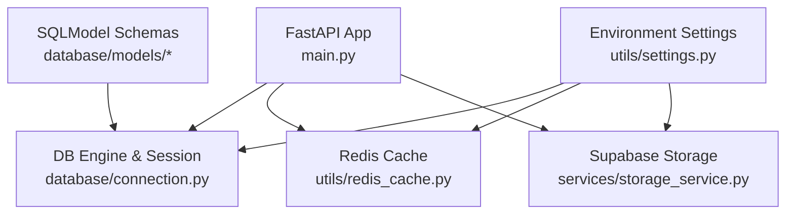
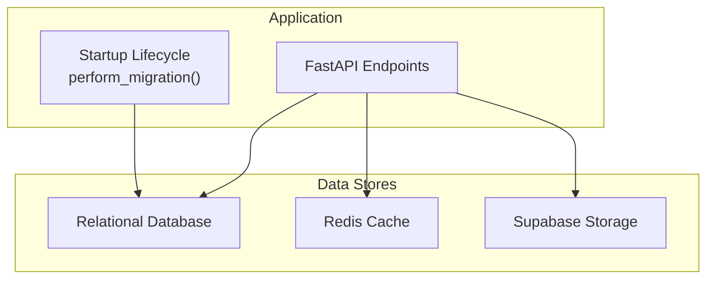
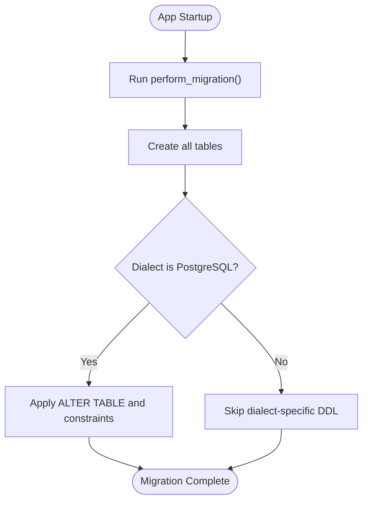
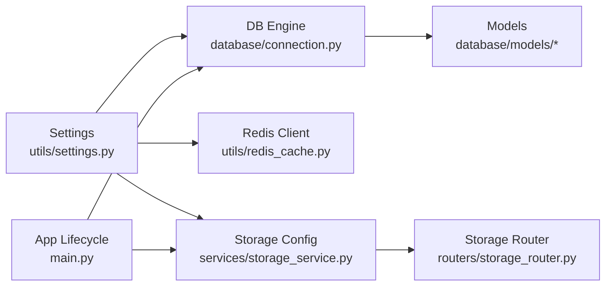
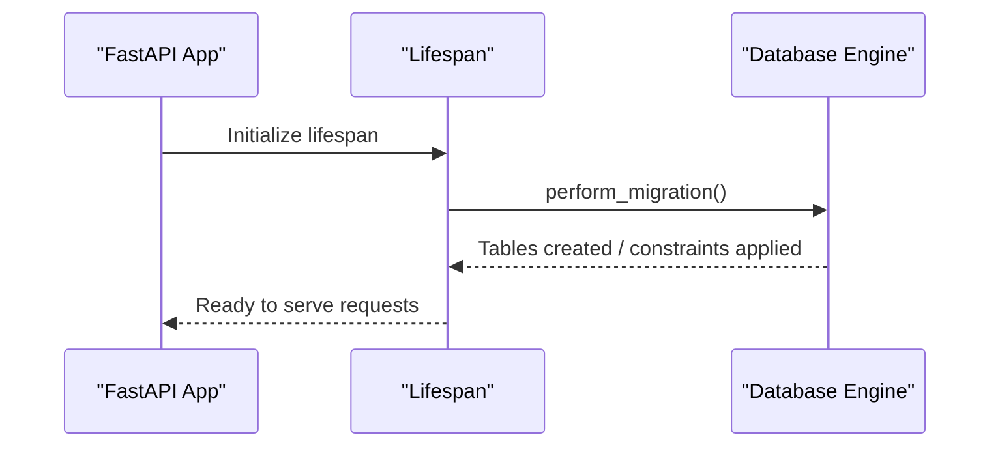

# Backup & Recovery

<cite>
**Referenced Files in This Document**
- [main.py](file://neurocom_backend/main.py)
- [connection.py](file://neurocom_backend/database/connection.py)
- [settings.py](file://neurocom_backend/utils/settings.py)
- [redis_cache.py](file://neurocom_backend/utils/redis_cache.py)
- [storage_service.py](file://neurocom_backend/services/storage_service.py)
- [storage_router.py](file://neurocom_backend/routers/storage_router.py)
- [security.py](file://neurocom_backend/utils/security.py)
- [marketplace.py](file://neurocom_backend/database/models/marketplace.py)
- [merchant.py](file://neurocom_backend/database/models/merchant.py)
- [README.md](file://README.md)
</cite>

## Table of Contents
1. Introduction
2. Project Structure
3. Core Components
4. Architecture Overview
5. Detailed Component Analysis
6. Dependency Analysis
7. Performance Considerations
8. Troubleshooting Guide
9. Conclusion
10. Appendices

## Introduction
This document defines backup and recovery procedures for the Tijarah AI Backend, covering:
- Database backups (full, incremental, point-in-time recovery)
- File/object storage backups and synchronization
- CDN cache invalidation strategies
- Disaster recovery planning, failover, and business continuity
- Automation, retention policies, and verification
- Data migration, schema versioning, and rollback strategies
- Recovery testing, RTO/RPO definitions, and incident response playbooks
- Security considerations for backup data encryption and access control

The backend uses:
- A relational database via SQLAlchemy/SQLModel with a connection string from environment variables
- Redis for caching with TTL-based entries and background refresh
- Supabase Storage for product images and related assets
- FastAPI application lifecycle to run migrations at startup

## Project Structure
Key areas relevant to backup and recovery:
- Database connectivity and migrations: database/connection.py
- Configuration and secrets: utils/settings.py
- Caching layer: utils/redis_cache.py
- Object storage integration: services/storage_service.py and routers/storage_router.py
- Application lifecycle and migration trigger: main.py
- Data models that define persistent schema: database/models/*

**Diagram sources**
- [main.py:16-29](file://neurocom_backend/main.py#L16-L29)
- [connection.py:9-27](file://neurocom_backend/database/connection.py#L9-L27)
- [settings.py:11-28](file://neurocom_backend/utils/settings.py#L11-L28)
- [redis_cache.py:56-71](file://neurocom_backend/utils/redis_cache.py#L56-L71)
- [storage_service.py:32-35](file://neurocom_backend/services/storage_service.py#L32-L35)
- [marketplace.py:17-40](file://neurocom_backend/database/models/marketplace.py#L17-L40)
- [merchant.py:11-14](file://neurocom_backend/database/models/merchant.py#L11-L14)

**Section sources**
- [main.py:16-29](file://neurocom_backend/main.py#L16-L29)
- [connection.py:9-27](file://neurocom_backend/database/connection.py#L9-L27)
- [settings.py:11-28](file://neurocom_backend/utils/settings.py#L11-L28)
- [redis_cache.py:56-71](file://neurocom_backend/utils/redis_cache.py#L56-L71)
- [storage_service.py:32-35](file://neurocom_backend/services/storage_service.py#L32-L35)
- [marketplace.py:17-40](file://neurocom_backend/database/models/marketplace.py#L17-L40)
- [merchant.py:11-14](file://neurocom_backend/database/models/merchant.py#L11-L14)

## Core Components
- Database engine and session management are initialized from environment configuration and provide a performant pool with recycling. The application triggers schema creation/migration on startup.
- Redis cache is configured via settings and provides cache-aside reads with optional background stale-while-revalidate and TTL expiration.
- Supabase Storage is used for product images; endpoints validate content types and sizes, and expose upload/download/cleanup operations.
- Security utilities include password hashing, JWT token handling, and symmetric encryption for sensitive values using Fernet derived from the secret key.

Operational implications:
- Backups must capture the database state, Redis snapshots or persistence, and Supabase object storage contents.
- Migrations should be idempotent and reversible where possible; they run at app startup.
- Secrets and keys must be protected during backup transit and at rest.

**Section sources**
- [connection.py:9-27](file://neurocom_backend/database/connection.py#L9-L27)
- [main.py:16-29](file://neurocom_backend/main.py#L16-L29)
- [redis_cache.py:152-204](file://neurocom_backend/utils/redis_cache.py#L152-L204)
- [storage_service.py:46-74](file://neurocom_backend/services/storage_service.py#L46-L74)
- [security.py:14-43](file://neurocom_backend/utils/security.py#L14-L43)

## Architecture Overview
Backup and recovery spans three primary data stores:
- Relational database (via SQLAlchemy/SQLModel)
- Redis cache
- Supabase Storage (object storage)

**Diagram sources**
- [main.py:16-29](file://neurocom_backend/main.py#L16-L29)
- [connection.py:9-27](file://neurocom_backend/database/connection.py#L9-L27)
- [redis_cache.py:56-71](file://neurocom_backend/utils/redis_cache.py#L56-L71)
- [storage_service.py:32-35](file://neurocom_backend/services/storage_service.py#L32-L35)

## Detailed Component Analysis

### Database Backup Strategy
- Full backups: Use native database tools to take consistent full backups. Ensure transactions are quiesced or use snapshot-based backups if supported by your database provider.
- Incremental backups: Enable WAL or equivalent continuous archiving to support incremental backups and point-in-time recovery (PITR). Schedule frequent incremental archives to minimize data loss.
- Point-in-time recovery: Configure PITR windows based on RPO targets. Validate restore procedures regularly to ensure you can recover to specific timestamps.
- Migration safety: The application runs schema creation/migration at startup. Ensure migrations are backward-compatible and testable. Maintain migration scripts separately for manual rollbacks if needed.

Recommended practices:
- Encrypt backups at rest and in transit.
- Store backups in geographically redundant locations.
- Automate scheduling and retention enforcement.
- Verify integrity with checksums and periodic restore drills.

**Section sources**
- [connection.py:15-23](file://neurocom_backend/database/connection.py#L15-L23)
- [main.py:16-29](file://neurocom_backend/main.py#L16-L29)

### Redis Cache Backup and Recovery
- Persistence: If Redis is used for critical data beyond transient cache, enable AOF/RDB persistence and back up the data directory. For cache-only usage, focus on availability and fast rebuild rather than long-term retention.
- TTL strategy: Entries expire based on configured TTLs. During recovery, caches will repopulate on demand.
- Background refresh: The cache supports background revalidation; after recovery, traffic will naturally refresh entries.

Recovery notes:
- If Redis is ephemeral, rely on upstream data sources to rebuild cache automatically.
- If Redis holds durable state, treat it as a data store and back up accordingly.

**Section sources**
- [redis_cache.py:110-149](file://neurocom_backend/utils/redis_cache.py#L110-L149)
- [redis_cache.py:152-204](file://neurocom_backend/utils/redis_cache.py#L152-L204)
- [settings.py:17-22](file://neurocom_backend/utils/settings.py#L17-L22)

### Object Storage Backup and Synchronization
- Supabase Storage: Product images are uploaded to Supabase buckets. Back up bucket contents using Supabase’s native tools or CLI. Ensure service role credentials are secured and least-privilege scoped.
- Synchronization: Periodically sync objects to an offsite bucket or archive tier for durability. Use object-level metadata (timestamps, hashes) to detect changes.
- CDN cache invalidation: If a CDN fronts Supabase public URLs, implement cache invalidation workflows triggered by object updates or restores to ensure consistency.

Operational steps:
- Export bucket listings and download objects for archival.
- Maintain versioned copies of critical assets.
- Automate sync jobs with retry and error reporting.

**Section sources**
- [storage_service.py:46-74](file://neurocom_backend/services/storage_service.py#L46-L74)
- [storage_service.py:77-102](file://neurocom_backend/services/storage_service.py#L77-L102)
- [storage_service.py:128-141](file://neurocom_backend/services/storage_service.py#L128-L141)
- [storage_router.py:46-64](file://neurocom_backend/routers/storage_router.py#L46-L64)

### Disaster Recovery Planning and Business Continuity
- RTO (Recovery Time Objective): Define maximum acceptable downtime per component (e.g., DB < 1 hour, Cache < 5 minutes, Storage < 2 hours).
- RPO (Recovery Point Objective): Define maximum acceptable data loss window (e.g., DB PITR within last 15 minutes).
- Failover procedures:
  - Database: Standby instance with streaming replication; promote on failure.
  - Redis: Sentinel or managed cluster with automatic failover; warm-up cache post-failover.
  - Storage: Multi-region replication or cross-region sync; switch DNS/CDN if necessary.
- Business continuity:
  - Runbooks for each scenario (DB outage, cache corruption, storage unavailability).
  - Communication plan and escalation matrix.
  - Post-incident review and process improvements.

**Section sources**
- [main.py:16-29](file://neurocom_backend/main.py#L16-L29)
- [redis_cache.py:152-204](file://neurocom_backend/utils/redis_cache.py#L152-L204)
- [storage_service.py:32-35](file://neurocom_backend/services/storage_service.py#L32-L35)

### Backup Automation, Retention Policies, and Verification
- Automation:
  - Schedule database full and incremental backups.
  - Sync Supabase objects to cold storage on a cadence.
  - Rotate and encrypt backups; manage retention periods.
- Retention:
  - Keep daily backups for N days, weekly for M weeks, monthly for O months based on compliance needs.
  - Archive older backups to low-cost storage.
- Verification:
  - Integrity checks (checksums, hash comparisons).
  - Restore tests in isolated environments periodically.
  - Alert on failed backup jobs and verify success notifications.

**Section sources**
- [connection.py:9-23](file://neurocom_backend/database/connection.py#L9-L23)
- [redis_cache.py:110-149](file://neurocom_backend/utils/redis_cache.py#L110-L149)
- [storage_service.py:46-74](file://neurocom_backend/services/storage_service.py#L46-L74)

### Data Migration Procedures, Schema Versioning, and Rollback Strategies
- Migration execution: The application creates tables and applies dialect-specific adjustments at startup. Ensure migrations are idempotent and safe to run multiple times.
- Versioning: Track schema versions externally (e.g., migration scripts repository) and apply them in order.
- Rollback:
  - Prepare reverse migrations for destructive changes.
  - Test rollbacks in staging before production.
  - Coordinate maintenance windows for risky migrations.

**Diagram sources**
- [main.py:16-29](file://neurocom_backend/main.py#L16-L29)
- [connection.py:15-23](file://neurocom_backend/database/connection.py#L15-L23)

**Section sources**
- [main.py:16-29](file://neurocom_backend/main.py#L16-L29)
- [connection.py:15-23](file://neurocom_backend/database/connection.py#L15-L23)

### Recovery Testing Procedures
- Frequency: Quarterly full DR drill; monthly partial restore tests.
- Scope:
  - Restore DB to PITR target and validate data integrity.
  - Rebuild Redis cache and verify performance under load.
  - Restore object storage and validate CDN propagation.
- Metrics: Measure actual RTO/RPO vs targets; update plans accordingly.
- Documentation: Record steps, outcomes, and lessons learned.

[No sources needed since this section provides general guidance]

### Incident Response Playbooks
- Database outage:
  - Detect failure, alert team.
  - Promote standby, update connection strings.
  - Validate application health and data consistency.
- Cache corruption:
  - Flush affected keys or restart Redis.
  - Monitor for increased upstream load.
- Storage failure:
  - Switch to secondary region or restore from archive.
  - Invalidate CDN caches; notify users if necessary.

[No sources needed since this section provides general guidance]

### Security Considerations for Backup Data
- Encryption at rest and in transit for all backups.
- Least privilege access to backup systems and credentials.
- Secure rotation of secrets used for database, Redis, and storage access.
- Audit logging for backup operations and access to backup repositories.
- Protect sensitive fields (e.g., encrypted tokens) during backup and restore processes.

**Section sources**
- [security.py:14-43](file://neurocom_backend/utils/security.py#L14-L43)
- [settings.py:13-28](file://neurocom_backend/utils/settings.py#L13-L28)

## Dependency Analysis
The following diagram shows how components depend on configuration and each other during normal operation and recovery scenarios.

**Diagram sources**
- [settings.py:11-28](file://neurocom_backend/utils/settings.py#L11-L28)
- [connection.py:9-27](file://neurocom_backend/database/connection.py#L9-L27)
- [redis_cache.py:56-71](file://neurocom_backend/utils/redis_cache.py#L56-L71)
- [storage_service.py:32-35](file://neurocom_backend/services/storage_service.py#L32-L35)
- [main.py:16-29](file://neurocom_backend/main.py#L16-L29)
- [storage_router.py:46-64](file://neurocom_backend/routers/storage_router.py#L46-L64)
- [marketplace.py:17-40](file://neurocom_backend/database/models/marketplace.py#L17-L40)
- [merchant.py:11-14](file://neurocom_backend/database/models/merchant.py#L11-L14)

**Section sources**
- [settings.py:11-28](file://neurocom_backend/utils/settings.py#L11-L28)
- [connection.py:9-27](file://neurocom_backend/database/connection.py#L9-L27)
- [redis_cache.py:56-71](file://neurocom_backend/utils/redis_cache.py#L56-L71)
- [storage_service.py:32-35](file://neurocom_backend/services/storage_service.py#L32-L35)
- [main.py:16-29](file://neurocom_backend/main.py#L16-L29)
- [storage_router.py:46-64](file://neurocom_backend/routers/storage_router.py#L46-L64)
- [marketplace.py:17-40](file://neurocom_backend/database/models/marketplace.py#L17-L40)
- [merchant.py:11-14](file://neurocom_backend/database/models/merchant.py#L11-L14)

## Performance Considerations
- Database:
  - Tune connection pooling and timeouts to avoid backup-induced contention.
  - Schedule heavy backups during low-traffic windows.
- Redis:
  - Avoid blocking operations during backups; prefer non-blocking snapshots or append-only logs.
  - Monitor memory usage and eviction policies.
- Storage:
  - Batch uploads/downloads for efficiency.
  - Use CDN caching strategically to reduce origin load during recovery.

[No sources needed since this section provides general guidance]

## Troubleshooting Guide
Common issues and mitigations:
- Database connection failures:
  - Verify DB_CONNECTION_STRING and network reachability.
  - Check pool exhaustion and connection limits.
- Redis connectivity errors:
  - Confirm host/port/SSL and credentials.
  - Inspect timeout settings and retry behavior.
- Supabase Storage errors:
  - Validate SUPABASE_URL, SUPABASE_SECRET_KEY, and bucket configuration.
  - Handle HTTP errors and retries; check rate limits and quotas.

Verification steps:
- Health endpoints and basic read/write tests.
- Backup integrity checks and restore drills.
- Monitoring and alerting for backup job status.

**Section sources**
- [connection.py:9-27](file://neurocom_backend/database/connection.py#L9-L27)
- [redis_cache.py:56-71](file://neurocom_backend/utils/redis_cache.py#L56-L71)
- [storage_service.py:32-35](file://neurocom_backend/services/storage_service.py#L32-L35)
- [storage_service.py:46-74](file://neurocom_backend/services/storage_service.py#L46-L74)

## Conclusion
Implement robust, automated backups across database, cache, and object storage with clear RTO/RPO targets. Ensure migrations are safe and reversible, and conduct regular recovery tests. Secure backup data with encryption and strict access controls. Maintain detailed runbooks and continuously improve processes based on test results and incidents.

[No sources needed since this section summarizes without analyzing specific files]

## Appendices

### Environment Variables Reference
- Database:
  - DB_CONNECTION_STRING: Connection URI for the relational database.
  - SQL_ECHO: Optional flag to enable SQL logging.
- Redis:
  - REDIS_HOST, REDIS_PORT, REDIS_USERNAME, REDIS_PASSWORD, REDIS_SSL
  - DARAZ_CACHE_TTL_SECONDS, SHOPIFY_CACHE_TTL_SECONDS
- Storage:
  - SUPABASE_URL, SUPABASE_SECRET_KEY, SUPABASE_PRODUCT_BUCKET
- Security:
  - SECRET_KEY, JWT_ALGORITHM, ACCESS_TOKEN_EXPIRE_MINUTES

**Section sources**
- [settings.py:11-28](file://neurocom_backend/utils/settings.py#L11-L28)

### Startup and Migration Flow

**Diagram sources**
- [main.py:16-29](file://neurocom_backend/main.py#L16-L29)
- [connection.py:15-23](file://neurocom_backend/database/connection.py#L15-L23)