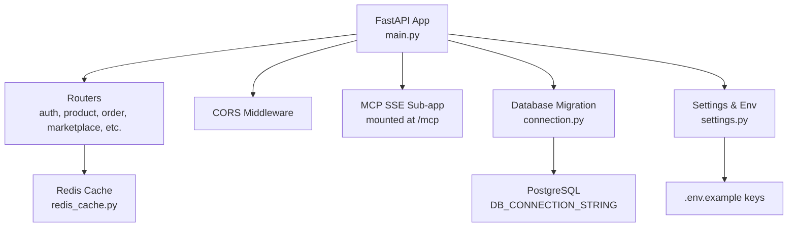
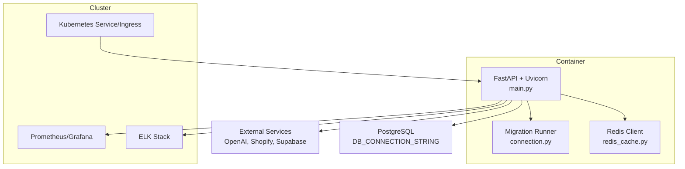
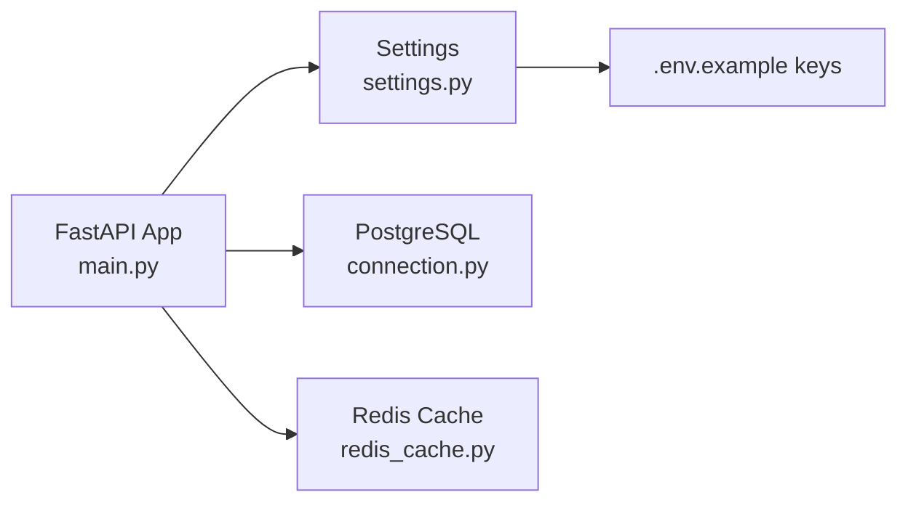
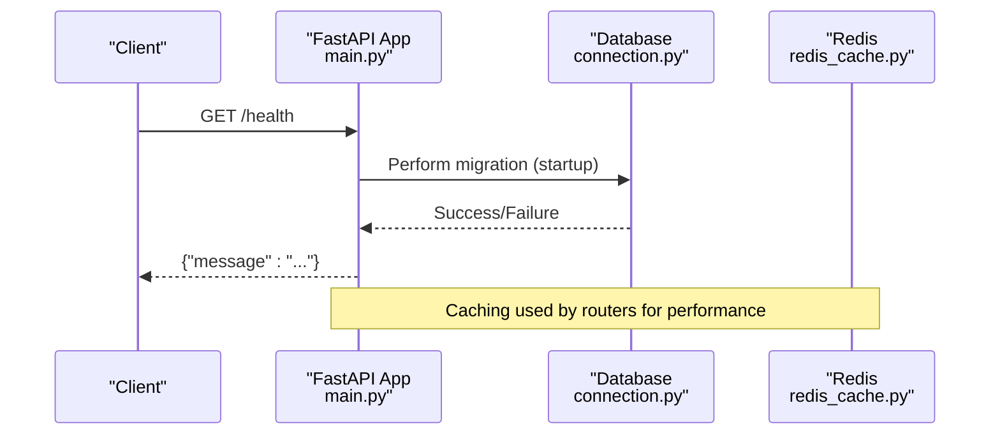

# Containerization & Deployment

<cite>
**Referenced Files in This Document**
- [README.md](file://README.md)
- [Makefile](file://Makefile)
- [pyproject.toml](file://pyproject.toml)
- [main.py](file://neurocom_backend/main.py)
- [settings.py](file://neurocom_backend/utils/settings.py)
- [connection.py](file://neurocom_backend/database/connection.py)
- [redis_cache.py](file://neurocom_backend/utils/redis_cache.py)
- [.env.example](file://.env.example)
</cite>

## Table of Contents
1. [Introduction](#introduction)
2. [Project Structure](#project-structure)
3. [Core Components](#core-components)
4. [Architecture Overview](#architecture-overview)
5. [Detailed Component Analysis](#detailed-component-analysis)
6. [Dependency Analysis](#dependency-analysis)
7. [Performance Considerations](#performance-considerations)
8. [Troubleshooting Guide](#troubleshooting-guide)
9. [Conclusion](#conclusion)
10. [Appendices](#appendices)

## Introduction
This document provides containerization and deployment guidance for the Tijarah AI Backend (Neurocom Backend). It covers Docker image creation with multi-stage builds, Kubernetes deployment manifests, Helm chart structure, CI/CD pipelines using GitHub Actions, scaling and load balancing strategies, health checks, rollback procedures, blue-green deployments, zero-downtime updates, monitoring with Prometheus and Grafana, and logging aggregation with an ELK stack or similar. The guidance is tailored to the application’s FastAPI server, database migrations, Redis caching, and environment configuration as implemented in the codebase.

## Project Structure
The backend is a FastAPI application that:
- Starts via Uvicorn and exposes HTTP endpoints including a root and a health endpoint.
- Performs database migrations at startup using SQLModel.
- Integrates Redis for caching and external services via environment variables.
- Mounts an SSE-based MCP sub-application under /mcp.

**Diagram sources**
- [main.py:16-37](file://neurocom_backend/main.py#L16-L37)
- [connection.py:9-23](file://neurocom_backend/database/connection.py#L9-L23)
- [settings.py:11-28](file://neurocom_backend/utils/settings.py#L11-L28)
- [redis_cache.py:56-71](file://neurocom_backend/utils/redis_cache.py#L56-L71)

**Section sources**
- [README.md:1-6](file://README.md#L1-L6)
- [Makefile:1-2](file://Makefile#L1-L2)
- [pyproject.toml:8-35](file://pyproject.toml#L8-L35)
- [main.py:16-45](file://neurocom_backend/main.py#L16-L45)
- [settings.py:11-28](file://neurocom_backend/utils/settings.py#L11-L28)
- [connection.py:9-23](file://neurocom_backend/database/connection.py#L9-L23)

## Core Components
- Application entrypoint and lifecycle:
  - FastAPI app initializes CORS middleware, mounts MCP SSE, defines root and health endpoints, and runs database migrations during lifespan.
- Configuration:
  - Environment-driven settings for secrets, JWT, Redis, Shopify, Supabase, and cache TTLs.
- Database:
  - Engine created from DB_CONNECTION_STRING; migration creates tables and applies schema adjustments on startup.
- Caching:
  - Redis client configured via settings; cache-aside pattern with background stale-while-revalidate for expensive fetches.

Operational implications:
- Health check readiness depends on successful DB migration and connectivity.
- Redis availability affects performance-sensitive routes that rely on caching.
- External integrations (Shopify, OpenAI, Supabase) require correct environment variables.

**Section sources**
- [main.py:16-45](file://neurocom_backend/main.py#L16-L45)
- [settings.py:11-28](file://neurocom_backend/utils/settings.py#L11-L28)
- [connection.py:9-23](file://neurocom_backend/database/connection.py#L9-L23)
- [redis_cache.py:56-71](file://neurocom_backend/utils/redis_cache.py#L56-L71)

## Architecture Overview
High-level runtime architecture for containerized deployment:

**Diagram sources**
- [main.py:16-45](file://neurocom_backend/main.py#L16-L45)
- [connection.py:9-23](file://neurocom_backend/database/connection.py#L9-L23)
- [redis_cache.py:56-71](file://neurocom_backend/utils/redis_cache.py#L56-L71)
- [settings.py:11-28](file://neurocom_backend/utils/settings.py#L11-L28)

## Detailed Component Analysis

### Docker Image Build (Multi-stage)
Recommended approach:
- Stage 1: Builder
  - Use a Python base image matching .python-version.
  - Install Poetry and dependencies into an isolated directory.
  - Generate a lock file and install production-only dependencies.
- Stage 2: Runtime
  - Use a minimal Python image.
  - Copy only the compiled wheels and application code.
  - Set non-root user, expose port 8000, and run Uvicorn with production flags.

Key build inputs:
- pyproject.toml for dependency declarations.
- .python-version for consistent Python version.
- Makefile command to start the server.

Runtime behavior:
- Uvicorn serves the FastAPI app defined in main.py.
- On startup, lifespan triggers database migrations.
- Health endpoint available at /health for readiness probes.

Environment variables required at runtime:
- See .env.example for all keys (e.g., DB_CONNECTION_STRING, SECRET_KEY, JWT_ALGORITHM, ACCESS_TOKEN_EXPIRE_MINUTES, REDIS_HOST/PORT/USERNAME/PASSWORD/SSL, SHOPIFY_* keys, SUPABASE_* keys, OPENAI_API_KEY, SQL_ECHO).

**Section sources**
- [pyproject.toml:8-35](file://pyproject.toml#L8-L35)
- [Makefile:1-2](file://Makefile#L1-L2)
- [main.py:16-45](file://neurocom_backend/main.py#L16-L45)
- [.env.example:1-21](file://.env.example#L1-L21)

### Kubernetes Deployment
Deployment recommendations:
- Deployment
  - Define replicas based on expected load.
  - Configure resource requests/limits for CPU and memory.
  - Inject environment variables via ConfigMap/Secret.
  - Add liveness and readiness probes:
    - Liveness: GET /health
    - Readiness: GET /health (ensure DB migration success before marking ready)
- Service
  - Expose the Deployment internally via ClusterIP.
  - Optionally use LoadBalancer for external access.
- Ingress
  - Terminate TLS at Ingress controller.
  - Route host/path to the Service.
- Horizontal Pod Autoscaler (HPA)
  - Scale based on CPU utilization or custom metrics exposed by Prometheus adapter.
- ConfigMaps and Secrets
  - Store non-sensitive config in ConfigMap.
  - Store secrets (DB credentials, API keys) in Secret objects.

Health and readiness:
- The /health endpoint returns a simple status; consider extending it to verify DB and Redis connectivity for readiness.

**Section sources**
- [main.py:43-45](file://neurocom_backend/main.py#L43-L45)
- [connection.py:15-23](file://neurocom_backend/database/connection.py#L15-L23)

### Helm Chart Structure
Suggested chart layout:
- templates/
  - deployment.yaml
  - service.yaml
  - ingress.yaml
  - hpa.yaml
  - configmap.yaml
  - secret.yaml
- values.yaml
  - Image registry/name/tag
  - Replicas, resources
  - Environment variables references
  - Probes configuration
  - Ingress host and TLS
- Chart.yaml
  - Name, version, appVersion

Values-driven configuration enables environment-specific overrides (dev/staging/prod) without changing templates.

[No sources needed since this section describes conceptual chart structure]

### CI/CD Pipeline (GitHub Actions)
Pipeline stages:
- Checkout code
- Setup Python and Poetry
- Install dependencies and resolve lock
- Run unit tests
- Build Docker image (multi-stage)
- Push image to registry
- Deploy to Kubernetes (kubectl apply or Helm upgrade)
- Smoke tests against staging
- Promote to production after approval

Example workflow outline:
- jobs:
  - test: install deps, run tests
  - build: build image, push to registry
  - deploy-staging: helm upgrade with staging values
  - deploy-prod: manual approval then helm upgrade with prod values

Security:
- Store registry credentials and Kubernetes kubeconfig as GitHub Secrets.
- Scan images for vulnerabilities before pushing.

[No sources needed since this section provides general pipeline guidance]

### Scaling Strategies and Load Balancing
- Horizontal Pod Autoscaler:
  - Target CPU/memory thresholds or custom metrics (requests per second, latency).
- Vertical Pod Autoscaler:
  - Adjust resource requests/limits based on observed usage.
- Load Balancer:
  - Use Ingress controller with session affinity if needed.
  - Enable connection draining for rolling updates.
- Statelessness:
  - Keep pods stateless; store state in PostgreSQL and Redis.

[No sources needed since this section provides general guidance]

### Health Check Implementation
- Liveness probe:
  - Endpoint: GET /health
  - Purpose: Detect hung processes
- Readiness probe:
  - Endpoint: GET /health
  - Enhance to include DB and Redis connectivity checks before marking ready
- Startup probe:
  - Allow time for migrations to complete before probing

**Section sources**
- [main.py:43-45](file://neurocom_backend/main.py#L43-L45)
- [connection.py:15-23](file://neurocom_backend/database/connection.py#L15-L23)

### Rollback Procedures
- GitOps rollback:
  - Revert commit and redeploy previous image tag.
- Helm rollback:
  - Use helm rollback to previous release revision.
- Kubernetes rollout undo:
  - kubectl rollout undo deployment <name>
- Strategy:
  - Prefer rolling updates with maxUnavailable=0 and maxSurge=1 for zero downtime.

[No sources needed since this section provides general guidance]

### Blue-Green Deployments and Zero-Downtime Updates
- Blue-Green:
  - Maintain two identical environments; switch traffic via Ingress or Service selector.
- Canary:
  - Route small percentage of traffic to new version; monitor and gradually increase.
- Rolling Update:
  - Default strategy with careful probe configuration ensures no downtime.

[No sources needed since this section provides general guidance]

### Monitoring Integration (Prometheus and Grafana)
- Metrics exposure:
  - Instrument FastAPI with metrics middleware to expose /metrics.
  - Scrape with Prometheus; visualize in Grafana.
- Alerts:
  - Define alerts for error rate, latency, and resource usage.
- Tracing:
  - Optional distributed tracing for request flows across services.

[No sources needed since this section provides general guidance]

### Logging Aggregation (ELK Stack)
- Structured logs:
  - Emit JSON logs with correlation IDs.
- Log shipping:
  - Use Fluent Bit or Filebeat to ship logs to Elasticsearch.
- Visualization:
  - Create dashboards in Kibana for error rates, slow endpoints, and system metrics.

[No sources needed since this section provides general guidance]

## Dependency Analysis
Runtime dependencies and their roles:
- FastAPI/Uvicorn: Web server and framework.
- SQLModel/SQLAlchemy: ORM and engine for PostgreSQL.
- Redis client: Caching layer for performance-sensitive operations.
- Environment configuration: Centralized via settings module and .env.

**Diagram sources**
- [main.py:16-45](file://neurocom_backend/main.py#L16-L45)
- [settings.py:11-28](file://neurocom_backend/utils/settings.py#L11-L28)
- [connection.py:9-23](file://neurocom_backend/database/connection.py#L9-L23)
- [redis_cache.py:56-71](file://neurocom_backend/utils/redis_cache.py#L56-L71)
- [.env.example:1-21](file://.env.example#L1-L21)

**Section sources**
- [pyproject.toml:8-35](file://pyproject.toml#L8-L35)
- [settings.py:11-28](file://neurocom_backend/utils/settings.py#L11-L28)
- [connection.py:9-23](file://neurocom_backend/database/connection.py#L9-L23)
- [redis_cache.py:56-71](file://neurocom_backend/utils/redis_cache.py#L56-L71)

## Performance Considerations
- Connection pooling:
  - Ensure DB pool size is tuned for concurrency.
- Caching strategy:
  - Leverage Redis cache-aside with background refresh to reduce upstream calls.
- Concurrency:
  - Tune Uvicorn workers based on CPU cores and workload characteristics.
- Resource limits:
  - Set appropriate requests/limits in Kubernetes to avoid throttling.
- External API rate limits:
  - Respect quotas and implement backoff/retry policies.

[No sources needed since this section provides general guidance]

## Troubleshooting Guide
Common issues and resolutions:
- Migration failures:
  - Verify DB_CONNECTION_STRING and network connectivity.
  - Check SQL_ECHO for verbose SQL output.
- Redis connectivity:
  - Validate REDIS_HOST/PORT/USERNAME/PASSWORD/SSL settings.
  - Confirm firewall rules and SSL requirements.
- Health endpoint not ready:
  - Ensure migrations complete successfully before readiness probe passes.
- CORS errors:
  - Review ALLOWED_ORIGINS in settings and adjust for frontend domains.

**Section sources**
- [connection.py:9-23](file://neurocom_backend/database/connection.py#L9-L23)
- [settings.py:11-28](file://neurocom_backend/utils/settings.py#L11-L28)
- [main.py:43-45](file://neurocom_backend/main.py#L43-L45)

## Conclusion
The Tijarah AI Backend is a FastAPI application with clear operational touchpoints for containerization and deployment. By adopting multi-stage Docker builds, robust Kubernetes manifests/Helm charts, automated CI/CD pipelines, and comprehensive monitoring/logging, you can achieve scalable, reliable, and maintainable deployments. Health checks, autoscaling, and safe update strategies ensure high availability and zero-downtime releases.

[No sources needed since this section summarizes without analyzing specific files]

## Appendices

### Environment Variables Reference
- Database:
  - DB_CONNECTION_STRING
  - SQL_ECHO
- Authentication:
  - SECRET_KEY
  - JWT_ALGORITHM
  - ACCESS_TOKEN_EXPIRE_MINUTES
- Redis:
  - REDIS_HOST, REDIS_PORT, REDIS_USERNAME, REDIS_PASSWORD, REDIS_SSL
- Shopify:
  - SHOPIFY_API_KEY, SHOPIFY_API_SECRET, SHOPIFY_API_VERSION, SHOPIFY_SCOPES, SHOPIFY_CACHE_TTL_SECONDS
- Storage:
  - SUPABASE_URL, SUPABASE_SECRET_KEY, SUPABASE_PRODUCT_BUCKET
- AI/Integrations:
  - OPENAI_API_KEY
  - DARAZ_APP_KEY, DARAZ_APP_SECRET, DARAZ_API_URL, DARAZ_AUTH_URL, APP_CALLBACK_URL

**Section sources**
- [.env.example:1-21](file://.env.example#L1-L21)

### Startup Flow Sequence

**Diagram sources**
- [main.py:16-45](file://neurocom_backend/main.py#L16-L45)
- [connection.py:15-23](file://neurocom_backend/database/connection.py#L15-L23)
- [redis_cache.py:56-71](file://neurocom_backend/utils/redis_cache.py#L56-L71)