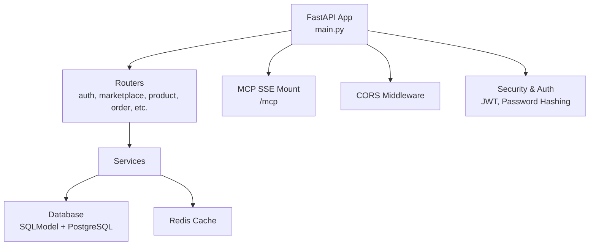
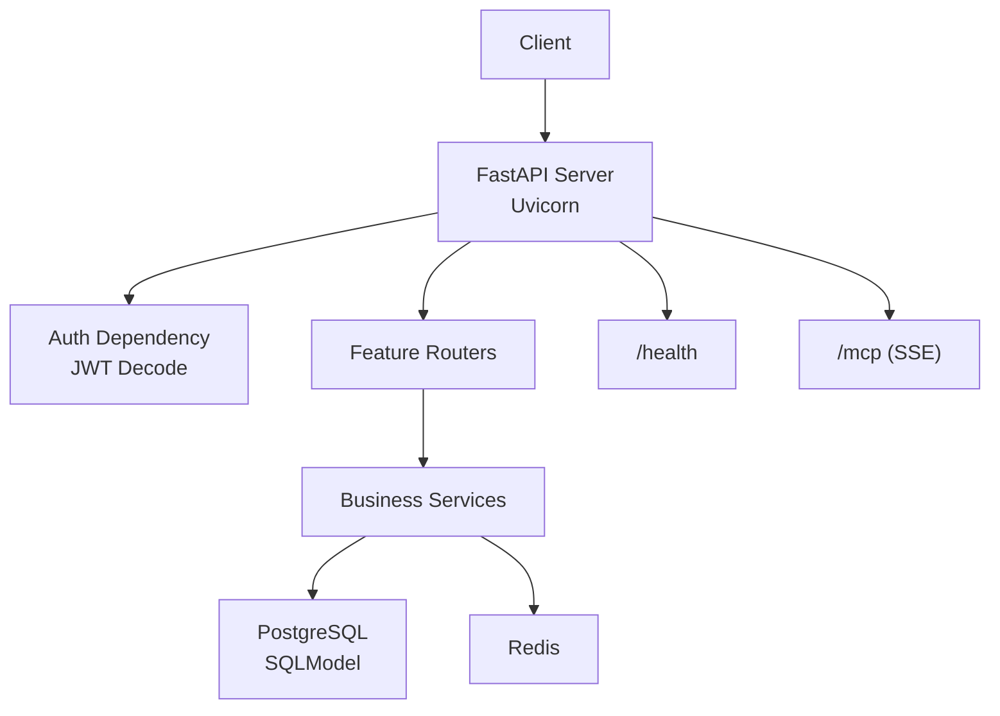
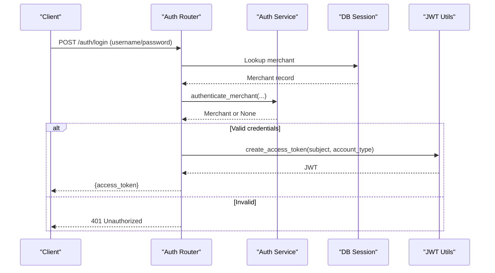
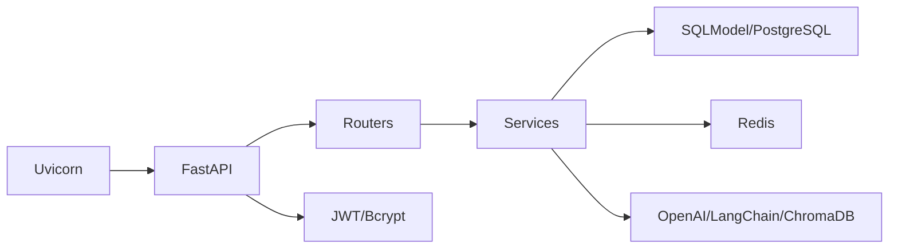

# Deployment & Operations

<cite>
**Referenced Files in This Document**
- [README.md](file://README.md)
- [Makefile](file://Makefile)
- [pyproject.toml](file://pyproject.toml)
- [main.py](file://neurocom_backend/main.py)
- [settings.py](file://neurocom_backend/utils/settings.py)
- [connection.py](file://neurocom_backend/database/connection.py)
- [security.py](file://neurocom_backend/utils/security.py)
- [auth_router.py](file://neurocom_backend/routers/auth_router.py)
- [dependencies.py](file://neurocom_backend/dependencies.py)
</cite>

## Table of Contents
1. Introduction
2. Project Structure
3. Core Components
4. Architecture Overview
5. Detailed Component Analysis
6. Dependency Analysis
7. Performance Considerations
8. Troubleshooting Guide
9. Conclusion
10. Appendices

## Introduction
This document provides production-oriented deployment and operations guidance for the Tijarah AI Backend (Neurocom). It covers environment configuration, containerization, orchestration with Kubernetes, CI/CD setup, monitoring and logging, performance tuning, scaling, backup and recovery, security hardening, maintenance tasks, and troubleshooting common operational issues. The backend is a FastAPI application using Uvicorn as the ASGI server, SQLModel for database access, Redis for caching, and JWT-based authentication.

## Project Structure
The application follows a modular structure:
- API entrypoint and middleware configuration
- Routers for feature domains (auth, marketplace integrations, product, orders, reviews, storage, etc.)
- Services encapsulating business logic
- Database models and connection management
- Utilities for settings, security, caching, and streaming events
- MCP server integration mounted under /mcp

**Diagram sources**
- [main.py:1-90](file://neurocom_backend/main.py#L1-L90)
- [settings.py:1-29](file://neurocom_backend/utils/settings.py#L1-L29)
- [connection.py:1-28](file://neurocom_backend/database/connection.py#L1-L28)
- [security.py:1-44](file://neurocom_backend/utils/security.py#L1-L44)

**Section sources**
- [README.md:1-6](file://README.md#L1-L6)
- [Makefile:1-2](file://Makefile#L1-L2)
- [pyproject.toml:1-40](file://pyproject.toml#L1-L40)
- [main.py:1-90](file://neurocom_backend/main.py#L1-L90)

## Core Components
- Application lifecycle and migrations: On startup, the app performs schema creation and applies specific PostgreSQL adjustments.
- Routing and protection: Routers are included; most endpoints require authentication via JWT.
- Settings and secrets: Environment variables drive database, Redis, JWT, and third-party integrations.
- Security: Password hashing, JWT token creation/verification, and optional encryption utilities.
- Authentication flow: OAuth2 password flow returns a JWT used by protected routes.

Key responsibilities:
- main.py: App initialization, CORS, lifespan migration, router mounting, health endpoint.
- utils/settings.py: Centralized env-driven configuration.
- database/connection.py: Engine creation, session handling, migration execution.
- utils/security.py: Password hashing, JWT encoding/decoding, encryption helpers.
- routers/auth_router.py: Signup, login, current user retrieval.
- dependencies.py: Current user resolution from JWT, role-based guards.

**Section sources**
- [main.py:16-45](file://neurocom_backend/main.py#L16-L45)
- [settings.py:11-29](file://neurocom_backend/utils/settings.py#L11-L29)
- [connection.py:9-27](file://neurocom_backend/database/connection.py#L9-L27)
- [security.py:14-43](file://neurocom_backend/utils/security.py#L14-L43)
- [auth_router.py:18-42](file://neurocom_backend/routers/auth_router.py#L18-L42)
- [dependencies.py:17-79](file://neurocom_backend/dependencies.py#L17-L79)

## Architecture Overview
High-level runtime architecture shows how requests flow through FastAPI to services, then to PostgreSQL and Redis, with JWT-based authorization enforced at the dependency layer.

**Diagram sources**
- [main.py:29-45](file://neurocom_backend/main.py#L29-L45)
- [dependencies.py:17-43](file://neurocom_backend/dependencies.py#L17-L43)
- [connection.py:9-27](file://neurocom_backend/database/connection.py#L9-L27)
- [settings.py:17-25](file://neurocom_backend/utils/settings.py#L17-L25)

## Detailed Component Analysis

### Application Lifecycle and Migrations
- On startup, the lifespan hook triggers migration functions to ensure tables exist and apply PostgreSQL-specific schema changes.
- Use this phase to verify connectivity to PostgreSQL before serving traffic.

Operational notes:
- Ensure DB_CONNECTION_STRING is valid and has sufficient privileges.
- Monitor logs during startup for successful table creation messages.

**Section sources**
- [main.py:16-27](file://neurocom_backend/main.py#L16-L27)
- [connection.py:15-23](file://neurocom_backend/database/connection.py#L15-L23)

### Configuration Management
- All runtime configuration is loaded from environment variables early in import to avoid timing issues.
- Key variables include database connection string, Redis host/port/credentials, JWT algorithm/token expiry, and third-party keys.

Production checklist:
- Provide all required env vars via your orchestrator or secret manager.
- Validate non-empty values for sensitive fields (e.g., SECRET_KEY, DB_CONNECTION_STRING).

**Section sources**
- [settings.py:1-29](file://neurocom_backend/utils/settings.py#L1-L29)

### Authentication and Authorization
- Login endpoint issues JWTs signed with SECRET_KEY using the configured algorithm and expiry.
- Protected routes resolve the current merchant from the Authorization header using a reusable dependency.
- Role-based guards can be composed for admin-only endpoints.

Operational considerations:
- Rotate SECRET_KEY carefully; existing tokens will fail to decode if changed without coordination.
- Enforce HTTPS in fronting proxies to protect bearer tokens.

**Diagram sources**
- [auth_router.py:24-37](file://neurocom_backend/routers/auth_router.py#L24-L37)
- [security.py:22-28](file://neurocom_backend/utils/security.py#L22-L28)
- [dependencies.py:17-43](file://neurocom_backend/dependencies.py#L17-L43)

**Section sources**
- [auth_router.py:18-42](file://neurocom_backend/routers/auth_router.py#L18-L42)
- [security.py:14-43](file://neurocom_backend/utils/security.py#L14-L43)
- [dependencies.py:17-79](file://neurocom_backend/dependencies.py#L17-L79)

### Database Access and Migration Strategy
- Engine is created with pool recycling and optional SQL echo for debugging.
- perform_migration ensures schema exists and applies PostgreSQL-specific alterations.

Production tips:
- Enable connection pooling and tune pool size based on concurrency.
- Use read replicas for heavy read workloads if supported by your provider.
- Back up databases regularly and test restore procedures.

**Section sources**
- [connection.py:9-27](file://neurocom_backend/database/connection.py#L9-L27)

### Caching with Redis
- Redis configuration is driven by environment variables including host, port, credentials, and SSL toggle.
- TTLs for marketplace caches are configurable per integration.

Operational guidance:
- Deploy Redis with persistence enabled and monitor memory usage.
- Use TLS when connecting to managed Redis instances.

**Section sources**
- [settings.py:17-25](file://neurocom_backend/utils/settings.py#L17-L25)

### CORS and External Integrations
- CORS is configured with an allowlist of origins.
- Third-party integrations (e.g., Shopify, Supabase) are configured via environment variables.

Best practices:
- Restrict allowed origins to known frontend domains.
- Store secrets in a secure vault and inject them at runtime.

**Section sources**
- [main.py:30-36](file://neurocom_backend/main.py#L30-L36)
- [settings.py:23-29](file://neurocom_backend/utils/settings.py#L23-L29)

## Dependency Analysis
Runtime dependencies and their roles:
- FastAPI/Uvicorn: Web framework and ASGI server.
- SQLModel/SQLAlchemy: ORM and engine/session management.
- Pydantic: Data validation and serialization.
- JWT/Bcrypt: Authentication and password hashing.
- Redis client: Caching and potential rate limiting.
- OpenAI/LangChain/ChromaDB: AI features and vector search.
- BeautifulSoup: Web scraping utilities.

**Diagram sources**
- [pyproject.toml:8-35](file://pyproject.toml#L8-L35)
- [main.py:1-12](file://neurocom_backend/main.py#L1-L12)
- [connection.py:1-13](file://neurocom_backend/database/connection.py#L1-L13)
- [security.py:1-14](file://neurocom_backend/utils/security.py#L1-L14)

**Section sources**
- [pyproject.toml:8-35](file://pyproject.toml#L8-L35)

## Performance Considerations
- Concurrency model: Uvicorn workers should match CPU cores; tune worker count based on workload characteristics.
- Database:
  - Tune connection pool sizes and timeouts.
  - Add indexes for frequently queried columns in models.
  - Use read replicas for analytics-heavy endpoints.
- Redis:
  - Set appropriate memory policies and enable persistence.
  - Use pipelining for batch operations where applicable.
- Application:
  - Disable debug SQL echo in production.
  - Use response compression and efficient serialization.
  - Offload long-running tasks to background workers if needed.

[No sources needed since this section provides general guidance]

## Troubleshooting Guide
Common issues and resolutions:
- Startup fails to connect to database:
  - Verify DB_CONNECTION_STRING and network access.
  - Check that migrations run successfully and required tables exist.
- Authentication errors:
  - Ensure SECRET_KEY and JWT_ALGORITHM are consistent across deployments.
  - Confirm clients send Authorization: Bearer <token>.
- Redis connectivity:
  - Validate REDIS_HOST, REDIS_PORT, credentials, and SSL settings.
  - Check firewall rules and TLS certificates for managed Redis.
- CORS failures:
  - Update ALLOWED_ORIGINS to include your frontend domain(s).
- High latency or timeouts:
  - Inspect slow queries and add indexes.
  - Increase Uvicorn workers and tune database pool sizes.
  - Profile Redis usage and optimize cache TTLs.

**Section sources**
- [connection.py:9-23](file://neurocom_backend/database/connection.py#L9-L23)
- [security.py:22-28](file://neurocom_backend/utils/security.py#L22-L28)
- [settings.py:11-25](file://neurocom_backend/utils/settings.py#L11-L25)
- [main.py:30-36](file://neurocom_backend/main.py#L30-L36)

## Conclusion
The Tijarah AI Backend is a FastAPI service with clear separation of concerns, environment-driven configuration, and robust authentication. For production, focus on secure secret management, hardened networking, observability, and capacity planning. Follow the appendices for concrete steps to containerize, orchestrate, automate CI/CD, and maintain the system reliably.

[No sources needed since this section summarizes without analyzing specific files]

## Appendices

### Production Deployment Strategies
- Process model: Run multiple Uvicorn workers behind a reverse proxy (e.g., Nginx/Traefik) with HTTPS termination.
- Health checks: Expose /health for readiness/liveness probes.
- Graceful shutdown: Ensure connections are closed and tasks complete before process exit.

**Section sources**
- [main.py:43-45](file://neurocom_backend/main.py#L43-L45)

### Environment Configuration
Required environment variables:
- DB_CONNECTION_STRING: PostgreSQL connection string.
- SECRET_KEY: Secret for signing JWTs and deriving encryption key.
- JWT_ALGORITHM: Algorithm for JWT (default HS256).
- ACCESS_TOKEN_EXPIRE_MINUTES: Token lifetime in minutes.
- REDIS_HOST, REDIS_PORT, REDIS_USERNAME, REDIS_PASSWORD, REDIS_SSL: Redis connection details.
- SHOPIFY_API_KEY, SHOPIFY_API_SECRET, SHOPIFY_CACHE_TTL_SECONDS: Shopify integration.
- SUPABASE_URL, SUPABASE_SECRET_KEY, SUPABASE_PRODUCT_BUCKET: Storage integration.
- SQL_ECHO: Enable SQL query logging for debugging (set to false in production).

**Section sources**
- [settings.py:11-29](file://neurocom_backend/utils/settings.py#L11-L29)

### Containerization with Docker
Recommended approach:
- Multi-stage build:
  - Stage 1: Install Poetry and dependencies into a virtual environment.
  - Stage 2: Minimal runtime image with Python and compiled wheels.
- Entrypoint:
  - Run Uvicorn with production settings (workers, bind address, log level).
- Volumes and secrets:
  - Mount only necessary config files; inject secrets via environment or secret mounts.
- Health check:
  - Probe /health periodically.

[No sources needed since this section provides general guidance]

### Orchestration with Kubernetes
Deployment checklist:
- Deployment:
  - Define replicas, resource requests/limits, and liveness/readiness probes.
- ConfigMap/Secrets:
  - Store configuration and secrets separately; mount as env vars.
- Services:
  - Expose via ClusterIP and Ingress for external access.
- Horizontal Pod Autoscaler:
  - Scale based on CPU/memory or custom metrics.
- Network Policies:
  - Restrict egress to database and Redis.

[No sources needed since this section provides general guidance]

### CI/CD Pipeline Setup
Pipeline stages:
- Lint and type-check code.
- Run unit tests.
- Build container image and push to registry.
- Deploy to staging with automated smoke tests.
- Promote to production with approval gates.
- Rollback strategy:
  - Keep previous images and support quick rollbacks.

[No sources needed since this section provides general guidance]

### Monitoring and Logging
- Metrics:
  - Expose application metrics (requests, latency, error rates) and integrate with Prometheus.
- Logs:
  - Structured JSON logs with correlation IDs.
  - Ship logs to centralized logging (e.g., ELK, Loki).
- Tracing:
  - Add distributed tracing for cross-service calls if applicable.
- Alerts:
  - Alert on error spikes, high latency, and resource exhaustion.

[No sources needed since this section provides general guidance]

### Backup and Recovery
- Database backups:
  - Schedule regular logical backups (e.g., pg_dump) and store offsite.
  - Test restore procedures periodically.
- File/object storage:
  - Versioned backups for Supabase buckets if used.
- Disaster recovery:
  - Document RTO/RPO and run drills.

[No sources needed since this section provides general guidance]

### Security Hardening
- Secrets management:
  - Use a vault or platform-native secret store; never commit secrets.
- TLS:
  - Enforce HTTPS everywhere; use strong cipher suites.
- Input validation:
  - Leverage Pydantic schemas to validate inputs.
- Least privilege:
  - Database users with minimal permissions.
- Dependency updates:
  - Automate vulnerability scanning and patching.

**Section sources**
- [security.py:14-43](file://neurocom_backend/utils/security.py#L14-L43)
- [settings.py:11-29](file://neurocom_backend/utils/settings.py#L11-L29)

### Maintenance Tasks
- Rotate secrets (e.g., SECRET_KEY) with coordinated rollout.
- Review and update dependencies regularly.
- Monitor disk usage for logs and caches.
- Periodically review and prune unused routes or features.

[No sources needed since this section provides general guidance]

### Local Development and Quick Start
- Run locally with Poetry and Uvicorn using the provided Make target.
- Ensure .env contains required variables for local services.

**Section sources**
- [README.md:3-5](file://README.md#L3-L5)
- [Makefile:1-2](file://Makefile#L1-L2)