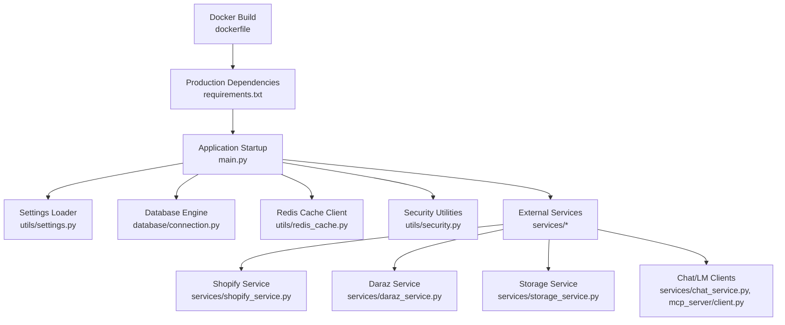
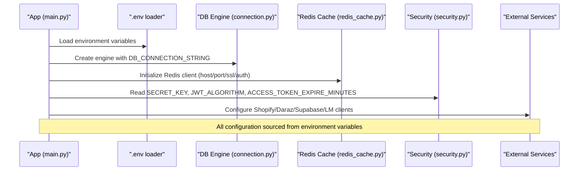
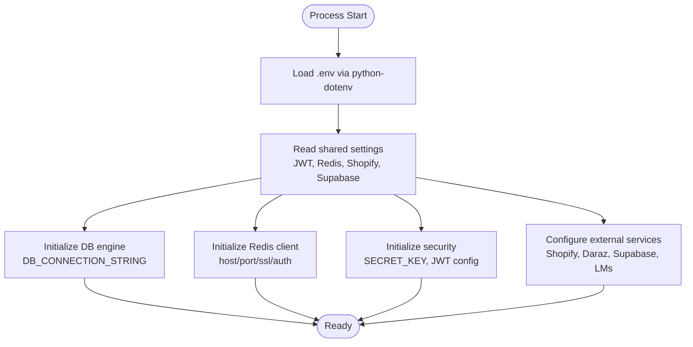
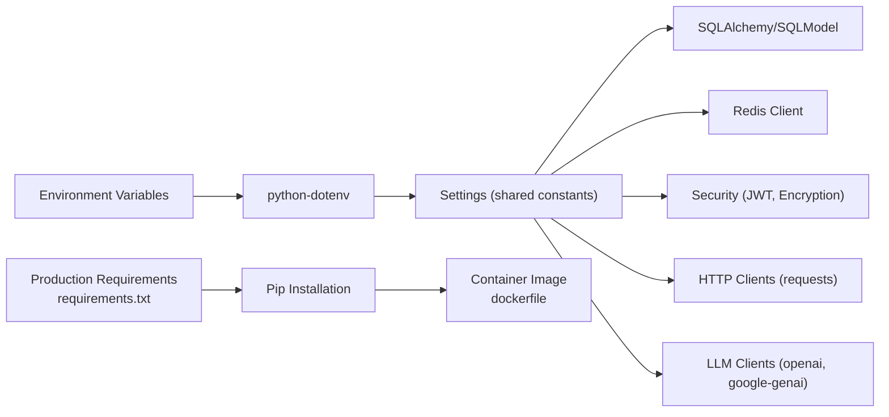

# Environment Setup & Configuration

<cite>
**Referenced Files in This Document**
- [settings.py](file://neurocom_backend/utils/settings.py)
- [connection.py](file://neurocom_backend/database/connection.py)
- [redis_cache.py](file://neurocom_backend/utils/redis_cache.py)
- [security.py](file://neurocom_backend/utils/security.py)
- [storage_service.py](file://neurocom_backend/services/storage_service.py)
- [shopify_service.py](file://neurocom_backend/services/shopify_service.py)
- [daraz_service.py](file://neurocom_backend/services/daraz_service.py)
- [chat_service.py](file://neurocom_backend/services/chat_service.py)
- [client.py](file://neurocom_backend/mcp_server/client.py)
- [main.py](file://neurocom_backend/main.py)
- [Makefile](file://Makefile)
- [README.md](file://README.md)
- [pyproject.toml](file://pyproject.toml)
- [requirements.txt](file://requirements.txt)
- [dockerfile](file://dockerfile)
- [.env.example](file://.env.example)
</cite>

## Update Summary
**Changes Made**
- Added comprehensive requirements.txt with 157 pinned Python packages for production deployment
- Documented the dual dependency management approach (Poetry for development, pip for production)
- Updated installation instructions to support both Poetry and pip workflows
- Added Docker-based production deployment guidance
- Enhanced security considerations for production environments
- Updated troubleshooting section with pip-specific issues

## Table of Contents
1. [Introduction](#introduction)
2. [Project Structure](#project-structure)
3. [Core Components](#core-components)
4. [Architecture Overview](#architecture-overview)
5. [Detailed Component Analysis](#detailed-component-analysis)
6. [Dependency Management](#dependency-management)
7. [Performance Considerations](#performance-considerations)
8. [Troubleshooting Guide](#troubleshooting-guide)
9. [Conclusion](#conclusion)
10. [Appendices](#appendices)

## Introduction
This document provides comprehensive environment setup and configuration guidance for the Tijarah AI Backend. It covers all required environment variables, database connection settings, Redis configuration, external service integrations (Shopify, Daraz, Supabase Storage, OpenAI-compatible providers), and how configuration is loaded at runtime. It also documents security considerations, secret management strategies, environment-specific overrides, and troubleshooting steps for common configuration issues.

The application uses environment variables via python-dotenv to load configuration from a .env file. There is no centralized Pydantic Settings model; instead, configuration values are read directly using os.getenv with defaults where applicable.

**Updated** The project now supports both Poetry-based development and pip-based production deployment through a comprehensive requirements.txt file with 157 pinned packages.

## Project Structure
Configuration is primarily defined and consumed across these areas:
- Centralized environment loading and shared constants: utils/settings.py
- Database engine creation and session handling: database/connection.py
- Redis-backed caching layer: utils/redis_cache.py
- Security utilities (JWT, password hashing, encryption): utils/security.py
- External integrations: services/* (Shopify, Daraz, Supabase Storage, Chat/LM providers)
- Entry points and tooling: main.py, Makefile, README.md, pyproject.toml
- Production dependencies: requirements.txt (157 pinned packages)
- Containerization: dockerfile

**Diagram sources**
- [main.py](file://neurocom_backend/main.py)
- [settings.py](file://neurocom_backend/utils/settings.py)
- [connection.py](file://neurocom_backend/database/connection.py)
- [redis_cache.py](file://neurocom_backend/utils/redis_cache.py)
- [security.py](file://neurocom_backend/utils/security.py)
- [shopify_service.py](file://neurocom_backend/services/shopify_service.py)
- [daraz_service.py](file://neurocom_backend/services/daraz_service.py)
- [storage_service.py](file://neurocom_backend/services/storage_service.py)
- [chat_service.py](file://neurocom_backend/services/chat_service.py)
- [client.py](file://neurocom_backend/mcp_server/client.py)
- [requirements.txt](file://requirements.txt)
- [dockerfile](file://dockerfile)

**Section sources**
- [README.md:1-6](file://README.md#L1-L6)
- [Makefile:1-2](file://Makefile#L1-L2)
- [pyproject.toml:1-40](file://pyproject.toml#L1-L40)

## Core Components
This section summarizes the key configuration components and their responsibilities.

- Settings loader and shared constants
  - Loads .env early so other modules can safely import derived constants at import time.
  - Exposes shared configuration such as JWT parameters, Redis settings, Shopify cache TTLs, and Supabase storage settings.

- Database
  - Creates SQLAlchemy engine using DB_CONNECTION_STRING.
  - Enables SQL echo based on SQL_ECHO.
  - Provides migration helper and session generator.

- Redis cache
  - Initializes a single redis client instance with host, port, username, password, SSL, and timeouts.
  - Uses configurable TTLs for marketplace caches.

- Security
  - Reads SECRET_KEY, JWT_ALGORITHM, ACCESS_TOKEN_EXPIRE_MINUTES.
  - Provides password hashing/verification, JWT encode/decode, and symmetric encryption helpers.

- External services
  - Shopify: requires API key/secret and optional version/scopes; validates presence before OAuth token exchange.
  - Daraz: requires app key/secret; supports caching with background refresh.
  - Supabase Storage: requires URL and secret key; validates presence before upload/download/delete.
  - Chat/LM providers: require provider-specific API keys (e.g., OpenRouter, Groq).

**Section sources**
- [settings.py:1-37](file://neurocom_backend/utils/settings.py#L1-L37)
- [connection.py:1-28](file://neurocom_backend/database/connection.py#L1-L28)
- [redis_cache.py:1-204](file://neurocom_backend/utils/redis_cache.py#L1-L204)
- [security.py:1-44](file://neurocom_backend/utils/security.py#L1-L44)
- [shopify_service.py:1-200](file://neurocom_backend/services/shopify_service.py#L1-L200)
- [daraz_service.py:1-200](file://neurocom_backend/services/daraz_service.py#L1-L200)
- [storage_service.py:1-142](file://neurocom_backend/services/storage_service.py#L1-L142)
- [chat_service.py:1-29](file://neurocom_backend/services/chat_service.py#L1-L29)
- [client.py:1-178](file://neurocom_backend/mcp_server/client.py#L1-L178)

## Architecture Overview
The backend loads configuration at startup through multiple modules that each call dotenv or rely on a central loader. The application then initializes:
- Database engine and session factory
- Redis client (lazy initialization)
- Security utilities (JWT, encryption)
- External service clients (Shopify, Daraz, Supabase, LM providers)

**Diagram sources**
- [settings.py:1-37](file://neurocom_backend/utils/settings.py#L1-L37)
- [connection.py:1-28](file://neurocom_backend/database/connection.py#L1-L28)
- [redis_cache.py:1-204](file://neurocom_backend/utils/redis_cache.py#L1-L204)
- [security.py:1-44](file://neurocom_backend/utils/security.py#L1-L44)
- [shopify_service.py:1-200](file://neurocom_backend/services/shopify_service.py#L1-L200)
- [daraz_service.py:1-200](file://neurocom_backend/services/daraz_service.py#L1-L200)
- [storage_service.py:1-142](file://neurocom_backend/services/storage_service.py#L1-L142)
- [chat_service.py:1-29](file://neurocom_backend/services/chat_service.py#L1-L29)
- [client.py:1-178](file://neurocom_backend/mcp_server/client.py#L1-L178)

## Detailed Component Analysis

### Environment Variables Reference
Below is a consolidated list of environment variables used by the application, grouped by purpose.

- Application and security
  - SECRET_KEY: Required for JWT signing and encryption.
  - JWT_ALGORITHM: Algorithm used for JWT (default HS256).
  - ACCESS_TOKEN_EXPIRE_MINUTES: Token lifetime in minutes (default 60).

- Database
  - DB_CONNECTION_STRING: Full database connection string.
  - SQL_ECHO: Enable SQL logging when set to true/1/yes.

- Redis
  - REDIS_HOST: Hostname (default localhost).
  - REDIS_PORT: Port (default 6379).
  - REDIS_USERNAME: Optional username for Redis authentication.
  - REDIS_PASSWORD: Optional password for Redis authentication.
  - REDIS_SSL: Enable SSL for Redis connections (true/1/yes).
  - DARAZ_CACHE_TTL_SECONDS: Default TTL for Daraz cache entries.
  - SHOPIFY_CACHE_TTL_SECONDS: Default TTL for Shopify cache entries.

- Shopify integration
  - SHOPIFY_API_KEY: Shopify app client ID.
  - SHOPIFY_API_SECRET: Shopify app client secret.
  - SHOPIFY_APP_CALLBACK_URL: Redirect URI for OAuth flow.
  - SHOPIFY_API_VERSION: GraphQL API version (default 2025-01).
  - SHOPIFY_SCOPES: Comma-separated OAuth scopes (default includes product/order/inventory/publication permissions).

- Daraz integration
  - DARAZ_APP_KEY: Daraz app key.
  - DARAZ_APP_SECRET: Daraz app secret.
  - APP_CALLBACK_URL: Callback URL used in authorization flows.

- Supabase Storage
  - SUPABASE_URL: Base URL for Supabase project.
  - SUPABASE_SECRET_KEY: Service role or appropriate key for storage operations.
  - SUPABASE_PRODUCT_BUCKET: Bucket name for product images (default product-images).

- AI / LLM providers
  - OPENAI_API_KEY: API key for OpenAI services.
  - OPEN_ROUTER_AI_API_KEY: API key for OpenRouter-based chat services.
  - GROQ_API_KEY: API key for Groq-based LLM calls (used in MCP client).
  - GEMINI_API_KEY: Optional key for Google Generative AI (commented usage in MCP client).

- WhatsApp Business Cloud API
  - WHATSAPP_ACCESS_TOKEN: WhatsApp Business API access token.
  - WHATSAPP_PN_ID: Phone number ID for WhatsApp Business.
  - WHATSAPP_ACCOUNT_ID: WhatsApp Business account ID.
  - WHATSAPP_API_VERSION: API version (default v25.0).
  - WHATSAPP_VERIFY_TOKEN: Webhook verification token.
  - WHATSAPP_WEBHOOK_URL: Webhook endpoint URL.

Notes:
- Many modules call load_dotenv() to ensure .env is loaded before reading environment variables.
- Some variables have sensible defaults; others are strictly required and will raise errors if missing.

**Section sources**
- [settings.py:11-37](file://neurocom_backend/utils/settings.py#L11-L37)
- [connection.py:9-13](file://neurocom_backend/database/connection.py#L9-L13)
- [redis_cache.py:56-71](file://neurocom_backend/utils/redis_cache.py#L56-L71)
- [security.py:13-28](file://neurocom_backend/utils/security.py#L13-L28)
- [shopify_service.py:21-25](file://neurocom_backend/services/shopify_service.py#L21-L25)
- [daraz_service.py:35](file://neurocom_backend/services/daraz_service.py#L35)
- [storage_service.py:32-35](file://neurocom_backend/services/storage_service.py#L32-L35)
- [chat_service.py:7-10](file://neurocom_backend/services/chat_service.py#L7-L10)
- [client.py:22-32](file://neurocom_backend/mcp_server/client.py#L22-L32)
- [.env.example:1-23](file://.env.example#L1-L23)

### Database Connection Settings
- The database engine is created with a connection string from DB_CONNECTION_STRING.
- SQL echo can be toggled via SQL_ECHO.
- Migration helper creates tables and applies PostgreSQL-specific adjustments.
- Session generator yields sessions for request handling.

Best practices:
- Use a secure connection string with least-privilege credentials.
- Ensure network access to the database from the deployment environment.
- Validate connectivity during startup or health checks.

**Section sources**
- [connection.py:1-28](file://neurocom_backend/database/connection.py#L1-L28)

### Redis Configuration and Caching
- Redis client is lazily initialized with host, port, username, password, SSL, and timeouts.
- Cache entries store both transformed value and content hash of raw payload.
- Background stale-while-revalidate refreshes data without blocking requests.
- TTLs are configurable per service (Daraz, Shopify).

Operational notes:
- For managed Redis (e.g., cloud), enable REDIS_SSL and provide credentials.
- Tune socket timeouts if connecting to remote Redis instances.
- Monitor cache hit rates and adjust TTLs based on upstream API stability.

**Section sources**
- [redis_cache.py:56-71](file://neurocom_backend/utils/redis_cache.py#L56-L71)
- [redis_cache.py:110-150](file://neurocom_backend/utils/redis_cache.py#L110-L150)
- [redis_cache.py:152-204](file://neurocom_backend/utils/redis_cache.py#L152-L204)
- [settings.py:17-25](file://neurocom_backend/utils/settings.py#L17-L25)

### Security and Secrets Management
- SECRET_KEY is required for JWT and encryption; missing it raises a runtime error.
- JWT algorithm and token expiry are configurable.
- Password hashing uses bcrypt via passlib.
- Symmetric encryption helpers derive a Fernet key from SECRET_KEY.

Secret management recommendations:
- Store secrets in environment variables injected by your platform (Kubernetes Secrets, Docker secrets, CI/CD vaults).
- Avoid committing .env files to version control; use .gitignore.
- Rotate SECRET_KEY carefully; existing encrypted values will become unreadable after rotation.

**Section sources**
- [security.py:13-44](file://neurocom_backend/utils/security.py#L13-L44)
- [settings.py:13-15](file://neurocom_backend/utils/settings.py#L13-L15)

### External Service Integrations

#### Shopify
- Requires SHOPIFY_API_KEY and SHOPIFY_API_SECRET; missing credentials raise an internal server error during token exchange.
- Supports configurable API version and OAuth scopes.
- Uses GraphQL endpoints for product and order operations.

Operational tips:
- Ensure redirect URI matches Shopify app configuration.
- Validate scopes include necessary permissions.
- Handle userErrors returned by Shopify API appropriately.

**Section sources**
- [shopify_service.py:21-25](file://neurocom_backend/services/shopify_service.py#L21-L25)
- [shopify_service.py:87-121](file://neurocom_backend/services/shopify_service.py#L87-L121)

#### Daraz
- Requires DARAZ_APP_KEY and DARAZ_APP_SECRET to initialize the client.
- Uses caching with background refresh to reduce upstream API calls.
- Removes volatile envelope keys before hashing to avoid false cache misses.

Operational tips:
- Set appropriate cache TTLs based on product update frequency.
- Monitor rate limits and backoff behavior from the marketplace API.

**Section sources**
- [daraz_service.py:35](file://neurocom_backend/services/daraz_service.py#L35)
- [daraz_service.py:48-100](file://neurocom_backend/services/daraz_service.py#L48-L100)

#### Supabase Storage
- Requires SUPABASE_URL and SUPABASE_SECRET_KEY; missing configuration returns a 503.
- Uploads enforce allowed image types and size limits.
- Downloads and deletes use service role key for private buckets.

Operational tips:
- Restrict bucket policies to least privilege.
- Validate paths to prevent traversal attacks.
- Use HTTPS URLs for public objects.

**Section sources**
- [storage_service.py:32-35](file://neurocom_backend/services/storage_service.py#L32-L35)
- [storage_service.py:46-74](file://neurocom_backend/services/storage_service.py#L46-L74)
- [storage_service.py:77-102](file://neurocom_backend/services/storage_service.py#L77-L102)
- [storage_service.py:128-142](file://neurocom_backend/services/storage_service.py#L128-L142)

#### AI / LLM Providers
- Chat service uses OpenRouter-compatible endpoint with OPEN_ROUTER_AI_API_KEY.
- MCP client uses Groq-compatible endpoint with GROQ_API_KEY (and optionally Gemini).
- Ensure base_url and api_key are correctly configured per provider.

Operational tips:
- Pin model names per environment to control costs and performance.
- Implement retries and timeouts for provider calls.

**Section sources**
- [chat_service.py:7-10](file://neurocom_backend/services/chat_service.py#L7-L10)
- [client.py:22-32](file://neurocom_backend/mcp_server/client.py#L22-L32)

### Configuration Loading Flow

**Diagram sources**
- [settings.py:1-37](file://neurocom_backend/utils/settings.py#L1-L37)
- [connection.py:1-28](file://neurocom_backend/database/connection.py#L1-L28)
- [redis_cache.py:1-204](file://neurocom_backend/utils/redis_cache.py#L1-L204)
- [security.py:1-44](file://neurocom_backend/utils/security.py#L1-L44)
- [shopify_service.py:1-200](file://neurocom_backend/services/shopify_service.py#L1-L200)
- [daraz_service.py:1-200](file://neurocom_backend/services/daraz_service.py#L1-L200)
- [storage_service.py:1-142](file://neurocom_backend/services/storage_service.py#L1-L142)
- [chat_service.py:1-29](file://neurocom_backend/services/chat_service.py#L1-L29)
- [client.py:1-178](file://neurocom_backend/mcp_server/client.py#L1-L178)

## Dependency Analysis
Key dependencies and their roles:
- python-dotenv: Loads environment variables from .env.
- sqlmodel/sqlalchemy: Database ORM and engine creation.
- redis: Redis client for caching.
- cryptography/passlib/pyjwt: Security utilities for encryption and JWT.
- requests: HTTP client for external APIs.
- openai/google-genai: LLM provider clients.

**Updated** The project now includes a comprehensive requirements.txt file with 157 pinned packages for production deployment, including:
- AI/ML libraries: LangChain ecosystem (langchain, langchain-core, langchain-openai), OpenAI integration, ChromaDB vector database
- Database connectors: psycopg2-binary, SQLAlchemy, SQLModel
- Caching systems: Redis with hiredis support
- Security updates: charset-normalizer 3.5.1, cryptography 44.0.3
- Performance optimizations: uvloop, orjson, msgpack
- Development tools: watchfiles, rich, plotly

**Diagram sources**
- [pyproject.toml:8-35](file://pyproject.toml#L8-L35)
- [requirements.txt:1-158](file://requirements.txt#L1-L158)
- [dockerfile:1-28](file://dockerfile#L1-L28)
- [settings.py:1-37](file://neurocom_backend/utils/settings.py#L1-L37)
- [connection.py:1-28](file://neurocom_backend/database/connection.py#L1-L28)
- [redis_cache.py:1-204](file://neurocom_backend/utils/redis_cache.py#L1-L204)
- [security.py:1-44](file://neurocom_backend/utils/security.py#L1-L44)

**Section sources**
- [pyproject.toml:8-35](file://pyproject.toml#L8-L35)
- [requirements.txt:1-158](file://requirements.txt#L1-L158)

## Performance Considerations
- Redis caching reduces upstream API calls and CPU-intensive transforms; tune TTLs based on data volatility.
- Background refresh avoids blocking requests while revalidating cache.
- Connection pooling and retries for HTTP clients improve resilience.
- SQL echo should be disabled in production to reduce log noise.
- **Updated** Production deployments benefit from pinned dependencies ensuring consistent performance across environments.
- **Updated** The requirements.txt includes performance-optimized packages like uvloop, orjson, and msgpack for faster JSON processing and event loops.

## Troubleshooting Guide
Common configuration issues and resolutions:

- Missing or invalid database connection
  - Symptom: Engine creation fails or cannot connect.
  - Action: Verify DB_CONNECTION_STRING format and network access; check SQL_ECHO for debugging.

- Redis connection failures
  - Symptom: Cannot connect to Redis or timeouts.
  - Action: Confirm REDIS_HOST, REDIS_PORT, credentials, and REDIS_SSL; adjust socket timeouts if needed.

- JWT or encryption errors
  - Symptom: Runtime error indicating SECRET_KEY is not configured.
  - Action: Provide SECRET_KEY; ensure consistent JWT_ALGORITHM and ACCESS_TOKEN_EXPIRE_MINUTES.

- Shopify OAuth/token exchange failures
  - Symptom: Internal server error or bad request during token exchange.
  - Action: Ensure SHOPIFY_API_KEY and SHOPIFY_API_SECRET are set; verify redirect URI and scopes.

- Supabase Storage errors
  - Symptom: 503 when storage is not configured; 502 on network errors; 404 for missing objects.
  - Action: Set SUPABASE_URL and SUPABASE_SECRET_KEY; validate bucket name and object paths; check HTTPS requirement for public URLs.

- LLM provider errors
  - Symptom: Authentication or model errors.
  - Action: Provide correct API keys (OPENAI_API_KEY, OPEN_ROUTER_AI_API_KEY, GROQ_API_KEY); verify base_url and model names.

- **Updated** Dependency installation issues
  - Symptom: ImportError or ModuleNotFoundError during startup.
  - Action: Ensure all packages from requirements.txt are installed; verify Python version compatibility (3.11+); check for conflicting package versions.

- **Updated** Docker build failures
  - Symptom: Build fails during pip install or poetry export.
  - Action: Verify system dependencies (gcc, libexpat1); ensure internet access for package downloads; check Docker build context.

- **Updated** Poetry vs pip conflicts
  - Symptom: Package version mismatches between Poetry and pip installations.
  - Action: Use Poetry for development only; use requirements.txt for production; clean virtual environments when switching between dependency managers.

**Section sources**
- [connection.py:9-13](file://neurocom_backend/database/connection.py#L9-L13)
- [redis_cache.py:56-71](file://neurocom_backend/utils/redis_cache.py#L56-L71)
- [security.py:31-35](file://neurocom_backend/utils/security.py#L31-L35)
- [shopify_service.py:87-121](file://neurocom_backend/services/shopify_service.py#L87-L121)
- [storage_service.py:32-35](file://neurocom_backend/services/storage_service.py#L32-L35)
- [storage_service.py:46-74](file://neurocom_backend/services/storage_service.py#L46-L74)
- [chat_service.py:7-10](file://neurocom_backend/services/chat_service.py#L7-L10)
- [client.py:22-32](file://neurocom_backend/mcp_server/client.py#L22-L32)
- [requirements.txt:1-158](file://requirements.txt#L1-L158)
- [dockerfile:14-23](file://dockerfile#L14-L23)

## Conclusion
The Tijarah AI Backend relies on environment variables for all configuration, loaded via python-dotenv. Centralized settings expose shared constants, while individual modules initialize their respective clients (database, Redis, security, external services). The project now supports both Poetry-based development and pip-based production deployment through a comprehensive requirements.txt file with 157 pinned packages, ensuring consistency and reliability across different environments. Follow the recommended secret management practices, validate configurations per environment, and use the troubleshooting guide to resolve common issues quickly.

## Appendices

### Step-by-Step Setup Instructions

#### Development Environment (Poetry)
- Install dependencies using Poetry for development flexibility.
- Create a .env file with required variables (see Environment Variables Reference).
- Run the server using the provided Makefile command or Poetry run uvicorn.
- Benefits: Automatic dependency resolution, virtual environment isolation, development-time extras.

#### Production Environment (pip)
- Install dependencies using requirements.txt for deterministic builds.
- Use Docker containerization for consistent deployment.
- Inject environment variables via platform secrets management.
- Benefits: Pinned versions, optimized packages, reproducible builds.

#### Docker Deployment
- Build the container image using the provided Dockerfile.
- The Dockerfile automatically exports Poetry dependencies to requirements.txt and installs them with pip.
- Run the container with environment variables mounted or passed via command line.
- Benefits: Consistent runtime environment, easy scaling, isolated dependencies.

#### Environment-Specific Configuration
- Development: Use local databases, debug logging, and relaxed security settings.
- Staging: Mirror production configuration with test data and staging API keys.
- Production: Use strong, rotated secrets, SSL-enabled Redis, and production-grade databases.

[No sources needed since this section provides general guidance]

### Production Deployment Checklist
- [ ] All required environment variables configured
- [ ] Database connection string validated
- [ ] Redis server accessible with proper authentication
- [ ] API keys for external services (Shopify, Daraz, OpenAI, etc.) set
- [ ] SSL certificates configured for HTTPS
- [ ] Logging and monitoring enabled
- [ ] Backup strategy implemented for database and storage
- [ ] Health check endpoints tested
- [ ] Performance benchmarks completed
- [ ] Security scan performed on dependencies

### Dependency Management Strategy
The project uses a dual approach:
- **Development**: Poetry for flexible dependency management and virtual environment isolation
- **Production**: requirements.txt with 157 pinned packages for deterministic builds
- **Containerization**: Dockerfile automates the transition from Poetry to pip for production builds

This ensures development flexibility while maintaining production stability and reproducibility.

[No sources needed since this section provides general guidance]