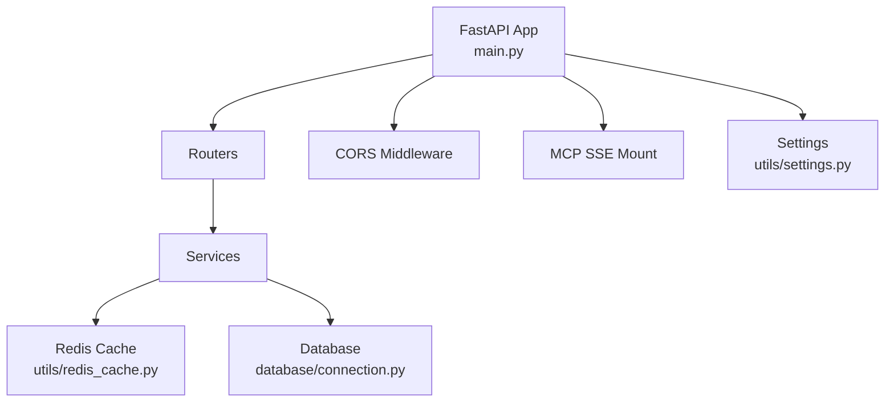
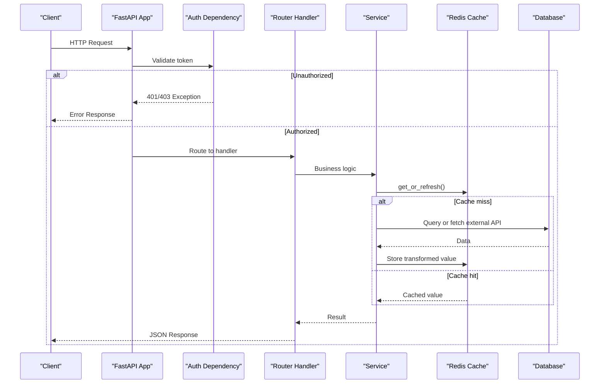
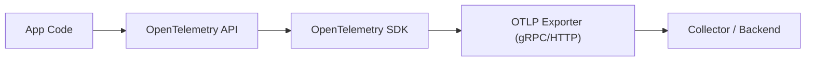

# Monitoring & Logging

<cite>
**Referenced Files in This Document**
- [main.py](file://neurocom_backend/main.py)
- [settings.py](file://neurocom_backend/utils/settings.py)
- [redis_cache.py](file://neurocom_backend/utils/redis_cache.py)
- [connection.py](file://neurocom_backend/database/connection.py)
- [dependencies.py](file://neurocom_backend/dependencies.py)
- [daraz_service.py](file://neurocom_backend/services/daraz_service.py)
- [customer_support_main.py](file://neurocom_backend/mcp_server/customer_support/main.py)
- [poetry.lock](file://poetry.lock)
</cite>

## Table of Contents
1. Introduction
2. Project Structure
3. Core Components
4. Architecture Overview
5. Detailed Component Analysis
6. Dependency Analysis
7. Performance Considerations
8. Troubleshooting Guide
9. Conclusion
10. Appendices

## Introduction
This document describes the monitoring and logging posture for the Tijarah AI Backend, focusing on application metrics collection, custom metrics implementation, performance monitoring strategies, structured logging setup, log levels, aggregation pipelines, distributed tracing, request correlation, error tracking, alerting strategies, database query monitoring, Redis cache performance, API response time tracking, dashboards (Grafana), log analysis (Kibana), incident response procedures, debugging techniques, performance profiling, and bottleneck identification methods. It is grounded in the current codebase and highlights where to instrument additional observability features.

## Project Structure
The backend is a FastAPI application with routers, services, utilities, and a Redis-backed caching layer. Observability-related hooks exist at:
- Application startup and health endpoints
- Database connection and optional SQL echo
- Redis client configuration and cache operations
- Service-level logging and print statements
- Optional OpenTelemetry dependencies available in the environment

**Diagram sources**
- [main.py:16-37](file://neurocom_backend/main.py#L16-L37)
- [redis_cache.py:56-70](file://neurocom_backend/utils/redis_cache.py#L56-L70)
- [connection.py:9-13](file://neurocom_backend/database/connection.py#L9-L13)
- [settings.py:11-29](file://neurocom_backend/utils/settings.py#L11-L29)

**Section sources**
- [main.py:16-37](file://neurocom_backend/main.py#L16-L37)
- [settings.py:11-29](file://neurocom_backend/utils/settings.py#L11-L29)

## Core Components
- Application lifecycle and middleware: The app initializes migrations during lifespan and mounts an SSE-based MCP server. Health endpoint exists for liveness checks.
- Settings: Centralized environment-driven configuration including Redis connectivity and feature toggles.
- Redis cache: Provides cache-aside reads with background stale-while-revalidate, content hashing, and TTL management.
- Database: SQLAlchemy engine with optional SQL echo controlled by environment variables; session factory used across services.
- Dependencies: Authentication and authorization helpers that raise standardized HTTP/WebSocket exceptions.
- Services: Business logic modules that call external APIs and use Redis caching; contain logging and print statements.

**Section sources**
- [main.py:16-45](file://neurocom_backend/main.py#L16-L45)
- [settings.py:11-29](file://neurocom_backend/utils/settings.py#L11-L29)
- [redis_cache.py:56-70](file://neurocom_backend/utils/redis_cache.py#L56-L70)
- [connection.py:9-27](file://neurocom_backend/database/connection.py#L9-L27)
- [dependencies.py:17-79](file://neurocom_backend/dependencies.py#L17-L79)
- [daraz_service.py:55-100](file://neurocom_backend/services/daraz_service.py#L55-L100)

## Architecture Overview
The request flow includes authentication, routing, service execution, Redis caching, and database interactions. Observability touchpoints include:
- Request entry points (routers)
- Auth dependency validation
- Service calls with logging
- Redis cache hits/misses and background refresh
- Database queries with optional echo

**Diagram sources**
- [dependencies.py:34-43](file://neurocom_backend/dependencies.py#L34-L43)
- [redis_cache.py:152-204](file://neurocom_backend/utils/redis_cache.py#L152-L204)
- [connection.py:25-27](file://neurocom_backend/database/connection.py#L25-L27)
- [daraz_service.py:92-100](file://neurocom_backend/services/daraz_service.py#L92-L100)

## Detailed Component Analysis

### Application Lifecycle and Health
- Lifespan performs migrations at startup.
- Health endpoint returns a simple status string for liveness probes.
- CORS middleware configured via settings.

Recommendations:
- Add structured logging for startup events and migration outcomes.
- Expose readiness checks for DB and Redis connectivity.

**Section sources**
- [main.py:16-45](file://neurocom_backend/main.py#L16-L45)
- [settings.py:11-11](file://neurocom_backend/utils/settings.py#L11-L11)

### Settings and Configuration
- Environment variables control Redis host/port/credentials/SSL and cache TTLs.
- JWT algorithm and token expiry are configurable.
- External integrations (Supabase) are configured via env.

Recommendations:
- Centralize all observability-related settings (e.g., OTLP endpoints, log levels).
- Add validation and defaults for critical observability configs.

**Section sources**
- [settings.py:11-29](file://neurocom_backend/utils/settings.py#L11-L29)

### Redis Cache Monitoring
- Redis client is lazily initialized with timeouts and SSL support.
- Cache-aside pattern with background stale-while-revalidate using content hashing.
- Background refresh uses a short-lived lock to avoid duplicate revalidation.
- Logs refresh success/failure and prints debug info on cache hits.

Metrics to collect:
- Cache hit rate, miss rate, background refresh frequency, TTL expirations, errors.
- Latency per cache operation (get/set/expire/delete).

Operational notes:
- Ensure Redis availability and monitor connection timeouts.
- Track hash mismatches indicating upstream data changes.

**Section sources**
- [redis_cache.py:56-70](file://neurocom_backend/utils/redis_cache.py#L56-L70)
- [redis_cache.py:115-149](file://neurocom_backend/utils/redis_cache.py#L115-L149)
- [redis_cache.py:152-204](file://neurocom_backend/utils/redis_cache.py#L152-L204)

### Database Query Monitoring
- Engine created with pool recycling and optional SQL echo based on environment.
- Session factory yields sessions for requests.

Metrics to collect:
- Query latency distribution, slow queries, connection pool usage, error rates.
- Enable SQL echo in non-production environments for detailed logs.

Operational notes:
- Monitor pool exhaustion and long-running transactions.
- Use structured logs around query boundaries for correlation IDs.

**Section sources**
- [connection.py:9-13](file://neurocom_backend/database/connection.py#L9-L13)
- [connection.py:25-27](file://neurocom_backend/database/connection.py#L25-L27)

### Authentication and Authorization Errors
- Standardized HTTP/WebSocket exceptions for unauthorized/forbidden scenarios.
- Role-based access control helper raises consistent errors.

Observability recommendations:
- Log auth failures with context (endpoint, user agent, IP if available).
- Track 401/403 rates and spikes.

**Section sources**
- [dependencies.py:34-43](file://neurocom_backend/dependencies.py#L34-L43)
- [dependencies.py:67-79](file://neurocom_backend/dependencies.py#L67-L79)

### Service-Level Logging and Tracing Hooks
- Services use Python logging and print statements for debugging.
- External API calls (e.g., Daraz) are wrapped with caching and transformation.

Observability recommendations:
- Replace print statements with structured logs containing request IDs and timestamps.
- Add timing instrumentation around expensive operations (HTML cleanup, model validation).
- Integrate OpenTelemetry spans for external calls and cache operations.

**Section sources**
- [daraz_service.py:55-100](file://neurocom_backend/services/daraz_service.py#L55-L100)
- [daraz_service.py:106-136](file://neurocom_backend/services/daraz_service.py#L106-L136)

### MCP SSE Server Integration
- Mounted under /mcp with SSE transport for real-time communication.
- Basic exception handling and print statements for operational visibility.

Observability recommendations:
- Add structured logs for SSE connection lifecycle and message throughput.
- Track error rates and reconnect patterns.

**Section sources**
- [customer_support_main.py:37-61](file://neurocom_backend/mcp_server/customer_support/main.py#L37-L61)

## Dependency Analysis
OpenTelemetry packages are present in the environment, enabling distributed tracing and metrics export when configured.

**Diagram sources**
- [poetry.lock:2758-2810](file://poetry.lock#L2758-L2810)
- [poetry.lock:2816-2857](file://poetry.lock#L2816-L2857)

**Section sources**
- [poetry.lock:2758-2857](file://poetry.lock#L2758-L2857)

## Performance Considerations
- Redis cache reduces external API calls and CPU-heavy transformations; background refresh avoids synchronous overhead.
- Connection timeouts and pool recycling mitigate resource leaks and improve resilience.
- Avoid blocking operations in request threads; leverage background threads carefully.

Recommendations:
- Instrument cache operations and external calls with latency metrics.
- Monitor Redis memory usage and eviction policies.
- Profile CPU-bound transforms (e.g., HTML cleanup) and consider async or offloading.

[No sources needed since this section provides general guidance]

## Troubleshooting Guide
Common issues and diagnostics:
- Redis connectivity: Check host/port/SSL and timeouts; verify credentials and network reachability.
- Cache staleness: Inspect hash comparisons and background refresh logs; ensure upstream payloads exclude volatile keys.
- Database echo: Enable SQL echo to inspect generated queries; monitor pool utilization.
- Auth errors: Review 401/403 responses and dependency flows; validate tokens and roles.
- SSE errors: Inspect exception handling and connection lifecycle logs.

Actionable steps:
- Add correlation IDs to requests and propagate through services.
- Centralize logging with structured fields (timestamp, level, request_id, endpoint, duration).
- Implement health checks for Redis and DB; fail fast on critical dependencies.

**Section sources**
- [redis_cache.py:115-149](file://neurocom_backend/utils/redis_cache.py#L115-L149)
- [connection.py:9-13](file://neurocom_backend/database/connection.py#L9-L13)
- [dependencies.py:34-43](file://neurocom_backend/dependencies.py#L34-L43)
- [customer_support_main.py:37-61](file://neurocom_backend/mcp_server/customer_support/main.py#L37-L61)

## Conclusion
The Tijarah AI Backend has foundational components for observability: environment-driven configuration, Redis caching with background refresh, database engine with optional SQL echo, and structured exception handling. To achieve comprehensive monitoring and logging, integrate OpenTelemetry for distributed tracing and metrics, standardize structured logging across services, implement request correlation, and set up dashboards and alerts in Grafana and Kibana. Focus on cache performance, database query efficiency, and API response times to identify bottlenecks and maintain reliability.

[No sources needed since this section summarizes without analyzing specific files]

## Appendices

### Structured Logging Setup and Log Levels
- Use Python’s logging module consistently across services.
- Define log levels (DEBUG, INFO, WARNING, ERROR, CRITICAL) and route outputs to centralized collectors.
- Include contextual fields: timestamp, level, service, endpoint, user_id, request_id, duration_ms.

[No sources needed since this section provides general guidance]

### Distributed Tracing Implementation
- Initialize OpenTelemetry SDK and configure exporters (OTLP gRPC/HTTP) via environment variables.
- Instrument FastAPI routes, Redis calls, and external HTTP requests with spans.
- Propagate trace context across services and downstream calls.

**Section sources**
- [poetry.lock:2758-2857](file://poetry.lock#L2758-L2857)

### Request Correlation and Error Tracking
- Generate a unique request ID per incoming request and attach it to logs and traces.
- Capture error details with stack traces and context (payloads sanitized).
- Track error rates by endpoint and dependency.

[No sources needed since this section provides general guidance]

### Alerting Strategies and Thresholds
- Define SLOs for API latency, error rates, and cache hit ratios.
- Configure alerts for:
  - High 5xx error rates
  - Elevated p95/p99 latencies
  - Redis connection errors or high latency
  - Database pool exhaustion or slow queries
- Set notification channels (email, Slack, PagerDuty).

[No sources needed since this section provides general guidance]

### Database Query Monitoring
- Enable SQL echo in non-production to capture queries.
- Monitor query durations and identify slow queries.
- Track connection pool metrics and transaction lifetimes.

**Section sources**
- [connection.py:9-13](file://neurocom_backend/database/connection.py#L9-L13)

### Redis Cache Performance
- Measure cache hit/miss ratios and background refresh frequency.
- Monitor TTL expirations and memory usage.
- Ensure timeouts and retries are tuned for production.

**Section sources**
- [redis_cache.py:56-70](file://neurocom_backend/utils/redis_cache.py#L56-L70)
- [redis_cache.py:115-149](file://neurocom_backend/utils/redis_cache.py#L115-L149)

### API Response Time Tracking
- Record request start/end times and compute duration per endpoint.
- Segment latency by phases: auth, service, cache, DB, external calls.
- Visualize distributions and percentiles in dashboards.

[No sources needed since this section provides general guidance]

### Dashboards and Log Analysis
- Grafana: Build dashboards for request rates, latency percentiles, error rates, cache metrics, DB metrics, and Redis stats.
- Kibana: Create indices for structured logs; build views for error trends, slow requests, and auth failures.
- Correlate traces and logs using request IDs.

[No sources needed since this section provides general guidance]

### Incident Response Procedures
- On alert ingestion, retrieve correlated traces and logs using request IDs.
- Identify failing dependencies (Redis, DB, external APIs).
- Roll back recent changes if necessary; scale resources or adjust thresholds.
- Post-incident: update runbooks and add missing metrics/alerts.

[No sources needed since this section provides general guidance]

### Debugging Techniques and Profiling
- Use SQL echo temporarily to inspect queries.
- Add timing logs around expensive operations (transforms, external calls).
- Profile CPU-bound tasks and consider asynchronous processing or worker queues.
- Leverage OpenTelemetry spans to pinpoint hotspots.

**Section sources**
- [connection.py:9-13](file://neurocom_backend/database/connection.py#L9-L13)
- [daraz_service.py:85-100](file://neurocom_backend/services/daraz_service.py#L85-L100)