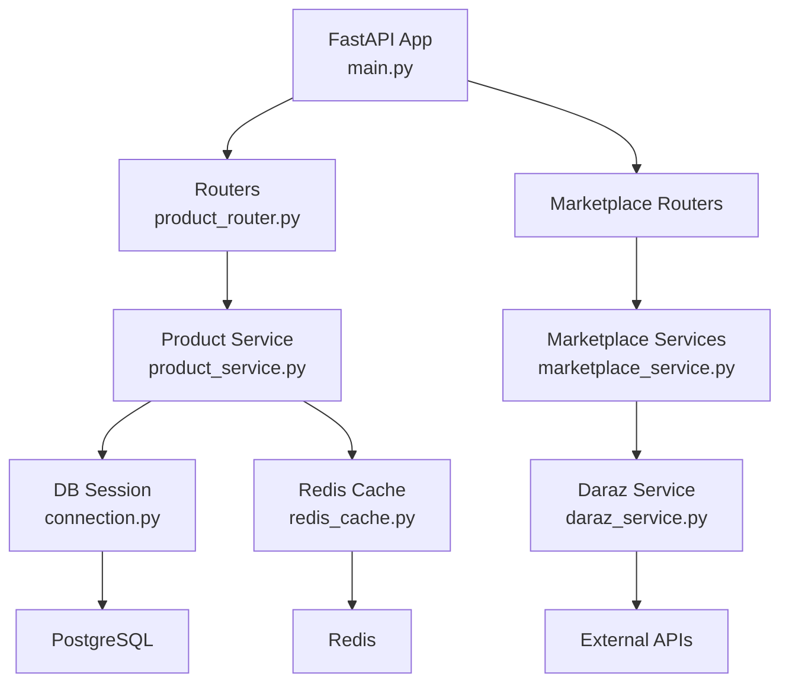
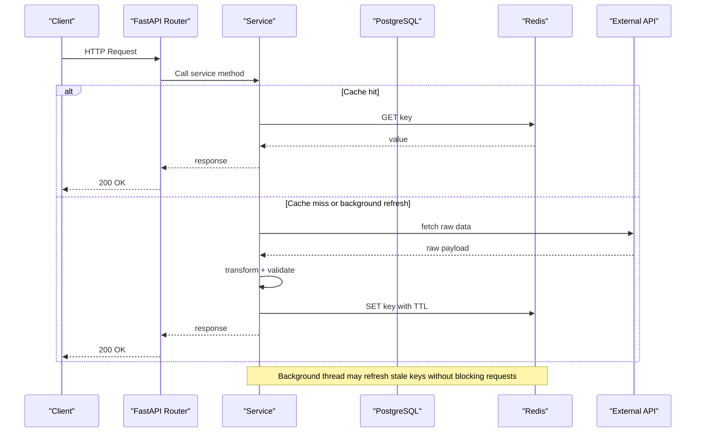
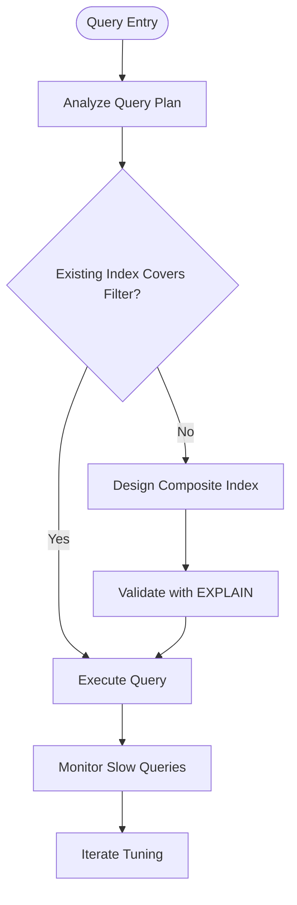
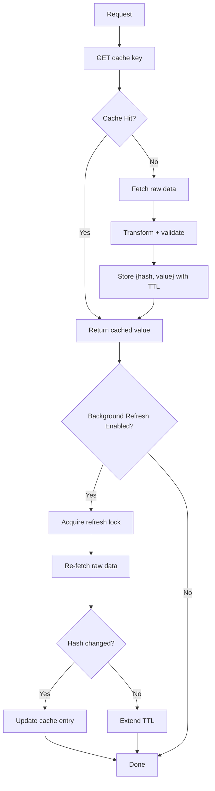
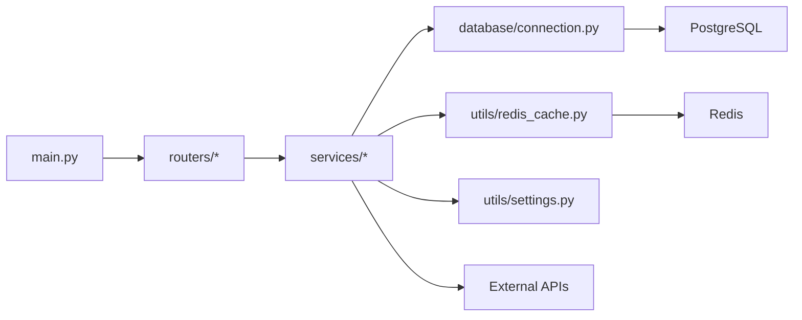
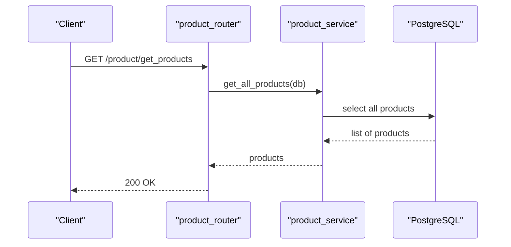

# Performance Optimization & Scaling

<cite>
**Referenced Files in This Document**
- [main.py](file://neurocom_backend/main.py)
- [connection.py](file://neurocom_backend/database/connection.py)
- [product.py](file://neurocom_backend/database/models/product.py)
- [redis_cache.py](file://neurocom_backend/utils/redis_cache.py)
- [settings.py](file://neurocom_backend/utils/settings.py)
- [pyproject.toml](file://pyproject.toml)
- [product_router.py](file://neurocom_backend/routers/product_router.py)
- [product_service.py](file://neurocom_backend/services/product_service.py)
- [marketplace_service.py](file://neurocom_backend/services/marketplace_service.py)
- [daraz_service.py](file://neurocom_backend/services/daraz_service.py)
</cite>

## Table of Contents
1. Introduction
2. Project Structure
3. Core Components
4. Architecture Overview
5. Detailed Component Analysis
6. Dependency Analysis
7. Performance Considerations
8. Troubleshooting Guide
9. Conclusion
10. Appendices

## Introduction
This document provides performance optimization and scaling guidance for the Tijarah AI Backend. It focuses on database query optimization, indexing strategies, connection pooling, Redis caching patterns and invalidation, horizontal scaling with load balancing and stateless design, API rate limiting and quotas, background job processing and async patterns, benchmarking and profiling, and auto-scaling plus cost optimization. The recommendations are grounded in the current codebase structure and implementation details.

## Project Structure
The backend is a FastAPI application that:
- Initializes middleware and mounts routers at startup
- Uses SQLModel/SQLAlchemy for PostgreSQL with a global engine and session generator
- Implements a Redis-backed cache-aside helper with background stale-while-revalidate
- Integrates marketplace services (Daraz, Shopify) and internal product/order logic

**Diagram sources**
- [main.py:16-37](file://neurocom_backend/main.py#L16-L37)
- [product_router.py:1-38](file://neurocom_backend/routers/product_router.py#L1-L38)
- [product_service.py:1-47](file://neurocom_backend/services/product_service.py#L1-L47)
- [connection.py:9-27](file://neurocom_backend/database/connection.py#L9-L27)
- [redis_cache.py:56-203](file://neurocom_backend/utils/redis_cache.py#L56-L203)
- [marketplace_service.py:1-302](file://neurocom_backend/services/marketplace_service.py#L1-L302)
- [daraz_service.py:92-100](file://neurocom_backend/services/daraz_service.py#L92-L100)

**Section sources**
- [main.py:16-37](file://neurocom_backend/main.py#L16-L37)
- [pyproject.toml:8-35](file://pyproject.toml#L8-L35)

## Core Components
- Application bootstrap and lifecycle:
  - Runs migrations at startup via lifespan
  - Adds CORS middleware and mounts SSE app
- Database layer:
  - Global SQLAlchemy engine with pool recycle and optional echo
  - Session generator used by routers/services
- Caching:
  - Redis client singleton with thread-safe initialization
  - Cache-aside with background refresh and content hashing to avoid unnecessary transforms
- Marketplace integrations:
  - Encrypted token storage and connection management
  - Daraz and Shopify flows with caching where applicable

Key configuration:
- Redis host/port/credentials and SSL from environment
- JWT and CORS settings
- Cache TTLs per marketplace

**Section sources**
- [main.py:16-37](file://neurocom_backend/main.py#L16-L37)
- [connection.py:9-27](file://neurocom_backend/database/connection.py#L9-L27)
- [redis_cache.py:56-203](file://neurocom_backend/utils/redis_cache.py#L56-L203)
- [settings.py:11-29](file://neurocom_backend/utils/settings.py#L11-L29)
- [marketplace_service.py:236-302](file://neurocom_backend/services/marketplace_service.py#L236-L302)

## Architecture Overview
The request flow typically goes through FastAPI routers into services, which either read/write to the database or call external marketplaces. Read-heavy marketplace data is cached in Redis using a cache-aside pattern with background revalidation.

**Diagram sources**
- [product_router.py:15-33](file://neurocom_backend/routers/product_router.py#L15-L33)
- [product_service.py:9-47](file://neurocom_backend/services/product_service.py#L9-L47)
- [redis_cache.py:152-203](file://neurocom_backend/utils/redis_cache.py#L152-L203)
- [daraz_service.py:92-100](file://neurocom_backend/services/daraz_service.py#L92-L100)

## Detailed Component Analysis

### Database Query Optimization and Indexing
- Current models:
  - Product model defines an indexed primary key UUID
- Recommendations:
  - Add indexes on frequently filtered columns (e.g., category, price ranges)
  - Use composite indexes for common query predicates (e.g., merchant_id + marketplace_id)
  - Prefer selective queries; avoid SELECT * when only needed fields are required
  - For large result sets, implement pagination and cursor-based navigation
  - Use EXPLAIN ANALYZE to identify slow queries and verify index usage

**Section sources**
- [product.py:13-21](file://neurocom_backend/database/models/product.py#L13-L21)

### Connection Pooling Configuration
- Engine configuration:
  - Uses SQLAlchemy engine with pool_recycle set
  - Echo can be toggled via environment variable
- Recommendations:
  - Configure explicit pool_size, max_overflow, and pool_timeout based on expected concurrency
  - Ensure pool_recycle aligns with database-side idle timeout to prevent stale connections
  - Enable connection health checks if supported by your driver
  - Monitor pool utilization and adjust sizing under load

**Section sources**
- [connection.py:9-13](file://neurocom_backend/database/connection.py#L9-L13)

### Redis Caching Patterns and Invalidation
- Pattern implemented:
  - Cache-aside with background stale-while-revalidate
  - Content hashing to detect changes without expensive transforms
  - Thread-safe Redis client singleton
  - Per-key lock to avoid thundering herd during refresh
- Usage examples:
  - Products listing and reviews use get_or_refresh with appropriate TTLs
- Invalidation strategy:
  - TTL-based expiration
  - On write paths (e.g., product updates), consider invalidating related cache keys
  - For marketplace data, rely on background refresh triggered by reads

**Diagram sources**
- [redis_cache.py:152-203](file://neurocom_backend/utils/redis_cache.py#L152-L203)
- [daraz_service.py:92-100](file://neurocom_backend/services/daraz_service.py#L92-L100)

**Section sources**
- [redis_cache.py:56-203](file://neurocom_backend/utils/redis_cache.py#L56-L203)
- [settings.py:17-22](file://neurocom_backend/utils/settings.py#L17-L22)
- [daraz_service.py:92-100](file://neurocom_backend/services/daraz_service.py#L92-L100)

### Horizontal Scaling, Load Balancing, and Stateless Design
- Stateless service design:
  - No in-process state beyond process-local caches; Redis is externalized
  - Sessions are short-lived and tied to request scope
- Scaling approach:
  - Run multiple Uvicorn workers behind a reverse proxy/load balancer (e.g., Nginx, cloud LB)
  - Scale horizontally by adding instances; ensure shared Redis and DB connectivity
  - Use container orchestration (Kubernetes) for auto-scaling based on CPU/memory and request latency
- Load balancing:
  - Health endpoints exposed for readiness/liveness probes
  - Sticky sessions not required due to statelessness

**Section sources**
- [main.py:43-45](file://neurocom_backend/main.py#L43-L45)
- [redis_cache.py:56-71](file://neurocom_backend/utils/redis_cache.py#L56-L71)

### API Rate Limiting, Request Throttling, and Resource Quotas
- Current status:
  - No built-in rate limiter in the application
- Recommended approaches:
  - Implement middleware-based rate limiting (per IP/user) using Redis counters
  - Apply endpoint-specific throttling for heavy operations (e.g., marketplace sync)
  - Enforce resource quotas per tenant/merchant to protect shared resources
  - Integrate with gateway-level rate limiting for coarse-grained protection

[No sources needed since this section provides general guidance]

### Background Job Processing and Async Patterns
- Current patterns:
  - Background threads used for cache revalidation
  - ThreadPoolExecutor used for parallel review fetching
- Recommendations:
  - Offload long-running tasks (e.g., bulk imports, heavy scraping) to a task queue (Celery, ARQ, or asyncio-based worker)
  - Use message brokers (Redis/RabbitMQ) for reliable job distribution
  - Implement retries with exponential backoff and dead-letter queues
  - Separate CPU-bound workloads into worker processes to avoid GIL contention

**Section sources**
- [redis_cache.py:115-149](file://neurocom_backend/utils/redis_cache.py#L115-L149)
- [daraz_service.py:106-136](file://neurocom_backend/services/daraz_service.py#L106-L136)

### Performance Benchmarking Tools and Profiling Techniques
- Suggested tools:
  - Locust or k6 for load testing and throughput measurement
  - Prometheus + Grafana for metrics collection and dashboards
  - OpenTelemetry for distributed tracing across services
  - Python profilers (cProfile, py-spy) to identify hotspots
- Practices:
  - Baseline p50/p95/p99 latencies before and after optimizations
  - Track Redis hit ratio, DB query times, and upstream API latency
  - Correlate spikes with deployment changes and traffic patterns

[No sources needed since this section provides general guidance]

### Auto-Scaling Configuration, Resource Allocation, and Cost Optimization
- Auto-scaling:
  - Define HPA policies based on CPU, memory, and custom metrics (request latency, queue depth)
  - Set min/max replicas to balance responsiveness and cost
- Resource allocation:
  - Right-size containers with realistic CPU/memory requests/limits
  - Use vertical pod autoscaling cautiously to avoid thrashing
- Cost optimization:
  - Prefer spot/preemptible instances for fault-tolerant workloads
  - Cache aggressively to reduce upstream API costs
  - Schedule non-critical jobs during off-peak hours

[No sources needed since this section provides general guidance]

## Dependency Analysis
High-level dependencies among core modules:

**Diagram sources**
- [main.py:30-37](file://neurocom_backend/main.py#L30-L37)
- [product_router.py:1-38](file://neurocom_backend/routers/product_router.py#L1-L38)
- [product_service.py:1-47](file://neurocom_backend/services/product_service.py#L1-L47)
- [connection.py:9-27](file://neurocom_backend/database/connection.py#L9-L27)
- [redis_cache.py:56-203](file://neurocom_backend/utils/redis_cache.py#L56-L203)
- [settings.py:11-29](file://neurocom_backend/utils/settings.py#L11-L29)

**Section sources**
- [pyproject.toml:8-35](file://pyproject.toml#L8-L35)

## Performance Considerations
- Database:
  - Add targeted indexes; avoid full table scans
  - Use connection pooling tuned for workload characteristics
  - Batch writes and minimize round trips
- Redis:
  - Choose appropriate TTLs per data freshness requirements
  - Monitor memory usage and eviction policies
  - Keep payloads small; store references when possible
- External APIs:
  - Respect rate limits; implement retries and circuit breakers
  - Cache responses aggressively where acceptable
- Concurrency:
  - Avoid blocking calls in request handlers; prefer async or background tasks
  - Use thread pools judiciously to prevent saturation

[No sources needed since this section provides general guidance]

## Troubleshooting Guide
- Database issues:
  - Enable SQL echo temporarily to inspect generated queries
  - Check connection errors and pool exhaustion; tune pool parameters
- Redis issues:
  - Verify connectivity and credentials; monitor timeouts
  - Inspect cache hit ratios and TTL behavior
- Marketplace integrations:
  - Handle upstream errors gracefully; surface meaningful messages
  - Log and track failures for retry/backoff strategies

**Section sources**
- [connection.py:9-13](file://neurocom_backend/database/connection.py#L9-L13)
- [redis_cache.py:56-71](file://neurocom_backend/utils/redis_cache.py#L56-L71)
- [marketplace_service.py:236-302](file://neurocom_backend/services/marketplace_service.py#L236-L302)

## Conclusion
The Tijarah AI Backend already employs effective patterns such as cache-aside with background revalidation and a clean separation between routers, services, and data access. To scale further, focus on database indexing and query tuning, robust connection pooling, comprehensive rate limiting, and moving heavy workloads to background jobs. Adopt observability and benchmarking practices to continuously validate performance and capacity decisions while optimizing costs through auto-scaling and right-sized resources.

## Appendices

### Key Endpoints and Flow
- Product CRUD endpoints route through product_router to product_service, using DB sessions
- Marketplace endpoints leverage marketplace_service and daraz_service with Redis caching

**Diagram sources**
- [product_router.py:30-33](file://neurocom_backend/routers/product_router.py#L30-L33)
- [product_service.py:45-47](file://neurocom_backend/services/product_service.py#L45-L47)