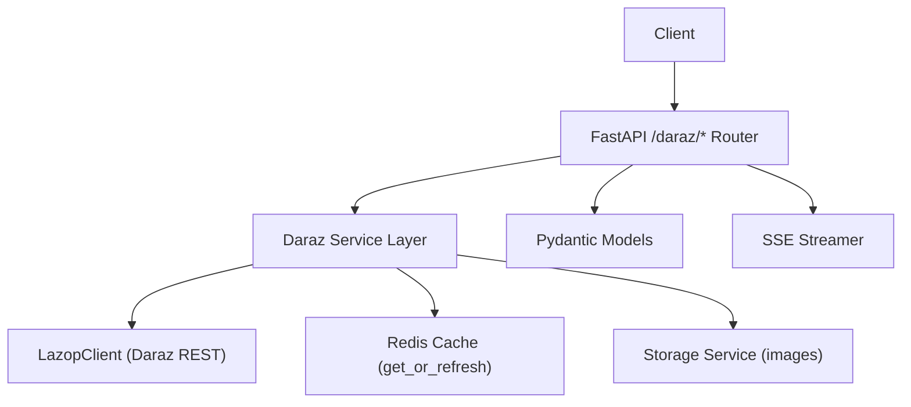
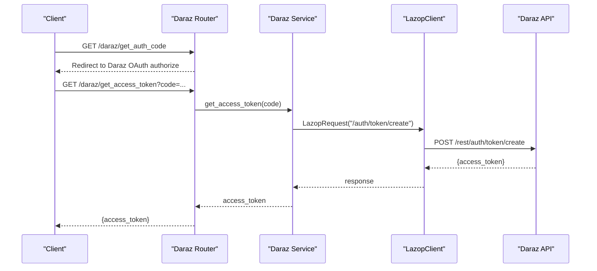
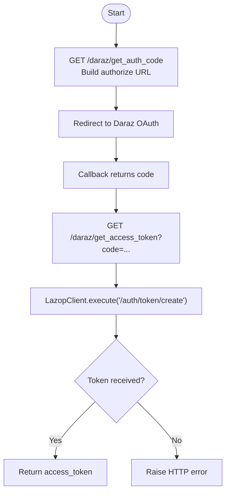
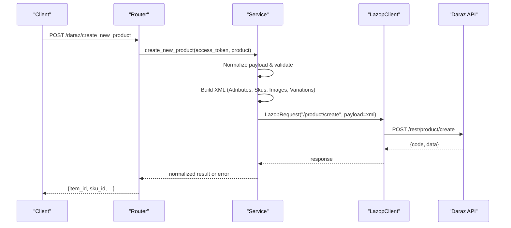
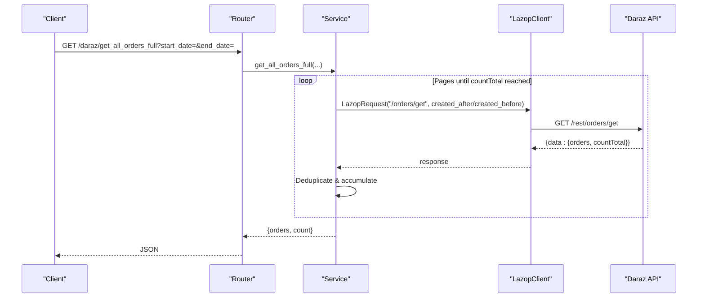
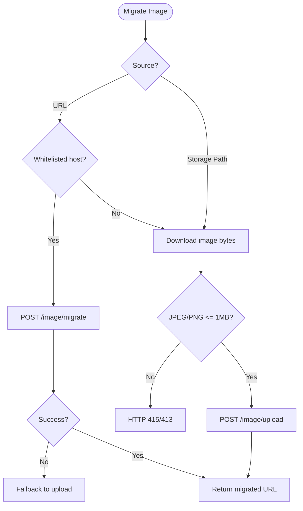
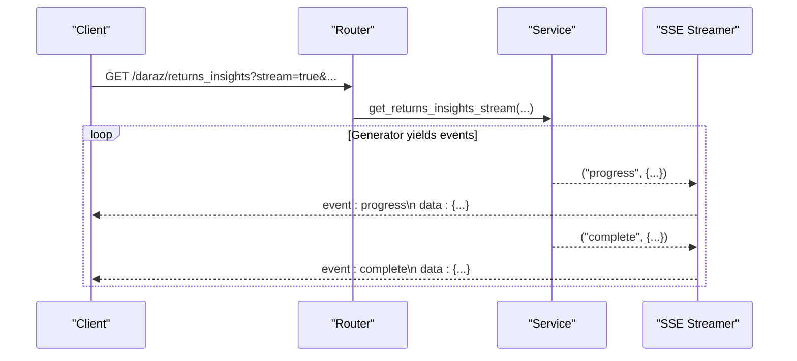
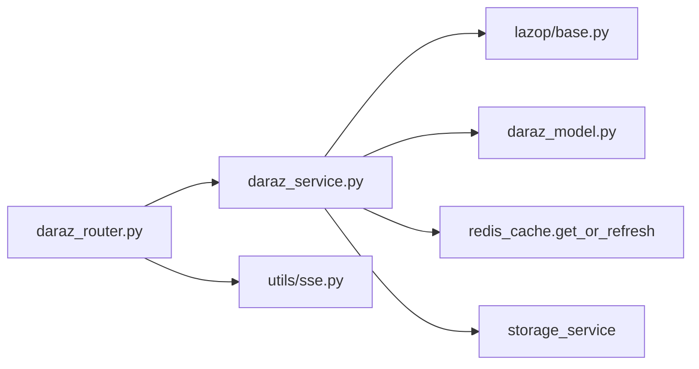

# Daraz Integration

<cite>
**Referenced Files in This Document**
- [main.py](file://neurocom_backend/main.py)
- [daraz_router.py](file://neurocom_backend/routers/daraz_router.py)
- [daraz_service.py](file://neurocom_backend/services/daraz_service.py)
- [daraz_model.py](file://neurocom_backend/models/daraz_model.py)
- [lazop/base.py](file://neurocom_backend/python/lazop/base.py)
- [settings.py](file://neurocom_backend/utils/settings.py)
- [sse.py](file://neurocom_backend/utils/sse.py)
- [marketplace_service.py](file://neurocom_backend/services/marketplace_service.py)
</cite>

## Table of Contents
1. [Introduction](#introduction)
2. [Project Structure](#project-structure)
3. [Core Components](#core-components)
4. [Architecture Overview](#architecture-overview)
5. [Detailed Component Analysis](#detailed-component-analysis)
6. [Dependency Analysis](#dependency-analysis)
7. [Performance Considerations](#performance-considerations)
8. [Troubleshooting Guide](#troubleshooting-guide)
9. [Conclusion](#conclusion)
10. [Appendices](#appendices)

## Introduction
This document explains the Daraz marketplace integration for the Tijarah AI Backend. It covers OAuth authentication, all exposed endpoints for product management, orders, logistics, categories, and reviews, image migration workflows with batch operations and progress tracking, error handling strategies, configuration requirements, and streaming support for large datasets such as returns insights.

## Project Structure
The Daraz integration is implemented across a FastAPI router, a service layer that calls the Daraz API via a Lazop client, Pydantic models for request/response validation, and utilities for caching and streaming. The application mounts routers under a common prefix and enforces merchant-scoped access to encrypted Daraz tokens stored in the database.

**Diagram sources**
- [main.py:29-89](file://neurocom_backend/main.py#L29-L89)
- [daraz_router.py:82-329](file://neurocom_backend/routers/daraz_router.py#L82-L329)
- [daraz_service.py:35-1557](file://neurocom_backend/services/daraz_service.py#L35-L1557)
- [lazop/base.py:131-204](file://neurocom_backend/python/lazop/base.py#L131-L204)
- [sse.py:18-33](file://neurocom_backend/utils/sse.py#L18-L33)

**Section sources**
- [main.py:29-89](file://neurocom_backend/main.py#L29-L89)
- [daraz_router.py:82-329](file://neurocom_backend/routers/daraz_router.py#L82-L329)

## Core Components
- OAuth flow: Authorization code redirect and token exchange.
- Product management: Create product, retrieve by ID, list all products, category attributes.
- Orders and logistics: List orders, full order history, order details with items, trace order, logistics details.
- Returns and insights: Reverse orders info/history, returns insights (sync and stream), dashboard ranking.
- Reviews: Seller API reviews and storefront scraping.
- Images: Single and batch migration/upload with validation and fallbacks.
- Streaming: Server-Sent Events for long-running analytics.

**Section sources**
- [daraz_router.py:91-329](file://neurocom_backend/routers/daraz_router.py#L91-L329)
- [daraz_service.py:40-1557](file://neurocom_backend/services/daraz_service.py#L40-L1557)
- [daraz_model.py:20-460](file://neurocom_backend/models/daraz_model.py#L20-L460)

## Architecture Overview
The router validates requests, resolves an encrypted merchant-scoped access token from the database, and delegates to service functions. Services build Lazop requests, execute them against Daraz, cache results where appropriate, and return validated responses. Long-running computations use generators and are streamed via SSE.

**Diagram sources**
- [daraz_router.py:91-105](file://neurocom_backend/routers/daraz_router.py#L91-L105)
- [daraz_service.py:40-46](file://neurocom_backend/services/daraz_service.py#L40-L46)
- [lazop/base.py:140-204](file://neurocom_backend/python/lazop/base.py#L140-L204)

## Detailed Component Analysis

### OAuth Authentication Flow
- Authorization redirect: Builds the Daraz authorize URL using app key and callback URL from environment variables.
- Token exchange: Exchanges authorization code for an access token via the Lazop client.
- Merchant-scoped token resolution: For protected endpoints, the router decrypts the encrypted token associated with the authenticated merchant’s active Daraz connection.

**Diagram sources**
- [daraz_router.py:91-105](file://neurocom_backend/routers/daraz_router.py#L91-L105)
- [daraz_service.py:40-46](file://neurocom_backend/services/daraz_service.py#L40-L46)

**Section sources**
- [daraz_router.py:24-78](file://neurocom_backend/routers/daraz_router.py#L24-L78)
- [daraz_router.py:91-105](file://neurocom_backend/routers/daraz_router.py#L91-L105)
- [marketplace_service.py:211-233](file://neurocom_backend/services/marketplace_service.py#L211-L233)

### Product Management Endpoints
- List all products: Cached fetch with raw body hashing to avoid reprocessing volatile metadata; cleaned via Pydantic model.
- Get product by ID: Fetches single product and validates response.
- Create product: Normalizes payload, ensures required fields, builds XML payload with attributes, images, variations, and SKUs; handles category-specific attribute sets and size chart requirements.
- Category attributes and tree: Retrieves category definitions and children; validates non-dict responses.

**Diagram sources**
- [daraz_router.py:213-248](file://neurocom_backend/routers/daraz_router.py#L213-L248)
- [daraz_service.py:754-879](file://neurocom_backend/services/daraz_service.py#L754-L879)
- [lazop/base.py:140-204](file://neurocom_backend/python/lazop/base.py#L140-L204)

**Section sources**
- [daraz_router.py:107-159](file://neurocom_backend/routers/daraz_router.py#L107-L159)
- [daraz_service.py:55-104](file://neurocom_backend/services/daraz_service.py#L55-L104)
- [daraz_service.py:254-311](file://neurocom_backend/services/daraz_service.py#L254-L311)
- [daraz_service.py:754-879](file://neurocom_backend/services/daraz_service.py#L754-L879)
- [daraz_model.py:20-218](file://neurocom_backend/models/daraz_model.py#L20-L218)

### Order Processing Endpoints
- List orders: Basic page with optional cancellation filter.
- Full order history: Time-based pagination walking created_at to collect all orders within a date range; deduplicates by order_id.
- Orders with items: Merges order headers with line items via batched calls; supports filtering by SKU.
- Order by ID: Fetches header and merges items.
- Trace order: Uses logistic trace endpoint.
- Logistics details: Extracts tracking number and retrieves package history timeline.

**Diagram sources**
- [daraz_router.py:250-261](file://neurocom_backend/routers/daraz_router.py#L250-L261)
- [daraz_service.py:936-1022](file://neurocom_backend/services/daraz_service.py#L936-L1022)
- [lazop/base.py:140-204](file://neurocom_backend/python/lazop/base.py#L140-L204)

**Section sources**
- [daraz_router.py:250-282](file://neurocom_backend/routers/daraz_router.py#L250-L282)
- [daraz_service.py:936-1185](file://neurocom_backend/services/daraz_service.py#L936-L1185)

### Category Management
- Retrieve category tree and find by ID or children.
- Retrieve category attributes for a primary category and language; validates response shape and maps errors.

**Section sources**
- [daraz_router.py:127-159](file://neurocom_backend/routers/daraz_router.py#L127-L159)
- [daraz_service.py:254-311](file://neurocom_backend/services/daraz_service.py#L254-L311)

### Review Scraping Functionality
- Seller API reviews: Fetches recent reviews via seller endpoints with time window parameters.
- Storefront review scraping: Calls public PDP review widget endpoint to gather full review history without rolling window limits; paginates until empty page; caches results.

**Section sources**
- [daraz_service.py:106-177](file://neurocom_backend/services/daraz_service.py#L106-L177)
- [daraz_service.py:190-252](file://neurocom_backend/services/daraz_service.py#L190-L252)
- [daraz_model.py:283-316](file://neurocom_backend/models/daraz_model.py#L283-L316)

### Image Migration Processes
- Single image migration: Supports direct URL or storage path; validates content type and size; uses Daraz migrate when whitelisted host; otherwise downloads and uploads via local upload; handles E302 fallback.
- Batch migration: Submits XML payload with multiple URLs; returns batch processing result.
- Batch result polling: Queries status by batch_id.

**Diagram sources**
- [daraz_router.py:173-211](file://neurocom_backend/routers/daraz_router.py#L173-L211)
- [daraz_service.py:314-479](file://neurocom_backend/services/daraz_service.py#L314-L479)

**Section sources**
- [daraz_router.py:173-211](file://neurocom_backend/routers/daraz_router.py#L173-L211)
- [daraz_service.py:314-479](file://neurocom_backend/services/daraz_service.py#L314-L479)

### Returns Insights and Dashboard
- Reverse orders info/history: Paginates reverse orders and fetches detailed lines; filters by product/SKU and date range.
- Returns insights (streaming): Streams progress events while fetching returns and orders, computes metrics, reason breakdown, monthly trends, and recommendations; final event contains complete dataset.
- Dashboard: Aggregates top products by return rate over a date range with minimum sales threshold.

**Diagram sources**
- [daraz_router.py:298-312](file://neurocom_backend/routers/daraz_router.py#L298-L312)
- [daraz_service.py:1340-1467](file://neurocom_backend/services/daraz_service.py#L1340-L1467)
- [sse.py:18-33](file://neurocom_backend/utils/sse.py#L18-L33)

**Section sources**
- [daraz_router.py:284-321](file://neurocom_backend/routers/daraz_router.py#L284-L321)
- [daraz_service.py:1192-1550](file://neurocom_backend/services/daraz_service.py#L1192-L1550)
- [daraz_model.py:220-460](file://neurocom_backend/models/daraz_model.py#L220-L460)

### WebSocket Support
- The router defines helpers to resolve encrypted access tokens over WebSocket connections, enabling secure real-time features tied to merchant scope. While no dedicated WebSocket endpoint is mounted here, the pattern supports future real-time order updates or streaming integrations.

**Section sources**
- [daraz_router.py:66-78](file://neurocom_backend/routers/daraz_router.py#L66-L78)

## Dependency Analysis
- Router depends on service functions for business logic and on Pydantic models for response schemas.
- Service depends on Lazop client for signed HTTP requests to Daraz REST endpoints.
- Caching layer reduces repeated network calls for expensive operations like product listing and reverse orders.
- Storage service integrates with Supabase for image retrieval and validation before upload/migration.

**Diagram sources**
- [daraz_router.py:1-21](file://neurocom_backend/routers/daraz_router.py#L1-L21)
- [daraz_service.py:1-35](file://neurocom_backend/services/daraz_service.py#L1-L35)
- [lazop/base.py:131-204](file://neurocom_backend/python/lazop/base.py#L131-L204)
- [sse.py:18-33](file://neurocom_backend/utils/sse.py#L18-L33)

**Section sources**
- [daraz_router.py:1-21](file://neurocom_backend/routers/daraz_router.py#L1-L21)
- [daraz_service.py:1-35](file://neurocom_backend/services/daraz_service.py#L1-L35)

## Performance Considerations
- Caching: Products, orders, reverse orders, and scraped reviews are cached with fingerprints based on access tokens and query parameters to reduce redundant API calls.
- Pagination strategy: Orders are fetched by advancing created_at timestamps to reliably traverse large histories beyond offset limitations.
- Batch processing: Order details are requested in batches to minimize round trips.
- HTML cleanup: Descriptions are stripped to plain text only when necessary to avoid heavy parsing on cache hits.
- Image constraints: Enforce JPEG/PNG and 1 MB limit to prevent oversized payloads and invalid uploads.

[No sources needed since this section provides general guidance]

## Troubleshooting Guide
Common issues and how they are handled:
- Missing or invalid encrypted access token: Returns 401/400 with clear messages; WebSocket connections raise policy violation exceptions.
- Invalid Daraz responses: Non-dict category attributes or image responses trigger 502 errors with diagnostic details.
- Product creation failures: Logs include Daraz code, message, detail, and request_id; routes map to 422 with structured error payloads.
- Image migration failures: Handles E302 by falling back to direct upload; validates content types and sizes; returns 415/413 for unsupported formats or sizes.
- Network failures: Lazop client logs HTTP errors and raises exceptions; SSE streams wrap generator errors into final error events.
- Rate limits: Not explicitly implemented in this codebase; consider adding retry/backoff around Lazop calls if needed.

**Section sources**
- [daraz_router.py:24-78](file://neurocom_backend/routers/daraz_router.py#L24-L78)
- [daraz_router.py:139-159](file://neurocom_backend/routers/daraz_router.py#L139-L159)
- [daraz_router.py:173-211](file://neurocom_backend/routers/daraz_router.py#L173-L211)
- [daraz_router.py:213-248](file://neurocom_backend/routers/daraz_router.py#L213-L248)
- [daraz_service.py:341-350](file://neurocom_backend/services/daraz_service.py#L341-L350)
- [daraz_service.py:865-879](file://neurocom_backend/services/daraz_service.py#L865-L879)
- [lazop/base.py:169-180](file://neurocom_backend/python/lazop/base.py#L169-L180)
- [sse.py:22-33](file://neurocom_backend/utils/sse.py#L22-L33)

## Conclusion
The Daraz integration provides a robust set of endpoints for product, order, logistics, category, and review operations, with strong validation, caching, and streaming capabilities. OAuth flows are straightforward, and merchant-scoped token resolution ensures secure multi-tenant usage. Image migration supports both direct URLs and storage paths with fallbacks. Streaming SSE enables responsive handling of large datasets like returns insights.

[No sources needed since this section summarizes without analyzing specific files]

## Appendices

### Configuration Examples
Environment variables used by the integration:
- DARAZ_APP_KEY: Application key for Daraz API.
- DARAZ_APP_SECRET: Application secret for signing requests.
- APP_CALLBACK_URL: Redirect URI for OAuth callback.
- SECRET_KEY, JWT_ALGORITHM, ACCESS_TOKEN_EXPIRE_MINUTES: Authentication settings.
- REDIS_HOST, REDIS_PORT, REDIS_USERNAME, REDIS_PASSWORD, REDIS_SSL: Redis cache configuration.
- SUPABASE_URL, SUPABASE_SECRET_KEY, SUPABASE_PRODUCT_BUCKET: Storage configuration for images.

**Section sources**
- [settings.py:11-29](file://neurocom_backend/utils/settings.py#L11-L29)
- [daraz_service.py:35](file://neurocom_backend/services/daraz_service.py#L35)
- [daraz_router.py:91-101](file://neurocom_backend/routers/daraz_router.py#L91-L101)

### Endpoint Reference Summary
- OAuth:
  - GET /daraz/get_auth_code
  - GET /daraz/get_access_token?code=...
- Products:
  - GET /daraz/get_all_products
  - GET /daraz/get_product_by_id?product_id=...
  - POST /daraz/create_new_product
  - GET /daraz/get_category_attributes?primary_category_id=...&language_code=en_US
  - GET /daraz/get_all_categories
  - GET /daraz/get_category_by_id?category_id=...
  - GET /daraz/get_category_children?categoty_id=...
- Orders:
  - GET /daraz/get_all_orders?include_canceled=false
  - GET /daraz/get_all_orders_full?include_canceled=false&start_date=&end_date=
  - GET /daraz/get_orders_with_items?product_sku_id=&start_date=&end_date=
  - GET /daraz/get_order_by_id?order_id=...
  - GET /daraz/trace_order?order_id=...
  - GET /daraz/get_order_logistics_details?order_id=...
- Returns:
  - GET /daraz/get_all_reverse_orders_info?product_id=&product_sku_id=&start_date=&end_date=
  - GET /daraz/get_reverse_order_history?reverse_order_line_id=...
  - GET /daraz/returns_insights?product_id=&product_sku_id=&start_date=&end_date=&stream=false
  - GET /daraz/dashboard_insights?start_date=&end_date=&top_n=10
- Reviews:
  - GET /daraz/get_all_product_reviews
  - GET /daraz/get_product_reviews?item_id=...
  - GET /daraz/scrape_product_reviews?product_url=...
- Images:
  - POST /daraz/migrate_image
  - POST /daraz/migrate_images
  - GET /daraz/migrate_images/result?batch_id=...
- Finance/Chat:
  - GET /daraz/get_payout
  - GET /daraz/conversations/sessions

**Section sources**
- [daraz_router.py:85-329](file://neurocom_backend/routers/daraz_router.py#L85-L329)