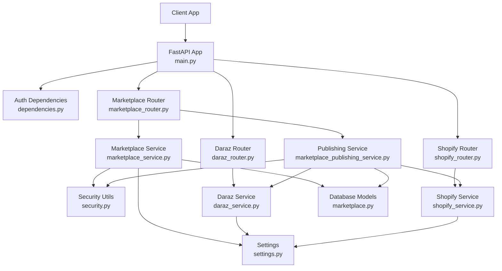
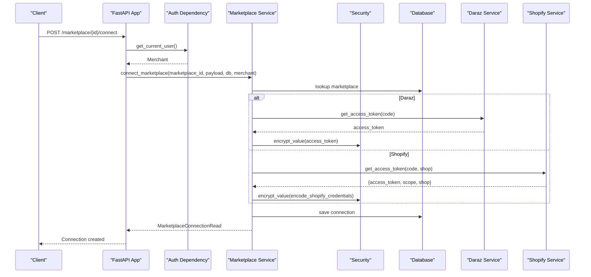
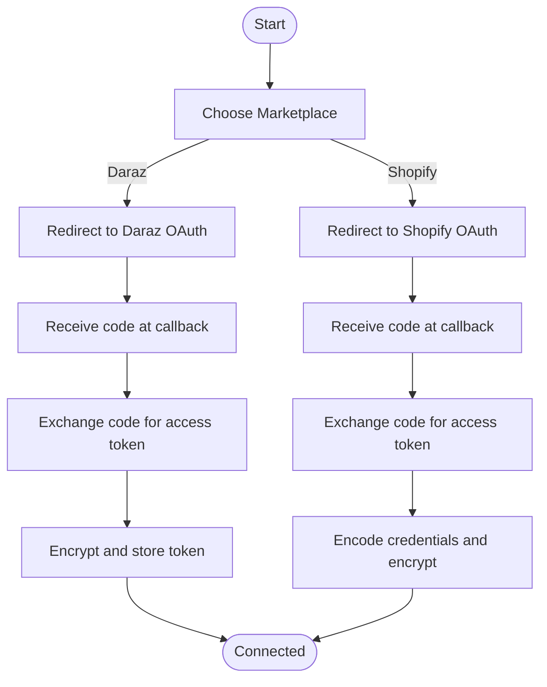
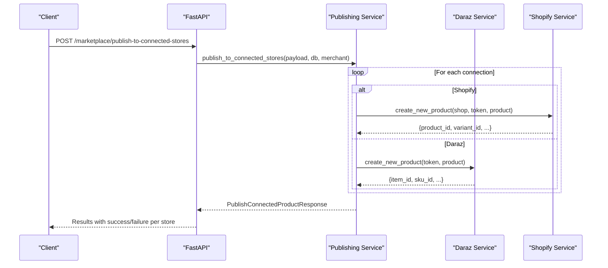
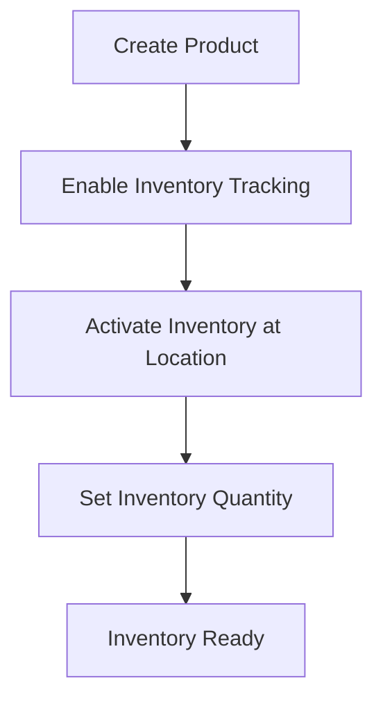
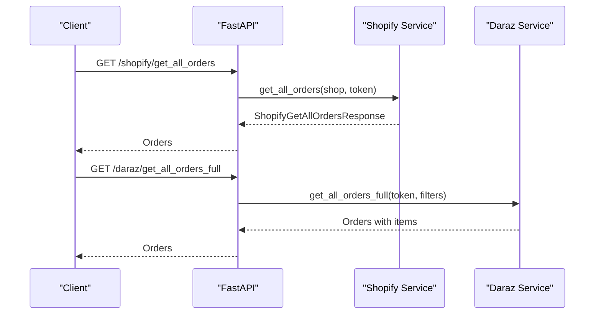
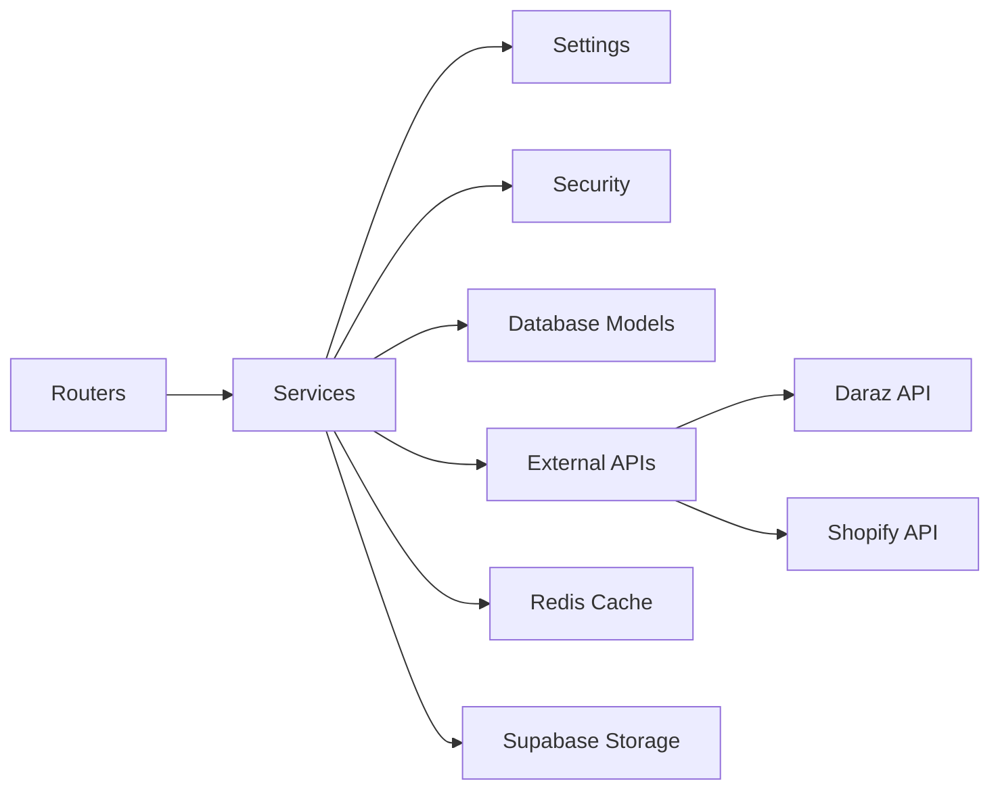

# Marketplace Integration

<cite>
**Referenced Files in This Document**
- [main.py](file://neurocom_backend/main.py)
- [marketplace_router.py](file://neurocom_backend/routers/marketplace_router.py)
- [daraz_router.py](file://neurocom_backend/routers/daraz_router.py)
- [shopify_router.py](file://neurocom_backend/routers/shopify_router.py)
- [marketplace_service.py](file://neurocom_backend/services/marketplace_service.py)
- [marketplace_publishing_service.py](file://neurocom_backend/services/marketplace_publishing_service.py)
- [daraz_service.py](file://neurocom_backend/services/daraz_service.py)
- [shopify_service.py](file://neurocom_backend/services/shopify_service.py)
- [marketplace.py](file://neurocom_backend/database/models/marketplace.py)
- [security.py](file://neurocom_backend/utils/security.py)
- [settings.py](file://neurocom_backend/utils/settings.py)
- [dependencies.py](file://neurocom_backend/dependencies.py)
</cite>

## Table of Contents
1. [Introduction](#introduction)
2. [Project Structure](#project-structure)
3. [Core Components](#core-components)
4. [Architecture Overview](#architecture-overview)
5. [Detailed Component Analysis](#detailed-component-analysis)
6. [Dependency Analysis](#dependency-analysis)
7. [Performance Considerations](#performance-considerations)
8. [Troubleshooting Guide](#troubleshooting-guide)
9. [Conclusion](#conclusion)

## Introduction
This document explains the multi-marketplace integration architecture for the Tijarah AI Backend, focusing on Daraz and Shopify. It covers OAuth flows, API authentication, rate limiting strategies, error handling, product synchronization workflows, inventory management, order processing, marketplace-specific configurations, webhook considerations, data transformation processes, troubleshooting, and performance optimization techniques for large-scale operations.

## Project Structure
The backend is a FastAPI application that exposes REST endpoints grouped by marketplace and shared marketplace capabilities:
- Routers define HTTP endpoints for each marketplace and shared marketplace operations.
- Services encapsulate marketplace-specific integrations (Daraz via Lazop client; Shopify via GraphQL).
- Database models represent marketplaces and merchant connections with encrypted credentials.
- Security utilities handle JWT-based user authentication and encryption of sensitive tokens.
- Settings centralize environment-driven configuration such as cache TTLs and API keys.

**Diagram sources**
- [main.py:1-90](file://neurocom_backend/main.py#L1-L90)
- [marketplace_router.py:1-118](file://neurocom_backend/routers/marketplace_router.py#L1-L118)
- [daraz_router.py:1-349](file://neurocom_backend/routers/daraz_router.py#L1-L349)
- [shopify_router.py:1-142](file://neurocom_backend/routers/shopify_router.py#L1-L142)
- [marketplace_service.py:1-302](file://neurocom_backend/services/marketplace_service.py#L1-L302)
- [marketplace_publishing_service.py:1-64](file://neurocom_backend/services/marketplace_publishing_service.py#L1-L64)
- [daraz_service.py:1-800](file://neurocom_backend/services/daraz_service.py#L1-L800)
- [shopify_service.py:1-701](file://neurocom_backend/services/shopify_service.py#L1-L701)
- [marketplace.py:1-105](file://neurocom_backend/database/models/marketplace.py#L1-L105)
- [security.py:1-44](file://neurocom_backend/utils/security.py#L1-L44)
- [settings.py:1-29](file://neurocom_backend/utils/settings.py#L1-L29)

**Section sources**
- [main.py:1-90](file://neurocom_backend/main.py#L1-L90)

## Core Components
- Authentication and Authorization:
  - JWT-based merchant authentication via dependencies.
  - Per-marketplace access token resolution from encrypted storage.
- Marketplace Connections:
  - Store encrypted access tokens per merchant and marketplace.
  - Support connecting via OAuth code or direct access token.
- Publishing:
  - Unified endpoint to publish products to all connected stores.
  - Handles both Daraz and Shopify publishing with error aggregation.
- Data Models:
  - Pydantic schemas for request/response validation across marketplaces.
  - SQLModel entities for marketplace definitions and connections.

**Section sources**
- [dependencies.py:1-79](file://neurocom_backend/dependencies.py#L1-L79)
- [marketplace_service.py:1-302](file://neurocom_backend/services/marketplace_service.py#L1-L302)
- [marketplace_publishing_service.py:1-64](file://neurocom_backend/services/marketplace_publishing_service.py#L1-L64)
- [marketplace.py:1-105](file://neurocom_backend/database/models/marketplace.py#L1-L105)

## Architecture Overview
The system provides a unified marketplace layer that abstracts differences between Daraz and Shopify:
- OAuth flows redirect users to marketplace authorization pages and exchange codes for access tokens.
- Access tokens are stored encrypted and resolved per request based on merchant context.
- Product and order APIs are exposed through marketplace routers, delegating to service layers.
- A centralized publishing service orchestrates creation across multiple connected stores.

**Diagram sources**
- [marketplace_router.py:105-118](file://neurocom_backend/routers/marketplace_router.py#L105-L118)
- [marketplace_service.py:178-280](file://neurocom_backend/services/marketplace_service.py#L178-L280)
- [daraz_service.py:40-46](file://neurocom_backend/services/daraz_service.py#L40-L46)
- [shopify_service.py:87-121](file://neurocom_backend/services/shopify_service.py#L87-L121)
- [security.py:38-43](file://neurocom_backend/utils/security.py#L38-L43)

## Detailed Component Analysis

### OAuth Flows and API Authentication
- Daraz OAuth:
  - Redirect to Daraz authorize URL using app key and callback URL.
  - Exchange authorization code for access token via Lazop client.
  - Access token is required per request header and validated against merchant’s active connection.
- Shopify OAuth:
  - Redirect to Shopify authorize URL with scopes and callback URL.
  - Exchange code for access token via Shopify OAuth endpoint.
  - Credentials (shop + access token) are encoded into JSON and encrypted before storage.
- Token Resolution:
  - For Daraz, the router resolves an encrypted token from the database and decrypts it per request.
  - For Shopify, the router decrypts credentials and decodes shop and access token per request.

**Diagram sources**
- [daraz_router.py:91-105](file://neurocom_backend/routers/daraz_router.py#L91-L105)
- [shopify_router.py:69-89](file://neurocom_backend/routers/shopify_router.py#L69-L89)
- [marketplace_service.py:178-233](file://neurocom_backend/services/marketplace_service.py#L178-L233)
- [security.py:38-43](file://neurocom_backend/utils/security.py#L38-L43)

**Section sources**
- [daraz_router.py:24-63](file://neurocom_backend/routers/daraz_router.py#L24-L63)
- [shopify_router.py:44-61](file://neurocom_backend/routers/shopify_router.py#L44-L61)
- [marketplace_service.py:178-233](file://neurocom_backend/services/marketplace_service.py#L178-L233)
- [security.py:1-44](file://neurocom_backend/utils/security.py#L1-L44)

### Product Synchronization Workflows
- Daraz:
  - Fetch products via Lazop client with caching to reduce API calls.
  - Category attributes are retrieved to determine required fields and sale properties.
  - Product creation normalizes payloads, ensures size chart images when required, and builds XML structures for attributes and SKUs.
  - Image migration supports whitelisted URLs or server-side upload with validation.
- Shopify:
  - Products fetched via GraphQL with pagination and flattened into consistent models.
  - Product creation uses GraphQL mutations to create products, set variants, enable inventory tracking, activate inventory, and publish to Online Store.
  - Categories and collections are queried via GraphQL taxonomy and collections endpoints.

**Diagram sources**
- [marketplace_publishing_service.py:34-64](file://neurocom_backend/services/marketplace_publishing_service.py#L34-L64)
- [shopify_service.py:329-469](file://neurocom_backend/services/shopify_service.py#L329-L469)
- [daraz_service.py:754-800](file://neurocom_backend/services/daraz_service.py#L754-L800)

**Section sources**
- [daraz_service.py:55-104](file://neurocom_backend/services/daraz_service.py#L55-L104)
- [shopify_service.py:168-230](file://neurocom_backend/services/shopify_service.py#L168-L230)
- [marketplace_publishing_service.py:1-64](file://neurocom_backend/services/marketplace_publishing_service.py#L1-L64)

### Inventory Management
- Shopify:
  - After product creation, inventory item tracking is enabled and activated at a location.
  - Inventory quantities are set via GraphQL mutation.
- Daraz:
  - SKU-level inventory fields are normalized and included in product creation payloads.
  - Multi-warehouse inventories are modeled in response schemas.

**Diagram sources**
- [shopify_service.py:402-459](file://neurocom_backend/services/shopify_service.py#L402-L459)
- [daraz_service.py:482-504](file://neurocom_backend/services/daraz_service.py#L482-L504)

**Section sources**
- [shopify_service.py:329-469](file://neurocom_backend/services/shopify_service.py#L329-L469)
- [daraz_service.py:482-504](file://neurocom_backend/services/daraz_service.py#L482-L504)

### Order Processing
- Shopify Orders:
  - Orders fetched via GraphQL with pagination, including line items, pricing, and customer info.
  - Responses are validated and cached for efficiency.
- Daraz Orders:
  - Multiple endpoints support fetching orders, order details, logistics, reverse orders, and insights.
  - Streaming SSE is supported for returns insights.

**Diagram sources**
- [shopify_service.py:472-575](file://neurocom_backend/services/shopify_service.py#L472-L575)
- [daraz_router.py:250-282](file://neurocom_backend/routers/daraz_router.py#L250-L282)

**Section sources**
- [shopify_service.py:472-575](file://neurocom_backend/services/shopify_service.py#L472-L575)
- [daraz_router.py:250-329](file://neurocom_backend/routers/daraz_router.py#L250-L329)

### Marketplace-Specific Configurations
- Environment Variables:
  - Shopify API key, secret, version, scopes, and cache TTL.
  - Daraz app key and secret for Lazop client.
  - Redis settings for caching.
  - Supabase settings for image storage.
- Scopes:
  - Shopify scopes include read/write products, orders, inventory, and publications.

**Section sources**
- [settings.py:1-29](file://neurocom_backend/utils/settings.py#L1-L29)
- [shopify_service.py:21-25](file://neurocom_backend/services/shopify_service.py#L21-L25)
- [daraz_service.py:35](file://neurocom_backend/services/daraz_service.py#L35)

### Webhook Handling
- The current codebase does not implement marketplace webhooks.
- Recommended approach:
  - Register webhooks for order updates, inventory changes, and review events on both platforms.
  - Validate webhook signatures and process events asynchronously.
  - Persist events and trigger downstream synchronization jobs.

[No sources needed since this section provides conceptual guidance]

### Data Transformation Processes
- HTML Cleaning:
  - Rich text descriptions are converted to plain text for consistency.
- Payload Normalization:
  - Move category-specific SKU fields into SKU rows for Daraz.
  - Promote product attributes where required by category rules.
- Validation:
  - Pydantic models enforce structure and types for requests and responses.

**Section sources**
- [daraz_model.py:88-115](file://neurocom_backend/models/daraz_model.py#L88-L115)
- [daraz_service.py:706-731](file://neurocom_backend/services/daraz_service.py#L706-L731)
- [shopify_service.py:134-165](file://neurocom_backend/services/shopify_service.py#L134-L165)

## Dependency Analysis
- Coupling:
  - Routers depend on services for business logic and database interactions.
  - Services depend on settings for configuration and security for encryption.
  - Publishing service coordinates multiple marketplace services and database models.
- External Integrations:
  - Daraz via Lazop client and HTTP requests.
  - Shopify via GraphQL API.
  - Redis for caching (via utility functions).
  - Supabase for image storage (via storage service).

**Diagram sources**
- [marketplace_router.py:1-118](file://neurocom_backend/routers/marketplace_router.py#L1-L118)
- [marketplace_service.py:1-302](file://neurocom_backend/services/marketplace_service.py#L1-L302)
- [daraz_service.py:1-800](file://neurocom_backend/services/daraz_service.py#L1-L800)
- [shopify_service.py:1-701](file://neurocom_backend/services/shopify_service.py#L1-L701)
- [settings.py:1-29](file://neurocom_backend/utils/settings.py#L1-L29)

**Section sources**
- [marketplace_router.py:1-118](file://neurocom_backend/routers/marketplace_router.py#L1-L118)
- [marketplace_service.py:1-302](file://neurocom_backend/services/marketplace_service.py#L1-L302)
- [daraz_service.py:1-800](file://neurocom_backend/services/daraz_service.py#L1-L800)
- [shopify_service.py:1-701](file://neurocom_backend/services/shopify_service.py#L1-L701)

## Performance Considerations
- Caching:
  - Use Redis-backed caching for product and order retrieval to reduce external API calls.
  - Configure appropriate TTLs per marketplace to balance freshness and load.
- Pagination:
  - Implement cursor-based pagination for large datasets (already used in Shopify GraphQL queries).
- Concurrency:
  - Use thread pools for parallel review fetching where safe.
- Image Handling:
  - Prefer whitelisted URL migration to avoid unnecessary downloads.
  - Validate image formats and sizes to prevent failures.
- Rate Limiting:
  - Respect marketplace API limits by implementing backoff and retry logic.
  - Monitor response headers for rate limit indicators and adjust polling intervals.

[No sources needed since this section provides general guidance]

## Troubleshooting Guide
- Authentication Errors:
  - Missing or invalid access tokens result in 401/400 responses.
  - Ensure encrypted tokens are correctly stored and decrypted.
- OAuth Failures:
  - Invalid authorization codes or misconfigured callbacks cause exchange failures.
  - Verify app keys, secrets, and redirect URIs.
- Product Creation Issues:
  - Category attribute mismatches lead to validation errors.
  - Size chart requirements must be satisfied for certain categories.
  - Image migration may fail due to unsupported URLs or format restrictions.
- Order Retrieval:
  - GraphQL errors indicate malformed queries or insufficient permissions.
  - Check scopes and ensure proper access tokens.
- Caching Problems:
  - Stale data can occur if cache keys are not properly scoped by merchant or shop.
  - Clear caches when credentials change or data becomes inconsistent.

**Section sources**
- [daraz_router.py:140-159](file://neurocom_backend/routers/daraz_router.py#L140-L159)
- [daraz_router.py:213-248](file://neurocom_backend/routers/daraz_router.py#L213-L248)
- [shopify_service.py:41-68](file://neurocom_backend/services/shopify_service.py#L41-L68)
- [marketplace_service.py:178-233](file://neurocom_backend/services/marketplace_service.py#L178-L233)

## Conclusion
The Tijarah AI Backend provides a robust, extensible marketplace integration layer supporting Daraz and Shopify. It standardizes OAuth flows, secures credentials, and offers unified endpoints for product and order operations. With careful attention to caching, pagination, concurrency, and error handling, the system can scale to support large-scale marketplace operations while maintaining reliability and performance.

[No sources needed since this section summarizes without analyzing specific files]