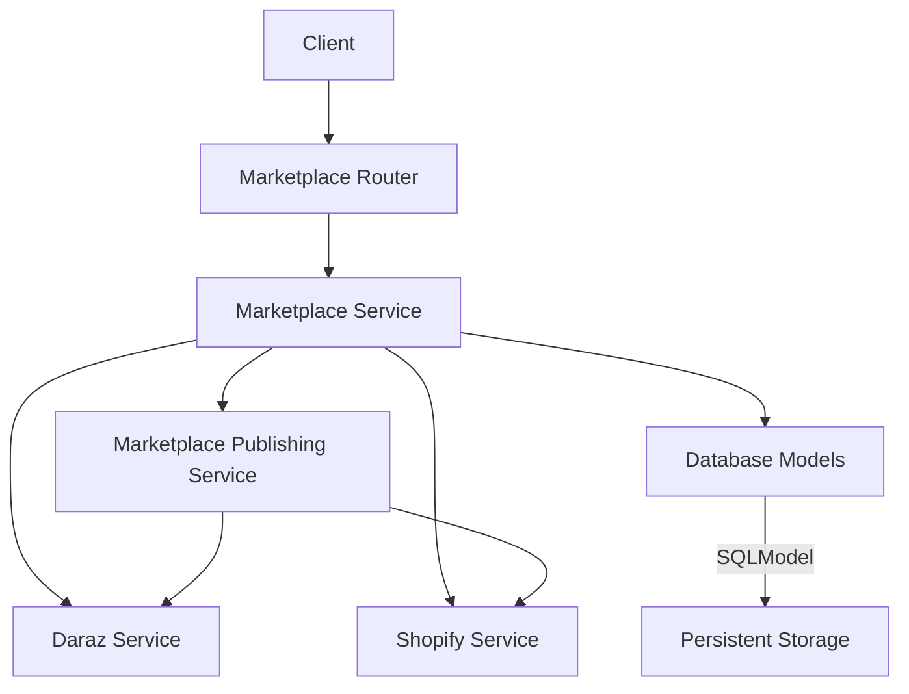
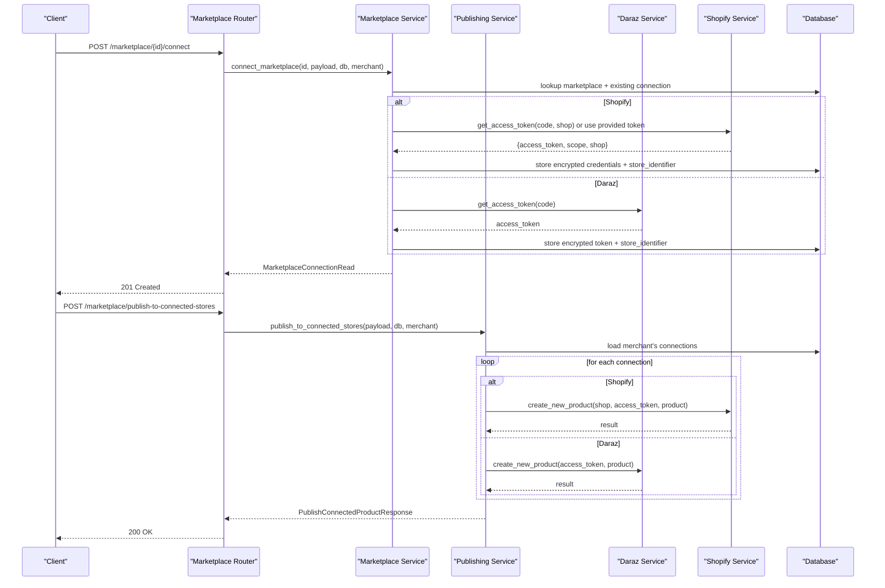
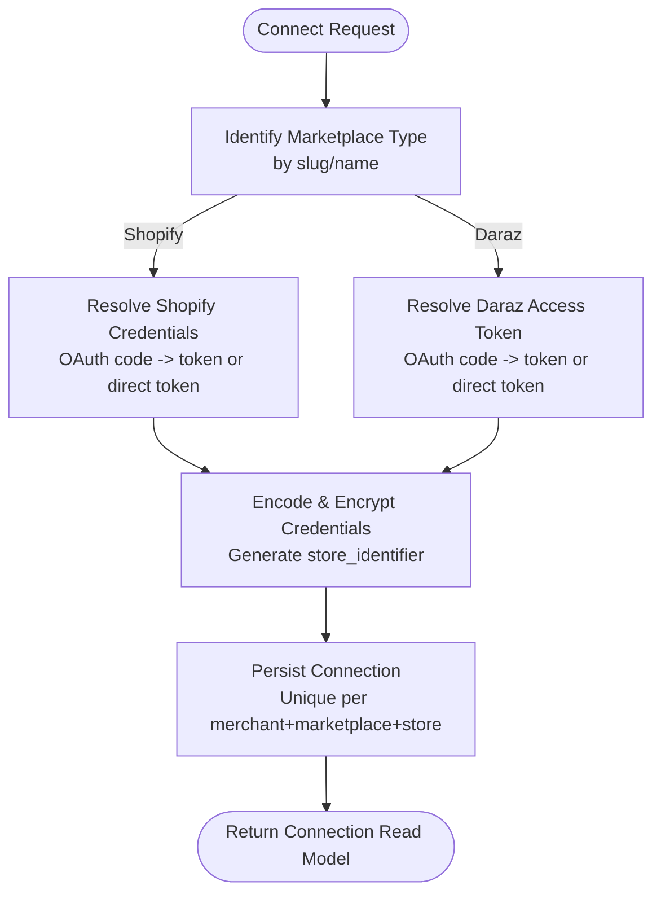
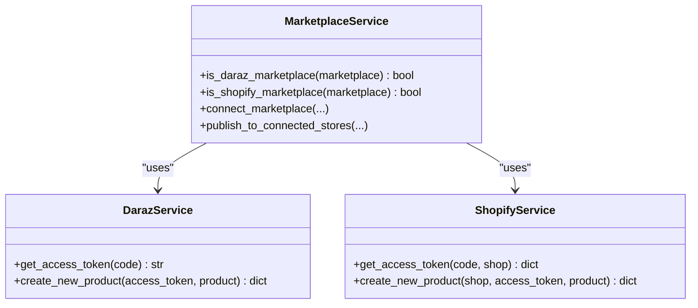
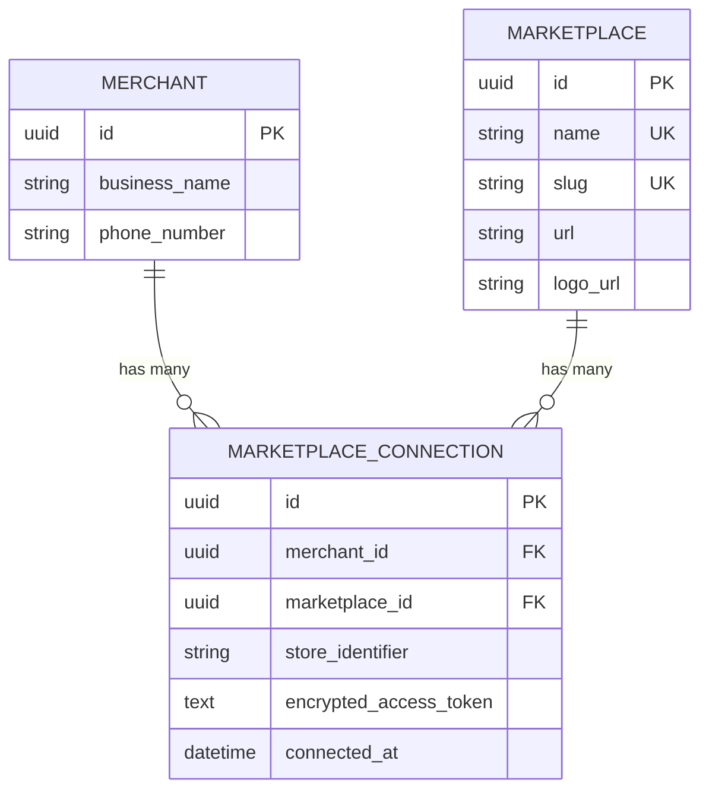
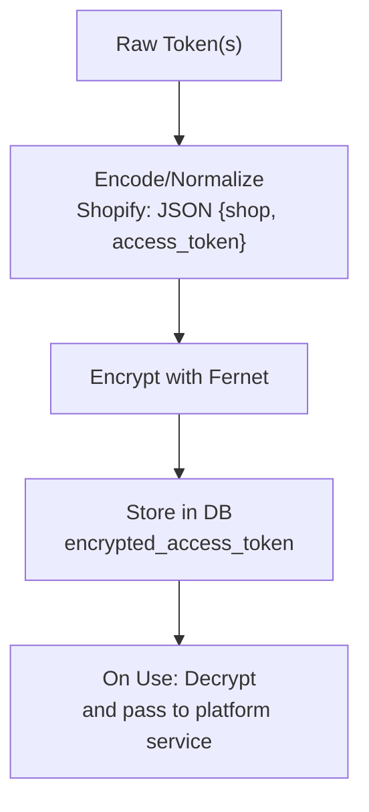
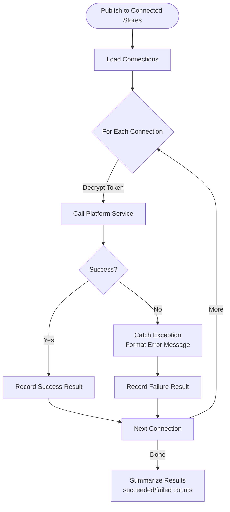
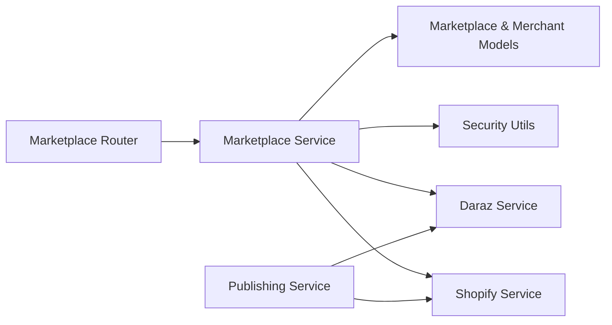

# Marketplace Service Layer

<cite>
**Referenced Files in This Document**
- [main.py](file://neurocom_backend/main.py)
- [marketplace_router.py](file://neurocom_backend/routers/marketplace_router.py)
- [marketplace_service.py](file://neurocom_backend/services/marketplace_service.py)
- [marketplace_publishing_service.py](file://neurocom_backend/services/marketplace_publishing_service.py)
- [daraz_service.py](file://neurocom_backend/services/daraz_service.py)
- [shopify_service.py](file://neurocom_backend/services/shopify_service.py)
- [marketplace.py](file://neurocom_backend/database/models/marketplace.py)
- [merchant.py](file://neurocom_backend/database/models/merchant.py)
- [security.py](file://neurocom_backend/utils/security.py)
- [settings.py](file://neurocom_backend/utils/settings.py)
</cite>

## Table of Contents
1. Introduction
2. Project Structure
3. Core Components
4. Architecture Overview
5. Detailed Component Analysis
6. Dependency Analysis
7. Performance Considerations
8. Troubleshooting Guide
9. Conclusion
10. Appendices

## Introduction
This document explains the marketplace service layer for the Tijarah AI Backend. It focuses on a unified interface that abstracts differences between Daraz and Shopify platforms, covering connection management (credential storage, status monitoring, reconnection handling), strategy-based multi-marketplace support, database schema for connections and merchants, error handling strategies, retry mechanisms, fallback procedures, configuration examples, and extension points for adding new marketplaces.

## Project Structure
The marketplace feature is implemented across routers, services, models, and utilities:
- Routers expose HTTP endpoints for marketplace CRUD, connection lifecycle, and publishing to connected stores.
- Services implement business logic: connecting/disconnecting marketplaces, resolving credentials per platform, and orchestrating product publishing.
- Models define persistent entities for marketplaces, merchant relationships, and connection state.
- Utilities provide encryption for sensitive tokens and centralized settings.

**Diagram sources**
- [marketplace_router.py:36-117](file://neurocom_backend/routers/marketplace_router.py#L36-L117)
- [marketplace_service.py:99-301](file://neurocom_backend/services/marketplace_service.py#L99-L301)
- [marketplace_publishing_service.py:34-63](file://neurocom_backend/services/marketplace_publishing_service.py#L34-L63)
- [marketplace.py:17-40](file://neurocom_backend/database/models/marketplace.py#L17-L40)

**Section sources**
- [main.py:78-89](file://neurocom_backend/main.py#L78-L89)
- [marketplace_router.py:31-117](file://neurocom_backend/routers/marketplace_router.py#L31-L117)

## Core Components
- Unified marketplace registry and connection management: create/list/update/delete marketplaces; connect/disconnect per merchant; list connections with store identifiers.
- Strategy-based dispatch by marketplace slug/name to resolve credentials and perform operations.
- Secure credential storage using encrypted tokens stored per connection.
- Publishing orchestration to all connected stores with per-connection success/failure reporting.

Key responsibilities:
- Credential resolution:
  - Shopify: normalize shop domain, exchange OAuth code or accept direct access token, encode into JSON, encrypt before storage.
  - Daraz: accept OAuth code or direct access token, derive a stable store identifier from token hash.
- Connection state tracking: unique constraint per merchant+marketplace+store_identifier; timestamped connection creation.
- Status indication: responses include whether a marketplace is connected for the current merchant.

**Section sources**
- [marketplace_service.py:31-46](file://neurocom_backend/services/marketplace_service.py#L31-L46)
- [marketplace_service.py:178-233](file://neurocom_backend/services/marketplace_service.py#L178-L233)
- [marketplace_service.py:236-301](file://neurocom_backend/services/marketplace_service.py#L236-L301)
- [marketplace.py:17-40](file://neurocom_backend/database/models/marketplace.py#L17-L40)
- [security.py:31-43](file://neurocom_backend/utils/security.py#L31-L43)

## Architecture Overview
The system uses a router-to-service pattern with a strategy approach to handle multiple marketplaces uniformly.

**Diagram sources**
- [marketplace_router.py:36-117](file://neurocom_backend/routers/marketplace_router.py#L36-L117)
- [marketplace_service.py:178-301](file://neurocom_backend/services/marketplace_service.py#L178-L301)
- [marketplace_publishing_service.py:34-63](file://neurocom_backend/services/marketplace_publishing_service.py#L34-L63)
- [shopify_service.py:87-121](file://neurocom_backend/services/shopify_service.py#L87-L121)
- [daraz_service.py:40-46](file://neurocom_backend/services/daraz_service.py#L40-L46)

## Detailed Component Analysis

### Unified Interface Design
- The router exposes a single connect endpoint per marketplace ID, abstracting platform-specific flows behind a common request shape.
- The service determines the marketplace type via slug/name checks and delegates credential resolution accordingly.
- Responses consistently include marketplace metadata and connection status flags.

**Diagram sources**
- [marketplace_service.py:36-46](file://neurocom_backend/services/marketplace_service.py#L36-L46)
- [marketplace_service.py:178-233](file://neurocom_backend/services/marketplace_service.py#L178-L233)
- [marketplace_service.py:236-301](file://neurocom_backend/services/marketplace_service.py#L236-L301)

**Section sources**
- [marketplace_router.py:105-117](file://neurocom_backend/routers/marketplace_router.py#L105-L117)
- [marketplace_service.py:99-161](file://neurocom_backend/services/marketplace_service.py#L99-L161)

### Strategy Pattern Implementation
- Strategy selection occurs in the marketplace service through helper functions that detect marketplace type based on slug/name.
- For each operation (connect, publish), the service branches to platform-specific logic without exposing platform details to callers.
- New marketplaces can be added by:
  - Adding a detection function (e.g., is_new_marketplace).
  - Implementing credential resolution and store identifier generation.
  - Wiring into connect flow and publishing flow.

**Diagram sources**
- [marketplace_service.py:36-46](file://neurocom_backend/services/marketplace_service.py#L36-L46)
- [marketplace_service.py:236-301](file://neurocom_backend/services/marketplace_service.py#L236-L301)
- [marketplace_publishing_service.py:34-63](file://neurocom_backend/services/marketplace_publishing_service.py#L34-L63)
- [daraz_service.py:40-46](file://neurocom_backend/services/daraz_service.py#L40-L46)
- [shopify_service.py:87-121](file://neurocom_backend/services/shopify_service.py#L87-L121)

**Section sources**
- [marketplace_service.py:36-46](file://neurocom_backend/services/marketplace_service.py#L36-L46)
- [marketplace_publishing_service.py:34-63](file://neurocom_backend/services/marketplace_publishing_service.py#L34-L63)

### Database Schema for Connections, Merchants, and State
- Marketplace entity defines supported platforms with name, slug, URL, and logo.
- MarketplaceConnection links a merchant to a marketplace instance with a store identifier and encrypted token.
- Unique constraint ensures one connection per merchant+marketplace+store_identifier.
- Merchant model relates to marketplace connections.

**Diagram sources**
- [marketplace.py:17-40](file://neurocom_backend/database/models/marketplace.py#L17-L40)
- [merchant.py:11-14](file://neurocom_backend/database/models/merchant.py#L11-L14)

**Section sources**
- [marketplace.py:17-40](file://neurocom_backend/database/models/marketplace.py#L17-L40)
- [merchant.py:11-14](file://neurocom_backend/database/models/merchant.py#L11-L14)

### Credential Storage and Security
- Tokens are encrypted at rest using Fernet symmetric encryption derived from a secret key.
- Shopify credentials are encoded as JSON containing shop domain and access token before encryption.
- Decryption occurs only when needed for API calls during publishing.

**Diagram sources**
- [security.py:31-43](file://neurocom_backend/utils/security.py#L31-L43)
- [shopify_service.py:691-700](file://neurocom_backend/services/shopify_service.py#L691-L700)
- [marketplace_service.py:178-233](file://neurocom_backend/services/marketplace_service.py#L178-L233)

**Section sources**
- [security.py:31-43](file://neurocom_backend/utils/security.py#L31-L43)
- [shopify_service.py:691-700](file://neurocom_backend/services/shopify_service.py#L691-L700)
- [marketplace_service.py:178-233](file://neurocom_backend/services/marketplace_service.py#L178-L233)

### Connection Status Monitoring
- Listing marketplaces includes an is_connected flag computed from the presence of a connection for the current merchant.
- Listing connections returns full connection metadata including store_identifier and timestamps.

**Section sources**
- [marketplace_service.py:117-137](file://neurocom_backend/services/marketplace_service.py#L117-L137)
- [marketplace_service.py:283-289](file://neurocom_backend/services/marketplace_service.py#L283-L289)

### Automatic Reconnection Handling
- There is no built-in automatic reconnection mechanism in the current implementation.
- Clients should monitor connection status and prompt users to reconnect if credentials expire or become invalid.
- On publish failures due to invalid tokens, the response indicates failure; clients can trigger reconnection flows.

[No sources needed since this section provides general guidance]

### Error Handling Strategies, Retry Mechanisms, and Fallback Procedures
- Platform services raise HTTPException for user-facing errors and network/API failures, which propagate up to the router.
- Publishing service wraps per-connection operations in try/except blocks to capture errors and return structured results with success flags and messages.
- Fallbacks:
  - Shopify: validates GraphQL responses and surfaces userErrors.
  - Daraz: inspects response detail/message fields to produce readable errors.
- No explicit retry loops are implemented at the service layer; retries should be handled by client-side logic or upstream middleware.

**Diagram sources**
- [marketplace_publishing_service.py:34-63](file://neurocom_backend/services/marketplace_publishing_service.py#L34-L63)

**Section sources**
- [marketplace_publishing_service.py:15-31](file://neurocom_backend/services/marketplace_publishing_service.py#L15-L31)
- [shopify_service.py:41-68](file://neurocom_backend/services/shopify_service.py#L41-L68)
- [daraz_service.py:391-446](file://neurocom_backend/services/daraz_service.py#L391-L446)

### Examples of Marketplace-Specific Configurations
- Shopify:
  - Requires API key and secret configured in environment variables.
  - Supports OAuth code exchange or direct access token input.
  - Normalizes shop domains to .myshopify.com format.
- Daraz:
  - Uses Lazop client initialized with app key and secret.
  - Accepts OAuth code or direct access token.
  - Derives store identifier from token hash for uniqueness.

Configuration keys used:
- Shopify: SHOPIFY_API_KEY, SHOPIFY_API_SECRET, SHOPIFY_CACHE_TTL_SECONDS, SHOPIFY_API_VERSION, SHOPIFY_SCOPES.
- Daraz: DARAZ_APP_KEY, DARAZ_APP_SECRET (via environment).
- Encryption: SECRET_KEY for Fernet.

**Section sources**
- [shopify_service.py:21-25](file://neurocom_backend/services/shopify_service.py#L21-L25)
- [shopify_service.py:87-121](file://neurocom_backend/services/shopify_service.py#L87-L121)
- [shopify_service.py:691-700](file://neurocom_backend/services/shopify_service.py#L691-L700)
- [daraz_service.py:35-46](file://neurocom_backend/services/daraz_service.py#L35-L46)
- [settings.py:13-25](file://neurocom_backend/utils/settings.py#L13-L25)

### Extension Points for Adding New Marketplaces
To integrate a new marketplace:
1. Add a detection function similar to is_daraz_marketplace/is_shopify_marketplace.
2. Implement credential resolution:
   - Accept OAuth code or direct token.
   - Normalize/store credentials securely.
   - Generate a stable store_identifier.
3. Wire into connect_marketplace to branch to the new platform logic.
4. Add publishing support in publish_to_connected_stores:
   - Decrypt credentials.
   - Call platform-specific create function.
   - Handle errors and map to standard result structure.
5. Update any relevant schemas if new fields are required.

[No sources needed since this section provides general guidance]

## Dependency Analysis
The marketplace layer depends on:
- FastAPI router for HTTP exposure.
- SQLModel for database interactions.
- Platform services for API integration.
- Security utilities for encryption.
- Settings for environment-driven configuration.

**Diagram sources**
- [marketplace_router.py:36-117](file://neurocom_backend/routers/marketplace_router.py#L36-L117)
- [marketplace_service.py:99-301](file://neurocom_backend/services/marketplace_service.py#L99-L301)
- [marketplace_publishing_service.py:34-63](file://neurocom_backend/services/marketplace_publishing_service.py#L34-L63)
- [security.py:31-43](file://neurocom_backend/utils/security.py#L31-L43)

**Section sources**
- [marketplace_router.py:36-117](file://neurocom_backend/routers/marketplace_router.py#L36-L117)
- [marketplace_service.py:99-301](file://neurocom_backend/services/marketplace_service.py#L99-L301)
- [marketplace_publishing_service.py:34-63](file://neurocom_backend/services/marketplace_publishing_service.py#L34-L63)

## Performance Considerations
- Caching:
  - Daraz products and reviews use Redis-backed caching with fingerprinting based on access tokens to reduce API calls.
  - Shopify products, orders, categories, and collections also leverage caching with configurable TTL.
- Concurrency:
  - Daraz review fetching uses thread pools to parallelize per-product review retrieval.
- Image handling:
  - Daraz image migration prefers whitelisted external URLs; falls back to server-side download/upload when necessary.
- Recommendations:
  - Monitor cache hit rates and adjust TTLs based on data volatility.
  - Rate-limit concurrent requests to platform APIs to avoid throttling.
  - Validate image sizes and formats early to minimize unnecessary uploads.

[No sources needed since this section provides general guidance]

## Troubleshooting Guide
Common issues and resolutions:
- Invalid or missing credentials:
  - Ensure OAuth code exchange succeeds and access tokens are returned.
  - Verify environment variables for platform API keys/secrets.
- Unauthorized or expired tokens:
  - Prompt users to reconnect; clear and re-store encrypted credentials.
- Shopify GraphQL errors:
  - Inspect userErrors in responses; correct product inputs or permissions.
- Daraz API errors:
  - Check response detail/message fields; validate product attributes and images.
- Connection not found:
  - Confirm merchant context and connection IDs; ensure proper authorization.

Operational tips:
- Use listing endpoints to verify connection status and store identifiers.
- Review publish results for per-connection success/failure details.
- Log and surface detailed error messages from platform services for debugging.

**Section sources**
- [marketplace_service.py:236-301](file://neurocom_backend/services/marketplace_service.py#L236-L301)
- [marketplace_publishing_service.py:15-31](file://neurocom_backend/services/marketplace_publishing_service.py#L15-L31)
- [shopify_service.py:41-68](file://neurocom_backend/services/shopify_service.py#L41-L68)
- [daraz_service.py:391-446](file://neurocom_backend/services/daraz_service.py#L391-L446)

## Conclusion
The marketplace service layer provides a robust, extensible foundation for integrating multiple e-commerce platforms behind a unified interface. It centralizes connection management, secures credentials, and orchestrates publishing with clear error reporting. The design supports easy addition of new marketplaces through strategy-based dispatch and well-defined extension points. Operational reliability is enhanced by caching, concurrency where appropriate, and comprehensive error handling.

[No sources needed since this section summarizes without analyzing specific files]

## Appendices

### API Endpoints Summary
- Create marketplace (admin): POST /marketplace/
- List marketplaces: GET /marketplace/
- Get marketplace: GET /marketplace/{marketplace_id}
- Update marketplace (admin): PUT /marketplace/{marketplace_id}
- Delete marketplace (admin): DELETE /marketplace/{marketplace_id}
- Connect marketplace: POST /marketplace/{marketplace_id}/connect
- List my connections: GET /marketplace/connections
- Disconnect connection: DELETE /marketplace/connections/{connection_id}
- Publish to connected stores: POST /marketplace/publish-to-connected-stores

**Section sources**
- [marketplace_router.py:36-117](file://neurocom_backend/routers/marketplace_router.py#L36-L117)