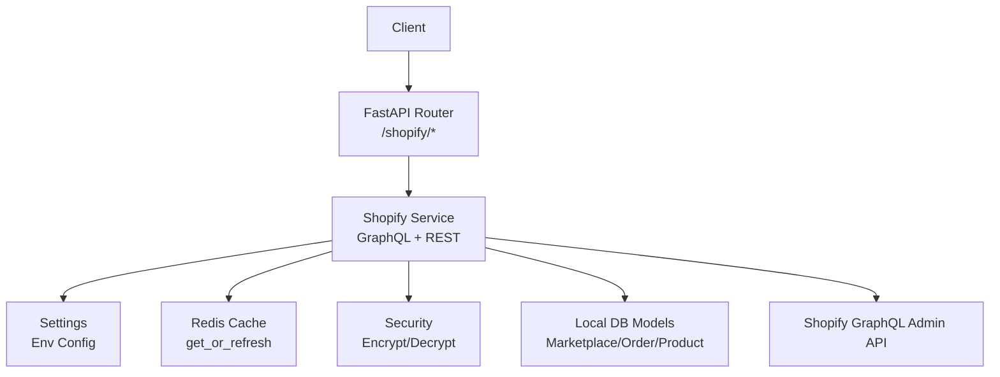
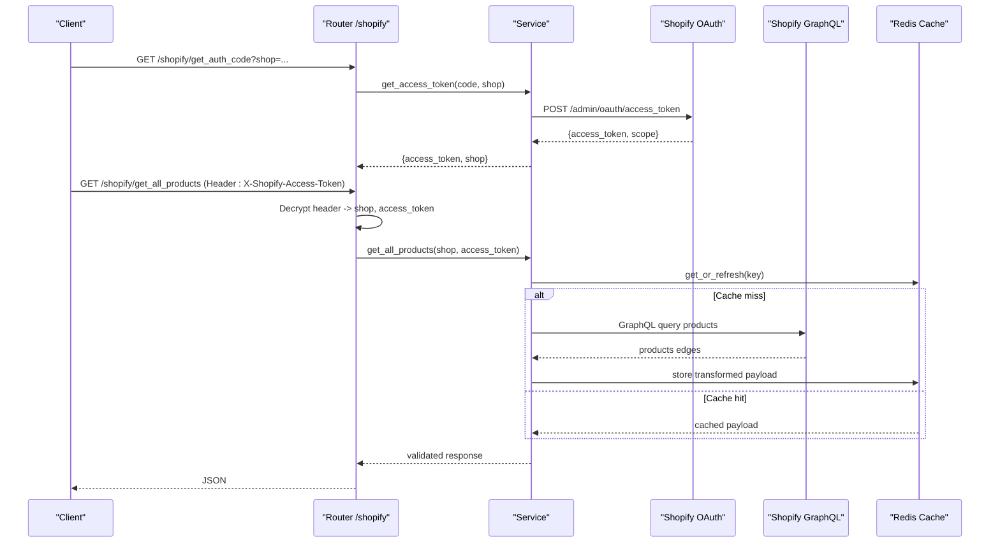
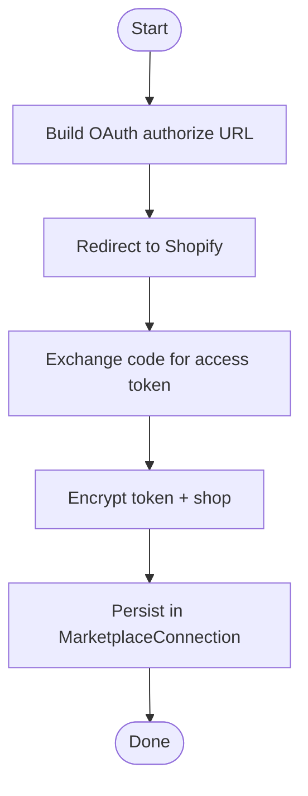
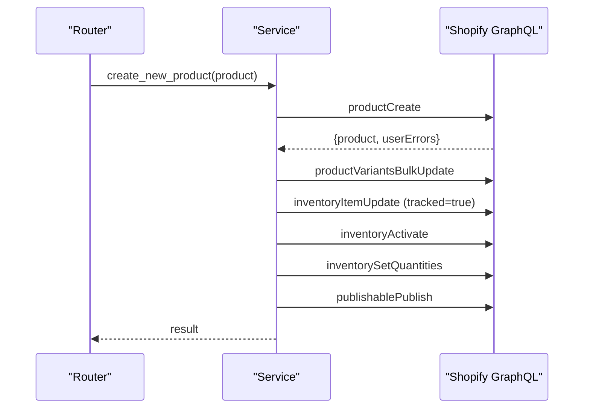
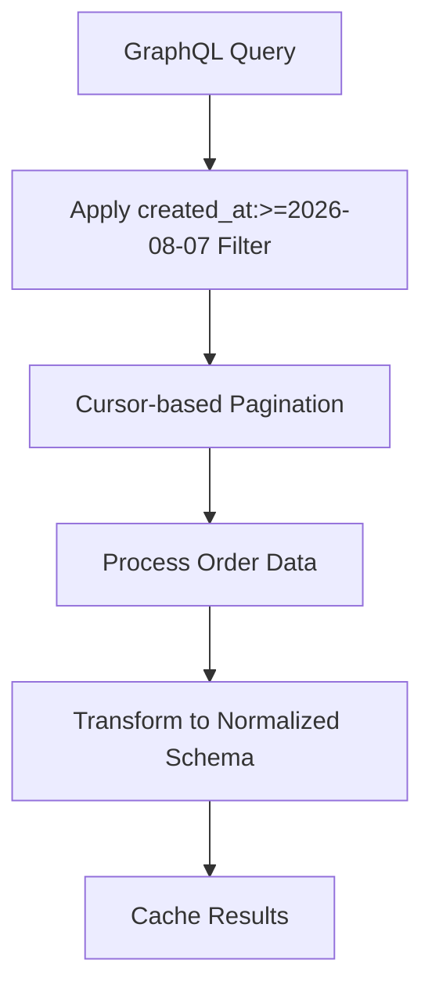
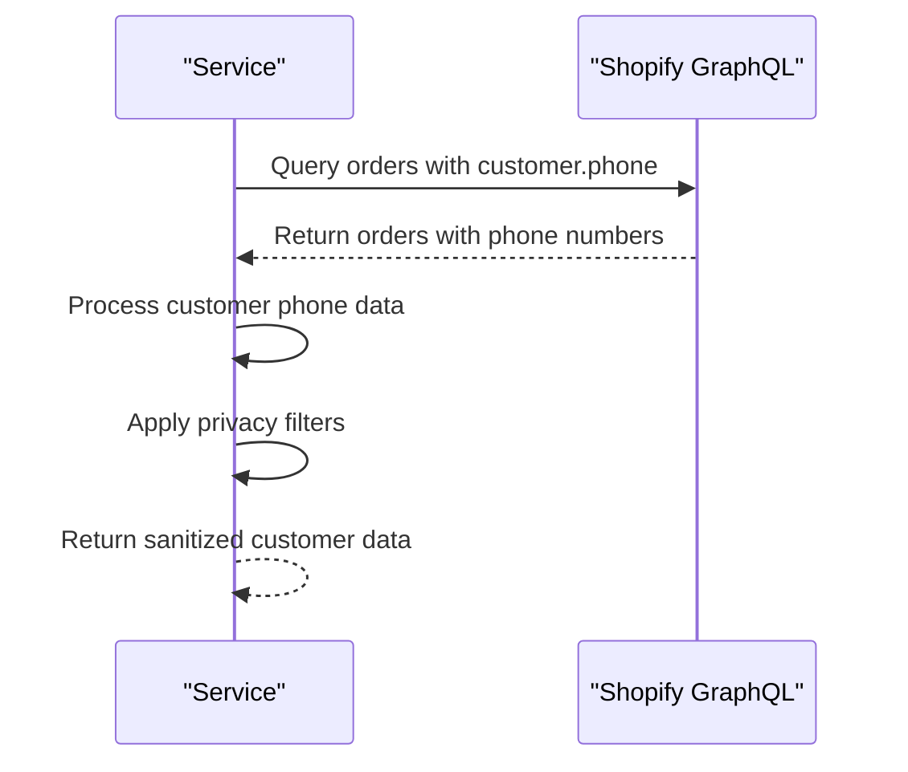
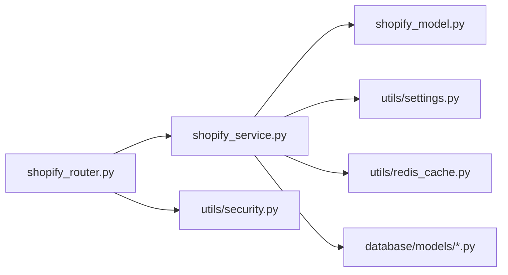

# Shopify Integration

<cite>
**Referenced Files in This Document**
- [main.py](file://neurocom_backend/main.py)
- [shopify_router.py](file://neurocom_backend/routers/shopify_router.py)
- [shopify_service.py](file://neurocom_backend/services/shopify_service.py)
- [shopify_model.py](file://neurocom_backend/models/shopify_model.py)
- [settings.py](file://neurocom_backend/utils/settings.py)
- [security.py](file://neurocom_backend/utils/security.py)
- [redis_cache.py](file://neurocom_backend/utils/redis_cache.py)
- [marketplace.py](file://neurocom_backend/database/models/marketplace.py)
- [order.py](file://neurocom_backend/database/models/order.py)
- [product.py](file://neurocom_backend/database/models/product.py)
</cite>

## Update Summary
**Changes Made**
- Enhanced order processing with date-based filtering (created_at:>=2026-08-07) for improved performance
- Switched customer data collection from email to phone numbers in Shopify GraphQL queries
- Updated customer model to reflect phone number field instead of email

## Table of Contents
1. Introduction
2. Project Structure
3. Core Components
4. Architecture Overview
5. Detailed Component Analysis
6. Dependency Analysis
7. Performance Considerations
8. Troubleshooting Guide
9. Conclusion
10. Appendices

## Introduction
This document explains the Shopify marketplace integration for the Tijarah AI Backend. It covers OAuth flow, store connection management, API authentication, GraphQL usage patterns for products, orders, inventory, and categories/collections, error handling strategies (including rate limiting and invalid requests), configuration for app setup and credentials, and data synchronization workflows between local database and Shopify stores.

## Project Structure
The Shopify integration is implemented as a FastAPI router with service-layer functions that call Shopify's GraphQL Admin API. Data models define request/response shapes, while caching and security utilities support performance and secure credential handling. The application mounts routers under authentication middleware and exposes endpoints for OAuth initiation, token exchange, and CRUD operations over Shopify resources.

**Diagram sources**
- [main.py:80-88](file://neurocom_backend/main.py#L80-L88)
- [shopify_router.py:36-142](file://neurocom_backend/routers/shopify_router.py#L36-L142)
- [shopify_service.py:21-68](file://neurocom_backend/services/shopify_service.py#L21-L68)
- [settings.py:23-25](file://neurocom_backend/utils/settings.py#L23-L25)
- [redis_cache.py:152-204](file://neurocom_backend/utils/redis_cache.py#L152-L204)
- [security.py:31-43](file://neurocom_backend/utils/security.py#L31-L43)

**Section sources**
- [main.py:80-88](file://neurocom_backend/main.py#L80-L88)
- [shopify_router.py:36-142](file://neurocom_backend/routers/shopify_router.py#L36-L142)

## Core Components
- Router layer: Exposes HTTP endpoints for OAuth initiation, token exchange, product/order/category/collection queries, and product creation.
- Service layer: Implements GraphQL queries/mutations, pagination, normalization, caching, and error mapping to HTTP status codes.
- Models: Pydantic schemas for typed responses and inputs.
- Utilities: Secure encryption/decryption for access tokens; Redis-backed cache-aside with background stale-while-revalidate.
- Database models: Marketplace connections and order/product entities for local persistence and synchronization.

**Section sources**
- [shopify_router.py:36-142](file://neurocom_backend/routers/shopify_router.py#L36-L142)
- [shopify_service.py:21-701](file://neurocom_backend/services/shopify_service.py#L21-L701)
- [shopify_model.py:1-133](file://neurocom_backend/models/shopify_model.py#L1-L133)
- [redis_cache.py:1-204](file://neurocom_backend/utils/redis_cache.py#L1-L204)
- [security.py:1-44](file://neurocom_backend/utils/security.py#L1-L44)
- [marketplace.py:17-105](file://neurocom_backend/database/models/marketplace.py#L17-L105)

## Architecture Overview
The integration uses an OAuth flow to obtain per-store access tokens, which are stored encrypted in the marketplace connection record. Subsequent API calls decrypt the token from the request header and use it to authenticate against Shopify's GraphQL Admin API. Responses are cached via Redis to reduce upstream load and improve latency.

**Diagram sources**
- [shopify_router.py:69-96](file://neurocom_backend/routers/shopify_router.py#L69-L96)
- [shopify_service.py:87-121](file://neurocom_backend/services/shopify_service.py#L87-L121)
- [shopify_service.py:168-230](file://neurocom_backend/services/shopify_service.py#L168-L230)
- [redis_cache.py:152-204](file://neurocom_backend/utils/redis_cache.py#L152-L204)

## Detailed Component Analysis

### OAuth Flow and Store Connection Management
- Authorization URL generation: Builds the Shopify OAuth authorize URL using configured client ID, scopes, and redirect URI.
- Token exchange: Exchanges authorization code for an access token scoped to the store.
- Credential storage: Access tokens are encrypted before being persisted in the marketplace connection model.
- Header-based auth: Endpoints accept an encrypted access token in a custom header, decrypted on each request to derive shop and token.

**Diagram sources**
- [shopify_router.py:69-89](file://neurocom_backend/routers/shopify_router.py#L69-L89)
- [shopify_service.py:87-121](file://neurocom_backend/services/shopify_service.py#L87-L121)
- [marketplace.py:26-41](file://neurocom_backend/database/models/marketplace.py#L26-L41)
- [security.py:38-43](file://neurocom_backend/utils/security.py#L38-L43)

**Section sources**
- [shopify_router.py:69-89](file://neurocom_backend/routers/shopify_router.py#L69-L89)
- [shopify_service.py:87-121](file://neurocom_backend/services/shopify_service.py#L87-L121)
- [marketplace.py:26-41](file://neurocom_backend/database/models/marketplace.py#L26-L41)
- [security.py:38-43](file://neurocom_backend/utils/security.py#L38-L43)

### API Authentication Methods
- Custom header: X-Shopify-Access-Token carries an encrypted JSON payload containing shop domain and access token.
- Decryption and validation: The router decrypts the header and decodes the payload into shop and token; invalid payloads raise appropriate HTTP errors.
- Scopes: Default scopes include read/write products, orders, inventory, and publications.

**Section sources**
- [shopify_router.py:44-61](file://neurocom_backend/routers/shopify_router.py#L44-L61)
- [shopify_service.py:21-25](file://neurocom_backend/services/shopify_service.py#L21-L25)
- [security.py:31-43](file://neurocom_backend/utils/security.py#L31-L43)

### GraphQL API Usage Patterns
- Products: Paginated fetch using cursor-based pagination; flattening to normalized schema; optional storefront URL derivation.
- Orders: Paginated fetch with line items and money objects; normalized totals and currency; **enhanced with date-based filtering for improved performance**.
- Categories/Collections: Taxonomy and collection enumeration with pagination.
- Product creation: Create product with media, set variant price, enable inventory tracking, activate inventory at location, set quantities, and publish to Online Store.

**Diagram sources**
- [shopify_service.py:329-469](file://neurocom_backend/services/shopify_service.py#L329-L469)

**Section sources**
- [shopify_service.py:168-230](file://neurocom_backend/services/shopify_service.py#L168-L230)
- [shopify_service.py:233-263](file://neurocom_backend/services/shopify_service.py#L233-L263)
- [shopify_service.py:472-575](file://neurocom_backend/services/shopify_service.py#L472-L575)
- [shopify_service.py:578-688](file://neurocom_backend/services/shopify_service.py#L578-L688)
- [shopify_service.py:329-469](file://neurocom_backend/services/shopify_service.py#L329-L469)

### Enhanced Order Processing with Date-Based Filtering
**Updated** The order processing functionality has been enhanced with date-based filtering to improve performance and reduce data transfer overhead.

- **Date Filtering**: Orders are now filtered using `created_at:>=2026-08-07` in the GraphQL query to retrieve only recent orders, significantly reducing the dataset size and improving query performance.
- **Performance Benefits**: This filtering approach minimizes API calls and reduces memory usage by focusing on relevant order data within a specific timeframe.
- **Pagination**: Combined with cursor-based pagination, this ensures efficient retrieval of large order datasets while maintaining optimal performance.

**Diagram sources**
- [shopify_service.py:477-512](file://neurocom_backend/services/shopify_service.py#L477-L512)

**Section sources**
- [shopify_service.py:472-575](file://neurocom_backend/services/shopify_service.py#L472-L575)

### Customer Data Collection Enhancement
**Updated** Customer data collection has been switched from email addresses to phone numbers for improved privacy and compliance.

- **Phone Number Focus**: The GraphQL query now requests `customer { id displayName phone }` instead of email fields, aligning with privacy best practices and regulatory requirements.
- **Data Privacy**: Phone numbers provide better contact information while maintaining customer privacy compared to email addresses.
- **Model Updates**: The customer model structure supports phone number fields for order processing and customer communication.

**Diagram sources**
- [shopify_service.py:493](file://neurocom_backend/services/shopify_service.py#L493)

**Section sources**
- [shopify_service.py:472-575](file://neurocom_backend/services/shopify_service.py#L472-L575)
- [shopify_model.py:85-89](file://neurocom_backend/models/shopify_model.py#L85-L89)

### Webhook Implementation for Real-Time Events
- Current implementation: No webhook endpoints or handlers are present in the codebase.
- Recommendation: Add dedicated endpoints to receive Shopify webhooks for order creation, fulfillment updates, and inventory changes. Validate HMAC signatures, parse payloads, and update local state accordingly. Integrate idempotency keys to handle duplicates.

[No sources needed since this section describes recommended future work not present in the code]

### Error Handling Strategies
- Network/API errors: Non-OK responses from Shopify raise HTTP 502 with details.
- GraphQL errors: Presence of top-level errors raises HTTP 400 with structured error payload.
- User errors: Mutations check for userErrors and surface them as HTTP 400.
- Invalid credentials: Missing or malformed encrypted headers produce HTTP 400/401.
- Rate limiting: Not explicitly handled; consider adding retry with exponential backoff and jitter when encountering 429 responses.

**Section sources**
- [shopify_service.py:41-68](file://neurocom_backend/services/shopify_service.py#L41-L68)
- [shopify_service.py:71-84](file://neurocom_backend/services/shopify_service.py#L71-L84)
- [shopify_router.py:44-61](file://neurocom_backend/routers/shopify_router.py#L44-L61)

### Configuration Examples
- Environment variables:
  - SHOPIFY_API_KEY, SHOPIFY_API_SECRET: App credentials for OAuth token exchange.
  - SHOPIFY_SCOPES: Comma-separated permissions for the app.
  - SHOPIFY_CACHE_TTL_SECONDS: Cache TTL for fetched data.
  - REDIS_HOST, REDIS_PORT, REDIS_USERNAME, REDIS_PASSWORD, REDIS_SSL: Redis connection settings.
  - SECRET_KEY: Used for JWT and symmetric encryption of tokens.
  - ALLOWED_ORIGINS: CORS origins for frontend.
- App setup:
  - Configure callback URL to match SHOPIFY_APP_CALLBACK_URL used in OAuth redirect.
  - Ensure scopes cover required resources (products, orders, inventory, publications).

**Section sources**
- [settings.py:11-29](file://neurocom_backend/utils/settings.py#L11-L29)
- [shopify_router.py:77-84](file://neurocom_backend/routers/shopify_router.py#L77-L84)
- [shopify_service.py:21-25](file://neurocom_backend/services/shopify_service.py#L21-L25)

### Data Synchronization Workflows
- Local persistence:
  - MarketplaceConnection stores encrypted access tokens and links merchants to Shopify stores.
  - Order and Product models represent local entities for analytics and internal use.
- Sync strategy:
  - Use Redis cache-aside to serve recent data quickly while background refreshes keep data fresh.
  - Transform raw Shopify payloads into typed models for consistency.
  - For writes (e.g., creating products), perform mutations and validate userErrors before committing results.
- Conflict resolution:
  - Prefer server-of-record semantics: Shopify remains authoritative for product/inventory state.
  - On conflicts, reconcile by timestamp/version fields where available and log discrepancies.
- Transformation processes:
  - Flatten nested GraphQL structures into simplified DTOs.
  - Normalize shop domains and compute storefront URLs.

**Section sources**
- [redis_cache.py:1-204](file://neurocom_backend/utils/redis_cache.py#L1-L204)
- [shopify_service.py:134-165](file://neurocom_backend/services/shopify_service.py#L134-L165)
- [shopify_service.py:215-230](file://neurocom_backend/services/shopify_service.py#L215-L230)
- [marketplace.py:26-41](file://neurocom_backend/database/models/marketplace.py#L26-L41)
- [order.py:21-39](file://neurocom_backend/database/models/order.py#L21-L39)
- [product.py:13-21](file://neurocom_backend/database/models/product.py#L13-L21)

## Dependency Analysis
The following diagram shows key dependencies among components involved in Shopify integration.

**Diagram sources**
- [shopify_router.py:1-33](file://neurocom_backend/routers/shopify_router.py#L1-L33)
- [shopify_service.py:1-20](file://neurocom_backend/services/shopify_service.py#L1-L20)
- [shopify_model.py:1-133](file://neurocom_backend/models/shopify_model.py#L1-L133)
- [settings.py:1-29](file://neurocom_backend/utils/settings.py#L1-L29)
- [redis_cache.py:1-204](file://neurocom_backend/utils/redis_cache.py#L1-L204)
- [security.py:1-44](file://neurocom_backend/utils/security.py#L1-L44)
- [marketplace.py:17-105](file://neurocom_backend/database/models/marketplace.py#L17-L105)

**Section sources**
- [shopify_router.py:1-33](file://neurocom_backend/routers/shopify_router.py#L1-L33)
- [shopify_service.py:1-20](file://neurocom_backend/services/shopify_service.py#L1-L20)

## Performance Considerations
- Caching: Redis-backed cache-aside reduces Shopify API calls and provides fast reads; background stale-while-revalidate keeps data fresh without blocking requests.
- Pagination: Cursor-based pagination prevents large payloads and improves throughput.
- Timeouts: Requests to Shopify include timeouts to avoid hanging connections.
- **Enhanced Performance**: Date-based filtering in order queries (`created_at:>=2026-08-07`) significantly reduces data transfer and processing time.
- Recommendations:
  - Implement retry with exponential backoff for transient errors and rate limits (HTTP 429).
  - Batch operations where possible (e.g., bulk variant updates already used).
  - Monitor Redis latency and adjust TTLs based on data volatility.
  - Leverage date filtering for large datasets to optimize query performance.

[No sources needed since this section provides general guidance]

## Troubleshooting Guide
- Missing or invalid encrypted header: Ensure the X-Shopify-Access-Token header contains a valid encrypted payload; decryption failures return HTTP 400/401.
- OAuth issues: Verify SHOPIFY_API_KEY and SHOPIFY_API_SECRET are set; ensure callback URL matches the app configuration.
- GraphQL errors: Inspect the returned userErrors to identify field-specific issues during mutations.
- Rate limiting: If encountering frequent 429 errors, add retries with backoff and reduce request frequency or increase cache TTL.
- Redis connectivity: Check REDIS_* settings; ensure the cache service is reachable and healthy.
- **Order Query Performance**: If experiencing slow order queries, verify the date filter is properly configured and consider adjusting the date range based on business requirements.

**Section sources**
- [shopify_router.py:44-61](file://neurocom_backend/routers/shopify_router.py#L44-L61)
- [shopify_service.py:87-121](file://neurocom_backend/services/shopify_service.py#L87-L121)
- [shopify_service.py:71-84](file://neurocom_backend/services/shopify_service.py#L71-L84)
- [redis_cache.py:56-71](file://neurocom_backend/utils/redis_cache.py#L56-L71)

## Conclusion
The Tijarah AI Backend integrates with Shopify through a robust OAuth flow, secure credential handling, and efficient GraphQL-based data access with caching. Recent enhancements include optimized order processing with date-based filtering for improved performance and enhanced customer data collection focusing on phone numbers for better privacy compliance. While webhooks are not yet implemented, the existing architecture supports extending real-time event handling. Proper configuration, error handling, and performance tuning will ensure reliable synchronization between Shopify and local systems.

[No sources needed since this section summarizes without analyzing specific files]

## Appendices

### API Endpoints Summary
- OAuth initiation: GET /shopify/get_auth_code?shop=<domain>
- Token exchange: GET /shopify/get_access_token?code=<code>&shop=<domain>
- Products: GET /shopify/get_all_products, GET /shopify/get_product_by_id?product_id=<id>, POST /shopify/create_new_product
- Orders: GET /shopify/get_all_orders (now includes date-filtered orders for improved performance)
- Categories: GET /shopify/get_all_categories, GET /shopify/get_subcategories/{category_id}
- Collections: GET /shopify/get_all_collections

Authentication: Include X-Shopify-Access-Token header with encrypted JSON containing shop and access token.

**Section sources**
- [shopify_router.py:69-142](file://neurocom_backend/routers/shopify_router.py#L69-L142)

### Enhanced Order Query Details
The order processing functionality now includes sophisticated filtering capabilities:

- **Date Range Filtering**: Orders are filtered using `created_at:>=2026-08-07` to focus on recent transactions
- **Performance Optimization**: Reduced dataset size leads to faster query execution and lower memory usage
- **Customer Data**: Phone numbers are prioritized over email addresses for privacy compliance
- **Pagination Support**: Efficient cursor-based pagination handles large order volumes

**Section sources**
- [shopify_service.py:477-512](file://neurocom_backend/services/shopify_service.py#L477-L512)
- [shopify_service.py:493](file://neurocom_backend/services/shopify_service.py#L493)