# Order Processing

<cite>
**Referenced Files in This Document**
- [main.py](file://neurocom_backend/main.py)
- [order_router.py](file://neurocom_backend/routers/order_router.py)
- [order_service.py](file://neurocom_backend/services/order_service.py)
- [order.py](file://neurocom_backend/database/models/order.py)
- [user.py](file://neurocom_backend/database/models/user.py)
- [product.py](file://neurocom_backend/database/models/product.py)
- [connection.py](file://neurocom_backend/database/connection.py)
- [shopify_service.py](file://neurocom_backend/services/shopify_service.py)
- [marketplace_service.py](file://neurocom_backend/services/marketplace_service.py)
- [marketplace_router.py](file://neurocom_backend/routers/marketplace_router.py)
- [redis_cache.py](file://neurocom_backend/utils/redis_cache.py)
- [settings.py](file://neurocom_backend/utils/settings.py)
- [daraz_service.py](file://neurocom_backend/services/daraz_service.py)
- [insights.service.py](file://neurocom_backend/services/insights.service.py)
</cite>

## Table of Contents
1. Introduction
2. Project Structure
3. Core Components
4. Architecture Overview
5. Detailed Component Analysis
6. Dependency Analysis
7. Performance Considerations
8. Troubleshooting Guide
9. Conclusion
10. Appendices

## Introduction
This document explains the order processing system in the Tijarah AI Backend. It covers the end-to-end lifecycle from order creation to fulfillment, status management, payment and shipping coordination with marketplaces (Shopify and Daraz), return processing workflows, analytics, error handling, retry strategies, data consistency, tracking, notifications, and reporting. The goal is to provide a clear, progressive understanding for both technical and non-technical readers.

## Project Structure
The order processing functionality spans routers, services, database models, marketplace integrations, caching utilities, and configuration:
- API layer exposes endpoints for order CRUD operations.
- Service layer encapsulates business logic for order persistence and updates.
- Database models define orders, products, customers, and relationships.
- Marketplace integrations fetch orders and manage connections for Shopify and Daraz.
- Caching and settings support performance and environment configuration.
- Insights service provides analytics on orders and returns.

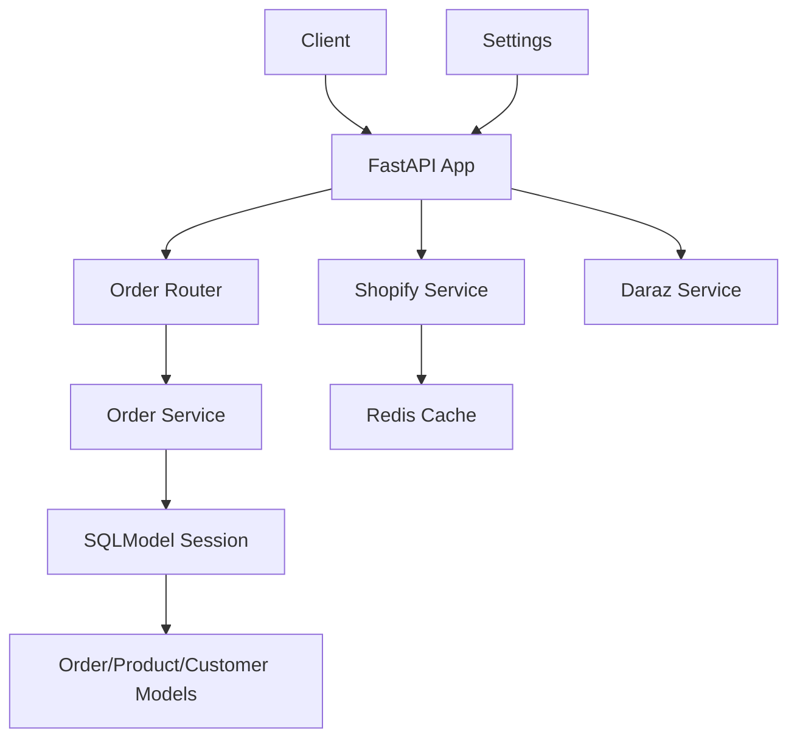

**Diagram sources**
- [main.py:16-37](file://neurocom_backend/main.py#L16-L37)
- [order_router.py:10-39](file://neurocom_backend/routers/order_router.py#L10-L39)
- [order_service.py:9-46](file://neurocom_backend/services/order_service.py#L9-L46)
- [order.py:11-39](file://neurocom_backend/database/models/order.py#L11-L39)
- [shopify_service.py:41-68](file://neurocom_backend/services/shopify_service.py#L41-L68)
- [redis_cache.py:177-203](file://neurocom_backend/utils/redis_cache.py#L177-L203)
- [settings.py:11-29](file://neurocom_backend/utils/settings.py#L11-L29)

**Section sources**
- [main.py:16-37](file://neurocom_backend/main.py#L16-L37)
- [order_router.py:10-39](file://neurocom_backend/routers/order_router.py#L10-L39)
- [order_service.py:9-46](file://neurocom_backend/services/order_service.py#L9-L46)
- [order.py:11-39](file://neurocom_backend/database/models/order.py#L11-L39)
- [user.py:21-26](file://neurocom_backend/database/models/user.py#L21-L26)
- [product.py:13-21](file://neurocom_backend/database/models/product.py#L13-L21)
- [connection.py:9-27](file://neurocom_backend/database/connection.py#L9-L27)
- [shopify_service.py:41-68](file://neurocom_backend/services/shopify_service.py#L41-L68)
- [marketplace_service.py:236-280](file://neurocom_backend/services/marketplace_service.py#L236-L280)
- [redis_cache.py:177-203](file://neurocom_backend/utils/redis_cache.py#L177-L203)
- [settings.py:11-29](file://neurocom_backend/utils/settings.py#L11-L29)

## Core Components
- Order API endpoints: Create, update, retrieve by ID or customer, delete.
- Order service: Persist new orders, update existing orders, query by ID/customer, delete by ID.
- Data models: Order statuses, Order and ProductOrder entities, Customer relationship.
- Marketplace integration: Connect merchants to Shopify/Daraz; fetch orders via GraphQL; cache responses.
- Analytics: Operational metrics including return/cancellation rates and SLA alerts.

Key responsibilities:
- Routers expose HTTP endpoints and delegate to services.
- Services enforce business rules and interact with the database.
- Models define schema and relationships.
- Integrations synchronize orders and handle platform-specific flows.
- Caching reduces latency for marketplace queries.
- Settings centralize environment variables and feature flags.

**Section sources**
- [order_router.py:16-39](file://neurocom_backend/routers/order_router.py#L16-L39)
- [order_service.py:9-46](file://neurocom_backend/services/order_service.py#L9-L46)
- [order.py:11-39](file://neurocom_backend/database/models/order.py#L11-L39)
- [shopify_service.py:472-575](file://neurocom_backend/services/shopify_service.py#L472-L575)
- [marketplace_service.py:236-280](file://neurocom_backend/services/marketplace_service.py#L236-L280)
- [insights.service.py:124-182](file://neurocom_backend/services/insights.service.py#L124-L182)

## Architecture Overview
The system follows a layered architecture:
- Presentation layer: FastAPI routers for REST endpoints.
- Business layer: Services orchestrating order operations and marketplace integrations.
- Data layer: SQLModel models and sessions for persistence.
- Integration layer: Shopify and Daraz services for synchronization and fulfillment.
- Cross-cutting: Caching, settings, and middleware.

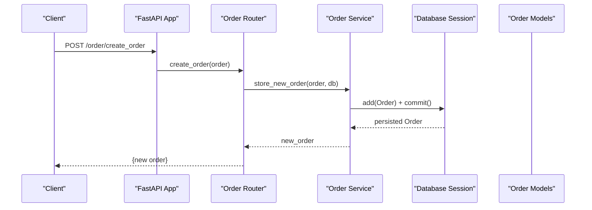

**Diagram sources**
- [main.py:16-37](file://neurocom_backend/main.py#L16-L37)
- [order_router.py:16-19](file://neurocom_backend/routers/order_router.py#L16-L19)
- [order_service.py:9-14](file://neurocom_backend/services/order_service.py#L9-L14)
- [order.py:21-31](file://neurocom_backend/database/models/order.py#L21-L31)
- [connection.py:25-27](file://neurocom_backend/database/connection.py#L25-L27)

## Detailed Component Analysis

### Order Lifecycle Management
- Creation: Endpoint accepts an Order payload, service persists it with default PENDING status.
- Update: Service locates order by ID, updates fields, timestamps, and commits changes.
- Retrieval: By ID or by customer ID; returns order(s) or raises not found.
- Deletion: Removes order by ID if exists; otherwise raises not found.

Status transitions are modeled via an enum supporting pending, processing, shipped, delivered, cancelled, return_requested, returned, refunded.

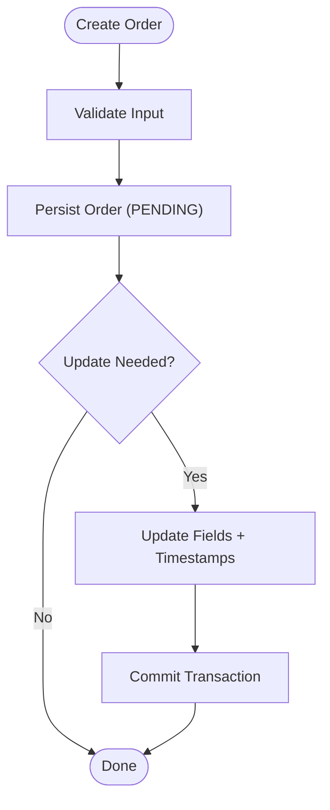

**Diagram sources**
- [order_router.py:16-24](file://neurocom_backend/routers/order_router.py#L16-L24)
- [order_service.py:9-26](file://neurocom_backend/services/order_service.py#L9-L26)
- [order.py:11-26](file://neurocom_backend/database/models/order.py#L11-L26)

**Section sources**
- [order_router.py:16-39](file://neurocom_backend/routers/order_router.py#L16-L39)
- [order_service.py:9-46](file://neurocom_backend/services/order_service.py#L9-L46)
- [order.py:11-39](file://neurocom_backend/database/models/order.py#L11-L39)

### Payment Processing Coordination
- Shopify orders include financial status and total amount; these are fetched via GraphQL and cached.
- Daraz payout statements can be retrieved to reconcile payments.
- Marketplaces maintain merchant connections with encrypted tokens for secure access.

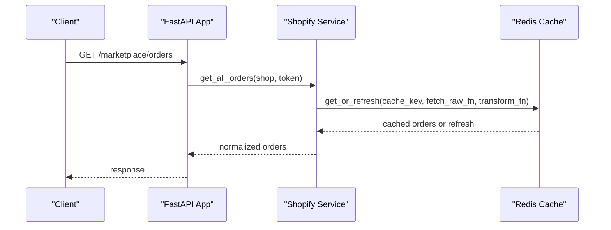

**Diagram sources**
- [shopify_service.py:472-575](file://neurocom_backend/services/shopify_service.py#L472-L575)
- [redis_cache.py:177-203](file://neurocom_backend/utils/redis_cache.py#L177-L203)
- [marketplace_service.py:236-280](file://neurocom_backend/services/marketplace_service.py#L236-L280)

**Section sources**
- [shopify_service.py:41-68](file://neurocom_backend/services/shopify_service.py#L41-L68)
- [shopify_service.py:472-575](file://neurocom_backend/services/shopify_service.py#L472-L575)
- [daraz_service.py:1544-1550](file://neurocom_backend/services/daraz_service.py#L1544-L1550)
- [marketplace_service.py:236-280](file://neurocom_backend/services/marketplace_service.py#L236-L280)

### Shipping Coordination and Tracking
- Shopify inventory items can be enabled for tracking and activated at locations; quantities can be set.
- Reverse orders (returns) include tracking numbers and statuses for logistics coordination.

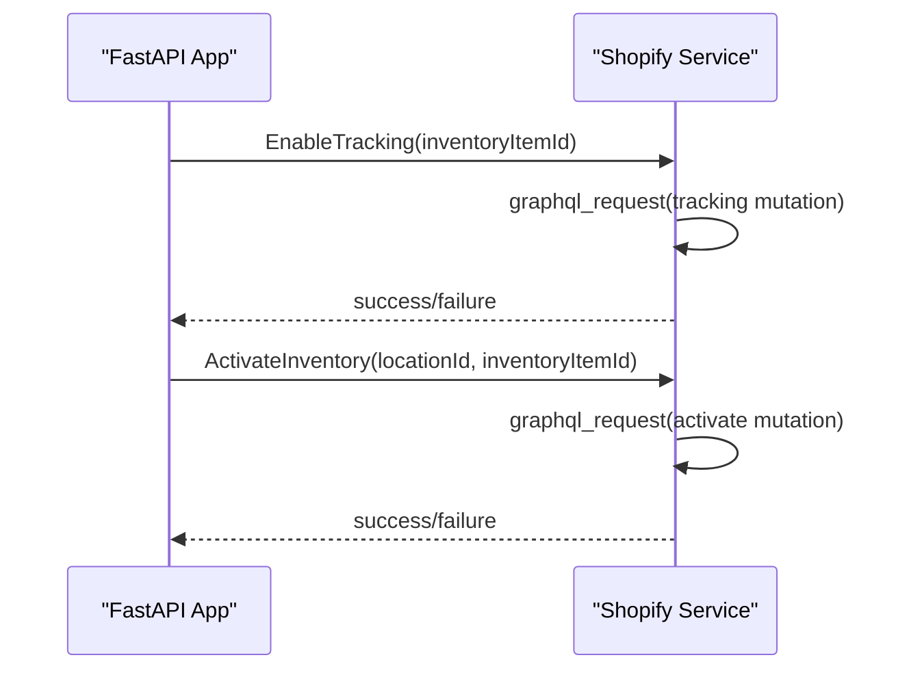

**Diagram sources**
- [shopify_service.py:399-440](file://neurocom_backend/services/shopify_service.py#L399-L440)
- [shopify_service.py:431-460](file://neurocom_backend/services/shopify_service.py#L431-L460)

**Section sources**
- [shopify_service.py:399-460](file://neurocom_backend/services/shopify_service.py#L399-L460)
- [daraz_service.py:1218-1244](file://neurocom_backend/services/daraz_service.py#L1218-L1244)

### Return Processing Workflows
- Reverse orders are fetched and enriched with detailed line item information.
- Statuses such as REQUEST_REJECT, RETURN_RTM_DELIVERED, REFUND_SUCCESS indicate progression.
- History retrieval supports auditing and troubleshooting.

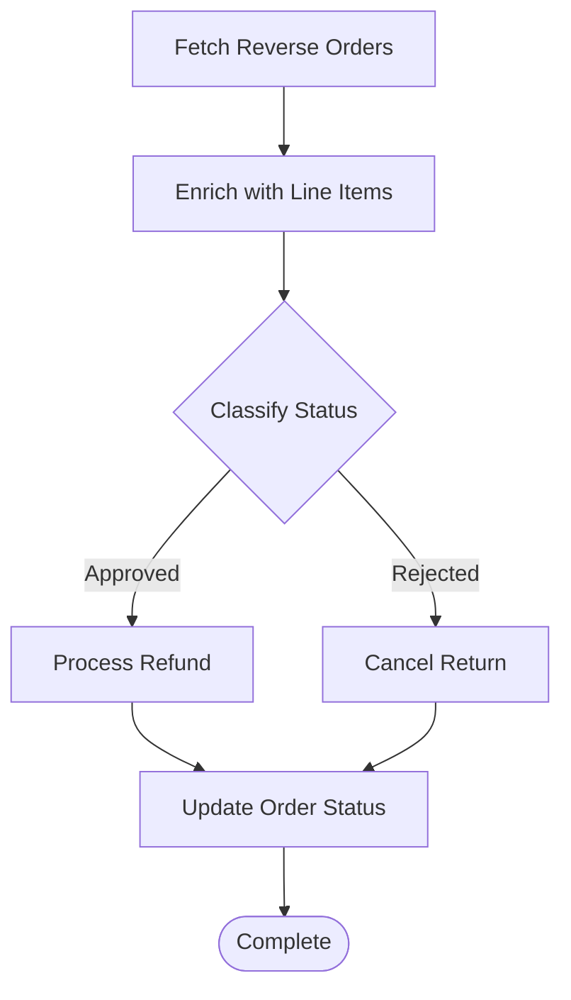

**Diagram sources**
- [daraz_service.py:1218-1244](file://neurocom_backend/services/daraz_service.py#L1218-L1244)
- [order.py:11-19](file://neurocom_backend/database/models/order.py#L11-L19)

**Section sources**
- [daraz_service.py:1218-1244](file://neurocom_backend/services/daraz_service.py#L1218-L1244)
- [order.py:11-19](file://neurocom_backend/database/models/order.py#L11-L19)

### Order Synchronization with Marketplaces
- Merchants connect to supported marketplaces; credentials are stored securely.
- Orders are fetched via GraphQL with pagination and caching to reduce load.
- Store identifiers ensure uniqueness per merchant-marketplace-store.

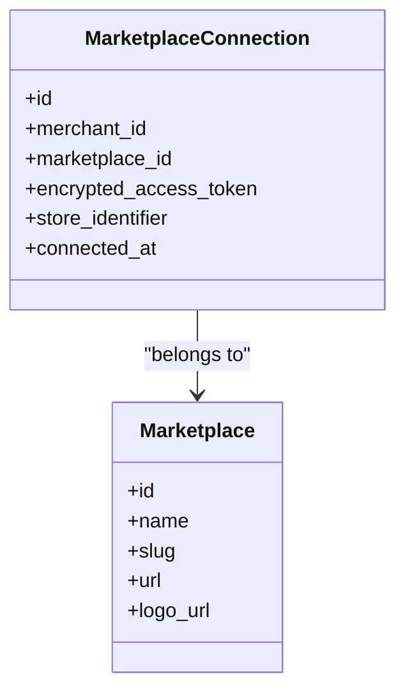

**Diagram sources**
- [marketplace_service.py:236-280](file://neurocom_backend/services/marketplace_service.py#L236-L280)
- [shopify_service.py:472-575](file://neurocom_backend/services/shopify_service.py#L472-L575)

**Section sources**
- [marketplace_service.py:236-280](file://neurocom_backend/services/marketplace_service.py#L236-L280)
- [shopify_service.py:472-575](file://neurocom_backend/services/shopify_service.py#L472-L575)

### Order Analytics and Reporting
- Operational metrics compute total orders, return rate, cancellation rate, and top return reasons.
- SLA alerts identify pending orders exceeding thresholds.
- Profit analysis aggregates revenue, costs, net profit, and margin per SKU.

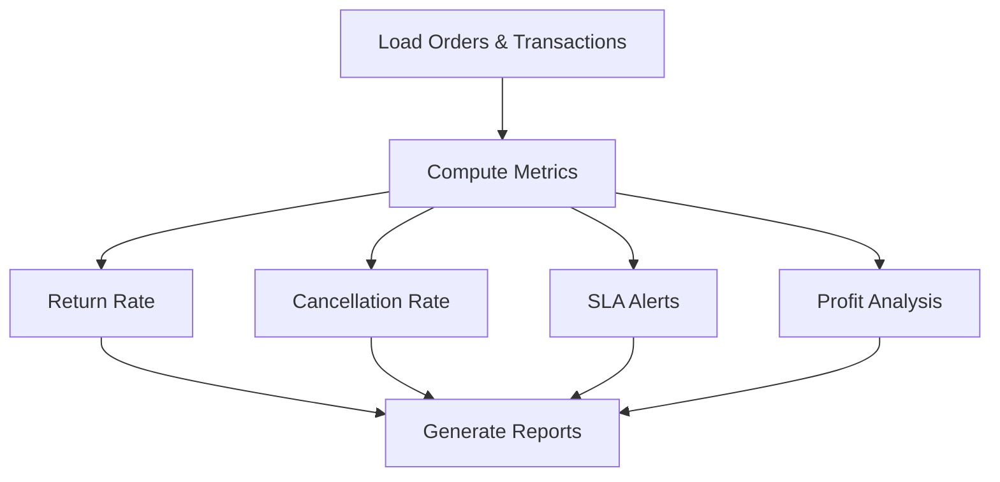

**Diagram sources**
- [insights.service.py:124-182](file://neurocom_backend/services/insights.service.py#L124-L182)
- [insights.service.py:93-122](file://neurocom_backend/services/insights.service.py#L93-L122)

**Section sources**
- [insights.service.py:93-182](file://neurocom_backend/services/insights.service.py#L93-L182)

### Error Handling and Retry Mechanisms
- HTTP exceptions are raised for not found orders and marketplace errors.
- Shopify requests raise specific status codes for failures and user errors.
- Redis caching includes background refresh with locking to avoid duplicate work.

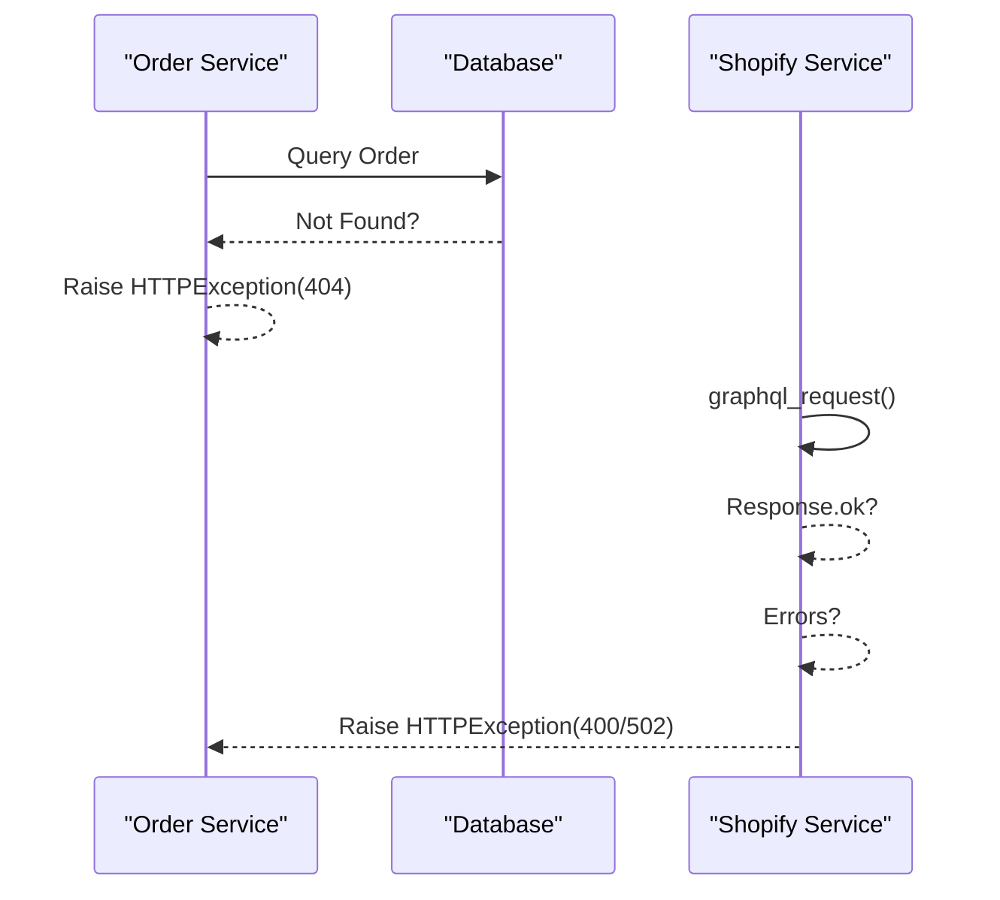

**Diagram sources**
- [order_service.py:16-35](file://neurocom_backend/services/order_service.py#L16-L35)
- [shopify_service.py:41-68](file://neurocom_backend/services/shopify_service.py#L41-L68)
- [redis_cache.py:177-203](file://neurocom_backend/utils/redis_cache.py#L177-L203)

**Section sources**
- [order_service.py:16-35](file://neurocom_backend/services/order_service.py#L16-L35)
- [shopify_service.py:41-68](file://neurocom_backend/services/shopify_service.py#L41-L68)
- [redis_cache.py:177-203](file://neurocom_backend/utils/redis_cache.py#L177-L203)

### Data Consistency Strategies
- Database transactions via SQLModel sessions ensure atomicity for order operations.
- Unique constraints and indexes protect data integrity (e.g., unique email, indexed IDs).
- Encrypted tokens and store identifiers prevent duplication and secure sensitive data.

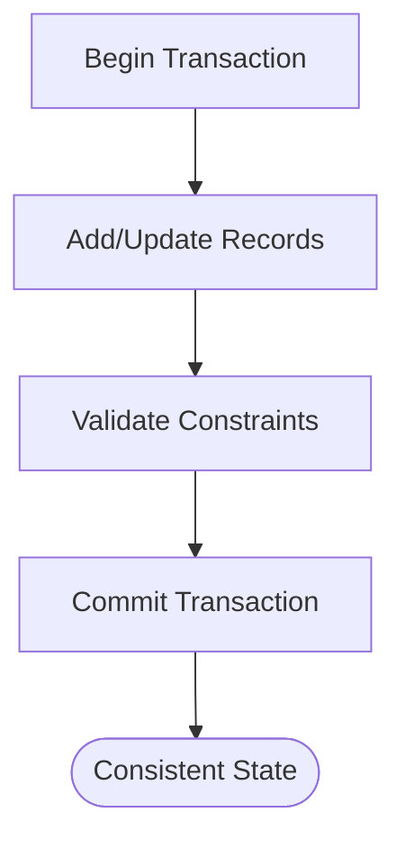

**Diagram sources**
- [connection.py:25-27](file://neurocom_backend/database/connection.py#L25-L27)
- [user.py:14-26](file://neurocom_backend/database/models/user.py#L14-L26)
- [marketplace_service.py:236-280](file://neurocom_backend/services/marketplace_service.py#L236-L280)

**Section sources**
- [connection.py:25-27](file://neurocom_backend/database/connection.py#L25-L27)
- [user.py:14-26](file://neurocom_backend/database/models/user.py#L14-L26)
- [marketplace_service.py:236-280](file://neurocom_backend/services/marketplace_service.py#L236-L280)

### Notifications and Tracking
- Tracking is enabled and activated for Shopify inventory items to support shipment visibility.
- Reverse orders include tracking numbers for return logistics.
- Real-time capabilities exist via SSE mounting under /mcp for potential notification streams.

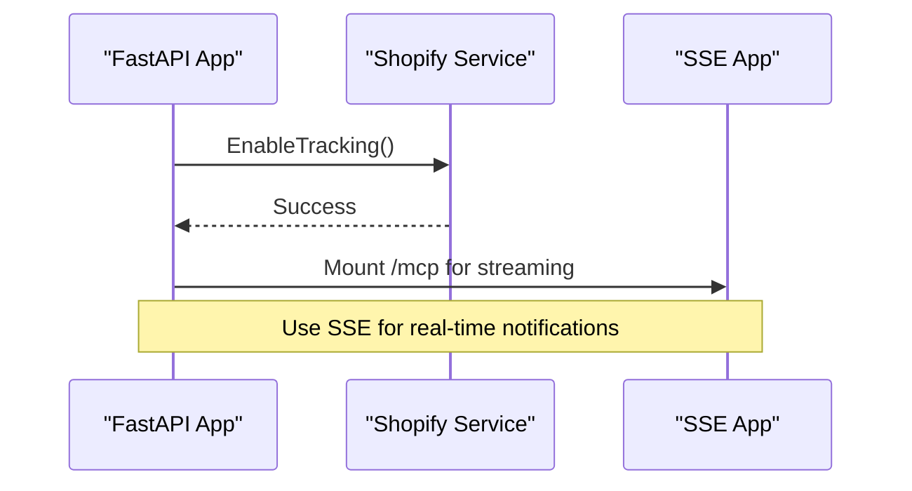

**Diagram sources**
- [shopify_service.py:399-440](file://neurocom_backend/services/shopify_service.py#L399-L440)
- [main.py:37-37](file://neurocom_backend/main.py#L37-L37)
- [daraz_service.py:1218-1244](file://neurocom_backend/services/daraz_service.py#L1218-L1244)

**Section sources**
- [shopify_service.py:399-440](file://neurocom_backend/services/shopify_service.py#L399-L440)
- [main.py:37-37](file://neurocom_backend/main.py#L37-L37)
- [daraz_service.py:1218-1244](file://neurocom_backend/services/daraz_service.py#L1218-L1244)

## Dependency Analysis
- Routers depend on services for business logic.
- Services depend on database models and external APIs (Shopify/Daraz).
- Caching depends on Redis client and TTL settings.
- Settings centralize environment variables used across modules.

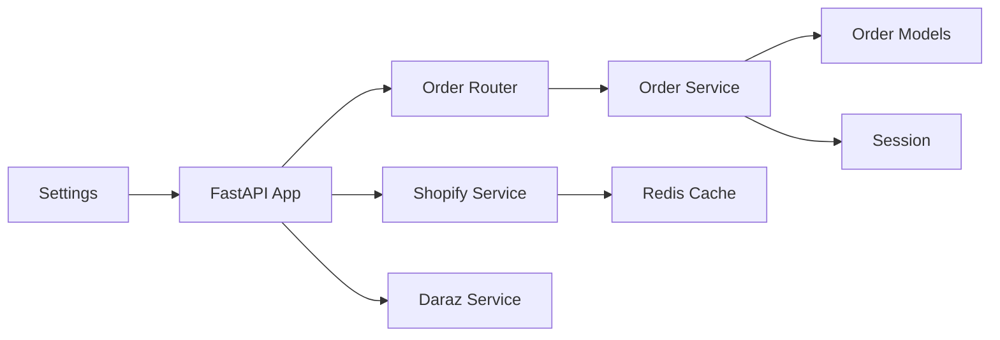

**Diagram sources**
- [order_router.py:10-39](file://neurocom_backend/routers/order_router.py#L10-L39)
- [order_service.py:9-46](file://neurocom_backend/services/order_service.py#L9-L46)
- [shopify_service.py:472-575](file://neurocom_backend/services/shopify_service.py#L472-L575)
- [redis_cache.py:177-203](file://neurocom_backend/utils/redis_cache.py#L177-L203)
- [settings.py:11-29](file://neurocom_backend/utils/settings.py#L11-L29)

**Section sources**
- [order_router.py:10-39](file://neurocom_backend/routers/order_router.py#L10-L39)
- [order_service.py:9-46](file://neurocom_backend/services/order_service.py#L9-L46)
- [shopify_service.py:472-575](file://neurocom_backend/services/shopify_service.py#L472-L575)
- [redis_cache.py:177-203](file://neurocom_backend/utils/redis_cache.py#L177-L203)
- [settings.py:11-29](file://neurocom_backend/utils/settings.py#L11-L29)

## Performance Considerations
- Use Redis caching for marketplace order retrieval to minimize upstream calls and latency.
- Background refresh with locking prevents thundering herd during cache misses.
- Pagination in GraphQL ensures efficient fetching of large datasets.
- Connection pooling and echo settings help tune database performance.

[No sources needed since this section provides general guidance]

## Troubleshooting Guide
Common issues and resolutions:
- Order not found: Ensure valid UUID and existence in database; service raises 404.
- Shopify API failures: Check access token validity and network connectivity; errors surfaced as HTTP exceptions.
- Cache inconsistencies: Verify TTL and background refresh behavior; inspect Redis keys and hashes.
- Marketplace connection errors: Validate OAuth code or access token; ensure unique store identifiers.

**Section sources**
- [order_service.py:16-35](file://neurocom_backend/services/order_service.py#L16-L35)
- [shopify_service.py:41-68](file://neurocom_backend/services/shopify_service.py#L41-L68)
- [redis_cache.py:177-203](file://neurocom_backend/utils/redis_cache.py#L177-L203)
- [marketplace_service.py:178-233](file://neurocom_backend/services/marketplace_service.py#L178-L233)

## Conclusion
The Tijarah AI Backend provides a robust order processing pipeline with clear separation of concerns across routers, services, models, and integrations. It supports marketplace synchronization, return workflows, analytics, and operational insights. Robust error handling, caching, and data consistency mechanisms ensure reliability and performance. Future enhancements can expand notification systems and advanced retry strategies for resilience.

[No sources needed since this section summarizes without analyzing specific files]

## Appendices
- API Endpoints: Order CRUD operations exposed via FastAPI router.
- Data Models: Order statuses and relationships with customers and products.
- Marketplace Connections: Secure credential storage and unique store identification.
- Analytics: Metrics for returns, cancellations, SLA alerts, and profitability.

**Section sources**
- [order_router.py:10-39](file://neurocom_backend/routers/order_router.py#L10-L39)
- [order.py:11-39](file://neurocom_backend/database/models/order.py#L11-L39)
- [marketplace_service.py:236-280](file://neurocom_backend/services/marketplace_service.py#L236-L280)
- [insights.service.py:124-182](file://neurocom_backend/services/insights.service.py#L124-L182)