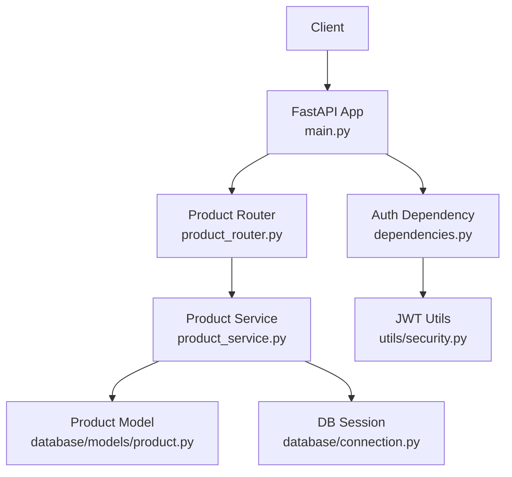
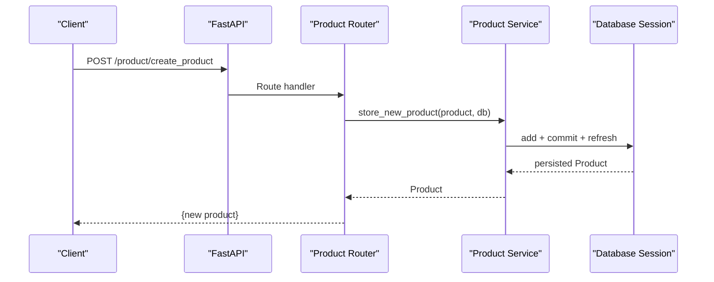
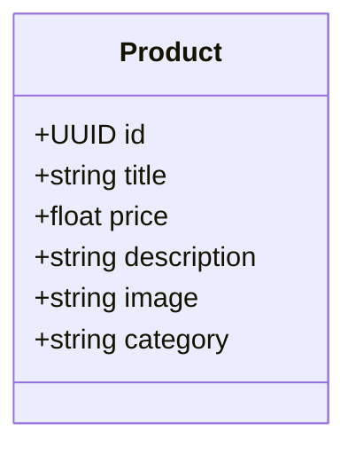
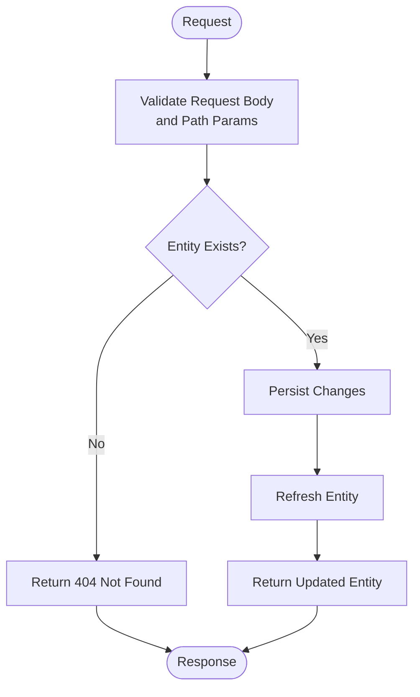
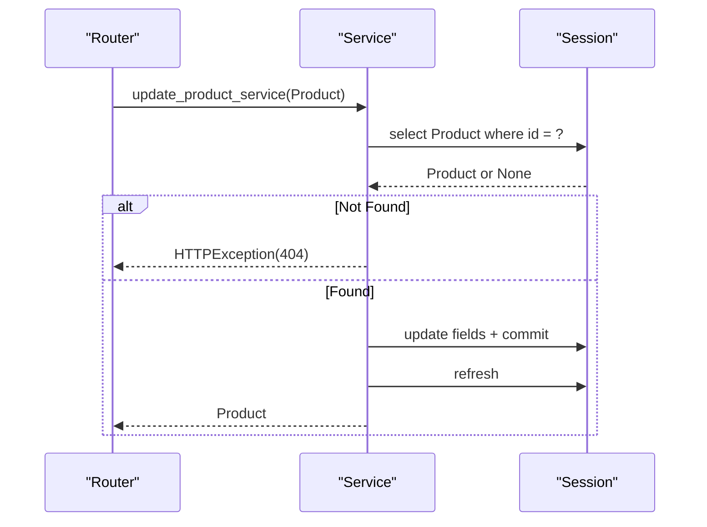
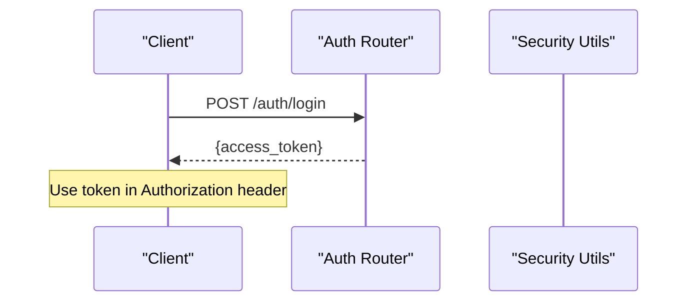
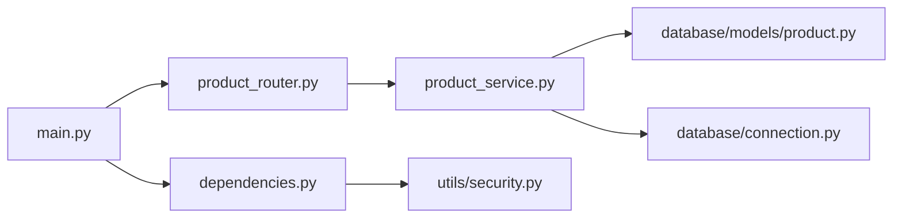

# Product CRUD Operations

<cite>
**Referenced Files in This Document**
- [main.py](file://neurocom_backend/main.py)
- [product_router.py](file://neurocom_backend/routers/product_router.py)
- [product_service.py](file://neurocom_backend/services/product_service.py)
- [product.py](file://neurocom_backend/database/models/product.py)
- [connection.py](file://neurocom_backend/database/connection.py)
- [dependencies.py](file://neurocom_backend/dependencies.py)
- [security.py](file://neurocom_backend/utils/security.py)
- [auth_router.py](file://neurocom_backend/routers/auth_router.py)
</cite>

## Table of Contents
1. [Introduction](#introduction)
2. [Project Structure](#project-structure)
3. [Core Components](#core-components)
4. [Architecture Overview](#architecture-overview)
5. [Detailed Component Analysis](#detailed-component-analysis)
6. [Dependency Analysis](#dependency-analysis)
7. [Performance Considerations](#performance-considerations)
8. [Troubleshooting Guide](#troubleshooting-guide)
9. [Conclusion](#conclusion)
10. [Appendices](#appendices)

## Introduction
This document explains the complete lifecycle of product management in the Tijarah AI Backend, covering creation, retrieval, updates, and deletion. It details the Product model structure, validation rules, service-layer business logic, API endpoints, request/response formats, error handling, and authentication requirements. It also includes common use cases and integration patterns with other system components such as marketplace publishing and order processing.

## Project Structure
The product feature is implemented across a small set of focused modules:
- Database model defines the persistent schema for products.
- Router exposes HTTP endpoints under /product.
- Service layer encapsulates database operations and business logic.
- Authentication middleware secures routes via JWT tokens.
- Application wiring mounts routers and sets up CORS and migrations.

**Diagram sources**
- [main.py:29-36](file://neurocom_backend/main.py#L29-L36)
- [product_router.py:1-38](file://neurocom_backend/routers/product_router.py#L1-L38)
- [product_service.py:1-47](file://neurocom_backend/services/product_service.py#L1-L47)
- [product.py:13-21](file://neurocom_backend/database/models/product.py#L13-L21)
- [connection.py:9-27](file://neurocom_backend/database/connection.py#L9-L27)
- [dependencies.py:14-43](file://neurocom_backend/dependencies.py#L14-L43)
- [security.py:22-28](file://neurocom_backend/utils/security.py#L22-L28)

**Section sources**
- [main.py:29-36](file://neurocom_backend/main.py#L29-L36)
- [product_router.py:1-38](file://neurocom_backend/routers/product_router.py#L1-L38)

## Core Components
- Product model: Defines fields id (UUID), title (min length 3), price (float), description (string), image (string), category (string). Validation is enforced by SQLModel Field constraints at the ORM level.
- Product router: Exposes endpoints for create, update, get by id, list all, and delete by id under prefix /product.
- Product service: Implements store_new_product, update_product_service, get_product_by_id, get_all_products, delete_product_by_id with session-based persistence and 404 handling for missing entities.
- Authentication: The product router currently does not enforce authentication dependencies; protected routes are registered elsewhere using require_auth.

Key responsibilities:
- Router: route mapping, request parsing, response formatting.
- Service: transactional writes, existence checks, error mapping to HTTP exceptions.
- Model: schema definition and field-level validation.

**Section sources**
- [product.py:13-21](file://neurocom_backend/database/models/product.py#L13-L21)
- [product_router.py:11-38](file://neurocom_backend/routers/product_router.py#L11-L38)
- [product_service.py:9-47](file://neurocom_backend/services/product_service.py#L9-L47)

## Architecture Overview
The request flow for product operations follows a layered pattern:
- Client sends an HTTP request to a product endpoint.
- FastAPI parses the request body into a Product instance (validation occurs here based on model constraints).
- The router calls the corresponding service function with a database session.
- The service performs queries or mutations using SQLModel and returns results.
- Responses are serialized back to JSON.

**Diagram sources**
- [product_router.py:15-18](file://neurocom_backend/routers/product_router.py#L15-L18)
- [product_service.py:9-14](file://neurocom_backend/services/product_service.py#L9-L14)
- [connection.py:25-27](file://neurocom_backend/database/connection.py#L25-L27)

## Detailed Component Analysis

### Product Model
- Fields:
  - id: UUID primary key, auto-generated.
  - title: string, required, minimum length 3.
  - price: float, required.
  - description: string, required.
  - image: string, required.
  - category: string, required.
- Validation: Enforced by SQLModel Field constraints during object creation and serialization.

**Diagram sources**
- [product.py:13-21](file://neurocom_backend/database/models/product.py#L13-L21)

**Section sources**
- [product.py:13-21](file://neurocom_backend/database/models/product.py#L13-L21)

### API Endpoints
Base path: /product

- Create Product
  - Method: POST
  - Path: /create_product
  - Request Body: Product object (title, price, description, image, category)
  - Response: { new product: Product }
  - Notes: Validates input via model constraints; persists via service.

- Update Product
  - Method: PUT
  - Path: /update_product
  - Request Body: Product object including id and updated fields
  - Response: { updated product: Product }
  - Error: 404 if product not found.

- Get Product by ID
  - Method: GET
  - Path: /get_product/{product_id}
  - Path Param: product_id (UUID)
  - Response: { product: Product }
  - Error: 404 if product not found.

- List All Products
  - Method: GET
  - Path: /get_products
  - Response: { products: [Product] }

- Delete Product
  - Method: DELETE
  - Path: /delete_product/{product_id}
  - Path Param: product_id (UUID)
  - Response: { deleted product: Product }
  - Error: 404 if product not found.

**Diagram sources**
- [product_service.py:16-28](file://neurocom_backend/services/product_service.py#L16-L28)
- [product_service.py:31-37](file://neurocom_backend/services/product_service.py#L31-L37)

**Section sources**
- [product_router.py:11-38](file://neurocom_backend/routers/product_router.py#L11-L38)
- [product_service.py:9-47](file://neurocom_backend/services/product_service.py#L9-L47)

### Business Logic and Validation
- Input validation:
  - Title must be at least 3 characters.
  - Price must be a valid float.
  - Required fields enforced by model constraints.
- Existence checks:
  - Update and delete operations return 404 when the target product is not found.
- Persistence:
  - Create uses add/commit/refresh.
  - Update locates existing record, mutates fields, commits, and refreshes.
  - Delete removes the record and commits.

**Diagram sources**
- [product_service.py:16-28](file://neurocom_backend/services/product_service.py#L16-L28)

**Section sources**
- [product_service.py:9-47](file://neurocom_backend/services/product_service.py#L9-L47)

### Authentication Requirements
- Current state:
  - The product router endpoints do not apply authentication dependencies.
  - Other routers are mounted with require_auth to enforce JWT-based access.
- How to secure product endpoints:
  - Add Depends(get_current_user) to endpoints that should require authentication.
  - Ensure clients include Authorization: Bearer <token>.
- Token issuance:
  - Clients obtain tokens via /auth/login which returns a JWT.
  - Tokens contain subject (merchant id) and type (account_type).

**Diagram sources**
- [auth_router.py:24-37](file://neurocom_backend/routers/auth_router.py#L24-L37)
- [security.py:22-28](file://neurocom_backend/utils/security.py#L22-L28)

**Section sources**
- [main.py:78-89](file://neurocom_backend/main.py#L78-L89)
- [dependencies.py:14-43](file://neurocom_backend/dependencies.py#L14-L43)
- [auth_router.py:24-37](file://neurocom_backend/routers/auth_router.py#L24-L37)

### Data Structures and Examples
- Product data structure:
  - id: UUID (server-generated)
  - title: string (min 3 chars)
  - price: number (float)
  - description: string
  - image: string (URL or path)
  - category: string
- Example usage scenarios:
  - Create a new product listing for a merchant’s catalog.
  - Update pricing or metadata after inventory changes.
  - Retrieve product details for storefront display.
  - List products for admin dashboards or analytics.
  - Remove discontinued items from the catalog.

Note: These examples describe typical payloads and responses aligned with the Product model and endpoints.

[No sources needed since this section provides conceptual examples without quoting code]

### Integration Patterns
- Marketplace publishing:
  - While product CRUD is independent, merchants can connect marketplaces and publish products through separate endpoints under /marketplace.
  - After creating or updating a product internally, you may trigger publishing flows to connected stores.
- Orders:
  - Orders reference products via foreign keys; ensure product existence before order creation.
- Storage:
  - Image URLs stored in Product can point to storage services managed by other routers.

[No sources needed since this section describes conceptual integrations]

## Dependency Analysis
- Router depends on:
  - Service functions for business logic.
  - Database session dependency for persistence.
- Service depends on:
  - Product model for ORM mapping.
  - Database session for queries and mutations.
  - FastAPI HTTPException for error signaling.
- Authentication dependency:
  - get_current_user validates JWT and resolves Merchant identity.
  - Currently not applied to product endpoints but available for future use.

**Diagram sources**
- [product_router.py:1-38](file://neurocom_backend/routers/product_router.py#L1-L38)
- [product_service.py:1-47](file://neurocom_backend/services/product_service.py#L1-L47)
- [product.py:13-21](file://neurocom_backend/database/models/product.py#L13-L21)
- [connection.py:25-27](file://neurocom_backend/database/connection.py#L25-L27)
- [main.py:78-89](file://neurocom_backend/main.py#L78-L89)
- [dependencies.py:14-43](file://neurocom_backend/dependencies.py#L14-L43)
- [security.py:22-28](file://neurocom_backend/utils/security.py#L22-L28)

**Section sources**
- [product_router.py:1-38](file://neurocom_backend/routers/product_router.py#L1-L38)
- [product_service.py:1-47](file://neurocom_backend/services/product_service.py#L1-L47)
- [main.py:78-89](file://neurocom_backend/main.py#L78-L89)

## Performance Considerations
- Database sessions:
  - Each request opens a short-lived session via get_session; ensure minimal work per request to reduce latency.
- Queries:
  - get_all_products retrieves all rows; consider pagination for large catalogs.
- Validation:
  - Field-level validation happens early; keep payload minimal to reduce overhead.
- Transactions:
  - Commit/refresh patterns are used; batch operations could improve throughput if needed.

[No sources needed since this section provides general guidance]

## Troubleshooting Guide
Common issues and resolutions:
- 404 Not Found:
  - Occurs when updating or deleting a non-existent product.
  - Verify product_id and ensure the entity exists prior to mutation.
- Validation errors:
  - Title too short or invalid types will cause request validation failures.
  - Ensure title meets minimum length and price is a valid number.
- Authentication:
  - If securing product endpoints, ensure Authorization header contains a valid Bearer token issued by /auth/login.
  - Invalid or expired tokens result in 401 Unauthorized.

**Section sources**
- [product_service.py:16-28](file://neurocom_backend/services/product_service.py#L16-L28)
- [product_service.py:31-37](file://neurocom_backend/services/product_service.py#L31-L37)
- [auth_router.py:24-37](file://neurocom_backend/routers/auth_router.py#L24-L37)
- [dependencies.py:14-43](file://neurocom_backend/dependencies.py#L14-L43)

## Conclusion
The Tijarah AI Backend provides a straightforward product CRUD implementation with clear separation of concerns: routing, service logic, and data modeling. While product endpoints are currently unauthenticated, they integrate well with the broader system for marketplace publishing and order management. To enhance security, apply JWT-based authentication to product endpoints and consider adding pagination and richer validation as the catalog grows.

[No sources needed since this section summarizes without analyzing specific files]

## Appendices

### Endpoint Reference Summary
- POST /product/create_product
  - Request: Product
  - Response: { new product: Product }
- PUT /product/update_product
  - Request: Product (include id)
  - Response: { updated product: Product }
  - Errors: 404 if not found
- GET /product/get_product/{product_id}
  - Response: { product: Product }
  - Errors: 404 if not found
- GET /product/get_products
  - Response: { products: [Product] }
- DELETE /product/delete_product/{product_id}
  - Response: { deleted product: Product }
  - Errors: 404 if not found

**Section sources**
- [product_router.py:11-38](file://neurocom_backend/routers/product_router.py#L11-L38)
- [product_service.py:9-47](file://neurocom_backend/services/product_service.py#L9-L47)