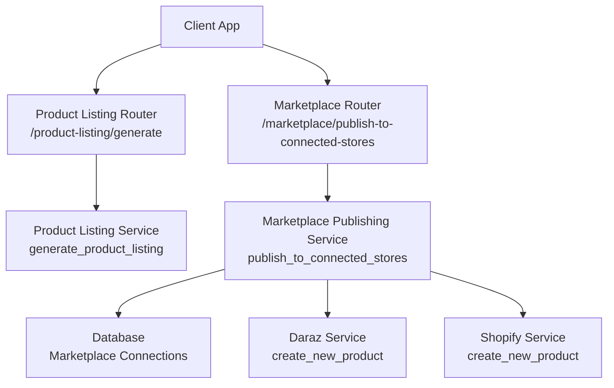
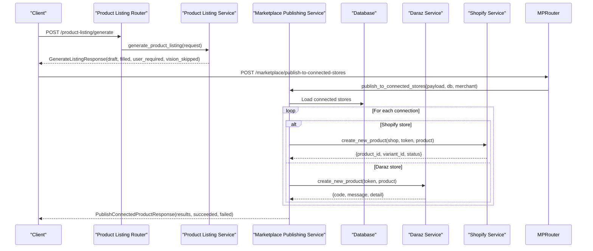
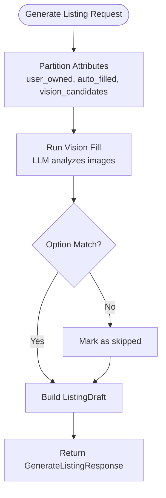
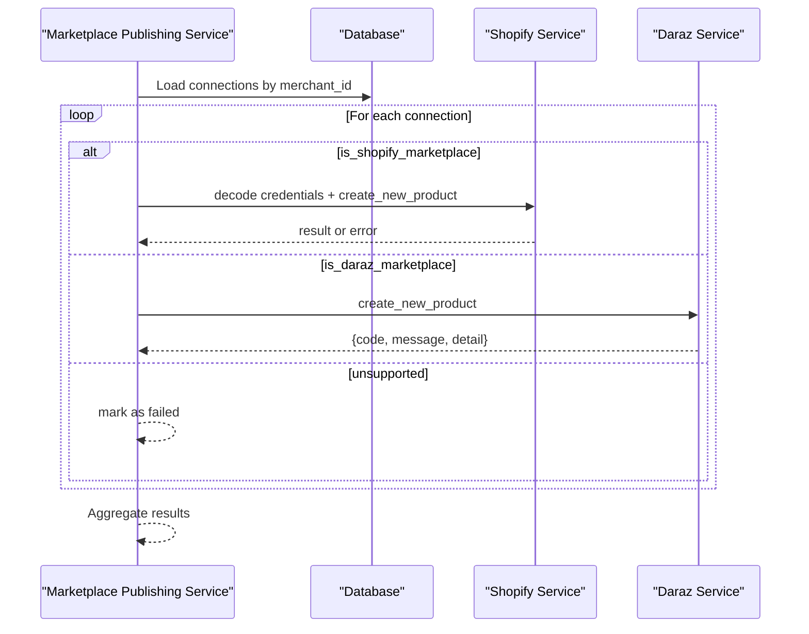
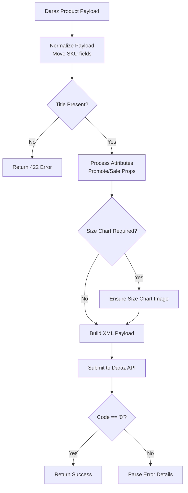
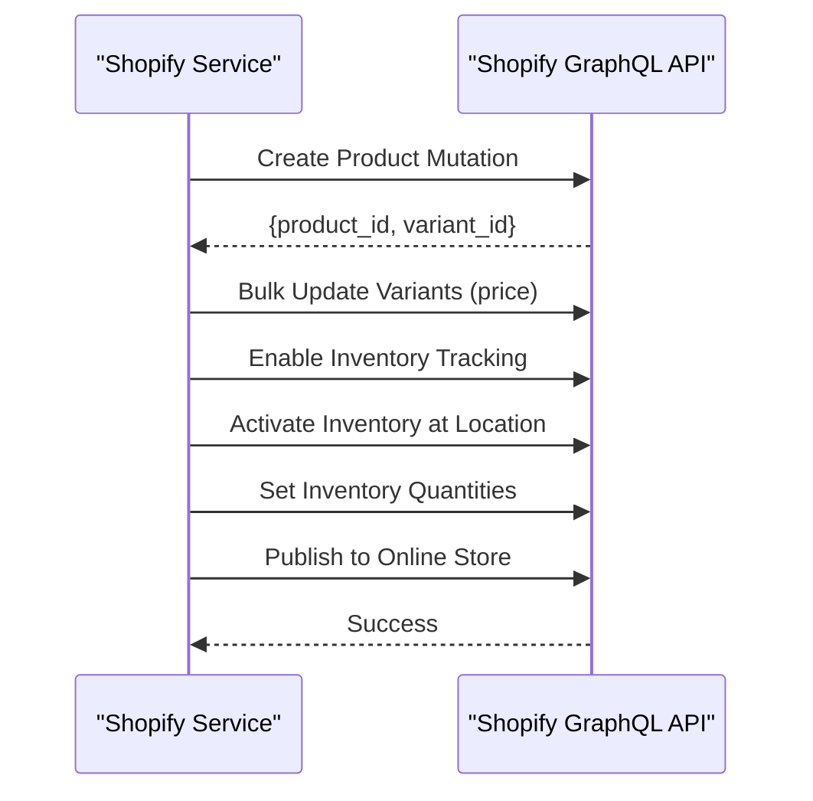
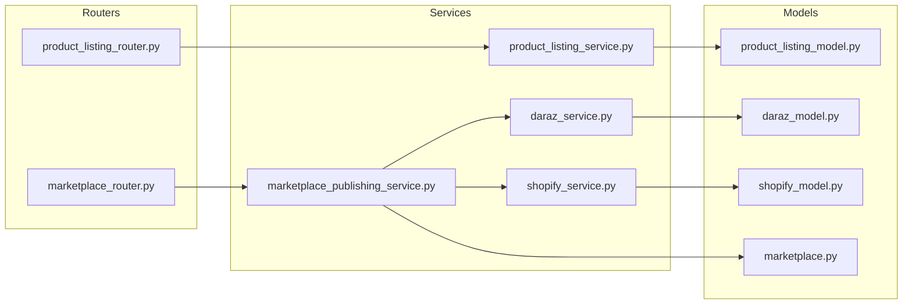

# Product Listing Management

<cite>
**Referenced Files in This Document**
- [marketplace_publishing_service.py](file://neurocom_backend/services/marketplace_publishing_service.py)
- [product_listing_service.py](file://neurocom_backend/services/product_listing_service.py)
- [product_listing_model.py](file://neurocom_backend/models/product_listing_model.py)
- [product_listing_router.py](file://neurocom_backend/routers/product_listing_router.py)
- [daraz_service.py](file://neurocom_backend/services/daraz_service.py)
- [shopify_service.py](file://neurocom_backend/services/shopify_service.py)
- [marketplace_service.py](file://neurocom_backend/services/marketplace_service.py)
- [marketplace.py](file://neurocom_backend/database/models/marketplace.py)
- [marketplace_router.py](file://neurocom_backend/routers/marketplace_router.py)
- [daraz_model.py](file://neurocom_backend/models/daraz_model.py)
- [shopify_model.py](file://neurocom_backend/models/shopify_model.py)
</cite>

## Table of Contents
1. [Introduction](#introduction)
2. [Project Structure](#project-structure)
3. [Core Components](#core-components)
4. [Architecture Overview](#architecture-overview)
5. [Detailed Component Analysis](#detailed-component-analysis)
6. [Dependency Analysis](#dependency-analysis)
7. [Performance Considerations](#performance-considerations)
8. [Troubleshooting Guide](#troubleshooting-guide)
9. [Conclusion](#conclusion)

## Introduction
This document explains how the system manages product listings across multiple marketplaces, specifically Daraz and Shopify. It covers:
- How products are published to connected stores on each marketplace
- Marketplace-specific formatting, attribute mapping, and image handling
- The listing lifecycle from AI-assisted draft generation to publication
- Status tracking and error handling for multi-store publishing
- Marketplace configurations, validation rules, and optimization strategies for visibility and performance

The system provides a unified API to generate listing drafts from images and category attributes, then publish those listings to all connected marketplace stores with per-marketplace transformations and validations.

## Project Structure
The product listing management spans routers, services, models, and marketplace integrations:
- Routers expose endpoints for listing generation and marketplace publishing
- Services implement marketplace-specific logic (Daraz XML payload building, Shopify GraphQL mutations)
- Models define request/response schemas and marketplace data structures
- Database models track marketplace connections and encrypted credentials

**Diagram sources**
- [product_listing_router.py:15-23](file://neurocom_backend/routers/product_listing_router.py#L15-L23)
- [marketplace_router.py:36-42](file://neurocom_backend/routers/marketplace_router.py#L36-L42)
- [product_listing_service.py:208-331](file://neurocom_backend/services/product_listing_service.py#L208-L331)
- [marketplace_publishing_service.py:34-63](file://neurocom_backend/services/marketplace_publishing_service.py#L34-L63)
- [daraz_service.py:754-879](file://neurocom_backend/services/daraz_service.py#L754-L879)
- [shopify_service.py:329-469](file://neurocom_backend/services/shopify_service.py#L329-L469)

**Section sources**
- [product_listing_router.py:1-24](file://neurocom_backend/routers/product_listing_router.py#L1-L24)
- [marketplace_router.py:1-118](file://neurocom_backend/routers/marketplace_router.py#L1-L118)
- [marketplace.py:17-41](file://neurocom_backend/database/models/marketplace.py#L17-L41)

## Core Components
- Product listing generation: AI-driven draft creation from images and category attributes, producing a structured draft aligned with marketplace payloads
- Marketplace publishing: Orchestrates publishing to all connected stores, routing to marketplace-specific services
- Daraz integration: Builds XML payloads, validates images, enforces size chart requirements, maps attributes to product vs SKU levels
- Shopify integration: Creates products via GraphQL, sets variants, inventory, and publishes to Online Store

Key responsibilities:
- Draft generation partitions attributes into user-owned, auto-filled, and vision candidates
- Publishing service decrypts credentials, routes by marketplace type, and aggregates results
- Daraz service normalizes payloads, ensures required fields, and constructs XML for create-product
- Shopify service handles OAuth, GraphQL mutations, and inventory activation

**Section sources**
- [product_listing_service.py:36-132](file://neurocom_backend/services/product_listing_service.py#L36-L132)
- [marketplace_publishing_service.py:34-63](file://neurocom_backend/services/marketplace_publishing_service.py#L34-L63)
- [daraz_service.py:706-879](file://neurocom_backend/services/daraz_service.py#L706-L879)
- [shopify_service.py:329-469](file://neurocom_backend/services/shopify_service.py#L329-L469)

## Architecture Overview
The end-to-end flow supports two main workflows:
1. Generate a listing draft from images and category attributes
2. Publish the draft to all connected marketplace stores

**Diagram sources**
- [product_listing_router.py:18-23](file://neurocom_backend/routers/product_listing_router.py#L18-L23)
- [product_listing_service.py:208-331](file://neurocom_backend/services/product_listing_service.py#L208-L331)
- [marketplace_router.py:36-42](file://neurocom_backend/routers/marketplace_router.py#L36-L42)
- [marketplace_publishing_service.py:34-63](file://neurocom_backend/services/marketplace_publishing_service.py#L34-L63)
- [shopify_service.py:329-469](file://neurocom_backend/services/shopify_service.py#L329-L469)
- [daraz_service.py:754-879](file://neurocom_backend/services/daraz_service.py#L754-L879)

## Detailed Component Analysis

### Product Listing Generation
The listing generation pipeline transforms raw images and category attributes into a structured draft suitable for marketplace submission. It partitions attributes into three categories:
- User-owned fields (price, quantity, dimensions, etc.) that must be provided by the seller
- Auto-filled mandatory single-option enums (e.g., warranty_type)
- Vision candidates where an LLM analyzes images to infer values

The process includes:
- Partitioning attributes based on input type and ownership rules
- Running a structured vision call to fill candidate fields with confidence scores
- Validating option matches against allowed values
- Building a draft with Title, PrimaryCategory, Images, Attributes, and Skus

**Diagram sources**
- [product_listing_service.py:108-132](file://neurocom_backend/services/product_listing_service.py#L108-L132)
- [product_listing_service.py:157-205](file://neurocom_backend/services/product_listing_service.py#L157-L205)
- [product_listing_service.py:208-331](file://neurocom_backend/services/product_listing_service.py#L208-L331)

**Section sources**
- [product_listing_service.py:36-132](file://neurocom_backend/services/product_listing_service.py#L36-L132)
- [product_listing_service.py:157-205](file://neurocom_backend/services/product_listing_service.py#L157-L205)
- [product_listing_service.py:208-331](file://neurocom_backend/services/product_listing_service.py#L208-L331)
- [product_listing_model.py:12-56](file://neurocom_backend/models/product_listing_model.py#L12-L56)

### Multi-Marketplace Publishing Orchestration
The publishing service coordinates publication to all connected stores for a merchant. It:
- Loads all marketplace connections for the authenticated merchant
- Routes each connection to the appropriate marketplace service based on slug/name
- Handles credential decryption and marketplace-specific product validation
- Aggregates results with success/failure status and error messages

For Shopify, it decodes credentials and calls the Shopify service with a validated product model. For Daraz, it validates the response code and extracts detailed error messages when failures occur.

**Diagram sources**
- [marketplace_publishing_service.py:34-63](file://neurocom_backend/services/marketplace_publishing_service.py#L34-L63)
- [marketplace_service.py:36-45](file://neurocom_backend/services/marketplace_service.py#L36-L45)
- [shopify_service.py:691-700](file://neurocom_backend/services/shopify_service.py#L691-L700)
- [daraz_service.py:754-879](file://neurocom_backend/services/daraz_service.py#L754-L879)

**Section sources**
- [marketplace_publishing_service.py:15-63](file://neurocom_backend/services/marketplace_publishing_service.py#L15-L63)
- [marketplace_service.py:36-45](file://neurocom_backend/services/marketplace_service.py#L36-L45)

### Daraz-Specific Implementation
Daraz publishing involves complex XML payload construction with marketplace-specific rules:

**Attribute Mapping:**
- Moves category SKU fields from Attributes to Sku rows
- Promotes certain SKU fields to product-level Attributes when required
- Handles sale properties (color_family, size) as variations with optional images
- Enforces size chart requirements for specific categories

**Image Handling:**
- Validates JPEG/PNG format and 1MB limit
- Supports migration from whitelisted external URLs or direct upload
- Falls back to upload if migration fails (E302 responses)

**Validation Rules:**
- Requires at least one SKU
- Validates title presence and normalization
- Ensures brand defaults to "No Brand" when empty or invalid
- Cleans HTML content in package descriptions

**Diagram sources**
- [daraz_service.py:706-731](file://neurocom_backend/services/daraz_service.py#L706-L731)
- [daraz_service.py:737-792](file://neurocom_backend/services/daraz_service.py#L737-L792)
- [daraz_service.py:793-879](file://neurocom_backend/services/daraz_service.py#L793-L879)

**Section sources**
- [daraz_service.py:314-446](file://neurocom_backend/services/daraz_service.py#L314-L446)
- [daraz_service.py:482-524](file://neurocom_backend/services/daraz_service.py#L482-L524)
- [daraz_service.py:598-638](file://neurocom_backend/services/daraz_service.py#L598-L638)
- [daraz_service.py:706-879](file://neurocom_backend/services/daraz_service.py#L706-L879)

### Shopify-Specific Implementation
Shopify publishing uses GraphQL mutations to create products and manage inventory:

**Product Creation Flow:**
- Creates product with title, description, vendor, tags, and collections
- Sets variant price through bulk update mutation
- Enables inventory tracking and activates inventory at location
- Publishes product to Online Store publication

**Credential Management:**
- Normalizes shop domain to .myshopify.com format
- Encodes/decodes credentials as JSON for secure storage
- Exchanges OAuth codes for access tokens

**Optimization Strategies:**
- Uses cursor-based pagination for large catalogs
- Caches API responses with configurable TTL
- Batches variant updates to minimize API calls

**Diagram sources**
- [shopify_service.py:329-469](file://neurocom_backend/services/shopify_service.py#L329-L469)
- [shopify_service.py:691-700](file://neurocom_backend/services/shopify_service.py#L691-L700)

**Section sources**
- [shopify_service.py:28-38](file://neurocom_backend/services/shopify_service.py#L28-L38)
- [shopify_service.py:329-469](file://neurocom_backend/services/shopify_service.py#L329-L469)
- [shopify_service.py:691-700](file://neurocom_backend/services/shopify_service.py#L691-L700)

### Data Models and Schemas
The system uses Pydantic models to enforce data contracts between components:

**Product Listing Models:**
- GenerateListingRequest: Input for AI listing generation
- ListingDraft: Structured output matching marketplace create-product format
- FilledAttribute: Tracks source and confidence of AI-filled fields

**Marketplace Models:**
- DarazProductCreate: Daraz-specific product structure with attributes and SKUs
- ShopifyProductCreate: Shopify GraphQL-compatible product creation input
- ConnectedStorePublishResult: Per-store publishing result with success/error status

**Section sources**
- [product_listing_model.py:12-56](file://neurocom_backend/models/product_listing_model.py#L12-L56)
- [daraz_model.py:20-36](file://neurocom_backend/models/daraz_model.py#L20-L36)
- [shopify_model.py:123-133](file://neurocom_backend/models/shopify_model.py#L123-L133)
- [marketplace.py:86-105](file://neurocom_backend/database/models/marketplace.py#L86-L105)

## Dependency Analysis
The system exhibits clear separation of concerns with minimal coupling:

**Diagram sources**
- [product_listing_router.py:15-23](file://neurocom_backend/routers/product_listing_router.py#L15-L23)
- [marketplace_router.py:36-42](file://neurocom_backend/routers/marketplace_router.py#L36-L42)
- [marketplace_publishing_service.py:5-11](file://neurocom_backend/services/marketplace_publishing_service.py#L5-L11)

**Section sources**
- [marketplace_publishing_service.py:5-11](file://neurocom_backend/services/marketplace_publishing_service.py#L5-L11)
- [product_listing_service.py:26-33](file://neurocom_backend/services/product_listing_service.py#L26-L33)

## Performance Considerations
Several optimization strategies are implemented throughout the system:

**Caching:**
- Redis-based caching for marketplace API responses with fingerprinted keys
- Configurable TTL for Shopify responses to reduce API calls
- Background refresh mechanisms for expensive operations

**Efficiency Patterns:**
- Deterministic attribute partitioning avoids unnecessary LLM calls
- One structured vision call instead of multiple agent interactions
- Batch processing for order and review retrieval
- Cursor-based pagination for large datasets

**Resource Optimization:**
- Image validation prevents unnecessary uploads
- XML payload construction minimizes network overhead
- Selective field promotion reduces payload size

[No sources needed since this section provides general guidance]

## Troubleshooting Guide
Common issues and their resolution strategies:

**Authentication Errors:**
- Invalid or expired access tokens result in HTTPException with detailed messages
- Shopify OAuth code exchange failures return 400 errors with response details
- Missing credentials for marketplace connections are detected before publishing attempts

**Validation Failures:**
- Daraz requires valid JPEG/PNG images under 1MB with proper content types
- Missing required fields like titles trigger 422 validation errors
- Invalid option values are rejected during attribute matching

**API Response Issues:**
- Daraz returns non-zero codes with detailed error messages in nested structures
- Shopify GraphQL mutations include userErrors arrays for field-specific validation
- Network timeouts and malformed responses are caught and converted to appropriate HTTP status codes

**Error Handling Patterns:**
- Consistent error message extraction from marketplace-specific response formats
- Graceful degradation when individual marketplace publishing fails
- Comprehensive logging for debugging API interactions

**Section sources**
- [marketplace_publishing_service.py:15-31](file://neurocom_backend/services/marketplace_publishing_service.py#L15-L31)
- [daraz_service.py:341-364](file://neurocom_backend/services/daraz_service.py#L341-L364)
- [shopify_service.py:56-68](file://neurocom_backend/services/shopify_service.py#L56-L68)
- [product_listing_router.py:18-23](file://neurocom_backend/routers/product_listing_router.py#L18-L23)

## Conclusion
The product listing management system provides a robust, extensible platform for managing marketplace publications across Daraz and Shopify. Key strengths include:

- **Unified Interface**: Single API endpoints handle both listing generation and multi-marketplace publishing
- **Intelligent Processing**: AI-powered attribute inference reduces manual data entry while maintaining accuracy
- **Marketplace-Specific Optimizations**: Tailored implementations for each platform's unique requirements and constraints
- **Comprehensive Error Handling**: Detailed error reporting and graceful failure handling for reliable operations
- **Performance Focus**: Caching, batching, and efficient resource usage for scalable operations

The architecture supports easy extension to additional marketplaces through the established patterns of service implementation, model definition, and credential management. The separation between listing generation and publishing allows independent evolution of AI capabilities and marketplace integrations.

[No sources needed since this section summarizes without analyzing specific files]