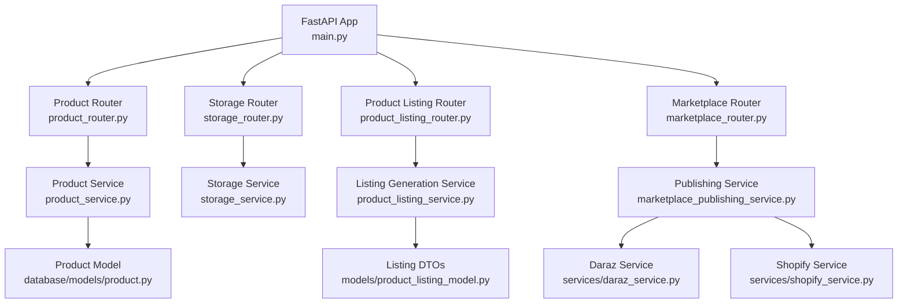
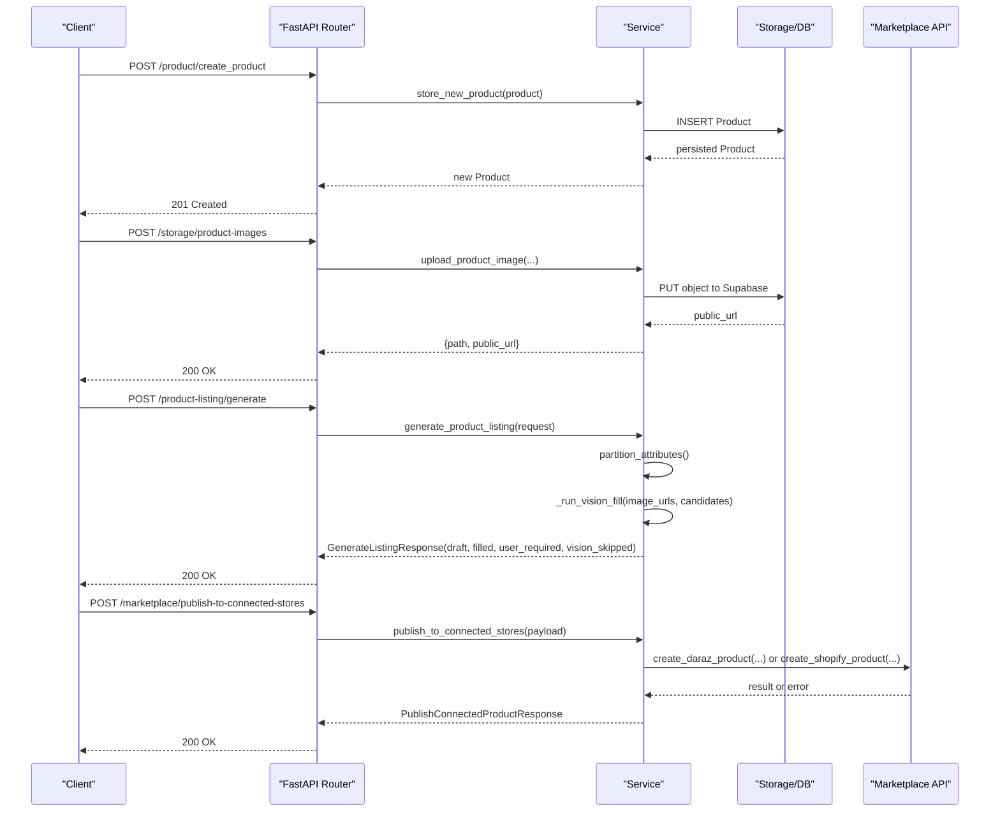
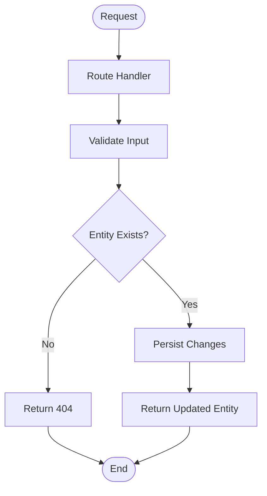
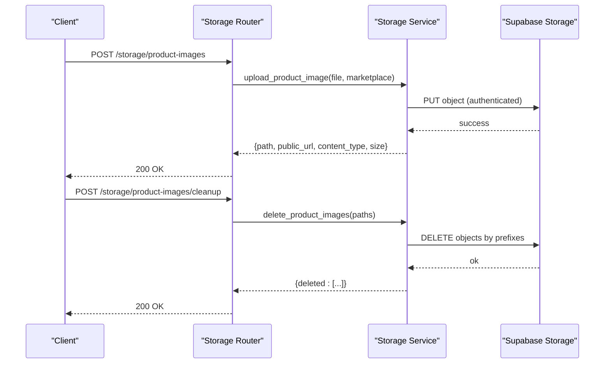
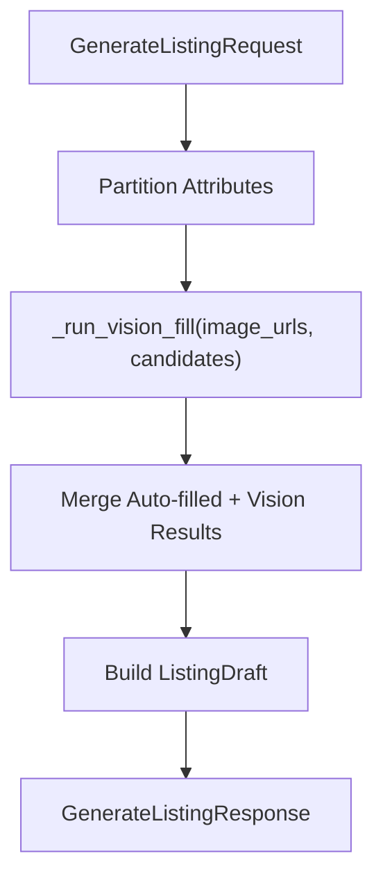
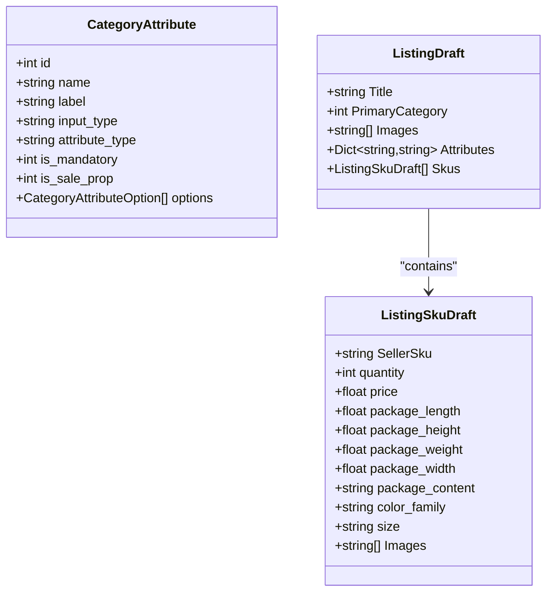
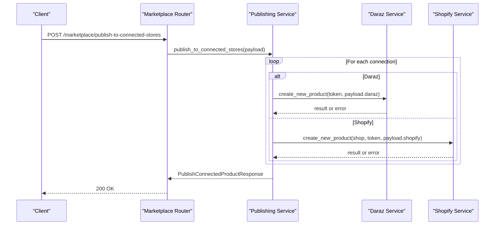
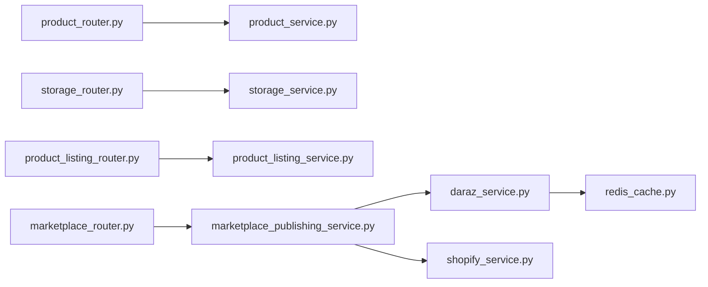

# Product Management

<cite>
**Referenced Files in This Document**
- [main.py](file://neurocom_backend/main.py)
- [product_router.py](file://neurocom_backend/routers/product_router.py)
- [product_service.py](file://neurocom_backend/services/product_service.py)
- [product.py](file://neurocom_backend/database/models/product.py)
- [product_listing_router.py](file://neurocom_backend/routers/product_listing_router.py)
- [product_listing_model.py](file://neurocom_backend/models/product_listing_model.py)
- [product_listing_service.py](file://neurocom_backend/services/product_listing_service.py)
- [storage_router.py](file://neurocom_backend/routers/storage_router.py)
- [storage_service.py](file://neurocom_backend/services/storage_service.py)
- [marketplace_router.py](file://neurocom_backend/routers/marketplace_router.py)
- [marketplace_publishing_service.py](file://neurocom_backend/services/marketplace_publishing_service.py)
- [daraz_service.py](file://neurocom_backend/services/daraz_service.py)
- [shopify_service.py](file://neurocom_backend/services/shopify_service.py)
- [redis_cache.py](file://neurocom_backend/utils/redis_cache.py)
</cite>

## Table of Contents
1. Introduction
2. Project Structure
3. Core Components
4. Architecture Overview
5. Detailed Component Analysis
6. Dependency Analysis
7. Performance Considerations
8. Troubleshooting Guide
9. Conclusion

## Introduction
This document describes the product management capabilities of the Tijarah AI Backend, focusing on CRUD operations for products, marketplace listing generation, image upload and storage, category and attribute handling, and publishing to connected marketplaces (Daraz and Shopify). It also outlines validation rules, business logic, marketplace-specific formatting, search and filtering considerations, bulk operations, and performance strategies for large catalogs.

## Project Structure
The product management feature spans routers, services, data models, and integrations:
- Routers expose HTTP endpoints for product CRUD, image storage, listing generation, and marketplace publishing.
- Services implement business logic, marketplace integrations, and storage interactions.
- Models define request/response schemas and database entities.
- Utilities provide caching and security helpers.

**Diagram sources**
- [main.py:29-89](file://neurocom_backend/main.py#L29-L89)
- [product_router.py:1-38](file://neurocom_backend/routers/product_router.py#L1-L38)
- [storage_router.py:1-65](file://neurocom_backend/routers/storage_router.py#L1-L65)
- [product_listing_router.py:1-24](file://neurocom_backend/routers/product_listing_router.py#L1-L24)
- [marketplace_router.py:1-118](file://neurocom_backend/routers/marketplace_router.py#L1-L118)

**Section sources**
- [main.py:29-89](file://neurocom_backend/main.py#L29-L89)

## Core Components
- Product CRUD: Create, update, retrieve, delete via FastAPI router and service layer backed by SQLModel.
- Image Upload: Secure upload to Supabase Storage with type and size validation.
- AI Listing Generation: Generate a marketplace-ready draft from images and category attributes using structured vision prompts.
- Marketplace Publishing: Publish products to connected Daraz and Shopify stores through a unified endpoint.

Key responsibilities:
- product_router.py: Exposes /product endpoints for CRUD.
- product_service.py: Implements persistence and retrieval logic.
- product.py: Defines the Product entity schema.
- storage_router.py + storage_service.py: Handle image uploads and cleanup.
- product_listing_router.py + product_listing_service.py + product_listing_model.py: Generate listing drafts aligned with marketplace requirements.
- marketplace_router.py + marketplace_publishing_service.py: Orchestrate publishing to multiple marketplaces.

**Section sources**
- [product_router.py:1-38](file://neurocom_backend/routers/product_router.py#L1-L38)
- [product_service.py:1-47](file://neurocom_backend/services/product_service.py#L1-L47)
- [product.py:1-21](file://neurocom_backend/database/models/product.py#L1-L21)
- [storage_router.py:1-65](file://neurocom_backend/routers/storage_router.py#L1-L65)
- [storage_service.py:1-142](file://neurocom_backend/services/storage_service.py#L1-L142)
- [product_listing_router.py:1-24](file://neurocom_backend/routers/product_listing_router.py#L1-L24)
- [product_listing_service.py:1-332](file://neurocom_backend/services/product_listing_service.py#L1-L332)
- [product_listing_model.py:1-56](file://neurocom_backend/models/product_listing_model.py#L1-L56)
- [marketplace_router.py:1-118](file://neurocom_backend/routers/marketplace_router.py#L1-L118)
- [marketplace_publishing_service.py:1-64](file://neurocom_backend/services/marketplace_publishing_service.py#L1-L64)

## Architecture Overview
The system follows a layered architecture:
- API Layer (Routers): Validate requests, delegate to services.
- Service Layer: Business logic, marketplace integrations, storage operations.
- Data Layer: SQLModel models and external APIs (Daraz, Shopify), plus Redis-backed caching.

**Diagram sources**
- [product_router.py:15-38](file://neurocom_backend/routers/product_router.py#L15-L38)
- [product_service.py:9-47](file://neurocom_backend/services/product_service.py#L9-L47)
- [storage_router.py:46-65](file://neurocom_backend/routers/storage_router.py#L46-L65)
- [storage_service.py:46-74](file://neurocom_backend/services/storage_service.py#L46-L74)
- [product_listing_router.py:18-24](file://neurocom_backend/routers/product_listing_router.py#L18-L24)
- [product_listing_service.py:208-332](file://neurocom_backend/services/product_listing_service.py#L208-L332)
- [marketplace_router.py:36-43](file://neurocom_backend/routers/marketplace_router.py#L36-L43)
- [marketplace_publishing_service.py:34-64](file://neurocom_backend/services/marketplace_publishing_service.py#L34-L64)

## Detailed Component Analysis

### Product CRUD
- Endpoints:
  - POST /product/create_product
  - PUT /product/update_product
  - GET /product/get_product/{product_id}
  - GET /product/get_products
  - DELETE /product/delete_product/{product_id}
- Validation:
  - Product model enforces required fields and minimum length constraints.
- Error Handling:
  - Update/Delete/Get-by-id return 404 when not found.

**Diagram sources**
- [product_router.py:15-38](file://neurocom_backend/routers/product_router.py#L15-L38)
- [product_service.py:16-47](file://neurocom_backend/services/product_service.py#L16-L47)
- [product.py:13-21](file://neurocom_backend/database/models/product.py#L13-L21)

**Section sources**
- [product_router.py:15-38](file://neurocom_backend/routers/product_router.py#L15-L38)
- [product_service.py:9-47](file://neurocom_backend/services/product_service.py#L9-L47)
- [product.py:13-21](file://neurocom_backend/database/models/product.py#L13-L21)

### Image Upload and Optimization
- Endpoints:
  - POST /storage/product-images
  - POST /storage/product-images/cleanup
- Validation:
  - Allowed types: JPEG, PNG, WebP.
  - Max size: 5 MB.
  - Content signature verification ensures valid image content.
- Storage:
  - Uploads to Supabase Storage with merchant-scoped paths.
  - Returns path and public URL; supports cleanup by prefix deletion.

**Diagram sources**
- [storage_router.py:46-65](file://neurocom_backend/routers/storage_router.py#L46-L65)
- [storage_service.py:46-74](file://neurocom_backend/services/storage_service.py#L46-L74)
- [storage_service.py:128-142](file://neurocom_backend/services/storage_service.py#L128-L142)

**Section sources**
- [storage_router.py:46-65](file://neurocom_backend/routers/storage_router.py#L46-L65)
- [storage_service.py:15-74](file://neurocom_backend/services/storage_service.py#L15-L74)
- [storage_service.py:128-142](file://neurocom_backend/services/storage_service.py#L128-L142)

### AI Product Listing Generation
- Endpoint:
  - POST /product-listing/generate
- Inputs:
  - Primary category ID, image URLs, category attributes, optional title/brand hints.
- Processing:
  - Partition attributes into user-owned, auto-filled, and vision candidates.
  - Use structured vision call to infer values constrained by attribute options.
  - Build a draft aligned with marketplace create-product shape.
- Outputs:
  - Draft (Title, PrimaryCategory, Images, Attributes, Skus), filled attributes, user-required fields, skipped items.

**Diagram sources**
- [product_listing_router.py:18-24](file://neurocom_backend/routers/product_listing_router.py#L18-L24)
- [product_listing_service.py:108-132](file://neurocom_backend/services/product_listing_service.py#L108-L132)
- [product_listing_service.py:157-205](file://neurocom_backend/services/product_listing_service.py#L157-L205)
- [product_listing_service.py:208-332](file://neurocom_backend/services/product_listing_service.py#L208-L332)
- [product_listing_model.py:12-56](file://neurocom_backend/models/product_listing_model.py#L12-L56)

**Section sources**
- [product_listing_router.py:18-24](file://neurocom_backend/routers/product_listing_router.py#L18-L24)
- [product_listing_service.py:108-332](file://neurocom_backend/services/product_listing_service.py#L108-L332)
- [product_listing_model.py:12-56](file://neurocom_backend/models/product_listing_model.py#L12-L56)

### Category and Attribute Handling
- Category attributes are fetched per primary category and used to constrain AI inference and form rendering.
- Mandatory single-option enums are auto-filled without LLM calls.
- Option lists are enforced during post-validation to prevent hallucinated values.

**Diagram sources**
- [product_listing_model.py:27-48](file://neurocom_backend/models/product_listing_model.py#L27-L48)
- [product_listing_model.py:12-18](file://neurocom_backend/models/product_listing_model.py#L12-L18)
- [product_listing_service.py:108-132](file://neurocom_backend/services/product_listing_service.py#L108-L132)

**Section sources**
- [product_listing_service.py:108-132](file://neurocom_backend/services/product_listing_service.py#L108-L132)
- [product_listing_model.py:12-48](file://neurocom_backend/models/product_listing_model.py#L12-L48)

### Marketplace Publishing
- Endpoint:
  - POST /marketplace/publish-to-connected-stores
- Behavior:
  - Iterates over merchant’s connected stores.
  - For each connection, dispatches to marketplace-specific creation:
    - Daraz: create_new_product(...).
    - Shopify: create_new_product(...).
  - Aggregates results with success/failure details.

**Diagram sources**
- [marketplace_router.py:36-43](file://neurocom_backend/routers/marketplace_router.py#L36-L43)
- [marketplace_publishing_service.py:34-64](file://neurocom_backend/services/marketplace_publishing_service.py#L34-L64)
- [daraz_service.py:1-200](file://neurocom_backend/services/daraz_service.py#L1-L200)
- [shopify_service.py:437-488](file://neurocom_backend/services/shopify_service.py#L437-L488)

**Section sources**
- [marketplace_router.py:36-43](file://neurocom_backend/routers/marketplace_router.py#L36-L43)
- [marketplace_publishing_service.py:34-64](file://neurocom_backend/services/marketplace_publishing_service.py#L34-L64)
- [daraz_service.py:1-200](file://neurocom_backend/services/daraz_service.py#L1-L200)
- [shopify_service.py:437-488](file://neurocom_backend/services/shopify_service.py#L437-L488)

### Search and Filtering
- Current product listing retrieval returns all products; no query parameters for filtering or pagination are exposed at the product router level.
- Marketplace product retrieval uses cached endpoints with background refresh to reduce latency for large catalogs.

Recommendations:
- Add query parameters for title/category/status and implement server-side pagination.
- Introduce indexing on frequently filtered columns (e.g., category, status).

**Section sources**
- [product_router.py:30-33](file://neurocom_backend/routers/product_router.py#L30-L33)
- [product_service.py:45-47](file://neurocom_backend/services/product_service.py#L45-L47)
- [redis_cache.py:152-203](file://neurocom_backend/utils/redis_cache.py#L152-L203)

### Bulk Operations
- Image cleanup supports deleting multiple objects by prefix in one call.
- Product-level bulk operations are not currently exposed; consider adding batch endpoints for updates/deletes.

**Section sources**
- [storage_router.py:62-65](file://neurocom_backend/routers/storage_router.py#L62-L65)
- [storage_service.py:128-142](file://neurocom_backend/services/storage_service.py#L128-L142)

## Dependency Analysis
- Routers depend on services for business logic and data access.
- Services depend on:
  - Database models (SQLModel).
  - External APIs (Daraz, Shopify).
  - Storage service (Supabase).
  - Redis cache utility for efficient data retrieval.

**Diagram sources**
- [product_router.py:1-38](file://neurocom_backend/routers/product_router.py#L1-L38)
- [product_service.py:1-47](file://neurocom_backend/services/product_service.py#L1-L47)
- [storage_router.py:1-65](file://neurocom_backend/routers/storage_router.py#L1-L65)
- [storage_service.py:1-142](file://neurocom_backend/services/storage_service.py#L1-L142)
- [product_listing_router.py:1-24](file://neurocom_backend/routers/product_listing_router.py#L1-L24)
- [product_listing_service.py:1-332](file://neurocom_backend/services/product_listing_service.py#L1-L332)
- [marketplace_router.py:1-118](file://neurocom_backend/routers/marketplace_router.py#L1-L118)
- [marketplace_publishing_service.py:1-64](file://neurocom_backend/services/marketplace_publishing_service.py#L1-L64)
- [daraz_service.py:1-200](file://neurocom_backend/services/daraz_service.py#L1-L200)
- [shopify_service.py:437-488](file://neurocom_backend/services/shopify_service.py#L437-L488)
- [redis_cache.py:152-203](file://neurocom_backend/utils/redis_cache.py#L152-L203)

**Section sources**
- [product_router.py:1-38](file://neurocom_backend/routers/product_router.py#L1-L38)
- [product_service.py:1-47](file://neurocom_backend/services/product_service.py#L1-L47)
- [storage_router.py:1-65](file://neurocom_backend/routers/storage_router.py#L1-L65)
- [storage_service.py:1-142](file://neurocom_backend/services/storage_service.py#L1-L142)
- [product_listing_router.py:1-24](file://neurocom_backend/routers/product_listing_router.py#L1-L24)
- [product_listing_service.py:1-332](file://neurocom_backend/services/product_listing_service.py#L1-L332)
- [marketplace_router.py:1-118](file://neurocom_backend/routers/marketplace_router.py#L1-L118)
- [marketplace_publishing_service.py:1-64](file://neurocom_backend/services/marketplace_publishing_service.py#L1-L64)
- [daraz_service.py:1-200](file://neurocom_backend/services/daraz_service.py#L1-L200)
- [shopify_service.py:437-488](file://neurocom_backend/services/shopify_service.py#L437-L488)
- [redis_cache.py:152-203](file://neurocom_backend/utils/redis_cache.py#L152-L203)

## Performance Considerations
- Caching:
  - Redis-backed cache-aside with background stale-while-revalidate reduces upstream calls and expensive transforms.
  - Volatile envelope keys are stripped before hashing to avoid false cache misses.
- Concurrency:
  - ThreadPoolExecutor used for parallel review fetching in Daraz service.
- Storage:
  - Reusable requests session with retries improves reliability for storage operations.
- Recommendations:
  - Add pagination and filtering to product listing endpoints.
  - Index database columns used in frequent queries.
  - Consider async processing for heavy tasks (e.g., AI listing generation) to reduce request latency.

**Section sources**
- [redis_cache.py:1-203](file://neurocom_backend/utils/redis_cache.py#L1-203)
- [daraz_service.py:106-137](file://neurocom_backend/services/daraz_service.py#L106-L137)
- [storage_service.py:19-29](file://neurocom_backend/services/storage_service.py#L19-L29)

## Troubleshooting Guide
Common errors and their origins:
- 404 Not Found:
  - Product update/delete/get-by-id when entity does not exist.
- 400 Bad Request:
  - Empty image file or invalid image content signature.
- 409 Conflict:
  - Missing active marketplace connection for storage operations.
- 413 Payload Too Large:
  - Image exceeds maximum allowed size.
- 415 Unsupported Media Type:
  - Unsupported image type.
- 502 Bad Gateway:
  - Upstream failures to Supabase Storage or marketplace APIs.
- 503 Service Unavailable:
  - Supabase Storage not configured.

Mitigations:
- Validate inputs early (types, sizes).
- Retry transient network errors with exponential backoff where appropriate.
- Provide clear error messages indicating missing connections or configuration issues.

**Section sources**
- [product_service.py:16-47](file://neurocom_backend/services/product_service.py#L16-L47)
- [storage_router.py:46-65](file://neurocom_backend/routers/storage_router.py#L46-L65)
- [storage_service.py:32-74](file://neurocom_backend/services/storage_service.py#L32-L74)
- [marketplace_publishing_service.py:15-64](file://neurocom_backend/services/marketplace_publishing_service.py#L15-L64)

## Conclusion
The Tijarah AI Backend provides a robust foundation for product management across multiple marketplaces. It supports core CRUD operations, secure image storage, AI-driven listing generation with strict attribute validation, and unified publishing to Daraz and Shopify. For large catalogs, caching and concurrency strategies help maintain performance. Future enhancements should include advanced search/filtering, pagination, and bulk operations to further streamline workflows.