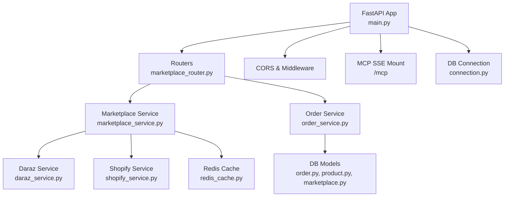
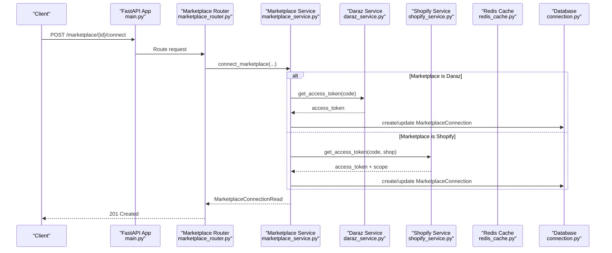
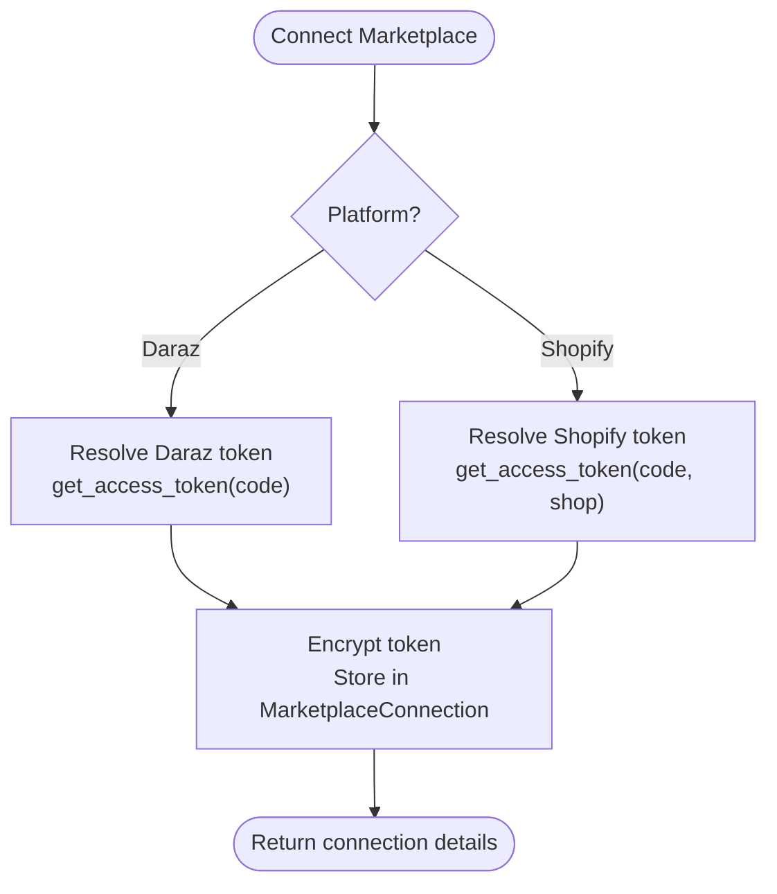
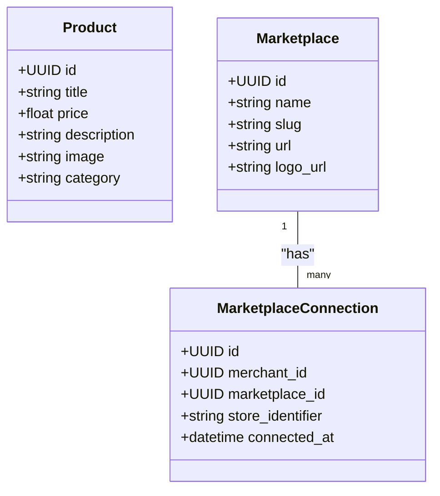
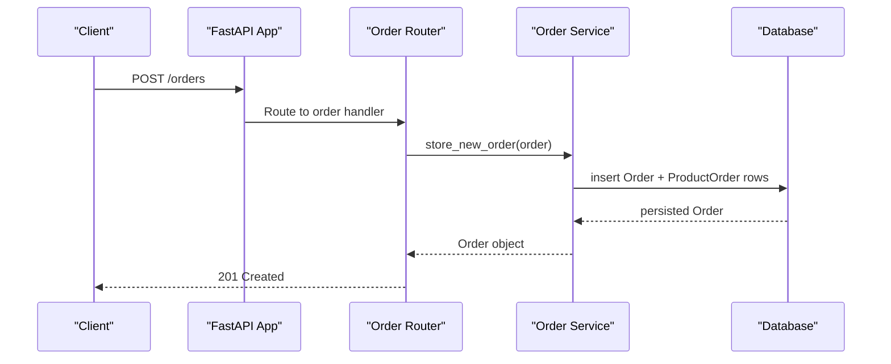
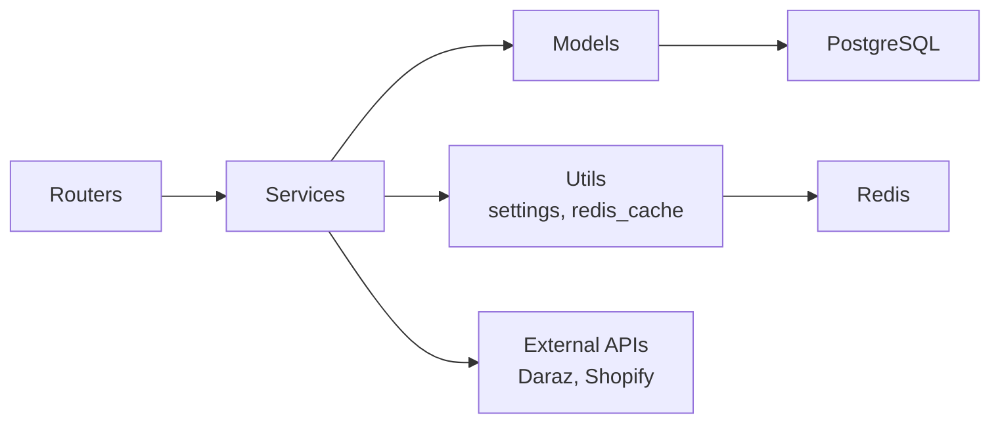

# Project Overview

<cite>
**Referenced Files in This Document**
- [README.md](file://README.md)
- [pyproject.toml](file://pyproject.toml)
- [main.py](file://neurocom_backend/main.py)
- [connection.py](file://neurocom_backend/database/connection.py)
- [settings.py](file://neurocom_backend/utils/settings.py)
- [marketplace.py](file://neurocom_backend/database/models/marketplace.py)
- [product.py](file://neurocom_backend/database/models/product.py)
- [order.py](file://neurocom_backend/database/models/order.py)
- [marketplace_service.py](file://neurocom_backend/services/marketplace_service.py)
- [daraz_service.py](file://neurocom_backend/services/daraz_service.py)
- [shopify_service.py](file://neurocom_backend/services/shopify_service.py)
- [order_service.py](file://neurocom_backend/services/order_service.py)
- [redis_cache.py](file://neurocom_backend/utils/redis_cache.py)
- [marketplace_router.py](file://neurocom_backend/routers/marketplace_router.py)
</cite>

## Table of Contents
1. Introduction
2. Project Structure
3. Core Components
4. Architecture Overview
5. Detailed Component Analysis
6. Dependency Analysis
7. Performance Considerations
8. Troubleshooting Guide
9. Conclusion

## Introduction
Tijarah AI Backend is a multi-marketplace e-commerce backend that centralizes product, order, and analytics operations across platforms such as Daraz and Shopify while providing AI-powered customer support capabilities. It exposes a FastAPI-based API surface for marketplace integrations, product management, order processing, reviews, forecasting, and storage, with Redis-backed caching to reduce external API load and improve response times. The system uses SQLModel for database modeling and persistence, and integrates LangChain and related libraries to power conversational agents and intelligent workflows.

Key goals:
- Unify multiple marketplaces behind a single API
- Provide robust product and order lifecycle management
- Enable AI-driven customer support via SSE/WebSocket patterns
- Cache expensive marketplace calls using Redis to ensure performance

## Project Structure
The application follows a layered structure:
- Entry point and routing: FastAPI app initialization, middleware, CORS, and router registration
- Database layer: SQLModel models and connection utilities with migrations
- Services: Business logic for marketplace integrations (Daraz, Shopify), orders, products, reviews, insights, and storage
- Routers: REST endpoints grouped by feature
- Utilities: Settings, security, Redis cache helpers, and server-sent events (SSE) support
- MCP server integration: Mounted under /mcp for streaming agent interactions

**Diagram sources**
- [main.py:16-37](file://neurocom_backend/main.py#L16-L37)
- [marketplace_router.py:31-118](file://neurocom_backend/routers/marketplace_router.py#L31-L118)
- [marketplace_service.py:1-302](file://neurocom_backend/services/marketplace_service.py#L1-L302)
- [daraz_service.py:1-120](file://neurocom_backend/services/daraz_service.py#L1-L120)
- [shopify_service.py:1-120](file://neurocom_backend/services/shopify_service.py#L1-L120)
- [order_service.py:1-46](file://neurocom_backend/services/order_service.py#L1-L46)
- [connection.py:1-28](file://neurocom_backend/database/connection.py#L1-L28)
- [redis_cache.py:1-204](file://neurocom_backend/utils/redis_cache.py#L1-L204)

**Section sources**
- [README.md:1-6](file://README.md#L1-L6)
- [pyproject.toml:1-40](file://pyproject.toml#L1-L40)
- [main.py:16-37](file://neurocom_backend/main.py#L16-L37)

## Core Components
- Application bootstrap and routing:
  - FastAPI app with lifespan for migrations, CORS middleware, and router inclusion
  - Mounts an SSE-based MCP server at /mcp
- Data models:
  - Marketplace entities and connections with unique constraints per merchant/store
  - Product and Order models with relationships
- Services:
  - Marketplace service orchestrates connecting/disconnecting stores and publishing to connected stores
  - Daraz service handles OAuth token exchange, product listing, categories, images migration, and review scraping with caching
  - Shopify service provides GraphQL-based product, order, category, and collection operations with caching
  - Order service manages CRUD for orders and line items
- Caching:
  - Redis-backed cache-aside with background stale-while-revalidate to minimize upstream API calls
- Configuration:
  - Centralized settings for JWT, Redis, marketplace credentials, and Supabase storage

**Section sources**
- [main.py:16-37](file://neurocom_backend/main.py#L16-L37)
- [marketplace.py:17-41](file://neurocom_backend/database/models/marketplace.py#L17-L41)
- [product.py:13-21](file://neurocom_backend/database/models/product.py#L13-L21)
- [order.py:21-39](file://neurocom_backend/database/models/order.py#L21-L39)
- [marketplace_service.py:99-161](file://neurocom_backend/services/marketplace_service.py#L99-L161)
- [daraz_service.py:40-100](file://neurocom_backend/services/daraz_service.py#L40-L100)
- [shopify_service.py:87-121](file://neurocom_backend/services/shopify_service.py#L87-L121)
- [order_service.py:9-46](file://neurocom_backend/services/order_service.py#L9-L46)
- [redis_cache.py:152-204](file://neurocom_backend/utils/redis_cache.py#L152-L204)
- [settings.py:11-29](file://neurocom_backend/utils/settings.py#L11-L29)

## Architecture Overview
The system exposes REST APIs through FastAPI routers. Requests are authenticated and routed to services that interact with external marketplaces (Daraz, Shopify) and the local database. Redis is used to cache marketplace responses and reduce latency. An SSE endpoint under /mcp enables streaming agent interactions for AI-powered customer support.

**Diagram sources**
- [main.py:80-89](file://neurocom_backend/main.py#L80-L89)
- [marketplace_router.py:105-118](file://neurocom_backend/routers/marketplace_router.py#L105-L118)
- [marketplace_service.py:236-280](file://neurocom_backend/services/marketplace_service.py#L236-L280)
- [daraz_service.py:40-46](file://neurocom_backend/services/daraz_service.py#L40-L46)
- [shopify_service.py:87-121](file://neurocom_backend/services/shopify_service.py#L87-L121)
- [connection.py:15-23](file://neurocom_backend/database/connection.py#L15-L23)

## Detailed Component Analysis

### Marketplace Integration (Daraz and Shopify)
- Connection flow:
  - Accepts OAuth code or direct access token
  - Resolves platform-specific tokens and store identifiers
  - Encrypts and persists credentials in MarketplaceConnection
- Publishing:
  - Provides endpoints to publish products to all connected stores
- Caching:
  - Uses Redis to cache product listings and orders with background refresh to avoid repeated heavy transforms

**Diagram sources**
- [marketplace_service.py:236-280](file://neurocom_backend/services/marketplace_service.py#L236-L280)
- [daraz_service.py:40-46](file://neurocom_backend/services/daraz_service.py#L40-L46)
- [shopify_service.py:87-121](file://neurocom_backend/services/shopify_service.py#L87-L121)

**Section sources**
- [marketplace_service.py:99-161](file://neurocom_backend/services/marketplace_service.py#L99-L161)
- [marketplace_service.py:236-280](file://neurocom_backend/services/marketplace_service.py#L236-L280)
- [marketplace_router.py:36-118](file://neurocom_backend/routers/marketplace_router.py#L36-L118)

### Product Management
- Daraz:
  - Fetches all products with caching; cleans HTML descriptions and validates models
  - Supports image migration/upload and category attribute handling
- Shopify:
  - GraphQL-based product retrieval with pagination and flattening
  - Creates products, updates variants, sets inventory, and publishes to online store
- Local model:
  - Simple Product entity for internal use

**Diagram sources**
- [product.py:13-21](file://neurocom_backend/database/models/product.py#L13-L21)
- [marketplace.py:17-41](file://neurocom_backend/database/models/marketplace.py#L17-L41)

**Section sources**
- [daraz_service.py:55-100](file://neurocom_backend/services/daraz_service.py#L55-L100)
- [daraz_service.py:391-446](file://neurocom_backend/services/daraz_service.py#L391-L446)
- [shopify_service.py:168-230](file://neurocom_backend/services/shopify_service.py#L168-L230)
- [shopify_service.py:329-469](file://neurocom_backend/services/shopify_service.py#L329-L469)
- [product.py:13-21](file://neurocom_backend/database/models/product.py#L13-L21)

### Order Processing
- Order model supports statuses like pending, processing, shipped, delivered, cancelled, return_requested, returned, refunded
- Services provide create, update, delete, and retrieval operations
- Integrates with marketplace order data (e.g., Shopify orders) via services and caches

**Diagram sources**
- [order_service.py:9-14](file://neurocom_backend/services/order_service.py#L9-L14)
- [order.py:21-39](file://neurocom_backend/database/models/order.py#L21-L39)

**Section sources**
- [order_service.py:9-46](file://neurocom_backend/services/order_service.py#L9-L46)
- [order.py:11-39](file://neurocom_backend/database/models/order.py#L11-L39)

### Analytics and Reviews
- Daraz reviews:
  - Scrapes full review history from storefront when needed
  - Caches results to avoid repeated network calls
- Shopify orders:
  - Retrieves orders with pagination and caches them
- Insights and forecasting:
  - Routers exist for insights and forecasting; business logic resides in corresponding services

**Section sources**
- [daraz_service.py:147-252](file://neurocom_backend/services/daraz_service.py#L147-L252)
- [shopify_service.py:472-575](file://neurocom_backend/services/shopify_service.py#L472-L575)

### AI-Powered Customer Support (MCP/SSE)
- The MCP server is mounted under /mcp and can be accessed via SSE for streaming agent interactions
- The main app includes SSE-related imports and mounting logic
- WebSocket chat endpoints are present but commented out; SSE is the active streaming path

**Section sources**
- [main.py:7-8](file://neurocom_backend/main.py#L7-L8)
- [main.py:37-45](file://neurocom_backend/main.py#L37-L45)

## Dependency Analysis
- External dependencies:
  - FastAPI, Uvicorn, Pydantic, SQLAlchemy/SQLModel, PostgreSQL driver
  - OpenAI, LangChain ecosystem, ChromaDB, Google GenAI
  - Redis client for caching
  - Requests for HTTP calls
  - Cryptography and password hashing utilities
- Internal dependencies:
  - Routers depend on services
  - Services depend on database models and utilities (settings, redis_cache)
  - Marketplace service depends on platform-specific services (Daraz, Shopify)

**Diagram sources**
- [pyproject.toml:8-35](file://pyproject.toml#L8-L35)
- [marketplace_service.py:1-302](file://neurocom_backend/services/marketplace_service.py#L1-L302)
- [redis_cache.py:1-204](file://neurocom_backend/utils/redis_cache.py#L1-L204)
- [connection.py:1-28](file://neurocom_backend/database/connection.py#L1-L28)

**Section sources**
- [pyproject.toml:8-35](file://pyproject.toml#L8-L35)
- [settings.py:11-29](file://neurocom_backend/utils/settings.py#L11-L29)

## Performance Considerations
- Redis-backed caching:
  - Cache-aside pattern with background stale-while-revalidate reduces upstream API latency
  - Content hashing ensures only changed payloads trigger expensive transforms
- Efficient marketplace calls:
  - Pagination for Shopify GraphQL queries
  - Batched image migration and upload for Daraz
- Concurrency:
  - ThreadPoolExecutor used for fetching reviews in parallel
- TTL configuration:
  - Configurable TTLs for marketplace caches via environment variables

[No sources needed since this section provides general guidance]

## Troubleshooting Guide
Common issues and resolutions:
- Missing or invalid marketplace credentials:
  - Ensure OAuth codes or access tokens are provided and valid
  - Verify environment variables for API keys and secrets
- Redis connectivity:
  - Check host, port, username, password, and SSL settings
  - Validate socket timeouts and availability
- Database migrations:
  - Confirm migrations run at startup and tables exist
  - Inspect dialect-specific adjustments for constraints
- External API errors:
  - Handle HTTP exceptions raised by marketplace services
  - Review error messages for userErrors or gateway failures

**Section sources**
- [settings.py:11-29](file://neurocom_backend/utils/settings.py#L11-L29)
- [connection.py:15-23](file://neurocom_backend/database/connection.py#L15-L23)
- [shopify_service.py:41-68](file://neurocom_backend/services/shopify_service.py#L41-L68)
- [daraz_service.py:254-265](file://neurocom_backend/services/daraz_service.py#L254-L265)

## Conclusion
Tijarah AI Backend provides a robust foundation for managing multi-marketplace e-commerce operations with AI-powered support. Its FastAPI architecture, clear separation of concerns, and Redis caching strategy deliver scalable performance. With integrated marketplace connectors for Daraz and Shopify, comprehensive product and order management, and extensible AI components, it serves as a central hub in the e-commerce ecosystem.

[No sources needed since this section summarizes without analyzing specific files]