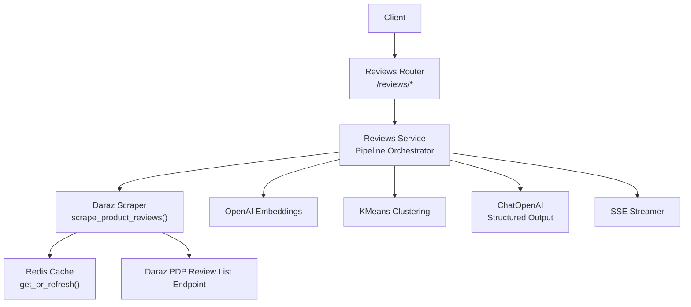
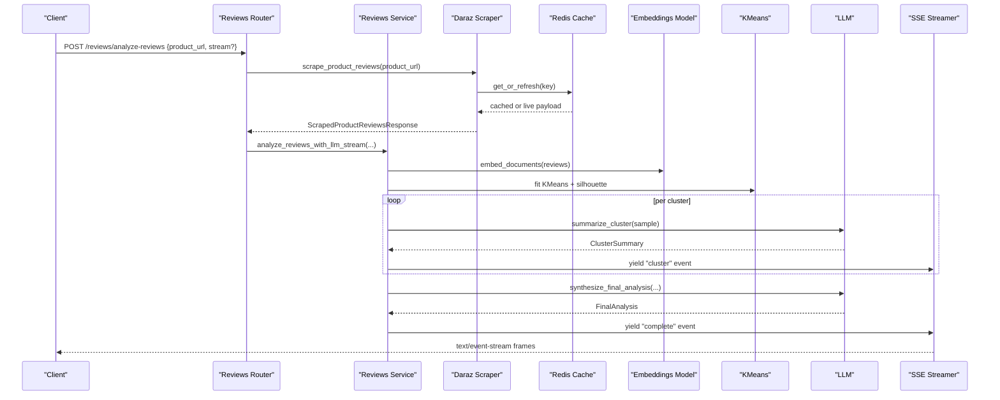
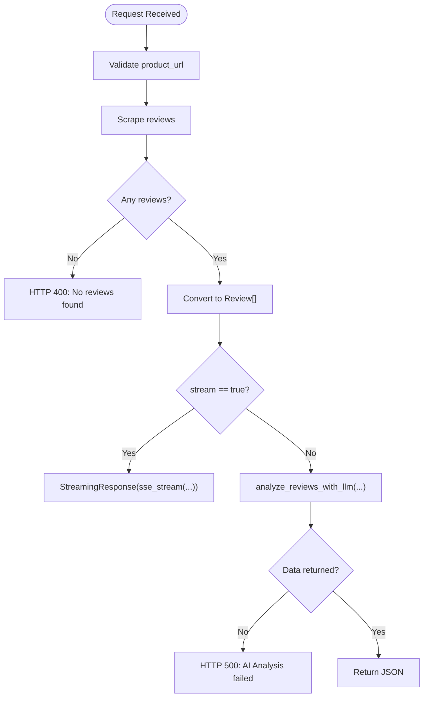
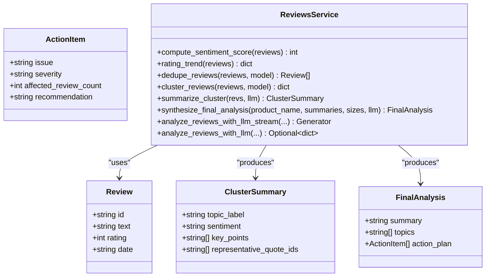
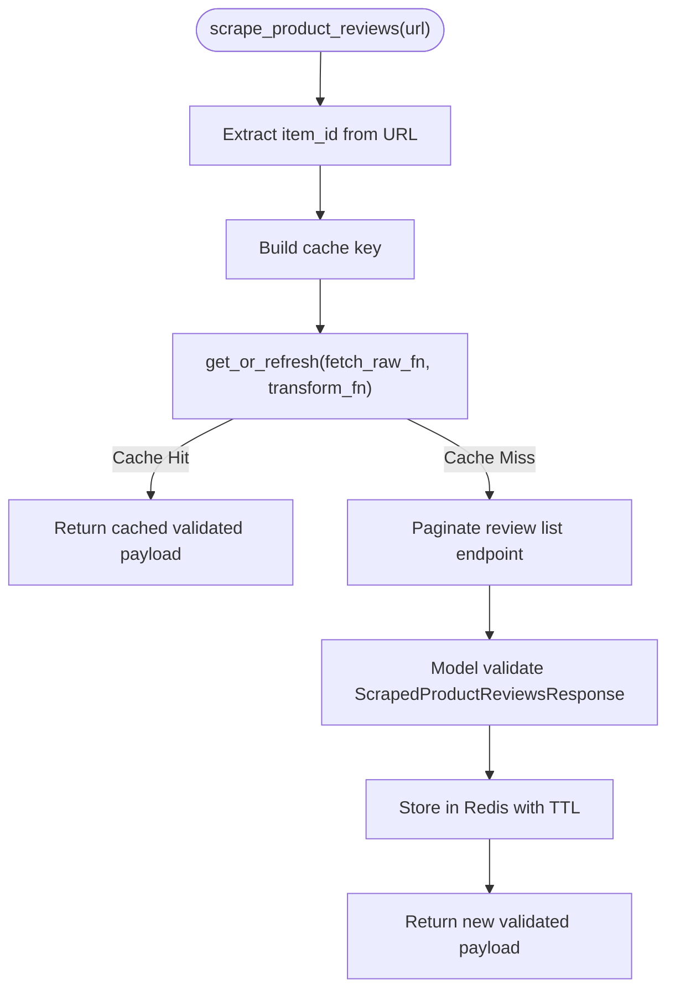
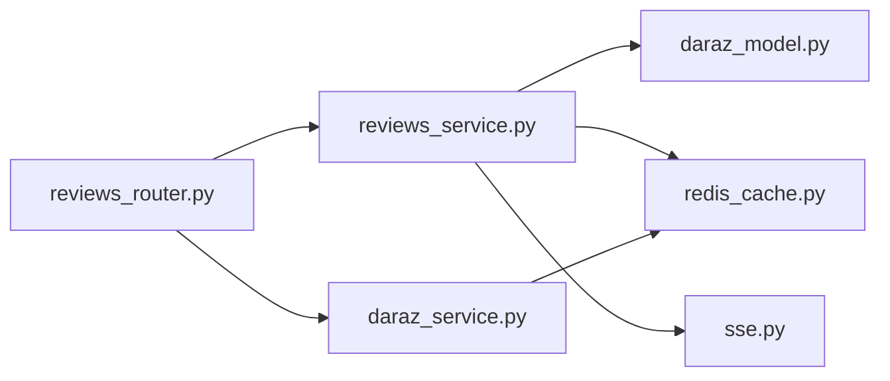

# Reviews & Ratings

<cite>
**Referenced Files in This Document**
- [reviews_router.py](file://neurocom_backend/routers/reviews_router.py)
- [reviews_service.py](file://neurocom_backend/services/reviews_service.py)
- [review_model.py](file://neurocom_backend/models/review_model.py)
- [daraz_service.py](file://neurocom_backend/services/daraz_service.py)
- [daraz_model.py](file://neurocom_backend/models/daraz_model.py)
- [redis_cache.py](file://neurocom_backend/utils/redis_cache.py)
- [sse.py](file://neurocom_backend/utils/sse.py)
- [README.md](file://README.md)
</cite>

## Table of Contents
1. [Introduction](#introduction)
2. [Project Structure](#project-structure)
3. [Core Components](#core-components)
4. [Architecture Overview](#architecture-overview)
5. [Detailed Component Analysis](#detailed-component-analysis)
6. [Dependency Analysis](#dependency-analysis)
7. [Performance Considerations](#performance-considerations)
8. [Troubleshooting Guide](#troubleshooting-guide)
9. [Conclusion](#conclusion)
10. [Appendices](#appendices)

## Introduction
This document explains the Reviews & Ratings subsystem of the Tijarah AI Backend. It covers how reviews are aggregated from marketplaces, how ratings and sentiment are computed, how the system clusters and summarizes review content, and how results are streamed to clients. It also outlines moderation and spam detection capabilities present in the codebase, analytics outputs, export-friendly data structures, bulk operations patterns, and performance optimizations for large datasets. Finally, it provides guidelines for maintaining review quality and marketplace compliance based on implemented behaviors.

## Project Structure
The Reviews & Ratings feature is primarily implemented across:
- API layer: FastAPI router exposing endpoints for analysis and scraping
- Service layer: Orchestration pipeline for scraping, deduplication, clustering, LLM summarization, and synthesis
- Models: Pydantic schemas for requests, responses, and scraped marketplace data
- Utilities: Redis-backed caching and Server-Sent Events streaming helpers
- Marketplace integration: Daraz-specific scraping and model definitions

**Diagram sources**
- [reviews_router.py:1-42](file://neurocom_backend/routers/reviews_router.py#L1-L42)
- [reviews_service.py:1-304](file://neurocom_backend/services/reviews_service.py#L1-L304)
- [daraz_service.py:180-252](file://neurocom_backend/services/daraz_service.py#L180-L252)
- [redis_cache.py:152-204](file://neurocom_backend/utils/redis_cache.py#L152-L204)
- [sse.py:18-33](file://neurocom_backend/utils/sse.py#L18-L33)

**Section sources**
- [reviews_router.py:1-42](file://neurocom_backend/routers/reviews_router.py#L1-L42)
- [reviews_service.py:1-304](file://neurocom_backend/services/reviews_service.py#L1-L304)
- [daraz_service.py:180-252](file://neurocom_backend/services/daraz_service.py#L180-L252)
- [redis_cache.py:152-204](file://neurocom_backend/utils/redis_cache.py#L152-L204)
- [sse.py:18-33](file://neurocom_backend/utils/sse.py#L18-L33)

## Core Components
- Reviews Router: Exposes POST /reviews/analyze-reviews that accepts a product URL and optional streaming mode. It scrapes reviews, validates input, and delegates to the service pipeline.
- Reviews Service: Implements a scalable map-reduce pipeline:
  - Deterministic metrics: sentiment score (normalized average rating), monthly rating trends
  - Deduplication: embedding-based similarity to remove near-duplicate/spammy reviews
  - Clustering: KMeans over embeddings with silhouette scoring to find topics at scale
  - Map step: summarize each cluster via structured LLM output
  - Reduce step: synthesize final analysis including summary, topics, and action plan
  - Streaming: yields intermediate events (score, progress, per-cluster summaries, complete)
- Scraping Layer: Fetches full review history from Daraz’s public PDP review list endpoint with pagination and caches results.
- Caching: Redis-backed cache-aside with background stale-while-revalidate to reduce upstream calls and expensive transforms.
- Streaming: SSE helper formats generator events into wire frames for real-time UI updates.

**Section sources**
- [reviews_router.py:17-42](file://neurocom_backend/routers/reviews_router.py#L17-L42)
- [reviews_service.py:105-230](file://neurocom_backend/services/reviews_service.py#L105-L230)
- [reviews_service.py:236-304](file://neurocom_backend/services/reviews_service.py#L236-L304)
- [daraz_service.py:190-252](file://neurocom_backend/services/daraz_service.py#L190-L252)
- [redis_cache.py:152-204](file://neurocom_backend/utils/redis_cache.py#L152-L204)
- [sse.py:18-33](file://neurocom_backend/utils/sse.py#L18-L33)

## Architecture Overview
The end-to-end flow for analyzing product reviews:

**Diagram sources**
- [reviews_router.py:17-42](file://neurocom_backend/routers/reviews_router.py#L17-L42)
- [reviews_service.py:236-304](file://neurocom_backend/services/reviews_service.py#L236-L304)
- [daraz_service.py:190-252](file://neurocom_backend/services/daraz_service.py#L190-L252)
- [redis_cache.py:152-204](file://neurocom_backend/utils/redis_cache.py#L152-L204)
- [sse.py:18-33](file://neurocom_backend/utils/sse.py#L18-L33)

## Detailed Component Analysis

### Reviews Router
- Endpoint: POST /reviews/analyze-reviews
- Input: product_url, product_name, optional stream flag
- Behavior:
  - Scrapes reviews using Daraz scraper; raises 400 if no reviews found
  - Converts scraped data into internal Review objects
  - If stream is true, returns a Server-Sent Events response; otherwise returns a single JSON response
  - Raises 500 if AI analysis fails to produce data

**Diagram sources**
- [reviews_router.py:17-42](file://neurocom_backend/routers/reviews_router.py#L17-L42)

**Section sources**
- [reviews_router.py:17-42](file://neurocom_backend/routers/reviews_router.py#L17-L42)

### Reviews Service Pipeline
Key stages:
- Deterministic metrics:
  - compute_sentiment_score: weighted average of star ratings normalized to 0–100
  - rating_trend: monthly averages by parsed dates
- Deduplication:
  - dedupe_reviews: embedding similarity matrix to remove near-duplicates above threshold
- Clustering:
  - cluster_reviews: KMeans with silhouette scoring to select optimal k; groups all reviews into topic clusters
- Map:
  - summarize_cluster: bounded sample per cluster sent to LLM with structured output schema
- Reduce:
  - synthesize_final_analysis: compact context of cluster summaries to produce executive summary, topics, and action plan
- Streaming:
  - analyze_reviews_with_llm_stream: yields events for score, progress, per-cluster summaries, and final complete payload
  - Non-streaming wrapper drains stream to return final result

**Diagram sources**
- [reviews_service.py:38-98](file://neurocom_backend/services/reviews_service.py#L38-L98)
- [reviews_service.py:105-230](file://neurocom_backend/services/reviews_service.py#L105-L230)
- [reviews_service.py:236-304](file://neurocom_backend/services/reviews_service.py#L236-L304)

**Section sources**
- [reviews_service.py:105-230](file://neurocom_backend/services/reviews_service.py#L105-L230)
- [reviews_service.py:236-304](file://neurocom_backend/services/reviews_service.py#L236-L304)

### Scraping Layer (Daraz)
- Uses Daraz’s public PDP review list endpoint to fetch full review history without rolling window limits
- Paginates until an empty page is encountered; caps pages to prevent runaway loops
- Normalizes and validates payloads into ScrapedProductReviewsResponse
- Caches results via Redis to avoid repeated scraping for the same item_id

**Diagram sources**
- [daraz_service.py:190-252](file://neurocom_backend/services/daraz_service.py#L190-L252)
- [redis_cache.py:152-204](file://neurocom_backend/utils/redis_cache.py#L152-L204)

**Section sources**
- [daraz_service.py:190-252](file://neurocom_backend/services/daraz_service.py#L190-L252)
- [redis_cache.py:152-204](file://neurocom_backend/utils/redis_cache.py#L152-L204)

### Data Models
- AnalysisRequest: product_url, product_name, stream flag
- ReviewAnalysisResponse: sentiment_score, rating_trend, summary, topics, action_plan, cluster_debug
- ScrapedProductReview and ScrapedProductReviewsResponse: marketplace review fields and container

These models define the contract between router, service, and client, ensuring consistent serialization and validation.

**Section sources**
- [review_model.py:4-25](file://neurocom_backend/models/review_model.py#L4-L25)
- [daraz_model.py:291-316](file://neurocom_backend/models/daraz_model.py#L291-L316)

## Dependency Analysis
- Router depends on:
  - Services: reviews_service, daraz_service
  - Models: review_model
  - Utilities: sse
- Service depends on:
  - External libraries: OpenAI embeddings and chat models, scikit-learn clustering
  - Models: daraz_model for scraped review shapes
  - Utilities: redis_cache for caching
- Scraping depends on:
  - HTTP client to call Daraz PDP review endpoint
  - Redis cache for performance and rate-limit mitigation

**Diagram sources**
- [reviews_router.py:1-42](file://neurocom_backend/routers/reviews_router.py#L1-L42)
- [reviews_service.py:1-304](file://neurocom_backend/services/reviews_service.py#L1-L304)
- [daraz_service.py:180-252](file://neurocom_backend/services/daraz_service.py#L180-L252)
- [redis_cache.py:152-204](file://neurocom_backend/utils/redis_cache.py#L152-L204)
- [sse.py:18-33](file://neurocom_backend/utils/sse.py#L18-L33)

**Section sources**
- [reviews_router.py:1-42](file://neurocom_backend/routers/reviews_router.py#L1-L42)
- [reviews_service.py:1-304](file://neurocom_backend/services/reviews_service.py#L1-L304)
- [daraz_service.py:180-252](file://neurocom_backend/services/daraz_service.py#L180-L252)
- [redis_cache.py:152-204](file://neurocom_backend/utils/redis_cache.py#L152-L204)
- [sse.py:18-33](file://neurocom_backend/utils/sse.py#L18-L33)

## Performance Considerations
- Deterministic math for sentiment and trends avoids unnecessary LLM calls and improves accuracy
- Embedding-based deduplication reduces token usage and prevents spam/templated reviews from skewing results
- KMeans clustering enables handling thousands of reviews by grouping them into topics; only small samples per cluster are sent to LLM
- Bounded sampling per cluster keeps cost and latency predictable regardless of total review count
- Redis cache-aside with background stale-while-revalidate minimizes upstream calls and expensive transforms
- SSE streaming allows progressive rendering of results without waiting for full completion
- Pagination cap and safe stop conditions protect against unexpected always-non-empty responses

[No sources needed since this section provides general guidance]

## Troubleshooting Guide
Common issues and mitigations:
- No reviews found:
  - Ensure product URL contains a valid item ID; router raises 400 when scraping returns no reviews
  - Check network connectivity and Daraz endpoint availability
- AI Analysis failed:
  - Router raises 500 when service returns no data; verify LLM configuration and availability
- Streaming errors:
  - SSE helper wraps exceptions into an error event; inspect client-side error handling
- Rate limits or slow responses:
  - Leverage Redis cache; ensure keys are unique per merchant/token via fingerprinting
  - Adjust TTL and background refresh settings as needed

**Section sources**
- [reviews_router.py:17-42](file://neurocom_backend/routers/reviews_router.py#L17-L42)
- [sse.py:18-33](file://neurocom_backend/utils/sse.py#L18-L33)
- [redis_cache.py:152-204](file://neurocom_backend/utils/redis_cache.py#L152-L204)

## Conclusion
The Reviews & Ratings subsystem provides a robust, scalable pipeline for aggregating marketplace reviews, computing reliable sentiment metrics, detecting spam-like duplicates, clustering topics, and synthesizing actionable insights. It integrates seamlessly with Daraz’s public endpoints, uses Redis caching for performance, and streams results to clients for responsive user experiences. The design emphasizes deterministic calculations where possible, bounded LLM usage, and clear provenance through cluster debug information.

[No sources needed since this section summarizes without analyzing specific files]

## Appendices

### API Endpoints Summary
- POST /reviews/analyze-reviews
  - Request: product_url, product_name, stream (optional)
  - Response: ReviewAnalysisResponse or SSE stream with events: score, progress, cluster, complete
- GET /daraz/scrape_product_reviews
  - Request: product_url
  - Response: ScrapedProductReviewsResponse

**Section sources**
- [reviews_router.py:17-42](file://neurocom_backend/routers/reviews_router.py#L17-L42)
- [daraz_router.py:123-125](file://neurocom_backend/routers/daraz_router.py#L123-L125)

### Moderation and Spam Detection
- Near-duplicate detection via embeddings removes templated or spammy reviews before clustering
- Representative quote IDs provide provenance for each cluster, enabling manual review and moderation workflows
- Severity classification in action items helps prioritize high-impact issues

**Section sources**
- [reviews_service.py:134-148](file://neurocom_backend/services/reviews_service.py#L134-L148)
- [reviews_service.py:187-199](file://neurocom_backend/services/reviews_service.py#L187-L199)

### Analytics and Export
- Rating trend by month supports time-series analytics and early issue detection
- Action plan includes affected_review_count and recommendations for operational follow-up
- cluster_debug maps cluster labels to sizes and topic labels for auditability and export

**Section sources**
- [reviews_service.py:113-127](file://neurocom_backend/services/reviews_service.py#L113-L127)
- [reviews_service.py:282-292](file://neurocom_backend/services/reviews_service.py#L282-L292)

### Bulk Operations Patterns
- While the current endpoint targets a single product URL, the pipeline can be extended to batch multiple URLs by iterating the same scraping and analysis steps
- Use Redis caching to avoid redundant work across products sharing similar item IDs or content
- For very large sets, consider asynchronous task queues to parallelize scraping and analysis while respecting rate limits

[No sources needed since this section provides general guidance]

### Compliance Guidelines
- Respect marketplace terms of service when scraping; use official APIs where available
- Avoid storing sensitive buyer information beyond what is necessary; sanitize or anonymize as required
- Provide mechanisms for merchants to review and act on flagged issues identified by the system

[No sources needed since this section provides general guidance]